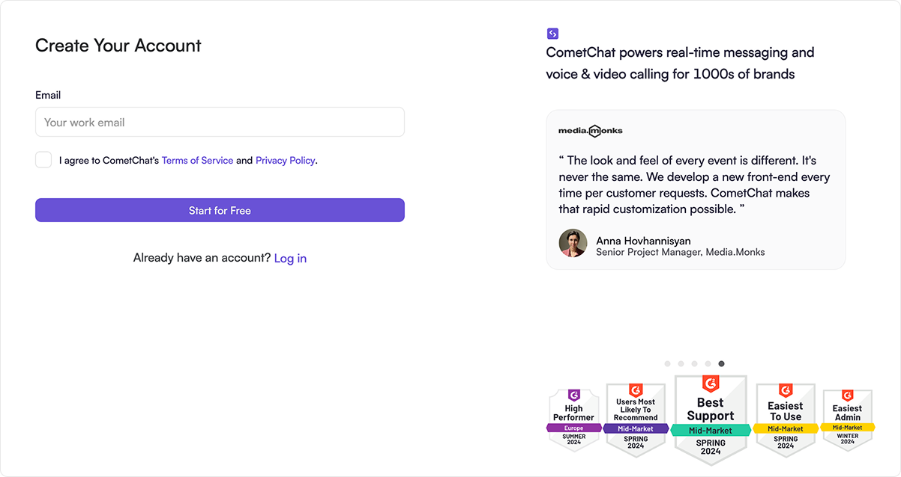
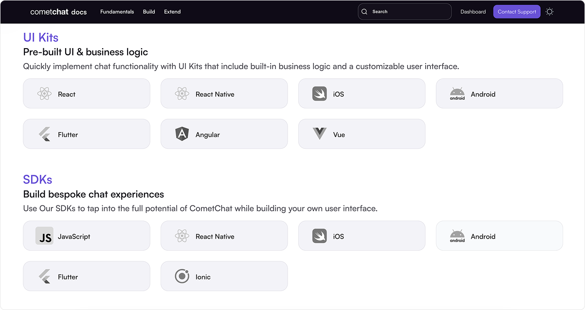
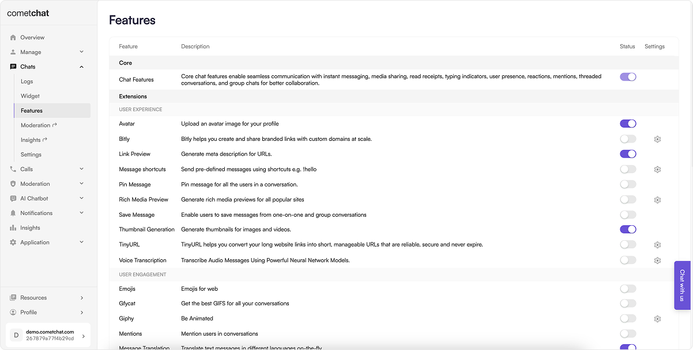
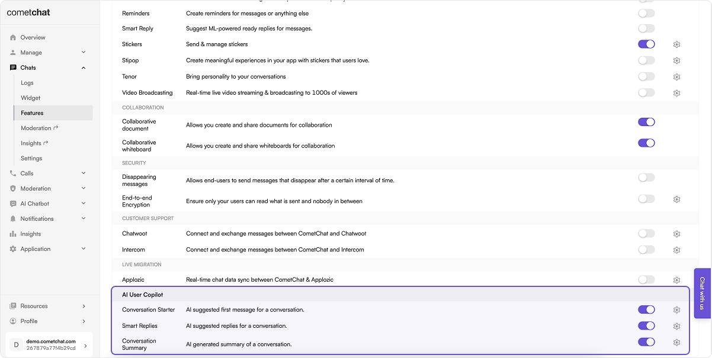
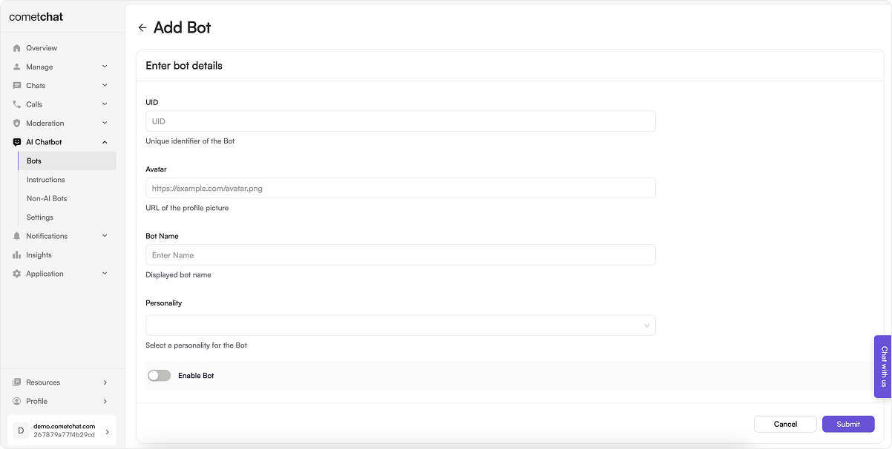

### 1. Complete the Signup Process

  

- [Create a free account](https://app.cometchat.com/signup) with CometChat.
- Familiarize yourself with the [key concepts](./key-concepts).
- Send invitations to other developers, product owners for collaboration.

### 2. Integrate the chosen UI Kit or SDK into your application

  

- Choose to integration CometChat in your app either by using UI Kits or SDKs.
- Have a look at our Sample apps for quickly checking out features and functionalities.
- UI Kits: [React](/ui-kit/react/v6/overview), [React Native](/ui-kit/react-native/overview), [iOS](/ui-kit/ios/v5/overview), [Android](/ui-kit/android/v5/overview), [Flutter](/ui-kit/flutter/overview), [Angular](/ui-kit/angular/overview), [Vue](/ui-kit/vue/overview)   
  SDKs: [JavaScript](/sdk/javascript/overview), [React Native](/sdk/react-native/overview), [iOS](/sdk/ios/overview), [Android](/sdk/android/overview), [Flutter](/sdk/flutter/overview), [Ionic/Capacitor](/sdk/ionic/overview)
  & [Sample apps](https://github.com/cometchat)

### 3. Synchronize users and groups utilizing the APIs

- This step involves the backend side of implementation.
- When a new user signs up in your system, create the corresponding user's entry with CometChat using APIs.
- Whenever a user's details are updated in your system, synchronize them with CometChat.
- [Create users API](https://api-explorer.cometchat.com/reference/creates-user)  
- [Update users API](https://api-explorer.cometchat.com/reference/update-user)

### 4. Enable necessary extensions

  

- Enable extensions like [Thumbnail generator](/extensions/thumbnail-generation), [Message translation](/extensions/message-translation), etc.
- Implement the frontend for these [extensions](/extensions/overview) in case the implementation does not exist.

### 5. Implement Push notifications

- Drive user engagement in your applications through the integration of [Push Notifications](/notifications/push-overview).

### 6. Integrate CometChat AI

  

- Ignite natural and organic converstaions between your users.
- [CometChat AI](/fundamentals/ai-user-copilot/overview)

### 7. Set up bots

  

- [Bots](/ai-chatbots/overview) are unique users capable of autonomously sending and receiving messages. You can define a bot's behaviour by implementing and exposing your business logic using Callback URLs.

### 7. Set up webhooks

  

- [Webhooks](/fundamentals/webhooks-overview) faciliate real-time event-driven communication with your system, enabling you to receive HTTP POST requests from CometChat that carry details about different events.

### 9. Secure user logins with authentication tokens

- Ensuring safe and secure authentication of users in CometChat is crucial. Achieve this by utilizing [auth tokens](https://api-explorer.cometchat.com/reference/create-authtoken).
- Generate and retrieve the [auth token](https://api-explorer.cometchat.com/reference/create-authtoken) through your backend system, then supply it to the frontend.

### 10. Set up data import and migration

- To seamlessly transition from your existing chat solution to CometChat's comprehensive solution, you will need to [import your existing data](./import-historical-data) as well as migrate the [live data](./live-data-migration) to CometChat.

### 11. Launch your applications with the new messaging capabilities

- Delete default/test users and groups.
- Select a correct billing plan.
- Go live with your apps powered by CometChat.
- [CometChat Dashboard](https://app.cometchat.com).
