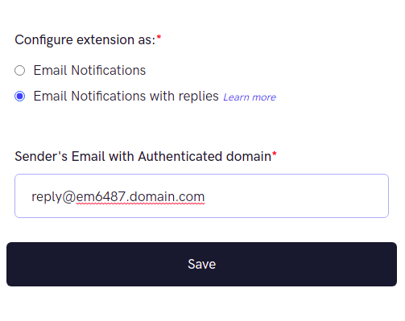
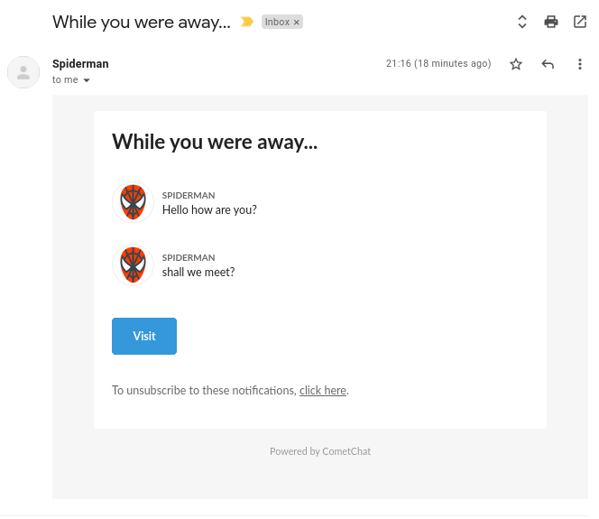
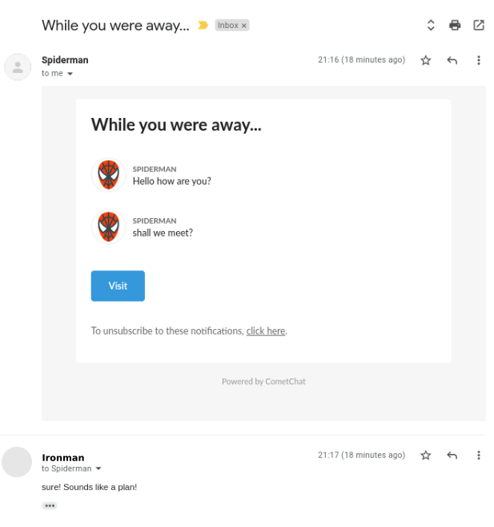
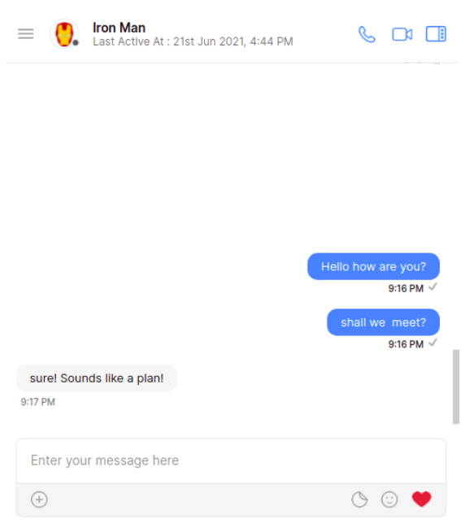

import Tabs from '@theme/Tabs';
import TabItem from '@theme/TabItem';

## About the extension

The Email Replies adds extra functionality to the Email Notifications extension by enabling the receiver of the Email Notification to respond to the conversation by directly replying to the email.

## Pre-requisite

To start using Email Notifications with Replies, you need to first enable and save the settings for Email Notifications extension. [Learn more](./email-notifications).

Once it is set up, you can come back and proceed from here.

## SendGrid Setup

### SendGrid Inbound parse webhook

Once your Domain Authentication is successful, you need to set up the Inbound parse. You need to add the MX record to your Domain name provider. More details about Inbound parsing can be found [here](https://sendgrid.com/docs/for-developers/parsing-email/setting-up-the-inbound-parse-webhook/).

The Webhook URL will be as follows:

For apps in the US region:

<Tabs>
<TabItem value="HTTP" label="HTTP">

```http
https://email-notification-us.cometchat.io/v1/reply
```
</TabItem>
</Tabs>


For apps in the EU region:

<Tabs>
<TabItem value="HTTP" label="HTTP">

```http
https://email-notification-eu.cometchat.io/v1/reply
```
</TabItem>
</Tabs>

For apps in the IN region:

<Tabs>
<TabItem value="HTTP" label="HTTP">

```http
https://email-notification-in.cometchat.io/v1/reply
```
</TabItem>
</Tabs>


Before saving the Inbound Host and URL:

1. Uncheck **Spam Check** checkbox.
2. Uncheck **Send Raw** checkbox.

## Extension Settings

1. Login to [CometChat](https://app.cometchat.com/login) and select your app.
2. Go to the Extensions section and enable the Email replies extension.
3. Open up the settings page for this extension.
4. Select _Email replies_ option and enter the sender Email ID.
5. Save your settings.

:::info
When adding Sender's Email in the settings, please make sure that it does not have "+" in it.
:::



## Save users' Email IDs

You can use our  to set private metadata for a user. We recommend adding this code where you call our .

Alternatively, just for the sake of testing purposes, you can add this from the CometChat Dashboard as well.

1. Login to [CometChat](https://app.cometchat.com/login) and select your app.
2. Go to the "Users" section.
3. Select any user of your choice and select the "Profile" tab.
4. Paste the below JSON in the Metadata input box and hit Save.

The Metadata is a JSON that should have the `@private` key present and should have the value `email` specified for the user. The format for the private metadata must be as follows:

<Tabs>
<TabItem value="JSON" label="JSON">

```json
{
  "@private":
  {
    "email":"abc@xyz.com"
  }
}
```
</TabItem>
</Tabs>


## Respond via Email

Send a message to an offline user and watch them receive an email automagically.
Reply to the Email and receive a response in your chat.

## Send Reply via Email

Click on **Reply** button in your mailbox and the composer will open up. Type your message and hit send. Your message will be sent to the CometChat user as a response in the chat.







:::warning Warning
Do not add any other Email ID in To, Cc, or Bcc fields while replying.
:::