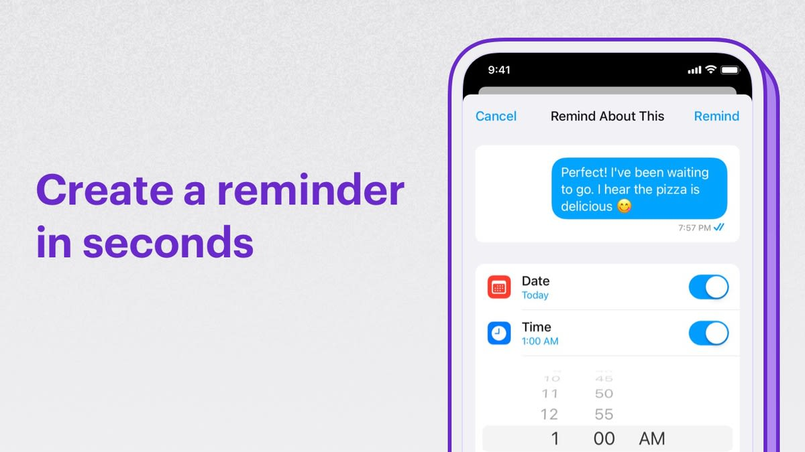
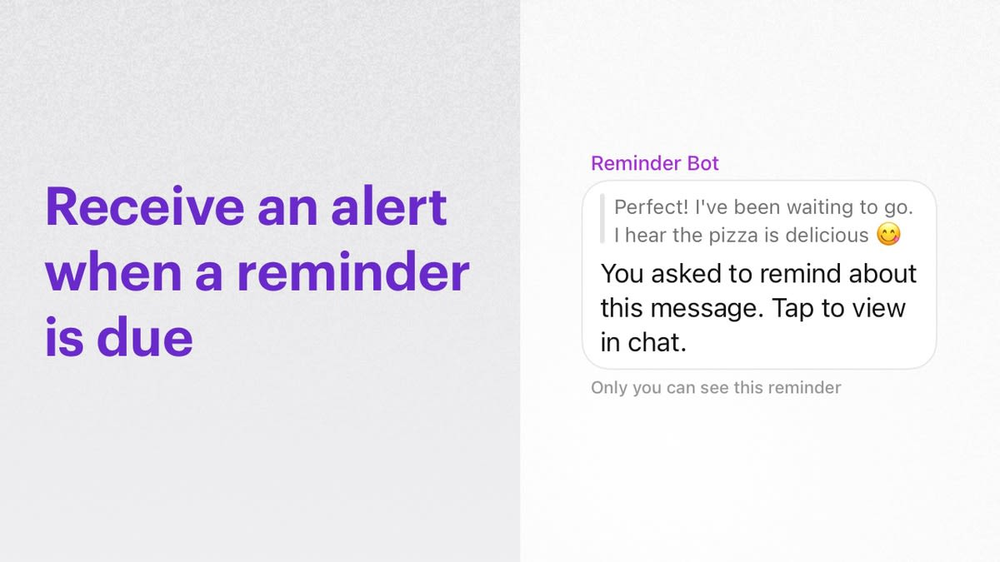

import Tabs from '@theme/Tabs';
import TabItem from '@theme/TabItem';

Create reminders for messages or anything else.



## Extension Settings

1. Login to [CometChat](https://app.cometchat.com/login) and select your app.
2. Go to the Extensions section and enable the Reminders extension.
3. Go to the Users section and create a new user with `cc_reminder_bot` as the UID. The name and Avatar can be of your choice.

:::info
 The `cc_reminder_bot` user should be available for your app in order to use the Reminders extension. There shouldn't be an existing user using the same `UID`.
:::

## How do reminders work?



Users can choose to be reminded about a message from a conversation or set some sort of custom personalized reminder.

When the reminder is due, `cc_reminder_bot` will send a message to the user.

Users can then list, edit or delete reminders.

### Set reminders

The following parameters are required for setting a reminder

| Parameter | Value | Description | 
| ---- | ---- | ---- | 
| `about` | Integer/String | `Integer` =&gt; For setting a message reminder.<br /><br />`String` =&gt; For setting a personal reminder. | 
| `isCustom` | Boolean | `false` =&gt; For setting a message reminder.<br /><br />`true` =&gt; For setting a personal reminder. | 
| `timeInMS` | Integer | Unix timestamp: (e.g.: `1638351344989`) | 


#### Message reminders

To set Message reminders, the `about` should be an integer corresponding to the message id. The `isCustom` value should be set to`false`.

In order to set the reminders, use the `CometChat.callExtension` method as shown below:

<Tabs>
<TabItem value="Javascript" label="Javascript">

```javascript
CometChat.callExtension('reminders', 'POST', 'v1/reminder', {
  about: 1,
  isCustom: false,
  timeInMS: 1638351344989
}).then(response => {
  // Reminder created successfully
  // Reminder details with reminderId.
}).catch(error => {
  // Some error occured
});
```

</TabItem>
<TabItem value="Java" label="Java">

```java
import org.json.simple.JSONObject;

JSONObject body=new JSONObject();
body.put("about", ID_OF_THE_MESSAGE);
body.put("isCustom", false);
body.put("timeInMS", 1638351344989);

CometChat.callExtension("reminders", "POST", "/v1/reminder", body,
	new CometChat.CallbackListener<JSONObject>() {
    @Override
    public void onSuccess(JSONObject responseObject) {
        // Reminder created successfully.
      	// Reminder details with reminderId.
    }

    @Override
    public void onError(CometChatException e) {
      	// Some error occured.
    }
});
```

</TabItem>
<TabItem value="Swift" label="Swift">

```swift
CometChat.callExtension(slug: "reminders", type: .post, endPoint: "v1/reminder", body: ["about":MESSAGE_ID, "isCustom":false, "timeInMS": 1638351344989], onSuccess: { (response) in
         // Reminder created successfully.
         // Reminder details with reminderId.
      }) { (error) in
        // Some error occured
      }
```
</TabItem>
</Tabs>


#### Personal reminders

To set Personal reminders, the about can contain the description. The `isCustom` value should be set to`true`.

In order to set the reminders, use the `CometChat.callExtension` method as shown below:

<Tabs>
<TabItem value="Javascript" label="Javascript">

```javascript
CometChat.callExtension('reminders', 'POST', 'v1/reminder', {
  about: "Drinking water",
  isCustom: true,
  timeInMS: 1638351344989
}).then(response => {
  // Reminder created successfully
  // Reminder details with reminderId.
}).catch(error => {
  // Some error occured
});
```

</TabItem>
<TabItem value="Java" label="Java">

```java
import org.json.simple.JSONObject;

JSONObject body=new JSONObject();
body.put("about", "Drinking water");
body.put("isCustom", true);
body.put("timeInMS", 1638351344989);

CometChat.callExtension("reminders", "POST", "/v1/reminder", body,
	new CometChat.CallbackListener<JSONObject>() {
    @Override
    public void onSuccess(JSONObject responseObject) {
        // Reminder created successfully.
      	// Reminder details with reminderId.
    }

    @Override
    public void onError(CometChatException e) {
      	// Some error occured.
    }
});
```

</TabItem>
<TabItem value="Swift" label="Swift">

```swift
CometChat.callExtension(slug: "reminders", type: .post, endPoint: "v1/reminder", body: ["about":"Drinking water", "isCustom":true, "timeInMS": 1638351344989], onSuccess: { (response) in
         // Reminder created successfully.
         // Reminder details with reminderId.
      }) { (error) in
        // Some error occured
      }
```
</TabItem>
</Tabs>


If the reminder has been created successfully, you will receive the reminder object with `reminderId` in the success response.

### List reminders

List the reminders set by a user using the `CometChat.callExtension` method as shown below:

<Tabs>
<TabItem value="Javascript" label="Javascript">

```javascript
CometChat.callExtension('reminders', 'GET', 'v1/fetch', null).then(response => {
  // reminders array
}).catch(error => {
  // Some error occured
});
```

</TabItem>
<TabItem value="Java" label="Java">

```java
CometChat.callExtension("reminders", "GET", "/v1/fetch", null,
	new CometChat.CallbackListener<JSONObject>() {
    @Override
    public void onSuccess(JSONObject responseObject) {
        // reminders array
    }

    @Override
    public void onError(CometChatException e) {
      	// Some error occured.
    }
});
```

</TabItem>
<TabItem value="Swift" label="Swift">

```swift
CometChat.callExtension(slug: "reminders", type: .get, endPoint: "v1/fetch", body: nil, onSuccess: { (response) in
         // reminders array
      }) { (error) in
        // Some error occured
      }
```
</TabItem>
</Tabs>


### Delete reminders

Reminders can be deleted using the `reminderId` as shown below: 

<Tabs>
<TabItem value="Javascript" label="Javascript">

```javascript
CometChat.callExtension('reminders', 'DELETE', 'v1/reminder', {
  reminderId: "e9cda52a-3839-4fd5-a010-b70db136f0f1"
}).then(response => {
  // Reminder deleted successfully
}).catch(error => {
  // Some error occured
});
```

</TabItem>
<TabItem value="Java" label="Java">

```java
import org.json.simple.JSONObject;
JSONObject body = new JSONObject();
body.put("reminderId", "e9cda52a-3839-4fd5-a010-b70db136f0f1");

CometChat.callExtension("reminders", "DELETE", "/v1/reminder", body,
	new CometChat.CallbackListener<JSONObject>() {
    @Override
    public void onSuccess(JSONObject responseObject) {
        // Reminder deleted successfully
    }

    @Override
    public void onError(CometChatException e) {
      	// Some error occured.
    }
});
```

</TabItem>
<TabItem value="Swift" label="Swift">

```swift
CometChat.callExtension(slug: "reminders", type: .delete, endPoint: "v1/reminder", body: ["reminderId": "e9cda52a-3839-4fd5-a010-b70db136f0f1"], onSuccess: { (response) in
         // Reminder deleted successfully
      }) { (error) in
        // Some error occured
      }
```
</TabItem>
</Tabs>


### Edit reminders

In case a reminder needs to be preponed or postponed, it can be done using the Edit reminders functionality. The following updates the reminder with `reminderId: "e9cda52a-3839-4fd5-a010-b70db136f0f1"`

For editing, use the `CometChat.callExtension` method as shown below:

<Tabs>
<TabItem value="Javascript" label="Javascript">

```javascript
CometChat.callExtension('reminders', 'PUT', 'v1/reminder', {
  reminderId: "e9cda52a-3839-4fd5-a010-b70db136f0f1",
  about: 1,
  isCustom: false,
  timeInMS: 1638351344999
}).then(response => {
  // Reminder updated successfully.
}).catch(error => {
  // Some error occured
});
```

</TabItem>
<TabItem value="Java" label="Java">

```java
import org.json.simple.JSONObject;

JSONObject body=new JSONObject();
body.put("about", ID_OF_THE_MESSAGE);
body.put("isCustom", false);
body.put("timeInMS", 1638351344989);

CometChat.callExtension("reminders", "PUT", "/v1/reminder", body,
	new CometChat.CallbackListener<JSONObject>() {
    @Override
    public void onSuccess(JSONObject responseObject) {
        // Reminder updated successfully.
    }

    @Override
    public void onError(CometChatException e) {
      	// Some error occured.
    }
});
```

</TabItem>
<TabItem value="Swift" label="Swift">

```swift
CometChat.callExtension(slug: "reminders", type: .put, endPoint: "v1/reminder", body: ["about":MESSAGE_ID, "isCustom":false, "timeInMS": 1638351344989], onSuccess: { (response) in
         // Reminder updated successfully.
      }) { (error) in
        // Some error occured
      }
```
</TabItem>
</Tabs>


:::info
 For Message reminders, `timeInMS` can be updated.<br/> For Personal reminders, `timeInMS` & `about` can be updated.
:::

### Receive reminders

The user will receive reminders from a special user - `cc_reminder_bot` - that was configured before.

These reminders are sent as messages with `category: custom` and `type: extension_reminders`. The `customData` object will have an `about` field that the user had mentioned while setting the reminder.

Learn more about [Custom messages listener](/sdk/javascript/receive-message#real-time-messages) for receiving reminders.