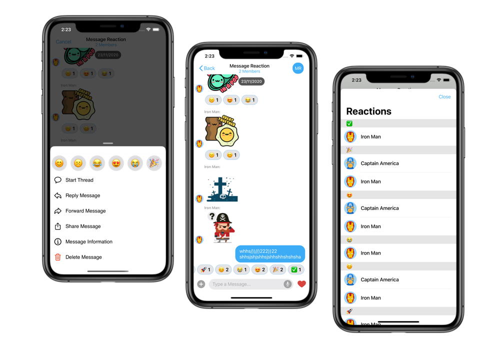

import Tabs from '@theme/Tabs';
import TabItem from '@theme/TabItem';

Reactions are the ability to react to an individual message with a specific emotion, quickly showing acknowledgment or expressing how you feel in a lightweight way.



## Extension settings

1. Login to [CometChat](https://app.cometchat.com/login) and select your app.
2. Go to the Extensions section and enable the Reactions extension.

## How do reactions work?

A user can react to a message using multiple emojis. 

To allow a user to react to a message, show a popup with all the available emojis. Once the user clicks on a particular emoji, add that emoji as a reaction to the target message.

If a user has reacted to a message using a certain emoji and clicks on the same emoji, remove it from the target message.

Sending Reactions

To add a reaction using selected emoji, use the `callExtension` method provided by our SDKs as follows:

<Tabs>
<TabItem value="Javascript" label="Javascript">

```javascript
CometChat.callExtension('reactions', 'POST', 'v1/react', {
  msgId: MESSAGE_ID,
  emoji: "😊"
}).then(response => {
  // Reaction added successfully
}).catch(error => {
  // Some error occured
});
```
</TabItem>
<TabItem value="Java" label="Java">

```java
import org.json.simple.JSONObject;

JSONObject body=new JSONObject();
body.put("msgId", ID_OF_THE_MESSAGE);
body.put("emoji", "😊");

CometChat.callExtension("reactions", "POST", "/v1/react", body,
	new CometChat.CallbackListener<JSONObject>() {
    @Override
    public void onSuccess(JSONObject responseObject) {
        // Reaction added successfully.
    }

    @Override
    public void onError(CometChatException e) {
      	// Some error occured.
    }
});
```
</TabItem>
<TabItem value="Swift" label="Swift">

```swift
CometChat.callExtension(slug: "reactions", type: .post, endPoint: "v1/react", body: ["msgId":MESSAGE_ID, "emoji":"😊"], onSuccess: { (response) in
         // Reaction added successfully
      }) { (error) in
        // Some error occured
      }
```
</TabItem>
</Tabs>


## Receiving Reactions

The messages will be updated later with Reactions as and when users react to them. Hence, you need to implement the `onMessageEdited` listener. Please check our [Edit message](/sdk/javascript/edit-message) documentation under the SDK of your choice.

The updated details will be available in the metadata of the message. Here is a sample response:

<Tabs>
<TabItem value="JSON" label="JSON">

```json
"@injected": {
  "extensions": {
    "reactions": {
      "😊": {
        "cometchat-uid-2": {
          "name": "George Alan",
          "avatar": "https://assets.cometchat.io/sampleapp/v2/users/cometchat-uid-2.webp"
        },
        "cometchat-uid-1": {
          "name": "Andrew Joseph",
          "avatar": "https://assets.cometchat.io/sampleapp/v2/users/cometchat-uid-1.webp"
        },
      },
      "👍": {
        "cometchat-uid-3": {
          "name": "George Alan",
        }
      }
    }
  }
}
```
</TabItem>
</Tabs>


## Implementation

At the recipients' end, from the message object, you can fetch the metadata by calling the getMetadata() method. Using this metadata, you can fetch the reaction details for that message.

<Tabs>
<TabItem value="Javascript" label="Javascript">

```javascript
var metadata = message.getMetadata();
if (metadata != null) {
  var injectedObject = metadata["@injected"];
  if (injectedObject != null && injectedObject.hasOwnProperty("extensions")) {
    var extensionsObject = injectedObject["extensions"];
    if (
      extensionsObject != null &&
      extensionsObject.hasOwnProperty("reactions")
    ) {
      var reactionsObject = extensionsObject["reactions"];
    }
  }
}
```
</TabItem>
<TabItem value="Java" label="Java">

```java
JSONObject metadata = message.getMetadata();
if (metadata != null) {
  JSONObject injectedObject = metadata.getJSONObject("@injected");
  if (injectedObject != null && injectedObject.has("extensions")) {
    JSONObject extensionsObject = injectedObject.getJSONObject("extensions");
    if (extensionsObject != null && extensionsObject.has("reactions")) {
          JSONObject reactionsObject = extensionsObject.getJSONObject("reactions");
        }
    }
}
```
</TabItem>
<TabItem value="Kotlin" label="Kotlin">

```kotlin
if (metadata != null) {
  if (metadata.has("@injected")) {
    val injectedJSONObject = metadata.getJSONObject("@injected")
      if (injectedJSONObject != null && injectedJSONObject.has("extensions")) {
      val extensionsObject = injectedJSONObject.getJSONObject("extensions")
          if (extensionsObject != null && extensionsObject.has("reactions")) {
          val reactionsObject = extensionsObject.getJSONObject("reactions")
        }
    }
  }
}
```
</TabItem>
<TabItem value="Swift" label="Swift">

```swift
let textMessage = message as? TextMessage
var metadata : [String : Any]? = textMessage.metaData
if metadata != nil {
    var injectedObject : [String : Any]? = (metadata?["@injected"] as? [String : Any])!
    if injectedObject != nil && (injectedObject!["extensions"] != nil) {
      var extensionsObject : [String : Any]? = injectedObject?["extensions"] as? [String : Any]

      if extensionsObject != nil && extensionsObject?["reactions"] != nil {
        var reactionsObject = extensionsObject?["reactions"] as! [String :  Any]
      }
   }
}
```
</TabItem>
</Tabs>

