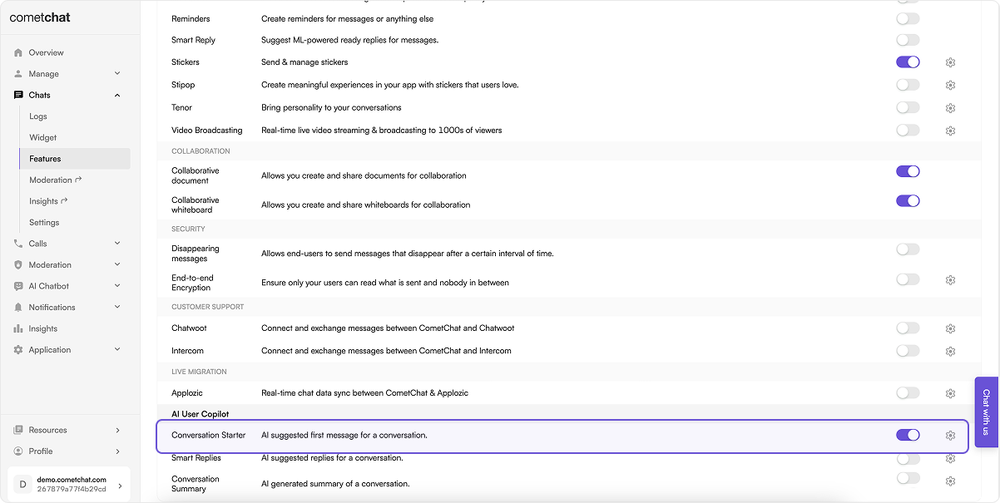

import Tabs from '@theme/Tabs';
import TabItem from '@theme/TabItem';

**Conversation Starter** enables you to retrieve an initial message in a new conversation, often used to set the context for the conversation that is about to begin. This can be particularly useful for guiding users on how to interact within the chat or for delivering automated messages that engage users when they initiate a chat.

## Before you begin

1. Set up the AI settings through the CometChat dashboard as detailed in the [Overview section](./ai-user-copilot/overview).
2. Navigate to Chat > Features, under **AI User Copilot**, enable **Conversation Starter**.
   
3. Implement the chat functionality in your applications using [CometChat's **v4** Chat SDKs](/sdk/javascript/overview).

## How does it work?

CometChat AI analyzes the user's tone and writing style by reviewing recent messages sent by that user within the application.

The SDK includes a method for retrieving conversation starters in a chat. This method returns an array containing three potential starters for the conversation.

The number of messages to be fetched to generate relevant conversation starter is configurable. By default the CometChat AI takes the latest `1000` messages. This can be configured to specific timestamps as well.

| Configuration | Value                                                  |
| ------------- | ------------------------------------------------------ |
| lastNMessages | This will fetch specific number of messages.           |
| fromTimestamp | This will fetch messages from a particular timestamp.  |
| toTimestamp   | This will fetch messages until a particular timestamp. |

:::info

While using any configuration mentioned above a maximum of **only** `1000` messages will be fetched.

:::

## Implementation

### SDKs

To implement Conversation Starter in the platform of your choice, you may utilize the following code samples:

<Tabs>
<TabItem value="js" label="JS/React Native/Ionic SDK">

```javascript
const receiverId = 'UID/GUID';
const receiverType = 'user/group';
const configuration = {lastNMessages: 100};

CometChat.getConversationStarter(receiverId, receiverType, configuration).then(
	(conversation-starter) => {
  	console.log("Conversation Starter", conversation-starter);
  },
  (error) => {
  	console.log("An error occurred while fetching conversation starter", error);
  }
);
```

</TabItem>

<TabItem value="java" label="Java">

```java
String receiveId = "";
String receiverType = CometChatConstants.RECEIVER_TYPE_USER;

JSONObject configuration = new JSONObject();
try {
    configuration.put("lastNMessages", 100);
} catch (JSONException e) {
    throw new RuntimeException(e);
}

CometChat.getConversationStarter(receiveId, receiverType, configuration, new CometChat.CallbackListener<List<String>>() {
    @Override
    public void onSuccess(List<String> strings) {
        Log.e(TAG, strings.toString());
    }
    @Override
    public void onError(CometChatException e) {
        Log.e(TAG, e.getMessage());
    }
});
```

</TabItem>

<TabItem value="kotlin" label="Kotlin">

```kotlin
val receiveId = ""
val receiverType: String = CometChatConstants.RECEIVER_TYPE_USER
val configuration = JSONObject()
try {
    configuration.put("lastNMessages", 100)
} catch (e: JSONException) {
    throw RuntimeException(e)
}

CometChat.getConversationStarter(
    receiveId,
    receiverType,
    configuration,
    object : CallbackListener<List<String?>?>() {
        fun onSuccess(strings: List<String?>) {
            Log.e(SplashActivity.TAG, strings.toString())
        }

        override fun onError(e: CometChatException) {
            Log.e(SplashActivity.TAG, e.getMessage())
        }
    }
)
```

</TabItem>

<TabItem value="dart" label="Dart">

```dart
String receiveId = "";
String receiverType = CometChatConversationType.user;
Map configuration = { "lastNMessages": 100 };

CometChat.getConversationStarter("cometchat-uid-2", "user", configuration: configuration, onSuccess: (List<String> starters) {
    debugPrint("getConversationStarter Sucess: $starters");
}, onError: (CometChatException e) {
    debugPrint("getConversationStarter Error: $e");
});
```

</TabItem>

<TabItem value="swift" label="Swift">

```swift
let receiverId = ""
let receiverType = CometChat.ReceiverType.group
let configuration = [ "lastNMessages": 100 ]


CometChat.getConversationStarter(receiverId: "cometchat-uid-1", receiverType: .user, configuration: configuration) { startersReplies in
    print("getConversationStarter success: \(startersReplies)")
} onError: { error in
    print("getConversationStarter error: \(error?.errorDescription)")
}
```

</TabItem>
</Tabs>

### UI Kits

Assuming the necessary pre-requisites are met, Conversation Starter functions seamlessly in the latest v4 Chat UI Kits.
An AI icon should appear on the Message composer. Clicking on that icon should list Conversation Starter.
