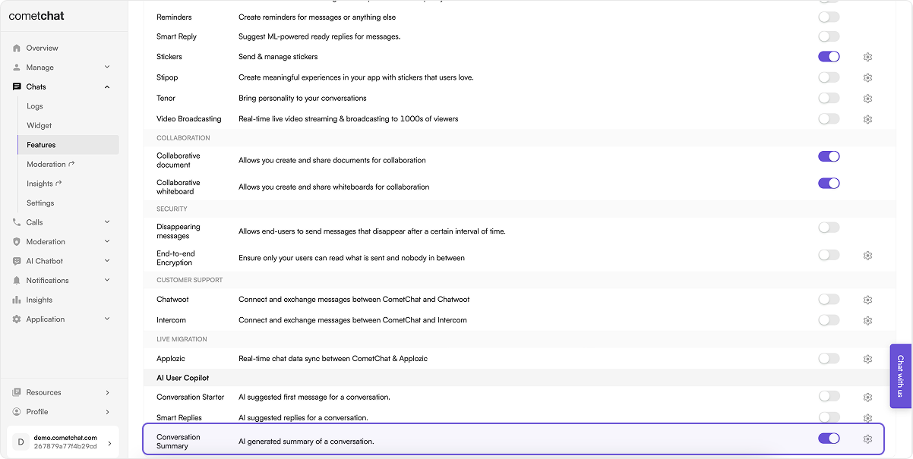

import Tabs from '@theme/Tabs';
import TabItem from '@theme/TabItem';

**Conversation Summary** enables the summarization of conversations using AI.

## Before you begin

1. Set up the AI settings through the CometChat dashboard as detailed in the [Overview section](./ai-user-copilot/overview).
2. Navigate to Chat > Features, under **AI User Copilot**, enable **Conversation Summary**.
   
3. Implement the chat functionality in your applications using [CometChat's **v4** Chat SDKs](/sdk/javascript/overview).

## How does it work?

CometChat AI goes through the messages of a conversation to understand the context of a conversation & provide a short summary of the conversation.

The CometChat SDK has a method to fetch the conversation summary. It returns the conversation summary as a string.

The number of messages to be fetched to generate relevant summaries is configurable. By default the CometChat AI takes the latest `1000` messages. This can be configured to specific timestamps as well.

| Configuration | Value                                                  |
| ------------- | ------------------------------------------------------ |
| lastNMessages | This will fetch specific number of messages.           |
| fromTimestamp | This will fetch messages from a particular timestamp.  |
| toTimestamp   | This will fetch messages until a particular timestamp. |
| unreadOnly    | This will fetch only the unread messages.              |

:::info

While using any configuration mentioned above a maximum of **only** `1000` messages will be fetched.

:::

## Implementation

### SDKs

To implement Conversation Summary in the platform of your choice, you may utilize the following code samples:

<Tabs>
<TabItem value="js" label="JS/React Native/Ionic SDK">

```javascript
const receiverId = "UID/GUID";
const receiverType = "user/group";
const configuration = { lastNMessages: 100 };

CometChat.getConversationSummary(receiverId, receiverType, configuration).then(
  (conversationSummary) => {
    console.log("Conversation Summary:", conversationSummary);
  },
  (error) => {
    console.log(
      "An error occurred while fetching conversation summary.",
      error
    );
  }
);
```

</TabItem>

<TabItem value="java" label="Java">

```java
String receiverId = 'UID/GUID';
String receiverType = CometChatConstants.RECEIVER_TYPE_USER; //'user/group'
JSONObject configuration =  new JSONObject();
try {
    configuration.put("lastNMessages", 100);
} catch (JSONException e) {
    throw new RuntimeException(e);
}

CometChat.getConversationSummary(receiverId, receiverType,c onfiguration, new CometChat.CallbackListener<String>() {
    @Override
    public void onSuccess(String s) {
        Logger.error(TAG, s);
    }

    @Override
    public void onError(CometChatException e) {
        Logger.error(TAG, e.getMessage());
    }
});
```

</TabItem>

<TabItem value="kotlin" label="Kotlin">

```kotlin
val receiverId = "UID/GUID"
val receiverType = CometChatConstants.RECEIVER_TYPE_USER // 'user/group'
val configuration = JSONObject()

try {
    configuration.put("lastNMessages", 100)
} catch (e: JSONException) {
    throw RuntimeException(e)
}

CometChat.getConversationSummary(receiverId, receiverType, configuration,
    object : CometChat.CallbackListener<String>() {
        override fun onSuccess(s: String) {
            Log.e(TAG, s)
        }

        override fun onError(e: CometChatException) {
            Log.e(TAG, e.localizedMessage)
        }
})
```

</TabItem>

<TabItem value="swift" label="Swift">

```swift
let receiverId = ""
let receiverType = CometChat.ReceiverType.group
let configuration = [ "lastNMessages": 100 ]

CometChat.getConversationSummary(receiverId: receiverId, receiverType: receiverType, configuration: configuration) { summary in
    print("getConversationSummary success: \(summary)")
} onError: { error in
    print("getConversationSummary error: \(error?.errorDescription)")
}
```

</TabItem>

<TabItem value="dart" label="Dart">

```dart
String receiveId = "";
String receiverType = CometChatConversationType.user;
Map configuration = { "lastNMessages": 100 };

CometChat.getConversationSummary(receiveId, receiverType, configuration: configuration, onSuccess:(String summary) {
   debugPrint("getConversationSummary Success: $summary");
}, onError: (CometChatException e) {
   debugPrint("getConversationSummary error: $e");
});
```

</TabItem>
</Tabs>

### UI Kits

Assuming the necessary pre-requisites are met, Conversation Summary functions seamlessly in the latest v4 Chat UI Kits.
An AI icon should appear on the Message composer. Clicking on that icon should list Conversation Summary.
