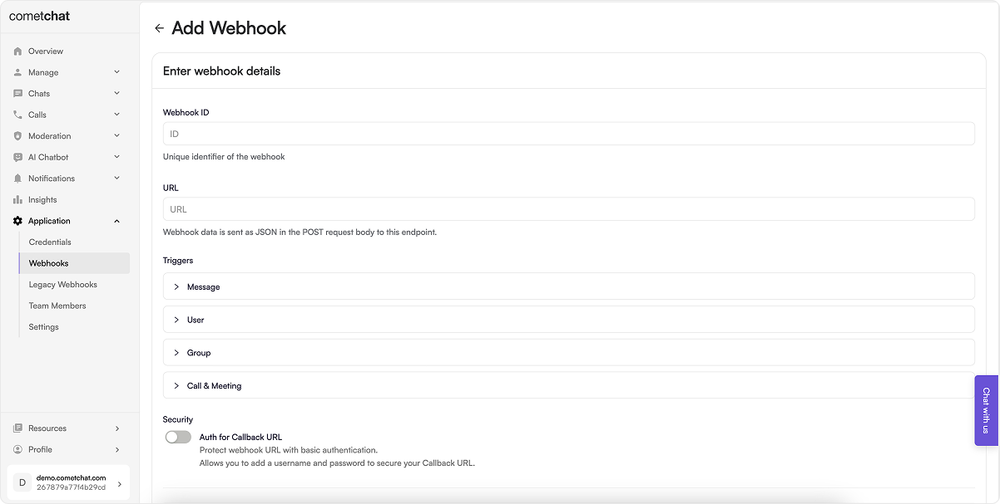

Webhook management and configuration of triggers can be handled via CometChat's dashboard or by utilizing the Management APIs.

## Manage from the dashboard

1. Login to [CometChat](https://app.cometchat.com/login) dashboard and select your app.
2. Navigate to **Settings** > **Webhooks** in the left-hand menu.
3. Add a new webhook.
4. Configure the webhook by saving the following details:

- Webhook ID: A unique identifier for your webhook.
- URL: The Webhook URL where you will receive the payloads for the event.
- Triggers: Enable the triggers for events that you are interested in.
- Security: It is recommended to enable authentication for your webhook.

5. Enable the webhook.
6. Save the configuration.

## Manage using our Management APIs

### Webhook managment

<table border='1' style={{ borderCollapse: 'collapse' }}>
  <thead>
    <tr>
      <th>Operation</th>
      <th>Description</th>
    </tr>
  </thead>
  <tbody>
    <tr>
      <td>Create a new webhook</td>
      <td>https://api-explorer.cometchat.com/reference/create-webhook-api</td>
    </tr>
    <tr>
      <td>Update an existing webhook</td>
      <td>https://api-explorer.cometchat.com/reference/update-webhook-api</td>
    </tr>
    <tr>
      <td>List webhooks</td>
      <td>https://api-explorer.cometchat.com/reference/list-webhooks-api</td>
    </tr>
    <tr>
      <td>Get a webhook using its ID</td>
      <td>https://api-explorer.cometchat.com/reference/get-webhook-api</td>
    </tr>
    <tr>
      <td>Delete a webhook</td>
      <td>https://api-explorer.cometchat.com/reference/delete-webhook-api</td>
    </tr>
  </tbody>
</table>

### Triggers management

<table border='1' style={{ borderCollapse: 'collapse' }}>
  <thead>
    <tr>
      <th>Operation</th>
      <th>Description</th>
    </tr>
  </thead>
  <tbody>
    <tr>
      <td>Add triggers to a webhook</td>
      <td>https://api-explorer.cometchat.com/reference/add-triggers-api</td>
    </tr>
    <tr>
      <td>List triggers of a webhook</td>
      <td>https://api-explorer.cometchat.com/reference/list-triggers-api</td>
    </tr>
    <tr>
      <td>Remove triggers from a webhook</td>
      <td>https://api-explorer.cometchat.com/reference/remove-triggers-api</td>
    </tr>
  </tbody>
</table>
