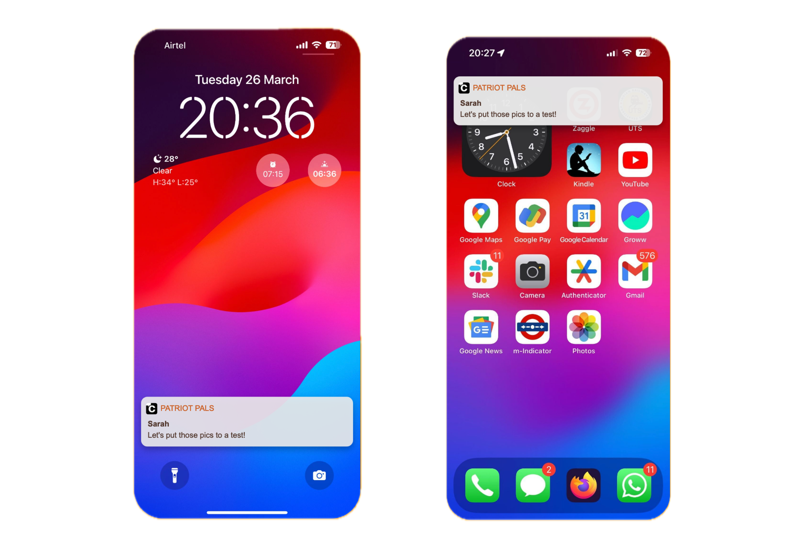

## Introduction

Push notifications are a crucial aspect of modern applications, providing real-time updates and enhancing user engagement. CometChat's Push Notification service offers a range of features and customization options to enable businesses to deliver timely alerts and keep users connected to their applications.

## Key Features

1. **Support for multiple providers**:

   CometChat provides support for **Firebase Cloud Messaging (FCM)** and **Apple Push Notification Service (APNS)**. This approach, involving multiple providers, provides flexibility in notification delivery, independent of the recipient's platform. It also enables CometChat to respond effectively to the evolving push notification landscape, maintaining consistent delivery across Android, iOS, and web platforms.

1. **Support for multiple platforms**:

   CometChat provides multi-platform support, compatible with an extensive array of mobile and web platforms. This includes native mobile platforms such as Android and iOS, web frameworks like React, Angular, and Vue.js, and hybrid environments including React Native and Flutter.

1. **Tokens management**:

   CometChat's Push Notification service provides developers with functions and APIs for easy tokens management, ensuring that push notifications are delivered reliably to intended user's devices.

1. **Preferences management**:

   Through CometChat's Notification Preferences, users and admins have the ability to customize the notification settings, that help provide pertinent alerts while avoiding notification fatigue.

1. **Ability to set up a schedule**:

   CometChat's Push notifications service ensures that the notifications are delivered based on the specified daily timetable, adhering to the user's local time zone.

1. **Ability to mute notifications**:

   Users have the option to completely mute push notifications for the app (DND mode), or selectively mute them for specific users and groups, for a designated duration.

1. **Ability to set up Templates and Sounds**:

   CometChat offers developers a set of pre-defined templates that define the content shown in push notifications. These templates act as a blueprint for customizing the payload content sent with push notifications as per the needs and requirements.

---

## Triggering Events

In CometChat various user actions and interactions within the chat environment can trigger push notifications to ensure users stay updated and engaged. Here are some common events that typically trigger push notifications:

- **New Messages**: Whenever a user sends a new message in a one-on-one or group chat, CometChat can trigger a push notification to alert other participants about the incoming message.

- **Replies**: When a user replies to a specific message within a chat, it can trigger a push notification to notify relevant users about the reply, ensuring they are aware of the ongoing conversation.

- **Message Edited or Deleted**: Notifications are triggered when a user edits or deletes a message, informing relevant users about the changes made to the message content.

- **Mentions**: If a user is mentioned by another user using their username or handle in a message, CometChat can trigger a push notification to notify the mentioned user about the mention, prompting their attention to the message.

- **Reactions**: Users can react to messages with emojis or symbols. When a user reacts to a message, CometChat can trigger a push notification to the original sender or other participants in the chat to notify them about the reaction.

- **Group Actions**: Notifications are triggered for group actions such as member joins, member bans, and member leaves, ensuring group members are informed about changes in group dynamics.

- **Calling Events**: CometChat supports real-time audio and video calling features. Events related to incoming calls, missed calls or call invitations can trigger push notifications to alert users about these calling events, ensuring they don't miss important calls.

<!-- ## Muting Push notifications

In addition to setting preferences for CometChat events, users have the capability to customize their push notification settings at the app level, allowing them to:

1. Mute all notifications or activate a Do Not Disturb mode.
2. Mute notifications from a specific group or one-on-one conversation temporarily.
3. Define a daily schedule for receiving notifications.

A decision tree diagram is provided to guide both CometChat administrators and developers through the conditions that affect push notification delivery. This diagram reflects the impact of set preferences for the said events and any mute settings users may apply.

 -->

<!-- ## Support

Push notifications can function in both iOS and Android apps, as well as on desktop browsers that support the [Push API](https://caniuse.com/#feat=push-api). The following browsers are known to support this feature:

1. Chrome version 50 and above
2. Firefox version 44 and above
3. Edge version 17 and above
4. Opera version 42 and above

Users of these browsers and mobile operating systems can receive notifications provided they have given permission for the site or app to send them notifications. -->
