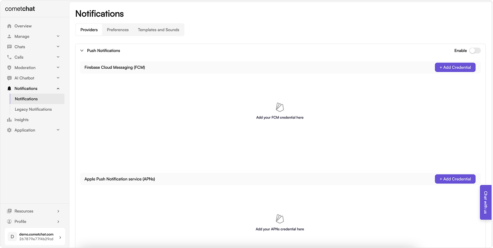
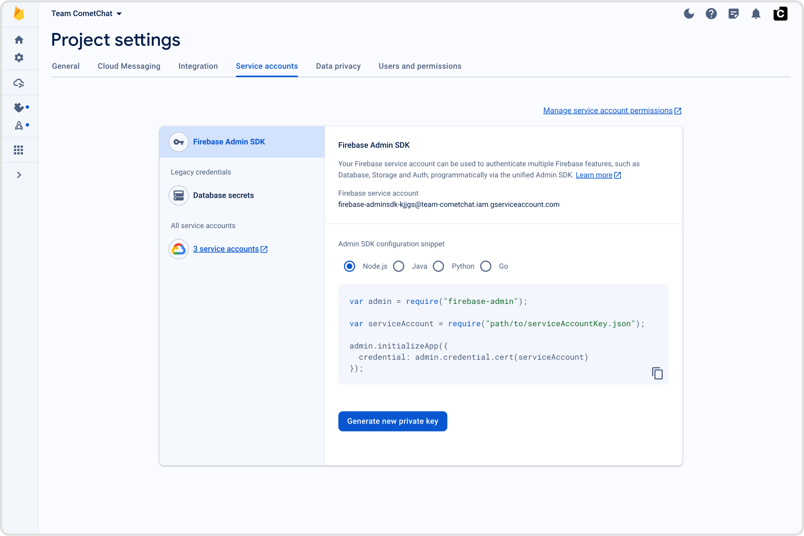
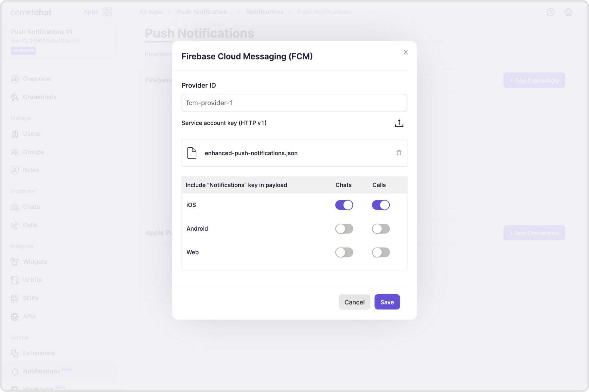
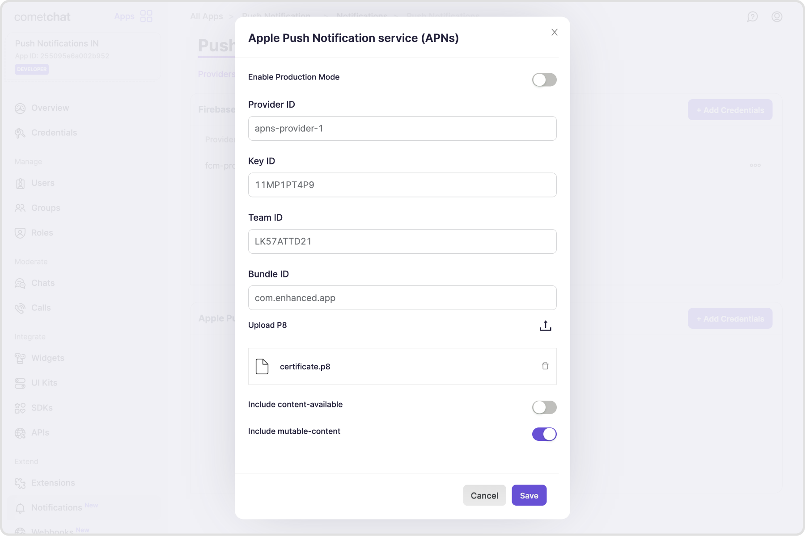

import Tabs from '@theme/Tabs';
import TabItem from '@theme/TabItem';

## Enable Push notifications



1. Login to [CometChat](https://app.cometchat.com/login) dashboard and select your app.
2. Navigate to **Notifications** > **Notifications** in the left-hand menu.
3. Enable the Push notifications feature.
4. Continue to configure Push notifications by clicking on "Configure".

## Add Providers

Firebase Cloud Messaging (FCM) and Apple Push Notification Service (APNS) are the two primary supported providers for sending push notifications.

### Add FCM credentials

#### Pre-requisite

Generate a service account key for your Firebase application by navigating to the "Service accounts" section within the "Project settings" of the Firebase Cloud Messaging Dashboard. Generate new private key and download the JSON file. This will be required in the next steps.



#### Add credentials

1. Select the "+ Add Credentials" button.
2. In the dialogue that appears, provide a unique, memorable identifier for your provider.
3. Upload the service account JSON file you previously acquired.
4. Specify whether the push payload should include the "notification" key. Additional information on this configuration is available in FCM's documentation - [About FCM messages](https://firebase.google.com/docs/cloud-messaging/concept-options).

Similarly, you can add multiple FCM Credentials in case you have multiple FCM projects for your apps.



### Add APNS credentials

#### Pre-requisite

1. To generate a .p8 key file, go to [Apple developer account](https://developer.apple.com/account), then select "Certificates, IDs & Profiles".
2. Select Keys and click on the "+" button to add a new key.
3. In the new key page, type in your key name and check the Apple Push Notification service (APNs) box, then click "Continue" and click "Register".
4. Then proceed to download the key file by clicking Download.
5. Make note of the Key ID, Team ID and your Bundle ID. These are required in the next steps.

Additional information on this configuration is available in Apple's documentation - [Create a private key to access a service](https://developer.apple.com/help/account/manage-keys/create-a-private-key/)

#### Add credentials

1. Select the "+ Add Credentials" button.
2. Enable the toggle if your app is in the Production. For apps under development, the toggle has to be disabled.
3. In the dialogue that appears, provide a unique, memorable identifier for your provider.
4. Store the Key ID, Team ID, Bundle ID for your app.
5. Upload the .p8 file
6. Enable "Include content-available" if you want to receive background notifications. However, this is not recommended as the background notifications are throttled. Additional information is available in Apple's documentation - [Pushing background updates to your App](https://developer.apple.com/documentation/usernotifications/pushing-background-updates-to-your-app)
7. Enable "Include mutable-content" if you want to modify the notification before it is displayed to the user. Additional information is available in Apple's documentation - [Modifying content on newly delivered notifications](https://developer.apple.com/documentation/usernotifications/modifying-content-in-newly-delivered-notifications)

Similarly, you can add multiple APNS Credentials in case you have multiple apps with different Bundle IDs.



## Tokens management

### Register push token after login

Push tokens, obtained from the APIs or SDKs provided by the platforms or frameworks in use, must be registered on behalf of the logged in user with the CometChat backend. For this purpose, CometChat SDKs v4+ offer the following functions:

Push token registration should be completed in two scenarios:

1. Following the success of `CometChat.login()` & receiving user's permission to receiver Push notifications.
2. When a refresh token becomes available.

To register a token, use the `CometChatNotifications.registerPushToken()` method from the SDK. This method accepts the following parameters.

<table border='1' style={{ borderCollapse: 'collapse' }}>
  <thead>
    <tr>
      <th>Parameter</th>
      <th>Type</th>
      <th>Description</th>
    </tr>
  </thead>
  <tbody>
    <tr>
      <td>`pushToken`</td>
      <td>String</td>
      <td>
        The `pushToken` can contain:
        - Firebase (FCM) token
        - Device token (iOS only)
        - VoIP token (iOS only)
      </td>
    </tr>
    <tr>
      <td>`platform`</td>
      <td>String</td>
      <td>
        The `platform` can take the following values:
        - PushPlatforms.FCM_ANDROID
        - PushPlatforms.FCM_FLUTTER_ANDROID
        - PushPlatforms.FCM_FLUTTER_IOS
        - PushPlatforms.APNS_FLUTTER_DEVICE
        - PushPlatforms.APNS_FLUTTER_VOIP
        - PushPlatforms.FCM_IOS
        - PushPlatforms.APNS_IOS_DEVICE
        - PushPlatforms.APNS_IOS_VOIP
        - PushPlatforms.FCM_WEB
        - PushPlatforms.FCM_REACT_NATIVE_ANDROID
        - PushPlatforms.FCM_REACT_NATIVE_IOS
        - PushPlatforms.APNS_REACT_NATIVE_DEVICE
        - PushPlatforms.APNS_REACT_NATIVE_VOIP
        - PushPlatforms.FCM_IONIC_CORDOVA_ANDROID
        - PushPlatforms.FCM_IONIC_CORDOVA_IOS
        - PushPlatforms.APNS_IONIC_CORDOVA_DEVICE
        - PushPlatforms.APNS_IONIC_CORDOVA_VOIP
      </td>
    </tr>
     <tr>
      <td>`providerId`</td>
      <td>String</td>
      <td>
        The `providerId` should match with:
        - Any one of the FCM provider identifiers in case of an FCM token.
        - Any one of the APNS provider identifiers in case of Device or VoIP tokens.
      </td>
    </tr>
  </tbody>
</table>

<Tabs>
<TabItem value="Javascript" label="JavaScript">

```javascript
// This is applicable for web, React native, Ionic cordova

// CometChat.init() success.
// CometChat.login() success.
// User has granted permission to display push notifications.

// For web
CometChatNotifications.registerPushToken(
  pushToken,
  CometChatNotifications.PushPlatforms.FCM_WEB,
  "fcm-provider-2"
)
  .then((payload) => {
    console.log("Token registration successful");
  })
  .catch((err) => {
    console.log("Token registration failed:", err);
  });

// For React Native Android
CometChatNotifications.registerPushToken(
  pushToken,
  CometChatNotifications.PushPlatforms.FCM_REACT_NATIVE_ANDROID,
  "fcm-provider-2"
)
  .then((payload) => {
    console.log("Token registration successful");
  })
  .catch((err) => {
    console.log("Token registration failed:", err);
  });

// For React Native iOS
CometChatNotifications.registerPushToken(
  pushToken,
  CometChatNotifications.PushPlatforms.FCM_REACT_NATIVE_IOS,
  "fcm-provider-2"
)
  .then((payload) => {
    console.log("Token registration successful");
  })
  .catch((err) => {
    console.log("Token registration failed:", err);
  });

// For Ionic cordova Android
CometChatNotifications.registerPushToken(
  pushToken,
  CometChatNotifications.PushPlatforms.FCM_IONIC_CORDOVA_ANDROID,
  "fcm-provider-2"
)
  .then((payload) => {
    console.log("Token registration successful");
  })
  .catch((err) => {
    console.log("Token registration failed:", err);
  });

// For Ionic cordova iOS
CometChatNotifications.registerPushToken(
  pushToken,
  CometChatNotifications.PushPlatforms.FCM_IONIC_CORDOVA_IOS,
  "fcm-provider-2"
)
  .then((payload) => {
    console.log("Token registration successful");
  })
  .catch((err) => {
    console.log("Token registration failed:", err);
  });

// Similary, use this method to register refresh token.
```

</TabItem>
<TabItem value="Java" label="Android">

```java
// CometChat.init() success.
// CometChat.login() success.
// User has granted permission to display push notifications.
CometChatNotifications.registerPushToken(pushToken, PushPlatforms.FCM_ANDROID, "fcm-provider-2", new CometChat.CallbackListener<String>() {
    @Override
    public void onSuccess(String s) {
        Log.e(TAG, "onSuccess:  CometChat Notification Registered : "+s );
        listener.onSuccess(s);
    }

    @Override
    public void onError(CometChatException e) {
        Log.e(TAG, "onError: Notification Registration Failed : "+e.getMessage());
        listener.onError(e);
    }
});

// Similary, use this method to register refresh token.
```

</TabItem>
<TabItem value="Swift" label="iOS">

```swift
// CometChat.init() success.
// CometChat.login() success.
// User has granted permission to display push notifications.
CometChatNotifications.registerPushToken(pushToken: pushToken, platform: CometChatNotifications.PushPlatforms.FCM_IOS, providerId: "apns-provider-2", onSuccess: { (success) in
  print("registerPushToken: \(success)")
}) { (error) in
  print("registerPushToken: \(error.errorCode) \(error.errorDescription)")
}

// Similary, use this method to register refresh token.
```

</TabItem>
<TabItem value="Dart" label="Flutter">

```dart
// CometChat.init() success.
// CometChat.login() success.
// User has granted permission to display push notifications.

// For Android (FCM)
CometChatNotifications.registerPushToken(
  PushPlatforms.FCM_FLUTTER_ANDROID,
  providerId: "fcm-provider-1",
  fcmToken: token,
  onSuccess: (response) {
    debugPrint("registerPushToken:success ${response.toString()}");
  },
  onError: (e) {
    debugPrint("registerPushToken:error ${e.toString()}");
  },
);

// For iOS (FCM)
CometChatNotifications.registerPushToken(
  PushPlatforms.FCM_FLUTTER_IOS,
  providerId: "fcm-provider-1",
  fcmToken: token,
  onSuccess: (response) {
    debugPrint("registerPushToken:success ${response.toString()}");
  },
  onError: (e) {
    debugPrint("registerPushToken:error ${e.toString()}");
  },
);

// For ios (APNS Device token)
CometChatNotifications.registerPushToken(
  PushPlatforms.APNS_FLUTTER_DEVICE,
  providerId: "apns-provider-1",
  deviceToken: token,
  onSuccess: (response) {
    debugPrint("registerPushToken:success ${response.toString()}");
  },
  onError: (e) {
    debugPrint("registerPushToken:error ${e.toString()}");
  },
);

// For ios (APNS VoIP token)
CometChatNotifications.registerPushToken(
  PushPlatforms.APNS_FLUTTER_VOIP,
  providerId: "apns-provider-1",
  voipToken: token,
  onSuccess: (response) {
    debugPrint("registerPushToken:success ${response.toString()}");
  },
  onError: (e) {
    debugPrint("registerPushToken:error ${e.toString()}");
  },
);

// Similary, use this method to register refresh token.
```

</TabItem>
</Tabs>

### Unregister push token before logout

Typically, push token unregistration should occur prior to user logout, using the `CometChat.logout()` method.

For token unregistration, use the `CometChatNotifications.unregisterPushToken()` method provided by the SDKs.

<Tabs>
<TabItem value="Javascript" label="JavaScript">

```javascript
// This is applicable for web, React native, Ionic cordova
await CometChatNotifications.unregisterPushToken();

// Followed by CometChat.logout();
```

</TabItem>
<TabItem value="Java" label="Android">

```java
CometChatNotifications.unregisterPushToken(new CometChat.CallbackListener<String>() {
    @Override
    public void onSuccess(String s) {
        // Success callback
    }

    @Override
    public void onError(CometChatException e) {
        // Error callback
    }
});

// Followed by CometChat.logout();

```

</TabItem>
<TabItem value="Swift" label="iOS">

```swift
CometChatNotifications.unregisterPushToken { success in
    print("unregisterPushToken: \(success)")
} onError: { error in
    print("unregisterPushToken: \(error.errorCode) \(error.errorDescription)")
}

// Followed by CometChat.logout();

```

</TabItem>
<TabItem value="Dart" label="Flutter">

```dart
CometChatNotifications.unregisterPushToken(onSuccess: (response) {
  debugPrint("unregisterPushToken:success ${response.toString()}");
}, onError: (e) {
  debugPrint("unregisterPushToken:error ${e.toString()}");
});

```

</TabItem>
</Tabs>

## Handle incoming Push notifications

Push notifications should be managed primarily when the app is in the background or in a terminated state.

For web and mobile applications, the Firebase Cloud Messaging (FCM) SDK offers handler functions to receive Push Notifications.

For iOS applications, the FCM SDK can be used as described previously, or alternatively, PushKit can be implemented for enhanced integration and management of chat and call (VoIP) notifications.

The push payload delivered to the user's device includes the following information, which can be customized to suit the desired notification style:

<Tabs>
<TabItem value="JSON" label="Details available in the payload">
```JSON
{
  // Notification details
  "title": "Andrew Joseph", // The title of the notification to be displayed
  "body": "Hello!", // The body of the notification to be displayed

// Sender's details
"sender": "cometchat-uid-1", // UID of the user who sent the said message.
"senderName": "Andrew Joseph", // Name of the user who sent the said message.
"senderAvatar": "https://assets.cometchat.io/sampleapp/v2/users/cometchat-uid-1.webp", // Avatar URL of the user.

// Receiver's details
"receiver": "cometchat-uid-2", // UID or GUID of the receiver.
"receiverName": "George Alan", // Name of the user or group.
"receiverAvatar": "https://assets.cometchat.io/sampleapp/v2/users/cometchat-uid-2.webp", // Avatar URL of the receiver.
"receiverType": "user", // Values can be "user" or "group"

// Message details
"tag": "123", // The ID of the said message that can be used as the ID of the notification to be displayed.
"conversationId": "cometchat-uid-1_user_cometchat-uid-2", // The ID of the conversation that the said message belongs to.
"type": "chat", // Values can be "call" or "chat". If this is "call", the below details will be available.

// Call details
"callAction": "initiated", // Values can be "initiated" or "cancelled" or "unanswered" or "ongoing" or "rejected" or "ended" or "busy"
"sessionId": "v1.123.aik2", // The unique sessionId of the said call that can be used as unique identifier in CallKit or ConnectionService.
"callType": "audio", // Values can be "audio" or "video"
}

```
</TabItem>
</Tabs>

## Sample apps

Check out our sample apps for understanding the implementation.

<div style={{ display: 'flex', gap: '20px' }}>
  <div style={{ display: 'flex', 'flex-wrap': 'wrap', boxShadow: '0 0 4px 0 rgb(0 0 0 / 18%)', borderRadius: '3px', width: '50%', flex: 1 }}>
    <div style={{ padding: '24px', flex: 1, 'flex-basis': '50%' }}>
      <h3>React - Enhanced Push notifications sample app</h3>
      <p>Push notifications sample app for the web</p>
      <a style={{ display: 'inline-block', backgroundColor: '#7c55c9', padding: '8px', textAlign: 'center', textTransform: 'uppercase', border: '1px solid #e3e5e7', borderRadius: '3px', color: 'white', width: '100%' }}
        href="https://github.com/cometchat/cometchat-push-notification-app-react/" target="/blank">View on Github</a>
    </div>
  </div>

  <div style={{ display: 'flex', 'flex-wrap': 'wrap', boxShadow: '0 0 4px 0 rgb(0 0 0 / 18%)', borderRadius: '3px', width: '50%', flex: 1 }}>
    <div style={{ padding: '24px', flex: 1, 'flex-basis': '50%' }}>
      <h3>React Native - Enhanced Push notifications sample app</h3>
      <p>Push notifications sample app for React Native</p>
      <a style={{ display: 'inline-block', backgroundColor: '#7c55c9', padding: '8px', textAlign: 'center', textTransform: 'uppercase', border: '1px solid #e3e5e7', borderRadius: '3px', color: 'white', width: '100%' }}
        href="https://github.com/cometchat/cometchat-push-notification-app-react-native" target="/blank">View on Github</a>
    </div>
  </div>
</div>

<br/>

<div style={{ display: 'flex', gap: '20px' }}>
  <div style={{ display: 'flex', 'flex-wrap': 'wrap', boxShadow: '0 0 4px 0 rgb(0 0 0 / 18%)', borderRadius: '3px', width: '50%', flex: 1 }}>
    <div style={{ padding: '24px', flex: 1, 'flex-basis': '50%' }}>
      <h3>iOS - Enhanced Push notifications sample app</h3>
      <p>Push notifications sample app for iOS</p>
      <a style={{ display: 'inline-block', backgroundColor: '#7c55c9', padding: '8px', textAlign: 'center', textTransform: 'uppercase', border: '1px solid #e3e5e7', borderRadius: '3px', color: 'white', width: '100%' }}
        href="https://github.com/cometchat/cometchat-push-notification-app-ios" target="/blank">View on Github</a>
    </div>
  </div>

  <div style={{ display: 'flex', 'flex-wrap': 'wrap', boxShadow: '0 0 4px 0 rgb(0 0 0 / 18%)', borderRadius: '3px', width: '50%', flex: 1 }}>
    <div style={{ padding: '24px', flex: 1, 'flex-basis': '50%' }}>
      <h3>Android - Enhanced Push notifications sample app</h3>
      <p>Push notifications sample app for Android</p>
      <a style={{ display: 'inline-block', backgroundColor: '#7c55c9', padding: '8px', textAlign: 'center', textTransform: 'uppercase', border: '1px solid #e3e5e7', borderRadius: '3px', color: 'white', width: '100%' }}
        href="https://github.com/cometchat/cometchat-push-notification-app-android" target="/blank">View on Github</a>
    </div>
  </div>
</div>

<br/>

<div style={{ display: 'flex', gap: '20px' }}>
  <div style={{ display: 'flex', 'flex-wrap': 'wrap', boxShadow: '0 0 4px 0 rgb(0 0 0 / 18%)', borderRadius: '3px', width: '50%', flex: 1 }}>
    <div style={{ padding: '24px', flex: 1, 'flex-basis': '50%', width: '50%' }}>
      <h3>Flutter - Enhanced Push notifications sample app</h3>
      <p>Push notifications sample app for Flutter</p>
      <a style={{ display: 'inline-block', backgroundColor: '#7c55c9', padding: '8px', textAlign: 'center', textTransform: 'uppercase', border: '1px solid #e3e5e7', borderRadius: '3px', color: 'white', width: '100%' }}
        href="https://github.com/cometchat/cometchat-push-notification-app-flutter" target="/blank">View on Github</a>
    </div>
  </div>
  <div style={{ display: 'flex', 'flex-wrap': 'wrap', borderRadius: '3px', width: '50%', flex: 1 }}>

  </div>
</div>
```
