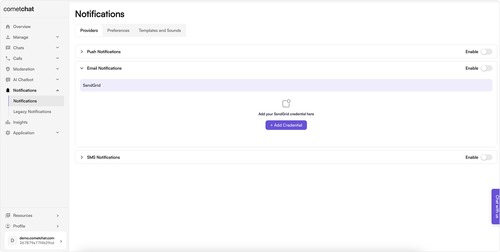
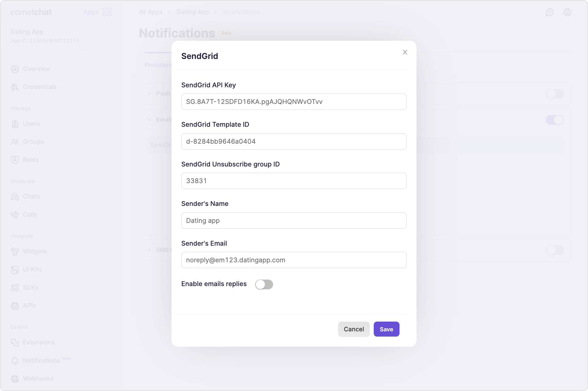
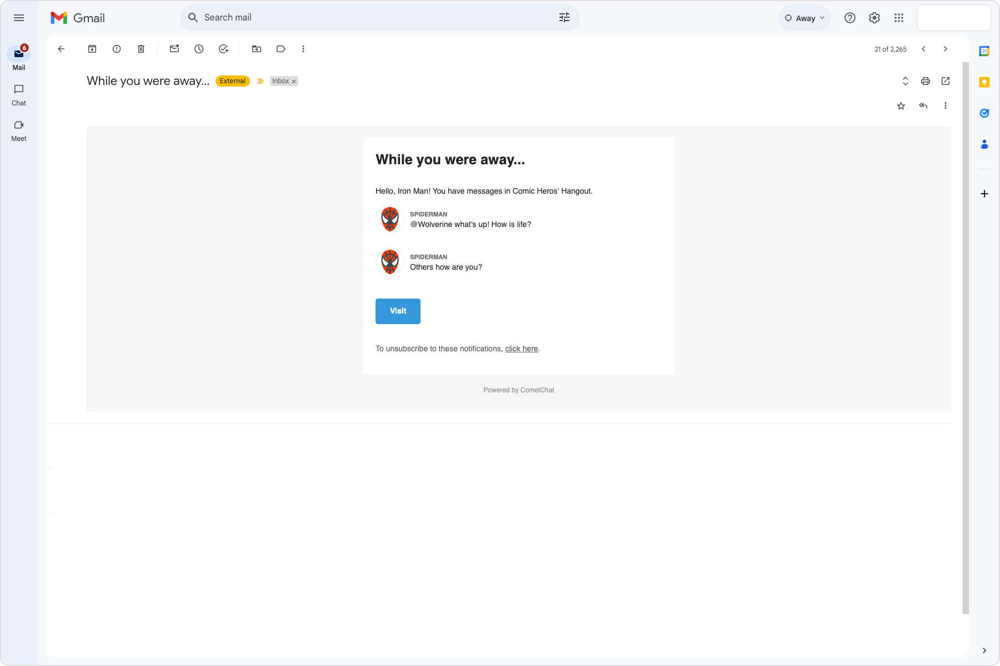

import Tabs from '@theme/Tabs';
import TabItem from '@theme/TabItem';

## Pre-requisite

We have partnered with SendGrid for sending Email Notifications and hence you need to set up an account on [SendGrid](https://www.sendgrid.com/) before you start using the extension.

### Get your SendGrid API Key

1. Log in to your SendGrid account.
2. In the left navigation pane, go to Settings and select API Keys.
3. If you don't have an API Key yet, click on Create API Key.
4. Give a name to your API Key and select Full Access to get started.
5. Make a note of the **API key** for later use.

### Create an email template

1. Log in to your SendGrid account.
2. In the left navigation pane, go to Email API and select Dynamic Templates.
3. Click on "Create a Dynamic Template" and give a name to your template.
4. In the Template listing, expand your template and click on "Add Version".
5. Under the "Your Email Designs" tab, select Blank Template.
6. As we have the following HTML template ready for you, select the "Code Editor" option.
7. Paste the code for the email template. You should be able to see the Preview in the Right pane.
8. Click on Settings on the Left to expand the Settings drawer.
9. Enter the Version name and the value for Subject as `{{subject}}` and hit "Save".
10. You have now successfully created a Template with a version.
11. From the Dynamic Templates listing page, expand your Template and make a note of the **Template ID** for later use.
12. The payload sent by the extension to SendGrid is as follows:

<Tabs>
<TabItem value="JSON" label="For one-on-one conversation">

```JSON
{
  "to": {
    "uid": "cometchat-uid-1",
    "email": "andrew-joseph@example.com",
    "name": "Andrew Joseph",
    "avatar": "https://assets.cometchat.io/sampleapp/v2/users/cometchat-uid-1.webp"
  },
  "messages": [
    {
      "sender": {
        "uid": "cometchat-uid-4",
        "avatar": "https://assets.cometchat.io/sampleapp/v2/users/cometchat-uid-4.webp",
        "name": "Susan Marie"
      },
      "message": "Are we meeting on this weekend?"
    },
    {
      "sender": {
        "uid": "cometchat-uid-4",
        "avatar": "https://assets.cometchat.io/sampleapp/v2/users/cometchat-uid-4.webp",
        "name": "Susan Marie"
      },
      "message": "📷 Has shared an image"
    }
  ],
  "senderDetails": {
    "uid": "cometchat-uid-4",
    "name": "Susan Marie",
    "avatar": "https://assets.cometchat.io/sampleapp/v2/users/cometchat-uid-4.webp""
  }
}
```

</TabItem>
<TabItem value="JSONP" label="For group conversation">

```JSON
{
  "to": {
    "uid": "cometchat-uid-1",
    "email": "andrew-joseph@example.com",
    "name": "Andrew Joseph",
    "avatar": "https://assets.cometchat.io/sampleapp/v2/users/cometchat-uid-1.webp"
  },
  "messages": [
    {
      "sender": {
        "uid": "cometchat-uid-4",
        "avatar": "https://assets.cometchat.io/sampleapp/v2/users/cometchat-uid-4.webp",
        "name": "Susan Marie"
      },
      "message": "Hello all! What's up?"
    },
    {
      "sender": {
        "uid": "cometchat-uid-4",
        "avatar": "https://assets.cometchat.io/sampleapp/v2/users/cometchat-uid-4.webp",
        "name": "Susan Marie"
      },
      "message": "This is the place I was thinking about"
    }
  ],
  "groupDetails": {
    "guid": "cometchat-guid-1",
    "name": "Hiking Group",
    "icon": "https://assets.cometchat.io/sampleapp/v2/groups/cometchat-guid-1.webp"
  }
}
```

</TabItem>
</Tabs>

11. The email template recommended by us is as follows. Replace "https://www.YOURSITE.com" with your website's URL in the below template.

```
<!doctype html>
<html>

<head>
  <meta name="viewport" content="width=device-width">
  <meta http-equiv="Content-Type" content="text/html; charset=UTF-8">
  <title>Simple Transactional Email</title>
  <style>
    /* ------------------------------------- INLINED WITH htmlemail.io/inline ------------------------------------- */
    /* ------------------------------------- RESPONSIVE AND MOBILE FRIENDLY STYLES ------------------------------------- */
    @media only screen and (max-width: 620px) {
      table[class=body] h1 {
        font-size: 28px !important;
        margin-bottom: 10px !important;
      }

      table[class=body] p,
      table[class=body] ul,
      table[class=body] ol,
      table[class=body] td,
      table[class=body] span,
      table[class=body] a {
        font-size: 16px !important;
      }

      table[class=body] .wrapper,
      table[class=body] .article {
        padding: 10px !important;
      }

      table[class=body] .content {
        padding: 0 !important;
      }

      table[class=body] .container {
        padding: 0 !important;
        width: 100% !important;
      }

      table[class=body] .main {
        border-left-width: 0 !important;
        border-radius: 0 !important;
        border-right-width: 0 !important;
      }

      table[class=body] .btn table {
        width: 100% !important;
      }

      table[class=body] .btn a {
        width: 100% !important;
      }

      table[class=body] .img-responsive {
        height: auto !important;
        max-width: 100% !important;
        width: auto !important;
      }
    }

    /* ------------------------------------- PRESERVE THESE STYLES IN THE HEAD ------------------------------------- */
    @media all {
      .ExternalClass {
        width: 100%;
      }

      .ExternalClass,
      .ExternalClass p,
      .ExternalClass span,
      .ExternalClass font,
      .ExternalClass td,
      .ExternalClass div {
        line-height: 100%;
      }

      .apple-link a {
        color: inherit !important;
        font-family: inherit !important;
        font-size: inherit !important;
        font-weight: inherit !important;
        line-height: inherit !important;
        text-decoration: none !important;
      }

      #MessageViewBody a {
        color: inherit;
        text-decoration: none;
        font-size: inherit;
        font-family: inherit;
        font-weight: inherit;
        line-height: inherit;
      }

      .btn-primary table td:hover {
        background-color: #34495e !important;
      }

      .btn-primary a:hover {
        background-color: #34495e !important;
        border-color: #34495e !important;
      }

      .senderName {
        font-weight: bold;
        font-size: 0.8em;
        text-transform: uppercase;
        color: #666;
      }
    }
  </style>
</head>

<body class=""
  style="background-color: #f6f6f6; font-family: sans-serif; -webkit-font-smoothing: antialiased; font-size: 14px; line-height: 1.4; margin: 0; padding: 0; -ms-text-size-adjust: 100%; -webkit-text-size-adjust: 100%;">
  <table border="0" cellpadding="0" cellspacing="0" class="body"
    style="border-collapse: separate; mso-table-lspace: 0pt; mso-table-rspace: 0pt; width: 100%; background-color: #f6f6f6;">
    <tr>
      <td style="font-family: sans-serif; font-size: 14px; vertical-align: top;">&nbsp;</td>
      <td class="container"
        style="font-family: sans-serif; font-size: 14px; vertical-align: top; display: block; Margin: 0 auto; max-width: 580px; padding: 10px; width: 580px;">
        <div class="content"
          style="box-sizing: border-box; display: block; Margin: 0 auto; max-width: 580px; padding: 10px;">

          <!-- START CENTERED WHITE CONTAINER -->
          <span class="preheader"
            style="color: transparent; display: none; height: 0; max-height: 0; max-width: 0; opacity: 0; overflow: hidden; mso-hide: all; visibility: hidden; width: 0;">This
            is preheader text. Some clients will show this text as a preview.</span>
          <table class="main"
            style="border-collapse: separate; mso-table-lspace: 0pt; mso-table-rspace: 0pt; width: 100%; background: #ffffff; border-radius: 3px;">

            <!-- START MAIN CONTENT AREA -->
            <tr>
              <td class="wrapper"
                style="font-family: sans-serif; font-size: 14px; vertical-align: top; box-sizing: border-box; padding: 20px;">
                <table border="0" cellpadding="0" cellspacing="0"
                  style="border-collapse: separate; mso-table-lspace: 0pt; mso-table-rspace: 0pt; width: 100%;">
                  <tr>
                    <td style="font-family: sans-serif; font-size: 14px; vertical-align: top;">
                      <p
                        style="font-family: sans-serif; font-size: 25px; font-weight: bold; margin: 0; Margin-bottom: 30px;">
                        While you were away...</p>

                      <p>Hello, {{to.name}}! You have {{messages.length}} new messages{{#if groupDetails}} in {{groupDetails.name}}{{/if}}.</p>
                      <table border="0" cellpadding="0" cellspacing="0" class="btn btn-primary"
                        style="border-collapse: separate; mso-table-lspace: 0pt; mso-table-rspace: 0pt; width: 100%; box-sizing: border-box;">
                        <tbody>


                          {{#each messages}}
                          {{#if this.message}}
                          <tr>
                            <td align="left"
                              style="font-family: sans-serif; font-size: 14px; vertical-align: top; padding-bottom: 0px;padding-right: 10px;"
                              width="50">
                              
                              <br><br>
                            </td>
                            <td align="left"
                              style="font-family: sans-serif; font-size: 14px; vertical-align: top; padding-top: 7px;padding-bottom:0px;">
                              <span class="senderName">{{this.sender.name}}</span>
                              <br />{{this.message}}
                            </td>
                          </tr>
                          {{/if}}
                          {{/each}}


                        </tbody>
                      </table>


                      <table border="0" cellpadding="0" cellspacing="0" class="btn btn-primary"
                        style="border-collapse: separate; mso-table-lspace: 0pt; mso-table-rspace: 0pt; width: 100%; box-sizing: border-box; margin-top:15px">
                        <tbody>
                          <tr>
                            <td align="left"
                              style="font-family: sans-serif; font-size: 14px; vertical-align: top; padding-bottom: 15px;">
                              <table border="0" cellpadding="0" cellspacing="0"
                                style="border-collapse: separate; mso-table-lspace: 0pt; mso-table-rspace: 0pt; width: auto;">
                                <tbody>
                                  <tr>
                                    <td
                                      style="font-family: sans-serif; font-size: 14px; vertical-align: top; background-color: #3498db; border-radius: 5px; text-align: center;">
                                      <a href="https://www.YOURSITE.com" target="_blank"
                                        style="display: inline-block; color: #ffffff; background-color: #3498db; border: solid 1px #3498db; border-radius: 5px; box-sizing: border-box; cursor: pointer; text-decoration: none; font-size: 14px; font-weight: bold; margin: 0; padding: 12px 25px; text-transform: capitalize; border-color: #3498db;">Visit</a>
                                    </td>
                                  </tr>
                                </tbody>
                              </table>
                            </td>
                          </tr>
                        </tbody>
                      </table>
                      <p
                        style="font-family: sans-serif; font-size: 14px; font-weight: normal; margin: 0; Margin-bottom: 15px;margin-top:20px;color:#666;">
                        To unsubscribe to these notifications, <a href="<%asm_group_unsubscribe_raw_url%>"
                          style="color:#666">click here</a>.</p>
                    </td>
                  </tr>
                </table>
              </td>
            </tr>

            <!-- END MAIN CONTENT AREA -->
          </table>

          <!-- START FOOTER -->
          <div class="footer" style="clear: both; Margin-top: 10px; text-align: center; width: 100%;">
            <table border="0" cellpadding="0" cellspacing="0"
              style="border-collapse: separate; mso-table-lspace: 0pt; mso-table-rspace: 0pt; width: 100%;">

              <tr>
                <td class="content-block powered-by"
                  style="font-family: sans-serif; vertical-align: top; padding-bottom: 10px; padding-top: 10px; font-size: 12px; color: #999999; text-align: center;">
                  Powered by <a href="https://www.cometchat.com"
                    style="color: #999999; font-size: 12px; text-align: center; text-decoration: none;">CometChat</a>
                </td>
              </tr>
            </table>
          </div>
          <!-- END FOOTER -->

          <!-- END CENTERED WHITE CONTAINER -->
        </div>
      </td>
      <td style="font-family: sans-serif; font-size: 14px; vertical-align: top;">&nbsp;</td>
    </tr>
  </table>
</body>

</html>
```

### Add an unsubscribe group

An unsubscribe group will allow your users to unsubscribe to only chat email notifications and will allow you to continue to send other emails to that user via SendGrid.

1. In the left pane, go to Suppressions and select Unsubscribe Groups.
2. Click on "Create New Group" and give it a name and proper description.
3. Save your new group and make a note of the **Unsubscribe Group ID** for later use.

### Store contact details

Store the Email IDs of your users by using our [Update Contact details API](https://api-explorer.cometchat.com/reference/notifications-update-contact-details).

## Enable Email notifications



1. Login to [CometChat](https://app.cometchat.com/login) dashboard and select your app.
2. Navigate to **Notifications** > **Notifications** in the left-hand menu.
3. Enable Email notifications feature.

## Save the SendGrid credentials


Save the following details:

- SendGrid API key
- SendGrid Template ID
- SendGrid Unsubscribe Group ID
- Sender's name
- Sender's email

:::info
The domain used in Sender's Email needs to be Authenticated. Refer to SendGrid's documentation on [Domain Authentication](https://docs.sendgrid.com/ui/account-and-settings/how-to-set-up-domain-authentication) for more details. Use the complete authenticated domain in the sender's email address. For eg, if your domain is example.com and the authenticated domain is em1235.example.com, then the sender's email address should be sender@em1235.example.com and not sender@example.com
:::

## Save user's timezone

A user's timezone is required to allow them to set a schedule for receiving notifications. In case the timezone is not registered, the default timezone for

- For US region: EST
- For EU region: GMT
- For IN region: Asia/Kolkata

The timezone can be registered for a user from the SDK using the `updateTimezone()` method of `CometChatNotifications` class.

:::info
This functionality is available in the following SDK versions:

1. Android SDK version 4.0.9 and above
2. iOS SDK version 4.0.51 and above
3. Web SDK version 4.0.8 and above
4. React Native SDK version 4.0.10 and above
5. Ionic Cordova SDK version 4.0.8 and above
6. Flutter SDK version 4.0.15 and above
   :::

## Receive notifications


Send a message to any user and keep the conversation unread for the designated amount of time to receive an email notification.

## Configure email replies

In the SendGrid provider settings, enable the email replies. Optionally, you can set a different sender's email address. Only ensure that the it doesn't contain any "+" symbol in it.

Copy the Replies webhook URL as that will be required for Inbound parse configuration on SendGrid's end. Follow the [SendGrid's Inbound parse webhook](https://www.twilio.com/docs/sendgrid/for-developers/parsing-email/setting-up-the-inbound-parse-webhook) steps.

Before saving the Inbound Host and URL:

1. Uncheck Spam Check checkbox.
2. Uncheck Send Raw checkbox.

Once this setup is successful, users will be able to reply to an email notification and send messages in a particular conversation on CometChat. The parsing of the replies is heavily dependent on the Email client used and the content of the reply.

## Next steps

Have a look at the available [preferences](./preferences-templates-sounds#email-notification-preferences) and [templates](./preferences-templates-sounds#email-notification-templates) for email notifications.
