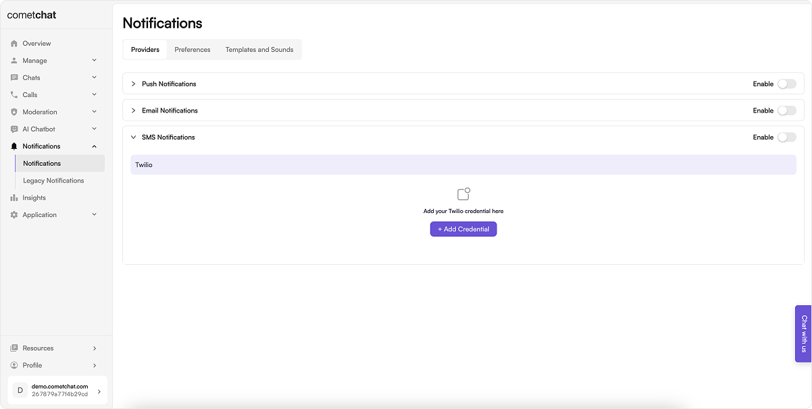
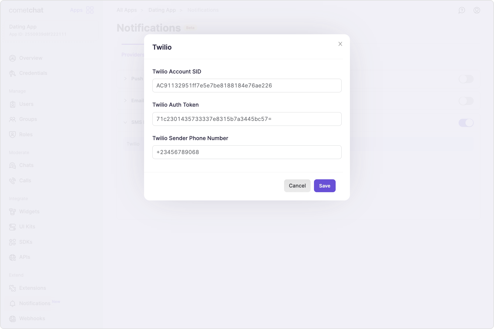
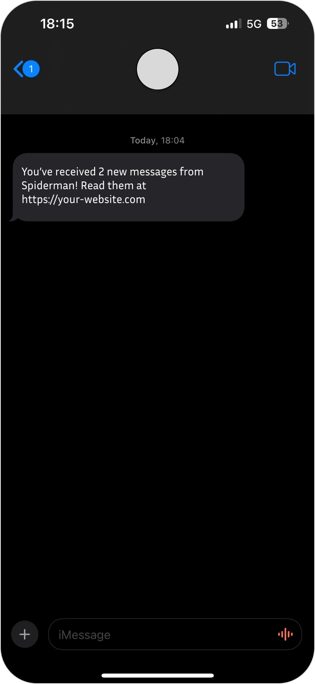

## Pre-requisite

We have partnered with Twilio for sending SMS Notifications so need to set up an account on [Twilio](https://www.twilio.com/) before you start using the extension.

### Create a new App on Twilio

1. Once you log in to Twilio, create a new app.
2. Make a note of **Account SID** and **Auth Token** for later use.
3. Click on "Get a Trial number" to get the Sender number. (Use the paid number if you already have one)
4. Make a note of the sender's **phone number** for later use.

### Store contact details

Store the phone number of your users by using our [Update Contact details API](https://api-explorer.cometchat.com/reference/notifications-update-contact-details).

## Enable SMS Notifications

1. Login to [CometChat](https://app.cometchat.com/login) dashboard and select your app.
2. Navigate to **Notifications** > **Notifications** in the left-hand menu.
3. Enable SMS notifications feature.

## Save Twilio credentials

Save the following details:

- Twilio Account SID
- Twilio Auth token
- Twilio sender phone number

## Save user's timezone

A user's timezone is required to allow them to set a schedule for receiving notifications. In case the timezone is not registered, the default timezone for

- For US region: EST
- For EU region: GMT
- For IN region: Asia/Kolkata

The timezone can be registered for a user from the SDK using the `updateTimezone()` method of `CometChatNotifications` class.

:::info
This functionality is available in the following SDK versions:

1. Android SDK version 4.0.9 and above
2. iOS SDK version 4.0.51 and above
3. Web SDK version 4.0.8 and above
4. React Native SDK version 4.0.10 and above
5. Ionic Cordova SDK version 4.0.8 and above
6. Flutter SDK version 4.0.15 and above
   :::

## Receive notifications

Send a message to any user and keep the conversation unread for the designated amount of time to receive an SMS notification.

## Next steps

Have a look at the available [preferences](./preferences-templates-sounds#sms-notification-preferences) and [templates](./preferences-templates-sounds#sms-notification-templates) for SMS notifications.
