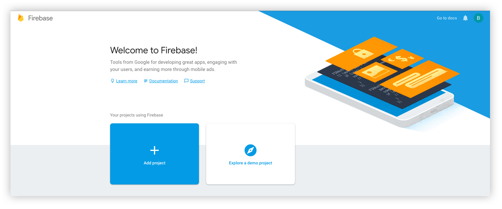
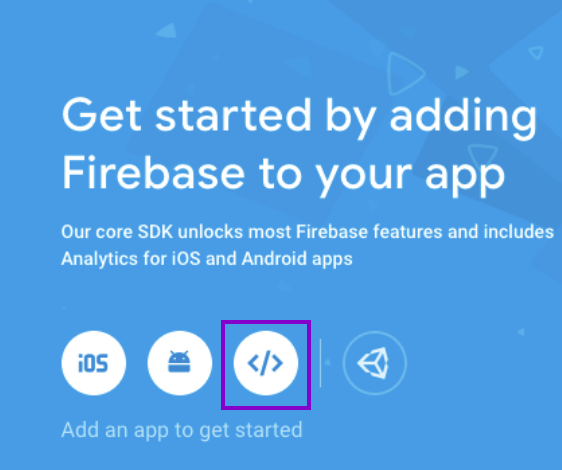
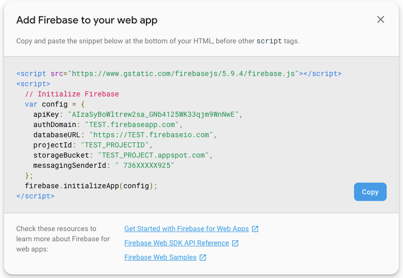

import Tabs from '@theme/Tabs';
import TabItem from '@theme/TabItem';

The Push Notification extension allows you to send push notifications to mobile apps and desktop browsers.

Push notifications will work in all desktop browsers which support [Push API](https://caniuse.com/#feat=push-api). These include:

1. Chrome 50+
2. Firefox 44+
3. Edge 17+
4. Opera 42+

<div style={{ display: 'flex', boxShadow: '0 0 4px 0 rgb(0 0 0 / 18%)', borderRadius: '3px' }}>
  <div style={{ padding: '24px' }}>
    <h3>I want to checkout the sample app</h3>
    <p>Push notifications sample app for Web (React)</p>
    <a style={{ display: 'inline-block', backgroundColor: '#7c55c9', padding: '8px', textAlign: 'center', textTransform: 'uppercase', border: '1px solid #e3e5e7', borderRadius: '3px', color: 'white', width: '100%' }}
      href="https://github.com/cometchat/cometchat-push-notification-app-react/tree/v4-push-notifications-extension" target="/blank">View on Github</a>
  </div>
</div>

## Firebase Project Setup

Visit [Firebase Console](https://console.firebase.google.com) and login/signup using your Gmail ID.

### Step 1: Create a new Firebase Project



This is a simple 3 step process where:

1. You give a name to your project
2. Add Google Analytics to your project (Optional)
3. Configure Google Analytics account (Optional)

Click on Create and you are ready to go.

### Step 2: Add Firebase to your Web App

1. Click on the Web icon on the below screen and Register your app with a nickname.
2. Once done, click on Continue to Console.



### Step 3: Download the service account file


## Extension settings

### Step 1: Enable the extension

1. Login to [CometChat](https://app.cometchat.com/login) and select your app.
2. Go to the Extensions section and Enable the Push Notifications extension.
3. Open the settings for the extension and add all the mentioned settings and hit save.


### Step 2: Save your settings

On the Settings page you need to enter the following:

1. **Set extension version**

- If you are setting it for the first time, Select `V2` to start using the enhanced version of the Push Notification extension. The enhanced version uses Token-based approach for sending Push Notifications and is simple to implement.
- If you already have an app using `V1` and want to migrate your app to use `V2`, then Select `V1 & V2` option. This ensures that the users viewing the older version of your app also receive Push Notifications.
- Eventually, when all your users are on the latest version of your app, you can change this option to `V2`, thus turning off `V1` (Topic-based) Push Notifications completely.

2. **Select the platforms that you want to support**

- Select from Web, Android, Ionic, React Native, Flutter & iOS.

3. **Notification payload settings**

- You can control if the notification key should be in the Payload or not. Learn more about the FCM Messages [here](https://firebase.google.com/docs/cloud-messaging/concept-options).

4. **Push payload message options**


- The maximum payload size supported by FCM and APNs for push notifications is approximately 4 KB. Due to the inclusion of CometChat's message object, the payload size may exceed this limit, potentially leading to non-delivery of push notifications for certain messages. The options provided allow you to remove the sender's metadata, receiver's metadata, message metadata and trim the content of the text field.

- The message metadata includes the outputs of the Thumbnail Generation, Image Moderation, and Smart Replies extensions. You may want to retain this metadata if you need to customize the notification displayed to the end user based on these outputs.

5. **Notification Triggers**


- Select the triggers for sending Push Notifications. These triggers can be classified into 3 main categories:
  1. Message Notifications
  2. Call Notifications
  3. Group Notifications
- These are pretty self-explanatory and you can toggle them as per your requirement.

## Web App Setup

### Step 1: Folder and files setup

Create a folder with the following three files:

| Files                    | Description                                                                                 |
| ------------------------ | ------------------------------------------------------------------------------------------- |
| index.html               | Displays a simple User Login Form.                                                          |
| PushNotification.js      | File with the logic to initialize CometChat and Firebase.                                   |
| firebase-messaging-sw.js | Service worker shows Push Notifications when the tab is either in the background or closed. |

### Step 2: Add the Firebase Config to the HTML File

1. Go to the Firebase Console and click on the Web app and open up the Settings page.
2. Go to the "General" tab on the Settings page.
3. Scroll down and copy the Firebase SDK snippet and paste in the &lt;head&gt; tag of your index.html file.



### Step 3: Setup index.html file

1. Include the latest CometChat library using CDN.
2. Register the service worker file.
3. Also, include the `PushNotification.js`.
4. The &lt;body&gt; has a simple form:
   1. Text input for UID.
   2. Login button.
   3. Logout button.

Once done, your `index.html` file should look like this:

<Tabs>
<TabItem value="HTML" label="HTML">

```html
<!DOCTYPE html>
<html lang="en">

<head>
  <meta charset="UTF-8">
  <meta name="viewport" content="width=device-width, initial-scale=1.0">
  <title>Push Notification Sample</title>

  <!-- The core Firebase JS SDK is always required and must be listed first -->
  <script src="https://www.gstatic.com/firebasejs/7.21.0/firebase-app.js"></script>
  <script src="https://www.gstatic.com/firebasejs/7.21.0/firebase-messaging.js"></script>

  <!-- Firebase config and initialization -->
  <script>
    const FIREBASE_CONFIG = {
      // Your Config
    };
    // Initialize Firebase only once
    firebase.initializeApp(FIREBASE_CONFIG);
  </script>

  <!-- Register the service worker. -->
  <script>
    if ('serviceWorker' in navigator) {
      window.addEventListener('load', () => {
        navigator.serviceWorker.register('/firebase-messaging-sw.js');
      });
    }
  </script>

  <!-- CometChat import -->
  <script type="text/javascript" src="https://unpkg.com/@cometchat/chat-sdk-javascript/CometChat.js"></script>

  <!-- Our app file with the CometChat and Firebase logic -->
  <script src="PushNotification.js" defer></script>
</head>

<body>
  Enhanced Push Notifications!</br>
  <input type="text" id='uid'></input></br>
  <button id='loginButton'>Login</button>
  <button id='logoutButton'>Logout</button>
</body>

</html>
```

</TabItem>
</Tabs>

### Step 4: Setup the service worker file

1. Use `importScripts` to include the `firebase-app.js` and `firebase-messaging.js` files in the service worker.
2. Also paste in the `FIREBASE_CONFIG` object again in this file.
3. Initialize the Firebase object using the config.
4. Call the messaging() on the Firebase object.

Once done, your `firebase-messaging-sw.js` file should look like this:

<Tabs>
<TabItem value="Javascript" label="Javascript">

```javascript
importScripts('https://www.gstatic.com/firebasejs/7.21.0/firebase-app.js');
importScripts(
  'https://www.gstatic.com/firebasejs/7.21.0/firebase-messaging.js'
);

const FIREBASE_CONFIG = {
  // Your Config
};

// Initialize firebase in the service worker.
firebase.initializeApp(FIREBASE_CONFIG);

// Start Receiving Push Notifications when
// the browser tab is in the background or closed.
firebase.messaging();
```

</TabItem>
</Tabs>

### Step 5: Setup the PushNotification.js file

Now our simple web app has the following:

1. Setup required to start using Firebase SDK.
2. Service worker registration when the index.html loads for the first time.

Next, we can focus on the flow to setup CometChat login process along with the steps required to setup Push Notifications using Firebase Cloud Messaging (or FCM).

During login:

1. Initialize CometChat.
2. Login using CometChat user.
3. Ask for the User's permission to show Push Notifications.
4. If permission is granted, obtain the `FCM_TOKEN`.
5. Register the obtained `FCM_TOKEN` with the extension.

During logout:

1. First delete the token using the firebase object.
2. Logout CometChat user.

The above steps have been implemented in the `login` and `logout` functions in the `PushNotifications.js` file.
You can copy paste the below code. Do not forget to replace the `APP_ID`, `REGION`, `AUTH_KEY` of your app in the code below.

<Tabs>
<TabItem value="Javascript" label="Javascript">

```javascript
const APP_ID = 'APP_ID';
const REGION = 'REGION';
const AUTH_KEY = 'AUTH_KEY';

const APP_SETTING = new CometChat.AppSettingsBuilder()
  .subscribePresenceForAllUsers()
  .setRegion(REGION)
  .build();
let FCM_TOKEN = '';

let loginButton;
let logoutButton;

const login = async () => {
  const UID = document.getElementById('uid').value;
  if (!UID) {
    document.getElementById('uid').focus();
    return;
  }
  loginButton.disabled = true;
  console.log('Initiating login... ');
  try {
    // CC init
    await CometChat.init(APP_ID, APP_SETTING);

    // User login
    const loginResponse = await CometChat.login(UID, AUTH_KEY);
    console.log('1. User login complete', loginResponse);

    CometChat.getLoggedinUser().then((user) => console.log(user.name));
    // Change the page title
    document.title = UID + ' logged in';

    // Fetch the FCM Token
    const messaging = firebase.messaging();
    FCM_TOKEN = await messaging.getToken();
    console.log('2. Received FCM Token', FCM_TOKEN);

    // Register the FCM Token
    await CometChat.registerTokenForPushNotification(FCM_TOKEN);
    console.log('3. Registered FCM Token');

    logoutButton.disabled = false;
  } catch (error) {
    console.error(error);
  }
};

const logout = async () => {
  console.log('Initiating logout...');
  loginButton.disabled = true;
  logoutButton.disabled = true;
  try {
    // Delete the token
    const messaging = firebase.messaging();
    await messaging.deleteToken();

    // Logout the user
    await CometChat.logout();
    console.log('5. Logged out');

    // Refresh the page.
    init();
    window.location.reload();
  } catch (error) {
    console.error(error);
  }
};

const init = () => {
  // Basic initialization
  loginButton = document.getElementById('loginButton');
  logoutButton = document.getElementById('logoutButton');

  loginButton.addEventListener('click', login);
  logoutButton.addEventListener('click', logout);

  logoutButton.disabled = true;
};

window.onload = () => {
  // Call the initialization function on load.
  setTimeout(init, 300);
};
```

</TabItem>
</Tabs>

## Start receiving Push Notifications

1. You can now host the project folder using Nginx, Apache web server, or even VSCode Live server extension.
2. Launch the web app in a browser and open the browser console to see the logs.
3. Enter the UID of the user and click on login.
4. When asked for permission to show notifications, click on Allow.
5. Once you see logs saying that the FCM Token has been registered, either send the browser tab to the background or close it completely.
6. Send a message to this logged-in user from another device (using our Sample Apps) and you should be able to see the Push Notifications.

## Stop receiving Push Notifications

1. Reopen the previous closed browser tab and click on logout.
2. The `FCM_TOKEN` will be deleted on the extension's end on the `CometChat.logout()` call.
3. As a good practice, the `FCM_TOKEN` should also be deleted using the `firebase.messaging().deleteToken()`.

## Custom body for notifications

To send custom body for notifications or to receive notification of `CustomMessage`, you need to set metadata while sending the `CustomMessage`.

<Tabs>
<TabItem value="Javascript" label="Javascript">

```javascript
var receiverID = 'UID';
var customData = {
  latitude: '50.6192171633316',
  longitude: '-72.68182268750002',
};

var customType = 'location';
var receiverType = CometChat.RECEIVER_TYPE.USER;
var metadata = {
  pushNotification: 'Your Notification Message',
};

var customMessage = new CometChat.CustomMessage(
  receiverID,
  receiverType,
  customType,
  customData
);

customMessage.setMetadata(metadata);

CometChat.sendCustomMessage(customMessage).then(
  (message) => {
    // Message sent successfully.
    console.log('custom message sent successfully', message);
  },
  (error) => {
    console.log('custom message sending failed with error', error);
    // Handle exception.
  }
);
```

</TabItem>
</Tabs>
