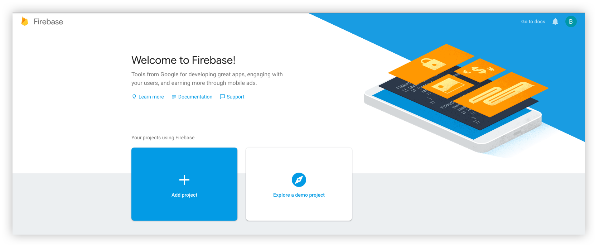
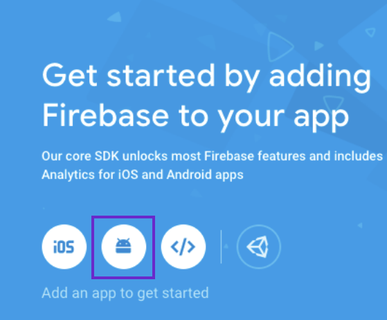
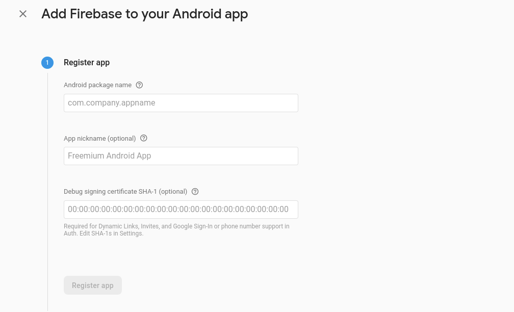
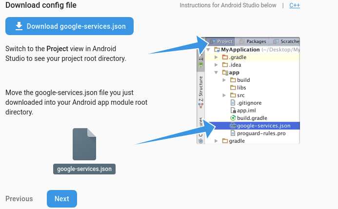
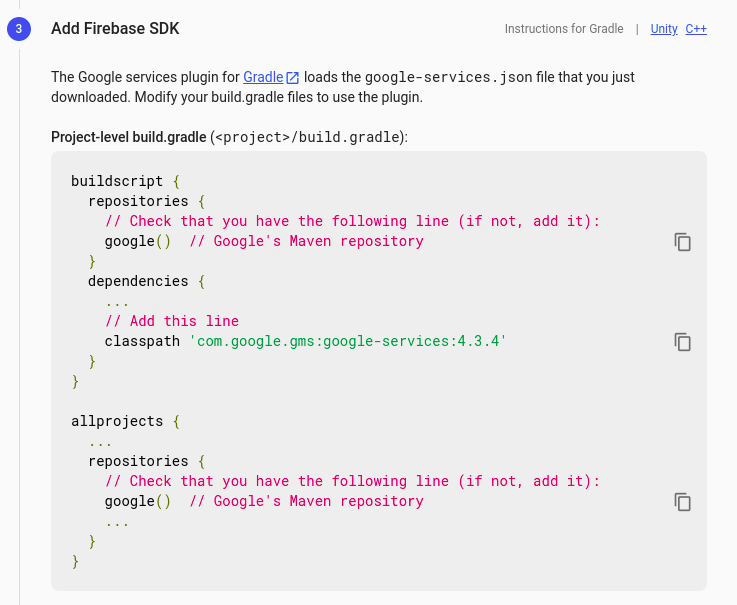
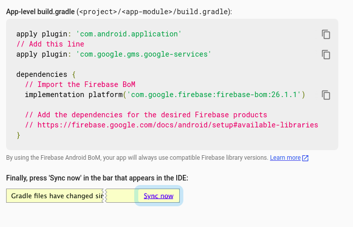
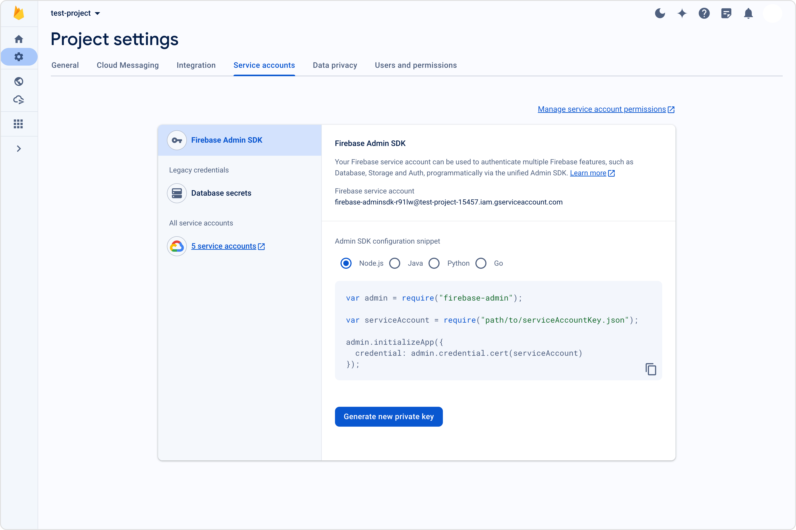
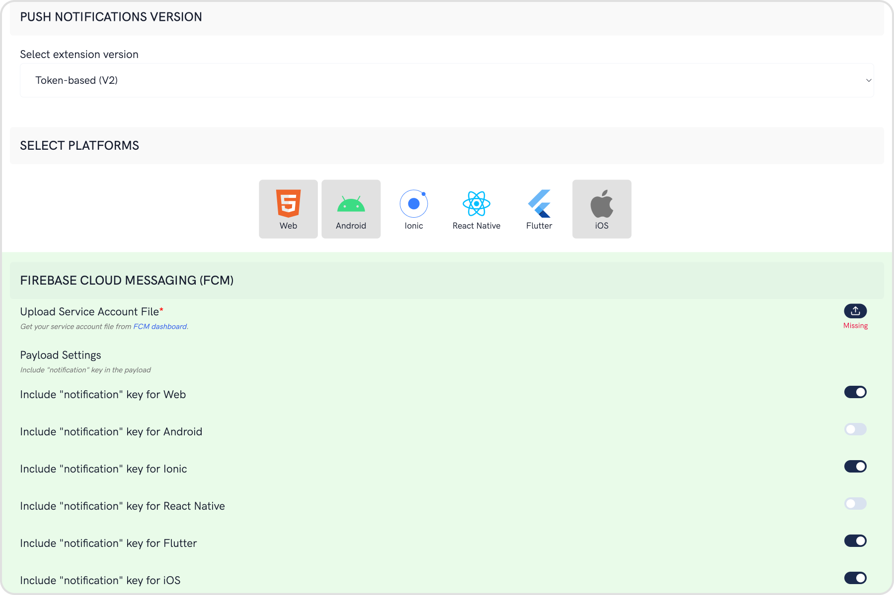
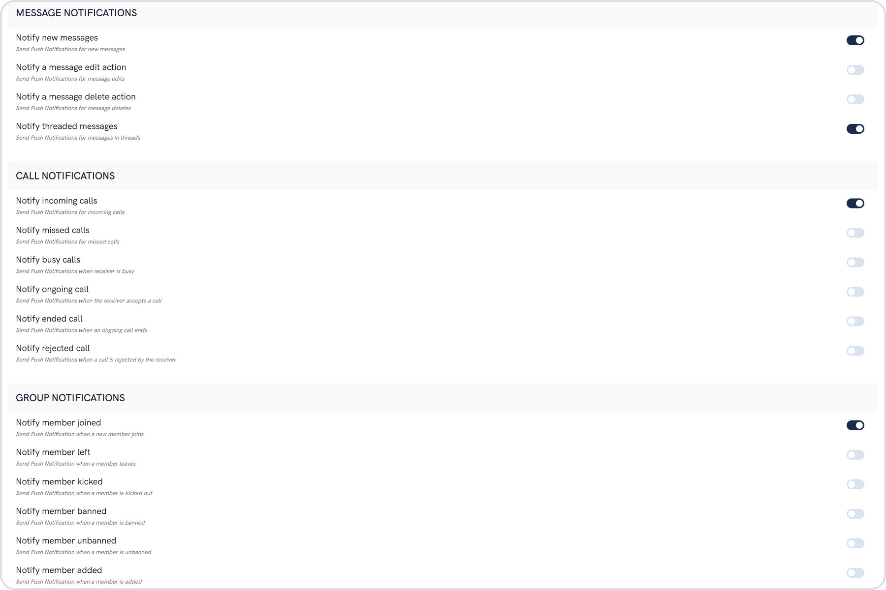
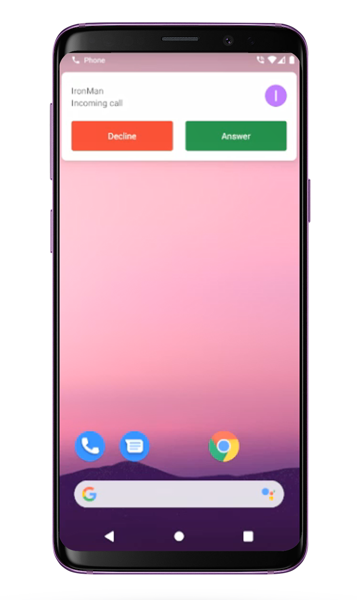

import Tabs from '@theme/Tabs';
import TabItem from '@theme/TabItem';

Learn how to send Push Notifications to your Android app using Firebase Cloud Messaging or FCM.

<div style={{ display: 'flex', boxShadow: '0 0 4px 0 rgb(0 0 0 / 18%)', borderRadius: '3px' }}>
  <div style={{ padding: '24px' }}>
    <h3>I want to checkout the sample app</h3>
    <p>Android Push notifications sample app</p>
    <a style={{ display: 'inline-block', backgroundColor: '#7c55c9', padding: '8px', textAlign: 'center', textTransform: 'uppercase', border: '1px solid #e3e5e7', borderRadius: '3px', color: 'white', width: '100%' }}
      href="https://github.com/cometchat/cometchat-push-notification-app-android/tree/v4-push-notifications-extension" target="/blank">View on Github</a>
  </div>
</div>

## Firebase Project Setup

Visit [Firebase Console](https://console.firebase.google.com/) and login/signup using your Gmail ID.

### Step 1: Create a new Firebase Project

On your Firebase Console, create a new project.



This is a simple 3 step process where:

1. You give a name to your project
2. Add Google Analytics to your project (Optional)
3. Configure Google Analytics account (Optional)

Click on Create and you are ready to go.

### Step 2: Add Firebase to your Android App

1. Click on the Android icon as shown on the screen below.



2. Register your Android app by providing the following details:
   1. Android Package name
   2. App nickname (optional)
   3. Debug signing certificate SHA-1 (optional)

<br/>



3. Download the google-services.json file and place it in the required location in your project.



4. Add Firebase SDK by copying and pasting the snippets in the Project-level build.gradle file.



5. Add Firebase SDK by copying and pasting the snippets in the App-level build.gradle file.



6. Click on 'Continue to Console' to finish the setup.

### Step 3: Download the service account file



## Extension settings

### Step 1: Enable the extension

1. Login to [CometChat](https://app.cometchat.com/login) and select your app.
2. Go to the Extensions section and Enable the Push Notifications extension.
3. Open the settings for this extension and save the following.



### Step 2: Save your settings

On the Settings page you need to enter the following:

1. **Set extension version**

- If you are setting it for the first time, Select `V2` to start using the enhanced version of the Push Notification extension. The enhanced version uses Token-based approach for sending Push Notifications and is simple to implement.
- If you already have an app using `V1` and want to migrate your app to use `V2`, then Select `V1 & V2` option. This ensures that the users viewing the older version of your app also receive Push Notifications.
- Eventually, when all your users are on the latest version of your app, you can change this option to `V2`, thus turning off `V1` (Topic-based) Push Notifications completely.

2. **Select the platforms that you want to support**

- Select from Web, Android, Ionic, React Native, Flutter & iOS.

3. **Notification payload settings**

- You can control if the notification key should be in the Payload or not. Learn more about the FCM Messages [here](https://firebase.google.com/docs/cloud-messaging/concept-options).

4. **Push payload message options**


The maximum payload size supported by FCM and APNs for push notifications is approximately 4 KB. Due to the inclusion of CometChat's message object, the payload size may exceed this limit, potentially leading to non-delivery of push notifications for certain messages. The options provided allow you to remove the sender's metadata, receiver's metadata, message metadata and trim the content of the text field.

- The message metadata includes the outputs of the Thumbnail Generation, Image Moderation, and Smart Replies extensions. You may want to retain this metadata if you need to customize the notification displayed to the end user based on these outputs.

5. **Notification Triggers**



- Select the triggers for sending Push Notifications. These triggers can be classified into 3 main categories:
  1. Message Notifications
  2. Call Notifications
  3. Group Notifications
- These are pretty self-explanatory and you can toggle them as per your requirement.

## Android App Setup

In the Firebase Project setup, we did the following things:

1. Added google-services.json file to the project.
2. Added the required Firebase SDK snippets to the Project-level build.grade file.
3. Added the required Firebase SDK snippets to the App-level build.gradle file.

If you want more details, check the [Firebase Documentation](https://firebase.google.com/docs/cloud-messaging/android/client).

### Step 1: Register the FCM Token on user login

1. Initialize CometChat and then login your user.
2. On successful login, you can register the obtained FCM Token using `CometChat.registerTokenForPushNotification()` function call. (You can see the process of getting the FCM Token in the next step)

<Tabs>
<TabItem value="Java" label="Java">

```java
CometChat.registerTokenForPushNotification(MyFirebaseMessagingService.token, new CometChat.CallbackListener<String>() {
    @Override
    public void onSuccess(String s) {
        Log.e( "onSuccessPN: ",s );
    }
    @Override
    public void onError(CometChatException e) {
        Log.e("onErrorPN: ",e.getMessage() );
    }
});
```

</TabItem>
<TabItem value="Kotlin" label="Kotlin">

```kotlin
CometChat.registerTokenForPushNotification(MyFirebaseMessagingService.token, object : CallbackListener<String?>() {
            override fun onSuccess(s: String?) {
                Log.e("onSuccessPN: ", s)
            }

            override fun onError(e: CometChatException) {
                Log.e("onErrorPN: ", e.message)
            }
        })
```

</TabItem>
</Tabs>

To fetch the registered token you can use below Firebase method.

<Tabs>
<TabItem value="Java" label="Java">

```java
FirebaseInstanceId.getInstance().getInstanceId().addOnCompleteListener(
  new OnCompleteListener<InstanceIdResult>() {
    @Override
    public void onComplete(@NonNull Task<InstanceIdResult> task) {
      	if (!task.isSuccessful()) {
          return;
        }
      token = task.getResult().getToken();
      //CometChat.registerTokenForPushNotification(token, CometChat.CallbackListener<String>());
    }
});
```

</TabItem>
<TabItem value="Kotlin" label="Kotlin">

```kotlin
FirebaseInstanceId.getInstance().getInstanceId()
   .addOnCompleteListener(object : OnCompleteListener<InstanceIdResult?>() {
     fun onComplete(task: com.google.android.gms.tasks.Task<InstanceIdResult>) {
       if (!task.isSuccessful()) {
         return
       }
       token = task.getResult().getToken()
       //CometChat.registerTokenForPushNotification(token,CometChat.CallbackListener<String?>())
     }
   })
```

</TabItem>
</Tabs>

### Step 2: Setup ConnectionService.



**ConnectionService** is an abstract service used to handle VoIP & other calls. It is part of android.telecom package which helps to handle telecom services. ConnectionService can be used either as System-Managed Service where System defined UI is shown to handle the calls. It can also be used as Self-Managed Service where users can show their own calling UI to handle the calls.

_Note - Currently the sample app uses system-managed connection service, So the System UI will be displayed to handle incoming calls._

Learn more about [ConnectionService](https://developer.android.com/reference/android/telecom/ConnectionService).

| Files                                                                                                                                                                                                                     | Description                                                                                                                                                                                                  |
| ------------------------------------------------------------------------------------------------------------------------------------------------------------------------------------------------------------------------- | ------------------------------------------------------------------------------------------------------------------------------------------------------------------------------------------------------------ |
| [CallConnectionService.java](https://github.com/cometchat/cometchat-push-notification-app-android/blob/v4-push-notifications-extension/app/src/main/java/com/cometchat/pushnotificationsample/CallConnectionService.java) | Custom ConnectionService file which is used to handle incoming & outgoing calls. It is used to manages the ConnectionService with your app. It also handles PhoneAccounts and bind it's services to Telecom. |
| [CallConnection.java](https://github.com/cometchat/cometchat-push-notification-app-android/blob/v4-push-notifications-extension/app/src/main/java/com/cometchat/pushnotificationsample/CallConnection.java)               | Custom Connection class which is used to handle the callbacks of ConnectionService.<br /><br />Call backs such as onAnswer(), onReject(), onHold(), etc.                                                     |
| [CallManager.java](https://github.com/cometchat/cometchat-push-notification-app-android/blob/v4-push-notifications-extension/app/src/main/java/com/cometchat/pushnotificationsample/CallConnectionService.java)           | It is used to manages the ConnectionService with your app. It also handles PhoneAccounts and bind it's services to Telecom.                                                                                  |

### Step 3: Receive notifications

1. The FCM Token can be received by overriding the `onNewToken()` method. This token is stored as a String variable. You can choose to store it in SharedPreferences as well.
2. To receive messages, you need to override the onMessageReceived(RemoteMessage remoteMessage).
3. [PushNotificationService.java](https://github.com/cometchat/cometchat-push-notification-app-android/blob/v4-push-notifications-extension/app/src/main/java/com/cometchat/pushnotificationsample/PushNotificationService.java) has the code that provides a way you can handle messages received from CometChat users and groups.
4. Since Android O, there have been certain restrictions added for background tasks and users cannot launch intent directly from the service. More details [here](https://developer.android.com/guide/components/activities/background-starts).
5. You also need to add the above-mentioned MyFirebasMessagingService.java fil in your AndroidManifest.xml to make Push notification work in the background as well.

<Tabs>
<TabItem value="XML" label="XML">

```xml
<service
    android:name=".MyFirebaseMessagingService"
    android:exported="true"
    android:enabled="true">
    <intent-filter>
         <action android:name="com.google.firebase.MESSAGING_EVENT" />
    </intent-filter>
</service>
```

</TabItem>
</Tabs>

### Converting Push Notification Payloads to Message Objects

CometChat provides a method `CometChatHelper.processMessage()` to convert the message JSON to the corresponding object of `TextMessage`, `MediaMessage`, `CustomMessage`, `Action` or `Call`.

This code needs to be added to the `onMessageReceived()` method of the `FirebaseMessagingService` class.

<Tabs>
<TabItem value="Java" label="Java">

```java
CometChatHelper.processMessage(new JSONObject(remoteMessage.getData().get("message"));
```

</TabItem>
</Tabs>

:::info
Type of Attachment can be of the following the type <br/> `CometChatConstants.MESSAGE_TYPE_IMAGE`<br/> `CometChatConstants.MESSAGE_TYPE_VIDEO`<br/> `CometChatConstants.MESSAGE_TYPE_AUDIO`<br/> `CometChatConstants.MESSAGE_TYPE_FILE`
:::

Push Notification Payload sample for text and media messages-

<Tabs>
<TabItem value="JSON" label="Text message">

```json
{
  "alert": "Nancy Grace: Text Message",
  "sound": "default",
  "title": "CometChat",
  "message": {
    "receiver": "cometchat-uid-4",
    "data": {
      "entities": {
        "receiver": {
          "entityType": "user",
          "entity": {
            "uid": "cometchat-uid-4",
            "role": "default",
            "name": "Susan Marie",
            "avatar": "https://assets.cometchat.io/sampleapp/v2/users/cometchat-uid-4.webp",
            "status": "offline"
          }
        },
        "sender": {
          "entityType": "user",
          "entity": {
            "uid": "cometchat-uid-3",
            "role": "default",
            "name": "Nancy Grace",
            "avatar": "https://assets.cometchat.io/sampleapp/v2/users/cometchat-uid-3.webp",
            "status": "offline"
          }
        }
      },
      "text": "Text Message"
    },
    "sender": "cometchat-uid-3",
    "receiverType": "user",
    "id": "142",
    "sentAt": 1555668711,
    "category": "message",
    "type": "text"
  }
}
```

</TabItem>
<TabItem value="JSON1" label="Media message">

```json
{
  "alert": "Nancy Grace: has sent an image",
  "sound": "default",
  "title": "CometChat",
  "message": {
    "receiver": "cometchat-uid-4",
    "data": {
      "attachments": [
        {
          "extension": "png",
          "size": 14327,
          "name": "extension_leftpanel.png",
          "mimeType": "image/png",
          "url": "https://s3-eu-west-1.amazonaws.com/data.cometchat.com/1255466c41bd7f/media/1555671238_956450103_extension_leftpanel.png"
        }
      ],
      "entities": {
        "receiver": {
          "entityType": "user",
          "entity": {
            "uid": "cometchat-uid-4",
            "role": "default",
            "name": "Susan Marie",
            "avatar": "https://assets.cometchat.io/sampleapp/v2/users/cometchat-uid-4.webp",
            "status": "offline"
          }
        },
        "sender": {
          "entityType": "user",
          "entity": {
            "uid": "cometchat-uid-3",
            "role": "default",
            "name": "Nancy Grace",
            "avatar": "https://assets.cometchat.io/sampleapp/v2/users/cometchat-uid-3.webp",
            "status": "offline"
          }
        }
      },
      "url": "https://s3-eu-west-1.amazonaws.com/data.cometchat.com/1255466c41bd7f/media/1555671238_956450103_extension_leftpanel.png"
    },
    "sender": "cometchat-uid-3",
    "receiverType": "user",
    "id": "145",
    "sentAt": 1555671238,
    "category": "message",
    "type": "image"
  }
}
```

</TabItem>
</Tabs>
