import Tabs from '@theme/Tabs';
import TabItem from '@theme/TabItem';

Learn how to send out Push Notifications to your iOS using Firebase Cloud Messaging or FCM.

:::info Don't want to use FCM?
You can refer to [our setup](./ios-apns-push-notifications) using the Apple Push Notifications service (APNs).
:::

<div style={{ display: 'flex', boxShadow: '0 0 4px 0 rgb(0 0 0 / 18%)', borderRadius: '3px' }}>
  <div style={{ padding: '24px' }}>
    <h3>I want to checkout the sample app</h3>
    <p>iOS Push notifications sample app</p>
    <a style={{ display: 'inline-block', backgroundColor: '#7c55c9', padding: '8px', textAlign: 'center', textTransform: 'uppercase', border: '1px solid #e3e5e7', borderRadius: '3px', color: 'white', width: '100%' }}
      href="https://github.com/cometchat/cometchat-push-notification-app-ios/tree/v4-push-notifications-extension" target="/blank">View on Github</a>
  </div>
</div>

## Firebase Project Setup

Visit [Firebase Console](https://console.firebase.google.com/) and login/signup using your Gmail ID.

### Step 1: Create a new Firebase Project

On your Firebase Console, create a new project.

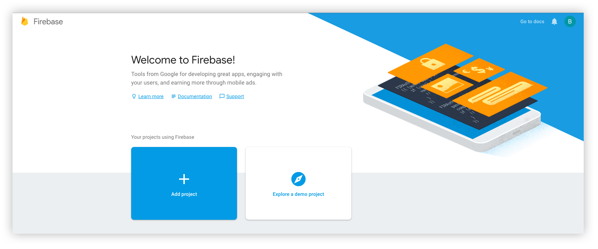

This is a simple 3 step process where:

1. You give a name to your project
2. Add Google Analytics to your project (Optional)
3. Configure Google Analytics account (Optional)

Click on Create and you are ready to go.

### Step 2: Add Firebase to your iOS App

1. Click on the iOS icon as shown on the screen below.

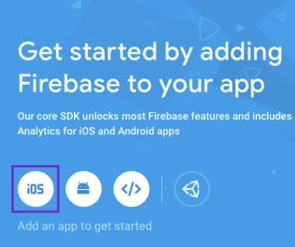

2. Register your Android app by providing the following details:
   a. iOS bundle name
   b. App nickname (optional)
   c. App Store ID (optional)

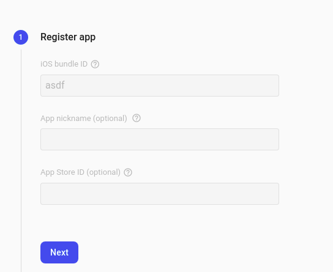

3. Download the GoogleService-Info.plist file and place it in the mentioned location of your project.
   Move your config file into the root of your Xcode project.
   If prompted, select to add the config file to all targets as follows.

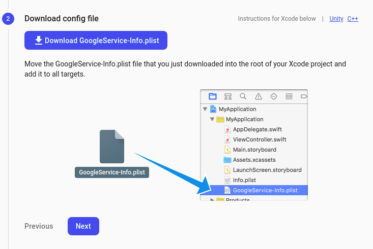


4. We will Add Firebase SDK and Initialisation code later. So, click on 'Next', 'Next', and 'Continue to the Console'.

### Step 3: Download the service account file


## Extension settings

### Step 1: Enable the extension

1. Login to [CometChat](https://app.cometchat.com/login) and select your app.
2. Go to the Extensions section and Enable the Push Notifications extension.
3. Open the settings for this extension and save the following settings.


### Step 2: Save your settings

On the Settings page you need to enter the following:

1. **Set extension version**

- If you are setting it for the first time, Select `V2` to start using the enhanced version of the Push Notification extension. The enhanced version uses Token-based approach for sending Push Notifications and is simple to implement.
- If you already have an app using `V1` and want to migrate your app to use `V2`, then Select `V1 & V2` option. This ensures that the users viewing the older version of your app also receive Push Notifications.
- Eventually, when all your users are on the latest version of your app, you can change this option to `V2`, thus turning off `V1` (Topic-based) Push Notifications completely.

2. **Select the platforms that you want to support**

- Select from Web, Android, Ionic, React Native, Flutter & iOS.

3. **Notification payload settings**

- You can control if the notification key should be in the Payload or not. Learn more about the FCM Messages [here](https://firebase.google.com/docs/cloud-messaging/concept-options).

4. **Push payload message options**

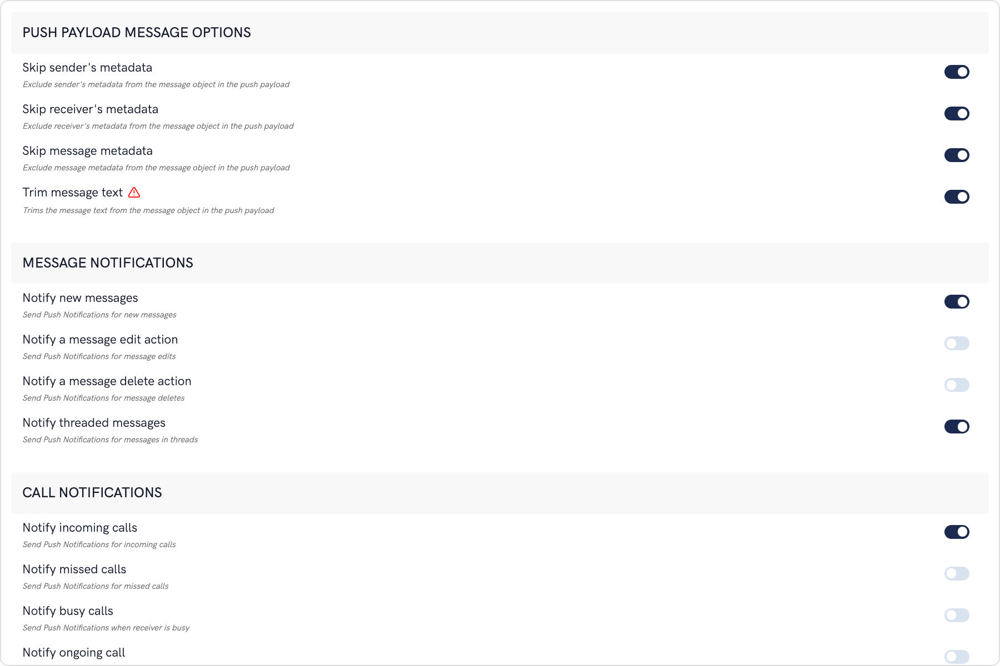

The maximum payload size supported by FCM and APNs for push notifications is approximately 4 KB. Due to the inclusion of CometChat's message object, the payload size may exceed this limit, potentially leading to non-delivery of push notifications for certain messages. The options provided allow you to remove the sender's metadata, receiver's metadata, message metadata and trim the content of the text field.

- The message metadata includes the outputs of the Thumbnail Generation, Image Moderation, and Smart Replies extensions. You may want to retain this metadata if you need to customize the notification displayed to the end user based on these outputs.

5. **Notification Triggers**


- Select the triggers for sending Push Notifications. These triggers can be classified into 3 main categories:
  1. Message Notifications
  2. Call Notifications
  3. Group Notifications
- These are pretty self-explanatory and you can toggle them as per your requirement.

## Get APNS Credentials

The following steps in this section are written on the assumption that you already have an app ID assigned to your client app.

### Step 1: Create a Certificate Signing Request

To obtain a signing certificate required to sign apps for installation on iOS devices, you should first create a certificate signing request (CSR) file through Keychain Access on your Mac.

1. Open the Keychain Access from the utility folder, go to Keychain Access &gt; Certificate Assistant &gt; Request a Certificate From a Certificate Authority, and then click.

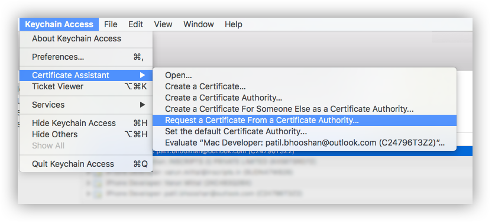

2. The Certificate Information dialog box appears. Enter the email address that you use in your Apple Developer account, and enter a common name for your private key. Don't enter CA email address, choose Saved to disk, and then click the Continue button.

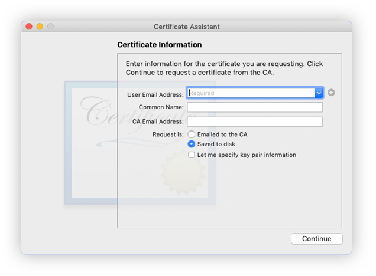

3. Specify the name of your CSR to save and choose the location to save the file on your local disk. Then your CSR file is created, which contains a public/private key pair.

### Step 2: Create an SSL certificate

1. Sign in to your account at the [Apple Developer Member Center](https://developer.apple.com/membercenter).
2. Go to Certificates, Identifiers & Profiles. In the Identifiers &gt; App IDs and select the Push Notifications service under Application Services
3. Click the Edit button.

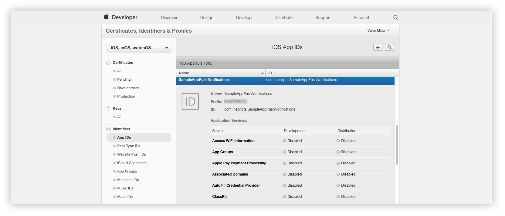

4. Under the Push Notifications service, choose which SSL certificate to create either Development or Production.

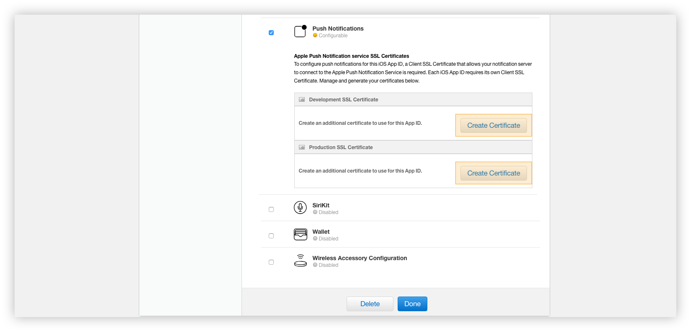

5. In the Generate your certificate pane that appears after the selection, under Upload CSR file., upload the CSR file you created through the Choose File... button. To complete the process, choose Continue. When the certificate is ready, choose Download to save it to your Mac.

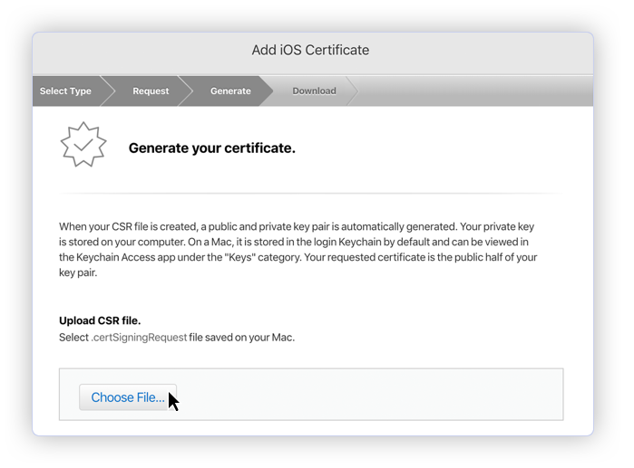

6. In order to install the downloaded certificate to the KeyChain Access on your Mac, double-click it. You can find the certificate in the KeyChain Access &gt; login &gt; Certificates.

### Step 3: Export and update .p12 file to Firebase

1. Type a name for the .p12 file and save it to your Mac.
2. Browse to the location where you saved your key, select it, and click Open. Add the key ID for the key (available in Certificates, Identifiers & Profiles in the Apple Developer Member Center) and export it.


### Step 4: Upload your APNs Certificates

1. Go to Firebase console and open your project.
2. Inside your iOS project in the Firebase console, select settings and then select the `Cloud Messaging` tab.
3. Scroll down to iOS app configuration, click the Upload button for APNS certificate.
4. Browse to the location where you saved your APNs Certificates, select it, and click Open.

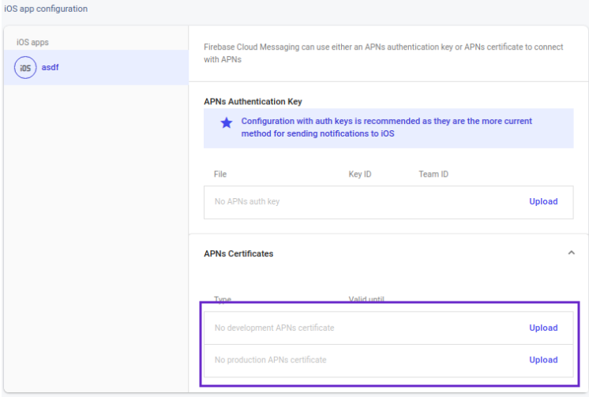

## iOS App Setup

### Step 1: Initial Firebase Cloud Messaging client setup

1. Add the Firebase SDK, Add the firebase pods that you want to install. You can include a Pod in your Podfile like this:

<Tabs>
<TabItem value="Swift" label="Swift">

```swift
pod 'Firebase_Core'
pod 'Firebase_Messaging'
```

</TabItem>
</Tabs>

2. Import the Firebase module in your `ApplicationDelegate:`

<Tabs>
<TabItem value="Swift" label="Swift">

```swift
import Firebase
```

</TabItem>
<TabItem value="Objective C" label="Objective C">

```objectivec
@import Firebase;
```

</TabItem>
</Tabs>

3. Configure a FirebaseApp shared instance, typically in your application's `application:didFinishLaunchingWithOptions: method:`

<Tabs>
<TabItem value="Swift" label="Swift">

```swift
FirebaseApp.configure()
```

</TabItem>
<TabItem value="Objective C" label="Objective C">

```objectivec
[FIRApp configure];
```

</TabItem>
</Tabs>

### Step 2: Register the FCM Token

1. Get the FCM Token for remote notifications, typically in your application's `application:didFinishLaunchingWithOptions: method:`

<Tabs>
<TabItem value="Swift" label="Swift">

```swift
Messaging.messaging().delegate = self

if #available(iOS 10.0, *) {
  UNUserNotificationCenter.current().delegate = self

  let authOptions: UNAuthorizationOptions = [.alert, .badge, .sound]
  UNUserNotificationCenter.current().requestAuthorization(
    options: authOptions,
    completionHandler: {
      _,
      _ in
    })
} else {
  let settings: UIUserNotificationSettings =
    UIUserNotificationSettings(types: [.alert, .badge, .sound], categories: nil)
  application.registerUserNotificationSettings(settings)
}

application.registerForRemoteNotifications()
```

</TabItem>
<TabItem value="Objective C" label="Objective C">

```objectivec
[FIRMessaging messaging].delegate = self;

if ([UNUserNotificationCenter class] != nil) {

  [UNUserNotificationCenter currentNotificationCenter].delegate = self;

  UNAuthorizationOptions authOptions = UNAuthorizationOptionAlert |  UNAuthorizationOptionSound | UNAuthorizationOptionBadge;

  [[UNUserNotificationCenter currentNotificationCenter] requestAuthorizationWithOptions: authOptions completionHandler: ^ (BOOL granted, NSError * _Nullable error) {
      // ...
    }
  ];

} else {
  UIUserNotificationType allNotificationTypes = (UIUserNotificationTypeSound | UIUserNotificationTypeAlert | UIUserNotificationTypeBadge);

  UIUserNotificationSettings * settings = [UIUserNotificationSettings settingsForTypes: allNotificationTypes categories: nil];

  [application registerUserNotificationSettings: settings];

}
[application registerForRemoteNotifications];
```

</TabItem>
</Tabs>

<Tabs>
<TabItem value="Swift" label="Swift">

```swift
func application(_ application: UIApplication, didFailToRegisterForRemoteNotificationsWithError error: Error) {
  print("Unable to register for remote notifications: \\(error.localizedDescription)")
}

func application(_ application: UIApplication, didRegisterForRemoteNotificationsWithDeviceToken deviceToken: Data) {
  print("APNs token retrieved: \\(deviceToken)")

  Messaging.messaging().apnsToken = deviceToken
}
```

</TabItem>
<TabItem value="Objective C" label="Objective C">

```objectivec
-(void)application:(UIApplication *)application didFailToRegisterForRemoteNotificationsWithError:(NSError *)error
{
    NSLog(@"Unable to register for remote notifications: %@", error);
}

-(void)application:(UIApplication *)application didRegisterForRemoteNotificationsWithDeviceToken:(NSData *)deviceToken
{
    NSLog(@"APNs device token retrieved: %@", deviceToken);
    [FIRMessaging messaging].APNSToken = deviceToken;
}
```

</TabItem>
</Tabs>

2. Register the FCM token with our Push Notifications extension on success of CometChat.login

<Tabs>
<TabItem value="Swift" label="Swift">

```swift
let authKey = "XXXX XXXX XXXXX"

CometChat.login(UID: UID, authKey: authKey, onSuccess: { (user) in
  DispatchQueue.main.async {
   if let token = UserDefaults.standard.value(forKey: "fcmToken") as?  String {
    CometChat.registerTokenForPushNotification(token: token, onSuccess: { (success) in
    print("onSuccess to  registerTokenForPushNotification: \\(success)")
   }) { (error) in
     print("error to registerTokenForPushNotification")
     }
}
```

</TabItem>
</Tabs>

3. This also needs to be done when you refresh your FCM Token

<Tabs>
<TabItem value="Swift" label="Swift">

```swift
extension AppDelegate : MessagingDelegate {
    // [START refresh_token]
    func messaging(_ messaging: Messaging, didReceiveRegistrationToken fcmToken: String) {
        print("Firebase registration token: \\(fcmToken)")

        UserDefaults.standard.set(fcmToken, forKey: "fcmToken")
        CometChat.registerTokenForPushNotification(token: fcmToken, onSuccess: { (sucess) in
            print("token registered \\(sucess)")
        }) { (error) in
            print("token registered error \\(String(describing: error?.errorDescription))")
        }


        let dataDict:[String: String] = ["token": fcmToken]
        NotificationCenter.default.post(name: Notification.Name("FCMToken"), object: nil, userInfo: dataDict)
    }
}
```

</TabItem>
</Tabs>

### Step 3: Start receiving Push Notifications

1. Receive remote notification, typically in your application's `App Delegate:`

<Tabs>
<TabItem value="Swift" label="Swift">

```swift
func application(_ application: UIApplication, didReceiveRemoteNotification userInfo: [AnyHashable: Any]) {

  // Print full message.
  print(userInfo)
}

func application(_ application: UIApplication, didReceiveRemoteNotification userInfo: [AnyHashable: Any], fetchCompletionHandler completionHandler: @escaping(UIBackgroundFetchResult) -> Void) {

  // Print full message.
  print(userInfo)

  completionHandler(UIBackgroundFetchResult.newData)
}
```

</TabItem>
<TabItem value="Objective C" label="Objective C">

```objectivec
- (void)application:(UIApplication *)application didReceiveRemoteNotification:(NSDictionary *)userInfo {

  // Print full message.
  NSLog(@"%@", userInfo);
}

- (void)application:(UIApplication *)application didReceiveRemoteNotification:(NSDictionary *)userInfo
    fetchCompletionHandler:(void (^)(UIBackgroundFetchResult))completionHandler {

  // Print full message.
  NSLog(@"%@", userInfo);

  completionHandler(UIBackgroundFetchResultNewData);
}
```

</TabItem>
</Tabs>

2. Receive Notification for `CustomMessage`:

To receive and display notifications for `CustomMessage`, the developer needs to set `metadata` while sending the `CustomMessage` value as follows:

<Tabs>
<TabItem value="Swift" label="Swift">

```swift
var receiverID = "cometchat-uid-1";
var message = [
  "someRandomKey": "someRandomData"
];

var customMessage = CustomMessage(receiverUid: receiverID, receiverType: ReceiverTypeUser, customData: message);

// to display custom notification banner add this , "pushNotification" key is not to modify, although you can modify banner text as shown beow   //
var customNotificationDisplayText = [
  "pushNotification": "notification_banner_text_here";
];

// set it as metadata of `Custom message`
customMessage.metaData = customNotificationDisplayText;

CometChat.sendCustomMessage(withMessage: customMessage, onSuccess: { sentMessage in

    print("sentMessage \\(sentMessage.stringValue)");

}, onError: { error in

    if let error = error?.errorDescription() {
        print("error sending custom message \\(error)");
    }
});
```

</TabItem>
<TabItem value="Objective C" label="Objective C">

```objectivec
NSString * receiverID = @ "cometchat-uid-1";
NSDictionary * message = [NSDictionary dictionaryWithObjectsAndKeys: @ "someRandomData", @ "someRandomKey", nil];

CustomMessage * customMessage = [
  [CustomMessage alloc] initWithReceiverUid: receiverID receiverType: ReceiverTypeUser customData: message
];

// to display custom notification banner add this //
NSDictionary * customNotificationDisplayText = [NSDictionary dictionaryWithObjectsAndKeys: @ "notification_banner_text_here", @ "pushNotification", nil];

[customMessage setMetaData: customNotificationDisplayText];


[CometChat sendCustomMessageWithMessage: customMessage onSuccess: ^ (CustomMessage * _Nonnull sentMessage) {

    NSLog(@ "sentMessage %@", [sentMessage stringValue]);

  }
  onError: ^ (CometChatException * _Nullable error) {

    NSLog(@ "error sending custom message %@", [error errorDescription]);
  }
];
```

</TabItem>
</Tabs>

Push Notification Payload sample for text and media messages-

<Tabs>
<TabItem value="JSON" label="Text message">

```json
{
  "alert": "Nancy Grace: Text Message",
  "sound": "default",
  "title": "CometChat",
  "message": {
    "receiver": "cometchat-uid-4",
    "data": {
      "entities": {
        "receiver": {
          "entityType": "user",
          "entity": {
            "uid": "cometchat-uid-4",
            "role": "default",
            "name": "Susan Marie",
            "avatar": "https://assets.cometchat.io/sampleapp/v2/users/cometchat-uid-4.webp",
            "status": "offline"
          }
        },
        "sender": {
          "entityType": "user",
          "entity": {
            "uid": "cometchat-uid-3",
            "role": "default",
            "name": "Nancy Grace",
            "avatar": "https://assets.cometchat.io/sampleapp/v2/users/cometchat-uid-3.webp",
            "status": "offline"
          }
        }
      },
      "text": "Text Message"
    },
    "sender": "cometchat-uid-3",
    "receiverType": "user",
    "id": "142",
    "sentAt": 1555668711,
    "category": "message",
    "type": "text"
  }
}
```

</TabItem>
<TabItem value="JSON1" label="Media message">

```json
{
  "alert": "Nancy Grace: has sent an image",
  "sound": "default",
  "title": "CometChat",
  "message": {
    "receiver": "cometchat-uid-4",
    "data": {
      "attachments": [
        {
          "extension": "png",
          "size": 14327,
          "name": "extension_leftpanel.png",
          "mimeType": "image/png",
          "url": "https://s3-eu-west-1.amazonaws.com/data.cometchat.com/1255466c41bd7f/media/1555671238_956450103_extension_leftpanel.png"
        }
      ],
      "entities": {
        "receiver": {
          "entityType": "user",
          "entity": {
            "uid": "cometchat-uid-4",
            "role": "default",
            "name": "Susan Marie",
            "avatar": "https://assets.cometchat.io/sampleapp/v2/users/cometchat-uid-4.webp",
            "status": "offline"
          }
        },
        "sender": {
          "entityType": "user",
          "entity": {
            "uid": "cometchat-uid-3",
            "role": "default",
            "name": "Nancy Grace",
            "avatar": "https://assets.cometchat.io/sampleapp/v2/users/cometchat-uid-3.webp",
            "status": "offline"
          }
        }
      },
      "url": "https://s3-eu-west-1.amazonaws.com/data.cometchat.com/1255466c41bd7f/media/1555671238_956450103_extension_leftpanel.png"
    },
    "sender": "cometchat-uid-3",
    "receiverType": "user",
    "id": "145",
    "sentAt": 1555671238,
    "category": "message",
    "type": "image"
  }
}
```

</TabItem>
</Tabs>

## Advanced

### Convert Push Notification payload to Message object

CometChat SDK provides a method `CometChat.CometChatHelper.processMessage()` which will take the JSON received in The push notification as input, and return the corresponding `TextMessage`, `MediaMessage`,`CustomMessage` or `Call` object in return. Once the message object is received, you can use the entity as per your requirements.

This code needs to be added to the `willPresent notification` method of the `UNUserNotificationCenterDelegate` delegate.

<Tabs>
<TabItem value="Swift" label="Swift">

```swift
func userNotificationCenter(_ center: UNUserNotificationCenter,
                                willPresent notification: UNNotification,
                                withCompletionHandler completionHandler: @escaping (UNNotificationPresentationOptions) -> Void) {
        if let userInfo = notification.request.content.userInfo as? [String : Any], let messageObject = userInfo["message"], let str = messageObject as? String, let dict = str.stringTodictionary() {

   if let baseMessage = CometChat.processMessage(dict).0 {
     switch baseMessage.messageCategory {
      case .message:
        if let message = baseMessage as? BaseMessage {
          switch message.messageType {
             case .text:
                print("text Messagge is: \\((message as?TextMessage)?.stringValue())")
             case .image:
                 print("image Messagge is: \\((message as? MediaMessage)?.stringValue())")
             case .video:
                 print("video Messagge is: \\((message as? MediaMessage)?.stringValue())")
              case .audio:
                 print("audio Messagge is: \\((message as? MediaMessage)?.stringValue())")
              case .file:
                  print("file Messagge is: \\((message as? MediaMessage)?.stringValue())")
               case .custom:
                   print("custom Messagge is: \\((message as? MediaMessage)?.stringValue())")
               case .groupMember: break
               @unknown default:break}
              }
            case .action: break
             case .call:
               if let call = baseMessage as? Call {
                  print("call is: \\(call.stringValue())")
                }
               case .custom:
                  if let customMessage = baseMessage as? CustomMessage {
                    print("customMessage is: \\(customMessage.stringValue())")
                 }
                 @unknown default: break
              }
             }
            }
        completionHandler([.alert, .badge, .sound])
 }

extension String {
  func stringTodictionary() -> [String:Any]? {
		var dictonary:[String:Any]?
				if let data = self.data(using: .utf8) {
					do {
        dictonary = try JSONSerialization.jsonObject(with: data, options: []) as? [String : Any]
				if let myDictionary = dictonary
        {
          return myDictionary;
        }
      } catch let error as NSError {
        print(error)
      }
			}
    return dictonary;
  }
}
```

</TabItem>
</Tabs>

### Miscellaneous

1. [Increment App Icon Badge Count](/sdk/ios/increment-app-icon-badge-count)
2. [Launch chat window on tap of push notification](/sdk/ios/launch-chat-window-on-tap-of-push-notification)
