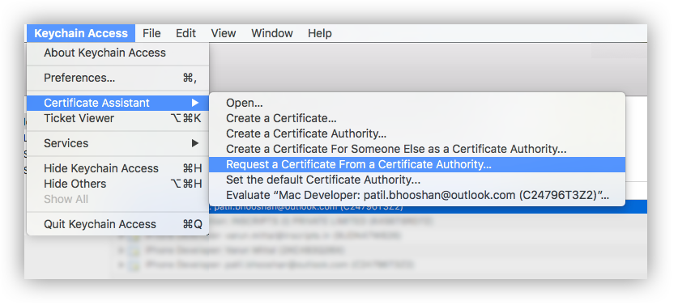
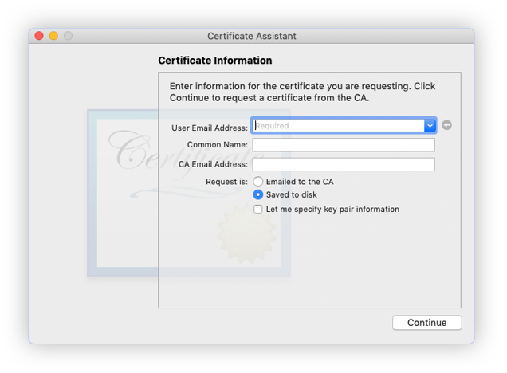
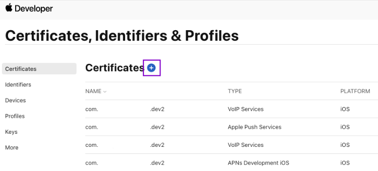
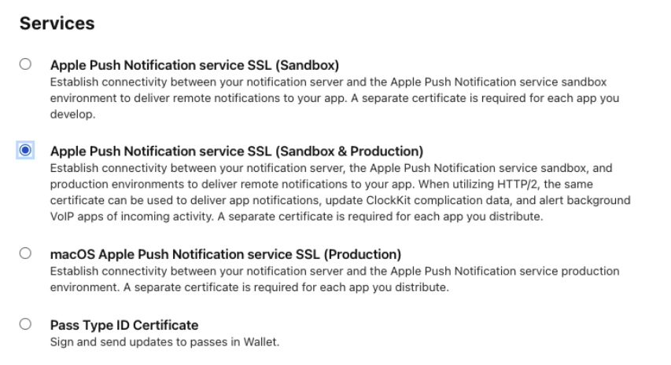
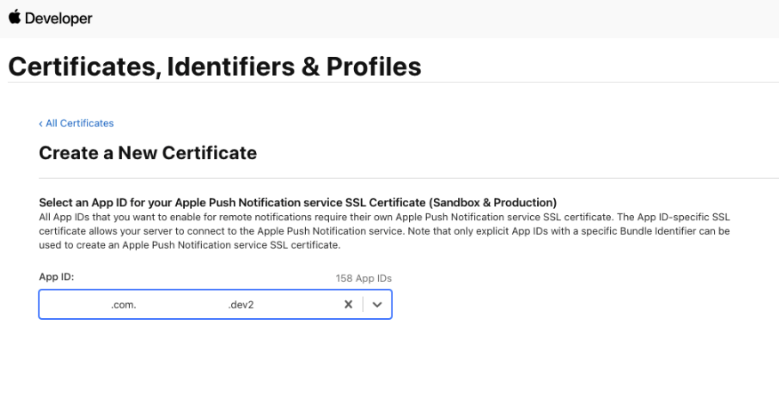
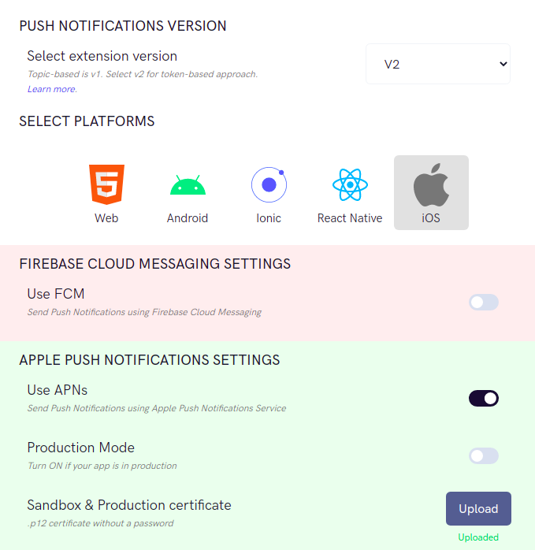
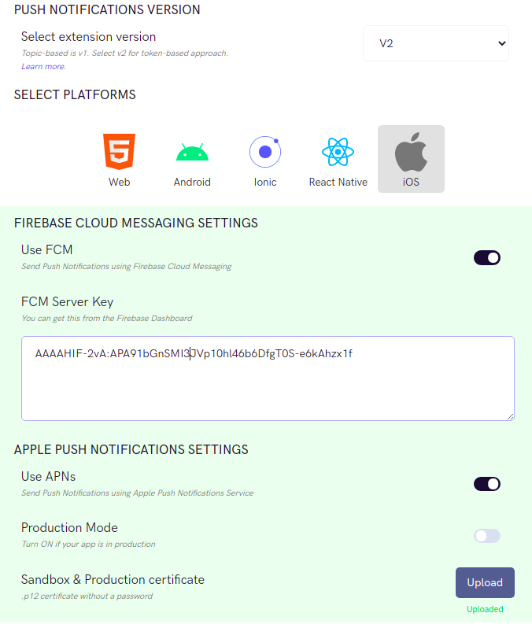

import Tabs from '@theme/Tabs';
import TabItem from '@theme/TabItem';

Apple Push Notification service or APNs is used to send notifications to iOS devices. With this, you can also use Apple's CallKit for showing the call screen.

<div style={{ display: 'flex', boxShadow: '0 0 4px 0 rgb(0 0 0 / 18%)', borderRadius: '3px' }}>
  <div style={{ padding: '24px' }}>
    <h3>I want to checkout the sample app</h3>
    <p>iOS Push notifications sample app</p>
    <a style={{ display: 'inline-block', backgroundColor: '#7c55c9', padding: '8px', textAlign: 'center', textTransform: 'uppercase', border: '1px solid #e3e5e7', borderRadius: '3px', color: 'white', width: '100%' }}
      href="https://github.com/cometchat/cometchat-push-notification-app-ios/tree/v4-push-notifications-extension" target="/blank">View on Github</a>
  </div>
</div>

## Get APNS Credentials

The following steps in this section are written on the assumption that you already have an app ID assigned to your client app.

### Step 1: Create a Certificate Signing Request

To obtain a signing certificate required to sign apps for installation on iOS devices, you should first create a certificate signing request (CSR) file through Keychain Access on your Mac.

1. Open the Keychain Access from the utility folder, go to Keychain Access &gt; Certificate Assistant &gt; Request a Certificate From a Certificate Authority, and then click.



2. The Certificate Information dialog box appears. Enter the email address that you use in your Apple Developer account, and enter a common name for your private key. Don't enter CA email address, choose Saved to disk, and then click the Continue button.



3. Specify the name of your CSR to save and choose the location to save the file on your local disk. Then your CSR file is created, which contains a public/private key pair.

### Step 2: Create an SSL certificate

1. Sign in to your account at the [Apple Developer Member Center](https://developer.apple.com/membercenter).
2. Go to Certificates, Identifiers & Profiles.


3. Create new Certificate by clicking on the + icon.



4. Under Services, select - Apple Push Notification services SSL (Sandbox & Production)



5. Select your App ID from the dropdown.



6. Upload CSR file., upload the CSR file you created through the **Choose File** button. To complete the process, choose Continue. When the certificate is ready, choose Download to save it to your Mac.


### Step 3: Export and update .p8 certificate

1. To generate a .p8 key file, go to [Apple developer account page](https://developer.apple.com/account/), then select Certificates, IDs & Profiles.
2. Select Keys and click on the "+" button to add a new key.
3. In the new key page, type in your key name and check the Apple Push Notification service (APNs) box, then click "Continue" and click "Register".
4. Then proceed to download the key file by clicking Download.
5. Make note of the `Key ID`, `Team ID` and your `Bundle ID` for saving in the Extension's settings.

**If you wish to use the .p12 certificate instead, do the following:**

1. Type a name for the .p12 file and save it to your Mac.
2. Browse to the location where you saved your key, select it, and click Open. Add the key ID for the key (available in Certificates, Identifiers & Profiles in the Apple Developer Member Center) and export it.
3. DO NOT provide an export password when prompted.
4. The .p12 file will be required in the next step for uploading in the CometChat Dashboard.

## Extension settings

### Step 1: Enable the extension

1. Login to [CometChat](https://app.cometchat.com/login) and select your app.
2. Go to the Extensions section and Enable the Push Notifications extension.
3. Open the settings for this extension and save the following.

### Step 2: Save your settings





On the Settings page you need to enter the following:

1. **Set extension version**

   1. The extension version has to be set to 'V2' or 'V1 & V2' in order to use APNs as the provider.

2. **Select Platforms**

   1. You can select the platforms on which you wish to receive Push Notifications.

3. **APNs Settings**

   1. You can turn off the Production mode when you create a development build of your application.
   2. Upload the .p8 or .p12 certificate exported in the previous step.

4. **Push payload message options**


The maximum payload size supported by FCM and APNs for push notifications is approximately 4 KB. Due to the inclusion of CometChat's message object, the payload size may exceed this limit, potentially leading to non-delivery of push notifications for certain messages. The options provided allow you to remove the sender's metadata, receiver's metadata, message metadata and trim the content of the text field.

- The message metadata includes the outputs of the Thumbnail Generation, Image Moderation, and Smart Replies extensions. You may want to retain this metadata if you need to customize the notification displayed to the end user based on these outputs.

5. **Notification Triggers**

   1. Select the triggers for sending Push Notifications. These triggers can be classified into 3 main categories:

      1. Message Notifications
      2. Call Notifications
      3. Group Notifications

   2. These are pretty self-explanatory and you can toggle them as per your requirement.

## iOS App Setup

### Initial Setup

1. Call `CometChat.init()` method to initialize CometChat in your application. This needs to be called only once.
2. The user has to be logged in using `CometChat.login()` method. On the success callback, register the token with the extension.
   Two tokens need to be registered, out of which one is APNs token and other is CallKit token:
   a. `CometChat.registerTokenForPushNotification(token: apnsToken, settings: ["voip":false])`<br/>
   b. `CometChat.registerTokenForPushNotification(token: voipToken, settings: ["voip":true])`

<Tabs>
<TabItem value="Swift" label="Swift">

```swift
let authKey = "XXXX XXXX XXXXX"

CometChat.login(UID: UID, authKey: authKey, onSuccess: { (current_user) in
        DispatchQueue.main.async {
          if let apnsToken = UserDefaults.standard.value(forKey: "apnsToken") as? String {
            print("APNS token is: \(apnsToken)")
            CometChat.registerTokenForPushNotification(token: apnsToken, settings: ["voip":false]) { (success) in
              print("onSuccess to registerTokenForPushNotification: \(success)")
              DispatchQueue.main.async {self.activityIndicator.stopAnimating()
                print("login success with : \(current_user.stringValue())")
                self.performSegue(withIdentifier: "presentPushNotification", sender: nil)
              }
            } onError: { (error) in
              print("error to registerTokenForPushNotification")
            }
          }
          if let voipToken = UserDefaults.standard.value(forKey: "voipToken") as? String {
            print("VOIP token is: \(voipToken)")
            CometChat.registerTokenForPushNotification(token: voipToken, settings: ["voip":true]) { (success) in
              print("onSuccess to registerTokenForPushNotification: \(success)")
              DispatchQueue.main.async {self.activityIndicator.stopAnimating()
                print("login success with : \(current_user.stringValue())")
                self.performSegue(withIdentifier: "presentPushNotification", sender: nil)
              }
            } onError: { (error) in
              print("error to registerTokenForPushNotification")
            }
          }
          }
        }
      }) { (error) in
        print("error while login", error);
      }
    }
```

</TabItem>
</Tabs>

3. Import PushKit and CallKit in AppDelegate.Swift file.

<Tabs>
<TabItem value="Swift" label="Swift">

```swift
import PushKit
import CallKit
```

</TabItem>
</Tabs>

### Receive Push Notifications

1. Registering for the APNs notifications

<Tabs>
<TabItem value="Swift" label="Swift">

```swift
var window: UIWindow?
var uuid: UUID?
var activeCall: Call?
var cancelCall: Bool = true
var onCall = true
var callController = CXCallController()
let voipRegistry = PKPushRegistry(queue: DispatchQueue.main)
var provider: CXProvider? = nil

func application(_ application: UIApplication, didFinishLaunchingWithOptions launchOptions: [UIApplication.LaunchOptionsKey: Any]?) -> Bool {
    self.voipRegistration()
   // [START register_for_notifications]
    if #available(iOS 10.0, *) {
      UNUserNotificationCenter.current().delegate = self
      let authOptions: UNAuthorizationOptions = [.alert, .badge, .sound]
      UNUserNotificationCenter.current().requestAuthorization(
        options: authOptions,
        completionHandler: {_, _ in })
    } else {
      let settings: UIUserNotificationSettings =
        UIUserNotificationSettings(types: [.alert, .badge, .sound], categories: nil)
      application.registerUserNotificationSettings(settings)
    }
    application.registerForRemoteNotifications()
    // [END register_for_notifications]
    return true
}
  // Register for VoIP notifications
  func voipRegistration() {
    // Create a push registry object
    let mainQueue = DispatchQueue.main
    let voipRegistry: PKPushRegistry = PKPushRegistry(queue: mainQueue)
    voipRegistry.delegate = self
    voipRegistry.desiredPushTypes = [PKPushType.voIP]
  }
```

</TabItem>
</Tabs>

2. Add AppDelegate extension for receiving Push Notifications

<Tabs>
<TabItem value="Swift" label="Swift">

```swift
extension AppDelegate : UNUserNotificationCenterDelegate {
  // Receive displayed notifications for iOS 10 devices.
  func userNotificationCenter(_ center: UNUserNotificationCenter,
                willPresent notification: UNNotification,
                withCompletionHandler completionHandler: @escaping (UNNotificationPresentationOptions) -> Void) {
    print("willPresent notification: \(notification.request.content.userInfo)")
    if let userInfo = notification.request.content.userInfo as? [String : Any], let messageObject =
      userInfo["message"], let str = messageObject as? String, let dict = str.stringTodictionary() {
           if let baseMessage = CometChat.processMessage(dict).0 {
             switch baseMessage.messageCategory {
             case .message: 
              if let message = baseMessage as? BaseMessage {
                switch message.messageType {
                case .text:
                  print("text Messagge is: \((message as? TextMessage)?.stringValue())")
                case .image:
                  print("image Messagge is: \((message as? MediaMessage)?.stringValue())")
                case .video:
                  print("video Messagge is: \((message as? MediaMessage)?.stringValue())")
                case .audio:
                  print("audio Messagge is: \((message as? MediaMessage)?.stringValue())")
                case .file:
                  print("file Messagge is: \((message as? MediaMessage)?.stringValue())")
                case .custom:
                  print("custom Messagge is: \((message as? MediaMessage)?.stringValue())")
                case .groupMember:
                  break
                @unknown default:
                  break
                }
              }
             case .action: break
             case .call:
              if let call = baseMessage as? Call {
                print("call is: \(call.stringValue())")
              }
             case .custom:
              if let customMessage = baseMessage as? CustomMessage {
                print("customMessage is: \(customMessage.stringValue())")
              }
             @unknown default: break
             }
           }
         }
    completionHandler([.alert, .badge, .sound])
  }
  func userNotificationCenter(_ center: UNUserNotificationCenter,
                didReceive response: UNNotificationResponse,
                withCompletionHandler completionHandler: @escaping () -> Void) {
    let notification = response.notification.request.content.userInfo
    print("notification is 11: \(notification)")
    completionHandler()
  }
  func application(_ application: UIApplication, didRegisterForRemoteNotificationsWithDeviceToken deviceToken: Data) {
    let token = deviceToken.reduce("", {$0 + String(format: "%02X", $1)})
    print("Device Token : ",token)
    let hexString = deviceToken.map { String(format: "%02.2hhx", $0) }.joined()
    print("Device Token 11: ",hexString)
    UserDefaults.standard.set(hexString, forKey: "apnsToken")
    CometChat.registerTokenForPushNotification(token: hexString, settings: ["voip":false]) { (success) in
      print("registerTokenForPushNotification voip: \(success)")
    } onError: { (error) in
      print("registerTokenForPushNotification error: \(error)")
    }
  }
}
```

</TabItem>
</Tabs>

3. Add AppDelegate extension for VOIP notifications. Launch CallKit screen when the VOIP notification is received.
   Once the CallKit screen is displayed, you can Accept or Reject the CometChat call accordingly.

<Tabs>
<TabItem value="Swift" label="Swift">

```swift
// MARK: CallKit & PushKit
extension AppDelegate: PKPushRegistryDelegate , CXProviderDelegate {


  func pushRegistry(_ registry: PKPushRegistry, didUpdate pushCredentials: PKPushCredentials, for type: PKPushType) {
        let deviceToken = pushCredentials.token.reduce("", {$0 + String(format: "%02X", $1) })
        print("voip token is: \(deviceToken)")
        UserDefaults.standard.set(deviceToken, forKey: "voipToken")
        CometChat.registerTokenForPushNotification(token: deviceToken, settings: ["voip":true]) { (success) in
            print("registerTokenForPushNotification voip: \(success)")
        } onError: { (error) in
            print("registerTokenForPushNotification error: \(error)")
        }
    }

  func pushRegistry(_ registry: PKPushRegistry, didReceiveIncomingPushWith payload: PKPushPayload, for type: PKPushType, completion: @escaping () -> Void) {
        if let userInfo = payload.dictionaryPayload as? [String : Any], let messageObject =
            userInfo["message"], let dict = messageObject as? [String : Any] {

            if let baseMessage = CometChat.processMessage(dict).0 {
                switch baseMessage.messageCategory {
                case .message: break
                case .action: break
                case .call:
                    if let call = baseMessage as? Call {
                        switch call.callStatus {
                        case .initiated:
                            self.activeCall = call
                            self.uuid = UUID()
                            if let name = (call.sender)?.name {
                                let config = CXProviderConfiguration(localizedName: "APNS + Callkit")
                                config.iconTemplateImageData = #imageLiteral(resourceName:                                             "your_app_icon").pngData()
                                config.includesCallsInRecents = false
                                config.ringtoneSound = "ringtone.caf"
                                config.supportsVideo = true
                                provider = CXProvider(configuration: config)
                                provider?.setDelegate(self, queue: nil)
                                let update = CXCallUpdate()
                                update.remoteHandle = CXHandle(type: .generic, value: name.capitalized)
                                if call.callType == .video {
                                    update.hasVideo = true
                                }else{
                                    update.hasVideo = false
                                }
                                provider?.reportNewIncomingCall(with: self.uuid!, update: update,                                       completion: { error in
                                    if error == nil {
                                        self.configureAudioSession()
                                    }
                                })
                            }
                        case .ongoing, .unanswered, .rejected, .busy, .cancelled:
                            if self.activeCall != nil {
                                if self.cancelCall {
                                    self.end(uuid: self.uuid!)
                                }
                            }
                        case .ended: break
                            @unknown default: break }
                    }
                case .custom: break
                @unknown default: break
                }
            }
        }
    }

   internal func configureAudioSession() {
        do {
            try AVAudioSession.sharedInstance().setCategory(AVAudioSession.Category.playAndRecord,                 options: [.mixWithOthers, .allowBluetooth, .defaultToSpeaker])
            try AVAudioSession.sharedInstance().setActive(true)

        } catch let error as NSError {
            print(error)
        }
    }

   func providerDidReset(_ provider: CXProvider) {
        if let uuid = self.uuid {
            onCall = true
            provider.reportCall(with: uuid, endedAt: Date(), reason: .unanswered)
        }
    }

  func provider(_ provider: CXProvider, perform action: CXAnswerCallAction) {
        if let activeCall = activeCall {
            startCall()
        }
        action.fulfill()
    }

  func provider(_ provider: CXProvider, perform action: CXEndCallAction) {
       NotificationCenter.default.post(name: NSNotification.Name(rawValue: "didRejectButtonPressed"), object: nil, userInfo: nil)
        end(uuid: self.uuid!)
        onCall = true
        if let activeCall = activeCall {
            CometChat.rejectCall(sessionID: activeCall.sessionID ?? "", status: .rejected, onSuccess: {(rejectedCall) in
                DispatchQueue.main.async {
                    CometChatSnackBoard.display(message:  "CALL_REJECTED".localized(), mode: .info, duration: .short)
                }
            }) { (error) in
                DispatchQueue.main.async {
                    if let errorMessage = error?.errorDescription {
                        CometChatSnackBoard.display(message:  "CALL_REJECTED".localized(), mode: .info, duration: .short)
                    }
                }
            }
            provider.reportCall(with: self.uuid!, endedAt: Date(), reason: .remoteEnded)
         }
        action.fail()
    }

   func provider(_ provider: CXProvider, didDeactivate audioSession: AVAudioSession) {
        print(#function)
    }

    func provider(_ provider: CXProvider, timedOutPerforming action: CXAction) {
        action.fulfill()
        print(#function)
    }

    func provider(_ provider: CXProvider, perform action: CXSetHeldCallAction) {
        print(#function)
    }

    func provider(_ provider: CXProvider, perform action: CXSetMutedCallAction) {
        print(#function)
    }

  func end(uuid: UUID) {
        print("endUUID",uuid)
        let endCallAction = CXEndCallAction(call: uuid)
        let transaction = CXTransaction()
        transaction.addAction(endCallAction)
        requestTransaction(transaction, action: "")
    }

    func setHeld(uuid: UUID, onHold: Bool) {
        print("setHeld",uuid)
        let setHeldCallAction = CXSetHeldCallAction(call: uuid, onHold: onHold)
        let transaction = CXTransaction()
        transaction.addAction(setHeldCallAction)

        requestTransaction(transaction, action: "")
    }

    internal func requestTransaction(_ transaction: CXTransaction, action: String = "") {
        callController.request(transaction) { error in
            if let error = error {
                print("Error requesting transaction: \(error)")
            } else {
                print("Requested transaction successfully")
            }
        }
    }

   public func startCall(){
        let activeCall = CometChatCall()
       cancelCall = false
        activeCall.modalPresentationStyle = .fullScreen
        if let window = UIApplication.shared.windows.first , let rootViewController = window.rootViewController {
            var currentController = rootViewController
            while let presentedController = currentController.presentedViewController {
                currentController = presentedController
            }
            currentController.present(activeCall, animated: true, completion: nil)
        }
    }
}
```

</TabItem>
</Tabs>

## Miscellaneous

### Create view controller for Calls

Create a viewController which will start the call when the user starts the call.

<Tabs>
<TabItem value="Swift" label="Swift">

```swift
import UIKit
import CometChatPro
import CallKit

class CometChatCall: UIViewController {


    override func viewDidLoad() {
        super.viewDidLoad()
        if let appDelegate = UIApplication.shared.delegate as? AppDelegate {
            if let call = appDelegate.activeCall {

                if (call.callInitiator as? User)?.uid != CometChat.getLoggedInUser()?.uid {

                    CometChat.acceptCall(sessionID: call.sessionID ?? "") { acceptedCall in

                        DispatchQueue.main.async {
                            let callSettings = CallSettings.CallSettingsBuilder(callView: self.view, sessionId: acceptedCall?.sessionID ?? "").setMode(mode: .MODE_SINGLE).build()

                            CometChat.startCall(callSettings: callSettings) { userJoined in
                                appDelegate.onCall = true
                            } onUserLeft: { onUserLeft in

                            } onUserListUpdated: { onUserListUpdated in

                            } onAudioModesUpdated: { onAudioModesUpdated in

                            } onUserMuted: { onUserMuted in

                            } onCallSwitchedToVideo: { onCallSwitchedToVideo in

                            } onRecordingStarted: { onRecordingStarted in

                            } onRecordingStopped: { onRecordingStopped in

                            } onError: { error in
                                DispatchQueue.main.async {
                                    self.dismiss(animated: true, completion: nil)
                                }
                            } onCallEnded: { ended in
                                DispatchQueue.main.async {
                                    var str = ""
                                    if let uuuid = appDelegate.uuid {
                                        print("CometChatCalls", uuuid)
                                    }
                                    self.dismiss(animated: true, completion: nil)
                                    self.dismiss(animated: true)
                                }
                            }
                        }
                    } onError: { error in

                    }
                }else{

                    let callSettings = CallSettings.CallSettingsBuilder(callView: self.view, sessionId: call.sessionID ?? "").setMode(mode: .MODE_SINGLE).build()

                    CometChat.startCall(callSettings: callSettings) { userJoined in

                    } onUserLeft: { onUserLeft in

                    } onUserListUpdated: { onUserListUpdated in

                    } onAudioModesUpdated: { onAudioModesUpdated in

                    } onUserMuted: { onUserMuted in

                    } onCallSwitchedToVideo: { onCallSwitchedToVideo in

                    } onRecordingStarted: { onRecordingStarted in

                    } onRecordingStopped: { onRecordingStopped in

                    } onError: { error in
                        DispatchQueue.main.async {
                            self.dismiss(animated: true, completion: nil)
                        }
                    } onCallEnded: { ended in
                        DispatchQueue.main.async {
                            self.dismiss(animated: true, completion: nil)
                        }
                    }
                }
            }
        }
    }
}
```

</TabItem>
</Tabs>

### Convert Push Notification payload to Message object

CometChat SDK provides a method `CometChat.CometChatHelper.processMessage()` which will take the JSON received in The push notification as input, and return the corresponding `TextMessage`, `MediaMessage`,`CustomMessage` or `Call` object in return. Once the message object is received, you can use the entity as per your requirements.

This code needs to be added to the `willPresent notification` method of the `UNUserNotificationCenterDelegate` delegate.

<Tabs>
<TabItem value="Swift" label="Swift">

```swift
func userNotificationCenter(_ center: UNUserNotificationCenter,
                                willPresent notification: UNNotification,
                                withCompletionHandler completionHandler: @escaping (UNNotificationPresentationOptions) -> Void) {
        if let userInfo = notification.request.content.userInfo as? [String : Any], let messageObject = userInfo["message"], let str = messageObject as? String, let dict = str.stringTodictionary() {

   if let baseMessage = CometChat.processMessage(dict).0 {
     switch baseMessage.messageCategory {
      case .message:
        if let message = baseMessage as? BaseMessage {
          switch message.messageType {
             case .text:
                print("text Messagge is: \((message as?TextMessage)?.stringValue())")
             case .image:
                 print("image Messagge is: \((message as? MediaMessage)?.stringValue())")
             case .video:
                 print("video Messagge is: \((message as? MediaMessage)?.stringValue())")
              case .audio:
                 print("audio Messagge is: \((message as? MediaMessage)?.stringValue())")
              case .file:
                  print("file Messagge is: \((message as? MediaMessage)?.stringValue())")
               case .custom:
                   print("custom Messagge is: \((message as? MediaMessage)?.stringValue())")
               case .groupMember: break
               @unknown default:break}
              }
            case .action: break
             case .call:
               if let call = baseMessage as? Call {
                  print("call is: \(call.stringValue())")
                }
               case .custom:
                  if let customMessage = baseMessage as? CustomMessage {
                    print("customMessage is: \(customMessage.stringValue())")
                 }
                 @unknown default: break
              }
             }
            }
        completionHandler([.alert, .badge, .sound])
 }

extension String {
  func stringTodictionary() -> [String:Any]? {
		var dictonary:[String:Any]?
				if let data = self.data(using: .utf8) {
					do {
        dictonary = try JSONSerialization.jsonObject(with: data, options: []) as? [String : Any]
				if let myDictionary = dictonary
        {
          return myDictionary;
        }
      } catch let error as NSError {
        print(error)
      }
			}
    return dictonary;
  }
}
```

</TabItem>
</Tabs>
