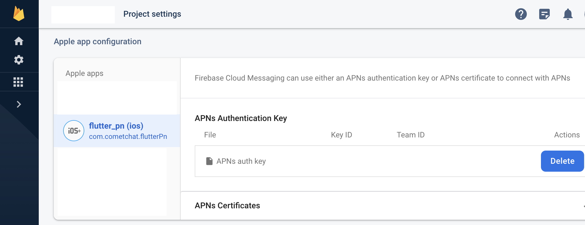
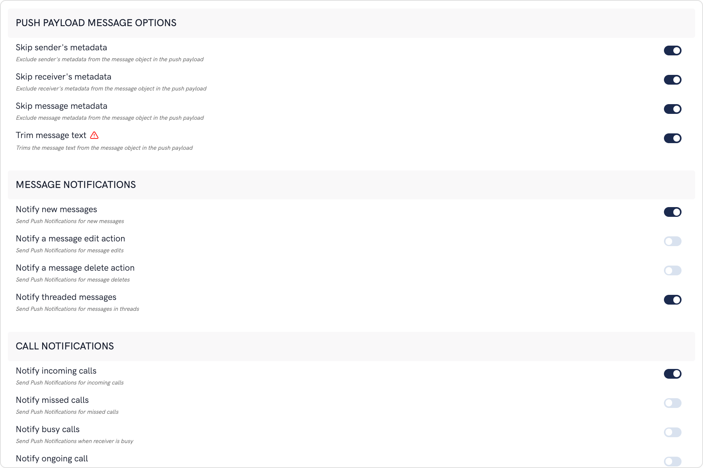
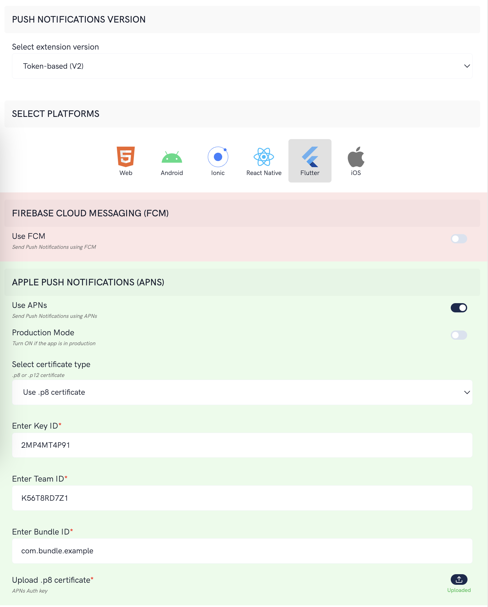

import Tabs from '@theme/Tabs';
import TabItem from '@theme/TabItem';

Learn how to implement Push notifications for the Flutter platform using FCM as well as APNs. This document guides you to set up Flutter push notifications as follows:

1. Using FCM to implement push notifications for messaging on Android and iOS.
2. Using APN to implement push notifications for messaging on iOS.

:::info Flutter Push notifications support
Push Notifications are supported in Flutter for CometChat SDK v3.0.9 and above.
:::

## FCM: Push notifications for messaging on Android and iOS

For Push notifications from FCM to work on both Android and iOS, the push payload has to be of type `Notification message`.

A `Notification message` is a push payload that has the notification key in it. These push notifications are handled directly by the OS and as a developer, you cannot customize these notifications.

This simple setup can be used for apps that only implement messaging feature of CometChat.

Learn more about [FCM messages](https://firebase.google.com/docs/cloud-messaging/concept-options).

<div style={{ display: 'flex', boxShadow: '0 0 4px 0 rgb(0 0 0 / 18%)', borderRadius: '3px' }}>
  <div style={{ padding: '24px' }}>
    <h3>I want to checkout the sample app</h3>
    <p>Flutter Push notifications sample app</p>
    <p class="magic-block-textarea">Implementation using FCM for Android and iOS.</p>
    <a style={{ display: 'inline-block', backgroundColor: '#7c55c9', padding: '8px', textAlign: 'center', textTransform: 'uppercase', border: '1px solid #e3e5e7', borderRadius: '3px', color: 'white', width: '100%' }}
      href="https://github.com/cometchat/cometchat-push-notification-app-flutter/tree/v4-push-notifications-extension" target="/blank">View on Github</a>
  </div>
</div>

### Step 1: Install packages

Add the following to your pubspec.yaml file under dependencies.

<Tabs>
<TabItem value="pubspec.yaml" label="pubspec.yaml">

```yaml
firebase_core: ^2.8.0
firebase_messaging: ^14.3.0
```

</TabItem>
</Tabs>

Install the packages.

<Tabs>
<TabItem value="Command" label="Command">

```command
flutter pub get
```

</TabItem>
</Tabs>

### Step 2: Configure with flutterfire_cli

Use the following command to install `flutterfire_cli`

<Tabs>
<TabItem value="Command" label="Command">

```Command
dart pub global activate flutterfire_cli
```

</TabItem>
</Tabs>

<Tabs>
<TabItem value="Command" label="Command">

```Command
flutterfire configure --project=<FIREBASE_PROJECT_ID>
```

</TabItem>
</Tabs>

This will ask you for the platforms. Select `android` and `ios`.

The CLI tool will add the following files to your directory structure:

1. `google-services.json` to the android folder.
2. `GoogleService-Info.plist` to the ios folder.
3. `firebase_options.dart` to the `lib` folder.

In the build.gradle file, change:

<Tabs>
<TabItem value="Groovy" label="Groovy">

```groovy
// Change this:
classpath 'com.google.gms:google-services:4.3.10'

// to
classpath 'com.google.gms:google-services:4.3.14'
```

</TabItem>
</Tabs>

In your Firebase Console, go to project settings and upload the .p8 file obtained from the Apple Developer dashboard along with the Key ID and Team ID.



### Step 3: FCM setup in app

This requires you to first set up a global context. It will help you in opening your app once your notification is tapped. Using this global context, you can write a function to navigate to the screen of choice once the notification is tapped.

<Tabs>
<TabItem value="Dart" label="Dart">

```dart
import 'package:flutter/material.dart';
import 'package:flutter_pn/screens/chat_screen.dart';

class NavigationService {
  static final GlobalKey<NavigatorState> navigatorKey =
      GlobalKey<NavigatorState>();

  static void navigateToChat(String text) {
    navigatorKey.currentState?.push(
      MaterialPageRoute(builder: (context) => ChatScreen(chatId: text)),
    );
  }
}
```

</TabItem>
</Tabs>

Once the user has logged in to CometChat, do the following to setup firebase:

1. Write a top-level function that is outside of any call. This function will handle the notifications when the app is not in the foreground.
2. Initialize firebase with the FirebaseOptions from the previous step.
3. Get an instance of firebase messaging
4. Request permissions
5. Set up listeners once the permission is granted:

   1. Background notification listener
   2. Refreshed token listener that records the FCM token with the extension.
   3. Notification tap listeners for background and terminated states of the app.

6. Make a call to save the FCM token with the extension.

### Step 4: Setup for iOS

1. Open the project in XCode (`ios/Runner.xcworkspace` )
2. Add **Push notifications** capability.
3. Add **Background execution** capability with **Background fetch** & **Remote notification** enabled.
4. Inside the `ios` folder, execute `pod install` .

Fore more details refer to the [Firebase documentation](https://firebase.google.com/docs/cloud-messaging/flutter/client#ios).

### Step 5: Run your application

Running the app in profile mode for iOS enables you to see the working once the app is terminated.

<Tabs>
<TabItem value="Command on Android" label="Command on Android">

```Command on Android
flutter run
```

</TabItem>
</Tabs>

<Tabs>
<TabItem value="Command on iOS" label="Command on iOS">

```Command on iOS
flutter run --profile
```

</TabItem>
</Tabs>

### Step 6: Extension setup (FCM)

1. Login to CometChat dashboard.
2. Go to the extensions section.
3. Enable the Push notifications extension.
4. Click on the settings icon to open the settings.
5. Upload the service account file that is available on the Firebase Console.
6. Make sure that you are including the `notification` key in the payload. Otherwise, this won't work.
7. Push payload message options


The maximum payload size supported by FCM and APNs for push notifications is approximately 4 KB. Due to the inclusion of CometChat's message object, the payload size may exceed this limit, potentially leading to non-delivery of push notifications for certain messages. The options provided allow you to remove the sender's metadata, receiver's metadata, message metadata and trim the content of the text field.

The message metadata includes the outputs of the Thumbnail Generation, Image Moderation, and Smart Replies extensions. You may want to retain this metadata if you need to customize the notification displayed to the end user based on these outputs.

## APN: Push notifications for messaging on iOS

Apple Push Notifications service or APNs is only available for Apple devices. This will not work on Android devices.

This setup ensures that the Push notifications for CometChat messages is sent using APNs `device token`.

<div style={{ display: 'flex', boxShadow: '0 0 4px 0 rgb(0 0 0 / 18%)', borderRadius: '3px' }}>
  <div style={{ padding: '24px' }}>
    <h4 style={{ fontWeight: 'bold' }}>I want to checkout the sample app</h4>
    <p>Flutter Push notifications sample app</p>
    <p class="magic-block-textarea">Implementation using APNs for iOS.</p>
    <a style={{ display: 'inline-block', backgroundColor: '#7c55c9', padding: '8px', textAlign: 'center', textTransform: 'uppercase', border: '1px solid #e3e5e7', borderRadius: '3px', color: 'white', width: '100%' }}
      href="https://github.com/cometchat/cometchat-push-notification-app-flutter/tree/v4-push-notifications-extension" target="/blank">View on Github</a>
  </div>
</div>

### Step 1: Install dependencies

Add the following to your pubspec.yaml file under dependencies.

<Tabs>
<TabItem value="pubspec.yaml" label="pubspec.yaml">

```yaml
flutter_apns_only: 1.6.0
```

</TabItem>
</Tabs>

### Step 2: Add capabilities

1. Open the project in XCode (`ios/Runner.xcworkspace` )
2. Add **Push notifications** capability.
3. Add **Background modes** capability with:
   1. Remote notifications

### Step 3: Update AppDelegate.swift

Add the below to your AppDeletegate.swift file.

<Tabs>
<TabItem value="Swift" label="Swift">

```swift
if #available(iOS 11.0, *) {
  UNUserNotificationCenter.current().delegate = self as? UNUserNotificationCenterDelegate
}
```

</TabItem>
</Tabs>

### Step 4: APN setup in app

Setup a global context to be able to open your app to a specific screen if the notification is tapped. Using the global context, write a function to navigate to the screen of your choice:

<Tabs>
<TabItem value="Dart" label="Dart">

```dart
import 'package:flutter/material.dart';
import 'package:flutter_pn/screens/chat_screen.dart';

class NavigationService {
  static final GlobalKey<NavigatorState> navigatorKey =
      GlobalKey<NavigatorState>();

  static void navigateToChat(String text) {
    navigatorKey.currentState?.push(
      MaterialPageRoute(builder: (context) => ChatScreen(chatId: text)),
    );
  }
}
```

</TabItem>
</Tabs>

Once the CometChat has been initialized and the user has logged in, do the required setup for the above packages that handle APNs and VoIP notifications.

### Step 5: Run on a device

Run your app on a real device as Push notifications don't work on emulators.

Use the profile mode to see the behavior when the app is in the background or terminated states.

<Tabs>
<TabItem value="Command on iOS" label="Command on iOS">

```Command on iOS
flutter run --profile
```

</TabItem>
</Tabs>

### Step 6: Extension setup (APN)

1. Login to CometChat dashboard.
2. Go to the extensions section.
3. Enable the Push notifications extension.
4. Click on the settings icon to open the settings.
5. Save the Team ID, Key ID, Bundle ID and upload the p8 certificate obtained from Apple Developer console.
6. Push payload message options

The maximum payload size supported by FCM and APNs for push notifications is approximately 4 KB. Due to the inclusion of CometChat's message object, the payload size may exceed this limit, potentially leading to non-delivery of push notifications for certain messages. The options provided allow you to remove the sender's metadata, receiver's metadata, message metadata and trim the content of the text field.

- The message metadata includes the outputs of the Thumbnail Generation, Image Moderation, and Smart Replies extensions. You may want to retain this metadata if you need to customize the notification displayed to the end user based on these outputs.

7. Save the settings.


