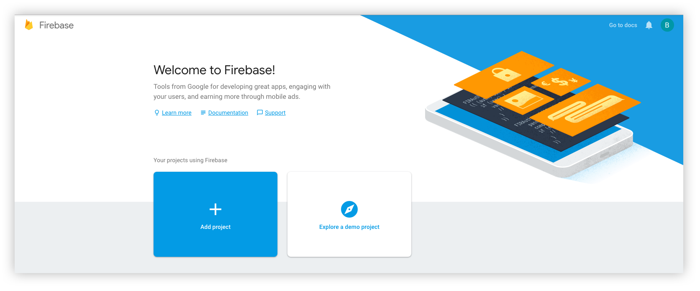
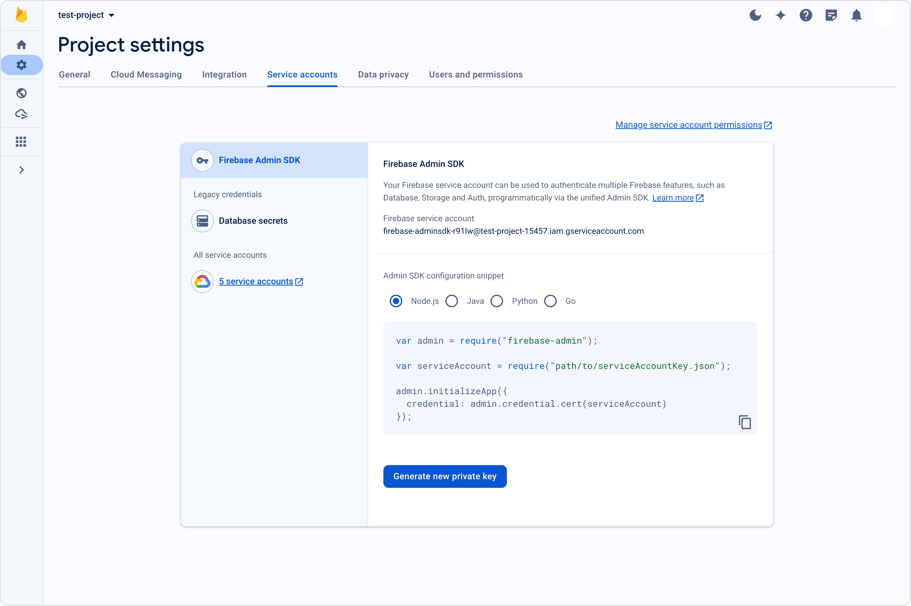
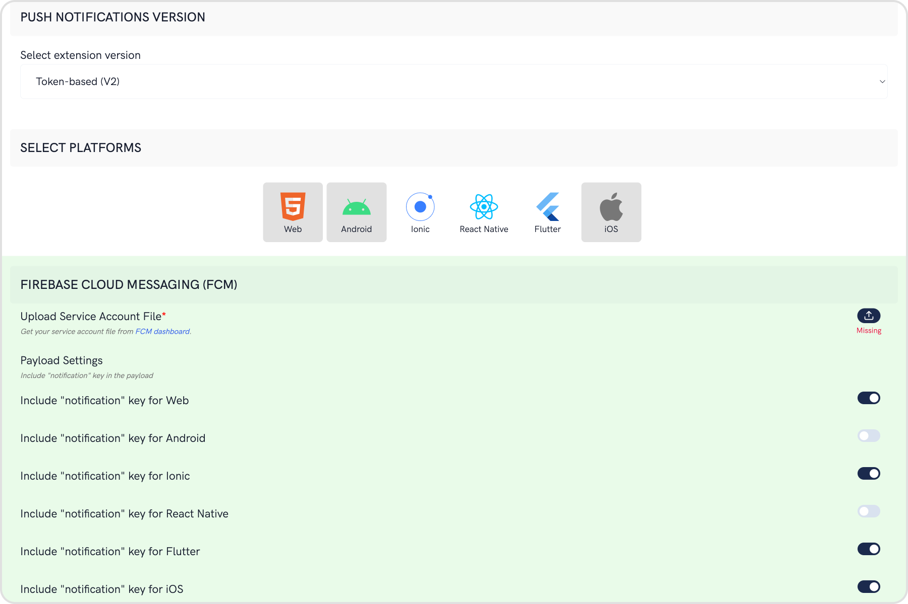
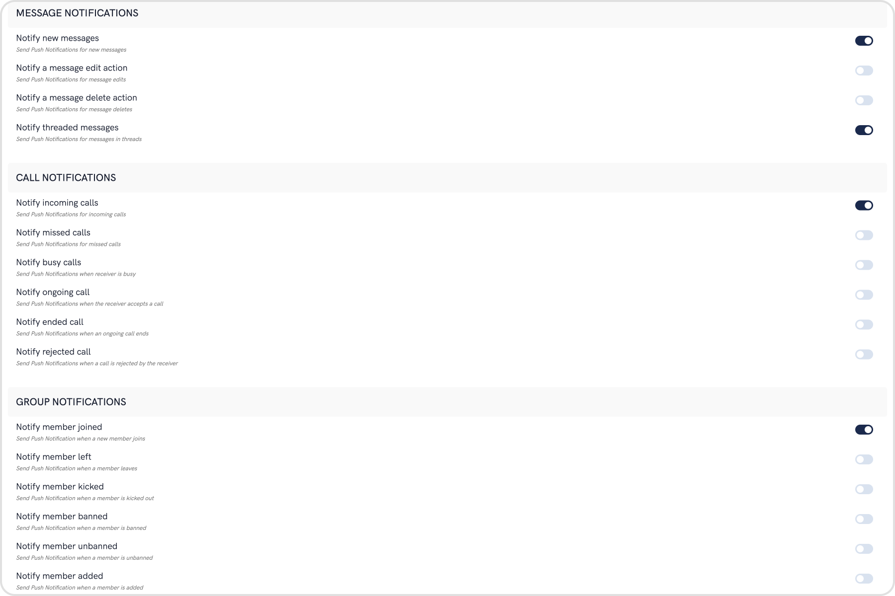

import Tabs from '@theme/Tabs';
import TabItem from '@theme/TabItem';

Learn how to setup Push Notifications for Capacitor, Cordova and Ionic framework using Firebase Cloud Messaging or FCM.

<div style={{ display: 'flex', boxShadow: '0 0 4px 0 rgb(0 0 0 / 18%)', borderRadius: '3px' }}>
  <div style={{ padding: '24px' }}>
    <h3>I want to checkout the sample app</h3>
    <p>Ionic/Cordova Push notifications sample app</p>
    <a style={{ display: 'inline-block', backgroundColor: '#7c55c9', padding: '8px', textAlign: 'center', textTransform: 'uppercase', border: '1px solid #e3e5e7', borderRadius: '3px', color: 'white', width: '100%' }}
      href="https://github.com/cometchat/ionic-cordova-chat-push-notification-app" target="/blank">View on Github</a>
  </div>
</div>

## Firebase Project Setup

Visit [Firebase Console](https://console.firebase.google.com/) and login/signup using your Gmail ID.

### Step 1: Create a new Firebase Project

On your Firebase Console, create a new project.



This is a simple 3 step process where:

1. You give a name to your project
2. Add Google Analytics to your project (Optional)
3. Configure Google Analytics account (Optional)

Click on Create and you are ready to go.

### Step 2: Add Firebase to your App

React native setup will require 2 files for Android and iOS:

1. For Android, you need to download the `google-services.json` file. You can refer to the [Android Firebase Project Setup - Step 2](./android-push-notifications#firebase-project-setup) and resume here once done.
2. For iOS, you need to download the `GoogleService-Info.plist` file. You can refer to the [iOS Firebase Project Setup - Step 2](./ios-fcm-push-notifications#firebase-project-setup) and resume here once done.
3. For web, you need to have the Firebase Config object. You can refer to the [Web Firebase Project Setup - Step 2](./web-push-notifications#firebase-project-setup) and resume here once done.

### Step 3: Download the service account file



## Extension settings

### Step 1: Enable the extension

1. Login to [CometChat](https://app.cometchat.com/login) and select your app.
2. Go to the Extensions section and Enable the Push Notifications extension.
3. Open the settings for this extension and save the following.



### Step 2: Save your settings

On the Settings page you need to enter the following:

1. **Set extension version**

- If you are setting it for the first time, Select `V2` to start using the enhanced version of the Push Notification extension. The enhanced version uses Token-based approach for sending Push Notifications and is simple to implement.
- If you already have an app using `V1` and want to migrate your app to use `V2`, then Select `V1 & V2` option. This ensures that the users viewing the older version of your app also receive Push Notifications.
- Eventually, when all your users are on the latest version of your app, you can change this option to `V2`, thus turning off `V1` (Topic-based) Push Notifications completely.

2. **Select the platforms that you want to support**

- Select from Web, Android, Ionic, React Native, Flutter & iOS.

3. **Notification payload settings**

- You can control if the notification key should be in the Payload or not. Learn more about the FCM Messages [here](https://firebase.google.com/docs/cloud-messaging/concept-options).

4. **Push payload message options**


The maximum payload size supported by FCM and APNs for push notifications is approximately 4 KB. Due to the inclusion of CometChat's message object, the payload size may exceed this limit, potentially leading to non-delivery of push notifications for certain messages. The options provided allow you to remove the sender's metadata, receiver's metadata, message metadata and trim the content of the text field.

- The message metadata includes the outputs of the Thumbnail Generation, Image Moderation, and Smart Replies extensions. You may want to retain this metadata if you need to customize the notification displayed to the end user based on these outputs.

5. **Notification Triggers**



- Select the triggers for sending Push Notifications. These triggers can be classified into 3 main categories:
  1. Message Notifications
  2. Call Notifications
  3. Group Notifications
- These are pretty self-explanatory and you can toggle them as per your requirement.

## App Setup

### Step 1: Initial plugin setup

1. For Cordova & Ionic, there are numerous plugins available via NPM which can be used to set up push notifications for your apps like [FCM Plugin](https://ionicframework.com/docs/v3/native/fcm/) and [Push Plugin](https://ionicframework.com/docs/native/push).
2. To setup Push Notification, you need to follow the steps mentioned in the Plugin's Documentation.

At this point, you will have:

1. Separate apps created on the Firebase console. (For Web, Android and iOS).
2. Plugin setup completed as per the respective documentation.

### Step 2: Register FCM Token

1. This step assumes that you already have a React Native app setup with CometChat installed. Make sure that the CometChat object is initialized and user has been logged in.
2. On the success callback of user login, you can fetch the FCM Token and register it with the extension as shown below:

<Tabs>
<TabItem value="Javascript" label="Javascript">

```javascript
// Pseudo-code with async-await syntax
// Using the FCM Plugin

const APP_ID = 'APP_ID';
const REGION = 'REGION';
const AUTH_KEY = 'AUTH_KEY';

const UID = 'UID';
const APP_SETTINGS = new CometChat.AppSettingsBuilder()
  .subscribePresenceForAllUsers()
  .setRegion(REGION)
  .build();

try {
  // First initialize the app
  await CometChat.init(APP_ID, APP_SETTINGS);

  // Login the user
  await CometChat.login(UID, AUTH_KEY);

  // Login is successful so next step
  // Get the FCM device token
  // You should have imported the following in the file:
  // import { FCM } from '@ionic-native_fcm';
  const FCM_TOKEN = await fcm.getToken();

  // Register the token with Enhanced Push Notifications extension
  await CometChat.registerTokenForPushNotification(FCM_TOKEN);
} catch (error) {
  // Handle errors gracefully
}
```

</TabItem>
</Tabs>

3. Registration also needs to happen in case of token refresh as shown below:

<Tabs>
<TabItem value="Javascript" label="Javascript">

```javascript
// Pseudo-code

// You should have imported the following in the file:
// import { FCM } from '@ionic-native_fcm';
try {
  // Listen to whether the token changes
	return fcm.onTokenRefresh(FCM_TOKEN => {
  	await CometChat.registerTokenForPushNotification(FCM_TOKEN);
  });
  // ...
} catch(error) {
  // Handle errors gracefully
}
```

</TabItem>
</Tabs>

For more details, visit documentation.

### Step 3: Receive Notifications

<Tabs>
<TabItem value="Javascript" label="Javascript">

```javascript
// Pseudo-code
import messaging from '@react-native-firebase_messaging';
import { Alert } from 'react-native';

// Implementation can be done in a life-cycle method or hook
const unsubscribe = messaging().onMessage(async (remoteMessage) => {
  Alert.alert('A new FCM message arrived!', JSON.stringify(remoteMessage));
});
```

</TabItem>
</Tabs>

### Step 4: Stop receiving Notifications

1. On CometChat.logout will stop receiving notifications.
2. As a good practice, you can also delete the FCM Token by calling `deleteToken` on the fcm object.

<Tabs>
<TabItem value="Javascript" label="Javascript">

```javascript
// Pseudo-code using async-await syntax

logout = async () => {
  // User logs out of the app
  await CometChat.logout();
};
```

</TabItem>
</Tabs>

## Advanced

### Handle Custom Messages

To receive notification of `CustomMessage`, you need to set metadata while sending the `CustomMessage`.

<Tabs>
<TabItem value="Javascript" label="Javascript">

```javascript
var receiverID = 'UID';
var customData = {
  latitude: '50.6192171633316',
  longitude: '-72.68182268750002',
};

var customType = 'location';
var receiverType = CometChat.RECEIVER_TYPE.USER;
var metadata = {
  pushNotification: 'Your Notification Message',
};

var customMessage = new CometChat.CustomMessage(
  receiverID,
  receiverType,
  customType,
  customData
);

customMessage.setMetadata(metadata);

CometChat.sendCustomMessage(customMessage).then(
  (message) => {
    // Message sent successfully.
    console.log('custom message sent successfully', message);
  },
  (error) => {
    console.log('custom message sending failed with error', error);
    // Handle exception.
  }
);
```

</TabItem>
</Tabs>

### Converting push notification payload to message object

CometChat SDK provides a method `CometChat.CometChatHelper.processMessage()` to convert the message JSON to the corresponding object of TextMessage, MediaMessage,CustomMessage, Action or Call.

<Tabs>
<TabItem value="Javascript" label="Javascript">

```javascript
var processedMessage = CometChat.CometChatHelper.processMessage(JSON_MESSAGE);
```

</TabItem>
</Tabs>

:::info
Type of Attachment can be of the following the type:<br/> `CometChatConstants.MESSAGE_TYPE_IMAGE`<br/> `CometChatConstants.MESSAGE_TYPE_VIDEO`<br/> `CometChatConstants.MESSAGE_TYPE_AUDIO`<br/> `CometChatConstants.MESSAGE_TYPE_FILE`
:::

Push Notification: Payload Sample for Text Message and Attachment/Media Message

<Tabs>
<TabItem value="JSON" label="Text message">

```json
{
  "alert": "Nancy Grace: Text Message",
  "sound": "default",
  "title": "CometChat",
  "message": {
    "receiver": "cometchat-uid-4",
    "data": {
      "entities": {
        "receiver": {
          "entityType": "user",
          "entity": {
            "uid": "cometchat-uid-4",
            "role": "default",
            "name": "Susan Marie",
            "avatar": "https://assets.cometchat.io/sampleapp/v2/users/cometchat-uid-4.webp",
            "status": "offline"
          }
        },
        "sender": {
          "entityType": "user",
          "entity": {
            "uid": "cometchat-uid-3",
            "role": "default",
            "name": "Nancy Grace",
            "avatar": "https://assets.cometchat.io/sampleapp/v2/users/cometchat-uid-3.webp",
            "status": "offline"
          }
        }
      },
      "text": "Text Message"
    },
    "sender": "cometchat-uid-3",
    "receiverType": "user",
    "id": "142",
    "sentAt": 1555668711,
    "category": "message",
    "type": "text"
  }
}
```

</TabItem>
<TabItem value="JSON1" label="Media message">

```json
{
  "alert": "Nancy Grace: has sent an image",
  "sound": "default",
  "title": "CometChat",
  "message": {
    "receiver": "cometchat-uid-4",
    "data": {
      "attachments": [
        {
          "extension": "png",
          "size": 14327,
          "name": "extension_leftpanel.png",
          "mimeType": "image/png",
          "url": "https://s3-eu-west-1.amazonaws.com/data.cometchat.com/1255466c41bd7f/media/1555671238_956450103_extension_leftpanel.png"
        }
      ],
      "entities": {
        "receiver": {
          "entityType": "user",
          "entity": {
            "uid": "cometchat-uid-4",
            "role": "default",
            "name": "Susan Marie",
            "avatar": "https://assets.cometchat.io/sampleapp/v2/users/cometchat-uid-4.webp",
            "status": "offline"
          }
        },
        "sender": {
          "entityType": "user",
          "entity": {
            "uid": "cometchat-uid-3",
            "role": "default",
            "name": "Nancy Grace",
            "avatar": "https://assets.cometchat.io/sampleapp/v2/users/cometchat-uid-3.webp",
            "status": "offline"
          }
        }
      },
      "url": "https://s3-eu-west-1.amazonaws.com/data.cometchat.com/1255466c41bd7f/media/1555671238_956450103_extension_leftpanel.png"
    },
    "sender": "cometchat-uid-3",
    "receiverType": "user",
    "id": "145",
    "sentAt": 1555671238,
    "category": "message",
    "type": "image"
  }
}
```

</TabItem>
</Tabs>
