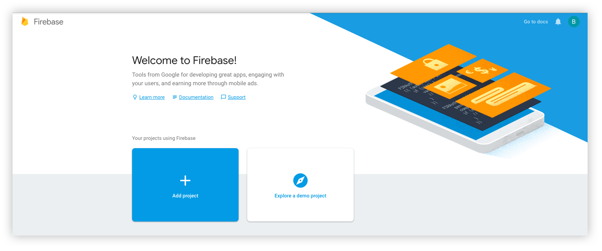
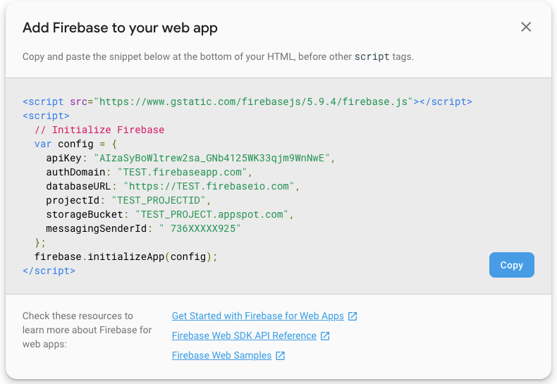
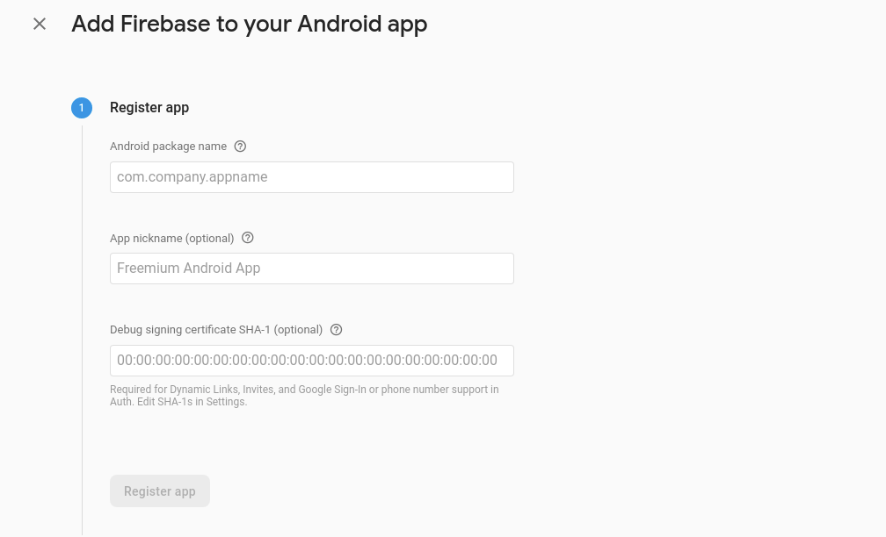
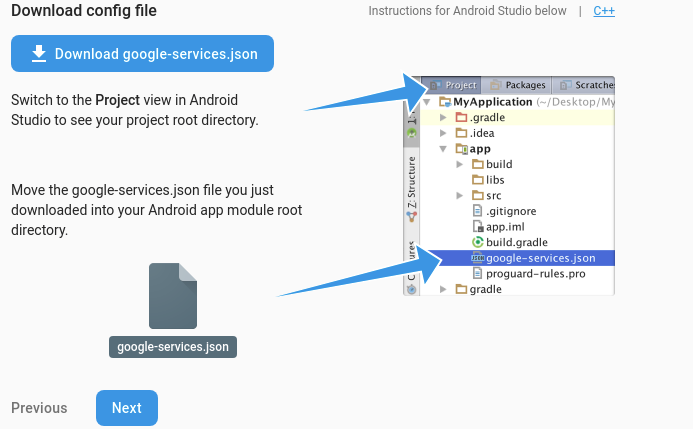
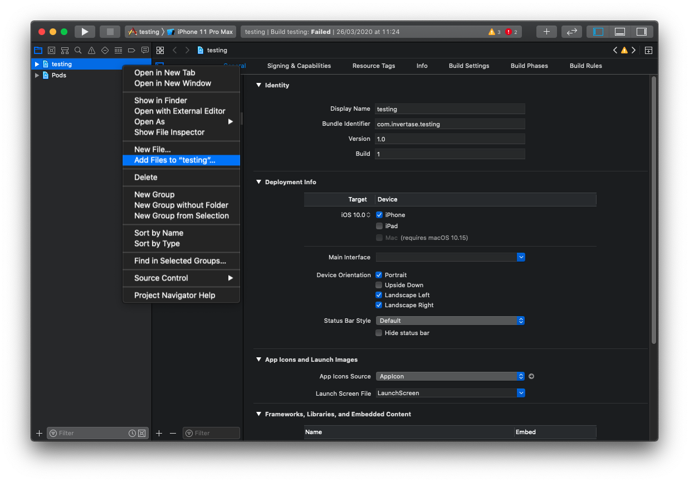
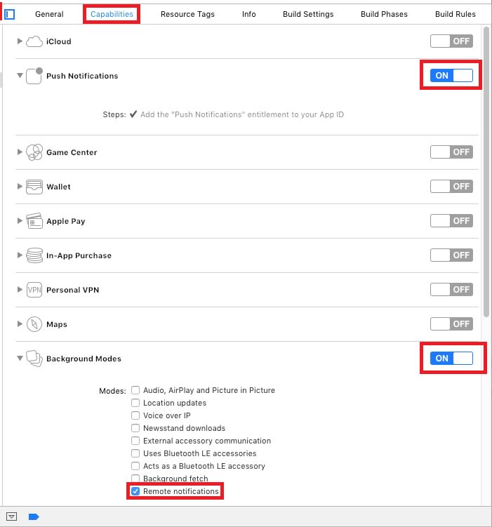

import Tabs from '@theme/Tabs';
import TabItem from '@theme/TabItem';

:::info Migrate to Token-based Push Notifications
You can check out our new Token-based implementation [here](/extensions/push-notifications-overview).
:::

The Push Notification extension allows you to send push notifications to mobile apps and desktop browsers.

Push notifications will work in all desktop browsers which support [Push API](https://caniuse.com/#feat=push-api). These include:

1. Chrome 50+
2. Firefox 44+
3. Edge 17+
4. Opera 42+

## Step 1: Add Firebase to your app

To configure Firebase Push Notifications for your apps create a `Firebase` project at [Firebase Console](https://console.firebase.google.com/).

If you have previously not created a Firebase project for your app Click Add project. If you already have created a project for your app in which you wish to integrate CometChat, select the same project and download the config file.



## Step 2 : Obtain Firebase configuration for your platform

### For Web

1. Sign into Firebase and open your project.
2. On the Overview page, click Add app.
3. Select Add Firebase to your web app.
4. Copy the snippet and add it to your HTML application.



### For Android

1. Sign into Firebase and open your project.
2. On the Overview page, click Add app.
3. Select Add Firebase to your Android app.
4. Follow the on-screen instructions and finally download the google-services.json file.





### For iOS

1. Sign into Firebase and open your project.
2. On the Overview page, click Add app.
3. Select Add Firebase to your iOS app.
4. Enter the relevant details like your bundle ID and download the GoogleService-Info.plist file.
5. Move this plist file to the root of your XCode project. If prompted, select to add the config file to all targets as follows:


### For React Native

1. For React Native to Android, you need to download the `google-services.json` file.
2. For React native to iOS, you need to download the `GoogleServices-Info.plist` file.

### For Capacitor, Cordova & Ionic

1. For React Native to Android, you need to download the `google-services.json` file.
2. For React native to iOS, you need to download the `GoogleServices-Info.plist` file.
3. For web, you will need the Firebase Config object.

## Step 3: Extension setup

1. You need the Firebase Service key which you can get from Firebase console.

   1. Open your Firebase app
   2. Click on the Settings Cog in the left navigation menu
   3. Select Project Settings and go to the Cloud Messaging tab
   4. Add a Server Key and copy it for further use.

2. Login to the [CometChat Dashboard](https://app.cometchat.io/login) and select your app.
3. On the Extensions page, enable the Push Notifications extension.
4. Open the Settings for this extension.
5. Enter FCM Server key.
6. Select the platforms of choice.
7. Enter the title for notifications.
8. You can also toggle the triggers for sending Push Notifications. The triggers can be classified into 3 main categories:
   1. Message Notifications
   2. Call Notifications
   3. Group Notifications


## Step 4: Application Setup

In order to use the topic-based Push Notifications, you need to subscribe to topics. In case of CometChat, you need to subscribe to 2 different types of topics:

1. Topic to receive Push Notifications for one-on-one messages and calls.
2. Topic to receive Push Notifications for group messages and calls.

Also, you can:

1. Subscribe to one topic
2. Subscribe to all the topics

Below steps guide you with this process of subscription to topics and specific setup for the platform of your choice.

### For Web

#### **1. Installing Firebase SDK**

<Tabs>
<TabItem value="npm" label="npm">

```npm
npm install firebase
```

</TabItem>
<TabItem value="yarn" label="yarn">

```yarn
yarn add firebase
```

</TabItem>
<TabItem value="Javascript" label="Javascript">

```javascript
<script src="https://www.gstatic.com/firebasejs/8.3.2/firebase-app.js"></script>
<script src="https://www.gstatic.com/firebasejs/8.3.2/firebase-messaging.js"></script>
```

</TabItem>
</Tabs>

#### **2. Initialize Firebase app**

1. Create a index.html file and initialize the Firebase app. This has to be done only once.
2. Here, you will need the Firebase Configuration object that you copied from the Firebase Console.
3. Also, register the service worker.

<Tabs>
<TabItem value="Javascript" label="Javascript">

```javascript
const config = {
  apiKey: "AIzaSyBkasdasdasdybyI-ZkFCxNpJLAtYyqeERw5I60yTNs",
  authDomain: "testAPP.firebaseapp.com",
  databaseURL: "https://testAPP.firebaseio.com",
  projectId: "testAPP-229414",
  storageBucket: "testAPP.appspot.com",
  messagingSenderId: "app_sender_id",
};

firebase.initializeApp(config);
```

</TabItem>
</Tabs>

<Tabs>
<TabItem value="Javascript" label="Javascript">

```javascript
if ("serviceWorker" in navigator) {
  window.addEventListener("load", () => {
    navigator.serviceWorker.register("/firebase-messaging-sw.js");
  });
}
```

</TabItem>
</Tabs>

#### **3. Request permission for Web Push**

1. Create PushNotification.js file.
2. Insert the following code so that the browser asks for permission to show Push Notifications.
3. If the permission is granted, you will receive a FCM registration token.

<Tabs>
<TabItem value="Javascript" label="Javascript">

```javascript
const requestPermission = async () => {
	const messaging = firebase.messaging();
	const FCM_TOKEN = await messaging
  	.requestPermission()
  	.then(() => messaging.getToken());
  	.catch(error => console.log(error));
	return FCM_TOKEN;
}
```

</TabItem>
</Tabs>

#### **4. Subscribe to topic(s)**

1. In the success callback of CometChat.login(), you can start the subscription process.
2. As mentioned earlier, you can either subscribe to one topic or subscribe to all.
3. The format for the name of user topic is `AppID_user_UID`
4. The format for the name of a group topic is `AppID_group_GUID`

<Tabs>
<TabItem value="Subscribe to all" label="Subscribe to all">

```javascript
var appID = "APP_ID";
var token = "GENERATED_FCM_TOKEN";
var userUID = "UID_OF_LOGGED_IN_USER";
var appToken;
CometChat.getJoinedGroups().then((groups) => {
  CometChat.getAppSettings().then((settings) => {
    settings.extensions.forEach((ext) => {
      if (ext.id == "push-notification") {
        appToken = ext.appToken;
      }
    });
    var url =
      "https://push-notification-us.cometchat.io/v1/subscribetomany?appToken=" +
      appToken;
    fetch(url, {
      method: "POST",
      headers: new Headers({
        "Content-Type": "application/json",
      }),
      body: JSON.stringify({
        appId: appID,
        fcmToken: token,
        uid: userUID,
        groups: groups,
        platform: "javascript",
      }),
    })
      .then((response) => {
        if (response.status < 200 || response.status >= 400) {
          console.log(
            "Error subscribing to topics: " +
              response.status +
              " - " +
              response.text()
          );
        } else {
          console.log("Subscribed to all topics");
        }
      })
      .catch((error) => {
        console.error(error);
      });
  });
});
```

</TabItem>
<TabItem value="Subscribe to User topic" label="Subscribe to User topic">

```javascript
var token = "generated_FCM_token";
CometChat.getAppSettings().then((settings) => {
  var appToken;
  settings.extensions.forEach((ext) => {
    if (ext.id == "push-notification") {
      appToken = ext.appToken;
    }
  });
  var userType = "user";
  var UID = "UID";
  var appId = "APP_ID";
  var region = "REGION_OF_APP";
  var topic = appId + "_" + userType + "_" + UID;
  var url =
    "https://push-notification-" +
    region +
    ".cometchat.io/v1/subscribe?appToken=" +
    appToken +
    "";
  fetch(url, {
    method: "POST",
    headers: new Headers({
      "Content-Type": "application/json",
    }),
    body: JSON.stringify({ appId: appId, fcmToken: token, topic: topic }),
  })
    .then((response) => {
      if (response.status < 200 || response.status >= 400) {
        console.log(
          "Error subscribing to topic: " +
            response.status +
            " - " +
            response.text()
        );
      }
      console.log('Subscribed to "' + topic + '"');
    })
    .catch((error) => {
      console.error(error);
    });
});
```

</TabItem>
<TabItem value="Subscribe to Group topic" label="Subscribe to Group topic">

```javascript
var token = "generated_FCM_token";
CometChat.getAppSettings().then(settings => {
  var appToken;
  settings.extensions.forEach(ext => {
      if (ext.id == "push-notification){
          appToken = ext.appToken;
      }
  });
  var userType = "group";
  var GUID = "GUID";
  var appId = "APP_ID";
  var region = "REGION_OF_APP";
  var topic = appId + "_" + userType + "_" + GUID;
  var url =
    "https://push-notification-"+ region +".cometchat.io/v1/subscribe?appToken=" +
    appToken +
    "";
  fetch(url, {
    method: "POST",
    headers: new Headers({
      "Content-Type": "application/json"
    }),
    body: JSON.stringify({ appId: appId, fcmToken: token, topic: topic })
  })
    .then(response => {
      if (response.status < 200 || response.status >= 400) {
        console.log(
          "Error subscribing to topic: " +
            response.status +
            " - " +
            response.text()
        );
      }

      console.log('Subscribed to "' + topic + '"');
    })
    .catch(error => {
      console.error(error);
    });
});
```

</TabItem>
</Tabs>

#### **5. Receive Messages**

Create a firebase-messaging-sw.js file which will handle showing notifications

<Tabs>
<TabItem value="firebase-messaging-sw.js" label="firebase-messaging-sw.js">

```javascript
importScripts("https://www.gstatic.com/firebasejs/8.3.2/firebase-app.js");
importScripts("https://www.gstatic.com/firebasejs/8.3.2/firebase-messaging.js");

const FIREBASE_CONFIG_SW = {
  // From Firebase
  apiKey: "AIzaSyBkasdasdasdybyI-ZkFCxNpJLAtYyqeERw5I60yTNs",
  authDomain: "testAPP.firebaseapp.com",
  databaseURL: "https://testAPP.firebaseio.com",
  projectId: "testAPP-229414",
  storageBucket: "testAPP.appspot.com",
  messagingSenderId: "app_sender_id",
};

firebase.initializeApp(FIREBASE_CONFIG_SW);

const firebaseMessaging = firebase.messaging();

//background
firebaseMessaging.setBackgroundMessageHandler(function (payload) {
  console.log(" Received background message ", payload);

  // Customize notification here
  var notificationTitle = "notificationTitle";
  var notificationOptions = {
    body: payload.data.alert,
    icon: "",
  };

  return self.registration.showNotification(
    notificationTitle,
    notificationOptions
  );
});

// [END background_handler]
self.addEventListener("notificationclick", function (event) {
  event.notification.close();
  //handle click event onClick on Web Push Notification
});
```

</TabItem>
</Tabs>

#### **6. Unsubscribe from topics**

Before you logout the user using CometChat.logout() method, you can unsubscribe from topics to stop receiving Push notifications for a logged out user.

<Tabs>
<TabItem value="Unsubscribe from all topics" label="Unsubscribe from all topics">

```javascript
var appID = "APP_ID";
var token = "GENERATED_FCM_TOKEN";
var appToken;
CometChat.getAppSettings().then((settings) => {
  settings.extensions.forEach((ext) => {
    if (ext.id == "push-notification") {
      appToken = ext.appToken;
    }
  });
  var url =
    "https://push-notification-us.cometchat.io/v1/unsubscribealltopic?appToken=" +
    appToken;
  fetch(url, {
    method: "DELETE",
    headers: new Headers({
      "Content-Type": "application_json",
    }),
    body: JSON.stringify({ appId: appID, fcmToken: token }),
  })
    .then((response) => {
      if (response.status < 200 || response.status >= 400) {
        console.log(
          "Error unsubscribing from topics: " +
            response.status +
            " - " +
            response.text()
        );
      } else {
        console.log("Unsubscribed from all topics");
      }
    })
    .catch((error) => {
      console.error(error);
    });
});
```

</TabItem>
<TabItem value="Unsubscribe from User topic" label="Unsubscribe from User topic">

```javascript
var token = "generated_FCM_token";
CometChat.getAppSettings().then((settings) => {
  var appToken;
  settings.extensions.forEach((ext) => {
    if (ext.id == "push-notification") {
      appToken = ext.appToken;
    }
  });
  var userType = "user";
  var UID = "UID";
  var appId = "APP_ID";
  var region = "REGION_OF_APP";
  var topic = appId + "_" + userType + "_" + UID;
  var url =
    "https://push-notification-" +
    region +
    ".cometchat.io/v1/unsubscribe?appToken=" +
    appToken;
  fetch(url, {
    method: "DELETE",
    headers: new Headers({
      "Content-Type": "application/json",
    }),
    body: JSON.stringify({ appId: appId, fcmToken: token, topic: topic }),
  })
    .then((response) => {
      if (response.status < 200 || response.status >= 400) {
        console.log(
          "Error subscribing to topic: " +
            response.status +
            " - " +
            response.text()
        );
      } else {
        console.log('Unsubscribed from "' + topic + '"');
      }
    })
    .catch((error) => {
      console.error(error);
    });
});
```

</TabItem>
<TabItem value="Unsubscribe from Group topic" label="Unsubscribe from Group topic">

```javascript
var token = "generated_FCM_token";
CometChat.getAppSettings().then((settings) => {
  var appToken;
  settings.extensions.forEach((ext) => {
    if (ext.id == "push-notification") {
      appToken = ext.appToken;
    }
  });
  var userType = "group";
  var GUID = "GUID";
  var appId = "APP_ID";
  var region = "REGION_OF_APP";
  var topic = appId + "_" + userType + "_" + GUID;
  var url =
    "https://push-notification-" +
    region +
    ".cometchat.io/v1/unsubscribe?appToken=" +
    appToken;
  fetch(url, {
    method: "DELETE",
    headers: new Headers({
      "Content-Type": "application/json",
    }),
    body: JSON.stringify({ appId: appId, fcmToken: token, topic: topic }),
  })
    .then((response) => {
      if (response.status < 200 || response.status >= 400) {
        console.log(
          "Error subscribing to topic: " +
            response.status +
            " - " +
            response.text()
        );
      } else {
        console.log('Unsubscribed from "' + topic + '"');
      }
    })
    .catch((error) => {
      console.error(error);
    });
});
```

</TabItem>
</Tabs>

#### **7. Handle Custom messages**

To receive notification of `CustomMessage`, you need to set metadata while sending the `CustomMessage`.

<Tabs>
<TabItem value="Javascript" label="Javascript">

```javascript
var receiverID = "UID";
var customData = {
  latitude: "50.6192171633316",
  longitude: "-72.68182268750002",
};

var customType = "location";
var receiverType = CometChat.RECEIVER_TYPE.USER;
var metadata = {
  pushNotification: "Your Notification Message",
};

var customMessage = new CometChat.CustomMessage(
  receiverID,
  receiverType,
  customType,
  customData
);

customMessage.setMetadata(metadata);

CometChat.sendCustomMessage(customMessage).then(
  (message) => {
    // Message sent successfully.
    console.log("custom message sent successfully", message);
  },
  (error) => {
    console.log("custom message sending failed with error", error);
    // Handle exception.
  }
);
```

</TabItem>
</Tabs>

### For Android

#### **1. Setup client app**

To enable Firebase products in your app, add the `google-services plugin` to your Gradle files.

In your root-level (project-level) Gradle file (build.gradle), Check that you have Google's Maven repository.

In your module (app-level) Gradle file (usually app/build.gradle), apply the Google Services Gradle plugin and add the dependencies for the Firebase Cloud Messaging.

<Tabs>
<TabItem value="build.gradle (project-level)" label="build.gradle (project-level)">

```java
buildscript {

  repositories {
    // Check that you have the following line (if not, add it):
    google()  // Google's Maven repository
  }

  dependencies {
    // ...

    // Add the following line:
    classpath 'com.google.gms:google-services:4.3.3'  // Google Services plugin
  }
}

allprojects {
  // ...

  repositories {
    // Check that you have the following line (if not, add it):
    google()  // Google's Maven repository
    // ...
  }
}
```

</TabItem>
<TabItem value="build.gradle (app-level)" label="build.gradle (app-level)">

```java
apply plugin: 'com.android.application'
apply plugin: 'com.google.gms.google-services'

android {
    //...
}

dependencies {
   //..
    implementation 'com.google.firebase:firebase-messaging:20.2.4'
    //..
    implementation 'com.cometchat:pro-android-chat-sdk:2.1.0'
}
```

</TabItem>
</Tabs>

#### **2. Using FirebaseMessaging Service & Broadcast Receiver**

FirebaseMessagingService provides a method which helps to register token for client app by overriding onNewToken.

<Tabs>
<TabItem value="Java" label="Java">

```java
public class MyFirebaseMessagingService extends FirebaseMessagingService {

    private static final String TAG = "MyFirebaseService";
    public static String token;

    //..
    @Override
    public void onNewToken(String s) {
        token  = s;
        Log.d(TAG, "onNewToken: "+s);
    }
}
```

</TabItem>
</Tabs>

#### **3. Subscribe and unsubscribe to topic(s)**

1. After successful login using CometChat.login(), you can start the subscription process.
2. As mentioned earlier, you can either subscribe to one topic or subscribe to all.
3. The format for the name of user topic is `AppID_user_UID`
4. The format for the name of a group topic is `AppID_group_GUID`
5. You can unsubscribe when the user logs out (i.e. before calling the CometChat.logout() method)

<Tabs>
<TabItem value="Java" label="Java">

```java
public static void subscribeUserNotification(String UID) {
        FirebaseMessaging.getInstance().subscribeToTopic(AppConfig.AppDetails.APP_ID + "_"+ CometChatConstants.RECEIVER_TYPE_USER +"_" +
                UID);
    }

    public static void unsubscribeUserNotification(String UID) {
        FirebaseMessaging.getInstance().unsubscribeFromTopic(AppConfig.AppDetails.APP_ID + "_"+ CometChatConstants.RECEIVER_TYPE_USER +"_" +
                UID);
    }

    public static void subscribeGroupNotification(String GUID) {
        FirebaseMessaging.getInstance().subscribeToTopic(AppConfig.AppDetails.APP_ID + "_"+ CometChatConstants.RECEIVER_TYPE_GROUP +"_" +
                GUID);
    }

    public static void unsubscribeGroupNotification(String GUID) {
        FirebaseMessaging.getInstance().unsubscribeFromTopic(AppConfig.AppDetails.APP_ID + "_"+ CometChatConstants.RECEIVER_TYPE_GROUP +"_" +
                GUID);
    }
```

</TabItem>
</Tabs>

#### **4. Receive Messages**

To receive messages, you need to override the `onMessageReceived (RemoteMessage remoteMessage)`.

<Tabs>
<TabItem value="MyFirebaseMessagingService.java" label="MyFirebaseMessagingService.java">

```java
package com.cometchat.pro.android.pushnotification.utils;

import android.app.Notification;
import android.app.PendingIntent;
import android.content.Intent;
import android.graphics.Bitmap;
import android.graphics.BitmapFactory;
import android.media.RingtoneManager;
import android.util.Log;

import androidx.core.app.NotificationCompat;
import androidx.core.app.NotificationManagerCompat;

import com.cometchat.pro.android.pushnotification.R;
import com.cometchat.pro.android.pushnotification.constants.AppConfig;
import com.cometchat.pro.constants.CometChatConstants;
import com.cometchat.pro.core.Call;
import com.cometchat.pro.helpers.CometChatHelper;
import com.cometchat.pro.models.BaseMessage;
import com.google.android.gms.tasks.OnSuccessListener;
import com.google.firebase.messaging.FirebaseMessaging;
import com.google.firebase.messaging.FirebaseMessagingService;
import com.google.firebase.messaging.RemoteMessage;

import org.json.JSONException;
import org.json.JSONObject;

import java.io.IOException;
import java.io.InputStream;
import java.net.HttpURLConnection;
import java.net.URL;
import java.util.Date;

import constant.StringContract;

public class MyFirebaseMessagingService extends FirebaseMessagingService {

    private static final String TAG = "MyFirebaseService";
    private JSONObject json;
    private Intent intent;
    private int count=0;
    private Call call;
    public static String token;
    private static final int REQUEST_CODE = 12;

    private boolean isCall;

    public static void subscribeUserNotification(String UID) {
        FirebaseMessaging.getInstance().subscribeToTopic(AppConfig.AppDetails.APP_ID + "_"+ CometChatConstants.RECEIVER_TYPE_USER +"_" +
                UID).addOnSuccessListener(new OnSuccessListener<Void>() {
            @Override
            public void onSuccess(Void aVoid) {
                Log.e(TAG, UID+ " Subscribed Success");
            }
        });
    }

    public static void unsubscribeUserNotification(String UID) {
        FirebaseMessaging.getInstance().unsubscribeFromTopic(AppConfig.AppDetails.APP_ID + "_"+ CometChatConstants.RECEIVER_TYPE_USER +"_" +
                UID).addOnSuccessListener(new OnSuccessListener<Void>() {
            @Override
            public void onSuccess(Void aVoid) {
                Log.e(TAG, UID+ " Unsubscribed Success");
            }
        });
    }

    public static void subscribeGroupNotification(String GUID) {
        FirebaseMessaging.getInstance().subscribeToTopic(AppConfig.AppDetails.APP_ID + "_"+ CometChatConstants.RECEIVER_TYPE_GROUP +"_" +
                GUID).addOnSuccessListener(new OnSuccessListener<Void>() {
            @Override
            public void onSuccess(Void aVoid) {
                Log.e(TAG, GUID+ " Subscribed Success");
            }
        });
    }

    public static void unsubscribeGroupNotification(String GUID) {
        FirebaseMessaging.getInstance().unsubscribeFromTopic(AppConfig.AppDetails.APP_ID + "_"+ CometChatConstants.RECEIVER_TYPE_GROUP +"_" +
                GUID);
    }

    @Override
    public void onNewToken(String s) {
        token  = s;
        Log.d(TAG, "onNewToken: "+s);
    }

    @Override
    public void onMessageReceived(RemoteMessage remoteMessage) {
        try {
            count++;
            json = new JSONObject(remoteMessage.getData());
            Log.d(TAG, "JSONObject: "+json.toString());
            JSONObject messageData = new JSONObject(json.getString("message"));
            BaseMessage baseMessage = CometChatHelper.processMessage(new JSONObject(remoteMessage.getData().get("message")));
            if (baseMessage instanceof Call){
                call = (Call)baseMessage;
                isCall=true;
            }
            showNotifcation(baseMessage);
        } catch (JSONException e) {
            e.printStackTrace();
        }
    }

    public Bitmap getBitmapFromURL(String strURL) {
        if (strURL!=null) {
            try {
                URL url = new URL(strURL);
                HttpURLConnection connection = (HttpURLConnection) url.openConnection();
                connection.setDoInput(true);
                connection.connect();
                InputStream input = connection.getInputStream();
                Bitmap myBitmap = BitmapFactory.decodeStream(input);
                return myBitmap;
            } catch (IOException e) {
                e.printStackTrace();
                return null;
            }
        } else {
            return null;
        }
    }

    private void showNotifcation(BaseMessage baseMessage) {

        try {
            int m = (int) ((new Date().getTime()));
            String GROUP_ID = "group_id";

            NotificationCompat.Builder builder = new NotificationCompat.Builder(this,"2")
                    .setSmallIcon(R.drawable.cc)
                    .setContentTitle(json.getString("title"))
                    .setContentText(json.getString("alert"))
                    .setPriority(NotificationCompat.PRIORITY_HIGH)
                    .setColor(getResources().getColor(R.color.colorPrimary))
                    .setLargeIcon(getBitmapFromURL(baseMessage.getSender().getAvatar()))
                    .setGroup(GROUP_ID)
                    .setCategory(NotificationCompat.CATEGORY_MESSAGE)
                    .setVisibility(NotificationCompat.VISIBILITY_PUBLIC)
                    .setSound(RingtoneManager.getDefaultUri(RingtoneManager.TYPE_NOTIFICATION));

            NotificationCompat.Builder summaryBuilder = new NotificationCompat.Builder(this,"2")
                    .setContentTitle("CometChat")
                    .setContentText(count+" messages")
                    .setSmallIcon(R.drawable.cc)
                    .setGroup(GROUP_ID)
                    .setGroupSummary(true);
            NotificationManagerCompat notificationManager = NotificationManagerCompat.from(this);

            if (isCall){
                builder.setGroup(GROUP_ID+"Call");
                if (json.getString("alert").equals("Incoming audio call") || json.getString("alert").equals("Incoming video call")) {
                    builder.setOngoing(true);
                    builder.setPriority(NotificationCompat.PRIORITY_HIGH);
                    builder.setSound(RingtoneManager.getDefaultUri(RingtoneManager.TYPE_RINGTONE));
                    builder.addAction(0, "Answers", PendingIntent.getBroadcast(getApplicationContext(), REQUEST_CODE, getCallIntent("Answers"), PendingIntent.FLAG_UPDATE_CURRENT));
                    builder.addAction(0, "Decline", PendingIntent.getBroadcast(getApplicationContext(), 1, getCallIntent("Decline"), PendingIntent.FLAG_UPDATE_CURRENT));
                }
                notificationManager.notify(05,builder.build());
            }
            else {
                notificationManager.notify(baseMessage.getId(), builder.build());
                notificationManager.notify(0, summaryBuilder.build());
            }

        } catch (Exception e) {
            e.printStackTrace();
        }

    }

    private Intent getCallIntent(String title){
        Intent callIntent = new Intent(getApplicationContext(), CallNotificationAction.class);
        callIntent.putExtra(StringContract.IntentStrings.SESSION_ID,call.getSessionId());
        callIntent.addFlags(Intent.FLAG_ACTIVITY_NEW_TASK);
        callIntent.setAction(title);
        return callIntent;
    }
}
```

</TabItem>
</Tabs>

`CallNotificationAction.java` is a Broadcast Receiver which is used to handle call events when app is in the background.

Since Android O, there have been certain restrictions added for background tasks and users cannot launch intent directly from the service. More details can be found [here](https://developer.android.com/guide/components/activities/background-starts).

<Tabs>
<TabItem value="CallNotificationAction.java" label="CallNotificationAction.java">

```java
package com.cometchat.pro.android.pushnotification.utils;

import android.content.BroadcastReceiver;
import android.content.Context;
import android.content.Intent;
import android.util.Log;
import android.widget.Toast;

import androidx.core.app.NotificationManagerCompat;

import com.cometchat.pro.constants.CometChatConstants;
import com.cometchat.pro.core.Call;
import com.cometchat.pro.core.CometChat;
import com.cometchat.pro.exceptions.CometChatException;
import com.cometchat.pro.models.Group;
import com.cometchat.pro.models.User;

import constant.StringContract;
import screen.CallActivity;

public class CallNotificationAction extends BroadcastReceiver {

    String TAG = "CallNotificationAction";
    @Override
    public void onReceive(Context context, Intent intent) {
        String sessionID = intent.getStringExtra(StringContract.IntentStrings.SESSION_ID);
        Log.e(TAG, "onReceive: " + intent.getStringExtra(StringContract.IntentStrings.SESSION_ID));
        if (intent.getAction().equals("Answers")) {
            CometChat.acceptCall(sessionID, new CometChat.CallbackListener<Call>() {
                @Override
                public void onSuccess(Call call) {
                    Intent acceptIntent = new Intent(context, CometChatCallActivity.class);
                    acceptIntent.putExtra(StringContract.IntentStrings.SESSION_ID,call.getSessionId());
                    acceptIntent.addFlags(Intent.FLAG_ACTIVITY_NEW_TASK);
                    context.startActivity(acceptIntent);
                }

                @Override
                public void onError(CometChatException e) {
                    Toast.makeText(context,"Error "+e.getMessage(),Toast.LENGTH_LONG).show();
                }
            });
            NotificationManagerCompat notificationManager = NotificationManagerCompat.from(context);
            notificationManager.cancel(05);
        }
        else {
            CometChat.rejectCall(sessionID, CometChatConstants.CALL_STATUS_REJECTED, new CometChat.CallbackListener<Call>() {
                @Override
                public void onSuccess(Call call) {
                    NotificationManagerCompat notificationManager = NotificationManagerCompat.from(context);
                    notificationManager.cancel(05);
                }

                @Override
                public void onError(CometChatException e) {

                }
            });
        }
    }
}
```

</TabItem>
</Tabs>

You also need to add both of the above mentioned file in your `AndroidManifest.xml` to make Push notification work in Background as well.

<Tabs>
<TabItem value="XML" label="XML">

```xml
<service
    android:name=".MyFirebaseMessagingService"
    android:exported="true"
    android:enabled="true">
    <intent-filter>
         <action android:name="com.google.firebase.MESSAGING_EVENT" />
    </intent-filter>
</service>
<receiver android:name=".CallNotificationAction" />
```

</TabItem>
</Tabs>

**6. Notification Channel**

From Android O and above you need to use NotificationChannel to show notifications.
You can add the below method in your Application class and call it in _OnCreate()._ This method will manage the notification channel for your app.

<Tabs>
<TabItem value="Java" label="Java">

```java
private void createNotificationChannel() {
	// Create the NotificationChannel, but only on API 26+ because
  // the NotificationChannel class is new and not in the support library
	if (Build.VERSION.SDK_INT >= Build.VERSION_CODES.O) {
		CharSequence name = getString(R.string.app_name);
		String description = getString(R.string.channel_description);
		int importance = NotificationManager.IMPORTANCE_HIGH;
		NotificationChannel channel = new NotificationChannel("2", name, importance);
		channel.setDescription(description);
		channel.enableVibration(true);
		channel.setLockscreenVisibility(Notification.VISIBILITY_PUBLIC);

    // Register the channel with the system; you can't change the importance
    // or other notification behaviors after this
		NotificationManager notificationManager = getSystemService(NotificationManager.class);
		notificationManager.createNotificationChannel(channel);
	}
}
```

</TabItem>
</Tabs>

### For iOS

#### Apple Developer Portal

The following steps in this section are written on the assumption that you already have an app ID assigned to your client app

**1. Create a Certificate Signing Request**

To obtain a signing certificate required to sign apps for installation on iOS devices, you should first create a certificate signing request (CSR) file through Keychain Access on your Mac.

1. Open the Keychain Access from the utility folder, go to Keychain Access &gt; Certificate Assistant &gt; Request a Certificate From a Certificate Authority, and then click
2. The Certificate Information dialog box appears. Enter the email address that you use in your Apple Developer account, and enter a common name for your private key. Don't enter CA email address, choose Saved to disk, and then click the Continue button.
3. Specify the name of your CSR to save and choose the location to save the file on your local disk. Then your CSR file is created, which contains a public/private key pair.

**2. Create an SSL Certificate**

1. Sign in to your account at the [Apple Developer Member Center](https://developer.apple.com/membercenter).
2. Go to Certificates, Identifiers & Profiles. In the Identifiers &gt; App IDs and select the Push Notifications service under Application Services
3. Click the Edit button.
4. Under the Push Notifications service, choose which SSL certificate to create either Development or Production.
5. In the Generate your certificate pane that appears after the selection, under Upload CSR file., upload the CSR file you created through the Choose File... button. To complete the process, choose Continue. When the certificate is ready, choose Download to save it to your Mac.
6. In order to install the downloaded certificate to the KeyChain Access on your Mac, double-click it. You can find the certificate in the KeyChain Access &gt; login &gt; Certificates.

**3. Export and update .p12 file to Firebase**

1. Type a name for the .p12 file and save it to your Mac.
2. Browse to the location where you saved your key, select it, and click Open. Add the key ID for the key (available in Certificates, Identifiers & Profiles in the Apple Developer Member Center) and export it.

**4. Upload your APNs Certificates**

1. Go to Firebase console and open your project.
2. Inside your iOS project in the Firebase console, select settings and then select the `Cloud Messaging` tab.
3. Scroll down to iOS app configuration, click the Upload button for APNS certificate.
4. Browse to the location where you saved your APNs Certificates, select it, and click Open.

#### iOS App Setup

**1. FCM Client on iOS**

Add the Firebase SDK, Add the firebase pods that you want to install. You can include a Pod in your Podfile like this:

<Tabs>
<TabItem value="Podfile" label="Podfile">

```PodFile
pod 'Firebase/Core'
pod 'Firebase/Messaging'
```

</TabItem>
</Tabs>

Import the Firebase module in your `AppDelegate`:

<Tabs>
<TabItem value="Swift" label="Swift">

```swift
import Firebase
```

</TabItem>
<TabItem value="Objective C" label="Objective C">

```objectivec
@import Firebase;
```

</TabItem>
</Tabs>

Configure a FirebaseApp shared instance, typically in your application's `application:didFinishLaunchingWithOptions`

<Tabs>
<TabItem value="Swift" label="Swift">

```swift
FirebaseApp.configure()
```

</TabItem>
<TabItem value="Objective C" label="Objective C">

```objectivec
[FIRApp configure];
```

</TabItem>
</Tabs>

Register for remote notification, typically in your application's `application:didFinishLaunchingWithOptions```

<Tabs>
<TabItem value="Swift" label="Swift">

```swift
Messaging.messaging().delegate = self

if #available(iOS 10.0, *) {
  UNUserNotificationCenter.current().delegate = self

  let authOptions: UNAuthorizationOptions = [.alert, .badge, .sound]
  UNUserNotificationCenter.current().requestAuthorization(
    options: authOptions,
    completionHandler: {
      _,
      _ in
    })
} else {
  let settings: UIUserNotificationSettings =
    UIUserNotificationSettings(types: [.alert, .badge, .sound], categories: nil)
  application.registerUserNotificationSettings(settings)
}

application.registerForRemoteNotifications()
```

</TabItem>
<TabItem value="Objective C" label="Objective C">

```objectivec
[FIRMessaging messaging].delegate = self;

if ([UNUserNotificationCenter class] != nil) {

  [UNUserNotificationCenter currentNotificationCenter].delegate = self;

  UNAuthorizationOptions authOptions = UNAuthorizationOptionAlert |  UNAuthorizationOptionSound | UNAuthorizationOptionBadge;

  [[UNUserNotificationCenter currentNotificationCenter] requestAuthorizationWithOptions: authOptions completionHandler: ^ (BOOL granted, NSError * _Nullable error) {
      // ...
    }
  ];

} else {
  UIUserNotificationType allNotificationTypes = (UIUserNotificationTypeSound | UIUserNotificationTypeAlert | UIUserNotificationTypeBadge);

  UIUserNotificationSettings * settings = [UIUserNotificationSettings settingsForTypes: allNotificationTypes categories: nil];

  [application registerUserNotificationSettings: settings];

}
[application registerForRemoteNotifications];
```

</TabItem>
</Tabs>

The FCM Registration token

<Tabs>
<TabItem value="Swift" label="Swift">

```swift
func application(_ application: UIApplication, didFailToRegisterForRemoteNotificationsWithError error: Error) {
  print("Unable to register for remote notifications: \\(error.localizedDescription)")
}

func application(_ application: UIApplication, didRegisterForRemoteNotificationsWithDeviceToken deviceToken: Data) {
  print("APNs token retrieved: \\(deviceToken)")

  Messaging.messaging().apnsToken = deviceToken
}
```

</TabItem>
<TabItem value="Objective C" label="Objective C">

```objectivec
-(void)application:(UIApplication *)application didFailToRegisterForRemoteNotificationsWithError:(NSError *)error
{
    NSLog(@"Unable to register for remote notifications: %@", error);
}

-(void)application:(UIApplication *)application didRegisterForRemoteNotificationsWithDeviceToken:(NSData *)deviceToken
{
    NSLog(@"APNs device token retrieved: %@", deviceToken);
    [FIRMessaging messaging].APNSToken = deviceToken;
}
```

</TabItem>
</Tabs>

**2. Subscribe and Unsubscribe to topic(s)**

1. The format for the name of user topic is `AppID_user_UID_ios`
2. The format for the name of a group topic is `AppID_group_GUID_ios`

<Tabs>
<TabItem value="Subscribe User (Swift)" label="Subscribe User (Swift)">

```swift
let userTopic: String = appID + "_user_" + logged_in_user_UID + "_ios"

Messaging.messaging().subscribe(toTopic: userTopic) { error in
                print("Subscribed to \\(userTopic) topic")
}
```

</TabItem>
<TabItem value="Subscribe User (Objective-C)" label="Subscribe User (Objective-C)">

```swift
NSString *userTopic = [NSString allow] init];
userTopic = appID + "_user_" + logged_in_user_UID + "_ios";

[[FIRMessaging messaging] subscribeToTopic:@userTopic
                                completion:^(NSError * _Nullable error) {
  NSLog(@"Subscribed to userTopic topic %@",userTopic);
}];
```

</TabItem>
<TabItem value="Subscribe Group (Swift)" label="Subscribe Group (Swift)">

```swift
let groupTopic: String = appID + "_group_" + group_guid + "_ios"

Messaging.messaging().subscribe(toTopic: groupTopic) { error in
                print("Subscribed to \\(groupTopic) topic")
}
```

</TabItem>
<TabItem value="Subscribe Group (Objective-C)" label="Subscribe Group (Objective-C)">

```swift
NSString *groupTopic = [NSString allow] init];
groupTopic = appID + "_group_" + group_guid + "_ios";

[[FIRMessaging messaging] subscribeToTopic:@groupTopic
                                completion:^(NSError * _Nullable error) {
  NSLog(@"Subscribed to userTopic topic %@",groupTopic);
}];
```

</TabItem>
</Tabs>

<Tabs>
<TabItem value="Unsubscribe (Swift)" label="Unsubscribe (Swift)">

```swift
/**
* log out from `CometChat` and unsubscribe from `FCM` push notifications
*/
CometChat.logout(onSuccess: { (success) in
	Messaging.messaging().unsubscribe(fromTopic: userTopic)
  Messaging.messaging().unsubscribe(fromTopic: groupTopic)
}) {(error) in

}
```

</TabItem>
<TabItem value="Unsubscribe (Objective-C)" label="Unsubscribe (Objective-C)">

```objectivec
/**
 * log out from `CometChat` and unsubscribe from `FCM` push notifications
 */
[CometChat logoutOnSuccess:^(NSString * _Nonnull logoutSuccess) {

	[[FIRMessaging messaging] unsubscribeFromTopic:userTopic];
  [[FIRMessaging messaging] unsubscribeFromTopic:groupTopic];
} onError:^(CometChatException * _Nonnull error) {
	NSLog(@"error in login %@",[error errorDescription]);
}];
```

</TabItem>
</Tabs>

**3. Receive Remote notifications**

This typically happens in your application's AppDelegate

<Tabs>
<TabItem value="Swift" label="Swift">

```swift
func application(_ application: UIApplication, didReceiveRemoteNotification userInfo: [AnyHashable: Any]) {

  // Print full message.
  print(userInfo)
}

func application(_ application: UIApplication, didReceiveRemoteNotification userInfo: [AnyHashable: Any], fetchCompletionHandler completionHandler: @escaping(UIBackgroundFetchResult) -> Void) {

  // Print full message.
  print(userInfo)

  completionHandler(UIBackgroundFetchResult.newData)
}
```

</TabItem>
<TabItem value="Objective C" label="Objective C">

```objectivec
- (void)application:(UIApplication *)application didReceiveRemoteNotification:(NSDictionary *)userInfo {

  // Print full message.
  NSLog(@"%@", userInfo);
}

- (void)application:(UIApplication *)application didReceiveRemoteNotification:(NSDictionary *)userInfo
    fetchCompletionHandler:(void (^)(UIBackgroundFetchResult))completionHandler {

  // Print full message.
  NSLog(@"%@", userInfo);

  completionHandler(UIBackgroundFetchResultNewData);
}
```

</TabItem>
</Tabs>

Receive and display notifications for `CustomMessage`, you need to set the `metadata` while sending the `CustomMessage`:

<Tabs>
<TabItem value="Swift" label="Swift">

```swift
var receiverID = "cometchat-uid-1";
var message = [
  "someRandomKey": "someRandomData"
];

var customMessage = CustomMessage(receiverUid: receiverID, receiverType: ReceiverTypeUser, customData: message);

// to display custom notification banner add this , "pushNotification" key is not to modify, although you can modify banner text as shown beow   //
var customNotificationDisplayText = [
  "pushNotification": "notification_banner_text_here";
];

// set it as metadata of `Custom message`
customMessage.metaData = customNotificationDisplayText;

CometChat.sendCustomMessage(withMessage: customMessage, onSuccess: { sentMessage in

    print("sentMessage \\(sentMessage.stringValue)");

}, onError: { error in

    if let error = error?.errorDescription() {
        print("error sending custom message \\(error)");
    }
});
```

</TabItem>
<TabItem value="Objective C" label="Objective C">

```objectivec
NSString * receiverID = @ "cometchat-uid-1";
NSDictionary * message = [NSDictionary dictionaryWithObjectsAndKeys: @ "someRandomData", @ "someRandomKey", nil];

CustomMessage * customMessage = [
  [CustomMessage alloc] initWithReceiverUid: receiverID receiverType: ReceiverTypeUser customData: message
];

// to display custom notification banner add this //
NSDictionary * customNotificationDisplayText = [NSDictionary dictionaryWithObjectsAndKeys: @ "notification_banner_text_here", @ "pushNotification", nil];

[customMessage setMetaData: customNotificationDisplayText];


[CometChat sendCustomMessageWithMessage: customMessage onSuccess: ^ (CustomMessage * _Nonnull sentMessage) {

    NSLog(@ "sentMessage %@", [sentMessage stringValue]);

  }
  onError: ^ (CometChatException * _Nullable error) {

    NSLog(@ "error sending custom message %@", [error errorDescription]);
  }
];
```

</TabItem>
</Tabs>

### For React Native

#### **1. Installing Firebase SDK**

Install the react-native-firebase package in your project.

<Tabs>
<TabItem value="npm" label="npm">

```javascript
npm install @react-native-firebase/app @react-native-firebase/messaging
```

</TabItem>
<TabItem value="yarn" label="yarn">

```javascript
yarn add @react-native-firebase/app @react-native-firebase/messaging
```

</TabItem>
</Tabs>

**2. Android Setup**

To allow the Android app to securely connect to your Firebase project, a configuration file must be downloaded and added to your project.

Download the `google-services.json` file and place it inside of your project at the following location: /android/app/google-services.json.

**Configure Firebase in Android:**

To allow Firebase on Android to use the credentials, the google-services plugin must be enabled on the project. This requires modification to two files in the Android directory.

Add the google-services plugin as a dependency inside of your `/android/build.gradle`.

Execute the plugin by adding the following to your `/android/app/build.gradle` file.

<Tabs>
<TabItem value="build.grade (project-level)" label="build.grade (project-level)">

```java
buildscript {
  dependencies {
    // ... other dependencies
    classpath 'com.google.gms:google-services:4.3.3'
    // Add me --- _\\
  }
}
```

</TabItem>
<TabItem value="build.gradle (app-level)" label="build.gradle (app-level)">

```java
apply plugin: 'com.android.application'
apply plugin: 'com.google.gms.google-services' // <- Add this line
```

</TabItem>
</Tabs>

#### **3. iOS Setup**

To allow the iOS app to securely connect to your Firebase project, a configuration file must be downloaded and added to your project.

On the Firebase console, add a new iOS application and enter your project details. The "iOS bundle ID" must match your local project bundle ID. The bundle ID can be found within the "General" tab when opening the project with Xcode.

Download the GoogleService-Info.plist file.

Using Xcode, open the projects /ios/\{projectName}.xcodeproj file (or /ios/\{projectName}.xcworkspace if using Pods).

Right-click on the project name and "Add files" to the project, as demonstrated below:



Select the downloaded `GoogleService-Info.plist` file from your computer, and ensure the "Copy items if needed" checkbox is enabled.


**Configure Firebase in iOS:**

To allow Firebase on iOS to use the credentials, the Firebase iOS SDK must be configured during the bootstrap phase of your application.

To do this, open your /ios/\{projectName}/AppDelegate.m file, and add the following:

At the top of the file, import the Firebase SDK:

<Tabs>
<TabItem value="AppDelegate.m" label="AppDelegate.m">

```objectivec
#import <Firebase.h>
```

</TabItem>
</Tabs>

Within your existing `didFinishLaunchingWithOptions` method, add the following to the top of the method:

<Tabs>
<TabItem value="Objective C" label="Objective C">

```objective c
- (BOOL)application:(UIApplication *)application didFinishLaunchingWithOptions:(NSDictionary *)launchOptions {
  // Add me --- \\_
  if ([FIRApp defaultApp] == nil) {
    [FIRApp configure];
  }
  // Add me --- _\\
  // ...
}
```

</TabItem>
</Tabs>

In the Firebase console, you have to include either APNs Authentication Key or APNs Certificate in Project Settings &gt; Cloud Messaging in order to receive push notifications.

Turn on the following two capabilities in Xcode: a. Push Notifications & b. Background Modes - Check only Remote Notifications.



Lastly, Open your projects /ios/Podfile and add any of the globals shown below to the top of the file:

<Tabs>
<TabItem value="Podfile" label="Podfile">

```swift
# Override Firebase SDK Version
$FirebaseSDKVersion = '6.29.0'
```

</TabItem>
</Tabs>

**4. Handling Push Notifications**

You can refer to the below code for handling Push Notifications in React Native.

<Tabs>
<TabItem value="React Native snippet" label="React Native snippet">

```javascript
import React from "react";
import {
  SafeAreaView,
  StyleSheet,
  View,
  Text,
  StatusBar,
  TouchableOpacity,
  Alert,
  Platform,
} from "react-native";
import messaging from "@react-native-firebase/messaging";
import { CometChat } from "@cometchat/chat-sdk-react-native";
import { decode, encode } from "base-64";

if (!global.btoa) {
  global.btoa = encode;
}

if (!global.atob) {
  global.atob = decode;
}

var topics = [];
this.DOMParser = require("xmldom").DOMParser;
class App extends React.Component {
  async componentDidMount() {
    this.checkPermission();
    this.createNotificationListeners();
  }

  async checkPermission() {
    const authStatus = await messaging.requestPermission();
    const enabled =
      authStatus === messaging.AuthorizationStatus.AUTHORIZED ||
      authStatus === messaging.AuthorizationStatus.PROVISIONAL;
    if (enabled) {
      await messaging.getToken();
    }
  }

  createNotificationListeners() {
    this.messageListener = messaging.onMessage(async (remoteMessage) => {
      Alert.alert("A new FCM message arrived!", JSON.stringify(remoteMessage));
    });
  }

  subscribeForPushNotification() {
    var appSettings = new CometChat.AppSettingsBuilder()
      .subscribePresenceForAllUsers()
      .setRegion(region)
      .build();
    CometChat.init("APP_ID", appSettings).then(
      () => {
        CometChat.login("UID", "API_KEY").then((user) => {
          CometChat.getJoinedGroups().then((groups) => {
            let isIOS = Platform.OS === "ios";
            var userTopic = appId + "_user_" + user.getUid();
            if (isIOS) {
              var userTopicIos = userTopic + "_ios";
              topics.push(userTopicIos);
            } else {
              var userTopicIos = userTopic + "_notification";
              topics.push(userTopic);
            }
            groups.forEach((group) => {
              var groupTopic = appId + "_group_" + group;
              if (isIOS) {
                var groupTopicIos = groupTopic + "_ios";
                topics.push(groupTopicIos);
              } else {
                var groupTopicIos = groupTopic + "_notification";
                topics.push(groupTopic);
              }
            });
            topics.forEach(async (topic) => {
              console.log("subscribing to topic => ", topic);
              await messaging.subscribeToTopic(topic);
            });
          });
        });
      },
      (error) => {
        console.log("Initialization failed with error:", error);
      }
    );
  }

  unsubscribeFromPushNotification() {
    topics.forEach(async (topic) => {
      await messaging.unsubscribeFromTopic(topic);
    });
  }

  render() {
    return (
      <>
        <StatusBar barStyle="dark-content" />

        <SafeAreaView style={styles.body}>
          <View>
            <Text>CometChat Push Notification</Text>
          </View>

          <View style={styles.separator} />

          <TouchableOpacity
            accessibilityRole={"button"}
            onPress={() => {
              this.subscribeForPushNotification();
            }}
            style={styles.linkContainer}
          >
            <Text style={styles.link}>Subscribe for push notification</Text>
          </TouchableOpacity>

          <View style={styles.separator} />

          <TouchableOpacity
            accessibilityRole={"button"}
            onPress={() => {
              this.unsubscribeFromPushNotification();
            }}
            style={styles.linkContainer}
          >
            <Text style={styles.link}>Unsubscribe from push notification</Text>
          </TouchableOpacity>

          <View style={styles.separator} />
        </SafeAreaView>
      </>
    );
  }
}
const styles = StyleSheet.create({
  body: {
    backgroundColor: "#fff",
    justifyContent: "space-around",
    alignItems: "center",
    flex: 1,
    height: "100%",
  },
  linkContainer: {
    justifyContent: "center",
    alignItems: "center",
    paddingVertical: 8,
    backgroundColor: "#ddd",
    borderRadius: 40,
    height: 40,
    width: "80%",
  },
  separator: {
    backgroundColor: "#ddd",
    height: 1,
    width: "100%",
  },
});

export default App;
```

</TabItem>
</Tabs>

#### **5. Subscribe to and u nsubscribe from topics**

Refer to the JavaScript section above for subscription and unsubscription code.

### For Capacitor, Cordova & Ionic

**1. Firebase Plugins**

For Cordova & Ionic, there are numerous plugins available via NPM which can be used to set up push notifications for your apps like [FCM Plugin](https://ionicframework.com/docs/v3/native/fcm/) and [Push Plugin](https://ionicframework.com/docs/native/push).

To setup Push Notification, you need to follow the steps mentioned in the Plugin's Documentation. You need to make different apps on the firebase console for each platform respectively (Android, iOS).

**2. Subscribe and unsubscribe process**

Refer to the JavaScript section above for subscription and unsubscription code.

**3. Receiving Push notifications**

Here you can use the callback provided by the plugin. For eg: If you are using the [FCM Plugin](https://ionicframework.com/docs/v3/native/fcm/) you can receive the messages as follows:

<Tabs>
<TabItem value="Javascript" label="Javascript">

```javascript
this.fcm.onNotification().subscribe((data) => {
  console.log("here you receive the message", data);
});
```

</TabItem>
</Tabs>

This should ideally be added in the app.component.ts file and should be called in the success of the platform.ready().

For other plugins, you can refer to the documentation provided by the plugin to check how messages can be received using that plugin. Once you have started receiving messages, you can act on the received messages accordingly as per your requirements.

### Converting Push payload to message object

CometChat SDK provides a method `CometChat.CometChatHelper.processMessage()` to convert the message JSON to the corresponding object of `TextMessage`, `MediaMessage`, `CustomMessage`, `Action` or `Call`.

This code needs to be added to the `onMessageReceived()` method of the `FirebaseMessagingService` class.

<Tabs>
<TabItem value="Javascript" label="Javascript">

```javascript
let processedMessage = CometChat.CometChatHelper.processMessage(JSON_MESSAGE);
```

</TabItem>
<TabItem value="MyFirebaseMessagingService.java" label="MyFirebaseMessagingService.java">

```java
CometChatHelper.processMessage(new JSONObject(remoteMessage.getData().get("message"));
```

</TabItem>
<TabItem value="AppDelegate.Swift" label="AppDelegate.Swift">

```swift
func userNotificationCenter(_ center: UNUserNotificationCenter,
                                willPresent notification: UNNotification,
                                withCompletionHandler completionHandler: @escaping (UNNotificationPresentationOptions) -> Void) {

       if let userInfo = (notification.request.content.userInfo as? [String : Any]){
          let messageObject = userInfo["message"]

          if let someString = messageObject as? String {

            if let dict = someString.stringTodictionary(){

             print("BaseMessage Object: \\(CometChat.processMessage(dict))")
            }
         }
      }
}

extension String {


  func stringTodictionary() -> [String:Any]? {

    var dictonary:[String:Any]?

    if let data = self.data(using: .utf8) {

      do {
        dictonary = try JSONSerialization.jsonObject(with: data, options: []) as? [String : Any]

        if let myDictionary = dictonary
        {
          return myDictionary;
        }
      } catch let error as NSError {
        print(error)
      }

    }
    return dictonary;
  }
}
```

</TabItem>
<TabItem value="React Native" label="React Native">

```swift
let processedMessage = CometChat.CometChatHelper.processMessage(JSON_MESSAGE);
```

</TabItem>
<TabItem value="Capacitor, Cordova & Ionic" label="Capacitor, Cordova & Ionic">

```swift
let processedMessage = CometChat.CometChatHelper.processMessage(JSON_MESSAGE);
```

</TabItem>
</Tabs>

:::info Attachments can be of the following types:
`CometChatConstants.MESSAGE_TYPE_IMAGE`<br/> `CometChatConstants.MESSAGE_TYPE_VIDEO`<br/> `CometChatConstants.MESSAGE_TYPE_AUDIO`<br/> `CometChatConstants.MESSAGE_TYPE_FILE`
