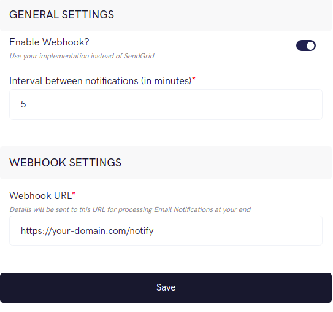
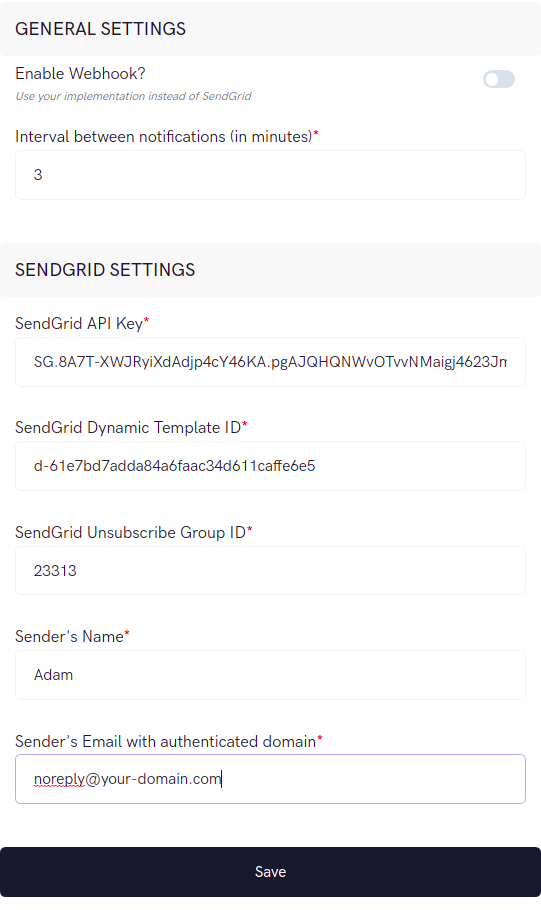
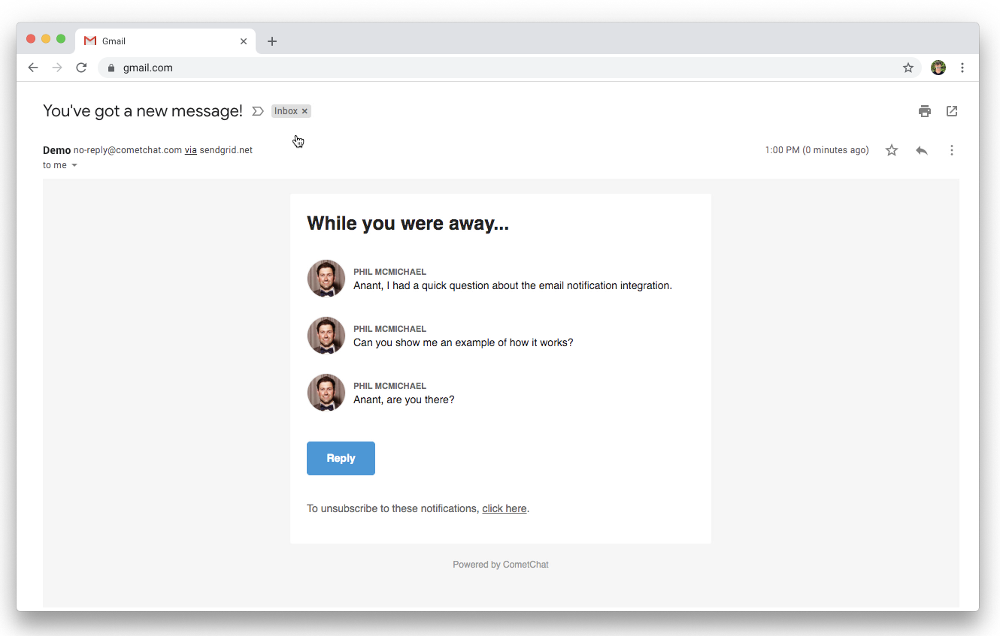

import Tabs from '@theme/Tabs';
import TabItem from '@theme/TabItem';

## About the extension

The Email Notification extension helps you to notify offline users about unread messages via emails.

After you've configured the extension, your users will receive email notifications for unread messages in one-on-one conversations.

The Email notifications extension allows you to have the following two integrations:

1. Integration using [Webhook](./email-notifications#integration-using-webhook)
2. Integration using [SendGrid](./email-notifications#integration-using-sendgrid)

## Before you begin

These steps are required irrespective of the integration.

### 1. Storing user emails

You can use our [Update user](https://api-explorer.cometchat.com/reference/update-user) API to set private metadata for a user. We recommend adding this code where you call our [Create user](https://api-explorer.cometchat.com/reference/creates-user) API.

Alternatively, just for the sake of testing purposes, you can add this from the CometChat Dashboard as well.

1. Login to [CometChat](https://app.cometchat.com/login).
2. Select your app and go to the "Users" section.
3. Click on the Edit option available under the three dots for the user under consideration.
4. Click on the Edit button on the Details section.
5. Paste the below JSON in the Metadata input box and hit Save.

The Metadata is a JSON that should have the `@private` key present and should have the value `email` specified for the user. The format for the private metadata must be as follows:

<Tabs>
<TabItem value="JSON" label="JSON">

```json
{
  "@private":
  {
    "email":"abc@xyz.com"
  }
}
```
</TabItem>
</Tabs>


### 2. Read Receipts

Be sure to implement read receipts so that your users receive email notifications for unread messages only.

## Integration using Webhook

This method of integration allows you to choose your Email API vendor and send Email notifications as per your needs.

### 1. Create your webhook

Build your backend that integrates with the Email API vendor of your choice. Expose a URL that accepts an HTTP POST request.This URL will be the "Webhook URL" to which the extension will send the following details:

| Key | Value | Description | 
| ---- | ---- | ---- | 
| to | String (email) | The Email ID of the user to send the notification. | 
| body | array | An array of message objects that were missed by the receiver. | 


<Tabs>
<TabItem value="Body of the POST rƒextensionmequest" label="Body of the POST request">

```json
{
  "to": "user@email.com",
  "body": [
    {
      "id": "121",
      "conversationId": "cometchat-uid-1_user_cometchat-uid-3",
      "sender": "cometchat-uid-3",
      "receiverType": "user",
      "receiver": "cometchat-uid-1",
      "category": "message",
      "type": "text",
      "data": {
        "text": "1",
        "entities": {
          "sender": {
            "entity": {
              "uid": "cometchat-uid-3",
              "name": "Nancy Grace",
              "role": "default",
              "avatar": "https://assets.cometchat.io/sampleapp/v2/users/cometchat-uid-3.webp",
              "status": "available",
              "lastActiveAt": 1639650770
            },
            "entityType": "user"
          },
          "receiver": {
            "entity": {
              "uid": "cometchat-uid-1",
              "name": "Andrew Joseph",
              "role": "default",
              "avatar": "https://assets.cometchat.io/sampleapp/v2/users/cometchat-uid-1.webp",
              "status": "offline",
              "lastActiveAt": 1639587777,
              "conversationId": "cometchat-uid-1_user_cometchat-uid-3"
            },
            "entityType": "user"
          }
        },
        "resource": "WEB-3_0_0_beta6-b5dee412-339c-48c6-b03a-1639650765951"
      },
      "sentAt": 1639650887,
      "updatedAt": 1639650887
    },
    {...}, {...}
  ]
}
```

</TabItem>
</Tabs>


The subject of the email can be as per your requirement. Moreover, the messages array can be formatted to create the email body using a template of your choice.

### 2. Extension settings

1. Login to [CometChat](https://app.cometchat.com/login) and select your app.
2. Go to the Extensions section and enable the Email Notification extension.
3. Open the Settings for this extension where you can fill in the below details.
4. Save your settings.



:::info Email replies
 If you wish to use the Email replies extension, you need use Integration using SendGrid.
:::

## Integration using SendGrid

We have partnered with SendGrid for sending Email Notifications and hence you need to set up an account on [SendGrid](https://www.sendgrid.com/) before you start using the extension.

### 1. Get your SendGrid API Key

1. Log in to your SendGrid account.
2. In the left navigation pane, go to Settings -&gt; API Keys.
3. If you don't have an API Key yet, click on Create API Key. Give a name to your API Key and select Full Access to get started.

### 2. Add Email template

1. In the left navigation pane, go to Email API -&gt; Dynamic Templates.
2. Click on "Create a Dynamic Template" and give a name to your template.
3. In the Template listing, expand your template and click on "Add Version".
4. Under the "Your Email Designs" tab, select Blank Template.
5. As we have the following HTML template ready for you, select the "Code Editor" option.
6. Paste the code for the email template. You should be able to see the Preview in the Right pane.
7. Click on Settings on the Left to expand the Settings drawer.
8. Enter the Version name and Subject for your email and hit "Save".
9. You have now successfully created a Template with a version. From the Dynamic Templates listing page, expand your Template and make note of your Template ID.
10. The data sent from the extension to SendGrid for using in the template are as follows:

| Key | Value | Description | 
| ---- | ---- | ---- | 
| messages | Array of message objects | The list of unread messages by the receiver. | 
| receiver | String | The name of the receiver of the Email notification. | 
| unreadCount | Int | Number of messages that are unread. | 


:::info
 1. Replace "[https://www.YOURSITE.com](https://www.YOURSITE.com&quot;)" with your website's URL in the below template.<br/>
 2. The template filters and displays the TEXT messages in the email. Feel free to modify the template to include MEDIA messages as well.
:::

<Tabs>
<TabItem value="HTML" label="HTML">

```html
<!doctype html>
<html>
  <head>
    <meta name="viewport" content="width=device-width">
    <meta http-equiv="Content-Type" content="text/html; charset=UTF-8">
    <title>Simple Transactional Email</title>
    <style>
    /* -------------------------------------
        INLINED WITH htmlemail.io/inline
    ------------------------------------- */
    /* -------------------------------------
        RESPONSIVE AND MOBILE FRIENDLY STYLES
    ------------------------------------- */
    @media only screen and (max-width: 620px) {
      table[class=body] h1 {
        font-size: 28px !important;
        margin-bottom: 10px !important;
      }
      table[class=body] p,
            table[class=body] ul,
            table[class=body] ol,
            table[class=body] td,
            table[class=body] span,
            table[class=body] a {
        font-size: 16px !important;
      }
      table[class=body] .wrapper,
            table[class=body] .article {
        padding: 10px !important;
      }
      table[class=body] .content {
        padding: 0 !important;
      }
      table[class=body] .container {
        padding: 0 !important;
        width: 100% !important;
      }
      table[class=body] .main {
        border-left-width: 0 !important;
        border-radius: 0 !important;
        border-right-width: 0 !important;
      }
      table[class=body] .btn table {
        width: 100% !important;
      }
      table[class=body] .btn a {
        width: 100% !important;
      }
      table[class=body] .img-responsive {
        height: auto !important;
        max-width: 100% !important;
        width: auto !important;
      }
    }

    /* -------------------------------------
        PRESERVE THESE STYLES IN THE HEAD
    ------------------------------------- */
    @media all {
      .ExternalClass {
        width: 100%;
      }
      .ExternalClass,
            .ExternalClass p,
            .ExternalClass span,
            .ExternalClass font,
            .ExternalClass td,
            .ExternalClass div {
        line-height: 100%;
      }
      .apple-link a {
        color: inherit !important;
        font-family: inherit !important;
        font-size: inherit !important;
        font-weight: inherit !important;
        line-height: inherit !important;
        text-decoration: none !important;
      }
      #MessageViewBody a {
        color: inherit;
        text-decoration: none;
        font-size: inherit;
        font-family: inherit;
        font-weight: inherit;
        line-height: inherit;
      }
      .btn-primary table td:hover {
        background-color: #34495e !important;
      }
      .btn-primary a:hover {
        background-color: #34495e !important;
        border-color: #34495e !important;
      }
      .senderName {
        font-weight: bold;
        font-size:0.8em;
        text-transform: uppercase;
        color: #666;
      }
    }
    </style>
  </head>
  <body class="" style="background-color: #f6f6f6; font-family: sans-serif; -webkit-font-smoothing: antialiased; font-size: 14px; line-height: 1.4; margin: 0; padding: 0; -ms-text-size-adjust: 100%; -webkit-text-size-adjust: 100%;">
    <table border="0" cellpadding="0" cellspacing="0" class="body" style="border-collapse: separate; mso-table-lspace: 0pt; mso-table-rspace: 0pt; width: 100%; background-color: #f6f6f6;">
      <tr>
        <td style="font-family: sans-serif; font-size: 14px; vertical-align: top;">&nbsp;</td>
        <td class="container" style="font-family: sans-serif; font-size: 14px; vertical-align: top; display: block; Margin: 0 auto; max-width: 580px; padding: 10px; width: 580px;">
          <div class="content" style="box-sizing: border-box; display: block; Margin: 0 auto; max-width: 580px; padding: 10px;">

            <!-- START CENTERED WHITE CONTAINER -->
            <span class="preheader" style="color: transparent; display: none; height: 0; max-height: 0; max-width: 0; opacity: 0; overflow: hidden; mso-hide: all; visibility: hidden; width: 0;">This is preheader text. Some clients will show this text as a preview.</span>
            <table class="main" style="border-collapse: separate; mso-table-lspace: 0pt; mso-table-rspace: 0pt; width: 100%; background: #ffffff; border-radius: 3px;">

              <!-- START MAIN CONTENT AREA -->
              <tr>
                <td class="wrapper" style="font-family: sans-serif; font-size: 14px; vertical-align: top; box-sizing: border-box; padding: 20px;">
                  <table border="0" cellpadding="0" cellspacing="0" style="border-collapse: separate; mso-table-lspace: 0pt; mso-table-rspace: 0pt; width: 100%;">
                    <tr>
                      <td style="font-family: sans-serif; font-size: 14px; vertical-align: top;">
                        <p style="font-family: sans-serif; font-size: 25px; font-weight: bold; margin: 0; Margin-bottom: 30px;">While you were away...</p>
                        
                        <p>Hello, {{receiver}}! You have {{unreadCount}} unread messages.</p>
                        <table border="0" cellpadding="0" cellspacing="0" class="btn btn-primary" style="border-collapse: separate; mso-table-lspace: 0pt; mso-table-rspace: 0pt; width: 100%; box-sizing: border-box;">
                          <tbody>
                            
                     
{{#each messages}}
{{#if this.data.text}}
<tr>
                              <td align="left" style="font-family: sans-serif; font-size: 14px; vertical-align: top; padding-bottom: 0px;padding-right: 10px;" width="50">
	
	<br><br>
	</td>
<td align="left" style="font-family: sans-serif; font-size: 14px; vertical-align: top; padding-top: 7px;padding-bottom:0px;"><span class="senderName">{{this.data.entities.sender.entity.name}}</span><br/>{{this.data.text}}</td>
</tr>
	{{/if}}
{{/each}}


</tbody>
</table>
                        
                        
                        <table border="0" cellpadding="0" cellspacing="0" class="btn btn-primary" style="border-collapse: separate; mso-table-lspace: 0pt; mso-table-rspace: 0pt; width: 100%; box-sizing: border-box; margin-top:15px">
                          <tbody>
                            <tr>
                              <td align="left" style="font-family: sans-serif; font-size: 14px; vertical-align: top; padding-bottom: 15px;">
                                <table border="0" cellpadding="0" cellspacing="0" style="border-collapse: separate; mso-table-lspace: 0pt; mso-table-rspace: 0pt; width: auto;">
                                  <tbody>
                                    <tr>
                                      <td style="font-family: sans-serif; font-size: 14px; vertical-align: top; background-color: #3498db; border-radius: 5px; text-align: center;"> <a href="https://www.YOURSITE.com" target="_blank" style="display: inline-block; color: #ffffff; background-color: #3498db; border: solid 1px #3498db; border-radius: 5px; box-sizing: border-box; cursor: pointer; text-decoration: none; font-size: 14px; font-weight: bold; margin: 0; padding: 12px 25px; text-transform: capitalize; border-color: #3498db;">Visit</a> </td>
                                    </tr>
                                  </tbody>
                                </table>
                              </td>
                            </tr>
                          </tbody>
                        </table>
                        <p style="font-family: sans-serif; font-size: 14px; font-weight: normal; margin: 0; Margin-bottom: 15px;margin-top:20px;color:#666;">To unsubscribe to these notifications, <a href="<%asm_group_unsubscribe_raw_url%>" style="color:#666">click here</a>.</p>
                      </td>
                    </tr>
                  </table>
                </td>
              </tr>

            <!-- END MAIN CONTENT AREA -->
            </table>

            <!-- START FOOTER -->
            <div class="footer" style="clear: both; Margin-top: 10px; text-align: center; width: 100%;">
              <table border="0" cellpadding="0" cellspacing="0" style="border-collapse: separate; mso-table-lspace: 0pt; mso-table-rspace: 0pt; width: 100%;">

                <tr>
                  <td class="content-block powered-by" style="font-family: sans-serif; vertical-align: top; padding-bottom: 10px; padding-top: 10px; font-size: 12px; color: #999999; text-align: center;">
                    Powered by <a href="https://www.cometchat.com" style="color: #999999; font-size: 12px; text-align: center; text-decoration: none;">CometChat</a>
                  </td>
                </tr>
              </table>
            </div>
            <!-- END FOOTER -->

          <!-- END CENTERED WHITE CONTAINER -->
          </div>
        </td>
        <td style="font-family: sans-serif; font-size: 14px; vertical-align: top;">&nbsp;</td>
      </tr>
    </table>
  </body>
</html>
```

</TabItem>
</Tabs>


### 3. Add Unsubscribe Group

An unsubscribe group will allow your users to unsubscribe to only chat email notifications and will allow you to continue to send other emails to that user via SendGrid.

1. In the left pane, go to Suppressions -&gt; Unsubscribe Groups
2. Click on "Create New Group" and give it a name and proper description.
3. Save your new group and note down the Group ID.

### 4. Extension settings

1. Login to [CometChat](https://app.cometchat.com/login) and select your app.
2. Go to the Extensions section and enable the Email Notification extension.
3. Open the Settings for this extension where you can fill in the below details.
4. Save your settings.

:::info Domain Authentication
 The domain used in Sender's Email needs to be Authenticated. Refer to SendGrid's documentation on [Domain Authentication](https://docs.sendgrid.com/ui/account-and-settings/how-to-set-up-domain-authentication) for more details.
:::



## Receive Email Notifications

Send a message to an offline user and watch them receive an email automagically!


