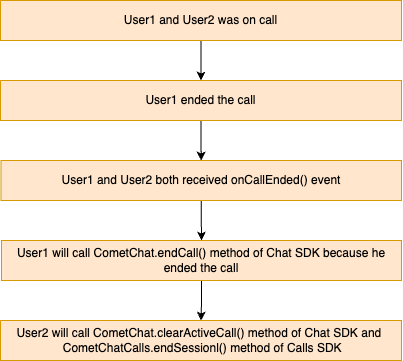

import Tabs from '@theme/Tabs';
import TabItem from '@theme/TabItem';

## Overview
This guide demonstrates how to start call in to an Android application. Before you begin, we strongly recommend you read the calling setup guide.

## Add Multiple Calls Event Listeners
For every activity or fragment you wish to receive call listeners, you need to register the CallsEventListeners using the `addCallsEventListeners()` method.

<Tabs>
<TabItem value="Java" label="Java">

  ```java
  private String listenerId = "UNIQUE_LISTENER_ID";

  CometChatCalls.addCallsEventListeners(listenerId, new CometChatCallsEventsListener() {
      @Override
      public void onCallEnded() {

      }

      @Override
      public void onCallEndButtonPressed() {

      }

      @Override
      public void onUserJoined(RTCUser user) {

      }

      @Override
      public void onUserLeft(RTCUser user) {

      }

      @Override
      public void onUserListChanged(ArrayList<RTCUser> users) {

      }

      @Override
      public void onAudioModeChanged(ArrayList<AudioMode> devices) {

      }

      @Override
      public void onCallSwitchedToVideo(CallSwitchRequestInfo info) {

      }

      @Override
      public void onUserMuted(RTCMutedUser muteObj) {

      }

      @Override
      public void onRecordingToggled(RTCRecordingInfo info) {

      }

      @Override
      public void onError(CometChatException ce) {

      }
  });
  ```
</TabItem>
<TabItem value="Kotlin" label="Kotlin">

  ```kotlin
  val listenerID:String="UNIQUE_LISTENER_ID"

  CometChatCalls.addCallsEventListeners(listenerId, object: CometChatCallsEventsListener {
      override fun onCallEnded() {

      }

      override fun onCallEndButtonPressed() {

      }

      override fun onUserJoined(user: RTCUser) {

      }

      override fun onUserLeft(user: RTCUser) {

      }

      override fun onUserListChanged(users: ArrayList<RTCUser>) {

      }

      override fun onAudioModeChanged(devices: ArrayList<AudioMode?>?) {

      }

      override fun onCallSwitchedToVideo(info: CallSwitchRequestInfo) {

      }

      override fun onUserMuted(muteObj: RTCMutedUser) {

      }

      override fun onRecordingToggled(info: RTCRecordingInfo) {

      }

      override fun onError(ce: CometChatException?) {

      }
  })
  ```
</TabItem>
</Tabs>


## Generate Call Token
Before start call session you have to generate call token. You need to call this method for call token.

<Tabs>
<TabItem value="Java" label="Java">

  ```java
  String sessionId = "" //Random or available in call obecjt in case of default calling
  String userAuthToken = CometChat.getUserAuthToken() //Logged in user auth token

  CometChatCalls.generateToken(sessionId, userAuthToken, new CometChatCalls.CallbackListener<GenerateToken>() {
      @Override
      public void onSuccess(GenerateToken generateToken) {

      }

      @Override
      public void onError(com.cometchat.pro.rtc.exceptions.CometChatException e) {

      }
  });
  ```
</TabItem>
<TabItem value="Kotlin" label="Kotlin">

  ```kotlin
  val sessionId = "" //Random or available in call obecjt in case of default calling
  val userAuthToken = CometChat.getUserAuthToken() //Logged in user auth token

  CometChatCalls.generateToken(
      sessionId,
      userAuthToken,
      object : CometChatCalls.CallbackListener<GenerateToken>() {
          override fun onSuccess(generateToken: GenerateToken) {
              
          }

          override fun onError(e: CometChatException) {
            
          }
      }
  )
  ```
</TabItem>
</Tabs>

| Parameter       | Description                                                                                                        |
|------------------|--------------------------------------------------------------------------------------------------------------------|
| `sessionId`      | The unique random session ID. In case you are using the default call, then the session ID is available in the Call object. |
| `userAuthToken`  | The user auth token is the logged-in user auth token which you can get by calling CometChat Chat SDK method `CometChat.getUserAuthToken()` |

## Start Call Session

The most important class that will be used in the implementation is the `CallSettings` class. This class allows you to set the various parameters for the call/conference. In order to set the various parameters of the `CallSettings` class, you need to use the `CallSettingsBuilder` class. Below are the various options available with the `CallSettings` class.

CallSettingsBuilder class takes the 2 mandatory parameters as a part of the constructor:

1. Context of the application
2. An object of the RelativeLayout. The calling UI will be loaded in this relative layout provided.

The other mandatory parameter is the sessionId for the call/conference. You can use the setSessionId() method of the `CallSettingsBuilder` to set the session Id of the call.

A basic example of how to start a direct call:

<Tabs>
<TabItem value="Java" label="Java">

  ```java
  RelativeLayout videoContainer;
  Context activityContext = this; //Your activity reference
  String callToken = "" //Received on generate token onSuccess
  boolean isDefaultCall = true; //Call type default or direct.
  boolean isCallEndedByMe = false;

  CallSettings callSettings = new CometChatCalls.CallSettingsBuilder(activityContext, videoContainer)
      .setDefaultLayoutEnable(true)
      .setIsAudioOnly(false)
      .setEventListener(new CometChatCallsEventsListener() {
          @Override
          public void onCallEnded() {
              if(isDefaultCall){
                  if(isCallEndedByMe){
                      //Call CometChat.endCall() method
                  }else {
                      //Call CometChatCalls.endSession() and CometChat.clearActiveCall() methods
                  }
              } else{
                  //If a group call has ended and there is only one user left on the call
                  //you can end the call session for that user by calling the CometChatCalls.endSession()
              }
          }

          @Override
          public void onCallEndButtonPressed() {
              if(isDefaultCall){
                  isCallEndedByMe = true;
              }else {
                  //Leave the current call
                  CometChatCalls.endSession();
              }
          }

          @Override
          public void onUserJoined(RTCUser user) {

          }

          @Override
          public void onUserLeft(RTCUser user) {

          }

          @Override
          public void onUserListChanged(ArrayList<RTCUser> users) {

          }

          @Override
          public void onAudioModeChanged(ArrayList<AudioMode> devices) {

          }

          @Override
          public void onCallSwitchedToVideo(CallSwitchRequestInfo callSwitchRequestInfo) {

          }

          @Override
          public void onUserMuted(RTCMutedUser muteObj) {

          }

          @Override
          public void onRecordingToggled(RTCRecordingInfo recordingInfo) {

          }

          @Override
          public void onError(com.cometchat.pro.rtc.exceptions.CometChatException ce) {

          }
      })
      .build();


  CometChatCalls.startSession(callToken, callSettings, new CometChatCalls.CallbackListener<String>() {
      @Override
      public void onSuccess(String s) {

      }

      @Override
      public void onError(com.cometchat.pro.rtc.exceptions.CometChatException e) {

      }
  });  
  ```
</TabItem>
<TabItem value="Kotlin" label="Kotlin">

  ```kotlin
  val videoContainer: RelativeLayout
  val activityContext: Context = this //Your activity reference
  val callToken = "" //Received on generate token onSuccess
  var isDefaultCall = true //Call type default or direct.
  var isCallEndedByMe = false

  val callSettings = CometChatCalls.CallSettingsBuilder(activityContext, videoContainer)
      .setDefaultLayoutEnable(true)
      .setIsAudioOnly(false)
      .setEventListener(object : CometChatCallsEventsListener {
          override fun onCallEnded() {
              if (isDefaultCall) {
                  if (isCallEndedByMe) {
                      //Call CometChat.endCall() method
                  } else {
                      //Call CometChatCalls.endSession() and CometChat.clearActiveCall() methods
                  }
              } else {
                  //If a group call has ended and there is only one user left on the call
                  //you can end the call session for that user by calling the CometChatCalls.endSession()
              }
          }

          override fun onCallEndButtonPressed() {
              if (isDefaultCall) {
                  isCallEndedByMe = true
              } else {
                  //Leave the current call
                  CometChatCalls.endSession()
              }
          }

          override fun onUserJoined(user: RTCUser) {

          }

          override fun onUserLeft(user: RTCUser) {

          }

          override fun onUserListChanged(users: ArrayList<RTCUser>) {

          }

          override fun onAudioModeChanged(devices: ArrayList<AudioMode>) {

          }

          override fun onCallSwitchedToVideo(callSwitchRequestInfo: CallSwitchRequestInfo) {

          }

          override fun onUserMuted(muteObj: RTCMutedUser) {

          }

          override fun onRecordingToggled(recordingInfo: RTCRecordingInfo) {

          }

          override fun onError(ce: CometChatException) {

          }
      })
      .build()


  CometChatCalls.startSession(callToken, callSettings, object : CometChatCalls.CallbackListener<String> {
      override fun onSuccess(s: String) {

      }

      override fun onError(e: CometChatException) {

      }
  })
  ```
</TabItem>
</Tabs>


The `setAudioOnlyCall()` method allows you to set if the call is supposed to be an audio call or an audio-video call. If set to true, the call will be an audio-only call else when set to false the call will be an audio-video call. The default will is false, so if not set, the call will be an audio-video call.

| Parameter | Description | 
| ---- | ---- | 
| `activityContext` | The activity that you want to show the calling view in. | 
| `videoContainer` | An object of the relativeLayout class in which CometChatCalls can load the calling views. | 

The `CometChatCallsEventsListener` listener provides you with the below callback methods:

| Callback Method | Description | 
|----------------------------------------------------------|------------------------------------------------------------------------------------------|
| `onCallEnded()`                                          | The `onCallEnded()` event is triggered when a call between two users ends. This event is triggered for both users, regardless of who ended the call.<br/> <br/>The `onCallEnded()` event does not trigger if there are more than two users in the call, or if there are fewer than two users in the call.<br/> <br/>The best use case for the `onCallEnded()` event is in the default calling flow. In the default calling flow, the call ends when either user hangs up. In this case, both users will receive the `onCallEnded()` event. However, the user who ended the call will also receive the `onCallEndButtonPressed()` event.                          |
| `onCallEndButtonPressed()`                               | This method is called when the user press end call button.<br/> <br/>TheThe user who leaves the call or who ends the call by clicking on the calling end call UI button will get the `onCallEndButtonPressed()` event. |
| `onUserJoined(user: RTCUser)`                            | This method is called when any other user joins the call. The user details can be obtained from the User object provided. |
| `onUserLeft(user: RTCUser)`                              | This method is called when a user leaves the call. The details of the user can be obtained from the provided `User` object. |
| `onUserListChanged(users: ArrayList<RTCUser?>)`          | This method is triggered every time a participant joins or leaves the call providing the list of users active in the call. |
| `onAudioModeChanged(devices: ArrayList<AudioMode?>)`     | This callback is triggered if any new audio output source is available or becomes unavailable. |
| `onCallSwitchedToVideo(callSwitchRequestInfo: CallSwitchRequestInfo)` | This callback is triggered when an audio call is converted into a video call. |
| `onUserMuted(muteObj: RTCMutedUser)`                     | This method is triggered when a user is muted in the ongoing call. |
| `onRecordingToggled(recordingInfo: RTCRecordingInfo)	`  | This method is triggered when a recording start/stop. |
| `onError(e: CometChatException)	`                        | This method is called when there is some error in establishing the call. |


## End Call Session
To release the acquired calling resource and end the call, the end call session must be called.

## For Default Call
:::info
You only need to call the end call method of the chat SDK for default calling flows. Direct calling flows do not require it.
:::
To end a call in the default call flow, you must call the `CometChat.endCall()` method, which belongs to the CometChat Chat SDK, and the `CometChatCalls.endSession()` method, which belongs to the CometChat Calls SDK.

The user who pressed the end call button will call the CometChat.endCall() method, and the another user how was on call will call the two methods which is `CometChat.clearActiveCall()` and `CometChatCalls.endSession()` methods to release the calling resources



The user who ended the call

<Tabs>
<TabItem value="Java" label="Java">

  ```java
  CometChat.endCall(sessionId, new CometChat.CallbackListener<Call>() {
      @Override
      public void onSuccess(Call call) {
        //Close the calling screen
      }

      @Override
      public void onError(CometChatException e) {
        Log.e(TAG, "Erorr: " + e);
      }
  });
  ```
</TabItem>
<TabItem value="Kotlin" label="Kotlin">

  ```kotlin
  CometChat.endCall(sessionId, object : CallbackListener<Call?>() {
      override fun onSuccess(call: Call?) {
        //Close the calling screen
      }
      override fun onError(e: CometChatException) {
        Log.e(TAG, "Erorr: $e")
      }
  }) 
  ```
</TabItem>
</Tabs>


The another user who was on call

<Tabs>
<TabItem value="Java" label="Java">

  ```java
  CometChat.clearActiveCall();
  CometChatCalls.endSession(sessionId);
  ```
</TabItem>
<TabItem value="Kotlin" label="Kotlin">

  ```kotlin
  CometChat.clearActiveCall()
  CometChatCalls.endSession(sessionId)
  ```
</TabItem>
</Tabs>

## For Direct Call

<Tabs>
<TabItem value="Java" label="Java">

  ```java
  CometChatCalls.endSession(sessionId);  
  ```
</TabItem>
<TabItem value="Kotlin" label="Kotlin">

  ```kotlin
  //onCallEndButtonPressed() event call the below method of calls SDK
  CometChatCalls.endSession(sessionId)
  ```
</TabItem>
</Tabs>


## Settings

The `CallSettings` class is the most important class when it comes to the implementation of the Calling feature. This is the class that allows you to customize the overall calling experience. The properties for the call/conference can be set using the `CallSettingsBuilder` class. This will eventually give you and object of the `CallSettings` class which you can pass to the `startCall()` method to start the call.

The **mandatory** parameters that are required to be present for any call/conference to work are:

1. Context - context of the activity/application
2. RelativeLayout - A RelativeLayout object in which the calling UI is loaded.
3. sessionId - The unique session Id for the call/conference session.

The options available for customization of calls are:

| Setting | Description | 
| ---- | ---- | 
| `setDefaultLayoutEnable(boolean value)` | If set to `true` enables the default layout for handling the call operations.<br/><br/>If set to `false` it hides the button layout and just displays the Call View<br/><br/>Default value = `true` |
| `setIsAudioOnly(boolean value)` | If set to `true` call is supposed to be an audio call<br/><br/>if set to `false` call is supposed to be a video call<br/><br/>Default Value = `false` |
| `showEndCallButton(boolean value)` | If set to `true` it displays the EndCallButton in Button Layout.<br/><br/>if set to `false` it hides the EndCallButton in Button Layout<br/><br/>Default value = true |
| `showSwitchCameraButton(boolean value)` | If set to `true` it displays the SwitchCameraButton in Button Layout.<br/><br/>if set to `false` it hides the SwitchCameraButton in Button Layout<br/><br/>Default value = `true` |
| `showMuteAudioButton(boolean value)` | If set to `true` it displays the MuteAudioButton in Button Layout.<br/><br/>If set to `false` it hides the MuteAudioButton in Button Layout<br/><br/>Default value = `true` |
| `showPauseVideoButton(boolean value)` | If set to `true` it displays the PauseVideoButton in Button Layout.<br/><br/>If set to `false` it hides the PauseVideoButton in Button Layout<br/><br/>Default value = `true` |
| `showAudioModeButton(boolean value)` | If set to `true` it displays the AudioModeButton in Button Layout.<br/><br/>If set to `false` it hides the AudioModeButton in Button Layout<br/><br/>Default value = `true` |
| `setMode(boolean value)` | CometChat provides 3 options for the calling UI.<br/><br/>1. `CometChatCallsConstants.MODE_DEFAULT`<br/><br/>2. `CometChatCallsConstants.MODE_SPOTLIGHT`<br/><br/>3. `CometChatCallsConstants.MODE_SINGLE`<br/><br/>Default value = `CometChatCallsConstants.MODE_DEFAULT` |
| `startWithAudioMuted(boolean value)` | This ensures the call is started with the audio muted if set to `true`<br/><br/>Default value = `false` |
| `startWithVideoMuted(boolean value)` | This ensures the call is started with the video muted if set to `true`<br/><br/>Default value = `false` |
| `setDefaultAudioMode(boolean value)` | This method can be used if you wish to start the call with a specific audio mode. The available options are:<br/><br/>1. `CometChatCallsConstants.AUDIO_MODE_SPEAKER`<br/><br/>2. `CometChatCallsConstants.AUDIO_MODE_EARPIECE`<br/><br/>3. `CometChatCallsConstants.AUDIO_MODE_BLUETOOTH`<br/><br/>4. `CometChatCallsConstants.AUDIO_MODE_HEADPHONES` |
| `showSwitchToVideoCallButton(boolean value)` | This method shows/hides the switch to video call button. If set to `true` it will display the switch to video call button. If set to `false` it will hide the switch to video call button.<br/><br/>Default value = `true` |
| `showRecordingButton(boolean value)` | If set to `true` it displays the Recording Button.<br/><br/>If set to `false` it hides the Recording Button<br/><br/>Default value = `false` |
| `autoRecordOnCallStart(boolean value)` | If set to `true` it start recording automatically once call is connected<br/><br/>Default value = `false` |
| `setAvatarMode(boolean value)` | This method sets the mode of avatar. The avatar mode can be one of the below constants:<br/><br/>1. `CometChatCallsConstants.AVATAR_MODE_CIRCLE`<br/><br/>2. `CometChatCallsConstants.AVATAR_MODE_SQUARE`<br/><br/>3. `CometChatCallsConstants.AVATAR_MODE_FULLSCREEN`<br/><br/>Default value = `CometChatCallsConstants.AVATAR_MODE_CIRCLE `|
| `setMainVideoContainerSetting(boolean value)` | This method can be used to customize the main video container. You can read more about this [here](./video-view-customisation) |
| `enableVideoTileDrag(boolean value)` | This method can be used to enable/disable video tile drag functionality in Spotlight mode.<br/><br/>Default value = `true` |
| `enableVideoTileClick(boolean value)` | This method can be used to enable/disable video tile click functionality in Spotlight mode.<br/><br/>Default value = `true` |
| `setEventListener(boolean value)` | The CometChatCallsEventsListener listener provides you callbacks |

In case you wish to achieve a completely customized UI for the Calling experience, you can do so by embedding default android buttons to the screen as per your requirement and then use the below methods to achieve different functionalities for the embedded buttons.

For the use case where you wish to align your own custom buttons and not use the default layout provided CometChat you can embed the buttons in your layout and use the below methods to perform the corresponding operations:

### Switch Camera

You can call `switchCamera()` Method to toggle between camera sources.

<Tabs>
<TabItem value="Java" label="Java">

  ```java
  CometChatCalls.switchCamera();
  ```
</TabItem>
<TabItem value="Kotlin" label="Kotlin">

  ```kotlin
  CometChatCalls.switchCamera()
  ```
</TabItem>
</Tabs>


### Mute Audio

You can call `muteAudio()` Method to mute your Audio Stream to the end-user.

<Tabs>
<TabItem value="Java" label="Java">

  ```java
  CometChatCalls.muteAudio(true);
  ```
</TabItem>
<TabItem value="Kotlin" label="Kotlin">

  ```kotlin
  CometChatCalls.muteAudio(true)
  ```
</TabItem>
</Tabs>


if set to `true` the Audio Stream is muted and if set to`false` Audio Stream is transmitted.

### Pause Video

You can call `pauseVideo()` Method to pause Video Stream to the end-user.

<Tabs>
<TabItem value="Java" label="Java">

  ```java
  CometChatCalls.pauseVideo(true);
  ```
</TabItem>
<TabItem value="Kotlin" label="Kotlin">

  ```kotlin
  CometChatCalls.pauseVideo(true)
  ```
</TabItem>
</Tabs>


if set to `true` the Video Stream is muted and if set to `false` Video Stream is transmitted.

### Set Audio Mode

You can call `setAudioMode()` to set the output of the audio stream.

<Tabs>
<TabItem value="Java" label="Java">

  ```java
  String audioMode = CometChatConstants.AUDIO_MODE_EARPIECE;
  CometChatCalls.setAudioMode(audioMode);
  ```
</TabItem>
<TabItem value="Kotlin" label="Kotlin">

  ```kotlin
  val audioMode = CometChatConstants.AUDIO_MODE_EARPIECE
  CometChatCalls.setAudioMode(audioMode)
  ```
</TabItem>
</Tabs>


The audio mode string can have either one of the below 4 values:

1. `CometChatCallsConstants.AUDIO_MODE_SPEAKER`
2. `CometChatCallsConstants.AUDIO_MODE_EARPIECE`
3. `CometChatCallsConstants.AUDIO_MODE_BLUETOOTH`
4. `CometChatCallsConstants.AUDIO_MODE_HEADPHONES`

### Enter PIP Mode
If you are using a PIP (Picture-In-Picture) mode in your app and you want to render calling view in PIP then you can call `enterPIPMode()` method.

<Tabs>
<TabItem value="Java" label="Java">

  ```java
  CometChatCalls.enterPIPMode();
  ```
</TabItem>
<TabItem value="Kotlin" label="Kotlin">

  ```kotlin
  CometChatCalls.enterPIPMode()
  ```
</TabItem>
</Tabs>


### Exit PIP Mode
You can call `exitPIPMode()` to enter in PIP mode.

<Tabs>
<TabItem value="Java" label="Java">

  ```java
  CometChatCalls.exitPIPMode();   
  ```
</TabItem>
<TabItem value="Kotlin" label="Kotlin">

  ```kotlin
  CometChatCalls.exitPIPMode()
  ```
</TabItem>
</Tabs>


### Switch To Video Call

You can use the `switchToVideoCall()` method to switch from audio call to video call.


<Tabs>
<TabItem value="Java" label="Java">

  ```java
  CometChatCalls.switchToVideoCall();
  ```
</TabItem>
<TabItem value="Kotlin" label="Kotlin">

  ```kotlin
  CometChatCalls.switchToVideoCall()
  ```
</TabItem>
</Tabs>


## Start Recording
You can call startRecording() to start the recording

<Tabs>
<TabItem value="Java" label="Java">

  ```java
  CometChatCalls.startRecording();
  ```
</TabItem>
<TabItem value="Kotlin" label="Kotlin">

  ```kotlin
  CometChatCalls.startRecording()  
  ```
</TabItem>
</Tabs>


### Stop Recording
You can call stopRecording() to stop the recording

<Tabs>
<TabItem value="Java" label="Java">

  ```java
  CometChatCalls.stopRecording();
  ```
</TabItem>
<TabItem value="Kotlin" label="Kotlin">

  ```kotlin
  CometChatCalls.stopRecording()   
  ```
</TabItem>
</Tabs>


### End Call

You can call CometChatCalls.endSession() to end the call


<Tabs>
<TabItem value="Java" label="Java">

  ```java
  CometChatCalls.endSession();
  ```
</TabItem>
<TabItem value="Kotlin" label="Kotlin">

  ```kotlin
  CometChatCalls.endSession()  
  ```
</TabItem>
</Tabs>


### Clear Active Call
You can call CometChat.clearActiveCall() to clear the call current call reference
<Tabs>
<TabItem value="Java" label="Java">

  ```java
  CometChat.clearActiveCall();
  ```
</TabItem>
<TabItem value="Kotlin" label="Kotlin">

  ```kotlin
  CometChatCalls.endSession()
  ```
</TabItem>
</Tabs>


## Calling Notification
:::info
Get the incoming and missed calls notification through firebase FCM notification. To know more about it click here
:::