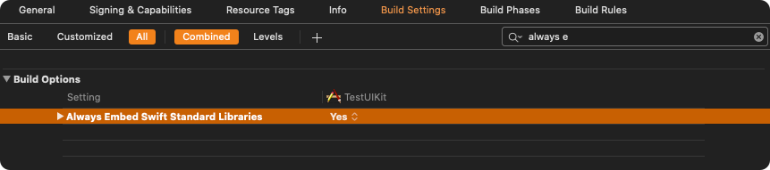

import Tabs from '@theme/Tabs';
import TabItem from '@theme/TabItem';

## Get your Application Keys

[Signup for CometChat](https://app.cometchat.com) and then:

1. Create a new app
2. Head over to the **API Keys** section and note the **Auth Key**, **App ID** & **Region**

:::tip Minimum Requirement

1.  Xcode 12 (or Higher)
2.  iOS 11 or higher

:::

---

## Add the CometChat Dependency

### CocoaPods

We recommend using [CocoaPods](https://cocoapods.org/), as they are the most advanced way of managing iOS project dependencies. Open a terminal window, move to your project directory, and then create a `Podfile` by running the following command.

:::warning note

1.  CometChatSDK supports installation through Cocoapods only. Currently, we are supporting Xcode 11.4 and higher.
2.  CometChatSDK includes video calling components. We suggest you run on physical devices to avoid errors.

:::

<Tabs>
<TabItem value="Swift" label="Swift">

```swift
$ pod init
```

</TabItem>
</Tabs>

Add the following lines to the Podfile.

<Tabs>
<TabItem value="Swift" label="Swift">

```swift
platform :ios, '11.0'
use_frameworks!

target 'MyApp' do
  pod 'CometChatSDK', '4.0.54'
end
```

</TabItem>
</Tabs>

And then install the `CometChatSDK` framework through CocoaPods.

<Tabs>
<TabItem value="Swift" label="Swift">

```swift
$ pod install
```

</TabItem>
</Tabs>

Always get the latest version of `CometChatSDK` by command

<Tabs>
<TabItem value="Swift" label="Swift">

```swift
$ pod update CometChatSDK
```

</TabItem>
</Tabs>

### Swift Packages

To install **Swift Packages** you can use Xcode package manager**.**

1. Open **Xcode**, go to the project's **General** settings tab and select the project under **Project** in the left column.
2. Go to the **Swift packages** tab and click on the **+** button.


3. Once the pop-up appears, enter the github repository address in the search bar [`https://github.com/cometchat/chat-sdk-ios.git`](https://github.com/cometchat/chat-sdk-ios.git) and set dependency rule to `Up to Next Major Version` and set version as `4.0.54` . Then click on the **Add Package** button.


4. `CometChatSDK` must be checked in the **Package Product** column and click on the Add Package button. This will add **Package Dependencies** menu in Xcode.


### Request Authorization

Prepare your app for this requirement by providing justification strings. The justification string is a localizable message that you add to your app's `Info.plist` file to tell the user why your app needs access to the user's photo library, Camera, Microphone. Then, App prompts the user to grant permission for access, the alert displays the justification string you provided, in the language of the locale selected on the user's device. You can do this as follows:


<Tabs>
<TabItem value="Info.plist" label="Info.plist">

```xml
<key>NSAppTransportSecurity<_key>
  <dict>
	  <key>NSAllowsArbitraryLoads<_key>
	  <true _>
  <_dict>
<key>NSCameraUsageDescription<_key>
	<string>$(PRODUCT_NAME) need access to the camera in order to update your avatar<_string>
<key>NSPhotoLibraryUsageDescription<_key>
	<string>$(PRODUCT_NAME) need access to the Photo Library in order to send Media Messages<_string>
<key>NSMicrophoneUsageDescription<_key>
	<string>$(PRODUCT_NAME) need access to the Microphone in order to connect Audio_Video call <_string>
```

</TabItem>
</Tabs>

### Setup Bitcode

You can set the Enable Bitcode setting to YES present in build settings in your XCode project.


### Swift Standard Libraries

`CometChatSDK`framework build on Swift, you have to ensure the required libraries are embedded. This can be done by setting the `“Always Embed Swift Standard Libraries”` checkbox in your target’s build settings to “Yes”:



### Set Header Search Path

Set the `Header Search Paths` to `$SDKROOT/usr/include/libxml2`.


---

## Initialize CometChat

The `init()` method initializes the settings required for CometChat.

The `init()` method takes the below parameters:

1. appID - You CometChat App ID
2. appSettings - An object of the AppSettings class can be created using the AppSettingsBuilder class. The region field is mandatory and can be set using the `setRegion()` method.

The `AppSettings` class allows you to configure three settings:

- **Region**: The region where you app was created.
- **[Presence Subscription](./user-presence) :** Represents the subscription type for user presence (real-time online/offline status)
- **autoEstablishSocketConnection(boolean value)**: This property takes a boolean value which when set to true informs the SDK to manage the web-socket connection internally. If set to false, it informs the SDK that the web-socket connection will be managed manually. The default value for this parameter is true. For more information on this, please check the [Managing Web-Socket connections manually](./managing-web-socket-connections-manually) section. The default value for this property is **true.**
- **overrideAdminHost(adminHost: string)**: This method takes the admin URL as input and uses this admin URL instead of the default admin URL. This can be used in case of dedicated deployment of CometChat.
- **overrideClientHost(clientHost: string)**: This method takes the client URL as input and uses this client URL instead of the default client URL. This can be used in case of dedicated deployment of CometChat.

We suggest you call the method on app startup preferably in the `didFinishLaunchingWithOptions:` method of the `AppDelegate` class.

<Tabs>
<TabItem value="Swift" label="Swift">

```swift
import CometChatSDK

class AppDelegate: UIResponder, UIApplicationDelegate{
{
   var window: UIWindow?
   let appId: String = "ENTER APP ID"
   let region: String = "ENTER REGION CODE"

func application(_ application: UIApplication, didFinishLaunchingWithOptions launchOptions: [UIApplication.LaunchOptionsKey: Any]?) -> Bool {

let mySettings = AppSettings.AppSettingsBuilder().subscribePresenceForAllUsers().setRegion(region: region).build()

  CometChat.init(appId: appId ,appSettings: mySettings,onSuccess: { (isSuccess) in
            if (isSuccess) {
                print("CometChat SDK intialise successfully.")
            }
        }) { (error) in
                print("CometChat SDK failed intialise with error: \\(error.errorDescription)")
        }
        return true
    }
}
```

</TabItem>
<TabItem value="Objective C" label="Objective C">

```objectivec
#import <CometChatSDK_CometChatSDK-Swift.h>

@interface AppDelegate ()

@end

@implementation AppDelegate


- (BOOL)application:(UIApplication *)application didFinishLaunchingWithOptions:(NSDictionary *)launchOptions {

  NSString *region = @"REGION";
  NSString *appID = @"YOUR_APP_ID";

    AppSettingsBuilder *appSettingBuilder = [[AppSettingsBuilder alloc]init];
    AppSettings *appSettings = [[[appSettingBuilder subscribePresenceForAllUsers]setRegionWithRegion:region]build];

    [[CometChat alloc]initWithAppId: appID appSettings:appSettings onSuccess:^(BOOL isSuccess) {
        NSLog(isSuccess ? @"CometChat Initialize Success:-YES" : @"CometChat Initialize Success:-NO");
    } onError:^(CometChatException * error) {
        NSLog(@"Error %@",[error errorDescription]);
    }];
    return YES;
}
```

</TabItem>
</Tabs>

Make sure you replace the `appId` with your CometChat **App ID** in the above code.

| Parameter  | Description                         |
| ---------- | ----------------------------------- |
| appID      | CometChat App ID                    |
| appSetting | An object of the AppSettings class. |

---

## Publishing to App Store

To publish your App on App Store please [follow this guide](./publishing-app-on-appstore)
