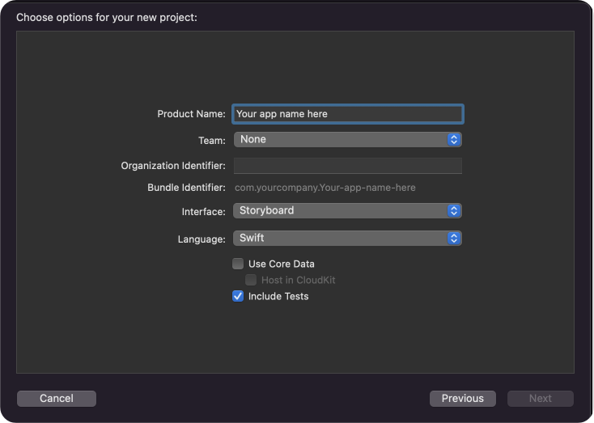
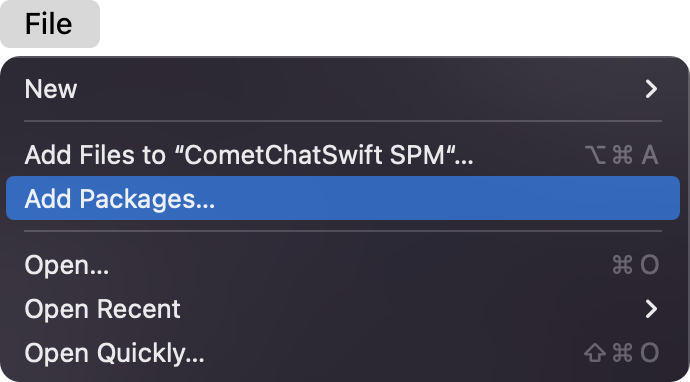
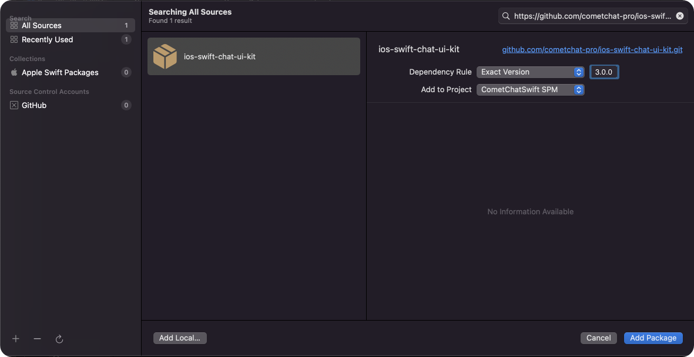
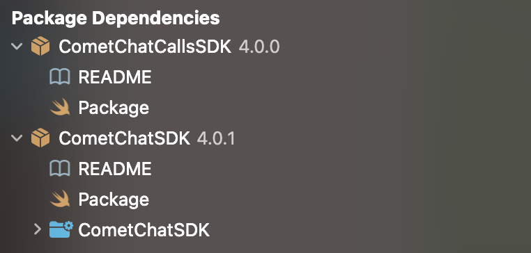

import Tabs from '@theme/Tabs';
import TabItem from '@theme/TabItem';

The **CometChatCalls** is developed to keep developers in mind and aims to reduce development efforts significantly. Let's start to integrate Calls Kit into your project.

---

## Before you begin

Before installing **CometChatCalls for iOS**, you need to create a CometChat application on the CometChat Dashboard, which comprises everything required in a chat service including users, groups, calls & messages. You will need the `App ID` , `AuthKey`, `Region` of your CometChat application when initializing the SDK.

**i. Register on CometChat 🧑‍💻**

- To install **CometChatCalls for iOS**, you need to first register on **CometChat Dashboard**. [Click here to sign up](https://app.cometchat.com/login).

**ii. Get Your Application Keys 🔑**

- Create a **new app**
- Head over to the **QuickStart** or **API & Auth Keys section** and note the **App ID**, **Auth Key**, and **Region**.

:::tip Note
Each CometChat application can be integrated with a single client app. Within the same application, users can communicate with each other across all platforms, whether they are on mobile devices or on the web.
:::

---

## Prerequisites

The minimum requirements for **CometChatCalls for iOS** are:

- `macOS`
- `Xcode`
- `iOS 13.0 and later`
- `Swift 5.0+`

---

## Get Started

You can start building a modern calling experience in your app by installing UIKit. This developer kit is an add-on feature to CometChat iOS SDK so installing it will also install the core Chat SDK.

---

### Step 1 : Create a project

To get started, open `Xcode` and create a new project.


#### Enter name, identifier and proceed.



---

### Step 2 : Install CometChatProCalls Kit

You can install **CometChatCalls for iOS** through **Swift Package Manager or Cocoapods**

### CocoaPods

We recommend using [CocoaPods](https://cocoapods.org/), as they are the most advanced way of managing iOS project dependencies. Open a terminal window, move to your project directory, and then create a `Podfile` by running the following command.

<Tabs>
<TabItem value="Swift" label="Swift">

```swift
$ pod init
```

</TabItem>
</Tabs>

Add the following lines to the Podfile.

<Tabs>
<TabItem value="Swift" label="Swift">

```swift
platform :ios, '11.0'
use_frameworks!

target 'YourApp' do
  pod 'CometChatSDK', '4.0.54'
  pod 'CometChatCallsSDK', '4.0.8'

end
```

</TabItem>
</Tabs>

And then install the `CometChatCalls` framework through CocoaPods.

<Tabs>
<TabItem value="Swift" label="Swift">

```swift
$ pod install
```

</TabItem>
</Tabs>

If you're facing any issues while installing pods then use the below command.

<Tabs>
<TabItem value="Swift" label="Swift">

```swift
$ pod install --repo-update
```

</TabItem>
</Tabs>

Always get the latest version of `CometChatCalls` by command.

<Tabs>
<TabItem value="Swift" label="Swift">

```swift
$ pod update CometChatCallsSDK
```

</TabItem>
</Tabs>

> CometChatCallsSDK version `4.0.0` is compatible with `4.0.0` version of CometChatSDK

### Swift Package Manager

1. Go to your Swift Package Manager's **File** tab and select **Add Packages**.



2. Add `CometChatProCalls` into your `Package Repository` as below:

<Tabs>
<TabItem value="Swift" label="Swift">

```swift
https://github.com/cometchat/ios-calls-sdk.git
```

</TabItem>
</Tabs>

3. To add the package, select Version Rules, enter Up to Exact Version, **`4.0.7`**, and click Next.



4. Once, the package is added it will look like this.



### **Cocoa Pods**

Go to root directory. (Where the .xcodeproj reside.) and perform these commands.

:::tip Pod installation

1.  pod init
2.  open -a Xcode Podfile

Your pod file will open in the text editor. Add your project dependency.

3.  pod 'CometChatCallsSDK', '4.0.7'

4.  For M1 Mac - arch -x86_64 pod install or For Intel Mac - pod install
    :::

---

## Initialize CometChatProCalls

### 1. CallsAppSettings

The `init()` method takes `CallsAppSettings` as a parameter and user can set it by `CallsAppSettingBuilder`. User should be first set the `CallsAppSettings`.

CallsAppSettings has 3 parameters

1. `appId` it is mandatory parameter.
2. `region` It is mandatory parameter.
3. `host` It is optional parameter.

<Tabs>
<TabItem value="Swift" label="Swift">

```swift
#import CometChatProCalls

let appID = "APP_ID"
let region = "REGION"
let host = "HOST"
let callSettings: CometChatProCalls.CallSettings?

let callAppSettings = CallAppSettingsBuilder()
            .setAppId(appId)
            .setRegion(region)
            .setHost(host)
            .build()
```

</TabItem>
<TabItem value="Objective C" label="Objective C">

```objectivec
@interface ViewController : UIViewController

@property (nonatomic, strong) CallSetting *callSettings;
@property (nonatomic, strong) NSString *appId;
@property (nonatomic, strong) NSString *region;
@property (nonatomic, strong) NSString *host;

@end

@implementation ViewController


-(void)setupCallsSetting {

   self.callAppSettings = [[[[[CallAppSettingsBuilder new]
                             setAppId:self.appId]
                             setRegion:self.region]
                            setHost:self.host]
                            build];
}
@end
```

</TabItem>
</Tabs>

:::warning Note
Make sure you replace the **appId** with your CometChat _appId_ and _region_ with your app region in the above code.
:::

### 2. Init() Method

From the above CallAppSettings, pass the settings to the init() method.

<Tabs>
<TabItem value="Swift" label="Swift">

```swift
guard let callAppSettings = callAppSettings else { return }

CometChatCalls.init(callsAppSettings: callAppSettings) { success in
    print("CometChatCalls init success: \\(success)")
} onError: { error in
    print("CometChatCalls init error: \\(String(describing: error?.errorDescription))")
}
```

</TabItem>
</Tabs>
