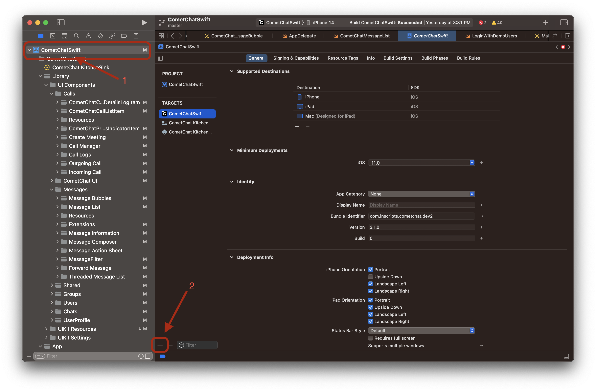
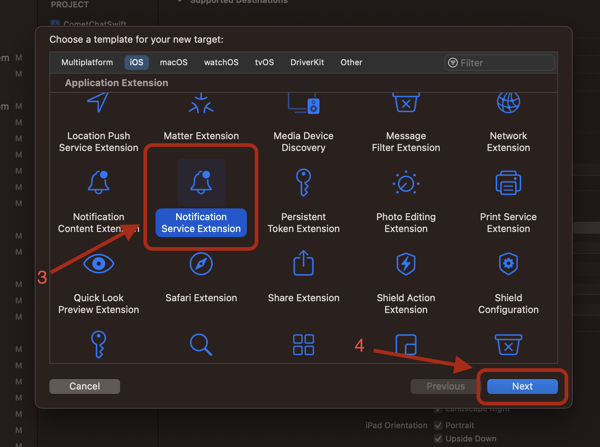
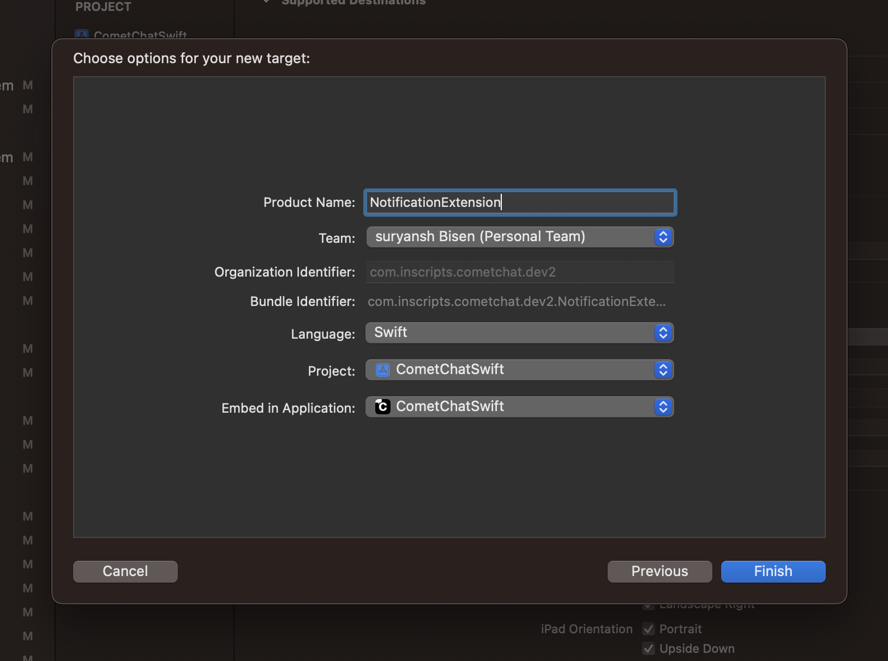
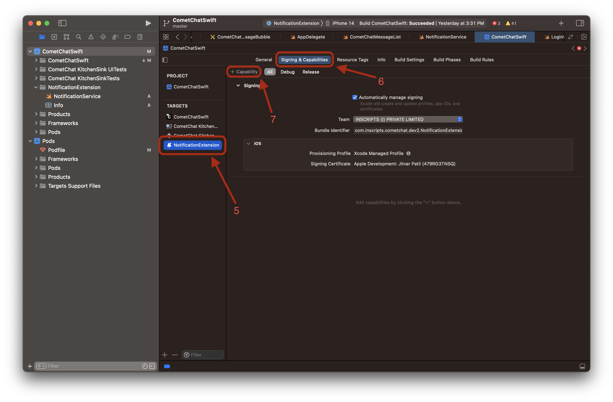
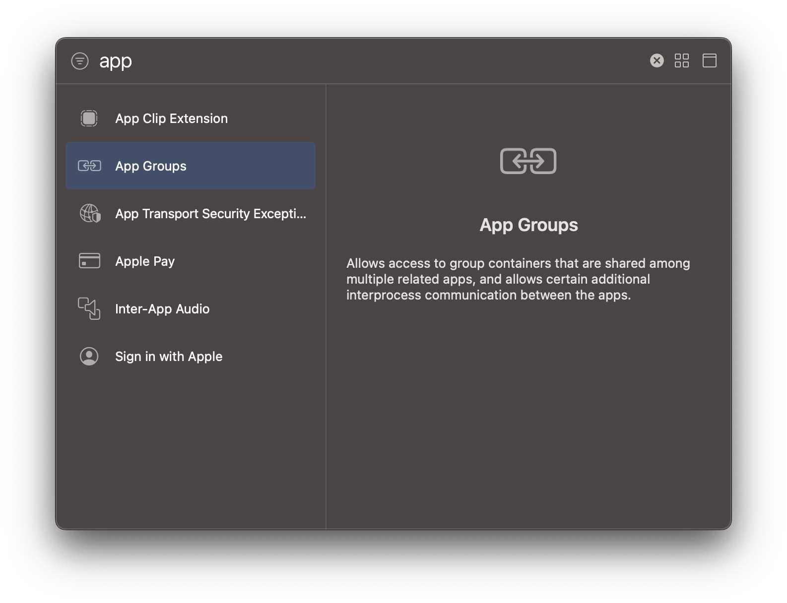
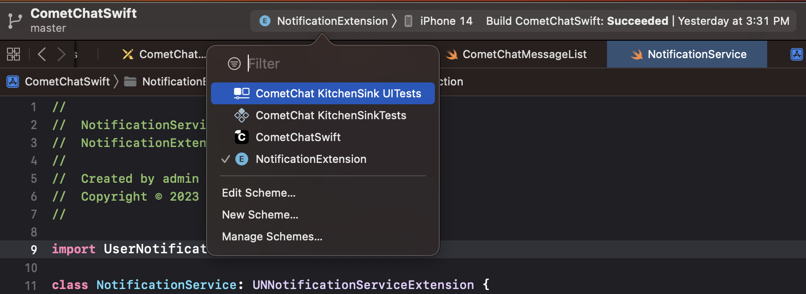

import Tabs from '@theme/Tabs';
import TabItem from '@theme/TabItem';

Implementing the capability to mark a message as "delivered" through a push notification payload can prove to be a pivotal feature. This functionality serves as an accurate representation, confirming to the sender that their message has indeed reached its intended recipient, thereby enhancing the overall user experience.

Setting up Mark as delivered from push notification in iOS requires to have Notification extension to your app project. So let's begin with adding a Notification extension to your app project.

:::info Note
If you already have a Notification extension on your project then you can skip the first part of creating a new extension and use the one you have.
:::

### Setting up Notification extension

1. Navigate to your project’s target section and click on the plus iOS



2. Then Scroll down, select Notification Service Extension and click on the next. 



3. Give it a name and click finish 



- Your notification service extension is ready now, you can see that in the target list. Now we will create app group for the extension. This app group will be needed to share user default between the main application and notification service extension. 

4. Click on the notification service extension name on the target list, then select Signing & Capabilities, then click on “+ Capability” from the top. Make sure All is selected besides it.



5. Then search for App Group and click on it. You can see a section of the app group section must have been added on the ‘Signing & Capabilities’.



6. Select any of the suggested app group ID or you can add your own ID by clicking on the plus icon.  Till this step app group is added on the notification extension target and app group is selected. 


7. Now we will add the Capability of App Group on the main app’s target as well. Just repeat the same steps that you have done on the notification extension(from step 4). You have to select your main app from the target list, then as we did for the notification extension switch to ‘Signing & Capabilities’, then click on “+ Capability” from the top and select App Group.
8. Then select the same group ID that you have selected on the notification extension target’s app group. If it is not there in the suggested IDs, then add it by clicking on the plus icon.

:::info
Make sure the app ID is exactly the same on both the notification extension target and the main app target.
:::

9. Lastly, add CometChatSDK in your notification extension target in the pod file.

<Tabs>
<TabItem value="Swift" label="Swift">

```swift
# Uncomment the next line to define a global platform for your project
# platform :ios, '12.0'

target 'CometChatSwift' do

  pod 'CometChatSDK', '4.0.54'
  pod 'CometChatCallsSDK', '4.0.8'

end

# add your notification extension name here
target 'NotificationExtension' do

  pod 'CometChatSDK', '4.0.54'

end
```
</TabItem>
</Tabs>
All the setup is done, let’s see some code now.

## Code for Mark as read 

1. Firstly navigate to the cometchat initialization code on you project and add the group ID that you have selected on app groups on the AppSettingsBuilder.

<Tabs>
<TabItem value="Swift" label="Swift">

```swift
let appSettings = AppSettings.AppSettingsBuilder()
                .subscribePresenceForAllUsers()
                .setRegion(region: Constants.region)
                .setExtensionGroupID(id: "group.com.comechatcalls.appgroup") //add you app group ID here
                .build()
```
</TabItem>
</Tabs>

2. Now navigate to your notification extension named group that is been created And open its swift file. 
3. Then import CometChatSDK on that file and call these 2 functions on the didReceive(_ request: , withContentHandler: ) function.

<Tabs>
<TabItem value="Swift" label="Swift">

```swift
override func didReceive(_ request: UNNotificationRequest, withContentHandler contentHandler: @escaping (UNNotificationContent) -> Void) {
        self.contentHandler = contentHandler
        bestAttemptContent = (request.content.mutableCopy() as? UNMutableNotificationContent)        

        CometChat.setExtensionGroupID(id: "group.com.comechatcalls.appgroup") //add you group id
    
        if let bestAttemptContent = bestAttemptContent {
            
            CometChat.markAsDelivered(withNotificationPayload: bestAttemptContent.userInfo) //send the payload here
            
            contentHandler(bestAttemptContent)
        }
    }
```
</TabItem>
</Tabs>

And we are finally done, run your notification extension by selecting the notification extension target from the run target on the top.



:::info
Run the main app target first and make sure you are receiving notifications there. And then run the notification extension target.
:::

