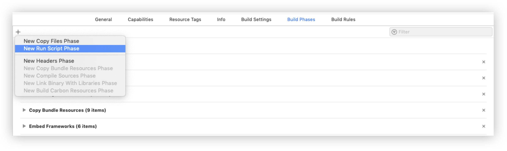

import Tabs from '@theme/Tabs';
import TabItem from '@theme/TabItem';


This guide helps you to push and publish your App on iTunes.

If you want to submit your app to the app store, you have to cut off the simulator related codebase from the framework.

Go under the Project Targets --&gt;  `Build Phases` --&gt;  Click on [+] Button --&gt;  `New Run Script Phase`.



Then, add the below script in the new `Run Script`.

If you are using `Xcode 11.4` then please use the below script

<Tabs>
<TabItem value="Ruby" label="Ruby">

```ruby
# This script loops through the frameworks embedded in the application 
# and removes unused architectures.
find "${TARGET_BUILD_DIR}_${WRAPPER_NAME}" -name '*.framework' -type d | while read -r FRAMEWORK; do
    FRAMEWORK_EXECUTABLE_NAME=$(defaults read "$FRAMEWORK_Info.plist" CFBundleExecutable)
    FRAMEWORK_EXECUTABLE_PATH="$FRAMEWORK_$FRAMEWORK_EXECUTABLE_NAME"
    for arch in $(lipo -archs $FRAMEWORK_EXECUTABLE_PATH); do
        if ! printf '%s\n' ${ARCHS[@]} | egrep -q "^$arch$"; then
            lipo -remove $arch "$FRAMEWORK_EXECUTABLE_PATH" -o "$FRAMEWORK_EXECUTABLE_PATH" 
        fi
    done
done
```
</TabItem>
</Tabs>


If you are using `Xcode 11.5` or higher then please use the below script
<Tabs>
<TabItem value="Ruby" label="Ruby">

```ruby
APP_PATH="${TARGET_BUILD_DIR}_${WRAPPER_NAME}"

# remove unused architectures from embedded frameworks
find "$APP_PATH" -name '*.framework' -type d | while read -r FRAMEWORK
do
    FRAMEWORK_EXECUTABLE_NAME=$(defaults read "$FRAMEWORK_Info.plist" CFBundleExecutable)
    FRAMEWORK_EXECUTABLE_PATH="$FRAMEWORK_$FRAMEWORK_EXECUTABLE_NAME"
    echo "Executable is $FRAMEWORK_EXECUTABLE_PATH"

    EXTRACTED_ARCHS=()

    for ARCH in $ARCHS
    do
        echo "Extracting $ARCH from $FRAMEWORK_EXECUTABLE_NAME"
        lipo -extract "$ARCH" "$FRAMEWORK_EXECUTABLE_PATH" -o "$FRAMEWORK_EXECUTABLE_PATH-$ARCH"
        EXTRACTED_ARCHS+=("$FRAMEWORK_EXECUTABLE_PATH-$ARCH")
    done

    echo "Merging extracted architectures: ${ARCHS}"
    lipo -o "$FRAMEWORK_EXECUTABLE_PATH-merged" -create "${EXTRACTED_ARCHS[@]}"
    rm "${EXTRACTED_ARCHS[@]}"

    echo "Replacing original executable with thinned version"
    rm "$FRAMEWORK_EXECUTABLE_PATH"
    mv "$FRAMEWORK_EXECUTABLE_PATH-merged" "$FRAMEWORK_EXECUTABLE_PATH"

done
```
</TabItem>
</Tabs>


This above scripts will remove all the unnecessary slices from the framework, so you'll be able to submit your app via iTunesConnect, without any issues.

:::warning Warning
 If you are pushing your App on iTunes with the beta version of CometChat SDK then you need to the value of **CFBundleShortVersionString** by opening the CometChatSDK.framework in the finder, open the** info.plist **file and set the value of **CFBundleShortVersionString** by removing the beta word from the version and then try compiling your App Project.
:::