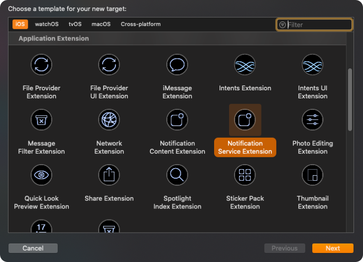
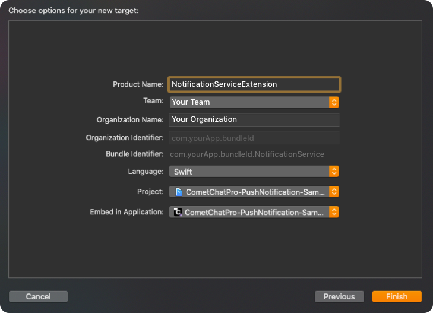
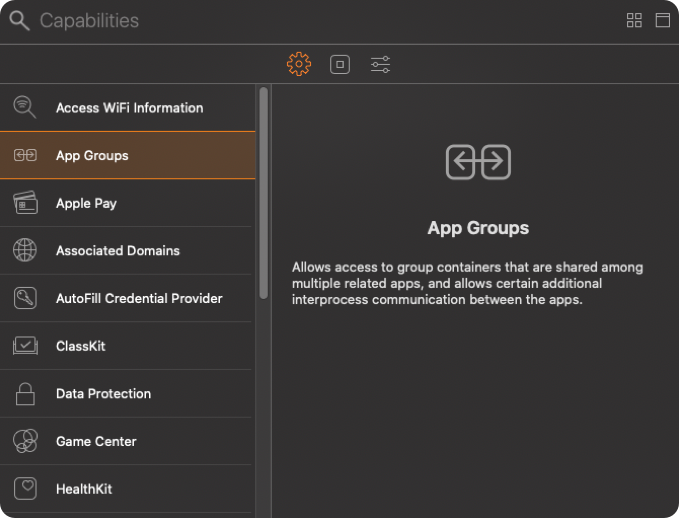
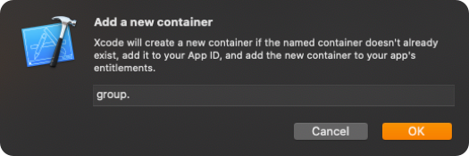
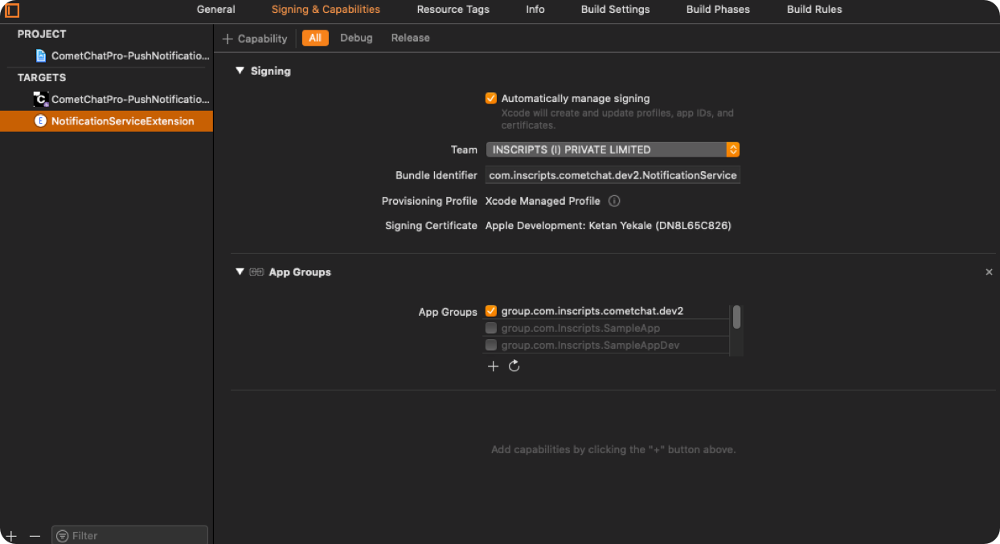

import Tabs from '@theme/Tabs';
import TabItem from '@theme/TabItem';


This guide helps you to set up an incremented badge for the app icon using **Notification Service Extension**.

---

## UNNotificationServiceExtension

This service grabs the data from the push notification payload, the user can modify its content and display the customized data on to the push notification.

In our case, we are modifying the data of the push notification and incrementing the badge count when a new push notification is received.

Let's begin to implement an incremented badge count for your app.

---

### **Step 1: Add UNNotificationServiceExtension inside the app.**

1. Click on `File` --&gt; `New` --&gt; `Targets`  --&gt; `Application Extension` --&gt; `Notification Service Extension`.




2. Add  `Product Name` and click on `Finish`.



---

### **Step 2:  Setup App Groups.**

1 . Click on `Project` --&gt; `Targets` --&gt; `Your app Target`  --&gt; `Signing & Capabilities` --&gt; `[+]` --&gt; `App Groups`.



2. In App Groups, click on `[+]` --&gt; `Add a new container` --&gt;  `Enter group name` --&gt; `OK`.

:::info note
 Kindly, create a group name using the combination of 'group' and 'App's bundle identifier' i.e `group.com.yourApp.bundleId`.
:::



3. Make sure you've selected the app group which you've created earlier. If it is selected then it will look like a below-mentioned image.


4. Click on `Project` --&gt; `Targets` --&gt; `Notification Service Extension Target`  --&gt; `Signing & Capabilities` --&gt; [+] --&gt; `App Groups`.


5. Select the same App Group which you've created in  `Your app Target`.



---

### Step 3:  Setup user suit for storing badge count.

1. Open `AppDelegate.swift` and add below code in `applicationWillEnterForeground(_ application: UIApplication)`.

<Tabs>
<TabItem value="Swift" label="Swift">

```swift
func applicationWillEnterForeground(_ application: UIApplication) {

    UserDefaults(suiteName: "group.com.yourApp.bundleId")?.set(1, forKey: "count") 
    UIApplication.shared.applicationIconBadgeNumber = 0

}
```
</TabItem>
</Tabs>


---

### Step 4:  Setup Notification service extension to increment badge count.

1. Open `NotificationService.swift` and replace the below code in it.

<Tabs>
<TabItem value="Swift" label="Swift">

```swift
import UserNotifications

class NotificationService: UNNotificationServiceExtension {
    
    var contentHandler: ((UNNotificationContent) -> Void)?
    var bestAttemptContent: UNMutableNotificationContent?
    let defaults = UserDefaults(suiteName: "group.com.yourApp.bundleId")
    
    override func didReceive(_ request: UNNotificationRequest, withContentHandler contentHandler: @escaping (UNNotificationContent) -> Void) {
        self.contentHandler = contentHandler
        bestAttemptContent = (request.content.mutableCopy() as? UNMutableNotificationContent)
        var count: Int = defaults?.value(forKey: "count") as! Int
        if let bestAttemptContent = bestAttemptContent {
            bestAttemptContent.title = "\\(bestAttemptContent.title) "
            bestAttemptContent.body = "\\(bestAttemptContent.body) "
            bestAttemptContent.badge = count as? NSNumber
            count = count + 1
            defaults?.set(count, forKey: "count")
            contentHandler(bestAttemptContent)
        }
    }
    
    override func serviceExtensionTimeWillExpire() {
     
        if let contentHandler = contentHandler, let bestAttemptContent =  bestAttemptContent {
            contentHandler(bestAttemptContent)
        }
    }
}
```
</TabItem>
</Tabs>


## Refer Sample App

We have implemented it in our push notification sample app. You can download the sample app.

<a class="button btn btn-primary" href="https://github.com/cometchat-pro-samples/ios-swift-push-notification-app/archive/master.zip">Download Push Notification Sample App </a>

Or else [view it on Githhub](https://github.com/cometchat/cometchat-push-notification-app-ios).

