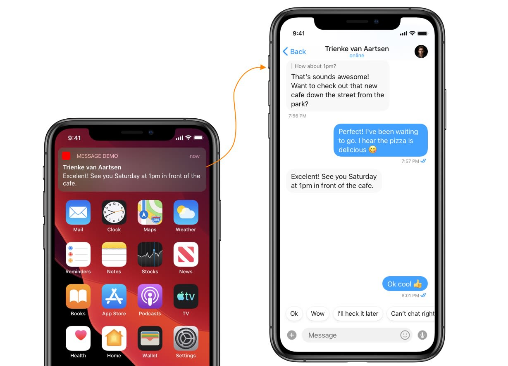

import Tabs from '@theme/Tabs';
import TabItem from '@theme/TabItem';



This guide helps you to launch a chat window from the UI Kit library on receiving a new message notification.


:::tip Note
 CometChat SDK & UI Kit both need to be configured before launching the chat window.
:::
___

## Step 1. Process push notification payload and grab `User` or `Group` object

To present a chat window, firstly you will need a `User` or a `Group` object. You can grab this from the push notification payload itself of incoming message notification.  You need to call `CometChat.processMessage()` method to process push notification payload.


<Tabs>
<TabItem value="Swift" label="Swift">

```swift
 func userNotificationCenter(_ center: UNUserNotificationCenter,
                    didReceive response: UNNotificationResponse,
                    withCompletionHandler completionHandler: @escaping () -> Void) {
        
        if let userInfo = response.notification.request.content.userInfo as? [String : Any], let messageObject = userInfo["message"] as? [String:Any] {
           print("didReceive: \\(userInfo)")
          if let baseMessage = CometChat.processMessage(messageObject).0 {
            switch baseMessage.messageCategory {
            case .message:
                print("Message Object Received: \\(String(describing: (baseMessage as? TextMessage)?.stringValue()))")
                
            case .action: break
            case .call: break
            case .custom: break
            @unknown default: break
            }
          }
        }
        completionHandler()
      }
```
</TabItem>
</Tabs>


## Step 2 . Launch Chat Window

You can launch the chat window from your base view controller after you tap on the Message Notification. This method uses NotificationCenter to trigger and present a chat window.

1. In this method you need to fire notification after you receive the `User` or `Group` Object.
2. In Notification's user info you can pass `User` or` Group` Object to that desired notification.


### Trigger notification from App Delegate

<Tabs>
<TabItem value="Swift" label="Swift">

```swift
if let message = baseMessage as? BaseMessage {
  switch baseMessage.receiverType {
    case .user:
     DispatchQueue.main.asyncAfter(deadline: .now() + 0.5) {
       if let user = baseMessage.sender {
         NotificationCenter.default.post(name: NSNotification.Name(rawValue: "didReceivedMessageFromUser"), object: nil, userInfo: ["user":user])
       }
     }
    case .group:
    DispatchQueue.main.asyncAfter(deadline: .now() + 0.5) {
      if let group = baseMessage.receiver as? Group {
        NotificationCenter.default.post(name: NSNotification.Name(rawValue: "didReceivedMessageFromGroup"), object: nil, userInfo: ["group":group])
       }
      }
    @unknown default: break
  }
}
```
</TabItem>
</Tabs>


3. On the other hand, you need to observe for the above notification in your base view controller.


:::danger note
 1.  Base view controller is a controller that launches immediately after the app delegate.
 2. Base view controller should be present to observe the notification when notification fires.
 3. If the view controller is not present in the memory when a new notification receives, then it won't launch Chat Window.
:::


### Observe notification in Base View Controller


<Tabs>
<TabItem value="Swift" label="Swift">

```swift
class BaseViewController : UIViewController {
  
  override func viewDidLoad() {
   NotificationCenter.default.addObserver(self, selector:#selector(self.didReceivedMessageFromGroup(_:)), name: NSNotification.Name(rawValue: "didReceivedMessageFromGroup"), object: nil)
        NotificationCenter.default.addObserver(self, selector:#selector(self.didReceivedMessageFromUser(_:)), name: NSNotification.Name(rawValue: "didReceivedMessageFromUser"), object: nil)
  }
}
```
</TabItem>
</Tabs>


### Add selector method & Launch Chat Window

<Tabs>
<TabItem value="Swift" label="Swift">

```swift
  @objc func didReceivedMessageFromGroup(_ notification: NSNotification) {
        if let group = notification.userInfo?["group"] as? Group {
            DispatchQueue.main.async {
             let messageList = CometChatMessageList()
             let navigationController = UINavigationController(rootViewController:messageList)
              messageList.set(conversationWith: group, type: .group)
              self.present(navigationController, animated:true, completion:nil)
            }
        }
    }
    
    @objc func didReceivedMessageFromUser(_ notification: NSNotification) {
          print("didReceivedMessageFromUser")
        if let user = notification.userInfo?["user"] as? User {
            DispatchQueue.main.async {
             let messageList = CometChatMessageList()
             let navigationController = UINavigationController(rootViewController:messageList)
              messageList.set(conversationWith: user, type: .user)
              self.present(navigationController, animated:true, completion:nil)
            }
        }
    }
```
</TabItem>
</Tabs>

