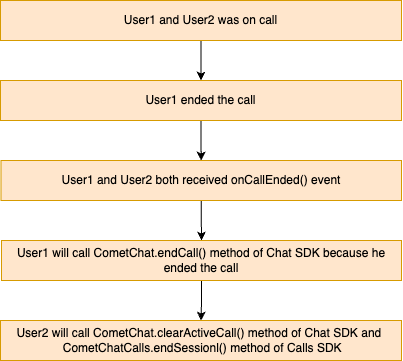

import Tabs from '@theme/Tabs';
import TabItem from '@theme/TabItem';

## Overview

This guide demonstrates how to start call in to an web. Before you begin, we strongly recommend you read the calling setup guide.

## Generate Call Token

Prior to starting the call session, it is necessary to have a call token. A call token can be generated using the `generateToken` method of `CometChatCalls` class.

<Tabs>
<TabItem value="js" label="Javascript">

```javascript
const loggedInUser = await CometChat.getLoggedinUser();
if (loggedInUser) {
  const authToken = loggedInUser.getAuthToken();
  const sessionID = "SESSION_ID_HERE";

  CometChatCalls.generateToken(sessionID, authToken).then(
    (res) => {
      console.log("Call token fetched: ", res.token);
    },
    (err) => {
      console.log("Generating call token failed with error: ", err);
    }
  );
}
```

</TabItem>
<TabItem value="ts" label="Typescript">

```typescript
const loggedInUser = await CometChat.getLoggedinUser();
if (loggedInUser) {
  const authToken = loggedInUser.getAuthToken();
  const sessionID = "SESSION_ID_HERE";

  CometChatCalls.generateToken(sessionID, authToken).then(
    (res) => {
      console.log("Call token fetched: ", res.token);
    },
    (err) => {
      console.log("Generating call token failed with error: ", err);
    }
  );
}
```

</TabItem>
</Tabs>

| Parameter | Description                                                                                                                             |
| --------- | --------------------------------------------------------------------------------------------------------------------------------------- |
| sessionID | A unique random session ID. In case you are using default call then session ID is available in the `Call` object.                       |
| authToken | The user auth token is logged in user auth token which you can get by calling CometChat's Chat SDK method `CometChat.getLoggedinUser()` |

<br/>

| Error Code                 | Error Message                                                                                                                                                        |
| -------------------------- | -------------------------------------------------------------------------------------------------------------------------------------------------------------------- |
| INVALID_ARGUMENT_EXCEPTION | If you pass invalid param to a function or you don't pass the required params. example: Authtoken and session are required, Invalid callToken passed, please verify. |

On success of `generateToken` method you will get the response object containing call token with key named `token`.

## Start Call Session

The most important class that will be used in the implementation is the `CallSettings` class. This class allows you to set the various parameters for the call/conference. In order to set the various parameters of the `CallSettings` class, you need to use the `CallSettingsBuilder` class. Below are the various options available with the `CallSettings` class.

The **mandatory** parameters that are required to be present for any call/conference to work are:

1. **callToken:** The unique token for the call/conference session.
2. **callSettings:** The object of CallSettings class.
3. **htmlElement:** A unique DOM element inside which call UI will be loaded.

A basic example of how to start a call session:

<Tabs>
<TabItem value="js" label="Javascript">

```javascript
const defaultLayout = true;
const audioOnly = false;

const callSettings = new CometChatCalls.CallSettingsBuilder()
  .enableDefaultLayout(defaultLayout)
  .setIsAudioOnlyCall(audioOnly)
  .setCallListener(
    new CometChatCalls.OngoingCallListener({
      onUserListUpdated: (userList) => {
        console.log("user list:", userList);
      },
      onCallEnded: () => {
        console.log("Call ended");
      },
      onError: (error) => {
        console.log("Error :", error);
      },
      onMediaDeviceListUpdated: (deviceList) => {
        console.log("Device List:", deviceList);
      },
      onUserMuted: (event) => {
        // This event will work in JS SDK v3.0.2-beta1 & later.
        console.log("Listener => onUserMuted:", {
          userMuted: event.muted,
          userMutedBy: event.mutedBy,
        });
      },
      onScreenShareStarted: () => {
        // This event will work in JS SDK v3.0.3 & later.
        console.log("Screen sharing started.");
      },
      onScreenShareStopped: () => {
        // This event will work in JS SDK v3.0.3 & later.
        console.log("Screen sharing stopped.");
      },
      onCallSwitchedToVideo: (event) => {
        // This event will work in JS SDK v3.0.8 & later.
        console.log("call switched to video:", {
          sessionId: event.sessionId,
          callSwitchInitiatedBy: event.initiator,
          callSwitchAcceptedBy: event.responder,
        });
      },
      onUserJoined: (user) => console.log("event => onUserJoined", user),
      onUserLeft: (user) => console.log("event => onUserLeft", user),
    })
  )
  .build();

const htmlElement = document.getElementById("ELEMENT_ID");
CometChatCalls.startSession(callToken, callSettings, htmlElement);
```

</TabItem>
<TabItem value="ts" label="Typescript">

```typescript
const defaultLayout = true;
const audioOnly = false;

const callSettings = new CometChatCalls.CallSettingsBuilder()
  .enableDefaultLayout(defaultLayout)
  .setIsAudioOnlyCall(audioOnly)
  .setCallListener(
    new CometChatCalls.OngoingCallListener({
      onUserListUpdated: (userList) => {
        console.log("user list:", userList);
      },
      onCallEnded: () => {
        console.log("Call ended");
      },
      onError: (error) => {
        console.log("Error :", error);
      },
      onMediaDeviceListUpdated: (deviceList) => {
        console.log("Device List:", deviceList);
      },
      onUserMuted: (event) => {
        // This event will work in JS SDK v3.0.2-beta1 & later.
        console.log("Listener => onUserMuted:", {
          userMuted: event.muted,
          userMutedBy: event.mutedBy,
        });
      },
      onScreenShareStarted: () => {
        // This event will work in JS SDK v3.0.3 & later.
        console.log("Screen sharing started.");
      },
      onScreenShareStopped: () => {
        // This event will work in JS SDK v3.0.3 & later.
        console.log("Screen sharing stopped.");
      },
      onCallSwitchedToVideo: (event) => {
        // This event will work in JS SDK v3.0.8 & later.
        console.log("call switched to video:", {
          sessionId: event.sessionId,
          callSwitchInitiatedBy: event.initiator,
          callSwitchAcceptedBy: event.responder,
        });
      },
      onUserJoined: (user) => console.log("event => onUserJoined", user),
      onUserLeft: (user) => console.log("event => onUserLeft", user),
    })
  )
  .build();

const htmlElement = document.getElementById("ELEMENT_ID");
CometChatCalls.startSession(callToken, callSettings, htmlElement);
```

</TabItem>
</Tabs>

The `setIsAudioOnlyCall()` method allows you to set if the call is supposed to be an audio call or an audio-video call. If set to true, the call will be an audio-only call else when set to false the call will be an audio-video call. The default is false, so if not set, the call will be an audio-video call.

| Parameter      | Description                                                                                                                  |
| -------------- | ---------------------------------------------------------------------------------------------------------------------------- |
| `callToken`    | An authorization token used to start the call session, received by calling `generateToken` method of `CometChatCalls` class. |
| `callSettings` | Object of `CallSettings` class.                                                                                              |
| `htmlElement`  | DOM element inside which the call UI wll be rendered.                                                                        |

<br/>

| Error Code                       | Error Messages                                                                                                                             |
| -------------------------------- | ------------------------------------------------------------------------------------------------------------------------------------------ |
| INVALID_PROP_EXCEPTION           | if you pass an invalid prop to a functional component or you don't pass the required prop. example: Component requires valid call settings |
| API_ERROR                        | If there is some error thrown by the API server For example unauthorized                                                                   |
| UNKNOWN_API_ERROR                | If there is some API error but it didn't come from the server. For example if internet is not available and API is called.                 |
| AUTH_ERR_TOKEN_INVALID_SIGNATURE | if Token is invalid                                                                                                                        |

The `OngoingCallListener` listener provides you with the below callback methods:

| Callback Method                        | Description                                                                                                                                                        |
| -------------------------------------- | ------------------------------------------------------------------------------------------------------------------------------------------------------------------ |
| `onUserJoined(user)`                   | This method is called when any other user joins the call. The user details can be obtained from the `user` object provided.                                        |
| `onUserLeft(user)`                     | This method is called when a user leaves the call. The details of the user can be obtained from the provided `user` object.                                        |
| `onError()`                            | This method is called when there is some error in establishing the call.                                                                                           |
| `onCallEnded()`                        | This method is called when the call is successfully ended. The call details can be obtained from the `Call` object provided.                                       |
| `onUserListUpdated(userList)`          | This method is triggered every time a participant joins or leaves the call providing the list of users active in the call.                                         |
| `onMediaDeviceListUpdated(deviceList)` | This method is triggered if any new audio output source is available or becomes unavailable.                                                                       |
| `onUserMuted(event)`                   | This method is triggered when a user is muted in the ongoing call. The event object contains two keys named `muted` and `mutedBy`                                  |
| `onScreenShareStarted()`               | This method is triggered when the local user starts sharing a screen.                                                                                              |
| `onScreenShareStopped()`               | This method is triggered when the local user stops sharing a screen.                                                                                               |
| `onCallSwitchedToVideo(event)`         | This callback is triggered when an audio call is converted into a video call. The event object contains three keys named `sessionId` , `initiator` and `responder` |

## Listener

Listeners can be added in two ways the first one is to use `.setCallEventListener(listeners : OngoingCallListener)` method in `CallSettingsBuilder` or `PresenterSettingsBuilder` class. The second way is to use `CometChatCalls.addCallEventListener(name: string, callListener: OngoingCallListener)` by this you can add multiple listeners and remove the specific listener by their name `CometChatCalls.removeCallEventListener(name: string)`

<Tabs>
<TabItem value="js" label="Javascript">

```javascript
useEffect(() => {
  CometChatCalls.addCallEventListener("UNIQUE_ID", {
    onUserJoined: (user) => {
      console.log("user joined:", user);
    },
    onUserLeft: (user) => {
      console.log("user left:", user);
    },
    onUserListUpdated: (userList) => {
      console.log("user list:", userList);
    },
    onCallEnded: () => {
      console.log("Call ended");
    },
    onCallEndButtonPressed: () => {
      console.log("End Call button pressed");
    },
    onError: (error) => {
      console.log("Call Error: ", error);
    },
    onAudioModesUpdated: (audioModes) => {
      console.log("audio modes:", audioModes);
    },
    onUserMuted: (event) => {
      console.log("user muted:", event);
    },
  });
  return () => CometChatCalls.removeCallEventListener("UNIQUE_ID");
}, []);
```

</TabItem>
</Tabs>

## End Call Session

To release the acquired calling resource and end the call, the end call session must be called.

For Default Call<br/>
:::info
You only need to call the end call method of the chat SDK for default calling flows. Direct calling flows do not require it.
:::
To end a call in the default call flow, you must call the CometChat.endCall() method, which belongs to the CometChat Chat SDK, and the CometChatCalls.endSession() method, which belongs to the CometChat Calls SDK.<br/>

The user who pressed the end call button will call the CometChat.endCall() method, and the another user how was on call will call the two methods which is CometChat.clearActiveCall() and CometChatCalls.endSession() methods to release the calling resources

<br/>



<br/>

The user who ended the call

<Tabs>
<TabItem value="js" label="Javascript">

```javascript
CometChat.endCall();
```

</TabItem>
<TabItem value="ts" label="Typescript">

```typescript
CometChat.endCall();
```

</TabItem>
</Tabs>

The another user who was on call

<Tabs>
<TabItem value="js" label="Javascript">

```javascript
CometChat.clearActiveCall();
CometChatCalls.endSession();
```

</TabItem>
<TabItem value="ts" label="Typescript">

```typescript
CometChat.clearActiveCall();
CometChatCalls.endSession();
```

</TabItem>
</Tabs>

### For Direct Call

<Tabs>
<TabItem value="js" label="Javascript">

```javascript
CometChatCalls.endSession();
```

</TabItem>
<TabItem value="ts" label="Typescript">

```typescript
CometChatCalls.endSession();
```

</TabItem>
</Tabs>

## Settings

The `CallSettings` class is the most important class when it comes to the implementation of the Calling feature. This is the class that allows you to customise the overall calling experience. The properties for the call/conference can be set using the `CallSettingsBuilder` class. This will eventually give you an object of the `CallSettings` class which you can pass to the `startSession()` method to start the call.

The options available for customisation of calls are:

| Setting                                                                      | Description                                                                                                                                                                                                         |
| ---------------------------------------------------------------------------- | ------------------------------------------------------------------------------------------------------------------------------------------------------------------------------------------------------------------- |
| `enableDefaultLayout(defaultLayout: boolean)`                                | If set to `true` enables the default layout for handling the call operations. <br/>If set to `false` it hides the button layout and just displays the Call View.<br/>**Default value = true**                       |
| `showEndCallButton(showEndCallButton: boolean)`                              | If set to `true` it displays the EndCallButton in Button Layout. <br/>if set to `false` it hides the EndCallButton in Button Layout.<br/>**Default value = true**                                                   |
| `showPauseVideoButton(showPauseVideoButton: boolean)`                        | If set to `true` it displays the PauseVideoButton in Button Layout. <br/>if set to `false` it hides the PauseVideoButton in Button Layout.<br/>**Default value = true**                                             |
| `showMuteAudioButton(showMuteAudioButton: boolean)`                          | If set to `true` it displays the MuteAudioButton in Button Layout. <br/>if set to `false` it hides the MuteAudioButton in Button Layout.<br/>**Default value = true**                                               |
| `showScreenShareButton(showScreenShareButton: boolean)`                      | If set to `true` it displays the ShareScreenButton in Button Layout. <br/>if set to `false` it hides the ShareScreenButton in Button Layout.<br/>**Default value = true**                                           |
| `showModeButton(showModeButton: boolean)`                                    | If set to `true` it displays the ShowModeButton in Button Layout. <br/>if set to `false` it hides the ShowModeButton in Button Layout.<br/>**Default value = true**                                                 |
| `setIsAudioOnlyCall(audioOnly: boolean)`                                     | If set to true, the call will be strictly an audio call. If set to false, the call will be an audio-video call.<br/>**Default value = false**                                                                       |
| `setMode(mode: string)`                                                      | CometChat provides 2 options for the calling UI.<br/>1. `CometChat.CALL_MODE.DEFAULT`<br/>2. `CometChat.CALL_MODE.SPOTLIGHT` <br/> **Default value = CometChat.CALL_MODE.DEFAULT**                                  |
| `startWithAudioMuted(audioMuted: boolean)`                                   | This ensures the call is started with the audio muted if set to true.<br/>**Default value = false**                                                                                                                 |
| `startWithVideoMuted(videoMuted: boolean)`                                   | This ensures the call is started with the video paused if set to true.<br/>**Default value = false**                                                                                                                |
| `showSwitchToVideoCallButton(switchCall: boolean)`                           | This method shows/hides the switch to video call button. If set to true it will display the switch to video call button. If set to false it will hide the switch to video call button.<br/>**Default value = true** |
| `setMainVideoContainerSetting(containerSettings: MainVideoContainerSetting)` | This method can be used to customize the main video container. You can read more about this [here](./video-view-customisation).                                                                                     |

In case you wish to achieve a completely customized UI for the Calling experience, you can do so by embedding default android buttons to the screen as per your requirement and then use the below methods to achieve different functionalities for the embedded buttons.

For the use case where you wish to align your own custom buttons and not use the default layout provided by CometChat, you can embed the buttons in your layout and use the below methods to perform the corresponding operations:

### Mute Audio

You can call the `muteAudio(mute: boolean)` method to mute/unmute your audio stream.

<Tabs>
<TabItem value="js" label="Javascript">

```javascript
CometChatCalls.muteAudio(true);
```

</TabItem>
<TabItem value="ts" label="Typescript">

```typescript
CometChatCalls.muteAudio(true);
```

</TabItem>
</Tabs>

If set to `true` the audio stream will be muted and if set to `false` the audio stream will be unmuted.

### Pause Video

You can call the `pauseVideo(pause: boolean)` method to pause/unpause video stream.

<Tabs>
<TabItem value="js" label="Javascript">

```javascript
CometChatCalls.pauseVideo(true);
```

</TabItem>
<TabItem value="ts" label="Typescript">

```typescript
CometChatCalls.pauseVideo(true);
```

</TabItem>
</Tabs>

If set to `true` the video stream will be paused and if set to `false` the video stream will be unpaused.

### Start Screen Share

You can call `startScreenShare()` to start the screen share.

<Tabs>
<TabItem value="js" label="Javascript">

```javascript
CometChatCalls.startScreenShare();
```

</TabItem>
<TabItem value="ts" label="Typescript">

```typescript
CometChatCalls.startScreenShare();
```

</TabItem>
</Tabs>

### Stop Screen Share

You can call `stopScreenShare()` to stop the screen share.

<Tabs>
<TabItem value="js" label="Javascript">

```javascript
CometChatCalls.stopScreenShare();
```

</TabItem>
<TabItem value="ts" label="Typescript">

```typescript
CometChatCalls.stopScreenShare();
```

</TabItem>
</Tabs>

### Set Mode

You can use the `setMode(mode: string)` method to set the mode.

<Tabs>
<TabItem value="js" label="Javascript">

```javascript
let mode = CometChat.CALL_MODE.SPOTLIGHT;
CometChatCalls.setMode(mode);
```

</TabItem>
<TabItem value="ts" label="Typescript">

```typescript
let mode = CometChat.CALL_MODE.SPOTLIGHT;
CometChatCalls.setMode(mode);
```

</TabItem>
</Tabs>

### Get Audio Input Devices

You can use the `getAudioInputDevices()` method to get all the available audio input devices.

<Tabs>
<TabItem value="js" label="Javascript">

```javascript
let audioInputDevices = CometChatCalls.getAudioInputDevices();
```

</TabItem>
<TabItem value="ts" label="Typescript">

```typescript
let audioInputDevices = CometChatCalls.getAudioInputDevices();
```

</TabItem>
</Tabs>

### Get Audio Output Devices

You can use the `getAudioOutputDevices()` method to get all the available audio output devices.

<Tabs>
<TabItem value="js" label="Javascript">

```javascript
let audioOutputDevices = CometChatCalls.getAudioOutputDevices();
```

</TabItem>
<TabItem value="ts" label="Typescript">

```typescript
let audioOutputDevices = CometChatCalls.getAudioOutputDevices();
```

</TabItem>
</Tabs>

### Get Video Input Devices

You can use the `getVideoInputDevices()` method to get all the available video input devices.

<Tabs>
<TabItem value="js" label="Javascript">

```javascript
let videoInputDevices = CometChatCalls.getVideoInputDevices();
```

</TabItem>
<TabItem value="ts" label="Typescript">

```typescript
let videoInputDevices = CometChatCalls.getVideoInputDevices();
```

</TabItem>
</Tabs>

### Set Audio Input Device

You can use the `setAudioInputDevice(deviceId)` method to set the active audio input device.

<Tabs>
<TabItem value="js" label="Javascript">

```javascript
CometChatCalls.setAudioInputDevice(deviceId);
```

</TabItem>
<TabItem value="ts" label="Typescript">

```typescript
CometChatCalls.setAudioInputDevice(deviceId);
```

</TabItem>
</Tabs>

### Set Audio Output Device

You can use the `setAudioOutputDevice(deviceId)` method to set the active audio output device.

<Tabs>
<TabItem value="js" label="Javascript">

```javascript
CometChatCalls.setAudioOutputDevice(deviceId);
```

</TabItem>
<TabItem value="ts" label="Typescript">

```typescript
CometChatCalls.setAudioOutputDevice(deviceId);
```

</TabItem>
</Tabs>

### Set Video Input Device

You can use the `setVideoInputDevice(deviceId)` method to set the active video input device.

<Tabs>
<TabItem value="js" label="Javascript">

```javascript
CometChatCalls.setVideoInputDevice(deviceId);
```

</TabItem>
<TabItem value="ts" label="Typescript">

```typescript
CometChatCalls.setVideoInputDevice(deviceId);
```

</TabItem>
</Tabs>

### Switch To Video Call

You can use the `switchToVideoCall()` method to switch from audio call to video call.
