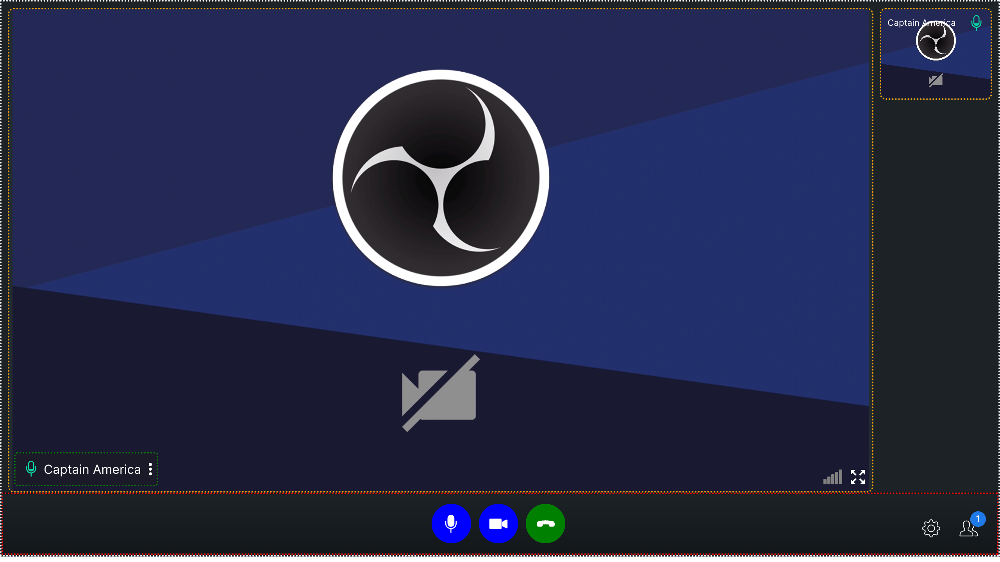
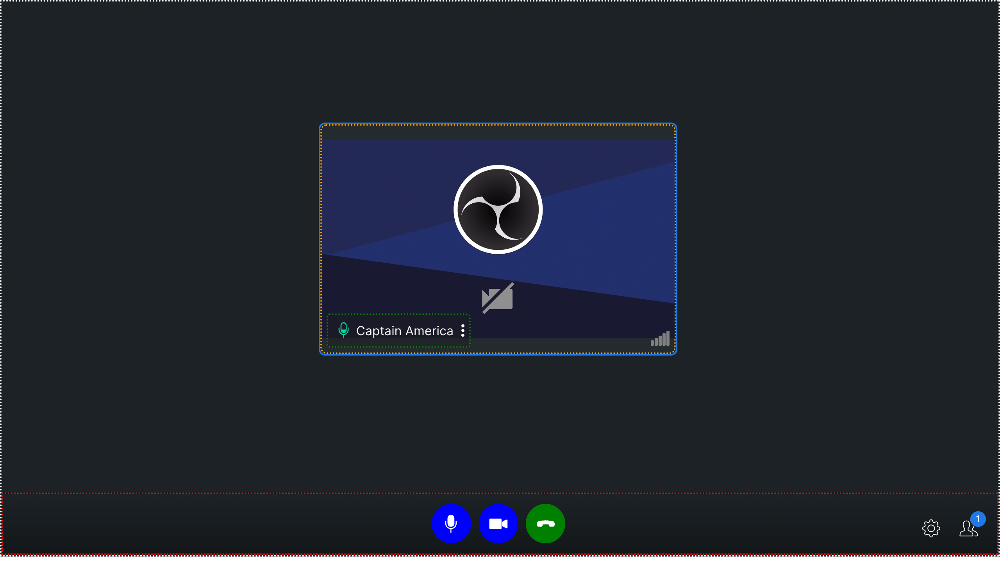
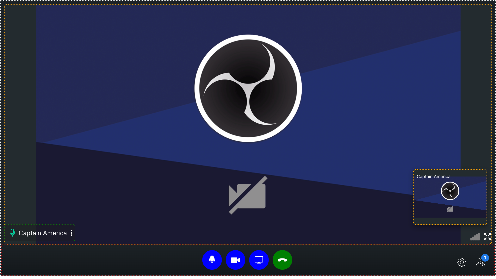
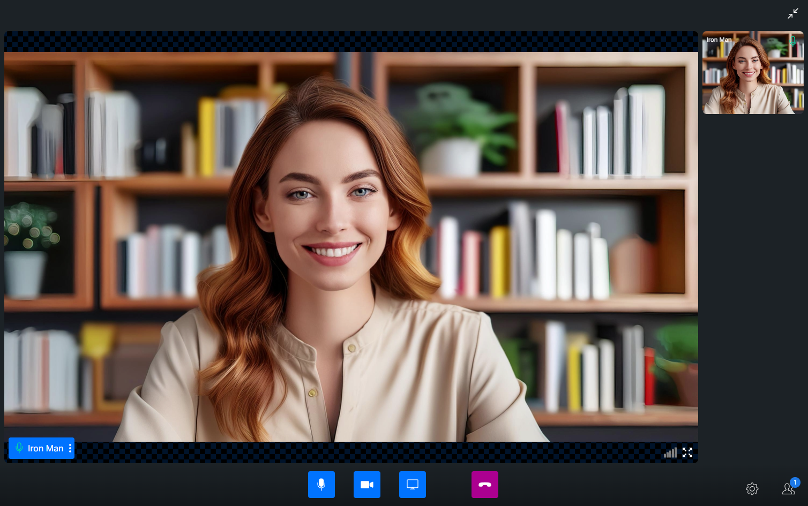

import Tabs from '@theme/Tabs';
import TabItem from '@theme/TabItem';

Passing custom CSS allows you to personalize and enhance the user interface of the call screen.

## Common CSS Classes

There are a few common classes used for different modes in the call screen

1. **cc-main-container** - The outermost component of the calling component is represented by a white border in the screenshots above, indicating that it acts as a container for other components.

2. **cc-bottom-buttons-container** - The container located at the very bottom of the interface houses various action buttons, such as the mute/unmute audio and video, end call, settings icon, and participants icon, among others. It is represented by the red border in above screenshot.

3. **cc-name-label** - This class is passed in user name text container in all modes. It is represented by green border in the above screenshots.

4. **cc-video-container** - This class is passed to the video container in all modes. It is represented by orange border in the above screenshots.

## Bottom Buttons

1. **cc-bottom-buttons-container** - This is the container of all the buttons in calling.
2. **cc-bottom-buttons-icon-container** - This is the div of every button in the button bar.

### Individual bottom buttons CSS classes

- `cc-audio-icon-container`
- `cc-audio-icon-container-muted`
- `cc-video-icon-container`
- `cc-video-icon-container-muted`
- `cc-screen-share-icon-container`
- `cc-switch-video-icon-container`
- `cc-end-call-icon-container`

### **Example**

<Tabs>
<TabItem value="CSS" label="CSS">

```css
.cc-end-call-icon-container {
  background-color: green;
}
.cc-audio-icon-container {
  background-color: blue;
}
.cc-video-icon-container {
  background-color: blue;
}
.cc-audio-icon-container-muted {
  background-color: orange;
}
.cc-video-icon-container-muted {
  background-color: orange;
}
.cc-switch-video-icon-container {
  background-color: blue;
}
.cc-screen-share-icon-container {
  background-color: blue;
}
.cc-main-container {
  border: 2px dotted white;
}
.cc-video-container {
  border: 2px dotted orange;
}
.cc-bottom-buttons-container {
  border: 2px dotted red;
}
.cc-name-label {
  border: 2px dotted green;
}
```

</TabItem>
</Tabs>

The above example results in the below output:-

**Mode: `DEFAULT`**



**Mode: `TILE`**



**Mode: `SPOTLIGHT`**



<Tabs>
<TabItem value="CSS" label="CSS">

```css
.cc-bottom-buttons-icon-container {
  height: 50px !important;
  width: 50px !important;
}

.cc-audio-icon-container {
  background-color: #0073ff !important;
  border-radius: 4px !important;
}

.cc-video-icon-container {
  background-color: #0073ff !important;
  border-radius: 4px !important;
}

.cc-screen-share-icon-container {
  background-color: #0073ff !important;
  border-radius: 4px !important;
}

.cc-end-call-icon-container {
  background-color: #ab0090 !important;
  border-radius: 4px !important;
  margin-left: 50px !important;
}

.cc-bottom-buttons.cc-bottom-buttons-container {
  gap: 25px !important;
}

.side-bar-main-user-video video {
  background-color: black !important;
  background-image: repeating-conic-gradient(
    #0073ff2a 0% 25%,
    #00000031 0% 50%
  ) !important;
  background-position: 0 0, 10px 10px !important;
  background-size: 20px 20px !important;
}

.cc-name-label {
  background-color: #0073ff !important;
}

.bottom-buttons-other-options {
  gap: 20px !important;
}
```

</TabItem>
</Tabs>

The above example results in the below output:-



### Guidelines for Customizing the Grid Layout

- **CSS Classes:**

  - Please ensure that you only apply CSS classes specified in this documentation. Introducing CSS classes not covered here may cause unexpected UI issues.

- **Grid Container Resizing:**
  - Avoid resizing the grid container. Altering the grid container’s dimensions can negatively impact the grid layout, leading to undesirable visual distortions.

By following these recommendations, you can maintain a stable and visually consistent grid layout.
