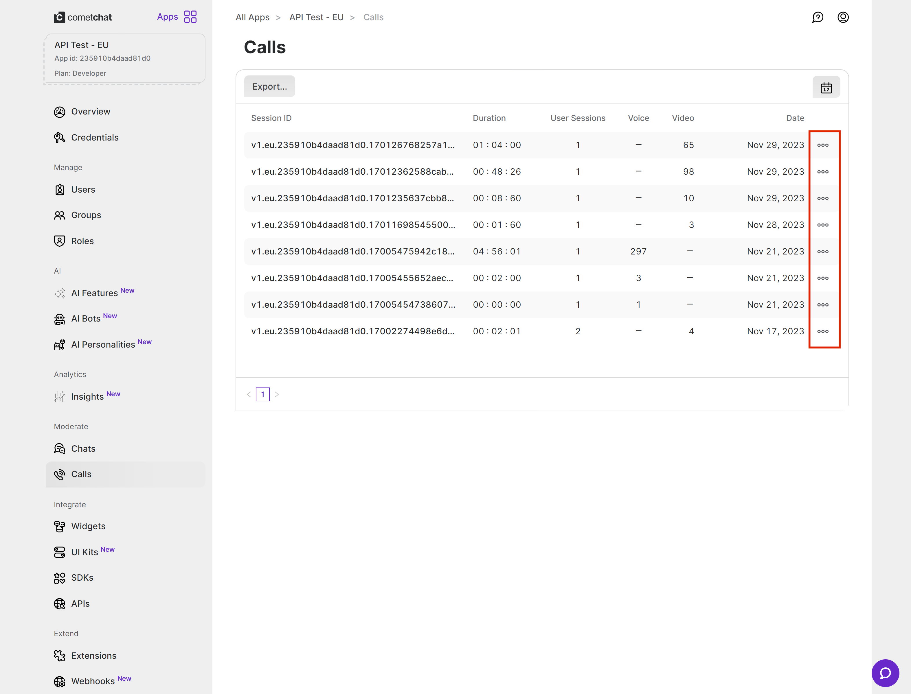
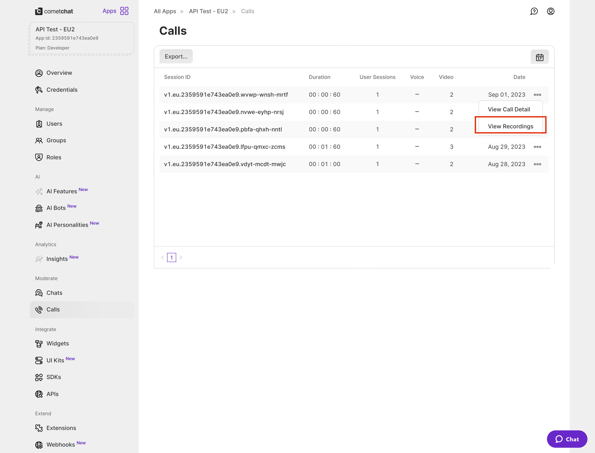
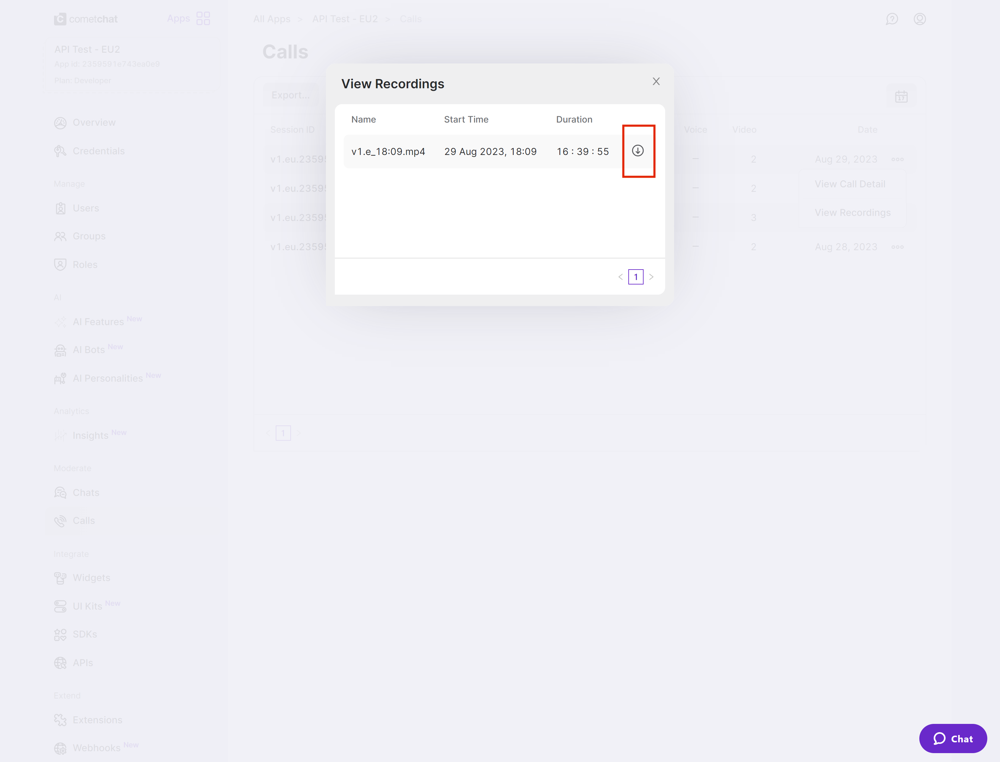

import Tabs from '@theme/Tabs';
import TabItem from '@theme/TabItem';

This section will guide you to implement call recording feature for the voice and video calls.

## Implementation

Once you have decided to implement [Default Calling](default-call) or [Direct Calling](direct-call) and followed the steps to implement them. Just few additional listeners and methods will help you quickly implement call recording in your app.

You need to make changes in the `CometChatCalls.OngoingCallListener` constructor and add the required listeners for recording. Please make sure your callSettings is configured accordingly for [Default Calling](default-call) or [Direct Calling](direct-call).

A basic example of how to make changes to implement recording for a direct call/ a default call:

<Tabs>
<TabItem value="Javascript" label="Javascript">

```javascript
// Add listeners onRecordingStarted and onRecordingStopped to the startSession method
const audioOnly = false;
const deafaultLayout = true;

const callListener = new CometChatCalls.OngoingCallListener({
  onRecordingStarted: recordingStartedBy => {
      // This event will work in JS SDK v3.0.8 & later.
      console.log("Listener => onRecordingStarted:", recordingStartedBy);
  },
  onRecordingStopped: recordingStoppedBy => {
      // This event will work in JS SDK v3.0.8 & later.
      console.log("Listener => onRecordingStopped:", recordingStoppedBy);
  },
});

const callSettings = new CometChatCalls.CallSettingsBuilder()
  .enableDefaultLayout(deafaultLayout)
  .setIsAudioOnlyCall(audioOnly)
  .setCallEventListener(callListener)
  .build();

render(){
 return(
    <View style={{height: '100%', width: '100%', position: 'relative'}}>
				<CometChatCalls.Component callSettings={callSettings} callToken={callToken} />
    </View>
 );
}
```

</TabItem>
<TabItem value="Typescript" label="Typescript">

```typescript
// Add listeners onRecordingStarted and onRecordingStopped to the startCall method
const audioOnly = false;
const deafaultLayout = true;

const callListener = new CometChatCalls.OngoingCallListener({
  onRecordingStarted: recordingStartedBy => {
      // This event will work in JS SDK v3.0.8 & later.
      console.log("Listener => onRecordingStarted:", recordingStartedBy);
  },
  onRecordingStopped: recordingStoppedBy => {
      // This event will work in JS SDK v3.0.8 & later.
      console.log("Listener => onRecordingStopped:", recordingStoppedBy);
  },
});

const callSettings = new CometChatCalls.CallSettingsBuilder()
  .enableDefaultLayout(deafaultLayout)
  .setIsAudioOnlyCall(audioOnly)
  .setCallEventListener(callListener)
  .build();

render(){
 return(
    <View style={{height: '100%', width: '100%', position: 'relative'}}>
				<CometChatCalls.Component callSettings={callSettings} callToken={callToken} />
    </View>
 );
}
```

</TabItem>
</Tabs>

## Settings for call recording

The `CallSettings` class allows you to customise the overall calling experience. The properties for the call/conference can be set using the `CallSettingsBuilder` class. This will eventually give you and object of the `CallSettings` class which you can pass to the `startSession()` method to start the call.

The options available for recording of calls are:

| Setting                                                         | Description                                                                                                                                                                                  |
| --------------------------------------------------------------- | -------------------------------------------------------------------------------------------------------------------------------------------------------------------------------------------- |
| `showRecordingButton(showRecordingButton: boolean)`             | If set to `true` it displays the Recording button in the button Layout.<br/>if set to `false` it hides the Recording button in the button Layout.<br/>**Default value = false**              |
| `startRecordingOnCallStart(startRecordingOnCallStart: boolean)` | If set to `true` call recording will start as soon as the call is started.<br/>if set to `false` call recording will not start as soon as the call is started.<br/>**Default value = false** |

For the use case where you wish to align your own custom buttons and not use the default layout provided by CometChat, you can embed the buttons in your layout and use the below methods to perform the corresponding operations:

### Start Recording

You can use the `startRecording()` method to start call recording.

<Tabs>
<TabItem value="Javascript" label="Javascript">

```javascript
CometChatCalls.startRecording();
```

</TabItem>
<TabItem value="Typescript" label="Typescript">

```typescript
CometChatCalls.startRecording();
```

</TabItem>
</Tabs>

### Stop Recording

You can use the `stopRecording()` method to stop call recording.

<Tabs>
<TabItem value="Javascript" label="Javascript">

```javascript
CometChatCalls.stopRecording();
```

</TabItem>
<TabItem value="Typescript" label="Typescript">

```typescript
CometChatCalls.stopRecording();
```

</TabItem>
</Tabs>

## Downloading Recording

Currently, the call recordings are available on the [CometChat Dashboard](https://app.cometchat.com) under the Calls Section. You can refer to the below screenshot.




