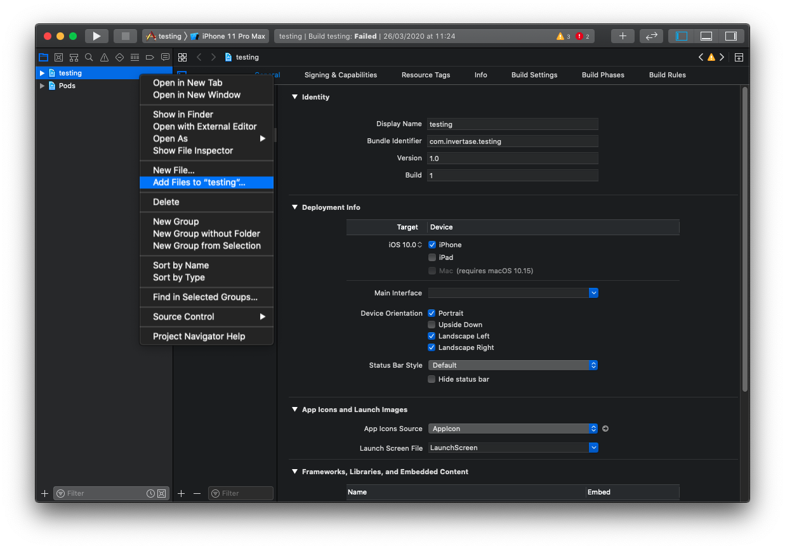
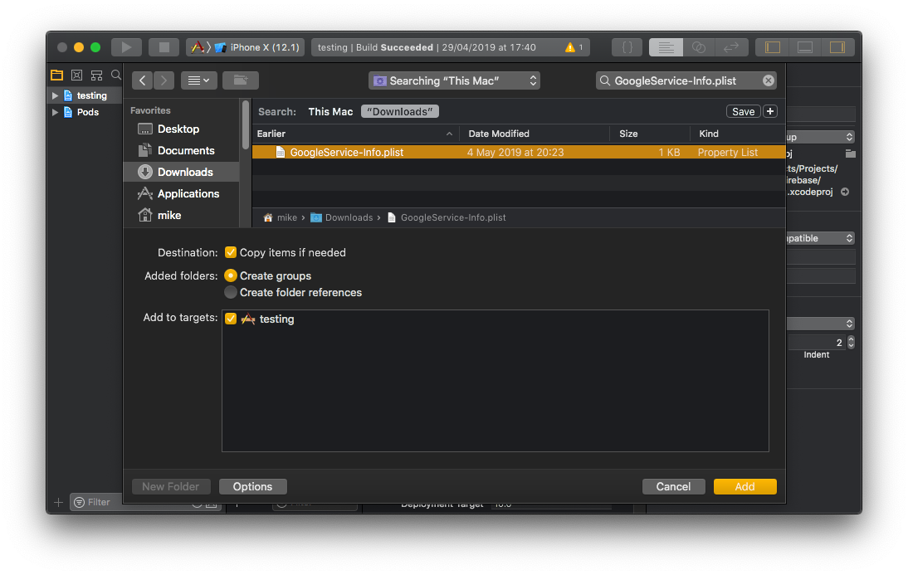

import Tabs from '@theme/Tabs';
import TabItem from '@theme/TabItem';

## Installation

Install the react-native-firebase package in your project.

Using NPM:

<Tabs>
<TabItem value="Javascript" label="Javascript">

  ```javascript
npm install @react-native-firebase/app @react-native-firebase/messaging
  ```
</TabItem>
</Tabs>


Using Yarn:

<Tabs>
<TabItem value="Javascript" label="Javascript">

  ```javascript
yarn add @react-native-firebase/app @react-native-firebase/messaging
  ```
</TabItem>
</Tabs>


## Android Setup

To allow the Android app to securely connect to your Firebase project, a configuration file must be downloaded and added to your project.

Download the google-services.json file and place it inside of your project at the following location: /android/app/google-services.json.

**Configure Firebase in Android:**

To allow Firebase on Android to use the credentials, the google-services plugin must be enabled on the project. This requires modification to two files in the Android directory.

First, add the google-services plugin as a dependency inside of your /android/build.gradle file:

<Tabs>
<TabItem value="java" label="java">

  ```java
buildscript {
  dependencies {
    // ... other dependencies
    classpath 'com.google.gms:google-services:4.3.3'
    // Add me --- /\
  }
} 
  ```
</TabItem>
</Tabs>


Lastly, execute the plugin by adding the following to your /android/app/build.gradle file:

<Tabs>
<TabItem value="java" label="java">

  ```java
apply plugin: 'com.android.application'
apply plugin: 'com.google.gms.google-services' // <- Add this line
  ```
</TabItem>
</Tabs>


## iOS Setup

To allow the iOS app to securely connect to your Firebase project, a configuration file must be downloaded and added to your project.

On the Firebase console, add a new iOS application and enter your project details. The "iOS bundle ID" must match your local project bundle ID. The bundle ID can be found within the "General" tab when opening the project with Xcode.

Download the GoogleService-Info.plist file.

Using Xcode, open the projects /ios/\{projectName}.xcodeproj file (or /ios/\{projectName}.xcworkspace if using Pods).

Right-click on the project name and "Add files" to the project, as demonstrated below:



Select the downloaded GoogleService-Info.plist file from your computer, and ensure the "Copy items if needed" checkbox is enabled.




**Configure Firebase in iOS:**

To allow Firebase on iOS to use the credentials, the Firebase iOS SDK must be configured during the bootstrap phase of your application.

To do this, open your /ios/\{projectName}/AppDelegate.m file, and add the following:

At the top of the file, import the Firebase SDK:

<Tabs>
<TabItem value="swift" label="swift">

  ```swift
#import <Firebase.h>  
  ```
</TabItem>
</Tabs>


Within your existing didFinishLaunchingWithOptions method, add the following to the top of the method:

<Tabs>
<TabItem value="Swift" label="Swift">

  ```javascript
- (BOOL)application:(UIApplication *)application didFinishLaunchingWithOptions:(NSDictionary *)launchOptions {
  // Add me --- \/
  if ([FIRApp defaultApp] == nil) {
    [FIRApp configure];
  }
  // Add me --- /\
  // ...
}
  ```
</TabItem>
</Tabs>


In the Firebase console, you have to include either APNs Authentication Key or APNs Certificate in Project Settings > Cloud Messaging in order to receive push notifications.

Turn on the following two capabilities in Xcode: a. Push Notifications & b.  Background Modes - Check only Remote Notifications.


Lastly, Open your projects /ios/Podfile and add any of the globals shown below to the top of the file:

<Tabs>
<TabItem value="swift" label="swift">

  ```swift
# Override Firebase SDK Version
$FirebaseSDKVersion = '6.29.0'
  ```
</TabItem>
</Tabs>


## Handling Push Notification in React-Native

I am sharing the App.js file of my app, on clicking the `Subscribe for push notification` button simply logs into CometChat with a demo user `cometchat-uid-1` and calls the subscribe API. Please add your appId, apiKey, and region accordingly.  Also, please make sure you have enabled Push Notification Extension from the Dashboard and added the FCM Server Key.

<Tabs>
<TabItem value="Javascript" label="Javascript">

  ```javascript
import React from 'react';
import {
  SafeAreaView,
  StyleSheet,
  View,
  Text,
  StatusBar,
  TouchableOpacity,
  Alert,
  Platform,
} from 'react-native';
import messaging from '@react-native-firebase/messaging';
import {CometChat} from '@cometchat/chat-sdk-react-native';
import {decode, encode} from 'base-64';

if (!global.btoa) {
  global.btoa = encode;
}

if (!global.atob) {
  global.atob = decode;
}

var topics = [];
this.DOMParser = require('xmldom').DOMParser;
class App extends React.Component {

  async componentDidMount() {
    this.checkPermission();
    this.createNotificationListeners();
  }

  async checkPermission() {
    const authStatus = await messaging.requestPermission();
    const enabled = authStatus === messaging.AuthorizationStatus.AUTHORIZED || authStatus === messaging.AuthorizationStatus.PROVISIONAL;
    if (enabled) {
      await messaging.getToken();
    }
  }

  createNotificationListeners() {
    this.messageListener = messaging.onMessage(async remoteMessage => {
      Alert.alert('A new FCM message arrived!', JSON.stringify(remoteMessage));
    });
  }

  subscribeForPushNotification() {
    var appSettings = new CometChat.AppSettingsBuilder().subscribePresenceForAllUsers().setRegion(region).build();
    CometChat.init("APP_ID", appSettings).then(
      () => {
        CometChat.login("UID", "API_KEY").then(
          user => {
            CometChat.getJoinedGroups().then(
              groups=>{
                let isIOS = Platform.OS === 'ios';
                var userTopic = appId + "_user_" + user.getUid();
                if(isIOS){
                  var userTopicIos = userTopic + "_ios";
                  topics.push(userTopicIos);
                }else{
									var userTopicIos = userTopic + "_notification";
                  topics.push(userTopic);
                }
                groups.forEach(group => {
                  var groupTopic = appId + "_group_" + group;
                  if(isIOS){
                    var groupTopicIos = groupTopic + "_ios";
                    topics.push(groupTopicIos);
                  }else{
                    var groupTopicIos = groupTopic + "_notification";
                    topics.push(groupTopic);
                  }
                });
                topics.forEach(async topic => {
                  console.log('subscribing to topic => ', topic);
                  await messaging.subscribeToTopic(topic);
                });
              }
            );
          }
        );
      }, error => {
        console.log('Initialization failed with error:', error);
      }
    );
  }
  
  unsubscribeFromPushNotification(){
    topics.forEach(async topic => {
      await messaging.unsubscribeFromTopic(topic);
    });
  }

  render() {
    return (
      <>
        <StatusBar barStyle="dark-content" />

        <SafeAreaView style={styles.body}>
          <View>
            <Text>CometChat Push Notification</Text>
          </View>

          <View style={styles.separator} />

          <TouchableOpacity
            accessibilityRole={'button'}
            onPress={()=>{this.subscribeForPushNotification();}}
            style={styles.linkContainer}>
            <Text style={styles.link}>Subscribe for push notification</Text>
          </TouchableOpacity>

          <View style={styles.separator} />
          
          <TouchableOpacity
            accessibilityRole={'button'}
            onPress={()=>{this.unsubscribeFromPushNotification();}}
            style={styles.linkContainer}>
            <Text style={styles.link}>Unsubscribe from push notification</Text>
          </TouchableOpacity>

          <View style={styles.separator} />
        </SafeAreaView>
      </>
    );
  }
}
const styles = StyleSheet.create({
  body: {
    backgroundColor: '#fff',
    justifyContent: 'space-around',
    alignItems: 'center',
    flex: 1,
    height: '100%',
  },
  linkContainer: {
    justifyContent: 'center',
    alignItems: 'center',
    paddingVertical: 8,
    backgroundColor: '#ddd',
    borderRadius: 40,
    height: 40,
    width: '80%',
  },
  separator: {
    backgroundColor: '#ddd',
    height: 1,
    width: '100%',
  },
});

export default App;

  ```
</TabItem>
</Tabs>


Also, I am sharing the package.json file of my project for your reference:

<Tabs>
<TabItem value="JSON" label="JSON">

  ```json
{
  "name": "ReactNativePush",
  "version": "0.0.1",
  "private": true,
  "scripts": {
    "android": "react-native run-android",
    "ios": "react-native run-ios",
    "start": "react-native start",
    "test": "jest",
    "lint": "eslint ."
  },
  "dependencies": {
    "@cometchat/chat-sdk-react-native": "4.0.5",
    "@cometchat/calls-sdk-react-native": "^4.0.0",
    "@react-native-community/async-storage": "^1.12.0",
    "base-64": "^0.1.0",
    "react": "16.9.0",
    "react-native": "0.61.5",
    "@react-native-firebase/app": "^8.4.3",
    "@react-native-firebase/messaging": "^7.8.6"
  },
  "devDependencies": {
    "@babel/core": "7.9.6",
    "@babel/runtime": "7.9.6",
    "@react-native-community/eslint-config": "0.0.5",
    "babel-jest": "24.9.0",
    "eslint": "6.8.0",
    "jest": "24.9.0",
    "metro-react-native-babel-preset": "0.56.4",
    "react-test-renderer": "16.9.0"
  },
  "jest": {
    "preset": "react-native"
  }
}

  ```
</TabItem>
</Tabs>
