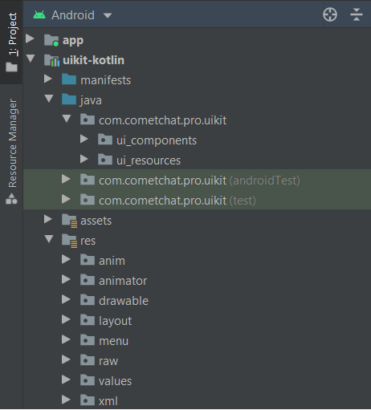
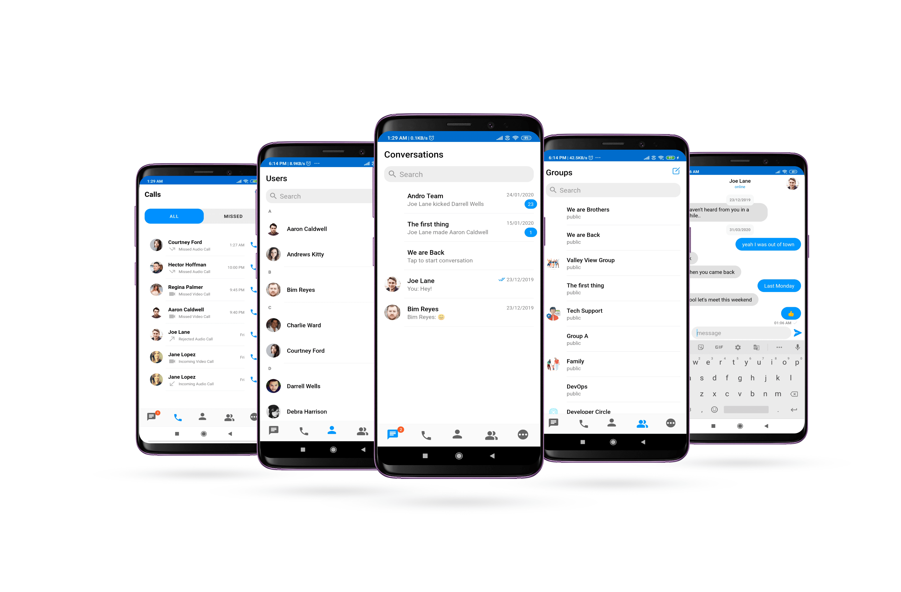

import Tabs from '@theme/Tabs';
import TabItem from '@theme/TabItem';

The CometChat Kotlin Chat UI Kit lets Android developers integrate fully featured text chat & voice/video calling into mobile apps seamlessly.


:::tip Improvements in v3.0

- Faster connection & response times <br/>
- Higher rate limits <br/>
- Supports up to 100K users in a group <br/>
- Unlimited groups <br/>
- Support for Transient Messages <br/>
- Real-time user & group members count And more!<br/>

:::

The Kotlin Chat UI Kit’s fully customizable UI components simplify the process of integrating text chat and voice/video calling features to your Android mobile application.

<div style={{display: 'flex', boxShadow: '0 0 4px 0 rgb(0 0 0 / 18%)', borderRadius: '3px'}}>
  <div style={{padding: '24px'}}>
    <h4 style={{fontWeight: 'bold'}}>**I want to checkout Android Kotlin UI Kit.**</h4>
    <p>Follow the steps mentioned in the <code>README.md</code> file.</p>
    <p>Kindly, click on below button to download our Android Kotlin Chat UI Kit.</p>
    <a style={{display: 'inline-block', backgroundColor: '#7c55c9', padding: '8px', textAlign: 'center', textTransform: 'uppercase', border: '1px solid #e3e5e7', borderRadius: '3px', color: 'white', width: '100%', marginBottom: '8px'}} href="https://github.com/cometchat-pro/ui-kit/kotlin/archive/v3.zip">Kotlin Chat UI Kit</a>
    <a style={{display: 'inline-block', backgroundColor: '#7c55c9', padding: '8px', textAlign: 'center', textTransform: 'uppercase', border: '1px solid #e3e5e7', borderRadius: '3px', color: 'white', width: '100%'}} href="https://github.com/cometchat-pro/ui-kit/kotlin/tree/v3" target="_blank">View on Github</a>

  </div>
  <div style={{padding: '24px', borderLeft: '1px solid #e3e5e7'}}>
    <h4 style={{fontWeight: 'bold'}}>**I want to explore sample apps.**</h4>
    <p>Import the app into Android Studio and follow the steps mentioned in the <code>README.md</code> file.</p>
    <p>Kindly, click on below button to download our Java Sample App.</p>
    <a style={{display: 'inline-block', backgroundColor: '#7c55c9', padding: '8px', textAlign: 'center', textTransform: 'uppercase', border: '1px solid #e3e5e7', borderRadius: '3px', color: 'white', width: '100%', marginBottom: '8px'}} href="https://github.com/cometchat-pro/android-kotlin-chat-app/archive/v3.zip">Kotlin Sample App</a>
    <a style={{display: 'inline-block', backgroundColor: '#7c55c9', padding: '8px', textAlign: 'center', textTransform: 'uppercase', border: '1px solid #e3e5e7', borderRadius: '3px', color: 'white', width: '100%'}} href="https://github.com/cometchat-pro/android-kotlin-chat-app/tree/v3" target="_blank">View on Github</a>
  </div>
</div>

## **Prerequisites** ⭐

Before you begin, ensure you have met the following requirements:

✅ You have Android Studio installed on your machine.

✅ You have an Android Device or Emulator with Android Version 6.0 or above.

✅ You have read [Key Concepts](./key-concepts).

## **Installing Android Kotlin Chat UI Kit**

### **Setup** 🔧

To install Android Kotlin UI Kit, you need to first register on CometChat Dashboard. [Click here to sign up.](https://app.cometchat.com/login)

#### **Get your Application Keys** 🔑

- Create a new app
- Head over to the Quick Start or API & Auth Keys section and note the App ID, Auth Key, and Region.


#### **Add the CometChat Dependency**

First, add the repository URL to the **project level**`build.gradle` file in the repositories block under the `allprojects` section.

<Tabs>
<TabItem value="js" label="">

```
allprojects {
  repositories {
    maven {
      url "https://dl.cloudsmith.io/public/cometchat/cometchat-pro-android/maven/"
    }
  }
}
```

</TabItem>
</Tabs>

Open the **app level** `build.gradle` file and

1. Add the below two line in the `dependencies` section.

<Tabs>
<TabItem value="js" label="">

```
dependencies {
  implementation 'com.cometchat:pro-android-chat-sdk:3.0.0'

	/*v2.4+ onwards, Voice & Video Calling functionality has been
  moved to a separate library. In case you plan to use the calling feature,
  please add the Calling dependency*/

  implementation 'com.cometchat:pro-android-calls-sdk:2.1.0'
}
```

</TabItem>
</Tabs>

2. Add the below lines `android` section

<Tabs>
<TabItem value="js" label="">

```
android {
  compileOptions {
    sourceCompatibility JavaVersion.VERSION_1_8
    targetCompatibility JavaVersion.VERSION_1_8
  }
}
```

</TabItem>
</Tabs>

You can refer to the below link for instructions on how to do so:

**[📝 Add CometChat Dependency](/sdk/android/setup)** `Documentation`

### **Configure CometChat inside your app**

#### **Initialize CometChat** 🌟

The `init()` method initializes the settings required for CometChat. Please make sure to call this method before calling any other methods from CometChat SDK.

<Tabs>
<TabItem value="js" label="Kotlin">

```Kotlin
private val appID = "APP_ID"
private val region = "REGION"
val appSettings = AppSettingsBuilder().subscribePresenceForAllUsers().setRegion(region).build()

CometChat.init(this, appID, appSettings, object : CallbackListener<String>() {
    override fun onSuccess(successMessage: String) {
        Log.d(TAG, "Initialization completed successfully")
    }

    override fun onError(e: CometChatException) {
        Log.d(TAG, "Initialization failed with exception: "+e.message)
    }
})
```

</TabItem>
</Tabs>

:::warning note

Make sure you replace the APP_ID with your CometChat APP ID and REGION with your app's REGION in the above code.

:::

#### **Login User** 👤

The `login()` method returns the User object containing all the information of the logged-in user.

<Tabs>
<TabItem value="js" label="Kotlin">

```Kotlin
private val UID = "cometchat-uid-1" // Replace with the UID of the user to login
private val AUTH_KEY = "Enter AUTH_KEY" // Replace with your App Auth Key
CometChat.login(UID, AUTH_KEY, object : CallbackListener<User?>() {
    override fun onSuccess(user: User?) {
        Log.d(TAG, "Login Successful : "+user.toString())
    }

    override fun onError(e: CometChatException) {
        Log.d(TAG, "Login failed with exception: " + e.message);
    }
})
```

</TabItem>
</Tabs>

:::warning note

Make sure you replace the AUTH_KEY with your CometChat AUTH Key in the above code.
We have setup 5 users for testing having UIDs: cometchat-uid-1, cometchat-uid-2, cometchat-uid-3, cometchat-uid-4 and cometchat-uid-5.

:::

### **Add the Android Kotlin UI Kit Library**

To integrate the UI Kit, please follow the steps below:

- Clone the UI Kit-Kotlin Library from the [android-kotlin-chat-ui-kit](https://github.com/cometchat-pro/ui-kit/kotlin/tree/v3) repository

<a style={{display: 'inline-block', backgroundColor: '#7c55c9', padding: '8px', textAlign: 'center', textTransform: 'uppercase', border: '1px solid #e3e5e7', borderRadius: '3px', color: 'white', width: '100%', marginBottom: '8px'}} href="https://github.com/cometchat-pro/ui-kit/kotlin/archive/v3.zip">Kotlin Download Kotlin UI Kit Library</a>

- Import `uikit-kotlin` Module from Module Settings
- If the Library is added successfully, it will look like mentioned in the below image.



### **Configure Kotlin UI Kit Library**

To use UI Kit you have to add Material Design support in your app as the UI Kit uses Material Design Components.

- Add Material Design Dependency in build.gradle

<Tabs>
<TabItem value="js" label="build.gradle (app level)">

```build.gradle (app level)
dependencies {
    implementation 'com.google.android.material:material:<version>'
}
```

</TabItem>
</Tabs>

- Make sure that your app's theme should extend `Theme.MaterialComponents`. Follow the guide on [Getting started Material Components](https://material.io/develop/android/docs/getting-started/)

The following is the list of Material Components themes you can use to get the latest component styles and theme-level attributes.

- `Theme.MaterialComponents.NoActionBar`
- Theme.MaterialComponents.Light.NoActionBar
- Theme.MaterialComponents.DayNight.NoActionBar

Update your app theme to inherit from one of these themes, e.g.:

<Tabs>
<TabItem value="js" label="xml">

```xml
<style name="AppTheme" parent="Theme.MaterialComponents.Light.NoActionBar.Bridge">

<!-- Customize your theme here. -->
</style>
```

</TabItem>
</Tabs>

:::warning Enable DataBinding

As the UI Kit uses DataBinding you must enable DataBinding

:::

To configure your app to use data binding, add the dataBinding element to your `build.gradle` file in the app module, as shown in the following example:

<Tabs>
<TabItem value="js" label="build.gradle (app level)">

```build.gradle (app level)
android {
    dataBinding {
        enabled = true
    }
}
```

</TabItem>
</Tabs>

:::warning important

We are using File Provider for storage & file access. So you need to add your application package name in manifestPlaceholders

:::

<Tabs>
<TabItem value="js" label="build.gradle (app level)">

```build.gradle (app level)
android {
		defaultConfig {
			...

			manifestPlaceholders = [file_provider: "YOUR_PACKAGE_NAME"]
			//add your application package.
		}
	}
```

</TabItem>
</Tabs>

### **Launch CometChatUI** 🚀



**CometChatUI** is an option to launch a fully functional chat application using the UI Kit. In UI Kit all the UI Components are interlinked and work together to launch a fully functional chat on your mobile/application.

To use CometChatUI user has to launch CometChatUI Activity. Add the following code snippet to launch `CometChatUI`.

<Tabs>
<TabItem value="js" label="Kotlin">

```kotlin
startActivity(Intent(this@YourActivity, CometChatUI::class.java))
```

</TabItem>
</Tabs>

## **See our Kotlin chat sample app**

Visit our [Kotlin chat app](https://github.com/cometchat-pro/android-kotlin-chat-app) repository to run a sample app and see the UI Kit in action.
