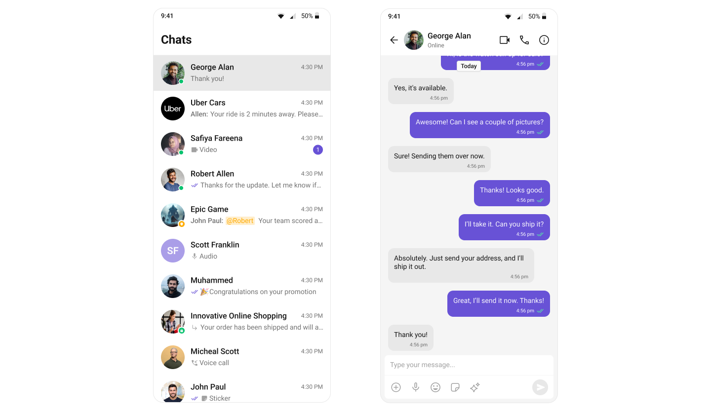

import Tabs from '@theme/Tabs';
import TabItem from '@theme/TabItem';
import GitHubCodeBlock from '@site/src/components/GitHubCodeBlock';

## Start your first conversation

CometChat UI Kit for Android is a collection of prebuilt UI components designed to simplify the development of an in-app chat with all the essential messaging features. Our UI Kit offers light and dark themes, various fonts, colors, and additional customization options.

CometChat UI Kit supports both one-to-one and group conversations. Follow the guide below to initiate conversations from scratch using CometChat Android UI Kit.



## Prerequisites

Before installing the **UI Kit**, you need to create a CometChat application on the CometChat Dashboard, which includes all the necessary data for a chat service, such as users, groups, calls, and messages. You will require the `App ID`, `AuthKey`, and `Region` of your CometChat application when initializing the SDK.

**i. Register on CometChat**

- You need to register on the **CometChat Dashboard** first. [Click here to sign up](https://app.cometchat.com/login).

**ii. Get Your Application Keys**

- Create a **new app**
- Head over to the **QuickStart** or **API & Auth Keys section** and note the **App ID**, **Auth Key**, and **Region**.

**iii. IDE Setup**

- You have Android Studio installed on your machine.
- You have an Android device or emulator with Android version 6.0 or above.
- Android 5.0 (API level 21) or higher is installed.
- Java 8 or higher is installed.
- Android Gradle plugin 4.0.1 or higher is installed.

## Getting Started

<span style={{padding: '6px 15px', 'background-color': '#6851D6', color: 'white', 'border-radius': '15px', 'font-size': '0.9em', 'font-weight': 'bold'}}>Step 1</span>

### Create a project

    To get started, open Android Studio and create a new project for UI Kit in the Project window as follows:

    1. Click Start a **new Android Studio** project in the **Welcome to Android Studio** window.
    1. Select **Empty Activity** in the **Select a Project Template** window and click Next.
    1. Enter your project name in the **Name** field in the **Configure your project** window.
    1. Select your language as either **Java** or Kotlin from the Language drop-down menu.
    1. Select minimum API level as 21 or higher.

---

<span style={{padding: '6px 15px', 'background-color': '#6851D6', color: 'white', 'border-radius': '15px', 'font-size': '0.9em', 'font-weight': 'bold'}}>Step 2</span>

### Add **CometChat** to your project

**i. Add the CometChat Repository**

To integrate CometChat into your Android project, you need to add the CometChat repository to your project-level `settings.gradle` or `settings.gradle.kts` file. Follow the steps below based on your project configuration.

<Tabs>

<TabItem value="kotlin" label="Kotlin">

```kotlin title="settings.gradle.kts"
dependencyResolutionManagement {
    repositoriesMode.set(RepositoriesMode.FAIL_ON_PROJECT_REPOS)
    repositories {
        google()
        mavenCentral()
        maven("https://dl.cloudsmith.io/public/cometchat/cometchat/maven/")
    }
}
```

</TabItem>

<TabItem value="groovy" label="Groovy">

```groovy title="settings.gradle"
dependencyResolutionManagement {
    repositoriesMode.set(RepositoriesMode.FAIL_ON_PROJECT_REPOS)
    repositories {
        google()
        mavenCentral()
        maven{
            url "https://dl.cloudsmith.io/public/cometchat/cometchat/maven/"
        }
    }
}
```

</TabItem>

</Tabs>

**ii. Add the CometChat Dependency**

<Tabs>

<TabItem value="version-catalog" label="Version Catalog (libs.versions.toml)">

Inside `libs.versions.toml`, add the CometChat Chat UI Kit version under the `[versions]` section:

```groovy title="libs.versions.toml"
[versions]
cometchat-ui-kit = "5.0.0"
```

Under the `[libraries]` section, define the library and reference the version:

```groovy title="libs.versions.toml"
[libraries]
cometchat-ui-kit = { module = "com.cometchat:chat-uikit-android", version.ref = "cometchat-ui-kit" }
```

Now, in your app-level `build.gradle.kts` file, add the dependency using libs from Version Catalogs:

```groovy title="build.gradle.kts"
dependencies {
    implementation(libs.cometchat.ui.kit)
}
```

</TabItem>

<TabItem value="gradle" label="Gradle (build.gradle)">

Open the **app level** `build.gradle` file and add the following dependency to fetch the chat UI kit into your project.

```groovy title="build.gradle"
dependencies {
    implementation 'com.cometchat:chat-uikit-android:5.0.0'
}
```

</TabItem>

</Tabs>

**iii. Add AndroidX Support**

The Jetifier tool helps migrate legacy support libraries to AndroidX.

Open the gradle.properties file and verify if the specified line is present. If not, add it accordingly.

```groovy title="gradle.properties"
android.enableJetifier=true
```

---

<span style={{padding: '6px 15px', 'background-color': '#6851D6', color: 'white', 'border-radius': '15px', 'font-size': '0.9em', 'font-weight': 'bold'}}>Step 3</span>

### Initialize & Login UIkit

To start using the UI Kit, you first need to `initialize` and `log in`. Follow the steps below to get started:

1. **Initialization**  
   Call the `Init` method to set up the necessary configurations for CometChat in your app. This step should be done **before** invoking any other methods from CometChat UI Kit or SDK.

2. **User Login**  
   Once initialized, use the `login()` method to authenticate the user. This method will return a **User object** containing all relevant user details. For testing purposes, you can use the following pre-generated users:

   - `cometchat-uid-1`
   - `cometchat-uid-2`
   - `cometchat-uid-3`
   - `cometchat-uid-4`
   - `cometchat-uid-5`

For more details, refer to the documentation on [Init](methods#init) and [Login](methods#login-using-auth-key).

You can initialize CometChat and log in a user in your `MainActivity.kt` file. Upon successful login, navigate to the `ConversationActivity`.

<Tabs>

<TabItem value="kotlin" label="Kotlin">

```kotlin title="MainActivity.kt"

import android.content.Intent
import android.os.Bundle
import androidx.activity.ComponentActivity
import androidx.activity.enableEdgeToEdge
import com.cometchat.chat.core.CometChat
import com.cometchat.chat.exceptions.CometChatException
import com.cometchat.chat.models.User
import com.cometchat.chatuikit.shared.cometchatuikit.CometChatUIKit
import com.cometchat.chatuikit.shared.cometchatuikit.UIKitSettings

class MainActivity : ComponentActivity() {
    val appID: String = "********************" // Replace with your App ID
    val region: String = "**" // Replace with your App Region ("EU" or "US")
    val authKey: String = "****************************************" // Replace with your Auth Key or leave blank if you are authenticating using Auth Token


    val uiKitSettings = UIKitSettings.UIKitSettingsBuilder()
        .setRegion(region)
        .setAppId(appID)
        .setAuthKey(authKey)
        .subscribePresenceForAllUsers().build()

    override fun onCreate(savedInstanceState: Bundle?) {
        super.onCreate(savedInstanceState)
        enableEdgeToEdge()

        CometChatUIKit.init(this, uiKitSettings, object : CometChat.CallbackListener<String?>() {
            override fun onSuccess(successString: String?) {
                CometChatUIKit.login("cometchat-uid-1", object : CometChat.CallbackListener<User>() {
                    override fun onSuccess(user: User) {
                        startActivity(Intent(this@MainActivity, ConversationActivity::class.java))
                    }
                    override fun onError(e: CometChatException) {}
                })
            }
            override fun onError(e: CometChatException?) {}
        })
    }
}
```

</TabItem>

<TabItem value="java" label="Java">

```java title="MainActivity.java"
import android.content.Intent;
import android.os.Bundle;
import androidx.activity.ComponentActivity;
import com.cometchat.chat.core.CometChat;
import com.cometchat.chat.exceptions.CometChatException;
import com.cometchat.chat.models.User;
import com.cometchat.chatuikit.shared.cometchatuikit.CometChatUIKit;
import com.cometchat.chatuikit.shared.cometchatuikit.UIKitSettings;

public class MainActivity extends ComponentActivity {
    private final String appID = "********************"; // Replace with your App ID
    private final String region = "**"; // Replace with your App Region ("EU" or "US")
    private final String authKey = "****************************************"; // Replace with your Auth Key or leave blank if you are authenticating using Auth Token

    private final UIKitSettings uiKitSettings = new UIKitSettings.UIKitSettingsBuilder()
            .setRegion(region)
            .setAppId(appID)
            .setAuthKey(authKey)
            .subscribePresenceForAllUsers()
            .build();

    @Override
    protected void onCreate(Bundle savedInstanceState) {
        super.onCreate(savedInstanceState);

        CometChatUIKit.init(this, uiKitSettings, new CometChat.CallbackListener<String>() {
            @Override
            public void onSuccess(String successString) {
                CometChatUIKit.login("cometchat-uid-1", new CometChat.CallbackListener<User>() {
                    @Override
                    public void onSuccess(User user) {
                        startActivity(new Intent(MainActivity.this, ConversationActivity.class));
                    }

                    @Override
                    public void onError(CometChatException e) {
                        // Handle login error
                    }
                });
            }

            @Override
            public void onError(CometChatException e) {
                // Handle initialization error
            }
        });
    }
}
```

</TabItem>

</Tabs>

This code will initialize UIKit, log in a test user (cometchat-uid-1), and navigate to the `ConversationActivity` upon successful login.

:::warning
You will need to create `ConversationActivity` & `MessageActivity` to handle the chat interface and conversation functionality.
:::

---

<span style={{padding: '6px 15px', 'background-color': '#6851D6', color: 'white', 'border-radius': '15px', 'font-size': '0.9em', 'font-weight': 'bold'}}>Step 4</span>

### Set Up Global Theme

To customize component styling across your application in one place, you need to set up the **CometChat Theme**.

Use the `CometChatTheme.DayNight` style, which is built on `Theme.MaterialComponents.DayNight.NoActionBar`.

**Apply the Theme**

Set `CometChatTheme.DayNight` as the parent theme for your application in the `themes.xml` file.

```xml title="themes.xml"
<style name="YourAppParentTheme" parent="CometChatTheme.DayNight"/>
```

```xml title="AndroidManifest.xml"
    <application
        android:theme="@style/YourAppParentTheme"
        ...
        ...
    >

    </application>
```

---

<span style={{padding: '6px 15px', 'background-color': '#6851D6', color: 'white', 'border-radius': '15px', 'font-size': '0.9em', 'font-weight': 'bold'}}>Step 5</span>

### Render Conversations Component

The **Conversations** component is a [Component](./05-Components/02-conversations.md) that displays all conversations related to the currently logged-in user.

Below are the steps to render the **Conversations** component:


1. Add `CometChatConversations` to the Layout File

   When you create `ConversationActivity`, a layout file named `activity_conversation.xml` is also generated.

   Add the `CometChatConversations` component inside this layout file:

   ```xml title="activity_conversations.xml"
   <androidx.constraintlayout.widget.ConstraintLayout xmlns:android="http://schemas.android.com/apk/res/android"
    xmlns:app="http://schemas.android.com/apk/res-auto"
    xmlns:tools="http://schemas.android.com/tools"
    android:id="@+id/main"
    android:layout_width="match_parent"
    android:layout_height="match_parent"
    tools:context=".ConversationActivity">

    <com.cometchat.chatuikit.conversations.CometChatConversations
        android:id="@+id/conversation_view"
        android:layout_width="0dp"
        android:layout_height="0dp"
        app:layout_constraintTop_toTopOf="parent"
        app:layout_constraintBottom_toBottomOf="parent"
        app:layout_constraintStart_toStartOf="parent"
        app:layout_constraintEnd_toEndOf="parent" />

    </androidx.constraintlayout.widget.ConstraintLayout>
   ```

1. Handle Conversation Click Events

   To navigate to the **Message Activity** for a particular conversation, you need to set up `setOnItemClick`. Inside `ConversationActivity`, initialize the `CometChatConversations` component and set a click listener on the conversation object

   <Tabs>

   <TabItem value="kt" label="Kotlin">

   ```kt title="ConversationActivity.kt"
    import android.content.Intent
    import android.os.Bundle
    import androidx.activity.enableEdgeToEdge
    import androidx.appcompat.app.AppCompatActivity
    import com.cometchat.chat.constants.CometChatConstants
    import com.cometchat.chat.models.Group
    import com.cometchat.chat.models.User
    import com.cometchat.chatuikit.conversations.CometChatConversations
    import com.google.gson.Gson

    class ConversationActivity : AppCompatActivity() {
        private lateinit var  cometchatConversations: CometChatConversations

        override fun onCreate(savedInstanceState: Bundle?) {
            super.onCreate(savedInstanceState)
            enableEdgeToEdge()
            setContentView(R.layout.activity_conversation)

            //initialize Conversation object
            cometchatConversations = findViewById(R.id.conversation_view)

            //set click listener on conversation item
            cometchatConversations.setOnItemClick { view, position, conversation ->
                //Checking if Conversation is of Group type or User type
                if (conversation.conversationType == CometChatConstants.CONVERSATION_TYPE_GROUP) {
                    val group = conversation.conversationWith as Group
                    val intent = Intent(this, MessageActivity::class.java)
                    intent.putExtra("Group", Gson().toJson(group))
                    startActivity(intent)   //Start MessageActivity
                } else {
                    val user = conversation.conversationWith as User
                    val intent = Intent(this, MessageActivity::class.java)
                    intent.putExtra("User", Gson().toJson(user))
                    startActivity(intent)   //Start MessageActivity
                }
            }
        }
    }

   ```

   </TabItem>

   <TabItem value="java" label="Java">

   ```java title="ConversationActivity.java"

    import android.content.Intent;
    import android.os.Bundle;
    import androidx.appcompat.app.AppCompatActivity;
    import com.cometchat.chat.constants.CometChatConstants;
    import com.cometchat.chat.models.Group;
    import com.cometchat.chat.models.User;
    import com.cometchat.chatuikit.conversations.CometChatConversations;
    import com.google.gson.Gson;

    public class ConversationActivity extends AppCompatActivity {
        private CometChatConversations cometchatConversations;

        @Override
        protected void onCreate(Bundle savedInstanceState) {
            super.onCreate(savedInstanceState);
            setContentView(R.layout.activity_conversation);

            // Initialize Conversation object
            cometchatConversations = findViewById(R.id.conversation_view);

            // Set click listener on conversation item
            cometchatConversations.setOnItemClick((view, position, conversation) -> {
                Intent intent = new Intent(ConversationActivity.this, MessageActivity.class);

                // Checking if Conversation is of Group type or User type
                if (CometChatConstants.CONVERSATION_TYPE_GROUP.equals(conversation.getConversationType())) {
                    Group group = (Group) conversation.getConversationWith();
                    intent.putExtra("Group", new Gson().toJson(group));
                } else {
                    User user = (User) conversation.getConversationWith();
                    intent.putExtra("User", new Gson().toJson(user));
                }
                startActivity(intent); // Start MessageActivity
            });
        }
    }
   ```

   </TabItem>

   </Tabs>

:::warning  
 You must use an activity that supports the **lifecycle** API, such as:

    - `AppCompatActivity`
    - `ComponentActivity`
    - `FragmentActivity`

    This is necessary to properly manage the **UI Kit's lifecycle events**.

:::

### Rendering the Messages Component

To achieve full messaging functionality in `MessageActivity`, you need to combine the following three components:

- [Message Header](./05-Components/06-message-header.md)
- [Message List](./05-Components/07-message-list.md)
- [Message Composer](./05-Components/08-message-composer.md))

Below are the steps to render Messages Screen:


1. Add Messages Component to the Layout File

   When you create `MessageActivity`, a layout file named `activity_messages.xml` is also generated. Add the following code to `activity_messages.xml`

   ```xml title="activity_messages.xml"
   <androidx.constraintlayout.widget.ConstraintLayout
       xmlns:android="http://schemas.android.com/apk/res/android"
       xmlns:app="http://schemas.android.com/apk/res-auto"
       xmlns:tools="http://schemas.android.com/tools"
       android:id="@+id/main"
       android:layout_width="match_parent"
       android:layout_height="match_parent"
       tools:context=".MessageActivity">

       <!-- Message Header -->
       <com.cometchat.chatuikit.messageheader.CometChatMessageHeader
           android:id="@+id/message_header"
           android:layout_width="match_parent"
           android:layout_height="wrap_content"
           app:layout_constraintTop_toTopOf="parent"
           app:layout_constraintStart_toStartOf="parent"
           app:layout_constraintEnd_toEndOf="parent" />

       <!-- Message List -->
       <com.cometchat.chatuikit.messagelist.CometChatMessageList
           android:id="@+id/message_list"
           android:layout_width="0dp"
           android:layout_height="0dp"
           app:layout_constraintTop_toBottomOf="@id/message_header"
           app:layout_constraintBottom_toTopOf="@id/message_composer"
           app:layout_constraintStart_toStartOf="parent"
           app:layout_constraintEnd_toEndOf="parent" />

       <!-- Message Composer -->
       <com.cometchat.chatuikit.messagecomposer.CometChatMessageComposer
           android:id="@+id/message_composer"
           android:layout_width="match_parent"
           android:layout_height="wrap_content"
           app:layout_constraintBottom_toBottomOf="parent"
           app:layout_constraintStart_toStartOf="parent"
           app:layout_constraintEnd_toEndOf="parent" />

   </androidx.constraintlayout.widget.ConstraintLayout>
   ```

1. Add User or Group Object to Message Components

   In your `MessagesActivity`, configure the components to display messages based on the selected `user` or `group`.

   <Tabs>

   <TabItem value="kt" label="Kotlin">

   ```kt title="MessagesActivity.kt"
    import android.os.Bundle
    import androidx.activity.enableEdgeToEdge
    import androidx.appcompat.app.AppCompatActivity
    import com.cometchat.chat.models.Group
    import com.cometchat.chat.models.User
    import com.cometchat.chatuikit.messagecomposer.CometChatMessageComposer
    import com.cometchat.chatuikit.messageheader.CometChatMessageHeader
    import com.cometchat.chatuikit.messagelist.CometChatMessageList
    import com.google.gson.Gson

    class MessageActivity : AppCompatActivity() {
        private lateinit var messageHeader: CometChatMessageHeader
        private lateinit var messageList: CometChatMessageList
        private lateinit var messageComposer: CometChatMessageComposer

        private var user: User? = null
        private var group: Group? = null

        override fun onCreate(savedInstanceState: Bundle?) {
            super.onCreate(savedInstanceState)
            enableEdgeToEdge()
            setContentView(R.layout.activity_message)

            messageHeader = findViewById(R.id.message_header)
            messageList = findViewById(R.id.message_list)
            messageComposer = findViewById(R.id.message_composer)

            // Deserialize user or group object from intent
            user = Gson().fromJson<User>(intent.getStringExtra("User"), User::class.java)
            group = Gson().fromJson<Group>(intent.getStringExtra("Group"), Group::class.java)

            if (user != null) {
                // Configure components for user chat
                messageHeader.setUser(user!!)
                messageList.setUser(user)
                messageComposer.setUser(user)
            } else if (group != null) {
                // Configure components for group chat
                messageHeader.setGroup(group!!)
                messageList.setGroup(group)
                messageComposer.setGroup(group)
            }

            // Handle back button in the header
            messageHeader.onBackButtonPressed { finish() }

        }
    }
   ```

   </TabItem>

    <TabItem value="java" label="Java">

   ```java title="MessagesActivity.java"

   import com.cometchat.chat.models.Group;
   import com.cometchat.chat.models.User;
   import com.cometchat.chatuikit.messageheader.CometChatMessageHeader;
   import com.cometchat.chatuikit.messagelist.CometChatMessageList;
   import com.cometchat.chatuikit.messagecomposer.CometChatMessageComposer;

   public class MessagesActivity extends AppCompatActivity {

       private CometChatMessageHeader messageHeader;
       private CometChatMessageList messageList;
       private CometChatMessageComposer messageComposer;

       private User user;
       private Group group;

       @Override
       protected void onCreate(Bundle savedInstanceState) {
           super.onCreate(savedInstanceState);
           setContentView(R.layout.activity_messages);

           messageHeader = findViewById(R.id.message_header);
           messageList = findViewById(R.id.message_list);
           messageComposer = findViewById(R.id.message_composer);

           // Deserialize user or group object from intent
           user = new Gson().fromJson(getIntent().getStringExtra(getString(R.string.app_user)), User.class);
           group = new Gson().fromJson(getIntent().getStringExtra(getString(R.string.app_group)), Group.class);

           if (user != null) {
               // Configure components for user chat
               messageHeader.setUser(user);
               messageList.setUser(user);
               messageComposer.setUser(user);
           } else if (group != null) {
               // Configure components for group chat
               messageHeader.setGroup(group);
               messageList.setGroup(group);
               messageComposer.setGroup(group);
           }

           // Handle back button in the header
           messageHeader.onBackButtonPressed(() -> finish());
       }
   }

   ```

    </TabItem>

   </Tabs>

---
