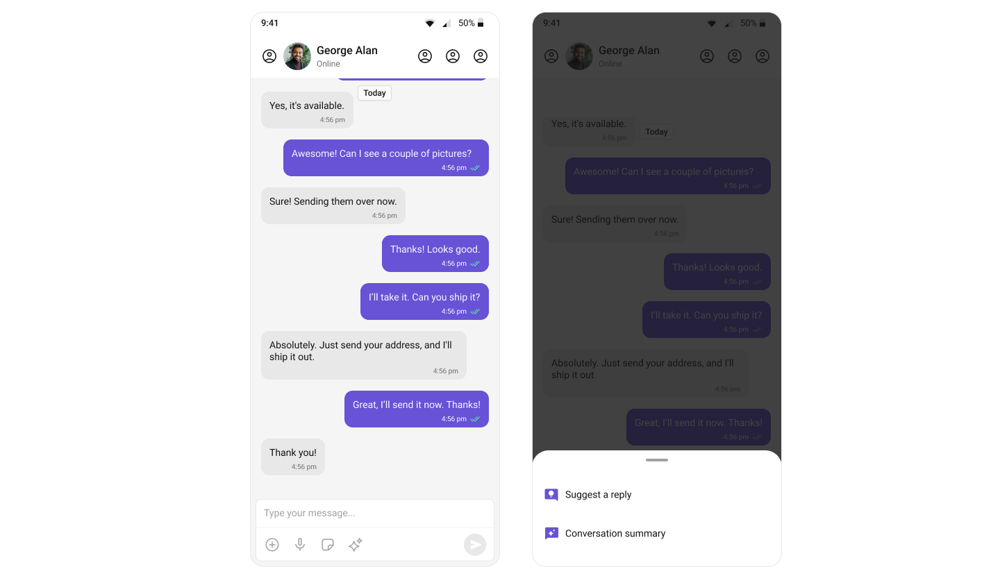
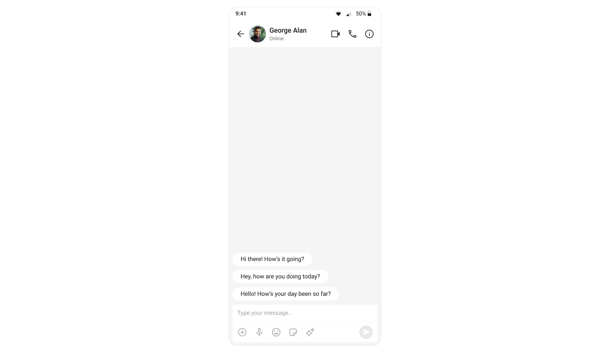
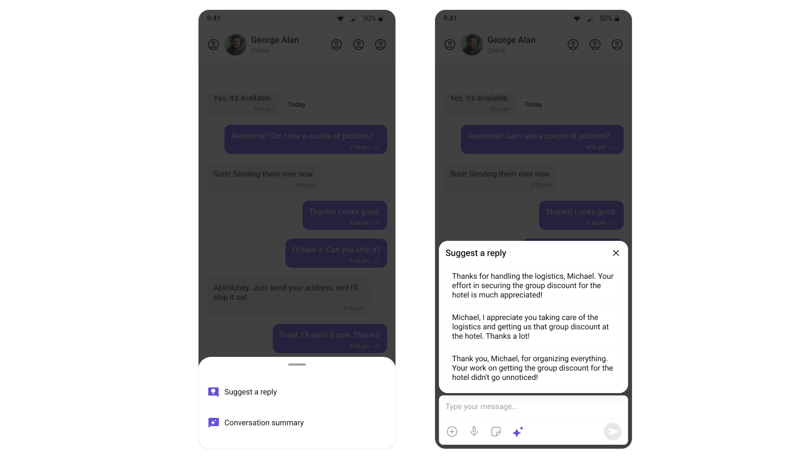
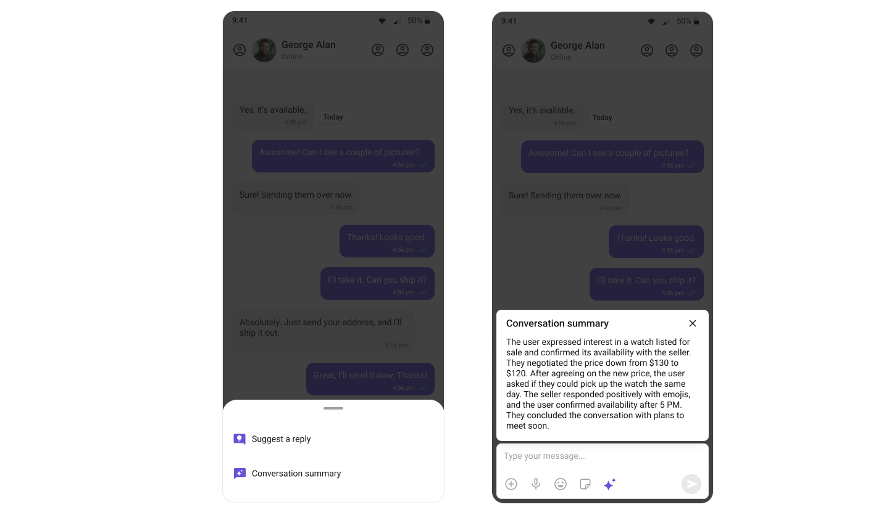

import Tabs from '@theme/Tabs';
import TabItem from '@theme/TabItem';

## Overview

CometChat's AI capabilities greatly enhance user interaction and engagement in your application. Let's understand how the Android UI Kit achieves these features.

## Conversation Starters

When a user initiates a new chat, the UI kit displays a list of suggested opening lines that users can select, making it easier for them to start a conversation. These suggestions are powered by CometChat's AI, which predicts contextually relevant conversation starters.

For a comprehensive understanding and guide on implementing and using the Conversation Starters, refer to our specific guide on the [Conversation Starter](/ai/conversation-starter).

Once you have successfully activated the [Conversation Starter](/ai/conversation-starter) from your CometChat Dashboard, the feature will automatically be incorporated into the [MessageList](../../05-Components/07-message-list.md) Component of UI Kits.

## Smart Replies

Smart Replies are AI-generated responses to messages. They can predict what a user might want to say next by analyzing the context of the conversation. This allows for quicker and more convenient responses, especially on mobile devices.

For a comprehensive understanding and guide on implementing and using the Smart Replies, refer to our specific guide on the [Smart Replies](/ai/smart-replies).

Once you have successfully activated the [Smart Replies](/ai/smart-replies) from your CometChat Dashboard, the feature will automatically be incorporated into the Action sheet of [MessageComposer](../../05-Components/08-message-composer.md) Component of UI Kits.

## Conversation Summary

The Conversation Summary feature provides concise summaries of long conversations, allowing users to catch up quickly on missed chats. This feature uses natural language processing to determine the main points in a conversation.

For a comprehensive understanding and guide on implementing and using the Conversation Summary, refer to our specific guide on the [Conversation Summary](/ai/conversation-summary).

Once you have successfully activated the [Smart Replies](/ai/smart-replies) from your CometChat Dashboard, the feature will automatically be incorporated into the Action sheet of [MessageComposer](../../05-Components/08-message-composer.md) Component of UI Kits.

