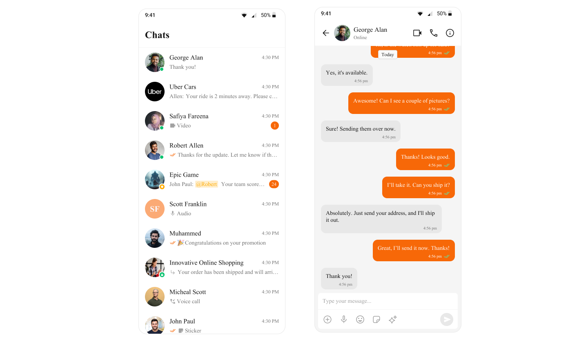

## Overview  
Color resources in CometChat allow you to maintain a consistent visual identity across your application, providing predefined colors for various UI elements such as text, buttons, backgrounds, alerts, and more. These color definitions adapt seamlessly to light and dark themes, ensuring an optimal user experience across different modes.  

The color resources are divided into the following categories:  
- **Primary Colors**: Define the main theme of the application.  
- **Neutral Colors**: Used for backgrounds, strokes, and secondary UI elements.  
- **Alert Colors**: Highlight states like success, warning, error, or information.  
- **Text Colors**: Used for typography.  
- **Icon Colors**: Define icon appearances.  
- **Button Colors**: Customize button backgrounds, icons, and text.  

CometChat provides separate color definitions for **light mode** and **dark mode**, enabling automatic theme adaptation.

---

## Usage  

### Default Colors  
CometChat includes predefined color sets for light and dark modes in the `res/values` and `res/values-night` directories, respectively. These ensure proper visual contrast and accessibility.  
Example: Light Mode Color Resources  
```xml
<?xml version="1.0" encoding="utf-8"?>
<resources>
    <color name="cometchat_color_primary">#6852D6</color>
    <color name="cometchat_color_neutral_50">#FFFFFF</color>
    <color name="cometchat_color_neutral_900">#141414</color>
    <color name="cometchat_color_text_primary">@color/cometchat_color_neutral_900</color>
    <!-- Other color definitions -->
</resources>
```

Example: Night Mode Color Resources  
```xml
<?xml version="1.0" encoding="utf-8"?>
<resources>
    <color name="cometchat_color_primary">#6852D6</color>
    <color name="cometchat_color_neutral_50">#141414</color>
    <color name="cometchat_color_neutral_900">#FFFFFF</color>
    <color name="cometchat_color_text_primary">@color/cometchat_color_neutral_900</color>
    <!-- Other color definitions -->
</resources>
```
To view the complete list of colors for both light and dark modes, [click here](https://github.com/cometchat-team/uikit-android/blob/native-theming/chatuikit/src/main/res/values/color.xml).


## Customizing Colors
You can override the default colors to align them with your application's branding.

Example: Changing the Primary Color
Define your custom color in your themes.xml:
```xml
<!-- themes.xml -->
<style name="AppTheme" parent="CometChatTheme.DayNight">

    <item name="cometchatPrimaryColor">#F76808</item>

</style>
```
To know more such attributes, visit the [theme attributes file](https://github.com/cometchat/cometchat-uikit-android/blob/v5/chatuikit/src/main/res/values/attr_cometchat_theme.xml).

