## Overview
Message bubbles are the core visual element in chat applications, encapsulating different types of messages like text, images, or attachments. Customizing message bubbles allows developers to create a consistent and engaging user experience that aligns with their app's theme and design language.
This guide provides an overview of how to style outgoing and incoming message bubbles and customize the appearance for specific message types.


### Incoming Bubble Style

Incoming bubbles represent messages received from other users.

Customization options include:

- Background color: Choose a complementary or contrasting color to distinguish incoming messages.
- Text appearance: Set unique font styles to highlight received message content.
- Bubble shape: Use consistent shapes or differentiate them further for visual clarity.

### Outgoing Bubble Style
Outgoing bubbles represent messages sent by the user. 


Customization options include:

- Background color: Define a distinct color to differentiate user messages.
- Text appearance: Configure font size, color, and style for message content.
- Bubble shape: Adjust the corner radius to achieve sharp, rounded, or custom designs.

## Message Bubbles
Message bubbles are core elements of the messaging interface. Their collective appearance can be customized to create a consistent design, including color, shape, and overall style for both outgoing and incoming messages.
The message bubbles' styles can be customized by extending the predefined styles in your themes.xml file.

**Customizing Incoming Message Bubble**
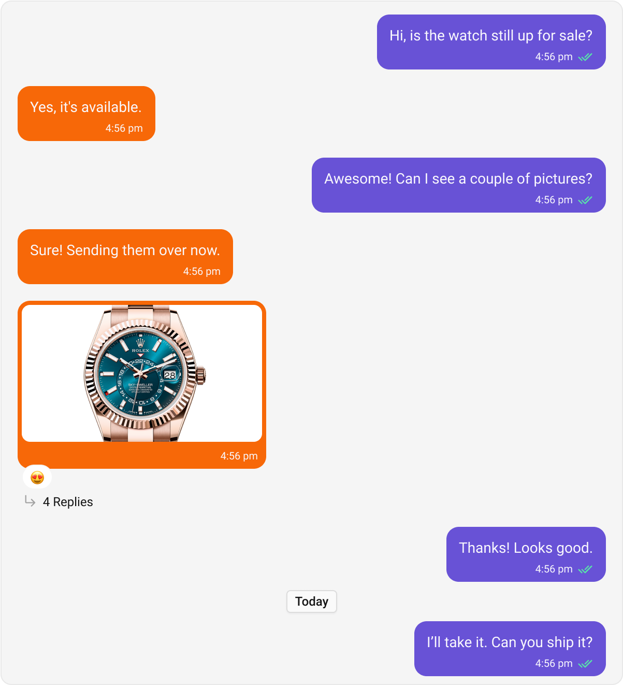

```xml
<!-- themes.xml -->
<style name="CustomIncomingMessageBubbleStyle" parent="CometChatIncomingMessageBubbleStyle">
     <item name="cometchatMessageBubbleBackgroundColor">#F76808</item>
</style>

```

```xml
<!-- themes.xml -->
<style name="AppTheme" parent="CometChatTheme.DayNight">
   <item name="cometchatIncomingMessageBubbleStyle">@style/CustomIncomingMessageBubbleStyle</item>
</style>

```

**Customizing Outgoing Message Bubble**
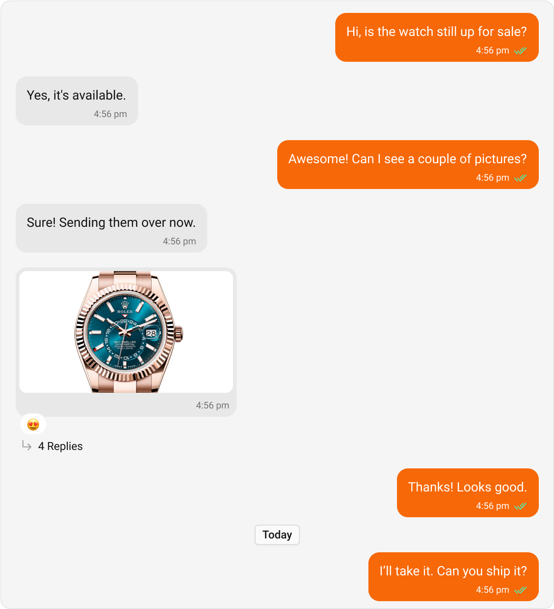
```xml
<!-- themes.xml -->
<style name="CustomOutgoingMessageBubbleStyle" parent="CometChatOutgoingMessageBubbleStyle">
     <item name="cometchatMessageBubbleBackgroundColor">#F76808</item>
</style>

```

```xml
<!-- themes.xml -->
<style name="AppTheme" parent="CometChatTheme.DayNight">
   <item name="cometchatOutgoingMessageBubbleStyle">@style/CustomOutgoingMessageBubbleStyle</item>
</style>

```
To know more such attributes, visit the [attributes file](https://github.com/cometchat/cometchat-uikit-android/blob/v5/chatuikit/src/main/res/values/attr_cometchat_message_bubble.xml).

### Text Bubble
Text bubbles display plain text messages. These are the most common bubble type in a chat interface.

**Default**

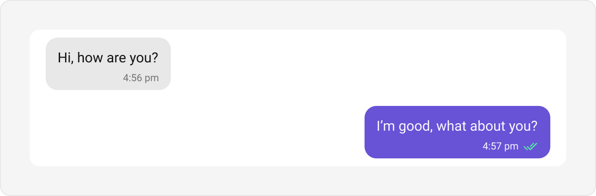


**Customization**

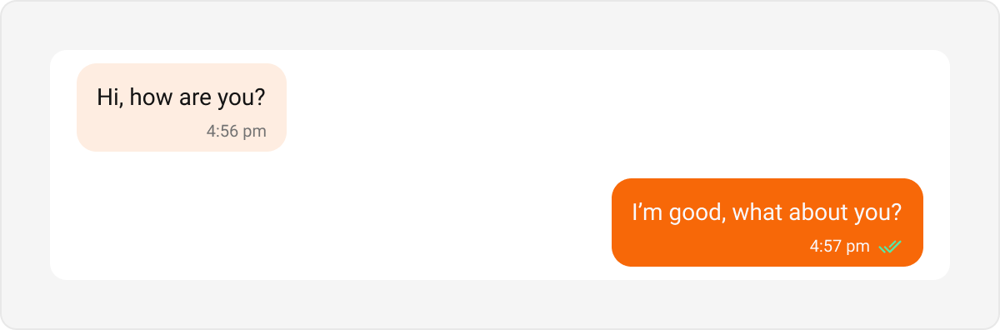

**Customizing Incoming Bubble**
```xml title="themes.xml"

<style name="CustomIncomingTextBubbleStyle" parent="CometChatIncomingTextBubbleStyle">
    <item name="cometchatTextBubbleBackgroundColor">#FEEDE1</item>
</style>

<style name="CustomIncomingMessageBubbleStyle" parent="CometChatIncomingMessageBubbleStyle">
    <item name="cometchatTextBubbleStyle">@style/CustomIncomingTextBubbleStyle</item>
</style>

```

```xml title="themes.xml"

<style name="AppTheme" parent="CometChatTheme.DayNight">
   <item name="cometchatIncomingMessageBubbleStyle">@style/CustomIncomingMessageBubbleStyle</item>
</style>

```
**Customizing Outgoing Bubble**
```xml
<!-- themes.xml -->
 <style name="CustomOutgoingTextBubbleStyle" parent="CometChatOutgoingTextBubbleStyle">
        <item name="cometchatTextBubbleBackgroundColor">#F76808</item>
</style>

<style name="CustomOutgoingMessageBubbleStyle" parent="CometChatOutgoingMessageBubbleStyle">
    <item name="cometchatTextBubbleStyle">@style/CustomOutgoingTextBubbleStyle</item>
</style>

```

```xml
<!-- themes.xml -->
<style name="AppTheme" parent="CometChatTheme.DayNight">
   <item name="cometchatOutgoingMessageBubbleStyle">@style/CustomOutgoingMessageBubbleStyle</item>
</style>

```
To know more such attributes, visit the [attributes file](https://github.com/cometchat/cometchat-uikit-android/blob/v5/chatuikit/src/main/res/values/attr_cometchat_text_bubble.xml).

### Link Preview Bubble
The Link Preview Bubble is designed to display a preview of links shared in messages. It enriches the messaging experience by showing details such as the page title, description, and an image from the linked content, making links more engaging and informative.

**Default**

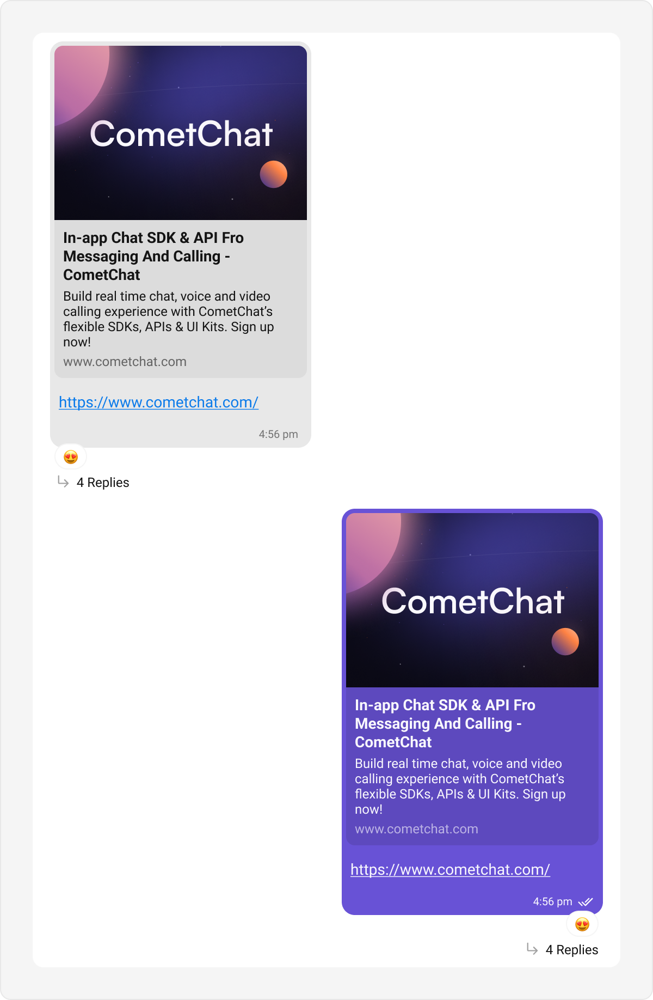

**Customization**

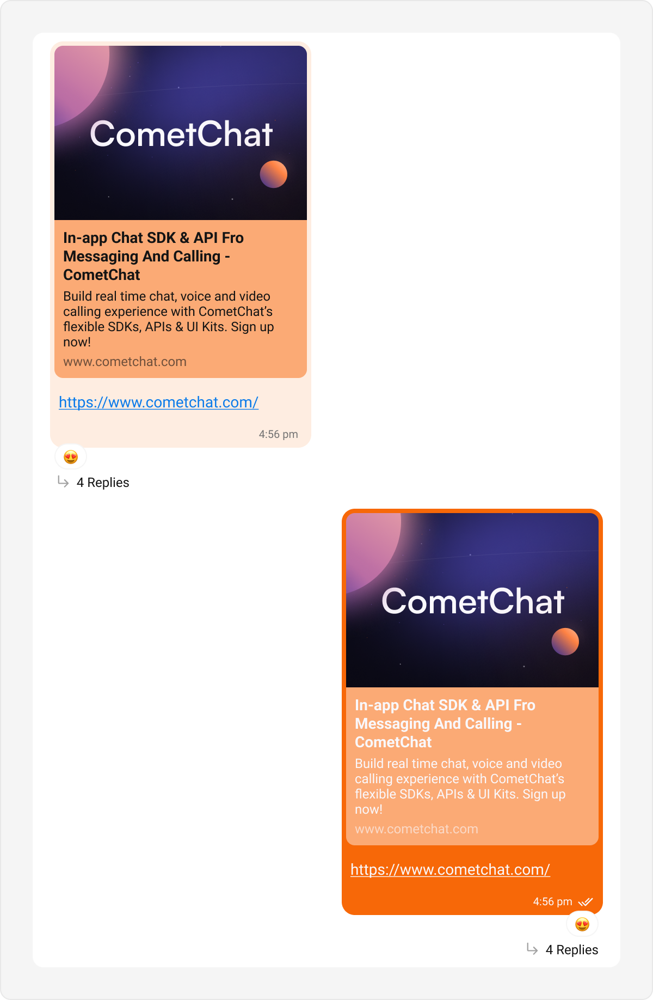

**Customizing Incoming Bubble**
```xml
<!-- themes.xml -->
<style name="CustomIncomingTextBubbleStyle" parent="CometChatIncomingTextBubbleStyle">
    <item name="cometchatTextBubbleBackgroundColor">#FEEDE1</item>
    <item name="cometchatTextBubbleLinkPreviewBackgroundColor">#FBAA75</item>
</style>

<style name="CustomIncomingMessageBubbleStyle" parent="CometChatIncomingMessageBubbleStyle">
    <item name="cometchatTextBubbleStyle">@style/CustomIncomingTextBubbleStyle</item>
</style>

```

```xml
<!-- themes.xml -->
<style name="AppTheme" parent="CometChatTheme.DayNight">
   <item name="cometchatIncomingMessageBubbleStyle">@style/CustomIncomingMessageBubbleStyle<item>
</style>

```
**Customizing Outgoing Bubble**
```xml
<!-- themes.xml -->
 <style name="CustomOutgoingTextBubbleStyle" parent="CometChatOutgoingTextBubbleStyle">
    <item name="cometchatTextBubbleBackgroundColor">#F76808</item>
    <item name="cometchatTextBubbleLinkPreviewBackgroundColor">#FBAA75</item>
</style>

<style name="CustomOutgoingMessageBubbleStyle" parent="CometChatOutgoingMessageBubbleStyle">
    <item name="cometchatTextBubbleStyle">@style/CustomOutgoingTextBubbleStyle</item>
</style>

```

```xml
<!-- themes.xml -->
<style name="AppTheme" parent="CometChatTheme.DayNight">
   <item name="cometchatOutgoingMessageBubbleStyle">@style/CustomOutgoingMessageBubbleStyle</item>
</style>

```
To know more such attributes, visit the [attributes file](https://github.com/cometchat/cometchat-uikit-android/blob/v5/chatuikit/src/main/res/values/attr_cometchat_text_bubble.xml).

### Image Bubble
Image bubbles display images shared within a conversation.

**Default**
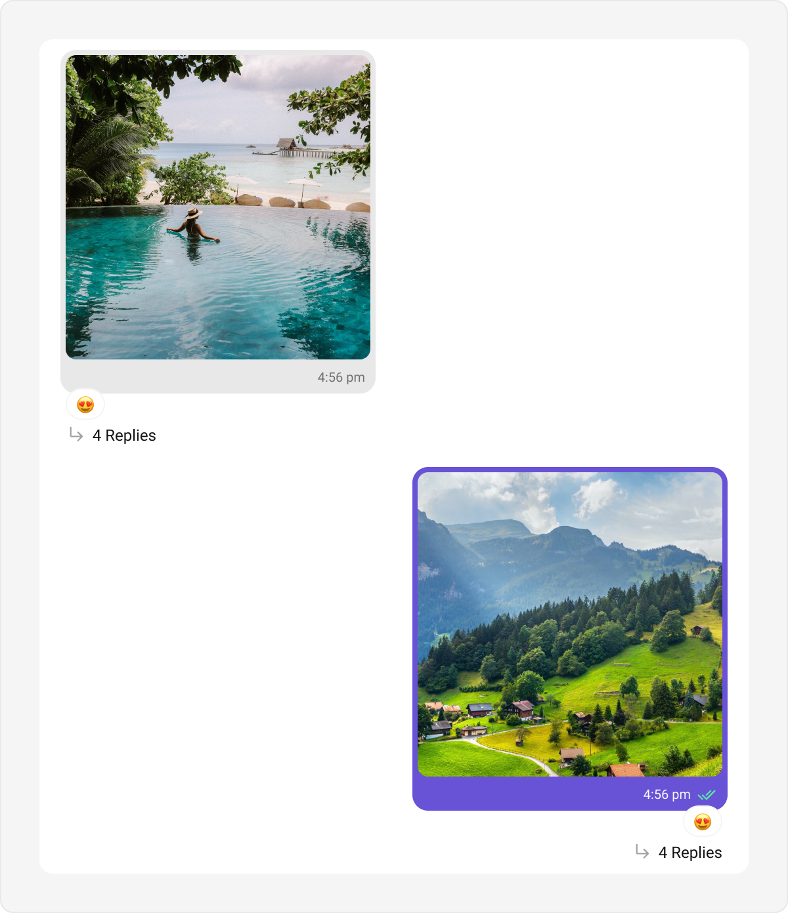

**Customization**

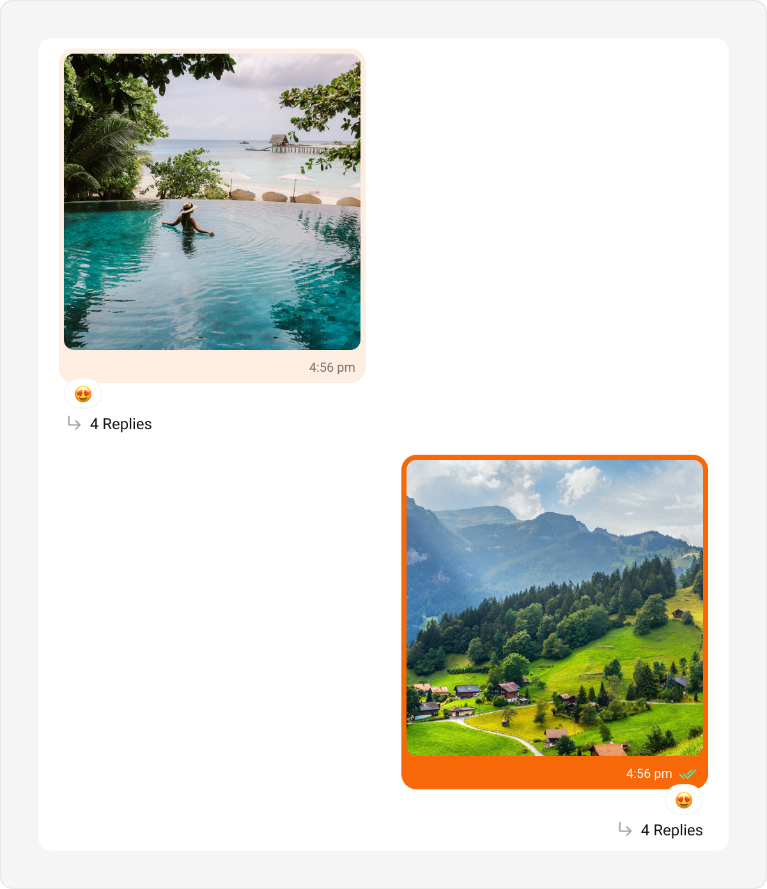

**Customizing Incoming Bubble**
```xml
<!-- themes.xml -->
<style name="CustomIncomingImageBubbleStyle" parent="CometChatIncomingImageBubbleStyle">
   <item name="cometchatImageBubbleBackgroundColor">#FEEDE1</item>
</style>

<style name="CustomIncomingMessageBubbleStyle" parent="CometChatIncomingMessageBubbleStyle">
    <item name="cometchatImageBubbleStyle">@style/CustomIncomingImageBubbleStyle</item>
</style>

```

```xml
<!-- themes.xml -->
<style name="AppTheme" parent="CometChatTheme.DayNight">
    <item name="cometchatIncomingMessageBubbleStyle">@style/CustomIncomingMessageBubbleStyle</item>
</style>

```
**Customizing Outgoing Bubble**
```xml
<!-- themes.xml -->
<style name="CustomOutgoingImageBubbleStyle" parent="CometChatOutgoingImageBubbleStyle">
    <item name="cometchatImageBubbleBackgroundColor">#F76808</item>
</style>

<style name="CustomOutgoingMessageBubbleStyle" parent="CometChatOutgoingMessageBubbleStyle">
    <item name="cometchatImageBubbleStyle">@style/CustomOutgoingImageBubbleStyle</item>
</style>

```

```xml
<!-- themes.xml -->
<style name="AppTheme" parent="CometChatTheme.DayNight">
    <item name="cometchatOutgoingMessageBubbleStyle">@style/CustomOutgoingMessageBubbleStyle</item>
</style>

```
To know more such attributes, visit the [attributes file](https://github.com/cometchat/cometchat-uikit-android/blob/v5/chatuikit/src/main/res/values/attr_cometchat_image_bubble.xml).

### Video Bubble
Video bubbles display video messages or clips in a chat.

**Default**

**Customization**

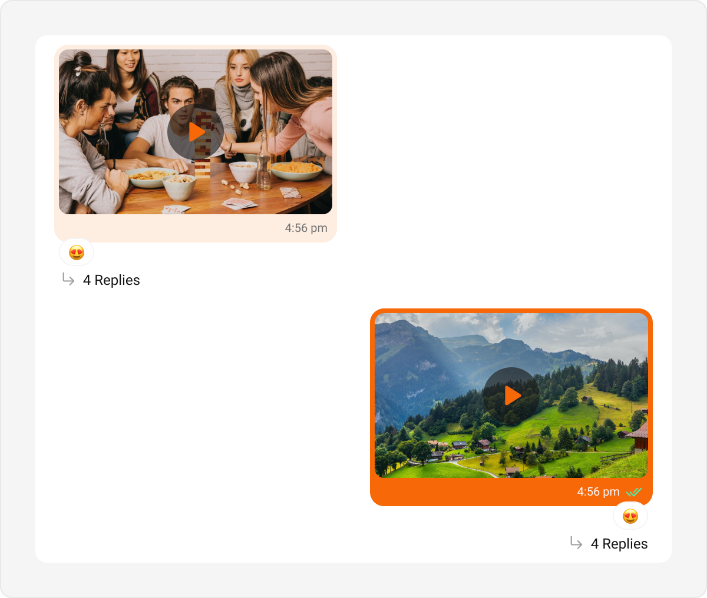

**Customizing Incoming Bubble**
```xml
<!-- themes.xml -->
<style name="CustomIncomingVideoBubbleStyle" parent="CometChatIncomingVideoBubbleStyle">
    <item name="cometchatVideoBubbleBackgroundColor">#FEEDE1</item>
    <item name="cometchatVideoBubblePlayIconTint">#F76808</item>
</style>

<style name="CustomIncomingMessageBubbleStyle" parent="CometChatIncomingMessageBubbleStyle">
    <item name="cometchatVideoBubbleStyle">@style/CustomIncomingVideoBubbleStyle</item>
</style>

```

```xml
<!-- themes.xml -->
<style name="AppTheme" parent="CometChatTheme.DayNight">
    <item name="cometchatIncomingMessageBubbleStyle">@style/CustomIncomingMessageBubbleStyle</item>
</style>

```
**Customizing Outgoing Bubble**
```xml
<!-- themes.xml -->
<style name="CustomOutgoingVideoBubbleStyle" parent="CometChatOutgoingVideoBubbleStyle">
    <item name="cometchatVideoBubbleBackgroundColor">#F76808</item>
    <item name="cometchatVideoBubblePlayIconTint">#F76808</item>
</style>

<style name="CustomOutgoingMessageBubbleStyle" parent="CometChatOutgoingMessageBubbleStyle">
    <item name="cometchatVideoBubbleStyle">@style/CustomOutgoingVideoBubbleStyle</item>
</style>

```

```xml
<!-- themes.xml -->
<style name="AppTheme" parent="CometChatTheme.DayNight">
    <item name="cometchatOutgoingMessageBubbleStyle">@style/CustomOutgoingMessageBubbleStyle</item>
</style>

```
To know more such attributes, visit the [attributes file](https://github.com/cometchat/cometchat-uikit-android/blob/v5/chatuikit/src/main/res/values/attr_cometchat_video_bubble.xml).

### Audio Bubble
Audio bubbles represent audio messages or voice recordings.

**Default**

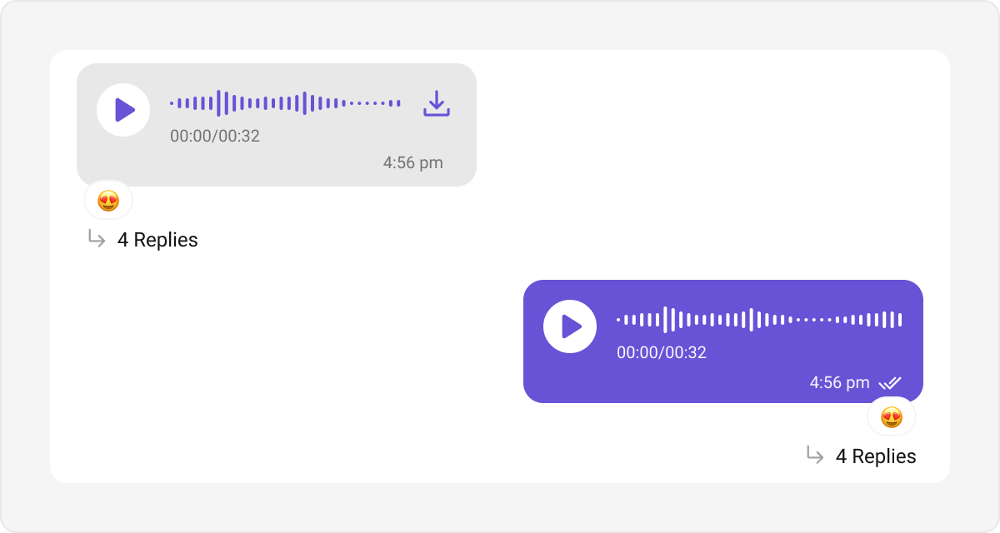

**Customization**

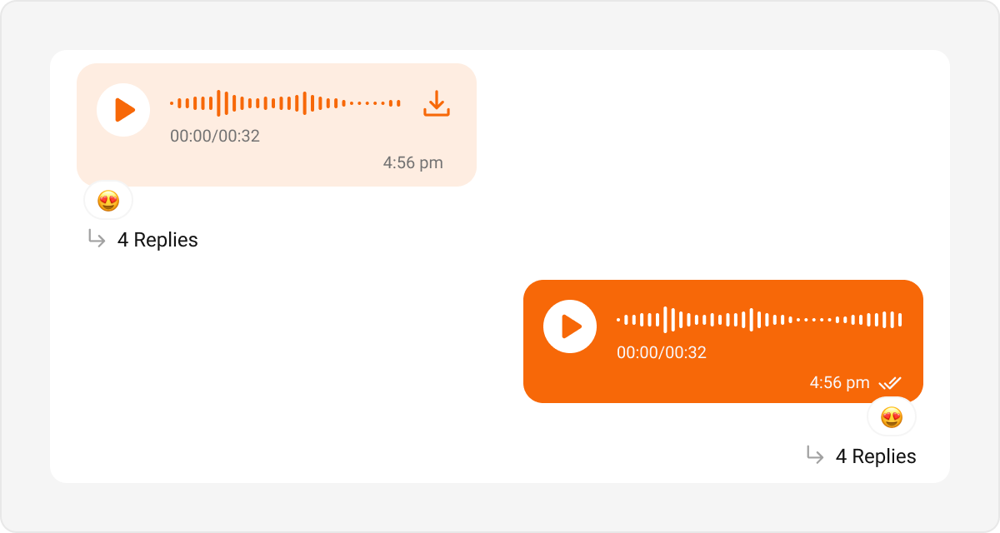

**Customizing Incoming Bubble**
```xml
<!-- themes.xml -->
<style name="CustomIncomingAudioBubbleStyle" parent="CometChatIncomingAudioBubbleStyle">
    <item name="cometchatAudioBubbleAudioWaveColor">#F76808</item>
    <item name="cometchatAudioBubblePlayIconTint">#F76808</item>
    <item name="cometchatAudioBubblePauseIconTint">#F76808</item>
    <item name="cometchatAudioBubbleBackgroundColor">#FEEDE1</item>
</style>

<style name="CustomIncomingMessageBubbleStyle" parent="CometChatIncomingMessageBubbleStyle">
    <item name="cometchatAudioBubbleStyle">@style/CustomIncomingAudioBubbleStyle</item>
</style>

```

```xml
<!-- themes.xml -->
<style name="AppTheme" parent="CometChatTheme.DayNight">
    <item name="cometchatIncomingMessageBubbleStyle">@style/CustomIncomingMessageBubbleStyle</item>
</style>

```

**Customizing Outgoing Bubble**
```xml
<!-- themes.xml -->
<style name="CustomOutgoingAudioBubbleStyle" parent="CometChatOutgoingAudioBubbleStyle">
    <item name="cometchatAudioBubblePlayIconTint">#F76808</item>
    <item name="cometchatAudioBubblePauseIconTint">#F76808</item>
    <item name="cometchatAudioBubbleBackgroundColor">#F76808</item>
 </style>

<style name="CustomOutgoingMessageBubbleStyle" parent="CometChatOutgoingMessageBubbleStyle">
    <item name="cometchatAudioBubbleStyle">@style/CustomOutgoingAudioBubbleStyle</item>
</style>

```

```xml
<!-- themes.xml -->
<style name="AppTheme" parent="CometChatTheme.DayNight">
    <item name="cometchatOutgoingMessageBubbleStyle">@style/CustomOutgoingMessageBubbleStyle</item>
</style>

```
To know more such attributes, visit the [attributes file](https://github.com/cometchat/cometchat-uikit-android/blob/v5/chatuikit/src/main/res/values/attr_cometchat_audio_bubble.xml).

### File Bubble
File bubbles are used to display shared files, such as documents, PDFs, or spreadsheets.

**Default**

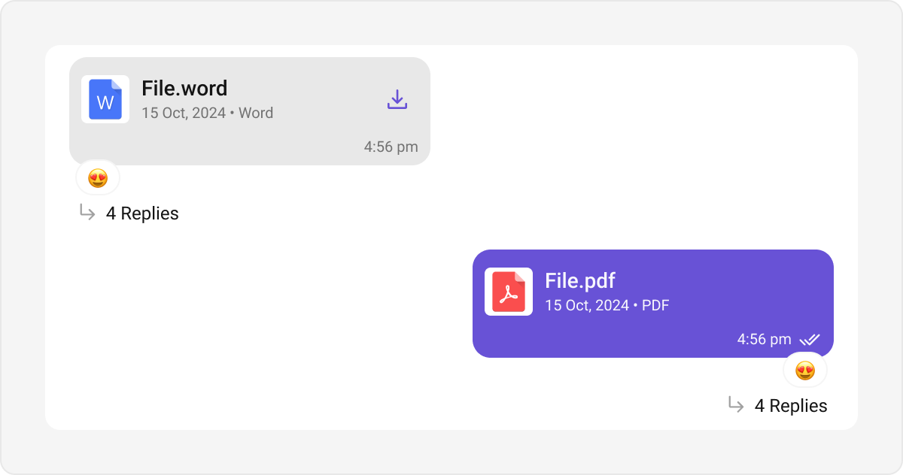

**Customization**

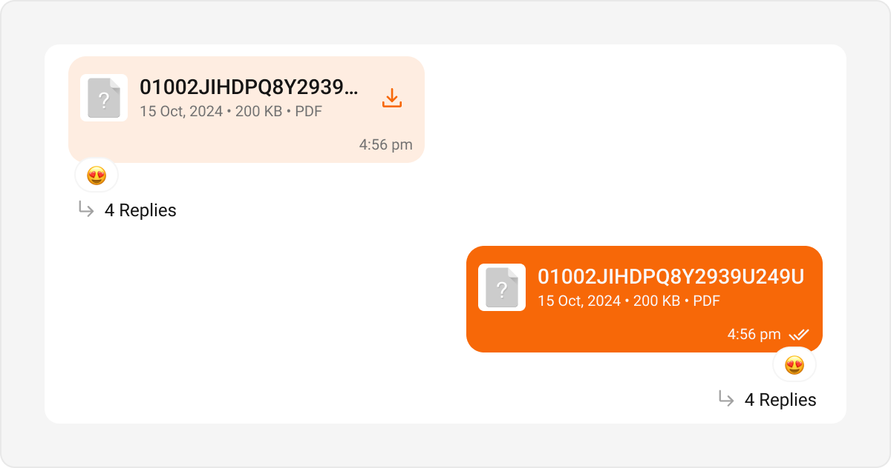

**Customizing Incoming Bubble**
```xml
<!-- themes.xml -->
<style name="CustomIncomingFileBubbleStyle" parent="CometChatIncomingFileBubbleStyle">
    <item name="cometchatFileBubbleBackgroundColor">#FEEDE1</item>
    <item name="cometchatFileBubbleFileDownloadIconTint">#F76808</item>
</style>

<style name="CustomIncomingMessageBubbleStyle" parent="CometChatIncomingMessageBubbleStyle">
    <item name="cometchatFileBubbleStyle">@style/CustomIncomingFileBubbleStyle</item>
</style>

```

```xml
<!-- themes.xml -->
<style name="AppTheme" parent="CometChatTheme.DayNight">
    <item name="cometchatIncomingMessageBubbleStyle">@style/CustomIncomingMessageBubbleStyle</item>
</style>

```
**Customizing Outgoing Bubble**
```xml
<!-- themes.xml -->
<style name="CustomOutgoingFileBubbleStyle" parent="CometChatOutgoingFileBubbleStyle">
    <item name="cometchatFileBubbleBackgroundColor">#F76808</item>
</style>

<style name="CustomOutgoingMessageBubbleStyle" parent="CometChatOutgoingMessageBubbleStyle">
    <item name="cometchatFileBubbleStyle">@style/CustomOutgoingFileBubbleStyle</item>
</style>

```

```xml
<!-- themes.xml -->
<style name="AppTheme" parent="CometChatTheme.DayNight">
    <item name="cometchatOutgoingMessageBubbleStyle">@style/CustomOutgoingMessageBubbleStyle</item>
</style>

```
To know more such attributes, visit the [attributes file](https://github.com/cometchat/cometchat-uikit-android/blob/v5/chatuikit/src/main/res/values/attr_cometchat_file_bubble.xml).

### Sticker Bubble
Sticker bubbles display stickers shared in a conversation, enhancing visual expression.

**Default**

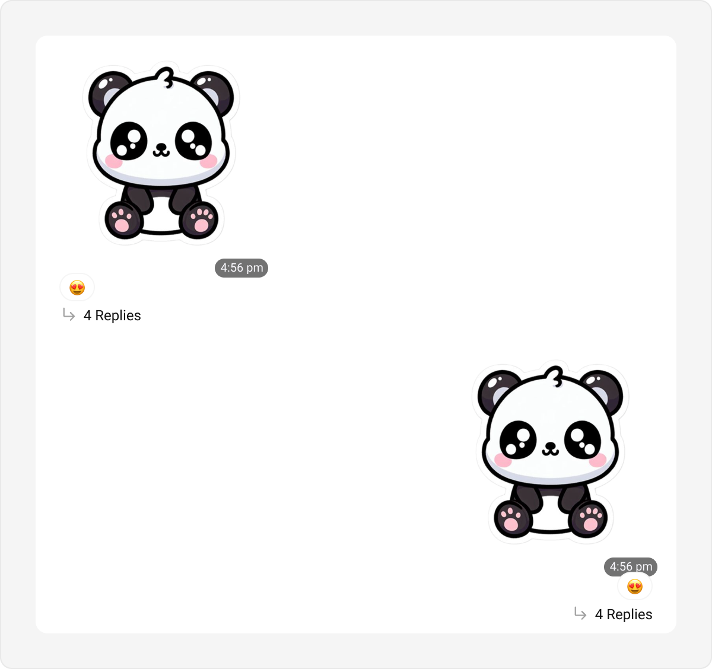

**Customization**

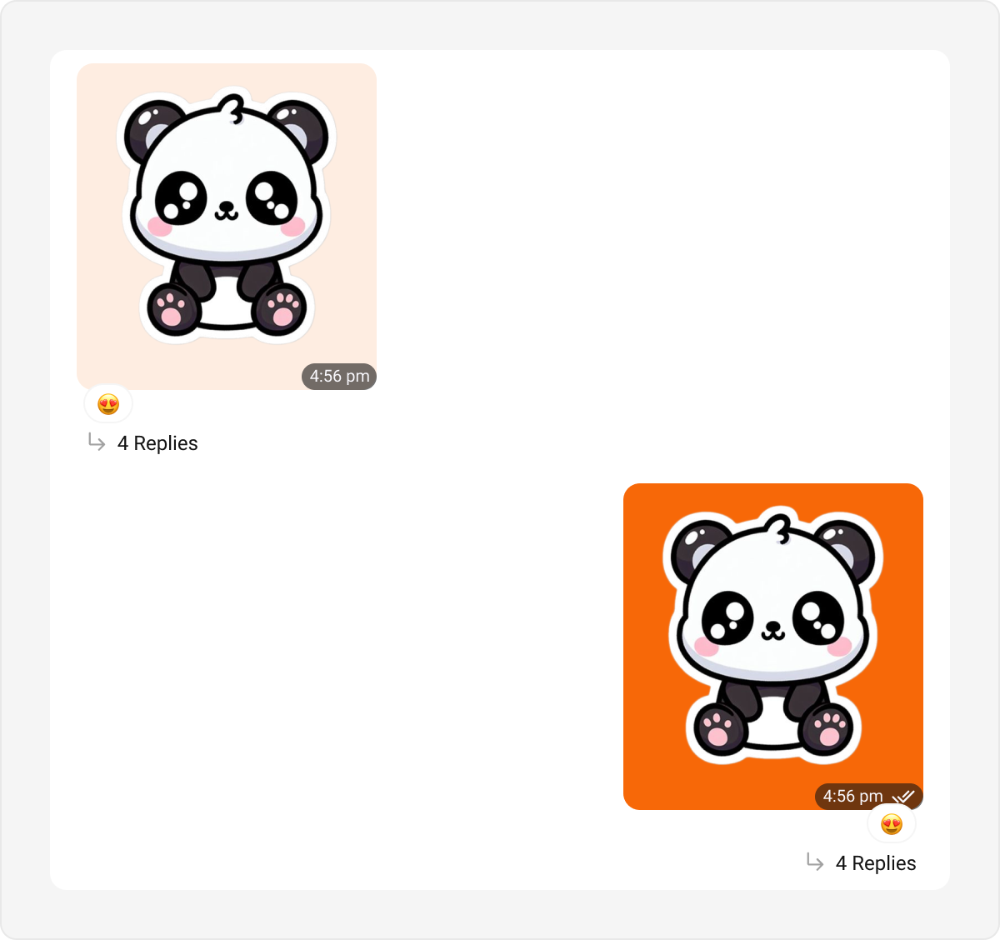

**Customizing Incoming Bubble**
```xml
<!-- themes.xml -->
<style name="CustomIncomingStickerBubbleStyle" parent="CometChatStickerBubbleStyle">
    <item name="cometchatStickerBubbleBackgroundColor">#FEEDE1</item>
</style>

<style name="CustomIncomingMessageBubbleStyle" parent="CometChatIncomingMessageBubbleStyle">
    <item name="cometchatStickerBubbleStyle">@style/CustomIncomingStickerBubbleStyle</item>
</style>

```

```xml
<!-- themes.xml -->
<style name="AppTheme" parent="CometChatTheme.DayNight">
    <item name="cometchatIncomingMessageBubbleStyle">@style/CustomIncomingMessageBubbleStyle</item>
</style>

```
**Customizing Outgoing Bubble**
```xml
<!-- themes.xml -->
<style name="CustomOutgoingStickerBubbleStyle" parent="CometChatStickerBubbleStyle">
    <item name="cometchatStickerBubbleBackgroundColor">#F76808</item>
</style>

<style name="CustomOutgoingMessageBubbleStyle" parent="CometChatOutgoingMessageBubbleStyle">
    <item name="cometchatStickerBubbleStyle">@style/CustomOutgoingStickerBubbleStyle</item>
</style>

```

```xml
<!-- themes.xml -->
<style name="AppTheme" parent="CometChatTheme.DayNight">
    <item name="cometchatOutgoingMessageBubbleStyle">@style/CustomOutgoingMessageBubbleStyle</item>
</style>

```
To know more such attributes, visit the [attributes file](https://github.com/cometchat/cometchat-uikit-android/blob/v5/chatuikit/src/main/res/values/attr_cometchat_sticker_bubble.xml).

### Poll Bubble
Poll bubbles represent polls shared within the chat, showing options and results.

**Default**

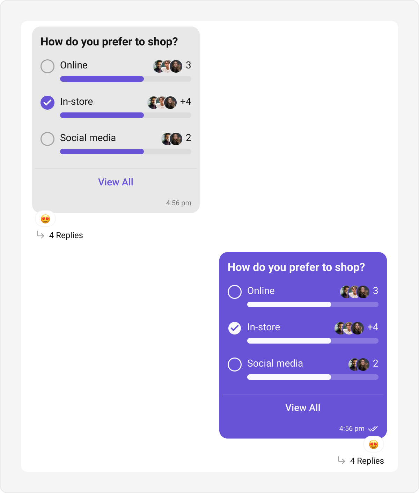

**Customization**

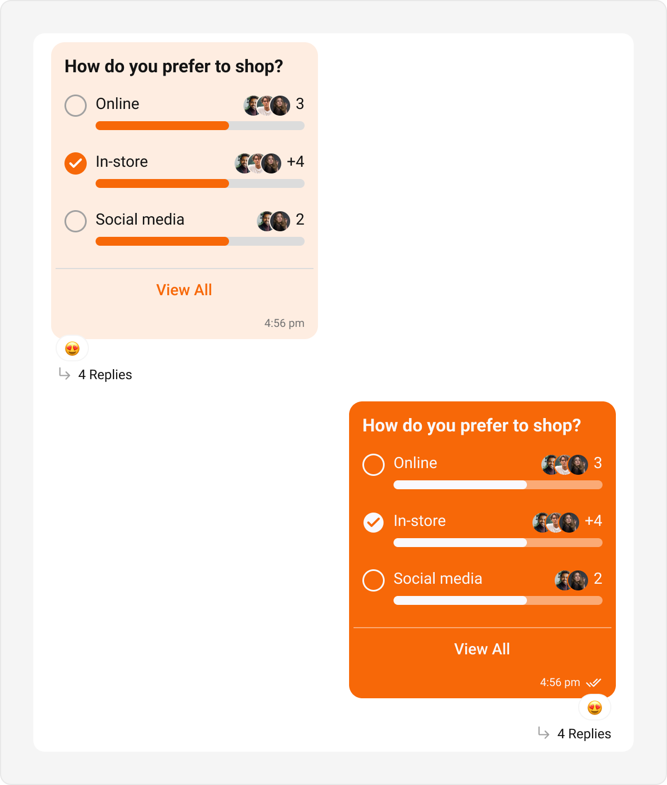

**Customizing Incoming Bubble**
```xml
<!-- themes.xml -->
<style name="CustomIncomingPollBubbleStyle" parent="CometChatIncomingPollBubbleStyle">
    <item name="cometchatPollBubbleBackgroundColor">#FEEDE1</item>
</style>

<style name="CustomIncomingMessageBubbleStyle" parent="CometChatIncomingMessageBubbleStyle">
    <item name="cometchatPollBubbleStyle">@style/CustomIncomingPollBubbleStyle</item>
</style>

```

```xml
<!-- themes.xml -->
<style name="AppTheme" parent="CometChatTheme.DayNight">
    <item name="cometchatIncomingMessageBubbleStyle">@style/CustomIncomingMessageBubbleStyle</item>
</style>

```
**Customizing Outgoing Bubble**
```xml
<!-- themes.xml -->
<style name="CustomOutgoingPollBubbleStyle" parent="CometChatOutgoingPollBubbleStyle">
    <item name="cometchatPollBubbleBackgroundColor">#F76808</item>
    <item name="cometchatPollBubbleProgressBackgroundColor">#FBAA75</item>
</style>

<style name="CustomOutgoingMessageBubbleStyle" parent="CometChatOutgoingMessageBubbleStyle">
    <item name="cometchatPollBubbleStyle">@style/CustomOutgoingPollBubbleStyle</item>
</style>

```

```xml
<!-- themes.xml -->
<style name="AppTheme" parent="CometChatTheme.DayNight">
    <item name="cometchatOutgoingMessageBubbleStyle">@style/CustomOutgoingMessageBubbleStyle</item>
</style>

```
To know more such attributes, visit the [attributes file](https://github.com/cometchat/cometchat-uikit-android/blob/v5/chatuikit/src/main/res/values/attr_cometchat_poll_bubble.xml).

### Collaborative Bubble
Collaborative bubbles display collaborative content, such as shared documents or tasks.

**Default**

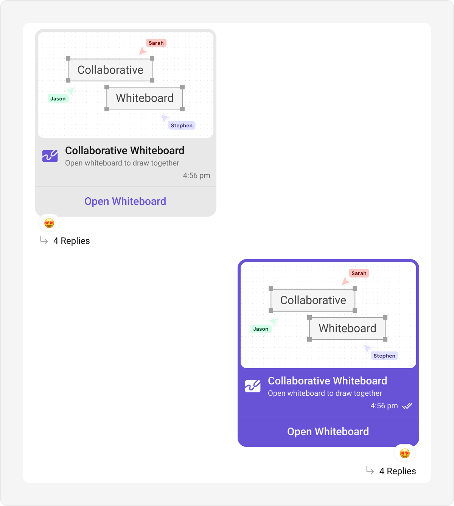

**Customization**

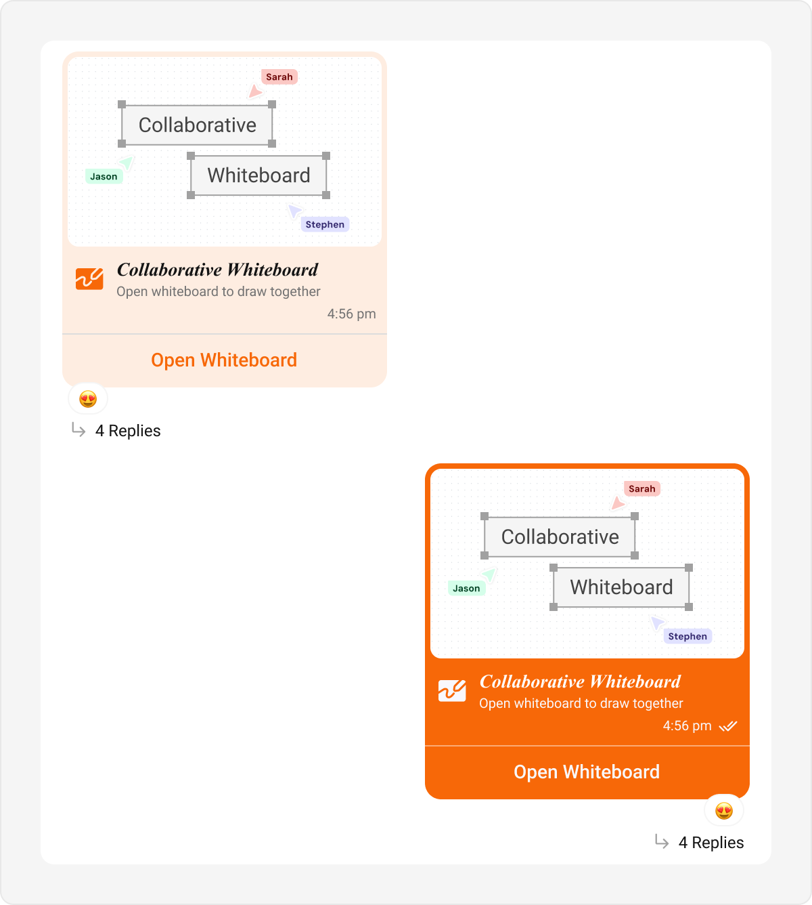

**Customizing Incoming Bubble**
```xml
<!-- themes.xml -->
<style name="CustomIncomingCollaborativeBubbleStyle" parent="CometChatIncomingCollaborativeBubbleStyle">
    <item name="cometchatCollaborativeBubbleBackgroundColor">#F76808</item>
</style>

<style name="CustomIncomingMessageBubbleStyle" parent="CometChatIncomingMessageBubbleStyle">
    <item name="cometchatCollaborativeBubbleStyle">@style/CustomIncomingCollaborativeBubbleStyle</item>
</style>

```

```xml
<!-- themes.xml -->
<style name="AppTheme" parent="CometChatTheme.DayNight">
    <item name="cometchatIncomingMessageBubbleStyle">@style/CustomIncomingMessageBubbleStyle</item>
</style>

```
**Customizing Outgoing Bubble**
```xml
<!-- themes.xml -->
<style name="CustomOutgoingCollaborativeBubbleStyle" parent="CometChatOutgoingCollaborativeBubbleStyle">
    <item name="cometchatCollaborativeBubbleBackgroundColor">#F76808</item>
    <item name="cometchatCollaborativeBubbleSeparatorColor">#FBAA75</item>
</style>

<style name="CustomOutgoingMessageBubbleStyle" parent="CometChatOutgoingMessageBubbleStyle">
    <item name="cometchatCollaborativeBubbleStyle">@style/CustomOutgoingCollaborativeBubbleStyle</item>
</style>

```

```xml
<!-- themes.xml -->
<style name="AppTheme" parent="CometChatTheme.DayNight">
    <item name="cometchatOutgoingMessageBubbleStyle">@style/CustomOutgoingMessageBubbleStyle</item>
</style>

```
To know more such attributes, visit the [attributes file](https://github.com/cometchat/cometchat-uikit-android/blob/v5/chatuikit/src/main/res/values/attr_cometchat_collaborative_bubble.xml).

### Meet Call Bubble
Meet call bubbles display call-related actions and statuses in the chat interface.

**Default**

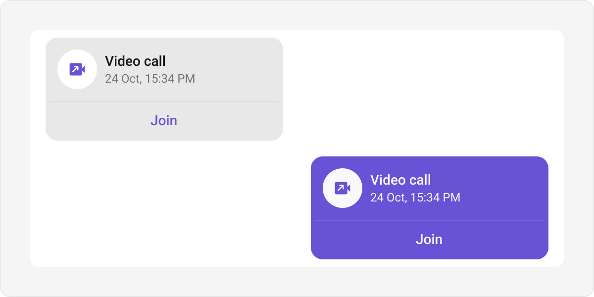

**Customization**


**Customizing Incoming Bubble**
```xml
<!-- themes.xml -->
<style name="CustomIncomingMeetCallBubbleStyle" parent="CometChatIncomingMeetCallBubbleStyle">
    <item name="cometchatMeetCallBubbleBackgroundColor">#FBAA75</item>
    <item name="cometchatMeetCallBubbleCallIconTint">#F76808</item>
</style>

<style name="CustomIncomingMessageBubbleStyle" parent="CometChatIncomingMessageBubbleStyle">
    <item name="cometchatMeetCallBubbleStyle">@style/CustomIncomingMeetCallBubbleStyle</item>
</style>

```

```xml
<!-- themes.xml -->
<style name="AppTheme" parent="CometChatTheme.DayNight">
    <item name="cometchatIncomingMessageBubbleStyle">@style/CustomIncomingMessageBubbleStyle</item>
</style>

```
**Customizing Outgoing Bubble**
```xml
<!-- themes.xml -->
<style name="CustomOutgoingMeetCallBubbleStyle" parent="CometChatOutgoingMeetCallBubbleStyle">
    <item name="cometchatMeetCallBubbleBackgroundColor">#F76808</item>
    <item name="cometchatMeetCallBubbleSeparatorColor">#FBAA75</item>
    <item name="cometchatMeetCallBubbleCallIconTint">#F76808</item>
</style>

<style name="CustomOutgoingMessageBubbleStyle" parent="CometChatOutgoingMessageBubbleStyle">
    <item name="cometchatMeetCallBubbleStyle">@style/CustomOutgoingMeetCallBubbleStyle</item>
</style>

```

```xml
<!-- themes.xml -->
<style name="AppTheme" parent="CometChatTheme.DayNight">
    <item name="cometchatOutgoingMessageBubbleStyle">@style/CustomOutgoingMessageBubbleStyle</item>
</style>

```
To know more such attributes, visit the [attributes file](https://github.com/cometchat/cometchat-uikit-android/blob/v5/chatuikit/src/main/res/values/attr_cometchat_meet_call_bubble.xml).

### Delete Bubble
Delete bubbles are used to display messages that have been deleted by the sender. These indicate the message removal within the chat interface.

**Default**

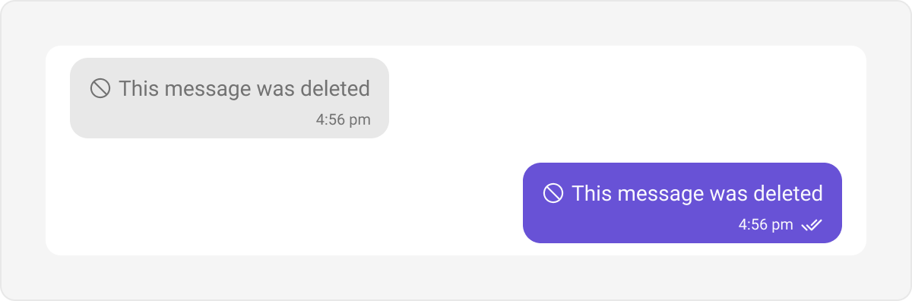

**Customization**

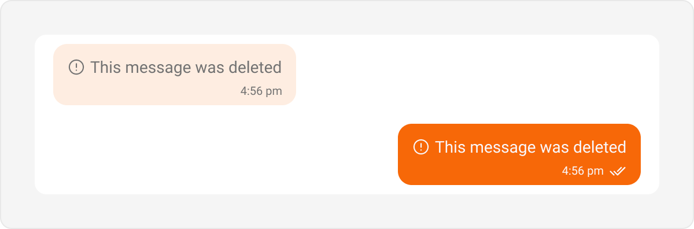

**Customizing Incoming Bubble**
```xml
<!-- themes.xml -->
<style name="CustomIncomingDeleteBubbleStyle" parent="CometChatIncomingDeleteBubbleStyle">
    <item name="cometchatMessageBubbleBackgroundColor">#FBAA75</item>
</style>

<style name="CustomIncomingMessageBubbleStyle" parent="CometChatIncomingMessageBubbleStyle">
    <item name="cometchatDeleteBubbleStyle">@style/CustomIncomingDeleteBubbleStyle</item>
</style>

```

```xml
<!-- themes.xml -->
<style name="AppTheme" parent="CometChatTheme.DayNight">
    <item name="cometchatIncomingMessageBubbleStyle">@style/CustomIncomingMessageBubbleStyle</item>
</style>

```
**Customizing Outgoing Bubble**
```xml
<!-- themes.xml -->
<style name="CustomOutgoingDeleteBubbleStyle" parent="CometChatOutgoingDeleteBubbleStyle">
        <item name="cometchatMessageBubbleBackgroundColor">#F76808</item>
</style>

<style name="CustomOutgoingMessageBubbleStyle" parent="CometChatOutgoingMessageBubbleStyle">
    <item name="cometchatDeleteBubbleStyle">@style/CustomOutgoingDeleteBubbleStyle</item>
</style>

```

```xml
<!-- themes.xml -->
<style name="AppTheme" parent="CometChatTheme.DayNight">
    <item name="cometchatOutgoingMessageBubbleStyle">@style/CustomOutgoingMessageBubbleStyle</item>
</style>

```
To know more such attributes, visit the [attributes file](https://github.com/cometchat/cometchat-uikit-android/blob/v5/chatuikit/src/main/res/values/attr_cometchat_delete_bubble.xml).

### Call Action Bubble
Call action bubbles display call-related actions, such as missed calls, in the chat interface.

**Default**

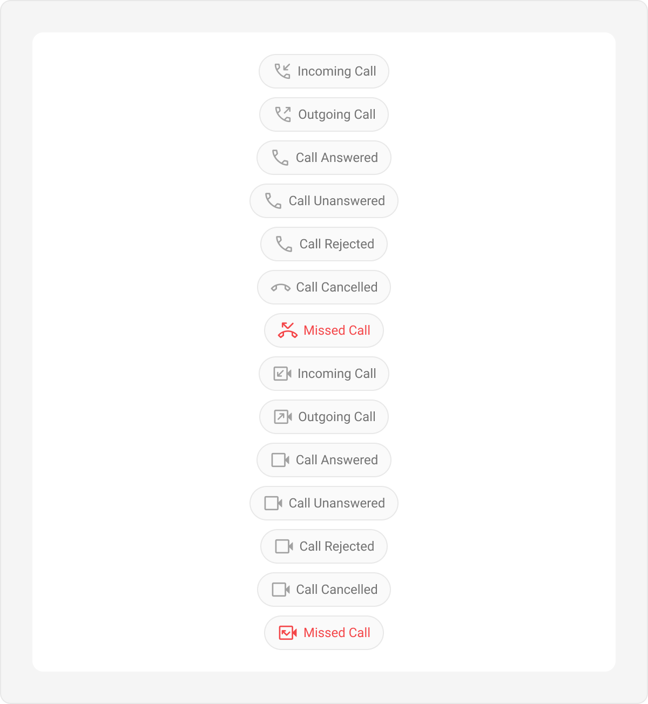

**Customization**

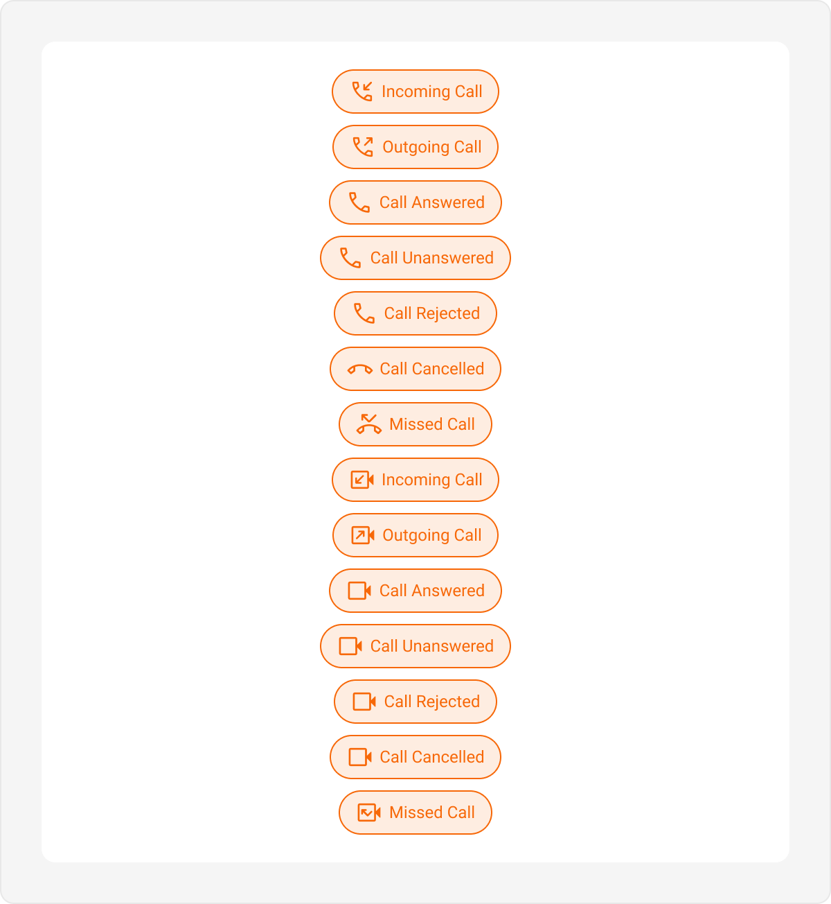

**Customizing Bubble**
```xml
<!-- themes.xml -->
<style name="CustomCallActionBubbleStyle" parent="CometChatCallActionBubbleStyle">
    <item name="cometchatCallActionBubbleBackgroundColor">#FEEDE1</item>
    <item name="cometchatCallActionBubbleStrokeWidth">@dimen/cometchat_1dp</item>
    <item name="cometchatCallActionBubbleStrokeColor">#F76808</item>
    <item name="cometchatCallActionBubbleTextColor">#F76808</item>
    <item name="cometchatCallActionBubbleIconTint">#F76808</item>
    <item name="cometchatCallActionBubbleMissedCallBackgroundColor">#FEEDE1</item>
    <item name="cometchatCallActionBubbleMissedCallIconTint">#F76808</item>
    <item name="cometchatCallActionBubbleMissedCallTextColor">#F76808</item>
</style>

<style name="CustomCometChatMessageListStyle" parent="CometChatMessageListStyle">
    <item name="cometchatMessageListCallActionBubbleStyle">@style/CustomCallActionBubbleStyle</item>
</style>

```

```xml
<!-- themes.xml -->
<style name="AppTheme" parent="CometChatTheme.DayNight">
    <item name="cometchatMessageListStyle">@style/CustomCometChatMessageListStyle</item>
</style>

```
To know more such attributes, visit the [attributes file](https://github.com/cometchat/cometchat-uikit-android/blob/v5/chatuikit/src/main/res/values/attr_cometchat_call_action_bubble.xml).

### Action Bubble
Action bubbles provide a customizable interface for displaying a variety of actions, such as group actions, within a chat.

**Default**

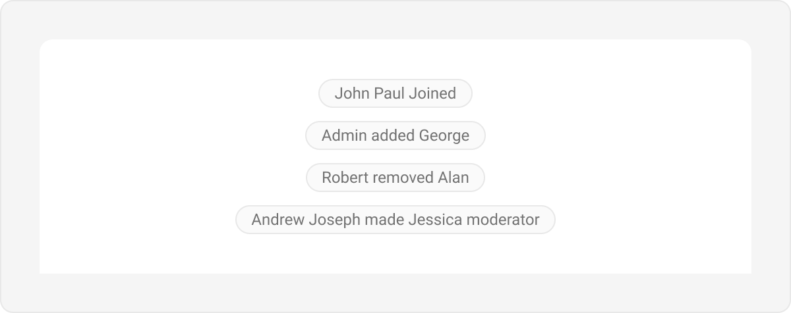

**Customization**

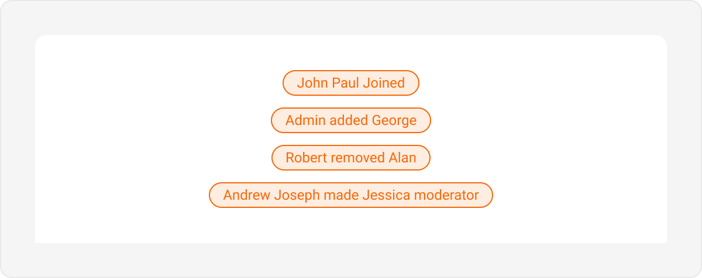

**Customizing Bubble**
```xml
<!-- themes.xml -->
<style name="CustomActionBubbleStyle" parent="CometChatActionBubbleStyle">
    <item name="cometchatActionBubbleBackgroundColor">#FEEDE1</item>
    <item name="cometchatActionBubbleStrokeWidth">@dimen/cometchat_1dp</item>
    <item name="cometchatActionBubbleStrokeColor">#F76808</item>
    <item name="cometchatActionBubbleTextColor">#F76808</item>
</style>

<style name="CustomCometChatMessageListStyle" parent="CometChatMessageListStyle">
    <item name="cometchatMessageListActionBubbleStyle">@style/CustomActionBubbleStyle</item>
</style>

```

```xml
<!-- themes.xml -->
<style name="AppTheme" parent="CometChatTheme.DayNight">
    <item name="cometchatMessageListStyle">@style/CustomCometChatMessageListStyle</item>
</style>

```
To know more such attributes, visit the [attributes file](https://github.com/cometchat/cometchat-uikit-android/blob/v5/chatuikit/src/main/res/values/attr_cometchat_action_bubble.xml).