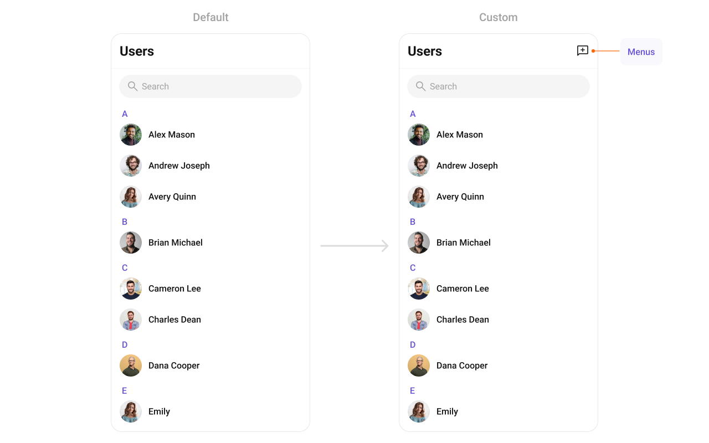

import Tabs from '@theme/Tabs';
import TabItem from '@theme/TabItem';

## Overview

The Users is a [Component](./01-components-overview.md#components), showcasing an accessible list of all available users. It provides an integral search functionality, allowing you to locate any specific user swiftly and easily. For each user listed, the widget displays the user's name by default, in conjunction with their avatar when available. Furthermore, it includes a status indicator, visually informing you whether a user is currently online or offline.


---

## Usage

### Integration

The following code snippet illustrates how you can directly incorporate the Users component into your `layout.xml` file.

<Tabs>
<TabItem value="xml" label="XML">

```xml
<com.cometchat.chatuikit.users.CometChatUsers
        android:layout_width="match_parent"
        android:layout_height="match_parent"
        android:id="@+id/users"
        />
```

</TabItem>
</Tabs>

### Actions

[Actions](./01-components-overview.md#actions) dictate how a component functions. They are divided into two types: Predefined and User-defined. You can override either type, allowing you to tailor the behavior of the component to fit your specific needs.

##### setOnItemClick

Function invoked when a user item is clicked, typically used to open a user profile or chat screen.

<Tabs>

<TabItem value="java" label="Java">
```java title="YourActivity.java"
cometchatUsers.setOnItemClick((view1, position, user) -> {
            
    });
```
</TabItem>

<TabItem value="kotlin" label="Kotlin">

```kotlin title="YourActivity.kt"
cometchatUsers.onItemClick = OnItemClick { view, position, user ->
            
    }
```

</TabItem>
</Tabs>

---

##### setOnItemLongClick
Function executed when a user item is long-pressed, allowing additional actions like delete or block.

<Tabs>

<TabItem value="java" label="Java">
```java title="YourActivity.java"
cometchatUsers.setOnItemLongClick((view1, position, user) -> {

    });
```
</TabItem>

<TabItem value="kotlin" label="Kotlin">

```kotlin title="YourActivity.kt"
cometchatUsers.onItemLongClick = OnItemLongClick({ view, position, user ->
            
    })
```

</TabItem>
</Tabs>

---

##### setOnBackPressListener

`OnBackPressListener` is triggered when you press the back button in the app bar. It has a predefined behavior; when clicked, it navigates to the previous activity. However, you can override this action using the following code snippet.

<Tabs>

<TabItem value="java" label="Java">
```java title="YourActivity.java"
cometchatUsers.setOnBackPressListener(() -> {
            
    });
```
</TabItem>

<TabItem value="kotlin" label="Kotlin">

```kotlin title="YourActivity.kt"
cometchatUsers.onBackPressListener = OnBackPress {

    }
```
</TabItem>
</Tabs>

---

##### setOnSelect

Called when a item from the fetched list is selected, useful for multi-selection features.

<Tabs>

<TabItem value="java" label="Java">

```java title="YourActivity.java"
cometchatUsers.setOnSelect(t -> {

    });
```
</TabItem>

<TabItem value="kotlin" label="Kotlin">

```kotlin title="YourActivity.kt"
cometchatUsers.setOnSelect(object : OnSelection<User?> {
        override fun onSelection(t: MutableList<User?>?) {
                
        }
    })
```

</TabItem>

</Tabs>

---

##### OnError

This action doesn't change the behavior of the component but rather listens for any errors that occur in the Users component.

<Tabs>

<TabItem value="java" label="Java">
```java title="YourActivity.java"
cometchatUsers.setOnError(cometchatException -> {

    });
```
</TabItem>

<TabItem value="kotlin" label="Kotlin">

```kotlin title="YourActivity.kt"
cometchatUsers.setOnError {

    }
```

</TabItem>

</Tabs>

---

##### setOnLoad
Invoked when the list is successfully fetched and loaded, helping track component readiness.

<Tabs>

<TabItem value="java" label="Java">

```java title="YourActivity.java"
cometchatUsers.setOnLoad(list -> {

});
```
</TabItem>

<TabItem value="kotlin" label="Kotlin">

```kotlin title="YourActivity.kt"
cometchatUsers.setOnLoad(object : OnLoad<User?> {
    override fun onLoad(list: MutableList<User?>?) {

    }
})
```

</TabItem>

</Tabs>
---

##### setOnEmpty
Called when the list is empty, enabling custom handling such as showing a placeholder message.


<Tabs>

<TabItem value="java" label="Java">

```java title="YourActivity.java"
cometchatUsers.setOnEmpty(() -> {
            
    });
```
</TabItem>

<TabItem value="kotlin" label="Kotlin">

```kotlin title="YourActivity.kt"
cometchatUsers.setOnEmpty{
            
    }
```

</TabItem>

</Tabs>
---

### Filters

**Filters** allow you to customize the data displayed in a list within a Component. You can filter the list based on your specific criteria, allowing for a more customized. Filters can be applied using RequestBuilders of Chat SDK.

##### 1. UserRequestBuilder

The [UserRequestBuilder](/sdk/android/retrieve-users) enables you to filter and customize the user list based on available parameters in UserRequestBuilder. This feature allows you to create more specific and targeted queries when fetching users. The following are the parameters available in [UserRequestBuilder](/sdk/android/retrieve-users)

| Methods              | Type               | Description                                                                            |
| -------------------- | ------------------ | -------------------------------------------------------------------------------------- |
| **setLimit**         | int                | sets the number users that can be fetched in a single request, suitable for pagination |
| **setSearchKeyword** | String             | used for fetching users matching the passed string                                     |
| **hideBlockedUsers** | bool               | used for fetching all those users who are not blocked by the logged in user            |
| **friendsOnly**      | bool               | used for fetching only those users in which logged in user is a member                 |
| **setRoles**         | List&lt;String&gt; | used for fetching users containing the passed tags                                     |
| **setTags**          | List&lt;String&gt; | used for fetching users containing the passed tags                                     |
| **withTags**         | bool               | used for fetching users containing tags                                                |
| **setUserStatus**    | String             | used for fetching users by their status online or offline                              |
| **setUIDs**          | List&lt;String&gt; | used for fetching users containing the passed users                                    |

**Example**

In the example below, we are applying a filter to the UserList based on Friends.

<Tabs>
<TabItem value="java" label="Java">

```Java
UsersRequest.UsersRequestBuilder builder=new UsersRequest.UsersRequestBuilder()
                .friendsOnly(false)
                        .setLimit(10);
cometChatUsers.setUsersRequestBuilder(builder);
```

</TabItem>

<TabItem value="kotlin" label="Kotlin">

```kotlin
val builder = UsersRequest.UsersRequestBuilder()
            .friendsOnly(false)
            .setLimit(10)
cometChatUsers.setUsersRequestBuilder(builder)
```

</TabItem>
</Tabs>

##### 2. SearchRequestBuilder

The SearchRequestBuilder uses [UserRequestBuilder](/sdk/android/retrieve-users) enables you to filter and customize the search list based on available parameters in UserRequestBuilder.
This feature allows you to keep uniformity between the displayed UserList and searched UserList.

**Example**

<Tabs>
<TabItem value="java" label="Java">

```Java
UsersRequest.UsersRequestBuilder builder = new UsersRequest.UsersRequestBuilder()
        .setSearchKeyword("**");
users.setSearchRequestBuilder(builder);
```

</TabItem>

<TabItem value="kotlin" label="Kotlin">

```kotlin
val builder = UsersRequest.UsersRequestBuilder()
    .setSearchKeyword("**")
users.searchRequestBuilder = builder
```

</TabItem>
</Tabs>

### Events

[Events](./01-components-overview.md#events) are emitted by a `Component`. By using event you can extend existing functionality. Being global events, they can be applied in Multiple Locations and are capable of being Added or Removed.

To handle events supported by Users you have to add corresponding listeners by using `CometChatUserEvents`

| Events          | Description                                                           |
| --------------- | --------------------------------------------------------------------- |
| ccUserBlocked   | This will get triggered when the logged in user blocks another user   |
| ccUserUnblocked | This will get triggered when the logged in user unblocks another user |

<Tabs>
<TabItem value="java" label="Java">

```Java
CometChatUserEvents.addUserListener("LISTENER_TAG", new CometChatUserEvents() {
            @Override
            public void ccUserBlocked(User user) {
                super.ccUserBlocked(user);
            }

            @Override
            public void ccUserUnblocked(User user) {
                super.ccUserUnblocked(user);
            }
        });
```
```Java title="Remove Listener"
CometChatUserEvents.removeListener("YOUR_LISTENER_TAG");
```
</TabItem>

<TabItem value="kotlin" label="Kotlin">

```kotlin
CometChatUserEvents.addUserListener("LISTENER_TAG", object : CometChatUserEvents() {
            override fun ccUserBlocked(user: User?) {
                super.ccUserBlocked(user)
            }

            override fun ccUserUnblocked(user: User?) {
                super.ccUserUnblocked(user)
            }
        })
```
```kotlin title="Remove Listener"
 CometChatUserEvents.removeListener("LISTENER_TAG");
```
</TabItem>
</Tabs>

## Customization

To fit your app's design requirements, you can customize the appearance of the User component. We provide exposed methods that allow you to modify the experience and behavior according to your specific needs.

### Style

Using Style you can customize the look and feel of the component in your app, These parameters typically control elements such as the color, size, shape, and fonts used within the component.

You can set the styling object to the `CometChatUsers` Component to customize the styling.


```xml title="themes.xml"
    <style name="CustomAvatarStyle" parent="CometChatAvatarStyle">
        <item name="cometchatAvatarStrokeRadius">8dp</item>
        <item name="cometchatAvatarBackgroundColor">#FBAA75</item>
    </style>
    <style name="CustomUsersStyle" parent="CometChatUsersStyle">
        <item name="cometchatUsersAvatarStyle">@style/CustomAvatarStyle</item>
        <item name="cometchatUsersSeparatorColor">#F76808</item>
        <item name="cometchatUsersTitleTextColor">#F76808</item>
    </style>
```

<Tabs>

<TabItem value="java" label="Java">

```java
cometChatUsers.setStyle(R.style.CustomUsersStyle);
```

</TabItem>

<TabItem value="Kotlin" label="Kotlin">

```kotlin
cometChatUsers.setStyle(R.style.CustomUsersStyle)
```

</TabItem>

</Tabs>

---
To know more such attributes, visit the [attributes file](https://github.com/cometchat/cometchat-uikit-android/blob/v5/chatuikit/src/main/res/values/attr_cometchat_users.xml).

### Functionality

These are a set of small functional customizations that allow you to fine-tune the overall experience of the component. With these, you can toggle the visibility of UI elements.

Below is a list of customizations along with corresponding code snippets

| Methods               | Description                                                                                                                                                                            | Code                                                          |
| ---------------------- | -------------------------------------------------------------------------------------------------------------------------------------------------------------------------------------- | ------------------------------------------------------------- |
| setBackIconVisibility       | Used to toggle visibility for back button in the app bar                                                                                                                               | `.setBackIconVisibility(View.VISIBLE);`                                      |
| setToolbarVisibility       | Used to toggle visibility for back button in the app bar                                                                                                                               | `.setToolbarVisibility(View.GONE);`                                      |
| setStickyHeaderVisibility       | Used to toggle visibility for back button in the app bar                                                                                                                               | `.setStickyHeaderVisibility(View.GONE);`                                      |
| setErrorStateVisibility            | Used to hide error state on fetching Users                                                                                                                                           | `.setErrorStateVisibility(View.GONE);`                                          |
| setEmptyStateVisibility            | Used to hide empty state on fetching Users                                                                                                                                           | `.setEmptyStateVisibility(View.GONE);`                                          |
| setLoadingStateVisibility            | Used to hide loading state while fetching Users                                                                                                                                           | `.setLoadingStateVisibility(View.GONE);`                                          |
| setSeparatorVisibility          | Used to control visibility of Separators in the list view                                                                                                                              | `.setSeparatorVisibility(View.GONE);`                                      |
| setUsersStatusVisibility | Used to control visibility of status indicator shown if user is online                                                                                                                 | `.setUsersStatusVisibility(View.GONE);`                               |
| setSelectionMode     | This method determines the selection mode for Users, enabling users to select either a single User or multiple Users at once.                            | `.setSelectionMode(UIKitConstants.SelectionMode.MULTIPLE);`                                     |
| setSearchkeyword     | Used for fetching users matching the passed keywords                      | `.setSearchkeyword("anything");`                                     |
| setSearchBoxVisibility       | Used to hide search box shown in the tool bar                | `.setSearchBoxVisibility(View.GONE);`                                     |
---

### Advanced

For advanced-level customization, you can set custom views to the component. This lets you tailor each aspect of the component to fit your exact needs and application aesthetics. You can create and define your views, layouts, and UI elements and then incorporate those into the component.

---

#### setOptions
This method sets a predefined list of actions that users can perform when they long press a user in the list. These options typically include:

- Muting notifications for a specific user

By customizing these options, developers can provide a streamlined and contextually relevant user experience.


<Tabs>

<TabItem value="java" label="Java">

```Java
cometchatUsers.setOptions((context, user) -> Collections.emptyList());
````

</TabItem>

<TabItem value="kotlin" label="Kotlin">
```kotlin
cometchatUsers.options = Function2<Context?, User?, List<CometChatPopupMenu.MenuItem?>?> { context, user -> emptyList<CometChatPopupMenu.MenuItem?>() }
```
</TabItem>

</Tabs>
---

#### addOptions
This method extends the existing set of actions available when users long press a user item. Unlike setOptionsDefines, which replaces the default options, addOptionsAdds allows developers to append additional actions without removing the default ones. Example use cases include:

- Adding a "Report Spam" action
- Introducing a "Save to Notes" option
- Integrating third-party actions such as "Share to Cloud Storage"

This method provides flexibility in modifying user interaction capabilities.


<Tabs>

<TabItem value="java" label="Java">

```Java
cometchatUsers.addOptions((context, user) -> Collections.emptyList());
````

</TabItem>

<TabItem value="kotlin" label="Kotlin">
```kotlin
cometchatUsers.addOptions { context, user -> emptyList<CometChatPopupMenu.MenuItem?>() }
```
</TabItem>

</Tabs>

---

#### setLoadingView
This method allows developers to set a custom loading view that is displayed when data is being fetched or loaded within the component. Instead of using a default loading spinner, a custom animation, progress bar, or branded loading screen can be displayed.

Use cases:

- Showing a skeleton loader for users while data loads
- Displaying a custom progress indicator with branding
- Providing an animated loading experience for a more engaging UI


<Tabs>

<TabItem value="java" label="Java">
```Java
cometchatUsers.setLoadingView(R.layout.your_loading_view);
````
</TabItem>

<TabItem value="kotlin" label="Kotlin">
```kotlin
cometchatUsers.loadingView = R.layout.your_loading_view
```
</TabItem>

</Tabs>

---

#### setEmptyView
Configures a custom view to be displayed when there are no users. This improves the user experience by providing meaningful content instead of an empty screen.

Examples:

- Displaying a message like "No users yet. Start a new chat!"
- Showing an illustration or animation to make the UI visually appealing
- Providing a button to start a new user


<Tabs>

<TabItem value="java" label="Java">
```Java
cometchatUsers.setEmptyView(R.layout.your_empty_view);
````

</TabItem>

<TabItem value="kotlin" label="Kotlin">
```kotlin
cometchatUsers.emptyView = R.layout.your_empty_view
```
</TabItem>

</Tabs>

---

#### setErrorView
Defines a custom error state view that appears when an issue occurs while loading users or messages. This enhances the user experience by displaying friendly error messages instead of generic system errors.

Common use cases:

- Showing "Something went wrong. Please try again." with a retry button
- Displaying a connection issue message if the user is offline
- Providing troubleshooting steps for the error


<Tabs>

<TabItem value="java" label="Java">

```Java
cometchatUsers.setErrorView(R.layout.your_empty_view);
````

</TabItem>

<TabItem value="kotlin" label="Kotlin">
```kotlin
cometchatUsers.errorView = R.layout.your_error_view
```
</TabItem>

</Tabs>

---

#### setLeadingView
This method allows developers to set a custom leading view element that appears at the beginning of each user item. Typically, this space is used for profile pictures, avatars, or user badges.

Use Cases:
- Profile Pictures & Avatars – Display user profile images with online/offline indicators.
- Custom Icons or Badges – Show role-based badges (Admin, VIP, Verified) before the user name.
- Status Indicators – Add an active status ring or colored border based on availability.

<Tabs>

<TabItem value="java" label="Java">

```Java
cometchatUsers.setLeadingView(new UsersViewHolderListener() {
            @Override
            public View createView(Context context, CometchatListBaseItemsBinding listItem) {
                return null;
            }

            @Override
            public void bindView(Context context, View createdView, User user, RecyclerView.ViewHolder holder, List<User> userList, int position) {

            }
        });
```

</TabItem>

<TabItem value="kotlin" label="Kotlin">

```kotlin
cometchatUsers.setLeadingView(object: UsersViewHolderListener {
    override fun createView(context: Context, cometChatListItem: CometChatListItem): View? {
        return null
    }

    override fun bindView(context: Context, view: View, user: User, viewHolder: RecyclerView.ViewHolder, list: List<User>, i: Int) {
    }
})
```

</TabItem>

</Tabs>

---

#### setTitleView
This method customizes the title view of each user item, which typically displays the user’s name. It allows for styling modifications, additional metadata, or inline action buttons.

Use Cases:
- Styled Usernames – Customize fonts, colors, or text sizes for the name display.
- Additional Metadata – Show extra details like username handles or job roles.
- Inline Actions – Add a follow button or verification checkmark next to the name.

<Tabs>

<TabItem value="java" label="Java">

```Java
cometchatUsers.setTitleView(new UsersViewHolderListener() {
            @Override
            public View createView(Context context, CometchatListBaseItemsBinding listItem) {
                return null;
            }

            @Override
            public void bindView(Context context, View createdView, User user, RecyclerView.ViewHolder holder, List<User> userList, int position) {

            }
        });
```

</TabItem>

<TabItem value="kotlin" label="Kotlin">

```kotlin
cometchatUsers.setTitleView(object: UsersViewHolderListener {
    override fun createView(context: Context, cometChatListItem: CometChatListItem): View? {
        return null
    }

    override fun bindView(context: Context, view: View, user: User, viewHolder: RecyclerView.ViewHolder, list: List<User>, i: Int) {
    }
})
```

</TabItem>

</Tabs>

---

#### setTrailingView
This method allows developers to customize the trailing (right-end) section of each user item, typically used for actions like buttons, icons, or extra information.

Use Cases:
- Quick Actions – Add a follow/unfollow button.
- Notification Indicators – Show unread message counts or alert icons.
- Custom Info Display – Display last active time or mutual connections.

<Tabs>

<TabItem value="java" label="Java">

```Java
cometchatUsers.setTrailingView(new UsersViewHolderListener() {
            @Override
            public View createView(Context context, CometchatListBaseItemsBinding listItem) {
                return null;
            }

            @Override
            public void bindView(Context context, View createdView, User user, RecyclerView.ViewHolder holder, List<User> userList, int position) {

            }
        });
```

</TabItem>

<TabItem value="kotlin" label="Kotlin">

```kotlin
cometchatUsers.setTrailingView(object: UsersViewHolderListener {
    override fun createView(context: Context, cometChatListItem: CometChatListItem): View? {
        return null
    }

    override fun bindView(context: Context, view: View, user: User, viewHolder: RecyclerView.ViewHolder, list: List<User>, i: Int) {
    }
})
```

</TabItem>

</Tabs>
---

#### setItemView

This method allows developers to assign a fully custom ListItem layout to the Users component, replacing the default design. It provides complete control over the appearance and structure of each user item in the list.

Use Cases:
- Customizing User Display – Modify how user information (name, avatar, status) is presented.
- Adding Action Buttons – Include follow, message, or call buttons directly in the item view.
- Highlighting User Roles – Display user badges such as Admin, Moderator, or VIP.

<Tabs>

<TabItem value="java" label="Java">

```Java
 cometchatUsers.seItemView(new UsersViewHolderListener() {
            @Override
            public View createView(Context context, CometchatListBaseItemsBinding listItem) {
                return null;
            }

            @Override
            public void bindView(Context context, View createdView, User user, RecyclerView.ViewHolder holder, List<User> userList, int position) {

            }
        });
```

</TabItem>

<TabItem value="kotlin" label="Kotlin">

```kotlin
cometchatUsers.setItemView(object: UsersViewHolderListener {
    override fun createView(context: Context, cometChatListItem: CometChatListItem): View? {
        return null
    }

    override fun bindView(context: Context, view: View, user: User, viewHolder: RecyclerView.ViewHolder, list: List<User>, i: Int) {
    }
})
```

</TabItem>

</Tabs>

**Example**


You can indeed create a custom layout file named `custom_list_item_view.xml` for more complex or unique list items.

Once this layout file is made, you would inflate it inside the `createView()` method of the `UsersViewHolderListener`. The inflation process prepares the layout for use in your application:

Following this, you would use the `bindView()` method to initialize and assign values to your individual views. This could include setting text on TextViews, images on ImageViews, and so on based on the properties of the User object:

```xml title="custom_list_item_view.xml"
<?xml version="1.0" encoding="utf-8"?>
<LinearLayout xmlns:android="http://schemas.android.com/apk/res/android"
    xmlns:app="http://schemas.android.com/apk/res-auto"
    android:id="@+id/parent_lay"
    android:layout_width="match_parent"
    android:layout_height="wrap_content"
    android:orientation="vertical">

    <LinearLayout
        android:layout_width="match_parent"
        android:layout_height="wrap_content"
        android:layout_marginStart="@dimen/cometchat_padding_4"
        android:layout_marginTop="@dimen/cometchat_padding_3"
        android:layout_marginEnd="@dimen/cometchat_padding_4"
        android:layout_marginBottom="@dimen/cometchat_padding_3"
        android:gravity="center_vertical"
        android:orientation="horizontal">

        <androidx.constraintlayout.widget.ConstraintLayout
            android:id="@+id/leading_view"
            android:layout_width="@dimen/cometchat_45dp"
            android:layout_height="@dimen/cometchat_45dp">

            <com.cometchat.chatuikit.shared.views.cometchatavatar.CometChatAvatar
                android:id="@+id/custom_avatar"
                android:layout_width="match_parent"
                android:layout_height="match_parent"
                app:cometchatAvatarPlaceHolderTextAppearance="@style/CometChatTextAppearanceHeading4.Bold"
                app:cometchatAvatarStrokeRadius="@dimen/cometchat_8dp" />

        </androidx.constraintlayout.widget.ConstraintLayout>

        <TextView
            android:id="@+id/tvName"
            android:layout_width="0dp"
            android:layout_height="wrap_content"
            android:layout_marginStart="@dimen/cometchat_margin_3"
            android:layout_weight="1"
            android:textAppearance="@style/CometChatTextAppearanceHeading4.Medium" />

    </LinearLayout>

    <View
        android:layout_width="match_parent"
        android:layout_height="1dp"
        android:background="?attr/cometchatStrokeColorLight" />

</LinearLayout>
```

<Tabs>

<TabItem value="java" label="Java">
```java title="YourActivity.java"
binding.users.setListItemView(new UsersViewHolderListener() {
            @Override
            public View createView(Context context, CometchatListBaseItemsBinding listItem) {
                return LayoutInflater.from(context).inflate(R.layout.custom_list_item_view, null, false);
            }

            @Override
            public void bindView(Context context, View createdView, User user, RecyclerView.ViewHolder holder, List<User> userList, int position) {
                CometChatAvatar avatar = createdView.findViewById(R.id.custom_avatar);
                TextView title = createdView.findViewById(R.id.tvName);
                LinearLayout parentLayout = createdView.findViewById(R.id.parent_lay);
                String name = user.getName();
                title.setText(name);
                avatar.setStyle(com.cometchat.chatuikit.R.style.CometChatAvatarStyle);
                avatar.setAvatarPlaceHolderTextAppearance(com.cometchat.chatuikit.R.style.CometChatTextAppearanceHeading4_Bold);
                avatar.setAvatar(name,user.getAvatar());
                if(user.getStatus().equals(UIKitConstants.UserStatus.ONLINE)) {
                    parentLayout.setBackgroundColor(Color.parseColor("#E6F4ED"));
                } else {
                    parentLayout.setBackgroundColor(Color.parseColor("#00000000"));
                }

            }
        });
```
</TabItem>

<TabItem value="kotlin" label="Kotlin">

```kotlin title="YourActivity.kt"
users.setListItemView(object : UsersViewHolderListener() {
            override fun createView(
                context: Context?,
                listItem: CometchatListBaseItemsBinding?
            ): View {
                return LayoutInflater.from(context)
                    .inflate(R.layout.custom_list_item_view, null, false)
            }

            override fun bindView(
                context: Context,
                createdView: View,
                user: User,
                holder: RecyclerView.ViewHolder,
                userList: List<User>,
                position: Int
            ) {
                val avatar = createdView.findViewById<CometChatAvatar>(R.id.custom_avatar)
                val title = createdView.findViewById<TextView>(R.id.tvName)
                val parentLayout = createdView.findViewById<LinearLayout>(R.id.parent_lay)
                val name = user.name
                title.text = name
                avatar.setStyle(com.cometchat.chatuikit.R.style.CometChatAvatarStyle)
                avatar.avatarPlaceHolderTextAppearance =
                    com.cometchat.chatuikit.R.style.CometChatTextAppearanceHeading4_Bold
                avatar.setAvatar(name, user.avatar)
                if (user.status == UIKitConstants.UserStatus.ONLINE) {
                    parentLayout.setBackgroundColor(Color.parseColor("#E6F4ED"))
                } else {
                    parentLayout.setBackgroundColor(Color.parseColor("#00000000"))
                }
            }
        })
```

</TabItem>

</Tabs>

---

#### setSubtitleView

This method customizes the subtitle view of each user item, typically shown below the user's name. It can display additional details such as user status, last seen time, or a brief bio.

Use Cases:
- Last Active Time – Show "Online Now", "Last seen 2 hours ago".
- User Status – Display status messages like "Offine", "Available".


<Tabs>

<TabItem value="java" label="Java">
```Java
cometChatUsers.setSubtitleView(new UsersViewHolderListener() {
            @Override
            public View createView(Context context, CometchatListBaseItemsBinding listItem) {
                return null;
            }

            @Override
            public void bindView(Context context, View createdView, User user, RecyclerView.ViewHolder holder, List<User> userList, int position) {

            }
        });
```
</TabItem>
<TabItem value="kotlin" label="Kotlin">

```kotlin
cometChatUsers.setSubtitleView(object : UsersViewHolderListener() {
            override fun createView(
                context: Context?,
                listItem: CometchatListBaseItemsBinding?
            ): View? {
                return null
            }

            override fun bindView(
                context: Context,
                createdView: View,
                user: User,
                holder: RecyclerView.ViewHolder,
                userList: List<User>,
                position: Int
            ) {
            }
        })
```

</TabItem>

</Tabs>

**Example**


You can indeed create a custom layout file named `subtitle_layout.xml` for more complex or unique list items.

Once this layout file is made, you would inflate it inside the `createView()` method of the `UsersViewHolderListener`. The inflation process prepares the layout for use in your application:

Following this, you would use the `bindView()` method to initialize and assign values to your individual views. This could include setting text on TextViews, images on ImageViews, and so on based on the properties of the User object:

<Tabs>

<TabItem value="java" label="Java">
```Java
cometChatUsers.setSubtitleView(new UsersViewHolderListener() {
            @Override
            public View createView(Context context, CometchatListBaseItemsBinding listItem) {
                return new TextView(context);
            }

            @Override
            public void bindView(Context context, View createdView, User user, RecyclerView.ViewHolder holder, List<User> userList, int position) {
                TextView tvSubtitle = (TextView) createdView;
                tvSubtitle.setText("Last Active at: "+new SimpleDateFormat("dd/mm/yyyy, HH:MM:SS").format(user.getLastActiveAt() * 1000));
                tvSubtitle.setTextColor(Color.BLACK);
            }
        });
```
</TabItem>
<TabItem value="kotlin" label="Kotlin">

```kotlin
cometChatUsers.setSubtitleView(object : UsersViewHolderListener() {
            override fun createView(
                context: Context?,
                listItem: CometchatListBaseItemsBinding?
            ): View {
                return TextView(context)
            }

            override fun bindView(
                context: Context,
                createdView: View,
                user: User,
                holder: RecyclerView.ViewHolder,
                userList: List<User>,
                position: Int
            ) {
                val tvSubtitle = createdView as TextView
                tvSubtitle.text =
                    "Last Active at: " + SimpleDateFormat("dd/mm/yyyy, HH:MM:SS").format(user.lastActiveAt * 1000)
                tvSubtitle.setTextColor(Color.BLACK)
            }
        })
```

</TabItem>

</Tabs>

---

#### setOverflowMenu
This method customizes the overflow menu, typically appearing as a three-dot (⋮) icon, allowing additional options for each user in the list.

Use Cases:
- User Management Actions – "Block User", "Report", "Add to Favorites".
- Friendship & Communication – "Send Message", "Follow/Unfollow".
- Profile Settings – "View Profile", "Edit Contact Info".

<Tabs>

<TabItem value="java" label="Java">

```Java
users.setOverflowMenu(v);
```

</TabItem>

<TabItem value="kotlin" label="Kotlin">

```kotlin
users.setOverflowMenu(v)
```
</TabItem>

</Tabs>

**Example**


<Tabs>

<TabItem value="java" label="Java">

```java title ="YourActivity.java"
    ImageView imageView = new ImageView(requireContext());
    imageView.setImageResource(R.drawable.ic_user_menu);
    users.setOverflowMenu(imageView);
```

</TabItem>

<TabItem value="kotlin" label="Kotlin">
```kotlin
    val imageView = ImageView(requireContext())
    imageView.setImageResource(android.R.drawable.ic_user_menu)
    users.setOverflowMenu(imageView)
```
</TabItem>

</Tabs>
