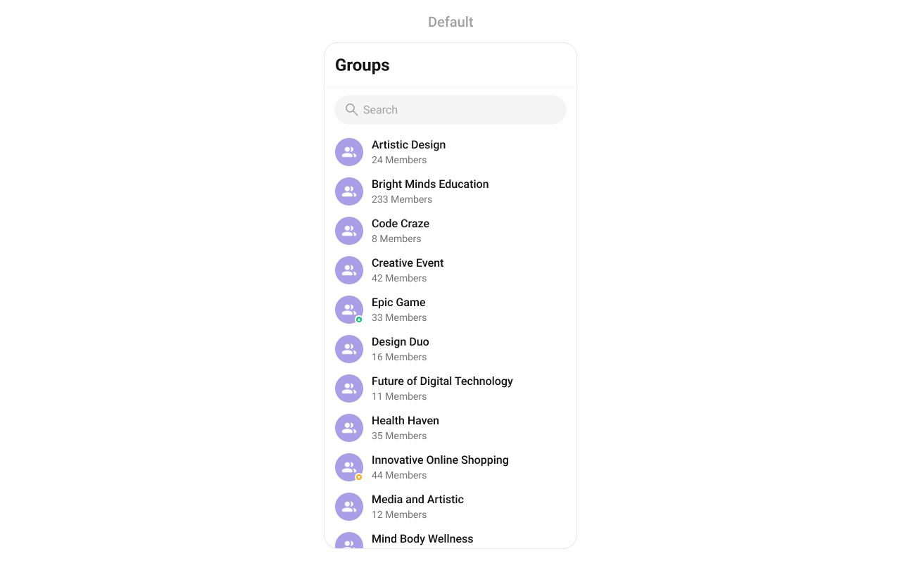
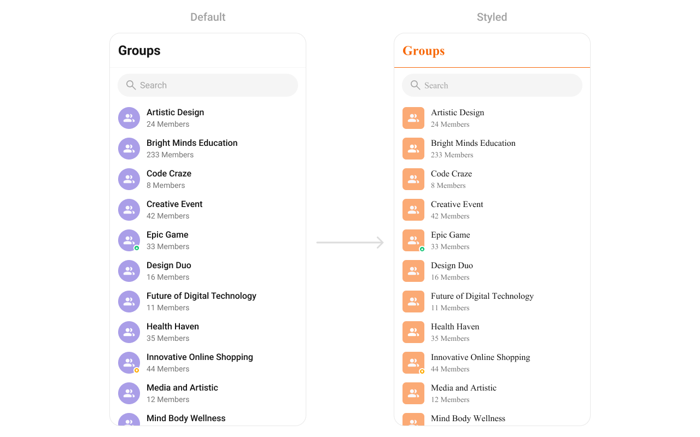
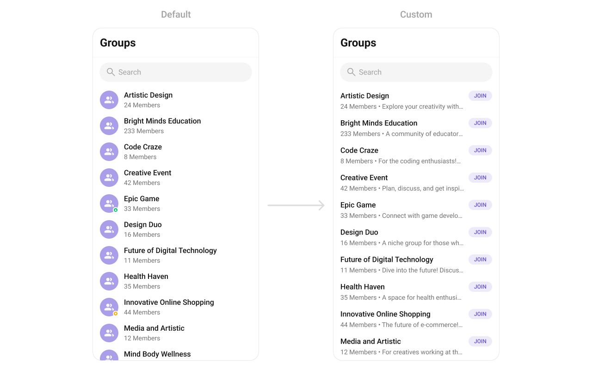
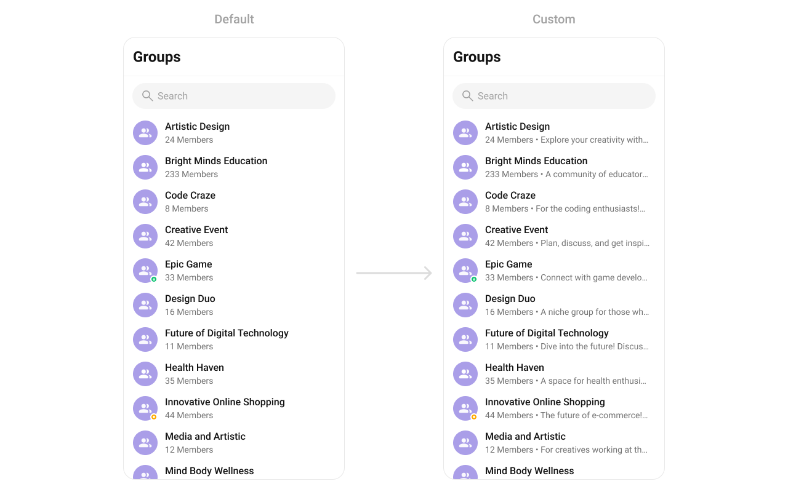
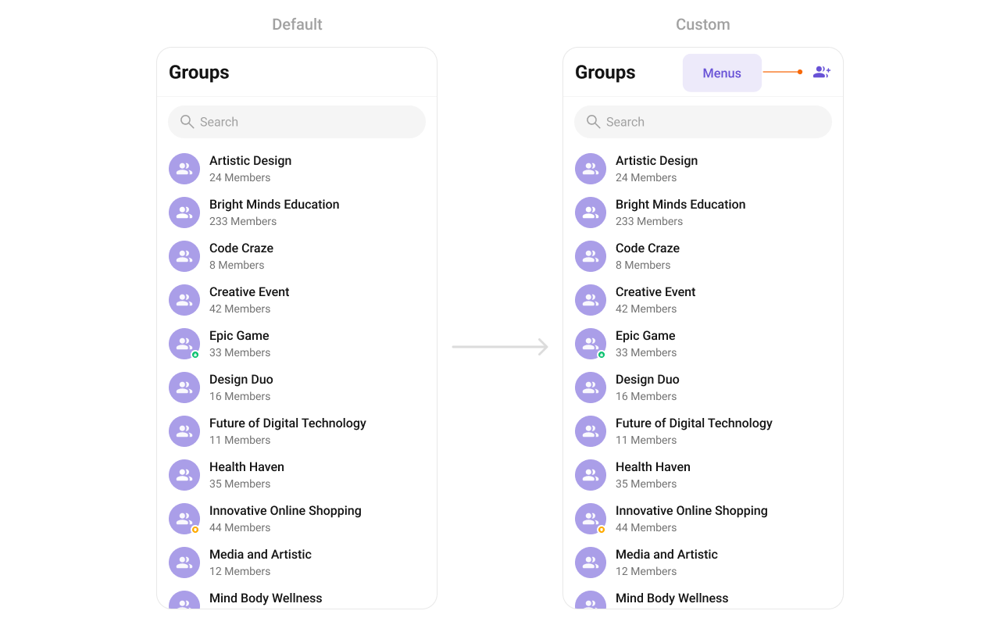

import Tabs from '@theme/Tabs';
import TabItem from '@theme/TabItem';

## Overview

`CometChatGroups` functions as a standalone [component](./01-components-overview.md#components) designed to create a screen displaying a list of groups, with the added functionality of enabling groups to search for specific groups. Acting as a container component, CometChatGroups encapsulates and formats the `CometChatListBase` and `CometChatGroupList` components without introducing any additional behavior of its own.



---

## Usage

---

### Integration

The following code snippet illustrates how you can can launch `CometChatGroups`.

<Tabs>

<TabItem value="xml" label="XML">

```xml
<com.cometchat.chatuikit.groups.CometChatGroups
    android:id="@+id/groups"
    android:layout_height="match_parent"
    android:layout_width="match_parent" />
```

</TabItem>

</Tabs>

---

### Actions

[Actions](./01-components-overview.md#actions) dictate how a component functions. They are divided into two types: Predefined and Group-defined. You can override either type, allowing you to tailor the behavior of the component to fit your specific needs.

##### setOnItemClick

Function invoked when a Group item is clicked, typically used to open a Group profile or chat screen.

<Tabs>

<TabItem value="java" label="Java">
```java title="YourActivity.java"
cometchatGroups.setOnItemClick((view1, position, group) -> {
            
    });
```
</TabItem>

<TabItem value="kotlin" label="Kotlin">

```kotlin title="YourActivity.kt"
cometchatGroups.onItemClick = OnItemClick { view, position, group ->
            
    }
```

</TabItem>
</Tabs>

---

##### setOnItemLongClick
Function executed when a Group item is long-pressed, allowing additional actions like delete or block.

<Tabs>

<TabItem value="java" label="Java">
```java title="YourActivity.java"
cometchatGroups.setOnItemLongClick((view1, position, group) -> {

    });
```
</TabItem>

<TabItem value="kotlin" label="Kotlin">

```kotlin title="YourActivity.kt"
cometchatGroups.onItemLongClick = OnItemLongClick({ view, position, group ->
            
    })
```

</TabItem>
</Tabs>

---

##### setOnBackPressListener

`OnBackPressListener` is triggered when you press the back button in the app bar. It has a predefined behavior; when clicked, it navigates to the previous activity. However, you can override this action using the following code snippet.

<Tabs>

<TabItem value="java" label="Java">
```java title="YourActivity.java"
cometchatGroups.setOnBackPressListener(() -> {
            
    });
```
</TabItem>

<TabItem value="kotlin" label="Kotlin">

```kotlin title="YourActivity.kt"
cometchatGroups.onBackPressListener = OnBackPress {

    }
```
</TabItem>
</Tabs>

---

##### setOnSelect

Called when a item from the fetched list is selected, useful for multi-selection features.

<Tabs>

<TabItem value="java" label="Java">

```java title="YourActivity.java"
cometchatGroups.setOnSelect(t -> {

    });
```
</TabItem>

<TabItem value="kotlin" label="Kotlin">

```kotlin title="YourActivity.kt"
cometchatGroups.setOnSelect(object : OnSelection<Group?> {
        override fun onSelection(t: MutableList<Group?>?) {
                
        }
    })
```

</TabItem>

</Tabs>

---

##### OnError

This action doesn't change the behavior of the component but rather listens for any errors that occur in the groups component.

<Tabs>

<TabItem value="java" label="Java">
```java title="YourActivity.java"
cometchatGroups.setOnError(cometchatException -> {

    });
```
</TabItem>

<TabItem value="kotlin" label="Kotlin">

```kotlin title="YourActivity.kt"
cometchatGroups.setOnError {

    }
```

</TabItem>

</Tabs>

---

##### setOnLoad
Invoked when the list is successfully fetched and loaded, helping track component readiness.

<Tabs>

<TabItem value="java" label="Java">

```java title="YourActivity.java"
cometchatGroups.setOnLoad(list -> {

});
```
</TabItem>

<TabItem value="kotlin" label="Kotlin">

```kotlin title="YourActivity.kt"
cometchatGroups.setOnLoad(object : OnLoad<Group?> {
    override fun onLoad(list: MutableList<Group?>?) {

    }
})
```

</TabItem>

</Tabs>
---

##### setOnEmpty
Called when the list is empty, enabling custom handling such as showing a placeholder message.


<Tabs>

<TabItem value="java" label="Java">

```java title="YourActivity.java"
cometchatGroups.setOnEmpty(() -> {
            
    });
```
</TabItem>

<TabItem value="kotlin" label="Kotlin">

```kotlin title="YourActivity.kt"
cometchatGroups.setOnEmpty{
            
    }
```

</TabItem>

</Tabs>
---

### Filters

Filters allow you to customize the data displayed in a list within a Component. You can filter the list based on your specific criteria, allowing for a more customized. Filters can be applied using RequestBuilders of Chat SDK.

##### 1. GroupsRequestBuilder

The [GroupsRequestBuilder](/sdk/android/retrieve-groups) enables you to filter and customize the group list based on available parameters in GroupsRequestBuilder. This feature allows you to create more specific and targeted queries when fetching groups. The following are the parameters available in [GroupsRequestBuilder](/sdk/android/retrieve-groups)

| Property           | Description                                                                                                         | Code                        |
| ------------------ | ------------------------------------------------------------------------------------------------------------------- | --------------------------- |
| **Limit**          | Configure the maximum number of groups to fetch in a single request, optimizing pagination for smoother navigation. | `.setLimit(Int)`            |
| **Search Keyword** | Employed to retrieve groups that match the provided string, facilitating precise searches.                          | `.setSearchKeyWord(String)` |
| **Joined Only**    | Exclusively fetches joined groups.                                                                                  | `.joinedOnly(boolean)`      |
| **Tags**           | Utilized to fetch groups containing the specified tags.                                                             | `.setTags(List<String>)`    |
| **With Tags**      | Utilized to retrieve groups with specific tags.                                                                     | `.withTags(boolean)`        |

**Example**

In the example below, we are applying a filter to the Group List based on only joined groups.

<Tabs>

<TabItem value="Java" label="Java">

```Java
GroupsRequest.GroupsRequestBuilder builder = new GroupsRequest.GroupsRequestBuilder().setLimit(10).joinedOnly(true);
cometchatGroups.setGroupsRequestBuilder(builder);
```

</TabItem>

<TabItem value="Kotlin" label="Kotlin">

```Kotlin
val builder = GroupsRequestBuilder().setLimit(10).joinedOnly(true)
cometchatGroups.setGroupsRequestBuilder(builder)
```

</TabItem>

</Tabs>

---

##### 2. SearchRequestBuilder

The SearchRequestBuilder uses [GroupsRequestBuilder](/sdk/android/retrieve-groups) enables you to filter and customize the search list based on available parameters in GroupsRequestBuilder.
This feature allows you to keep uniformity between the displayed Groups List and searched Group List.

**Example**

<Tabs>

<TabItem value="Java" label="Java">

```Java
GroupsRequest.GroupsRequestBuilder builder = new GroupsRequest.GroupsRequestBuilder().setLimit(10).setSearchKeyWord("**");
cometchatGroups.setSearchRequestBuilder(builder);
```

</TabItem>

<TabItem value="Kotlin" label="Kotlin">

```Kotlin
val builder = GroupsRequestBuilder().setLimit(10).setSearchKeyWord("**")
cometchatGroups.setSearchRequestBuilder(builder)
```

</TabItem>

</Tabs>

---

### Events

[Events](./01-components-overview.md#events) are emitted by a `Component`. By using event you can extend existing functionality. Being global events, they can be applied in Multiple Locations and are capable of being Added or Removed.

The list of events emitted by the Groups component is as follows.

| Events                        | Description                                                                                                |
| ----------------------------- | ---------------------------------------------------------------------------------------------------------- |
| `ccGroupCreated()`            | This will get triggered when the logged in user creates a group                                            |
| `ccGroupDeleted()`            | This will get triggered when the logged in user deletes a group                                            |
| `ccGroupLeft()`               | This will get triggered when the logged in user leaves a group                                             |
| `ccGroupMemberScopeChanged()` | This will get triggered when the logged in user changes the scope of another group member                  |
| `ccGroupMemberBanned()`       | This will get triggered when the logged in user bans a group member from the group                         |
| `ccGroupMemberKicked()`       | This will get triggered when the logged in user kicks another group member from the group                  |
| `ccGroupMemberUnbanned()`     | This will get triggered when the logged in user unbans a user banned from the group                        |
| `ccGroupMemberJoined()`       | This will get triggered when the logged in user joins a group                                              |
| `ccGroupMemberAdded()`        | This will get triggered when the logged in user add new members to the group                               |
| `ccOwnershipChanged`          | This will get triggered when the logged in user transfer the ownership of their group to some other member |

##### 1. Add `CometChatGroupEvents` Listener's

<Tabs>

<TabItem value="Java" label="Java">

```Java
CometChatGroupEvents.addGroupListener("LISTENER_TAG", new CometChatGroupEvents() {
    @Override
    public void ccGroupCreated(Group group) {
        super.ccGroupCreated(group);
    }

    @Override
    public void ccGroupDeleted(Group group) {
        super.ccGroupDeleted(group);
    }

    @Override
    public void ccGroupLeft(Action actionMessage, User leftUser, Group leftGroup) {
        super.ccGroupLeft(actionMessage, leftUser, leftGroup);
    }

    @Override
    public void ccGroupMemberJoined(User joinedUser, Group joinedGroup) {
        super.ccGroupMemberJoined(joinedUser, joinedGroup);
    }

    @Override
    public void ccGroupMemberAdded(List<Action> actionMessages, List<User> usersAdded, Group userAddedIn, User addedBy) {
        super.ccGroupMemberAdded(actionMessages, usersAdded, userAddedIn, addedBy);
    }

    @Override
    public void ccGroupMemberKicked(Action actionMessage, User kickedUser, User kickedBy, Group kickedFrom) {
        super.ccGroupMemberKicked(actionMessage, kickedUser, kickedBy, kickedFrom);
    }

    @Override
    public void ccGroupMemberBanned(Action actionMessage, User bannedUser, User bannedBy, Group bannedFrom) {
        super.ccGroupMemberBanned(actionMessage, bannedUser, bannedBy, bannedFrom);
    }

    @Override
    public void ccGroupMemberUnBanned(Action actionMessage, User unbannedUser, User unBannedBy, Group unBannedFrom) {
        super.ccGroupMemberUnBanned(actionMessage, unbannedUser, unBannedBy, unBannedFrom);
    }

    @Override
    public void ccGroupMemberScopeChanged(Action actionMessage, User updatedUser, String scopeChangedTo, String scopeChangedFrom, Group group) {
        super.ccGroupMemberScopeChanged(actionMessage, updatedUser, scopeChangedTo, scopeChangedFrom, group);
    }

    @Override
    public void ccOwnershipChanged(Group group, GroupMember newOwner) {
        super.ccOwnershipChanged(group, newOwner);
    }
});
```

</TabItem>

<TabItem value="Kotlin" label="Kotlin">

```Kotlin
CometChatGroupEvents.addGroupListener("LISTENER_TAG", object : CometChatGroupEvents() {
    override fun ccGroupCreated(group: Group?) {
        super.ccGroupCreated(group)
    }

    override fun ccGroupDeleted(group: Group?) {
        super.ccGroupDeleted(group)
    }

    override fun ccGroupLeft(actionMessage: Action?, leftUser: User?, leftGroup: Group?) {
        super.ccGroupLeft(actionMessage, leftUser, leftGroup)
    }

    override fun ccGroupMemberJoined(joinedUser: User?, joinedGroup: Group?) {
        super.ccGroupMemberJoined(joinedUser, joinedGroup)
    }

    override fun ccGroupMemberAdded(
        actionMessages: List<Action?>?,
        usersAdded: List<User?>?,
        userAddedIn: Group?,
        addedBy: User?
    ) {
        super.ccGroupMemberAdded(actionMessages, usersAdded, userAddedIn, addedBy)
    }

    override fun ccGroupMemberKicked(
        actionMessage: Action?,
        kickedUser: User?,
        kickedBy: User?,
        kickedFrom: Group?
    ) {
        super.ccGroupMemberKicked(actionMessage, kickedUser, kickedBy, kickedFrom)
    }

    override fun ccGroupMemberBanned(
        actionMessage: Action?,
        bannedUser: User?,
        bannedBy: User?,
        bannedFrom: Group?
    ) {
        super.ccGroupMemberBanned(actionMessage, bannedUser, bannedBy, bannedFrom)
    }

    override fun ccGroupMemberUnBanned(
        actionMessage: Action?,
        unbannedUser: User?,
        unBannedBy: User?,
        unBannedFrom: Group?
    ) {
        super.ccGroupMemberUnBanned(actionMessage, unbannedUser, unBannedBy, unBannedFrom)
    }

    override fun ccGroupMemberScopeChanged(
        actionMessage: Action?,
        updatedUser: User?,
        scopeChangedTo: String?,
        scopeChangedFrom: String?,
        group: Group?
    ) {
        super.ccGroupMemberScopeChanged(
            actionMessage,
            updatedUser,
            scopeChangedTo,
            scopeChangedFrom,
            group
        )
    }

    override fun ccOwnershipChanged(group: Group?, newOwner: GroupMember?) {
        super.ccOwnershipChanged(group, newOwner)
    }
})
```

</TabItem>

</Tabs>

---

##### 2. Removing `CometChatGroupEvents` Listener's

<Tabs>

<TabItem value="Java" label="Java">

```Java
CometChatGroupEvents.removeListeners();
```

</TabItem>

<TabItem value="Kotlin" label="Kotlin">

```Kotlin
CometChatGroupEvents.removeListeners()
```

</TabItem>

</Tabs>

---

## Customization

To fit your app's design requirements, you can customize the appearance of the groups component. We provide exposed methods that allow you to modify the experience and behavior according to your specific needs.

### Style

Using Style you can customize the look and feel of the component in your app, These parameters typically control elements such as the color, size, shape, and fonts used within the component.



```xml
    <style name="CustomAvatarStyle" parent="CometChatAvatarStyle">
        <item name="cometchatAvatarStrokeRadius">8dp</item>
        <item name="cometchatAvatarBackgroundColor">#FBAA75</item>
    </style>

    <style name="CustomGroupsStyle" parent="CometChatGroupsStyle">
        <item name="cometchatGroupsAvatar">@style/CustomAvatarStyle</item>
        <item name="cometchatGroupsSeparatorColor">#F76808</item>
        <item name="cometchatGroupsTitleTextColor">#F76808</item>
    </style>
```
<Tabs>

<TabItem value="Java" label="Java">

```Java
cometchatGroups.setStyle(R.style.CustomGroupsStyle);
```

</TabItem>

<TabItem value="Kotlin" label="Kotlin">

```Kotlin
cometchatGroups.setStyle(R.style.CustomGroupsStyle)
```

</TabItem>

</Tabs>

---
To know more such attributes, visit the [attributes file](https://github.com/cometchat/cometchat-uikit-android/blob/v5/chatuikit/src/main/res/values/attr_cometchat_groups.xml).

### Functionality

These are a set of small functional customizations that allow you to fine-tune the overall experience of the component. With these, you can change text, set custom icons, and toggle the visibility of UI elements.

Below is a list of customizations along with corresponding code snippets

| Methods               | Description                                                                                                                                                                            | Code                                                          |
| ---------------------- | -------------------------------------------------------------------------------------------------------------------------------------------------------------------------------------- | ------------------------------------------------------------- |
| setBackIconVisibility       | Used to toggle visibility for back button in the app bar                                                                                                                               | `.setBackIconVisibility(View.VISIBLE);`                                      |
| setToolbarVisibility       | Used to toggle visibility for back button in the app bar                                                                                                                               | `.setToolbarVisibility(View.GONE);`                                      |
| setLoadingStateVisibility            | Used to hide loading state while fetching groups                                                                                                                                           | `.setLoadingStateVisibility(View.GONE);`                                          |
| setErrorStateVisibility            | Used to hide error state on fetching groups                                                                                                                                           | `.setErrorStateVisibility(View.GONE);`                                          |
| setEmptyStateVisibility            | Used to hide empty state on fetching groups                                                                                                                                           | `.setEmptyStateVisibility(View.GONE);`                                          |
| setSeparatorVisibility          | Used to control visibility of Separators in the list view                                                                                                                              | `.setSeparatorVisibility(View.GONE);`                                      |
| setGroupTypeVisibility | Used to control visibility of status indicator shown for the group type                                                                                                                 | `.setGroupTypeVisibility(View.GONE);`                               |
| setSearchBoxVisibility       | Used to hide search box shown in the tool bar                | `.setSearchBoxVisibility(View.GONE);`                                     |
| setSelectionMode     | This method determines the selection mode for groups, enabling user to select either a single groups or multiple groups at once.                            | `.setSelectionMode(UIKitConstants.SelectionMode.MULTIPLE);`                                     |
| setSearchkeyword     | Used for fetching groups matching the passed keywords                      | `.setSearchkeyword("anything");`                                     |
---

### Advanced

For advanced-level customization, you can set custom views to the component. This lets you tailor each aspect of the component to fit your exact needs and application aesthetics. You can create and define your views, layouts, and UI elements and then incorporate those into the component.


#### setOptions
Defines the available actions when users interact with a group item, such as long-pressing or swiping.

Use Cases:
- Enable actions like "Mute Notifications", "Leave Group", "Pin Group".
- Provide admin-only actions like "Manage Members", "Delete Group".

<Tabs>

<TabItem value="java" label="Java">

```Java
cometchatGroups.setOptions((context, group) -> Collections.emptyList());
````

</TabItem>

<TabItem value="kotlin" label="Kotlin">
```kotlin
cometchatGroups.options = Function2<Context?, Group?, List<CometChatPopupMenu.MenuItem?>?> { context, Group -> emptyList<CometChatPopupMenu.MenuItem?>() }
```
</TabItem>

</Tabs>
---

#### addOptions
This method extends the existing set of actions available when Groups long press a Group item. Unlike setOptionsDefines, which replaces the default options, addOptionsAdds allows developers to append additional actions without removing the default ones. Example use cases include:

- Adding a "Report Spam" action
- Introducing a "Save to Notes" option
- Integrating third-party actions such as "Share to Cloud Storage"

This method provides flexibility in modifying Group interaction capabilities.


<Tabs>

<TabItem value="java" label="Java">

```Java
cometchatGroups.addOptions((context, group) -> Collections.emptyList());
````

</TabItem>

<TabItem value="kotlin" label="Kotlin">
```kotlin
cometchatGroups.addOptions { context, group -> emptyList<CometChatPopupMenu.MenuItem?>() }
```
</TabItem>

</Tabs>

---

#### setLoadingView
Configures a custom loading view displayed while groups are being fetched.

Use Cases:
- Show a spinner with "Loading groups..." text.
- Display a skeleton loader for a smooth UI experience.


<Tabs>

<TabItem value="java" label="Java">
```Java
cometchatGroups.setLoadingView(R.layout.your_loading_view);
````
</TabItem>

<TabItem value="kotlin" label="Kotlin">
```kotlin
cometchatGroups.loadingView = R.layout.your_loading_view
```
</TabItem>

</Tabs>

---

#### setEmptyView
Defines a view that appears when no groups are available.

Use Cases:
- Show a message like "No groups found, create one now!".
- Display an illustration with a "Create New Group" button.

<Tabs>

<TabItem value="java" label="Java">
```Java
cometchatGroups.setEmptyView(R.layout.your_empty_view);
````

</TabItem>

<TabItem value="kotlin" label="Kotlin">
```kotlin
cometchatGroups.emptyView = R.layout.your_empty_view
```
</TabItem>

</Tabs>

---

#### setErrorView
Configures the UI when an error occurs while fetching groups.

Use Cases:
- Display a retry button with "Failed to load groups, try again.".
- Show a friendly error illustration.

<Tabs>

<TabItem value="java" label="Java">

```Java
cometchatGroups.setErrorView(R.layout.your_empty_view);
````

</TabItem>

<TabItem value="kotlin" label="Kotlin">
```kotlin
cometchatGroups.errorView = R.layout.your_error_view
```
</TabItem>

</Tabs>

---

#### setLeadingView
Sets a custom leading view that appears at the start of each group item.

Use Cases:
- Display the group profile picture.
- Add an icon indicating Public or Private groups.

<Tabs>

<TabItem value="java" label="Java">

```Java
cometchatGroups.setLeadingView(new GroupsViewHolderListener() {
            @Override
            public View createView(Context context, CometchatListBaseItemsBinding listItem) {
                return null;
            }

            @Override
            public void bindView(Context context, View createdView, Group group, RecyclerView.ViewHolder holder, List<Group> groupList, int position) {

            }
        });
```

</TabItem>

<TabItem value="kotlin" label="Kotlin">

```kotlin
cometchatGroups.setLeadingView(object: GroupsViewHolderListener {
    override fun createView(context: Context, cometChatListItem: CometChatListItem): View? {
        return null
    }

    override fun bindView(context: Context, view: View, Group: group, viewHolder: RecyclerView.ViewHolder, list: List<Group>, i: Int) {
    }
})
```

</TabItem>

</Tabs>

---

#### setTitleView
Customizes the title view of each group item, which typically displays the group name.

Use Cases:
- Style group names with custom fonts and colors.
- Show a verified badge for official groups.


<Tabs>

<TabItem value="java" label="Java">

```Java
cometchatGroups.setTitleView(new GroupsViewHolderListener() {
            @Override
            public View createView(Context context, CometchatListBaseItemsBinding listItem) {
                return null;
            }

            @Override
            public void bindView(Context context, View createdView, Group group, RecyclerView.ViewHolder holder, List<Group> groupList, int position) {

            }
        });
```

</TabItem>

<TabItem value="kotlin" label="Kotlin">

```kotlin
cometchatGroups.setTitleView(object: GroupsViewHolderListener {
    override fun createView(context: Context, cometChatListItem: CometChatListItem): View? {
        return null
    }

    override fun bindView(context: Context, view: View, Group: group, viewHolder: RecyclerView.ViewHolder, list: List<Group>, i: Int) {
    }
})
```

</TabItem>

</Tabs>

---

#### setTrailingView
Allows custom elements to be added at the end of each group item, such as buttons or indicators.

Use Cases:
- Show unread message counts.
- Add a quick Join or Leave button.

<Tabs>

<TabItem value="java" label="Java">

```Java
cometchatGroups.setTrailingView(new GroupsViewHolderListener() {
            @Override
            public View createView(Context context, CometchatListBaseItemsBinding listItem) {
                return null;
            }

            @Override
            public void bindView(Context context, View createdView, Group group, RecyclerView.ViewHolder holder, List<Group> groupList, int position) {

            }
        });
```

</TabItem>

<TabItem value="kotlin" label="Kotlin">

```kotlin
cometchatGroups.setTrailingView(object: GroupsViewHolderListener {
    override fun createView(context: Context, cometChatListItem: CometChatListItem): View? {
        return null
    }

    override fun bindView(context: Context, view: View, Group: Group, viewHolder: RecyclerView.ViewHolder, list: List<Group>, i: Int) {
    }
})
```

</TabItem>

</Tabs>
---

#### setItemView

Assigns a fully custom ListItem layout to the Groups component, replacing the default design.

Use Cases:
- Add a description below the group name.
- Customize layout to include additional metadata.

<Tabs>

<TabItem value="Java" label="Java">

```Java
cometchatGroups.setItemView(new GroupsViewHolderListener() {
    @Override
    public View createView(Context context, CometchatListBaseItemsBinding cometChatListItem) {
        return null;
    }

    @Override
    public void bindView(Context context, View view, Group group, RecyclerView.ViewHolder viewHolder, List<Group> list, int i) {

    }
});
```

</TabItem>

<TabItem value="Kotlin" label="Kotlin">

```Kotlin
cometchatGroups.setItemView(object : GroupsViewHolderListener() {
    override fun createView(
        context: Context?,
        CometchatListBaseItemsBinding: CometChatListItem?
    ): View? {
        return null
    }

    override fun bindView(
        context: Context?,
        view: View?,
        group: Group?,
        viewHolder: RecyclerView.ViewHolder?,
        list: List<Group?>?,
        i: Int
    ) {

    }
})
```

</TabItem>

</Tabs>

**Example**



You can indeed create a custom layout file named `item_list.xml` for more complex or unique list items.

Once this layout file is made, you would inflate it inside the `createView()` method of the `GroupsViewHolderListener`. The inflation process prepares the layout for use in your application:

Following this, you would use the `bindView()` method to initialize and assign values to your individual views. This could include setting text on TextViews, images on ImageViews, and so on based on the properties of the Group object:

```xml title="custom_group_list_itemd.xml"
<?xml version="1.0" encoding="utf-8"?>
<LinearLayout xmlns:android="http://schemas.android.com/apk/res/android"
    xmlns:app="http://schemas.android.com/apk/res-auto"
    android:layout_width="match_parent"
    android:layout_height="wrap_content"
    android:orientation="vertical">

    <LinearLayout
        android:layout_width="match_parent"
        android:layout_height="wrap_content"
        android:orientation="horizontal">

        <TextView
            android:id="@+id/tvName"
            android:layout_width="0dp"
            android:layout_weight="1"
            android:layout_height="wrap_content"
            android:maxLines="1"
            android:textAppearance="?attr/cometchatTextAppearanceHeading4Bold"
            android:textColor="?attr/cometchatTextColorPrimary" />

        <com.google.android.material.card.MaterialCardView
            android:layout_width="wrap_content"
            android:layout_height="wrap_content"
            android:layout_marginStart="@dimen/cometchat_16dp"
            android:layout_marginTop="@dimen/cometchat_2dp"
            android:layout_marginBottom="@dimen/cometchat_2dp"
            android:elevation="0dp"
            app:cardBackgroundColor="#EDEAFA"
            app:cardCornerRadius="@dimen/cometchat_radius_max"
            app:cardElevation="0dp">

            <TextView
                android:layout_width="wrap_content"
                android:layout_height="wrap_content"
                android:layout_marginStart="@dimen/cometchat_margin_3"
                android:layout_marginTop="@dimen/cometchat_margin_1"
                android:layout_marginEnd="@dimen/cometchat_margin_3"
                android:layout_marginBottom="@dimen/cometchat_margin_1"
                android:text="JOIN"
                android:textAppearance="@style/CometChatTextAppearanceCaption1.Medium"
                android:textColor="?attr/cometchatPrimaryColor" />
        </com.google.android.material.card.MaterialCardView>
    </LinearLayout>

    <TextView
        android:id="@+id/tvSubtitle"
        android:layout_width="match_parent"
        android:layout_height="wrap_content"
        android:layout_marginTop="@dimen/cometchat_margin_1"
        android:textAppearance="?attr/cometchatTextAppearanceBodyRegular"
        android:textColor="?attr/cometchatTextColorSecondary" />
</LinearLayout>
```

<Tabs>

<TabItem value="Java" label="Java">

```Java title="YourActivity.java"
cometChatGroup.setItemView(new GroupsViewHolderListener() {
            @Override
            public View createView(Context context, CometchatListBaseItemsBinding listItem) {
                return View.inflate(context,R.layout.custom_group_list_item,null);
            }

            @Override
            public void bindView(Context context, View createdView, Group group, RecyclerView.ViewHolder holder, List<Group> groupList, int position) {
                TextView groupName = createdView.findViewById(R.id.tvName);
                TextView groupMemberCount = createdView.findViewById(R.id.tvSubtitle);
                LinearLayout.LayoutParams params = new LinearLayout.LayoutParams(LinearLayout.LayoutParams.MATCH_PARENT, LinearLayout.LayoutParams.WRAP_CONTENT);
                createdView.setLayoutParams(params);
                groupName.setText(group.getName());
                groupMemberCount.setText(group.getMembersCount() > 1 ? group.getMembersCount() + " members" : group.getMembersCount() + " member" + " • " + group.getDescription());
            }
        });
```

</TabItem>

<TabItem value="Kotlin" label="Kotlin">

```Kotlin title="YourActivity.kt"
cometChatGroup.setItemView(object : GroupsViewHolderListener() {
            override fun createView(
                context: Context?,
                listItem: CometchatListBaseItemsBinding?
            ): View {
                return View.inflate(context, R.layout.custom_group_list_item, null)
            }

            override fun bindView(
                context: Context,
                createdView: View,
                group: Group,
                holder: RecyclerView.ViewHolder,
                groupList: List<Group>,
                position: Int
            ) {
                val groupName = createdView.findViewById<TextView>(R.id.tvName)
                val groupMemberCount = createdView.findViewById<TextView>(R.id.tvSubtitle)
                val params = LinearLayout.LayoutParams(
                    LinearLayout.LayoutParams.MATCH_PARENT,
                    LinearLayout.LayoutParams.WRAP_CONTENT
                )
                createdView.layoutParams = params
                groupName.text = group.name
                groupMemberCount.text =
                    if (group.membersCount > 1) group.membersCount.toString() + " members" else group.membersCount.toString() + " member" + " • " + group.description
            }
        })
```

</TabItem>

</Tabs>

---

#### setSubTitleView

Customizes the subtitle view for each group item, which typically displays extra information.

Use Cases:
- Show last message preview.
- Display the number of members.

<Tabs>

<TabItem value="Java" label="Java">

```Java
CometChatGroup.setSubtitleView(new GroupsViewHolderListener() {
            @Override
            public View createView(Context context, CometchatListBaseItemsBinding listItem) {
                return null;
            }

            @Override
            public void bindView(Context context, View createdView, Group group, RecyclerView.ViewHolder holder, List<Group> groupList, int position) {

            }
        });
```

</TabItem>

<TabItem value="Kotlin" label="Kotlin">

```Kotlin
cometChatGroup.setSubtitleView(object : GroupsViewHolderListener() {
            override fun createView(
                context: Context?,
                listItem: CometchatListBaseItemsBinding?
            ): View {
                return null
            }

            override fun bindView(
                context: Context,
                createdView: View,
                group: Group,
                holder: RecyclerView.ViewHolder,
                groupList: List<Group>,
                position: Int
            ) {
               
            }
        })
```

</TabItem>

</Tabs>

**Example**



You can indeed create a custom layout file named `subtitle_layout.xml` for more complex or unique list items.

Once this layout file is made, you would inflate it inside the `createView()` method of the `GroupsViewHolderListener`. The inflation process prepares the layout for use in your application:

Following this, you would use the `bindView()` method to initialize and assign values to your individual views. This could include setting text on TextViews, images on ImageViews, and so on based on the properties of the Group object:

<Tabs>

<TabItem value="Java" label="Java">

```Java title="YourActivity.java"
cometChatGroup.setSubtitleView(new GroupsViewHolderListener() {
            @Override
            public View createView(Context context, CometchatListBaseItemsBinding listItem) {
                return new TextView(context);
            }

            @Override
            public void bindView(Context context, View createdView, Group group, RecyclerView.ViewHolder holder, List<Group> groupList, int position) {
                TextView textView = (TextView) createdView;
                textView.setText(group.getMembersCount() > 1 ? group.getMembersCount() + " members" : group.getMembersCount() + " member" + " • " + group.getDescription());

            }
        });
```

</TabItem>

<TabItem value="Kotlin" label="Kotlin">

```Kotlin title="YourActivity.kt"
group.setSubtitleView(object : GroupsViewHolderListener() {
            override fun createView(
                context: Context?,
                listItem: CometchatListBaseItemsBinding?
            ): View {
                return TextView(context)
            }

            override fun bindView(
                context: Context,
                createdView: View,
                group: Group,
                holder: RecyclerView.ViewHolder,
                groupList: List<Group>,
                position: Int
            ) {
                val textView = createdView as TextView
                textView.text =
                    if (group.membersCount > 1) group.membersCount.toString() + " members" else group.membersCount.toString() + " member" + " • " + group.description
            }
        })
```

</TabItem>

</Tabs>

---

#### SetOverflowMenu

Customizes the overflow menu (three-dot ⋮ icon) with additional options.

Use Cases:
- Add options like "Invite Members", "Report Group".
- Enable admin-specific options like "Manage Group Settings".

<Tabs>

<TabItem value="Java" label="Java">

```Java
cometchatGroups.setOverflowMenu(View v);
```

</TabItem>

<TabItem value="Kotlin" label="Kotlin">

```Kotlin
cometchatGroups.setOverflowMenu(v)
```

</TabItem>

</Tabs>

**Example**



You need to create a `overflow_menu_layout.xml` as a custom view file. Which we will inflate and pass to `.setOverflowMenu()`.

```xml title="overflow_menu_layout.xml"
<?xml version="1.0" encoding="utf-8"?>
<LinearLayout xmlns:android="http://schemas.android.com/apk/res/android"
    android:layout_width="wrap_content"
    android:layout_height="wrap_content"
    android:orientation="vertical">

    <ImageView
        android:id="@+id/ivMenu"
        android:layout_width="@dimen/cometchat_24dp"
        android:layout_height="@dimen/cometchat_24dp"
        android:layout_marginStart="@dimen/cometchat_margin_4"
        android:importantForAccessibility="no"
        android:src="@drawable/ic_create_group" />

</LinearLayout>

```

You inflate the view and pass it to `setOverflowMenu`. You can get the child view reference and can handle click actions.

<Tabs>

<TabItem value="Java" label="Java">

```Java title="YourActivity.java"
View view = getLayoutInflater().inflate(R.layout.overflow_menu_layout, null);
ImageView imgRefresh = view.findViewById(R.id.ivMenu);
imgRefresh.setOnClickListener(v -> {
    Toast.makeText(requireContext(), "Clicked on Refresh", Toast.LENGTH_SHORT).show();
});
cometchatGroups.setOverflowMenu(view);
```

</TabItem>

<TabItem value="Kotlin" label="Kotlin">

```Kotlin title="YourActivity.kt"
val view: View = layoutInflater.inflate(R.layout.overflow_menu_layout, null)
val imgRefresh = view.findViewById<ImageView>(R.id.ivMenu)
imgRefresh.setOnClickListener { v: View? ->
    Toast.makeText(requireContext(), "Clicked on Refresh", Toast.LENGTH_SHORT).show()
}
cometchatGroups.setOverflowMenu(view)
```

</TabItem>

</Tabs>
