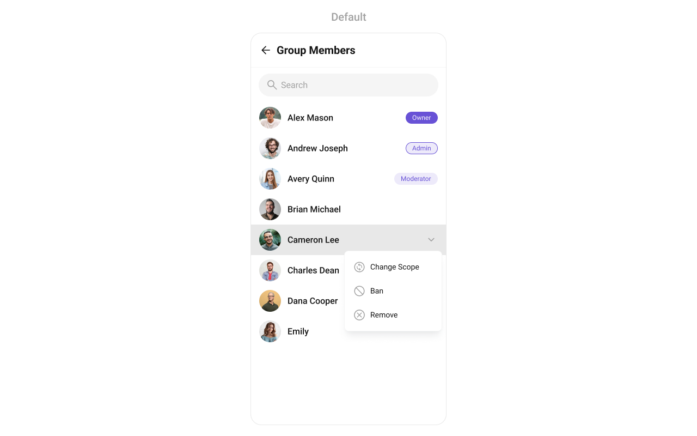
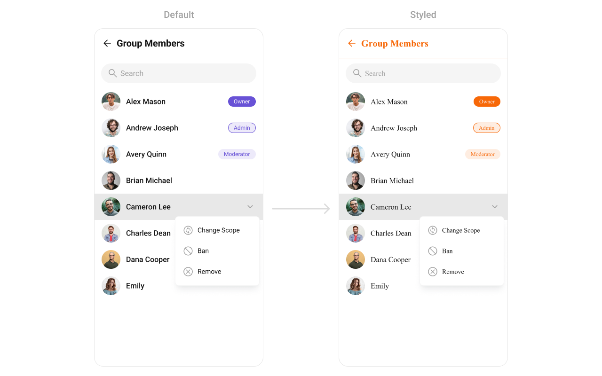
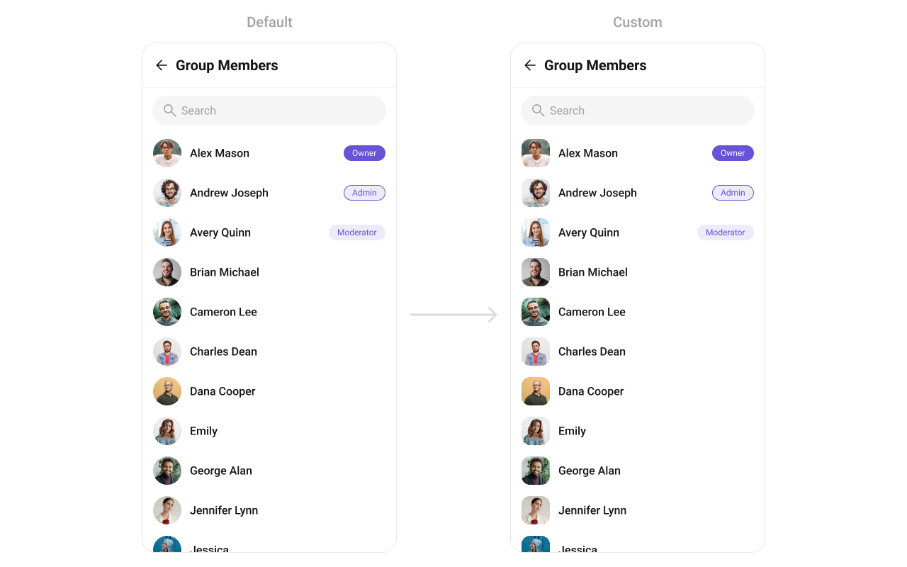
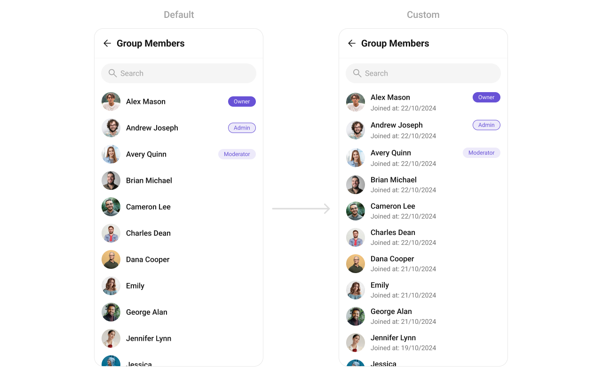
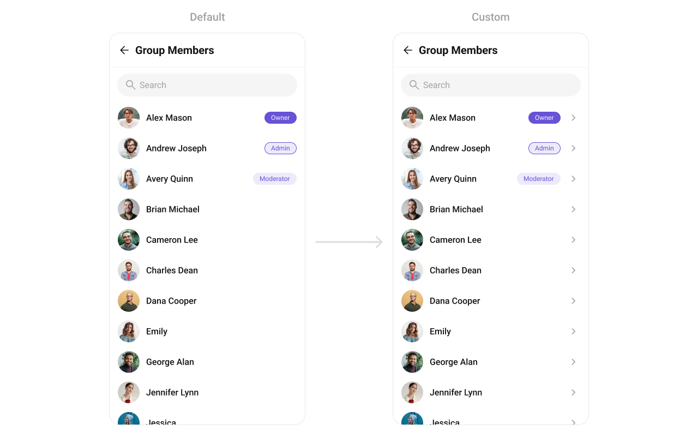

import Tabs from '@theme/Tabs';
import TabItem from '@theme/TabItem';

## Overview

`CometChatGroupMembers` is a versatile [Component](./01-components-overview.md#components) designed to showcase all users who are either added to or invited to a group, thereby enabling them to participate in group discussions, access shared content, and engage in collaborative activities. Group members have the capability to communicate in real-time through messaging, voice and video calls, and various other interactions. Additionally, they can interact with each other, share files, and join calls based on the permissions established by the group administrator or owner.



---

## Usage

### Integration

`CometChatGroupMembers`, as a Composite Component, offers flexible integration options, allowing it to be launched directly via button clicks or any user-triggered action. Additionally, it seamlessly integrates into tab view controllers. With group members, users gain access to a wide range of parameters and methods for effortless customization of its user interface.

The following code snippet exemplifies how you can seamlessly integrate the GroupMembers component into your application.

<Tabs>
<TabItem value="xml" label="XML">

```xml
<com.cometchat.chatuikit.groupmembers.CometChatGroupMembers
    android:id="@+id/group_member"
    android:layout_width="match_parent"
    android:layout_height="match_parent" />
```

</TabItem>
</Tabs>

If you're defining the Group members within the XML code, you'll need to extract them and set them on the Group object using the appropriate method.

<Tabs>

<TabItem value="Java" label="Java">

```Java
CometChatGroupMembers cometchatGroupMembers = binding.groupMember;

Group group = new Group();
group.setGuid("GROUP_ID");
group.setName("GROUP_NAME");

cometchatGroupMembers.setGroup(group);
```

</TabItem>

<TabItem value="Kotlin" label="Kotlin">

```Kotlin
val cometchatGroupMembers: CometChatGroupMembers = binding.groupMember

val group: Group = Group()
group.setGuid("GROUP_ID")
group.setName("GROUP_NAME")

cometchatGroupMembers.setGroup(group)
```
</TabItem>

</Tabs>

---

### Actions

[Actions](./01-components-overview.md#actions) dictate how a component functions. They are divided into two types: Predefined and User-defined. You can override either type, allowing you to tailor the behavior of the component to fit your specific needs.


##### setOnItemClick

Function invoked when a user item is clicked, typically used to open a user profile or chat screen.

<Tabs>

<TabItem value="java" label="Java">
```java title="YourActivity.java"
cometchatUsers.setOnItemClick((view1, position, user) -> {
            
    });
```
</TabItem>

<TabItem value="kotlin" label="Kotlin">

```kotlin title="YourActivity.kt"
cometchatUsers.onItemClick = OnItemClick { view, position, user ->
            
    }
```

</TabItem>
</Tabs>

---

##### setOnItemLongClick
Function executed when a user item is long-pressed, allowing additional actions like delete or block.

<Tabs>

<TabItem value="java" label="Java">
```java title="YourActivity.java"
cometchatUsers.setOnItemLongClick((view1, position, user) -> {

    });
```
</TabItem>

<TabItem value="kotlin" label="Kotlin">

```kotlin title="YourActivity.kt"
cometchatUsers.onItemLongClick = OnItemLongClick({ view, position, user ->
            
    })
```

</TabItem>
</Tabs>

---

##### setOnBackPressListener

`OnBackPressListener` is triggered when you press the back button in the app bar. It has a predefined behavior; when clicked, it navigates to the previous activity. However, you can override this action using the following code snippet.

<Tabs>

<TabItem value="java" label="Java">
```java title="YourActivity.java"
cometchatUsers.setOnBackPressListener(() -> {
            
    });
```
</TabItem>

<TabItem value="kotlin" label="Kotlin">

```kotlin title="YourActivity.kt"
cometchatUsers.onBackPressListener = OnBackPress {

    }
```
</TabItem>
</Tabs>

---

##### setOnSelect

Called when a item from the fetched list is selected, useful for multi-selection features.

<Tabs>

<TabItem value="java" label="Java">

```java title="YourActivity.java"
cometchatUsers.setOnSelect(t -> {

    });
```
</TabItem>

<TabItem value="kotlin" label="Kotlin">

```kotlin title="YourActivity.kt"
cometchatUsers.setOnSelect(object : OnSelection<User?> {
        override fun onSelection(t: MutableList<User?>?) {
                
        }
    })
```

</TabItem>

</Tabs>

---

##### OnError

This action doesn't change the behavior of the component but rather listens for any errors that occur in the Users component.

<Tabs>

<TabItem value="java" label="Java">
```java title="YourActivity.java"
cometchatUsers.setOnError(cometchatException -> {

    });
```
</TabItem>

<TabItem value="kotlin" label="Kotlin">

```kotlin title="YourActivity.kt"
cometchatUsers.setOnError {

    }
```

</TabItem>

</Tabs>

---

##### setOnLoad
Invoked when the list is successfully fetched and loaded, helping track component readiness.

<Tabs>

<TabItem value="java" label="Java">

```java title="YourActivity.java"
cometchatUsers.setOnLoad(list -> {

});
```
</TabItem>

<TabItem value="kotlin" label="Kotlin">

```kotlin title="YourActivity.kt"
cometchatUsers.setOnLoad(object : OnLoad<User?> {
    override fun onLoad(list: MutableList<User?>?) {

    }
})
```

</TabItem>

</Tabs>
---

##### setOnEmpty
Called when the list is empty, enabling custom handling such as showing a placeholder message.


<Tabs>

<TabItem value="java" label="Java">

```java title="YourActivity.java"
cometchatUsers.setOnEmpty(() -> {
            
    });
```
</TabItem>

<TabItem value="kotlin" label="Kotlin">

```kotlin title="YourActivity.kt"
cometchatUsers.setOnEmpty{
            
    }
```

</TabItem>

</Tabs>
---

### Filters

**Filters** allow you to customize the data displayed in a list within a `Component`. You can filter the list based on your specific criteria, allowing for a more customized. Filters can be applied using `RequestBuilders` of Chat SDK.

##### 1. GroupsRequestBuilder

The [GroupsRequestBuilder](/sdk/android/retrieve-groups) enables you to filter and customize the group list based on available parameters in GroupsRequestBuilder. This feature allows you to create more specific and targeted queries when fetching groups. The following are the parameters available in [GroupsRequestBuilder](/sdk/android/retrieve-groups)

| Property           | Description                                                                                                      | Code                        |
| ------------------ | ---------------------------------------------------------------------------------------------------------------- | --------------------------- |
| **Limit**          | Sets the number of group members that can be fetched in a single request, suitable for pagination.               | `.setLimit(int)`            |
| **Search Keyword** | Used for fetching group members matching the passed string.                                                      | `.setSearchKeyword(String)` |
| **Scopes**         | Used for fetching group members having matching scopes which may be of participant, moderator, admin, and owner. | `.setScopes(List<String>)`  |

**Example**

In the example below, we are applying a filter to the Group List based on limit and scope.

<Tabs>
<TabItem value="java" label="Java">

```Java
GroupMembersRequest.GroupMembersRequestBuilder groupMembersRequestBuilder= new GroupMembersRequest.GroupMembersRequestBuilder(GUID).setLimit(limit);

cometchatGroupMembers.setGroupMembersRequestBuilder(groupMembersRequestBuilder);
```

</TabItem>

<TabItem value="kotlin" label="Kotlin">

```kotlin
val groupMembersRequestBuilder = GroupMembersRequestBuilder(GUID).setLimit(limit)

cometchatGroupMembers.setGroupMembersRequestBuilder(groupMembersRequestBuilder)
```

</TabItem>
</Tabs>

---

##### 2. SearchRequestBuilder

The SearchRequestBuilder uses [GroupsRequestBuilder](/sdk/android/retrieve-groups) enables you to filter and customize the search list based on available parameters in GroupsRequestBuilder.

This feature allows you to keep uniformity between the displayed Groups List and searched Group List.

**Example**

<Tabs>

<TabItem value="Java" label="Java">
```Java
GroupMembersRequest.GroupMembersRequestBuilder groupMembersRequestBuilder= new GroupMembersRequest.GroupMembersRequestBuilder(GUID).setLimit(LIMIT).setSearchKeyword(SEARCH_KEYWORD);

cometchatGroupMembers.setSearchRequestBuilder(groupMembersRequestBuilder);

````
</TabItem>

<TabItem value="Kotlin" label="Kotlin">
```Kotlin
val groupMembersRequestBuilder = GroupMembersRequestBuilder(GUID).setLimit(LIMIT).setSearchKeyword(SEARCH_KEYWORD)

cometchatGroupMembers.setSearchRequestBuilder(groupMembersRequestBuilder)
````

</TabItem>

</Tabs>

---

### Events

[Events](./01-components-overview.md#events) are emitted by a `Component`. By using event you can extend existing functionality. Being global events, they can be applied in Multiple Locations and are capable of being Added or Removed.

Events emitted by the Join Group component is as follows.

| Event                         | Description                                                       |
| ----------------------------- | ----------------------------------------------------------------- |
| **ccGroupMemberBanned**       | Triggers when the group member banned from the group successfully |
| **ccGroupMemberKicked**       | Triggers when the group member kicked from the group successfully |
| **ccGroupMemberScopeChanged** | Triggers when the group member scope is changed in the group      |

<Tabs>

<TabItem value="Java" label="Java">

```Java
CometChatGroupEvents.addGroupListener("LISTENER_ID", new CometChatGroupEvents() {
    @Override
    public void ccGroupMemberKicked(Action actionMessage, User kickedUser, User kickedBy, Group kickedFrom) {
        super.ccGroupMemberKicked(actionMessage, kickedUser, kickedBy, kickedFrom);
    }

    @Override
    public void ccGroupMemberBanned(Action actionMessage, User bannedUser, User bannedBy, Group bannedFrom) {
        super.ccGroupMemberBanned(actionMessage, bannedUser, bannedBy, bannedFrom);
    }

    @Override
    public void ccGroupMemberScopeChanged(Action actionMessage, User updatedUser, String scopeChangedTo, String scopeChangedFrom, Group group) {
        super.ccGroupMemberScopeChanged(actionMessage, updatedUser, scopeChangedTo, scopeChangedFrom, group);
    }

});

```
</TabItem>

<TabItem value="Kotlin" label="Kotlin">

```Kotlin
CometChatGroupEvents.addGroupListener("LISTENER_ID", object : CometChatGroupEvents() {
    override fun ccGroupMemberKicked(
        actionMessage: Action,
        kickedUser: User,
        kickedBy: User,
        kickedFrom: Group
    ) {
        super.ccGroupMemberKicked(actionMessage, kickedUser, kickedBy, kickedFrom)
    }

    override fun ccGroupMemberBanned(
        actionMessage: Action,
        bannedUser: User,
        bannedBy: User,
        bannedFrom: Group
    ) {
        super.ccGroupMemberBanned(actionMessage, bannedUser, bannedBy, bannedFrom)
    }

    override fun ccGroupMemberScopeChanged(
        actionMessage: Action,
        updatedUser: User,
        scopeChangedTo: String,
        scopeChangedFrom: String,
        group: Group
    ) {
        super.ccGroupMemberScopeChanged(
            actionMessage,
            updatedUser,
            scopeChangedTo,
            scopeChangedFrom,
            group
        )
    }
})
```
</TabItem>

</Tabs>

---

Remove the added listener

<Tabs>

<TabItem value="Java" label="Java">
```Java
CometChatGroupEvents.removeListener("LISTENER_ID");
```
</TabItem>

<TabItem value="Kotlin" label="Kotlin">
```Kotlin
CometChatGroupEvents.removeListener("LISTENER_ID")
```
</TabItem>

</Tabs>

---

## Customization

To fit your app's design requirements, you can customize the appearance of the Groups component. We provide exposed methods that allow you to modify the experience and behavior according to your specific needs.

### Style

Using Style you can customize the look and feel of the component in your app, These parameters typically control elements such as the color, size, shape, and fonts used within the component.



```xml title="themes.xml"
     <style name="CustomAvatarStyle" parent="CometChatAvatarStyle">
        <item name="cometchatAvatarStrokeRadius">8dp</item>
        <item name="cometchatAvatarBackgroundColor">#FBAA75</item>
    </style>

    <style name="CustomGroupMembersStyle" parent="CometChatGroupMembersStyle">
        <item name="cometchatGroupMembersAvatarStyle">@style/CustomAvatarStyle</item>
        <item name="cometchatGroupMembersSeparatorColor">#F76808</item>
        <item name="cometchatGroupMembersTitleTextColor">#F76808</item>
        <item name="cometchatGroupMembersBackIconTint">#F76808</item>
    </style>
```
<Tabs>

<TabItem value="Java" label="Java">
```Java
cometchatGroupMembers.setStyle(R.style.CustomGroupMembersStyle);
```
</TabItem>

<TabItem value="Kotlin" label="Kotlin">
```Kotlin
cometchatGroupMembers.setStyle(R.style.CustomGroupMembersStyle)
```
</TabItem>

</Tabs>

---
To know more such attributes, visit the [attributes file](https://github.com/cometchat/cometchat-uikit-android/blob/v5/chatuikit/src/main/res/values/attr_cometchat_group_members.xml).

### Functionality

These are a set of small functional customizations that allow you to fine-tune the overall experience of the component. With these, you can toggle the visibility of UI elements.

Below is a list of customizations along with corresponding code snippets

| Methods               | Description                                                                                                                                                                            | Code                                                          |
| ---------------------- | -------------------------------------------------------------------------------------------------------------------------------------------------------------------------------------- | ------------------------------------------------------------- |
| setGroup       | Sets the group whose members need to be fetched. This is a required property for the component to function properly.                                                                                              | `.setGroup(group);`                                      |
| setBackIconVisibility       | Used to toggle visibility for back button in the app bar                                                                                                                               | `.setBackIconVisibility(View.VISIBLE);`                                      |
| setToolbarVisibility       | Used to toggle visibility for back button in the app bar                                                                                                                               | `.setToolbarVisibility(View.GONE);`                                      |
| setErrorStateVisibility            | Used to hide error state on fetching Users                                                                                                                                           | `.setErrorStateVisibility(View.GONE);`                                          |
| setEmptyStateVisibility            | Used to hide empty state on fetching Users                                                                                                                                           | `.setEmptyStateVisibility(View.GONE);`                                          |
| setLoadingStateVisibility            | Used to hide loading state while fetching Users                                                                                                                                           | `.setLoadingStateVisibility(View.GONE);`                                          |
| setSeparatorVisibility          | Used to control visibility of Separators in the list view                                                                                                                              | `.setSeparatorVisibility(View.GONE);`                                      |
| setUsersStatusVisibility | Used to control visibility of status indicator shown if user is online                                                                                                                 | `.setUsersStatusVisibility(View.GONE);`                               |
| setSelectionMode     | This method determines the selection mode for members, enabling users to select either a single or multiple members at once.                            | `.setSelectionMode(UIKitConstants.SelectionMode.MULTIPLE);`                                     |
| setSearchkeyword     | Used for fetching members matching the passed keywords                      | `.setSearchkeyword("anything");`                                     |
| setSearchBoxVisibility       | Used to hide search box shown in the tool bar                | `.setSearchBoxVisibility(View.GONE);`                                     |
---

### Advanced

For advanced-level customization, you can set custom views to the component. This lets you tailor each aspect of the component to fit your exact needs and application aesthetics. You can create and define your own views, layouts, and UI elements and then incorporate those into the component.

The `Group Memebers` component does not provide additional functionalities beyond this level of customization.

---

#### setOptions
Defines a set of available actions that users can perform when they interact with a group member item.

Use Cases:
- Provide actions like "View Profile", "Send Message", "Remove from Group".
- Restrict certain actions to admins (e.g., "Promote to Admin", "Ban User").

<Tabs>

<TabItem value="java" label="Java">

```Java
cometchatUsers.setOptions((context, user) -> Collections.emptyList());
````

</TabItem>

<TabItem value="kotlin" label="Kotlin">
```kotlin
cometchatUsers.options = Function2<Context?, User?, List<CometChatPopupMenu.MenuItem?>?> { context, user -> emptyList<CometChatPopupMenu.MenuItem?>() }
```
</TabItem>

</Tabs>
---

#### addOptions
Adds custom actions to the existing options available when interacting with a group member.

Use Cases:
- Extend functionality by adding "Block User", "Report User", or "View Activity".
- Customize actions based on member roles.


<Tabs>

<TabItem value="java" label="Java">

```Java
cometchatUsers.addOptions((context, user) -> Collections.emptyList());
````

</TabItem>

<TabItem value="kotlin" label="Kotlin">
```kotlin
cometchatUsers.addOptions { context, user -> emptyList<CometChatPopupMenu.MenuItem?>() }
```
</TabItem>

</Tabs>

---

#### setLoadingView
Displays a custom loading view while group members are being fetched.

Use Cases:
- Show a loading spinner with "Fetching group members...".
- Implement a skeleton loader for a smoother UI experience.


<Tabs>

<TabItem value="java" label="Java">
```Java
cometchatUsers.setLoadingView(R.layout.your_loading_view);
````
</TabItem>

<TabItem value="kotlin" label="Kotlin">
```kotlin
cometchatUsers.loadingView = R.layout.your_loading_view
```
</TabItem>

</Tabs>

---

#### setEmptyView
Configures a view to be displayed when no group members are found.

Use Cases:
- Display a message like "No members in this group yet.".
- Show a button to Invite Members.


<Tabs>

<TabItem value="java" label="Java">
```Java
cometchatUsers.setEmptyView(R.layout.your_empty_view);
````

</TabItem>

<TabItem value="kotlin" label="Kotlin">
```kotlin
cometchatUsers.emptyView = R.layout.your_empty_view
```
</TabItem>

</Tabs>

---

#### setErrorView
Defines a custom error state view when there is an issue loading group members.

Use Cases:
- Display a retry button with "Failed to load members. Tap to retry.".
- Show an illustration for a better user experience.

<Tabs>

<TabItem value="java" label="Java">

```Java
cometchatUsers.setErrorView(R.layout.your_empty_view);
````

</TabItem>

<TabItem value="kotlin" label="Kotlin">
```kotlin
cometchatUsers.errorView = R.layout.your_error_view
```
</TabItem>

</Tabs>

---

#### setLeadingView
Sets a custom leading view for each group member item, usually used for profile images or avatars.

Use Cases:
- Show a circular avatar with an online/offline indicator.
- Add a role-based badge (Admin, Moderator, Member).

<Tabs>

<TabItem value="java" label="Java">

```Java
cometchatUsers.setLeadingView(new UsersViewHolderListener() {
            @Override
            public View createView(Context context, CometchatListBaseItemsBinding listItem) {
                return null;
            }

            @Override
            public void bindView(Context context, View createdView, User user, RecyclerView.ViewHolder holder, List<User> userList, int position) {

            }
        });
```

</TabItem>

<TabItem value="kotlin" label="Kotlin">

```kotlin
cometchatUsers.setLeadingView(object: UsersViewHolderListener {
    override fun createView(context: Context, cometChatListItem: CometChatListItem): View? {
        return null
    }

    override fun bindView(context: Context, view: View, user: User, viewHolder: RecyclerView.ViewHolder, list: List<User>, i: Int) {
    }
})
```

</TabItem>

</Tabs>

---

#### setTitleView
Customizes the title view, typically displaying the member's name.

Use Cases:
- Customize fonts, colors, or styles for usernames.
- Add role-specific indicators like "(Group Admin)".

<Tabs>

<TabItem value="java" label="Java">

```Java
cometchatUsers.setTitleView(new UsersViewHolderListener() {
            @Override
            public View createView(Context context, CometchatListBaseItemsBinding listItem) {
                return null;
            }

            @Override
            public void bindView(Context context, View createdView, User user, RecyclerView.ViewHolder holder, List<User> userList, int position) {

            }
        });
```

</TabItem>

<TabItem value="kotlin" label="Kotlin">

```kotlin
cometchatUsers.setTitleView(object: UsersViewHolderListener {
    override fun createView(context: Context, cometChatListItem: CometChatListItem): View? {
        return null
    }

    override fun bindView(context: Context, view: View, user: User, viewHolder: RecyclerView.ViewHolder, list: List<User>, i: Int) {
    }
})
```

</TabItem>

</Tabs>

---

#### SetItemView

Assigns a fully custom ListItem layout to the Group Members Component, replacing the default structure.

Use Cases:
- Include additional member details like joined date, bio, or status.
- Modify layout based on user roles.

<Tabs>

<TabItem value="Java" label="Java">

```Java
cometchatGroupMembers.setItemView(new GroupMembersViewHolderListeners() {
    @Override
    public View createView(Context context, CometchatGroupMemberListItemBinding cometChatListItem) {
        return null;
    }

    @Override
    public void bindView(Context context, View view, GroupMember groupMember, Group group, RecyclerView.ViewHolder viewHolder, List<GroupMember> list, int i) {

    }
});
```

</TabItem>

<TabItem value="Kotlin" label="Kotlin">

```Kotlin
cometchatGroupMembers.setItemView(object : GroupMembersViewHolderListeners() {
    override fun createView(context: Context, cometChatListItem: CometchatGroupMemberListItemBinding): View? {
        return null
    }

    override fun bindView(
        context: Context,
        view: View,
        groupMember: GroupMember,
        group: Group,
        viewHolder: RecyclerView.ViewHolder,
        list: List<GroupMember>,
        i: Int
    ) {
    }
})
```

</TabItem>

</Tabs>

**Example**



You can indeed create a custom layout file named `item_list.xml` for more complex or unique list items.

Once this layout file is made, you would inflate it inside the `createView()` method of the `GroupsViewHolderListener`. The inflation process prepares the layout for use in your application:

Following this, you would use the `bindView()` method to initialize and assign values to your individual views. This could include setting text on TextViews, images on ImageViews, and so on based on the properties of the Group object:

```xml title="item_list.xml"
<?xml version="1.0" encoding="utf-8"?>
<LinearLayout xmlns:android="http://schemas.android.com/apk/res/android"
    xmlns:app="http://schemas.android.com/apk/res-auto"
    android:layout_width="match_parent"
    android:layout_height="wrap_content"
    android:orientation="vertical">


    <TextView
        android:id="@+id/tvName"
        android:layout_width="match_parent"
        android:layout_height="wrap_content"
        android:maxLines="1"
        android:textAppearance="?attr/cometchatTextAppearanceHeading4Bold"
        android:textColor="?attr/cometchatTextColorPrimary" />

    <TextView
        android:id="@+id/tvSubtitle"
        android:layout_width="match_parent"
        android:layout_height="wrap_content"
        android:layout_marginTop="@dimen/cometchat_margin_1"
        android:textAppearance="?attr/cometchatTextAppearanceBodyRegular"
        android:textColor="?attr/cometchatTextColorSecondary" />
</LinearLayout>
```

<Tabs>

<TabItem value="Java" label="Java">

```Java title="YourActivity.java"
cometchatGroupMembers.setItemView(new GroupMembersViewHolderListeners() {
            @Override
            public View createView(Context context, CometchatGroupMemberListItemBinding listItem) {
                return View.inflate(context, R.layout.custom_group_list_item, null);
            }

            @Override
            public void bindView(Context context, View createdView, GroupMember groupMember, Group group, RecyclerView.ViewHolder holder, List<GroupMember> groupMemberList, int position) {
                TextView tvName = createdView.findViewById(R.id.tvName);
                TextView tvScope = createdView.findViewById(R.id.tvSubtitle);
                tvName.setText(groupMember.getName());
                tvScope.setText(groupMember.getScope());
            }
        });
```

</TabItem>

<TabItem value="Kotlin" label="Kotlin">

```Kotlin title="YourActivity.kt"
cometchatGroupMembers.setItemView(object :
            GroupMembersViewHolderListeners() {
            override fun createView(
                context: Context?,
                listItem: CometchatGroupMemberListItemBinding?
            ): View {
                return View.inflate(context, R.layout.custom_group_list_item, null)
            }

            override fun bindView(
                context: Context,
                createdView: View,
                groupMember: GroupMember,
                group: Group,
                holder: RecyclerView.ViewHolder,
                groupMemberList: List<GroupMember>,
                position: Int
            ) {
                val tvName = createdView.findViewById<TextView>(R.id.tvName)
                val tvScope = createdView.findViewById<TextView>(R.id.tvSubtitle)
                tvName.text = groupMember.name
                tvScope.text = groupMember.scope
            }
        })
```

</TabItem>

</Tabs>

---

#### setSubTitleView

Customizes the subtitle view for each group member, typically used for extra details.

Use Cases:
- Show "Last Active" time.
- Display a custom status message.

<Tabs>

<TabItem value="Java" label="Java">

```Java
cometchatGroupMembers.setSubtitleView(new GroupMembersViewHolderListeners() {
    @Override
    public View createView(Context context, CometchatGroupMemberListItemBinding cometChatListItem) {
        return null;
    }

    @Override
    public void bindView(Context context, View view, GroupMember groupMember, Group group, RecyclerView.ViewHolder viewHolder, List<GroupMember> list, int i) {

    }
});
```

</TabItem>

<TabItem value="Kotlin" label="Kotlin">

```Kotlin
cometchatGroupMembers.setSubtitleView(object : GroupMembersViewHolderListeners() {
    override fun createView(context: Context, cometChatListItem: CometchatGroupMemberListItemBinding?): View? {
        return null
    }

    override fun bindView(
        context: Context,
        view: View,
        groupMember: GroupMember,
        group: Group,
        viewHolder: RecyclerView.ViewHolder,
        list: List<GroupMember>,
        i: Int
    ) {
    }
})
```

</TabItem>

</Tabs>

**Example**



You can indeed create a custom layout file named `subtitle_layout.xml` for more complex or unique list items.

Once this layout file is made, you would inflate it inside the `createView()` method of the `GroupsViewHolderListener`. The inflation process prepares the layout for use in your application:

Following this, you would use the `bindView()` method to initialize and assign values to your individual views. This could include setting text on TextViews, images on ImageViews, and so on based on the properties of the Group object:

<Tabs>

<TabItem value="Java" label="Java">

```Java title="YourActivity.java"
cometchatGroupMembers.setSubtitleView(new GroupMembersViewHolderListeners() {
            @Override
            public View createView(Context context, CometchatGroupMemberListItemBinding listItem) {
                return new TextView(context);
            }

            @Override
            public void bindView(Context context, View createdView, GroupMember groupMember, Group group, RecyclerView.ViewHolder holder, List<GroupMember> groupMemberList, int position) {
                ((TextView) createdView).setText("Joined at: "+new SimpleDateFormat("dd/mm/yyyy").format(groupMember.getJoinedAt()*1000));
            }
        });
```

</TabItem>

<TabItem value="Kotlin" label="Kotlin">

```Kotlin title="YourActivity.kt"
cometchatGroupMembers.setSubtitleView(object :
            GroupMembersViewHolderListeners() {
            override fun createView(
                context: Context?,
                listItem: CometchatGroupMemberListItemBinding?
            ): View {
                return TextView(context)
            }

            override fun bindView(
                context: Context,
                createdView: View,
                groupMember: GroupMember,
                group: Group,
                holder: RecyclerView.ViewHolder,
                groupMemberList: List<GroupMember>,
                position: Int
            ) {
                (createdView as TextView).text =
                    "Joined at: " + SimpleDateFormat("dd/mm/yyyy").format(groupMember.joinedAt * 1000)
            }
        })
```

</TabItem>

</Tabs>

---

#### setTrailingView
Customizes the trailing (right-end) section of each member item, typically used for action buttons.

Use Cases:
- Show quick actions like Mute, Remove, or Promote.
- Display a "Last Active" timestamp.


<Tabs>

<TabItem value="Java" label="Java">

```Java
cometchatGroupMembers.setTailView(new GroupMembersViewHolderListeners() {
    @Override
    public View createView(Context context, CometchatGroupMemberListItemBinding cometChatListItem) {
        return null;
    }

    @Override
    public void bindView(Context context, View view, GroupMember groupMember, Group group, RecyclerView.ViewHolder viewHolder, List<GroupMember> list, int i) {

    }
});
```

</TabItem>

<TabItem value="Kotlin" label="Kotlin">

```Kotlin
cometchatGroupMembers.setTailView(object : GroupMembersViewHolderListeners() {
    override fun createView(context: Context, cometChatListItem: CometchatGroupMemberListItemBinding?): View? {
        return null
    }

    override fun bindView(
        context: Context,
        view: View,
        groupMember: GroupMember,
        group: Group,
        viewHolder: RecyclerView.ViewHolder,
        list: List<GroupMember>,
        i: Int
    ) {

    }
})
```

</TabItem>

</Tabs>

**Example**



You can indeed create a custom layout file named `tail_view_layout.xml` for more complex or unique list items.

Once this layout file is made, you would inflate it inside the `createView()` method of the `GroupsViewHolderListener`. The inflation process prepares the layout for use in your application:

Following this, you would use the `bindView()` method to initialize and assign values to your individual views. This could include setting text on TextViews, images on ImageViews, and so on based on the properties of the Group object:

```xml title="custom_tail_view.xml"
<?xml version="1.0" encoding="utf-8"?>
<LinearLayout xmlns:android="http://schemas.android.com/apk/res/android"
    xmlns:app="http://schemas.android.com/apk/res-auto"
    android:layout_width="wrap_content"
    android:layout_height="wrap_content">

    <com.google.android.material.card.MaterialCardView
        android:id="@+id/scope_card"
        android:layout_width="wrap_content"
        android:layout_height="wrap_content"
        android:layout_marginStart="16dp"
        app:cardBackgroundColor="?attr/cometchatPrimaryColor"
        app:cardCornerRadius="@dimen/cometchat_radius_max"
        app:cardElevation="@dimen/cometchat_0dp"
     >

        <TextView
            android:id="@+id/tv_scope"
            android:layout_width="match_parent"
            android:layout_height="match_parent"
            android:layout_gravity="center"
            android:paddingStart="@dimen/cometchat_padding_3"
            android:paddingTop="@dimen/cometchat_padding_1"
            android:paddingEnd="@dimen/cometchat_padding_3"
            android:paddingBottom="@dimen/cometchat_padding_1"
            android:text="@string/cometchat_owner"
            android:textAppearance="?attr/cometchatTextAppearanceCaption1Regular"
            android:textColor="?attr/cometchatPrimaryColor" />

    </com.google.android.material.card.MaterialCardView>

</LinearLayout>
```

<Tabs>

<TabItem value="Java" label="Java">

```Java title="YourActivity.java"
cometchatGroupMembers.setTailView(new GroupMembersViewHolderListeners() {
            @Override
            public View createView(Context context, CometchatGroupMemberListItemBinding listItem) {
                return View.inflate(context, R.layout.custom_tail_view, null);
            }

            @Override
            public void bindView(Context context, View createdView, GroupMember groupMember, Group group, RecyclerView.ViewHolder holder, List<GroupMember> groupMemberList, int position) {
                MaterialCardView cardView = createdView.findViewById(R.id.scope_card);
                TextView tvName = createdView.findViewById(R.id.tv_scope);
                cardView.setCardBackgroundColor(CometChatTheme.getExtendedPrimaryColor100(context));
                tvName.setText(groupMember.getScope());
                createdView.setVisibility(groupMember.getScope().equals(UIKitConstants.GroupMemberScope.PARTICIPANTS) ? View.VISIBLE : View.GONE);
            }
        });
```

</TabItem>

<TabItem value="Kotlin" label="Kotlin">

```Kotlin title="YourActivity.kt"
cometchatGroupMembers.setTailView(object :
            GroupMembersViewHolderListeners() {
            override fun createView(
                context: Context?,
                listItem: CometchatGroupMemberListItemBinding?
            ): View {
                return View.inflate(context, R.layout.custom_tail_view, null)
            }

            override fun bindView(
                context: Context,
                createdView: View,
                groupMember: GroupMember,
                group: Group,
                holder: RecyclerView.ViewHolder,
                groupMemberList: List<GroupMember>,
                position: Int
            ) {
                val cardView = createdView.findViewById<MaterialCardView>(R.id.scope_card)
                val tvName = createdView.findViewById<TextView>(R.id.tv_scope)
                cardView.setCardBackgroundColor(CometChatTheme.getExtendedPrimaryColor100(context))
                tvName.text = groupMember.scope
                createdView.visibility =
                    if (groupMember.scope == UIKitConstants.GroupMemberScope.PARTICIPANTS) View.VISIBLE else View.GONE
            }
        })
```

</TabItem>

</Tabs>

#### setOverflowMenu
Allows customization of the overflow menu (three-dot ⋮ icon) with additional options.

Use Cases:
- Add extra actions like "Report Member", "Restrict from Posting".
- Provide group admins with moderation options.