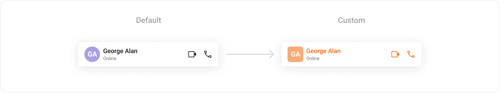
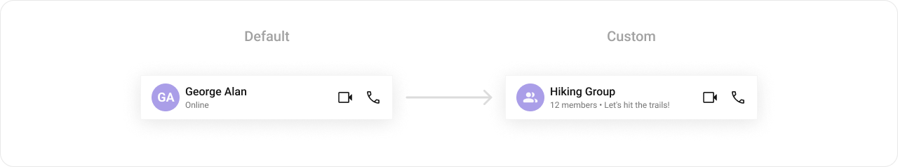

import Tabs from '@theme/Tabs';
import TabItem from '@theme/TabItem';
import { Tooltip } from 'react-tooltip'
import 'react-tooltip/dist/react-tooltip.css'

## Overview

`MessageHeader` is a [Component](/ui-kit/android/components-overview#components) that showcases the [User](/sdk/android/users-overview) or [Group](/sdk/android/groups-overview) details in the toolbar. Furthermore, it also presents a typing indicator and a back navigation button for ease of use.


---

## Usage

### Integration

You can add `MessageHeader` component directly into the `layout.xml`` file.

```xml title="your_layout.xml"
<com.cometchat.chatuikit.messageheader.CometChatMessageHeader
                android:id="@+id/header"
                android:layout_width="match_parent"
                android:layout_height="56dp" />
```

### Actions

[Actions](./01-components-overview.md#actions) dictate how a component functions. They are divided into two types: Predefined and User-defined. You can override either type, allowing you to tailor the behavior of the component to fit your specific needs.

The `MessageHeader` component does not have any exposed actions.

##### OnError

This action doesn't change the behavior of the component but rather listens for any errors that occur in the Users component.

<Tabs>

<TabItem value="java" label="Java">
```java title="YourActivity.java"
cometchatMessageHeader.setOnError(cometchatException -> {

    });
```
</TabItem>

<TabItem value="kotlin" label="Kotlin">

```kotlin title="YourActivity.kt"
cometchatMessageHeader.setOnError {

    }
```

</TabItem>

</Tabs>

---

##### setOnBackPressListener

`OnBackPressListener` is triggered when you press the back button in the app bar. It has a predefined behavior; when clicked, it navigates to the previous activity. However, you can override this action using the following code snippet.

<Tabs>

<TabItem value="java" label="Java">
```java title="YourActivity.java"
cometchatMessageHeader.setOnBackPressListener(() -> {
            
    });
```
</TabItem>

<TabItem value="kotlin" label="Kotlin">

```kotlin title="YourActivity.kt"
cometchatMessageHeader.onBackPressListener = OnBackPress {

    }
```
</TabItem>
</Tabs>

---

### Filters

**Filters** allow you to customize the data displayed in a list within a `Component`. You can filter the list based on your specific criteria, allowing for a more customized. Filters can be applied using `RequestBuilders` of Chat SDK.

The `MessageHeader` component does not have any exposed filters.

### Events

[Events](./01-components-overview.md#events) are emitted by a `Component`. By using event you can extend existing functionality. Being global events, they can be applied in Multiple Locations and are capable of being Added or Removed.

The `MessageHeader` component does not produce any events.

## Customization

To fit your app's design requirements, you can customize the appearance of the conversation component. We provide exposed methods that allow you to modify the experience and behavior according to your specific needs.

### Style

Using Style you can customize the look and feel of the component in your app, These parameters typically control elements such as the color, size, shape, and fonts used within the component.



```xml title="themes.xml"
    <style name="CustomCallButtonStyle" parent="CometChatCallButtonsStyle">
        <item name="cometchatCallButtonsVideoCallIconTint">#F76808</item>
        <item name="cometchatCallButtonsVoiceCallIconTint">#F76808</item>
    </style>

    <style name="CustomMessageHeaderStyle" parent="CometChatMessageHeaderStyle">
        <item name="cometchatMessageHeaderTitleTextColor">#F76808</item>
        <item name="cometchatMessageHeaderAvatarStyle">@style/CustomAvatarStyle</item>
        <item name="cometchatMessageHeaderCallButtonsStyle">@style/CustomCallButtonStyle</item>
    </style>
```

<Tabs>

<TabItem value="Java" label="Java">
```Java
cometchatMessageHeader.setStyle(R.style.CustomMessageHeaderStyle);
```
</TabItem>

<TabItem value="Kotlin" label="Kotlin">
```Kotlin
cometchatMessageHeader.setStyle(R.style.CustomMessageHeaderStyle)
```
</TabItem>

</Tabs>

---
To know more such attributes, visit the [attributes file](https://github.com/cometchat/cometchat-uikit-android/blob/v5/chatuikit/src/main/res/values/attr_cometchat_message_header.xml).

### Functionality

These are a set of small functional customizations that allow you to fine-tune the overall experience of the component. With these, you can change text, set custom icons, and toggle the visibility of UI elements.

Following is a list of customizations along with their corresponding code snippets:

| Property                  | Description                                                              | Code                              |
| ------------------------- | ------------------------------------------------------------------------ | --------------------------------- |
| **User**                  | Used to pass user object of which header specific details will be shown. This is a one of the required property for the component to function properly. | `.setUser(user)` |
| **Group**                 | Used to pass group object of which header specific details will be shown. This is a one of the required property for the component to function properly. | `.setGroup(Group)`|
| **setBackButtonVisibility** | Used to toggle back button visibility                                    | `.setBackButtonVisibility(View.GONE)` |
| **setUserStatusVisibility**   | Used to toggle functionality to show user's presence                     | `.setUserStatusVisibility(View.VISIBLE)`   |
| **setVideoCallButtonVisibility**   | Defines whether a user can initiate a video call                  | `.setVideoCallButtonVisibility(View.VISIBLE)`   |
| **setVoiceCallButtonVisibility**   | Defines whether a user can initiate a voice call                  | `.setVoiceCallButtonVisibility(View.VISIBLE)`   |

### Advanced

For advanced-level customization, you can set custom views to the component. This lets you tailor each aspect of the component to fit your exact needs and application aesthetics. You can create and define your views, layouts, and UI elements and then incorporate those into the component.

#### setAuxiliaryButtonView
Allows adding a custom button or additional action next to the title or trailing section.

Use Cases:
- Add a Call button (📞) for quick voice/video calls.
- Include a Block/Report button for moderation.
- Implement a Pin Chat feature.

<Tabs>

<TabItem value="java" label="Java">
```java title="YourActivity.java"
cometchatMessageHeader.setAuxiliaryButtonView((context, user, group) -> {
            
    });
```
</TabItem>

<TabItem value="kotlin" label="Kotlin">

```kotlin title="YourActivity.kt"
cometchatMessageHeader.setAuxiliaryButtonView(object : Function3<Context?, User?, Group?, View?> {
            override fun apply(context: Context?, user: User?, group: Group?): View? {
             
            }
        })
```

</TabItem>
</Tabs>

---

#### setItemView
Enables replacing the entire default header with a fully customized ListItem layout.

Use Cases:
- Create a completely unique message header style.
- Include additional user details like bio, location, or last seen status.

<Tabs>

<TabItem value="java" label="Java">
```java title="YourActivity.java"
cometchatMessageHeader.setItemView((context, user, group) -> {
            
    });
```
</TabItem>

<TabItem value="kotlin" label="Kotlin">

```kotlin title="YourActivity.kt"
cometchatMessageHeader.setItemView(object : Function3<Context?, User?, Group?, View?> {
            override fun apply(context: Context?, user: User?, group: Group?): View? {
             
            }
        })
```

</TabItem>
</Tabs>

---

#### setSubtitleView

Allows customizing the subtitle view, usually used for status messages or additional details.

Use Cases:
- Show the user's last seen or online status.
- Display a custom typing indicator.
- Show a custom role or tagline ("Customer Support", "Verified Seller").

<Tabs>

<TabItem value="java" label="Java">
```java title="YourActivity.java"
cometchatMessageHeader.setSubtitleView((context, user, group) -> {
            
    });
```
</TabItem>

<TabItem value="kotlin" label="Kotlin">

```kotlin title="YourActivity.kt"
cometchatMessageHeader.setSubtitleView(object : Function3<Context?, User?, Group?, View?> {
            override fun apply(context: Context?, user: User?, group: Group?): View? {
             
            }
        })
```

</TabItem>
</Tabs>

**Example**


You should create a `subtitle_layout.xml` file and inflate it inside `apply` function.

<Tabs>

<TabItem value="java" label="Java">

```java title="YourActivity.java"
cometChatMessageHeader.setSubtitleView((context, user, group) -> {
            TextView textView = new TextView(context);
            if(user!=null) {
                textView.setText(user.getStatus());
            }else if(group!=null) {
                textView.setText(group.getMembersCount() > 1 ? group.getMembersCount() + " members" : group.getMembersCount() + " member" + " • " + group.getDescription());
            }
            return textView;
        });
```

</TabItem>

<TabItem value="kotlin" label="Kotlin">

```kotlin title="YourActivity.kt"
cometChatMessageHeader.setSubtitleView(object : Function3<Context?, User?, Group?, View?> {
            override fun apply(context: Context?, user: User?, group: Group?): View? {
                val textView = TextView(context)
                if (user != null) {
                    textView.text = user.status
                } else if (group != null) {
                    textView.text =
                        if (group.membersCount > 1) group.membersCount.toString() + " members" else group.membersCount.toString() + " member" + " • " + group.description
                }
                return textView
            }
        })
```

</TabItem>

</Tabs>

---

#### setLeadingView
Defines a custom leading view, typically used for the receiver's profile picture or avatar.

Use Cases:
- Display a circular profile picture with a status indicator.
- Add a custom badge for special roles (Admin, Verified ✅).

<Tabs>

<TabItem value="java" label="Java">
```java title="YourActivity.java"
cometchatMessageHeader.setLeadingView((context, user, group) -> {
            
    });
```
</TabItem>

<TabItem value="kotlin" label="Kotlin">

```kotlin title="YourActivity.kt"
cometchatMessageHeader.setLeadingView(object : Function3<Context?, User?, Group?, View?> {
            override fun apply(context: Context?, user: User?, group: Group?): View? {
             
            }
        })
```

</TabItem>
</Tabs>

**Example**


You need to create a `custom_header_back_icon.xml` file, inflate it, and then pass it to the `.setBackIcon(view)` method.

```xml
<?xml version="1.0" encoding="utf-8"?>
<RelativeLayout xmlns:android="http://schemas.android.com/apk/res/android"
    android:layout_width="match_parent"
    android:layout_height="match_parent"
    xmlns:app="http://schemas.android.com/apk/res-auto">

    <androidx.cardview.widget.CardView
        android:layout_width="wrap_content"
        android:layout_height="wrap_content"
        android:elevation="20dp"
        android:backgroundTint="#6851D6"
        app:cardCornerRadius="20dp"
        >
        <ImageView
            android:id="@+id/img_back"
            android:layout_width="wrap_content"
            android:layout_height="wrap_content"
            android:src="@drawable/ic_back_ios"
            android:padding="5dp"
            />
    </androidx.cardview.widget.CardView>
</RelativeLayout>
```

<Tabs>

<TabItem value="java" label="Java">

```java
View view = getLayoutInflater().inflate(R.layout.custom_header_back_icon, null);
ImageView imgBack = view.findViewById(R.id.img_back);
imgBack.setOnClickListener(v -> {
    Toast.makeText(this, "BackIcon Clicked !!", Toast.LENGTH_SHORT).show();
});
header.setLeadingView(view);
```

</TabItem>

<TabItem value="kotlin" label="Kotlin">
```kotlin
val view = layoutInflater.inflate(R.layout.custom_header_back_icon, null)
val imgBack = view.findViewById<ImageView>(R.id.img_back)
imgBack.setOnClickListener {
    Toast.makeText(this, "BackIcon Clicked !!", Toast.LENGTH_SHORT).show()
}
header.setBackIcon(view)
```
</TabItem>

</Tabs>

---

#### setTrailingView

Enables customization of the trailing view, typically used for action buttons or indicators.

Use Cases:
- Add an options menu (⋮) for more actions.
- Display a mute/unmute toggle.
- Show a connection strength indicator for calls.

<Tabs>

<TabItem value="java" label="Java">
```java title="YourActivity.java"
cometchatMessageHeader.setTrailingView((context, user, group) -> {
            
    });
```
</TabItem>

<TabItem value="kotlin" label="Kotlin">

```kotlin title="YourActivity.kt"
cometchatMessageHeader.setTrailingView(object : Function3<Context?, User?, Group?, View?> {
            override fun apply(context: Context?, user: User?, group: Group?): View? {
             
            }
    })
```

</TabItem>
</Tabs>
**Example**


You need to create a `view_menu.xml` file, inflate it, and then return it from `.setBackIcon(view)` method.

```xml title="overflow_menu_layout.xml"
<?xml version="1.0" encoding="utf-8"?>
<LinearLayout xmlns:android="http://schemas.android.com/apk/res/android"
    android:layout_width="wrap_content"
    android:layout_height="wrap_content"
    android:orientation="vertical">

    <ImageView
        android:id="@+id/ivMenu"
        android:layout_width="@dimen/cometchat_24dp"
        android:layout_height="@dimen/cometchat_24dp"
        android:layout_marginStart="@dimen/cometchat_margin_4"
        android:importantForAccessibility="no"
        android:src="@drawable/ic_info" />

</LinearLayout>
```

<Tabs>

<TabItem value="java" label="Java">

```java title ="YourActivity.java"
cometChatMessageHeader.setTrailingView((context, user, group) -> {
            LinearLayout linearLayout = new LinearLayout(context);
            View view = ChatConfigurator.getDataSource().getAuxiliaryHeaderMenu(context, user, group,
                    new AdditionParameter());

            OverflowMenuLayoutBinding overflowMenuLayoutBinding = OverflowMenuLayoutBinding
                    .inflate(getLayoutInflater());

            linearLayout.setOrientation(LinearLayout.HORIZONTAL);
            linearLayout.setGravity(Gravity.CENTER_VERTICAL);

            linearLayout.addView(view);
            linearLayout.addView(overflowMenuLayoutBinding.getRoot());
            return linearLayout;
        });
```

</TabItem>

<TabItem value="kotlin" label="Kotlin">
```kotlin
cometChatMessageHeader.setTrailingView(object : Function3<Context?, User?, Group?, View?> {
            override fun apply(context: Context?, user: User?, group: Group?): View? {
                val linearLayout = LinearLayout(context)
                val view = ChatConfigurator.getDataSource().getAuxiliaryHeaderMenu(
                    context, user, group,
                    cometChatMessageHeader.getAdditionParameter()
                )

                val overflowMenuLayoutBinding: OverflowMenuLayoutBinding = OverflowMenuLayoutBinding
                    .inflate(layoutInflater)

                linearLayout.orientation = LinearLayout.HORIZONTAL
                linearLayout.gravity = Gravity.CENTER_VERTICAL

                linearLayout.addView(view)
                linearLayout.addView(overflowMenuLayoutBinding.getRoot())
                return linearLayout
            }
        })

```
</TabItem>

</Tabs>

```
