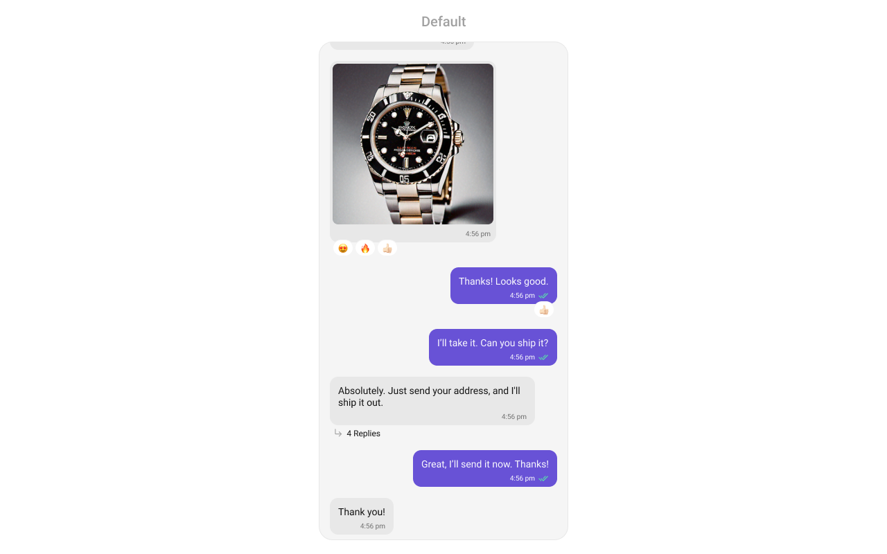
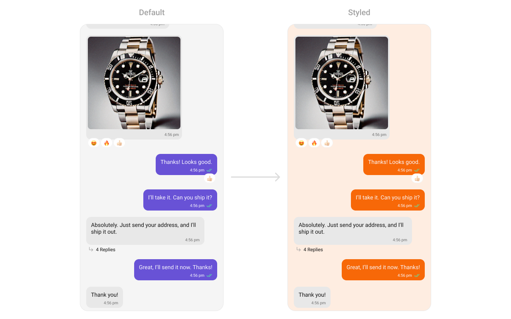
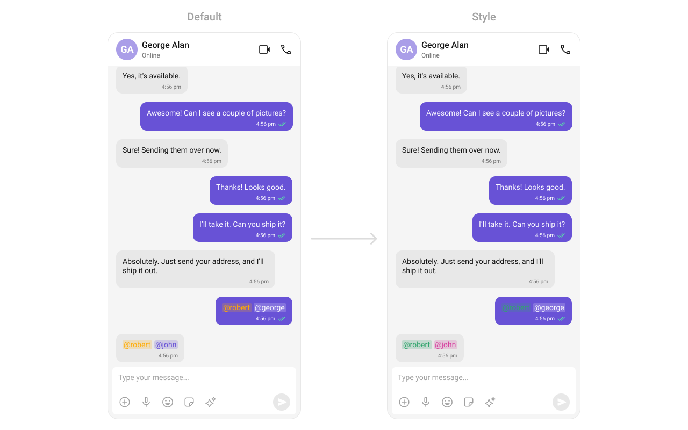
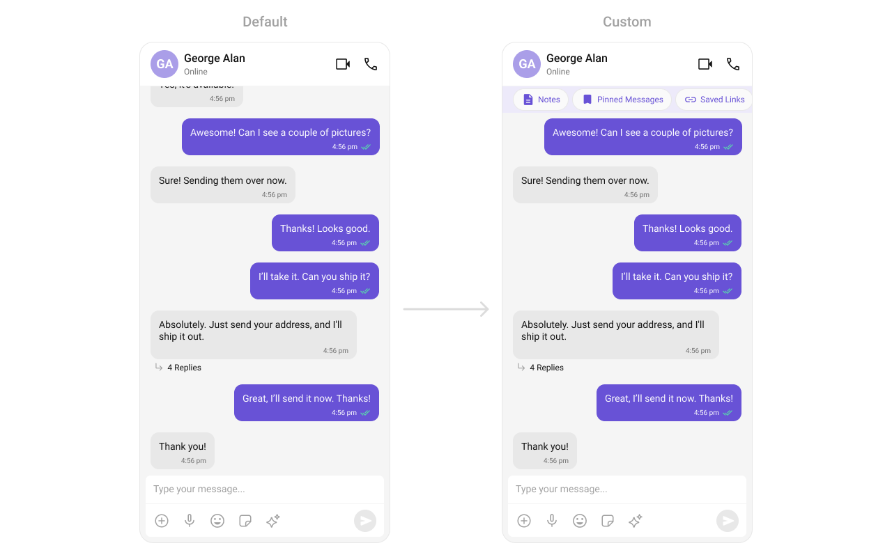
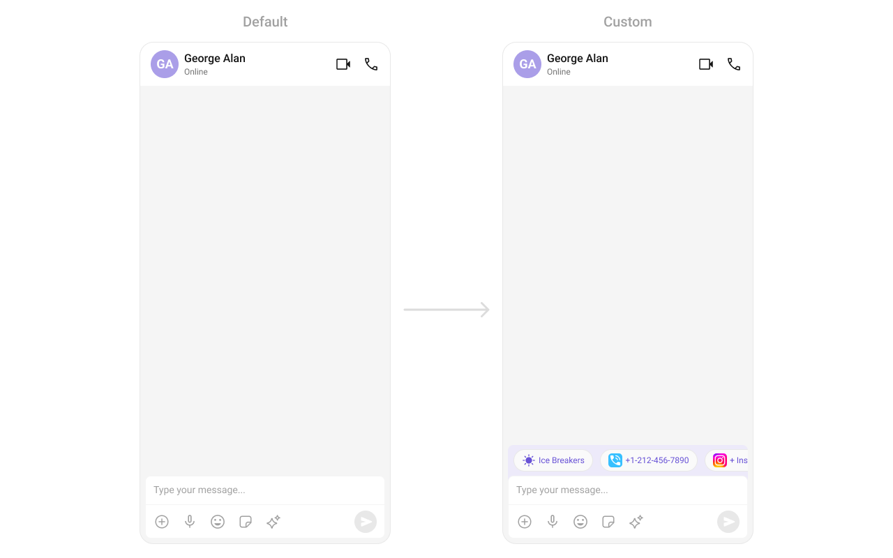

import Tabs from '@theme/Tabs';
import TabItem from '@theme/TabItem';
import { Tooltip } from 'react-tooltip'
import 'react-tooltip/dist/react-tooltip.css'

## Overview

`MessageList` is a [Composite Component](./01-components-overview.md#components) that displays a list of messages and effectively manages real-time operations. It includes various types of messages such as Text Messages, Media Messages, Stickers, and more.

`MessageList` is primarily a list of the base component [MessageBubble](../04-Theming/04-message-bubble-styling.md#message-bubbles). The MessageBubble Component is utilized to create different types of chat bubbles depending on the message type.



## Usage

### Integration

The following code snippet illustrates how you can directly incorporate the MessageList component into your `layout.xml` file.

<Tabs>
<TabItem value="xml" label="XML">

```xml
<com.cometchat.chatuikit.messagelist.CometChatMessageList
                android:id="@+id/message_list"
                android:layout_width="match_parent"
                android:layout_height="match_parent"
                android:layout_marginStart="16dp"
                android:layout_marginEnd="16dp"
                android:background="@android:color/transparent" />
```

</TabItem>
</Tabs>

:::warning

Simply adding the `MessageList` component to the layout will only display the loading indicator. To fetch messages for a specific entity, you need to supplement it with `User` or `Group` Object.

:::

---

### Actions

[Actions](./01-components-overview.md#actions) dictate how a component functions. They are divided into two types: Predefined and User-defined. You can override either type, allowing you to tailor the behavior of the component to fit your specific needs.

##### 1. onThreadRepliesClick

`onThreadRepliesClick` is triggered when you click on the threaded message bubble.
The `onThreadRepliesClick` action doesn't have a predefined behavior. You can override this action using the following code snippet.

<Tabs>

<TabItem value="java" label="Java">

```java
cometchatMessageList.setOnThreadRepliesClick((context, baseMessage, cometchatMessageTemplate) -> {

        });
```
</TabItem>

<TabItem value="kotlin" label="Kotlin">

```kotlin
cometchatMessageList.onThreadRepliesClick =
            ThreadReplyClick { context, baseMessage, cometchatMessageTemplate -> }
```

</TabItem>

</Tabs>

##### 2. onError

This action doesn't change the behavior of the component but rather listens for any errors that occur in the MessageList component.

<Tabs>

<TabItem value="java" label="Java">

```java title="YourActivity.java"
cometchatMessageList.setOnError(new OnError() {
    @Override
    public void onError(CometChatException e) {
        //Your Exception Handling code.
    }
});
```
</TabItem>

<TabItem value="kotlin" label="Kotlin">

```kotlin title="YourActivity.kt"
cometchatMessageList.setOnError(object : OnError {
    override fun onError(e: CometChatException) {
        // Your Exception Handling code.
    }
})
```

</TabItem>

</Tabs>

---

##### setOnLoad
Invoked when the list is successfully fetched and loaded, helping track component readiness.

<Tabs>

<TabItem value="java" label="Java">

```java title="YourActivity.java"
cometchatMessageList.setOnLoad(list -> {

});
```
</TabItem>

<TabItem value="kotlin" label="Kotlin">

```kotlin title="YourActivity.kt"
cometchatMessageList.setOnLoad(object : OnLoad<BaseMessage?> {
    override fun onLoad(list: MutableList<BaseMessage?>?) {

    }
})
```

</TabItem>

</Tabs>
---

##### setOnEmpty
Called when the list is empty, enabling custom handling such as showing a placeholder message.

<Tabs>

<TabItem value="java" label="Java">

```java title="YourActivity.java"
cometchatMessageList.setOnEmpty(() -> {
            
    });
```
</TabItem>

<TabItem value="kotlin" label="Kotlin">

```kotlin title="YourActivity.kt"
cometchatMessageList.setOnEmpty{
            
    }
```

</TabItem>

</Tabs>
---

##### onReactionLongClick
Function triggered when a user long presses on a reaction pill, allowing developers to override the default behavior.

<Tabs>

<TabItem value="java" label="Java">

```java title="YourActivity.java"
cometchatMessageList.setOnReactionLongClick((emoji, baseMessage) -> {

    });
```
</TabItem>

<TabItem value="kotlin" label="Kotlin">

```kotlin title="YourActivity.kt"
cometchatMessageList.onReactionLongClick = OnReactionLongClick { emoji, baseMessage -> }
```
</TabItem>

</Tabs>
---

##### onAddMoreReactionsClick
Function triggered when a user clicks on the 'Add More Reactions' button, allowing developers to handle this action.

<Tabs>

<TabItem value="java" label="Java">

```java title="YourActivity.java"
cometchatMessageList.setOnAddMoreReactionsClick(baseMessage -> {
            
    });
```
</TabItem>

<TabItem value="kotlin" label="Kotlin">

```kotlin title="YourActivity.kt"
cometchatMessageList.onAddMoreReactionsClick =
        OnAddMoreReactionsClick { 
                
    }
```

</TabItem>

</Tabs>
---

##### onReactionClick
Function triggered when a reaction is clicked, enabling developers to customize reaction interactions.

<Tabs>

<TabItem value="java" label="Java">

```java title="YourActivity.java"
cometchatMessageList.setOnReactionClick((emoji, baseMessage) -> {

    });
```
</TabItem>

<TabItem value="kotlin" label="Kotlin">

```kotlin title="YourActivity.kt"
cometchatMessageList.onReactionClick = OnReactionClick { emoji, baseMessage -> }
```

</TabItem>

</Tabs>
---

##### setOnReactionListItemClick
Function triggered when a reaction list item is clicked, allowing developers to override its behavior in CometChatReactionsList.

<Tabs>

<TabItem value="java" label="Java">

```java title="YourActivity.java"
cometchatMessageList.setOnReactionListItemClick((reaction, message) -> {

    });
```
</TabItem>

<TabItem value="kotlin" label="Kotlin">

```kotlin title="YourActivity.kt"
cometchatMessageList.onReactionListItemClick =
            OnReactionListItemClick { reaction, message -> } 
```

</TabItem>

</Tabs>
---

### Filters

You can adjust the `MessagesRequestBuilder` in the MessageList Component to customize your message list. Numerous options are available to alter the builder to meet your specific needs. For additional details on `MessagesRequestBuilder`, please visit [MessagesRequestBuilder](/sdk/android/additional-message-filtering).

In the example below, we are applying a filter to the messages based on a search substring and for a specific user. This means that only messages that contain the search term and are associated with the specified user will be displayed

<Tabs>

<TabItem value="java" label="Java">

```java
MessagesRequest.MessagesRequestBuilder messagesRequest = new MessagesRequest.MessagesRequestBuilder()
    .setSearchKeyword("your search keyword")
    .setUID("user uid");

messageList.setMessagesRequestBuilder(messagesRequest);
```

</TabItem>

<TabItem value="Kotlin" label="Kotlin">

```kotlin
val messagesRequest = MessagesRequest.MessagesRequestBuilder()
    .setSearchKeyword("your search keyword")
    .setUID("user uid")
    .build()

messageList.messagesRequestBuilder = messagesRequest
```

</TabItem>

</Tabs>

:::info

The following parameters in messageRequestBuilder will always be altered inside the message list

1. UID
2. GUID
3. types
4. categories

:::

---

### Events

[Events](./01-components-overview.md#events) are emitted by a `Component`. By using event you can extend existing functionality. Being global events, they can be applied in Multiple Locations and are capable of being Added or Removed.

The MessageList Component does not emit any events of its own.

---

## Customization

To fit your app's design requirements, you can customize the appearance of the conversation component. We provide exposed methods that allow you to modify the experience and behavior according to your specific needs.

### Style

Using Style you can customize the look and feel of the component in your app, These parameters typically control elements such as the color, size, shape, and fonts used within the component.



```xml
    <style name="CustomOutgoingMessageBubbleStyle" parent="CometChatOutgoingMessageBubbleStyle">
        <item name="cometchatMessageBubbleBackgroundColor">#F76808</item>
    </style>

    <style name="CustomCometChatMessageListStyle" parent="CometChatMessageListStyle">
        <item name="cometchatMessageListBackgroundColor">#FEEDE1</item>
        <item name="cometchatMessageListOutgoingMessageBubbleStyle">@style/CustomOutgoingMessageBubbleStyle</item>
    </style>
```

<Tabs>

<TabItem value="java" label="Java">

```java
cometChatMessageList.setStyle(R.style.CustomCometChatMessageListStyle);
```

</TabItem>

<TabItem value="Kotlin" label="Kotlin">

```kotlin
cometChatMessageList.setStyle(R.style.CustomCometChatMessageListStyle);
```

</TabItem>

</Tabs>
To know more such attributes, visit the [attributes file](https://github.com/cometchat/cometchat-uikit-android/blob/v5/chatuikit/src/main/res/values/attr_cometchat_message_list.xml).

### Functionality

These are a set of small functional customizations that allow you to fine-tune the overall experience of the component. With these, you can change text, set custom icons, and toggle the visibility of UI elements.

<Tabs>

<TabItem value="java" label="Java">

```java
CometChatMessageList cometChatMessageList = findViewById(R.id.message_list);
cometChatMessageList.setUser(user);
cometChatMessageList.hideError(true);
cometChatMessageList.hideReceipt(true);
```

</TabItem>

<TabItem value="Kotlin" label="Kotlin">

```kotlin
val cometChatMessageList = findViewById<CometChatMessageList>(R.id.message_list)
cometChatMessageList.setUser(user)
cometChatMessageList.hideError(true)
cometChatMessageList.hideReceipt(true)
```

</TabItem>

</Tabs>

Below is a list of customizations along with corresponding code snippets


| Property                       | Description                                                                                                                                                                                                                                     | Code                                                          |
| ------------------------------ | ----------------------------------------------------------------------------------------------------------------------------------------------------------------------------------------------------------------------------------------------- | ------------------------------------------------------------- |
| **setUser**                    | Used to pass user object of which header specific details will be shown                                                                                                                                                                         | `.setUser(user);`                                             |
| **setGroup**                   | Used to pass group object of which header specific details will be shown                                                                                                                                                                        | `.setGroup(Group);`                                           |
| **setAlignment**               | used to set the alignmet of messages in CometChatMessageList. It can be either **leftAligned** or **standard**                                                                                                                                  | `.setAlignment(UIKitConstants.MessageListAlignment);`         |
| **setErrorStateVisibility**                  | used to toggle visibility of error state in MessageList                                                                                                                                                                                               | `.setErrorStateVisibility(View.GONE);`                                          |
| **disableSoundForMessages**    | used to enable/disable sound for incoming/outgoing messages , default false                                                                                                                                                                     | `.disableSoundForMessages(false);`                            |
| **setCustomSoundForMessages**  | used to set custom sound for outgoing message                                                                                                                                                                                                   | `.setCustomSoundForMessages(@RawRes resource);`               |
| **setAvatarVisibility**                 | used to toggle visibility for avatar                                                                                                                                                                                                            | `.setAvatarVisibility(View.GONE);`                                         |
| **scrollToBottomOnNewMessage** | should scroll to bottom on new message? , by default false                                                                                                                                                                                      | `.scrollToBottomOnNewMessage(true);`                          |
| **setReceiptsVisibility**                | Used to control visibility of read receipts without disabling the functionality of marking messages as read and delivered.                                                                                                                      | `.setReceiptsVisibility(View.GONE);`                                        |
| **setQuickReactions**          | The list of quick reactions to be set.This list will replace the predefined set of reactions                                                                                                                                                    | `.setQuickReactions(Arrays.asList("👻","😈","🙀","🤡","❤️");` |
| **setStickyDateVisibility**                 | used to toggle visibility for sticky header                                                                                                                                                                                                            | `.setStickyDateVisibility(View.GONE);`                                         |
| **replyInThreadOptionVisibility**                 | used to toggle visibility for thread option                                                                                                       | `.replyInThreadOptionVisibility(View.GONE);`                                         |
| **translateMessageOptionVisibility**                 | used to toggle visibility for translate option    | `.translateMessageOptionVisibility(View.GONE);`                                         |
| **editMessageOptionVisibility**                 | used to toggle visibility for edit option  | `.editMessageOptionVisibility(View.GONE);`                                         |
| **deleteMessageOptionVisibility**                 | used to toggle visibility for delete option | `.deleteMessageOptionVisibility(View.GONE);`                                         |
| **setMessageReactionOptionVisibility**                 | used to toggle visibility for reaction option    | `.setMessageReactionOptionVisibility(View.GONE);`                                         |
| **messagePrivatelyOptionVisibility**                 | used to toggle visibility for private option     | `.messagePrivatelyOptionVisibility(View.GONE);`                                         |
| **copyMessageOptionVisibility**                 | used to toggle visibility for copy option  | `.copyMessageOptionVisibility(View.GONE);` |
| **messageInfoOptionVisibility**                 | used to toggle visibility for info option  | `.messageInfoOptionVisibility(View.GONE);` |
| **groupActionMessageVisibility**                 | used to toggle visibility for action message option  | `.groupActionMessageVisibility(View.GONE);` |
| **enableConversationStarters**                 | Controls whether conversation starters are generated in new conversations  | `.enableConversationStarters(true);` |
| **enableSmartReplies**                 | Enables smart replies for quick responses  | `.enableSmartReplies(true);` |
| **smartRepliesKeywords**                 | Defines specific keywords in an incoming message that will trigger Smart Replies.  | `.setAISmartRepliesKeywords(Arrays.asList("hello", "hi", "how are you", "good morning", "good evening", "good night"));` |
| **smartRepliesDelayDuration**                 | Sets the delay time before Smart Replies are fetched and displayed after a message is received.  | `.smartRepliesDelayDuration(5000);` |
---

### Advance

For advanced-level customization, you can set custom views to the component. This lets you tailor each aspect of the component to fit your exact needs and application aesthetics. You can create and define your views, layouts, and UI elements and then incorporate those into the component.

#### SetTemplate

[CometChatMessageTemplate](../07-Advanced/01-message-template.md) is a pre-defined structure for creating message views that can be used as a starting point or blueprint for creating message views often known as message bubbles. For more information, you can refer to [CometChatMessageTemplate](../07-Advanced/01-message-template.md).

#### setDateFormat

Specifies a custom format for displaying sticky date separators in the chat.

Use Cases:
- Customize date formats to match regional preferences.
- Use relative formats like "Yesterday" instead of full dates.
- Highlight weekend conversations with different styles.

<Tabs>

<TabItem value="java" label="Java">
```Java
messageList.setDateFormat(new SimpleDateFormat("MMM dd, yyyy",Locale.getDefault()));
```
</TabItem>

<TabItem value="kotlin" label="Kotlin">

```kotlin
messageList.setDateFormat(SimpleDateFormat("MMM dd, yyyy",Locale.getDefault()))
```
</TabItem>

</Tabs>

---

#### setTimeFormat

Defines the format in which time appears for each message bubble.

Use Cases:
- Use 12-hour or 24-hour formats based on user preference.
- Display relative time ("Just now", "5 min ago").
- Add AM/PM indicators for clarity.

<Tabs>

<TabItem value="java" label="Java">
```Java
messageList.setTimeFormat(new SimpleDateFormat("hh:mm a",Locale.getDefault()));
```
</TabItem>

<TabItem value="kotlin" label="Kotlin">

```kotlin
messageList.setTimeFormat(SimpleDateFormat("hh:mm a",Locale.getDefault()))
```

</TabItem>

</Tabs>

---


#### setLoadingView
Customizes the loading indicator when messages are being fetched.

Use Cases:
- Show a spinner or skeleton loader for smooth UX.
- Display a "Fetching messages..." text.


<Tabs>

<TabItem value="java" label="Java">
```Java
cometchatMessageList.setLoadingView(R.layout.your_loading_view);
````
</TabItem>

<TabItem value="kotlin" label="Kotlin">
```kotlin
cometchatMessageList.loadingView = R.layout.your_loading_view
```
</TabItem>

</Tabs>

---

#### setEmptyView
Defines a custom view to be displayed when no messages are available.

Use Cases:
- Show a friendly message like "No messages yet. Start the conversation!".

<Tabs>

<TabItem value="java" label="Java">
```Java
cometchatMessageList.setEmptyView(R.layout.your_empty_view);
````

</TabItem>

<TabItem value="kotlin" label="Kotlin">
```kotlin
cometchatMessageList.emptyView = R.layout.your_empty_view
```
</TabItem>

</Tabs>

---

#### setErrorView
Custom error state view displayed when fetching messages fails.

Use Cases:
- Show a retry button when an error occurs.
- Display a friendly message like "Couldn't load messages. Check your connection.".


<Tabs>

<TabItem value="java" label="Java">

```Java
cometchatMessageList.setErrorView(R.layout.your_empty_view);
````

</TabItem>

<TabItem value="kotlin" label="Kotlin">
```kotlin
cometchatMessageList.errorView = R.layout.your_error_view
```
</TabItem>

</Tabs>

---

#### setTextFormatters

Assigns the list of text formatters. If the provided list is not null, it sets the list. Otherwise, it assigns the default text formatters retrieved from the data source. To configure the existing Mentions look and feel check out [MentionsFormatter Guide](../07-Advanced/02-CometChatMentionsFormatter.md)
**Example**


```xml title="themes.xml"
<style name="CustomIncomingMessageBubbleMentionStyle" parent="CometChatIncomingBubbleMentionsStyle">
    <item name="cometchatMentionTextAppearance">?attr/cometchatTextAppearanceBodyRegular</item>
    <item name="cometchatMentionTextColor">#D6409F</item>
    <item name="cometchatMentionBackgroundColor">#D6409F</item>
    <item name="cometchatSelfMentionTextColor">#30A46C</item>
    <item name="cometchatSelfMentionTextAppearance">?attr/cometchatTextAppearanceBodyRegular</item>
    <item name="cometchatSelfMentionBackgroundColor">#30A46C</item>
</style>

<style name="CustomOutgoingMessageBubbleMentionStyle" parent="CometChatOutgoingBubbleMentionsStyle">
    <item name="cometchatMentionTextAppearance">?attr/cometchatTextAppearanceBodyRegular</item>
    <item name="cometchatMentionTextColor">#FFFFFF</item>
    <item name="cometchatMentionBackgroundColor">#F9F8FD</item>
    <item name="cometchatSelfMentionTextColor">#30A46C</item>
    <item name="cometchatSelfMentionTextAppearance">?attr/cometchatTextAppearanceBodyRegular</item>
    <item name="cometchatSelfMentionBackgroundColor">#30A46C</item>
</style>

```

<Tabs>

<TabItem value="java" label="Java">

```Java
// Initialize CometChatMentionsFormatter
CometChatMentionsFormatter mentionFormatter = new CometChatMentionsFormatter(context);

//set style to customize bubble mention text
mentionFormatter.setOutgoingBubbleMentionTextStyle(context, R.style.CustomOutgoingMessageBubbleMentionStyle);

mentionFormatter.setIncomingBubbleMentionTextStyle(context, R.style.CustomIncomingMessageBubbleMentionStyle);

// This can be passed as an array of formatter in CometChatMessageList by using setTextFormatters method.
List<CometChatTextFormatter> textFormatters = new ArrayList<>();
textFormatters.add(mentionFormatter);
messageList.setTextFormatters(textFormatters);

````

</TabItem>

<TabItem value="kotlin" label="Kotlin">

```kotlin

// Initialize CometChatMentionsFormatter
val mentionFormatter = CometChatMentionsFormatter(context)

//set style to customize bubble mention text
mentionFormatter.setOutgoingBubbleMentionTextStyle(context, R.style.CustomOutgoingMessageBubbleMentionStyle)

mentionFormatter.setIncomingBubbleMentionTextStyle(context, R.style.CustomIncomingMessageBubbleMentionStyle)

// This can be passed as an array of formatter in CometChatMessageList by using setTextFormatters method.
val textFormatters: MutableList<CometChatTextFormatter> = ArrayList()
textFormatters.add(mentionFormatter)
messageList.setTextFormatters(textFormatters)

 ```

</TabItem>
</Tabs>

#### setHeaderView

This method allows you to set a custom header view for the message list. By providing a View object, you can customize the appearance and content of the header displayed at the top of the message list.

Use Cases:
- Add a custom branding/logo to the chat.
- Display chat status ("John is typing...").
- Show last seen status.

<Tabs>

<TabItem value="java" label="Java">
    ```Java
    cometChatMessageList.setHeaderView(view);
    ```
</TabItem>

<TabItem value="kotlin" label="Kotlin">

    ```kotlin
    cometChatMessageList.setHeaderView(view)
    ```

</TabItem>

</Tabs>

**Example**



```xml title="custom_header_layout.xml"

<?xml version="1.0" encoding="utf-8"?>
<LinearLayout xmlns:android="http://schemas.android.com/apk/res/android"
    xmlns:app="http://schemas.android.com/apk/res-auto"
    android:layout_width="match_parent"
    android:layout_height="wrap_content"
    android:background="#EDEAFA"
    android:orientation="horizontal">

    <com.google.android.material.card.MaterialCardView
        android:layout_width="wrap_content"
        android:layout_height="wrap_content"
        android:layout_marginStart="@dimen/cometchat_margin_4"
        android:layout_marginTop="@dimen/cometchat_margin_1"
        android:layout_marginBottom="@dimen/cometchat_margin_1"
        android:elevation="0dp"
        app:cardCornerRadius="@dimen/cometchat_radius_max"
        app:cardElevation="0dp"
        app:strokeColor="?attr/cometchatStrokeColorLight"
        app:strokeWidth="1dp">

        <LinearLayout
            android:layout_width="wrap_content"
            android:layout_height="wrap_content"
            android:layout_marginStart="@dimen/cometchat_padding_3"
            android:layout_marginTop="@dimen/cometchat_padding_1"
            android:layout_marginEnd="@dimen/cometchat_padding_3"
            android:layout_marginBottom="@dimen/cometchat_padding_1"
            android:gravity="center_vertical"
            android:orientation="horizontal">

            <ImageView
                android:layout_width="20dp"
                android:layout_height="@dimen/cometchat_20dp"
                android:src="@drawable/cometchat_ic_file_upload"
                app:tint="?attr/cometchatPrimaryColor" />

            <TextView
                android:layout_width="wrap_content"
                android:layout_height="wrap_content"
                android:layout_marginStart="@dimen/cometchat_margin_1"
                android:text="Notes"
                android:textAppearance="?attr/cometchatTextAppearanceCaption1Regular"
                android:textColor="?attr/cometchatPrimaryColor" />
        </LinearLayout>
    </com.google.android.material.card.MaterialCardView>

    <com.google.android.material.card.MaterialCardView
        android:layout_width="wrap_content"
        android:layout_height="wrap_content"
        android:layout_marginStart="@dimen/cometchat_margin_4"
        android:layout_marginTop="@dimen/cometchat_margin_1"
        android:layout_marginBottom="@dimen/cometchat_margin_1"
        android:elevation="0dp"
        app:cardCornerRadius="@dimen/cometchat_radius_max"
        app:cardElevation="0dp"
        app:strokeColor="?attr/cometchatStrokeColorLight"
        app:strokeWidth="1dp">

        <LinearLayout
            android:layout_width="wrap_content"
            android:layout_height="wrap_content"
            android:layout_marginStart="@dimen/cometchat_padding_3"
            android:layout_marginTop="@dimen/cometchat_padding_1"
            android:layout_marginEnd="@dimen/cometchat_padding_3"
            android:layout_marginBottom="@dimen/cometchat_padding_1"
            android:gravity="center_vertical"
            android:orientation="horizontal">

            <ImageView
                android:layout_width="20dp"
                android:layout_height="@dimen/cometchat_20dp"
                android:src="@drawable/src_icons_pin"
                app:tint="?attr/cometchatPrimaryColor" />

            <TextView
                android:layout_width="wrap_content"
                android:layout_height="wrap_content"
                android:layout_marginStart="@dimen/cometchat_margin_1"
                android:text="Pinned Messages"
                android:textAppearance="?attr/cometchatTextAppearanceCaption1Regular"
                android:textColor="?attr/cometchatPrimaryColor" />
        </LinearLayout>
    </com.google.android.material.card.MaterialCardView>

    <com.google.android.material.card.MaterialCardView
        android:layout_width="wrap_content"
        android:layout_height="wrap_content"
        android:layout_marginStart="@dimen/cometchat_margin_4"
        android:layout_marginTop="@dimen/cometchat_margin_1"
        android:layout_marginBottom="@dimen/cometchat_margin_1"
        android:elevation="0dp"
        app:cardCornerRadius="@dimen/cometchat_radius_max"
        app:cardElevation="0dp"
        app:strokeColor="?attr/cometchatStrokeColorLight"
        app:strokeWidth="1dp">

        <LinearLayout
            android:layout_width="wrap_content"
            android:layout_height="wrap_content"
            android:layout_marginStart="@dimen/cometchat_padding_3"
            android:layout_marginTop="@dimen/cometchat_padding_1"
            android:layout_marginEnd="@dimen/cometchat_padding_3"
            android:layout_marginBottom="@dimen/cometchat_padding_1"
            android:gravity="center_vertical"
            android:orientation="horizontal">

            <ImageView
                android:layout_width="20dp"
                android:layout_height="@dimen/cometchat_20dp"
                android:src="@drawable/cometchat_link_file_icon"
                app:tint="?attr/cometchatPrimaryColor" />

            <TextView
                android:layout_width="wrap_content"
                android:layout_height="wrap_content"
                android:layout_marginStart="@dimen/cometchat_margin_1"
                android:text="Saved Links"
                android:textAppearance="?attr/cometchatTextAppearanceCaption1Regular"
                android:textColor="?attr/cometchatPrimaryColor" />
        </LinearLayout>
    </com.google.android.material.card.MaterialCardView>

</LinearLayout>

```

<Tabs>

<TabItem value="java" label="Java">
```Java
cometChatMessageList.setHeaderView(View.inflate(getContext(), R.layout.custom_header_layout, null));
```
</TabItem>

<TabItem value="kotlin" label="Kotlin">

```kotlin
cometChatMessageList.setHeaderView(View.inflate(context, R.layout.custom_header_layout, null))
```

</TabItem>
</Tabs>
---

#### setFooterView

This method allows you to set a custom footer view for the message list. By providing a View object, you can customize the appearance and content of the footer displayed at the bottom of the message list.

Use Cases:
- Add quick reply buttons.
- Display typing indicators ("John is typing...").
- Show a disclaimer or privacy notice.

<Tabs>

<TabItem value="java" label="Java">
```Java
cometChatMessageList.setFooterView(view);
```
</TabItem>

<TabItem value="kotlin" label="Kotlin">

```kotlin
cometChatMessageList.setFooterView(view)
```

</TabItem>

</Tabs>

**Example**



```xml title="custom_footer_layout.xml"

<?xml version="1.0" encoding="utf-8"?>
<LinearLayout xmlns:android="http://schemas.android.com/apk/res/android"
    xmlns:app="http://schemas.android.com/apk/res-auto"
    android:layout_width="match_parent"
    android:layout_height="wrap_content"
    android:background="#EDEAFA"
    android:orientation="horizontal">

    <com.google.android.material.card.MaterialCardView
        android:layout_width="wrap_content"
        android:layout_height="wrap_content"
        android:layout_marginStart="@dimen/cometchat_margin_4"
        android:layout_marginTop="@dimen/cometchat_margin_1"
        android:layout_marginBottom="@dimen/cometchat_margin_1"
        android:elevation="0dp"
        app:cardCornerRadius="@dimen/cometchat_radius_max"
        app:cardElevation="0dp"
        app:strokeColor="?attr/cometchatStrokeColorLight"
        app:strokeWidth="1dp">

        <LinearLayout
            android:layout_width="wrap_content"
            android:layout_height="wrap_content"
            android:layout_marginStart="@dimen/cometchat_padding_3"
            android:layout_marginTop="@dimen/cometchat_padding_1"
            android:layout_marginEnd="@dimen/cometchat_padding_3"
            android:layout_marginBottom="@dimen/cometchat_padding_1"
            android:gravity="center_vertical"
            android:orientation="horizontal">

            <ImageView
                android:layout_width="20dp"
                android:layout_height="@dimen/cometchat_20dp"
                android:src="@drawable/cometchat_ic_file_upload"
                app:tint="?attr/cometchatPrimaryColor" />

            <TextView
                android:layout_width="wrap_content"
                android:layout_height="wrap_content"
                android:layout_marginStart="@dimen/cometchat_margin_1"
                android:text="Notes"
                android:textAppearance="?attr/cometchatTextAppearanceCaption1Regular"
                android:textColor="?attr/cometchatPrimaryColor" />
        </LinearLayout>
    </com.google.android.material.card.MaterialCardView>

    <com.google.android.material.card.MaterialCardView
        android:layout_width="wrap_content"
        android:layout_height="wrap_content"
        android:layout_marginStart="@dimen/cometchat_margin_4"
        android:layout_marginTop="@dimen/cometchat_margin_1"
        android:layout_marginBottom="@dimen/cometchat_margin_1"
        android:elevation="0dp"
        app:cardCornerRadius="@dimen/cometchat_radius_max"
        app:cardElevation="0dp"
        app:strokeColor="?attr/cometchatStrokeColorLight"
        app:strokeWidth="1dp">

        <LinearLayout
            android:layout_width="wrap_content"
            android:layout_height="wrap_content"
            android:layout_marginStart="@dimen/cometchat_padding_3"
            android:layout_marginTop="@dimen/cometchat_padding_1"
            android:layout_marginEnd="@dimen/cometchat_padding_3"
            android:layout_marginBottom="@dimen/cometchat_padding_1"
            android:gravity="center_vertical"
            android:orientation="horizontal">

            <ImageView
                android:layout_width="20dp"
                android:layout_height="@dimen/cometchat_20dp"
                android:src="@drawable/src_icons_pin"
                app:tint="?attr/cometchatPrimaryColor" />

            <TextView
                android:layout_width="wrap_content"
                android:layout_height="wrap_content"
                android:layout_marginStart="@dimen/cometchat_margin_1"
                android:text="Pinned Messages"
                android:textAppearance="?attr/cometchatTextAppearanceCaption1Regular"
                android:textColor="?attr/cometchatPrimaryColor" />
        </LinearLayout>
    </com.google.android.material.card.MaterialCardView>

    <com.google.android.material.card.MaterialCardView
        android:layout_width="wrap_content"
        android:layout_height="wrap_content"
        android:layout_marginStart="@dimen/cometchat_margin_4"
        android:layout_marginTop="@dimen/cometchat_margin_1"
        android:layout_marginBottom="@dimen/cometchat_margin_1"
        android:elevation="0dp"
        app:cardCornerRadius="@dimen/cometchat_radius_max"
        app:cardElevation="0dp"
        app:strokeColor="?attr/cometchatStrokeColorLight"
        app:strokeWidth="1dp">

        <LinearLayout
            android:layout_width="wrap_content"
            android:layout_height="wrap_content"
            android:layout_marginStart="@dimen/cometchat_padding_3"
            android:layout_marginTop="@dimen/cometchat_padding_1"
            android:layout_marginEnd="@dimen/cometchat_padding_3"
            android:layout_marginBottom="@dimen/cometchat_padding_1"
            android:gravity="center_vertical"
            android:orientation="horizontal">

            <ImageView
                android:layout_width="20dp"
                android:layout_height="@dimen/cometchat_20dp"
                android:src="@drawable/cometchat_link_file_icon"
                app:tint="?attr/cometchatPrimaryColor" />

            <TextView
                android:layout_width="wrap_content"
                android:layout_height="wrap_content"
                android:layout_marginStart="@dimen/cometchat_margin_1"
                android:text="Saved Links"
                android:textAppearance="?attr/cometchatTextAppearanceCaption1Regular"
                android:textColor="?attr/cometchatPrimaryColor" />
        </LinearLayout>
    </com.google.android.material.card.MaterialCardView>

</LinearLayout>

```

<Tabs>

<TabItem value="java" label="Java">
```Java
cometChatMessageList.setFooterView(View.inflate(getContext(), R.layout.custom_footer_layout, null));
```
</TabItem>

<TabItem value="kotlin" label="Kotlin">

```kotlin
cometChatMessageList.setFooterView(View.inflate(context, R.layout.custom_footer_layout, null))
```

</TabItem>
</Tabs>
````
