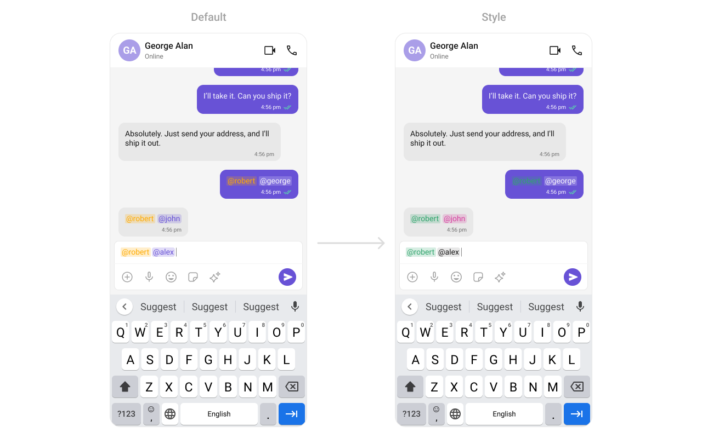
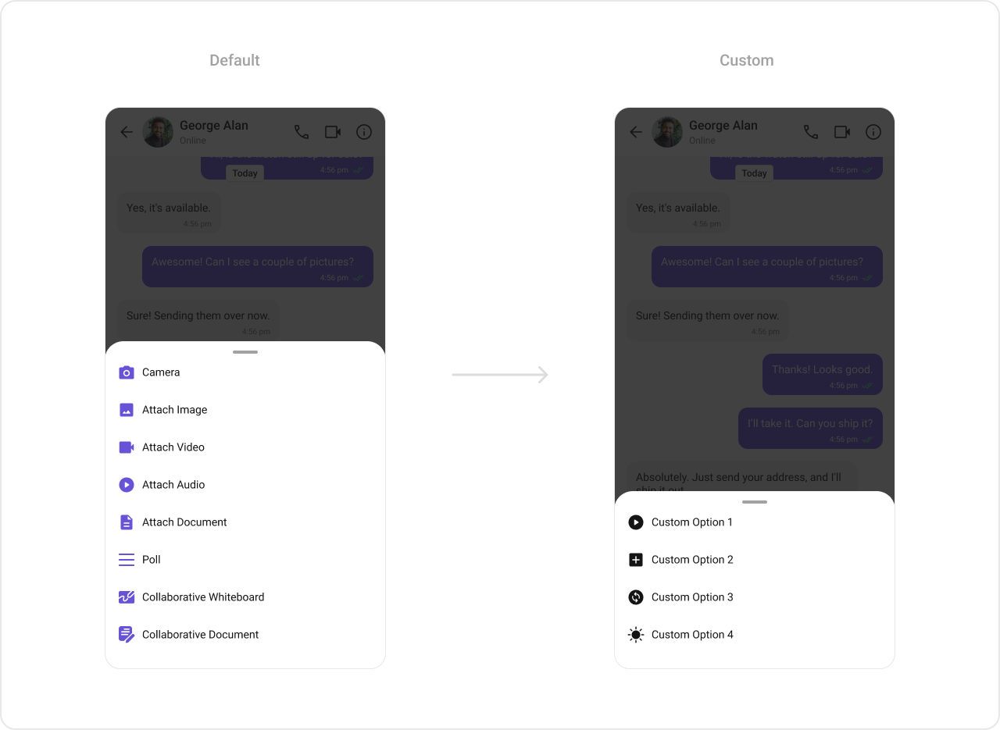

import Tabs from '@theme/Tabs';
import TabItem from '@theme/TabItem';
import { Tooltip } from 'react-tooltip'
import 'react-tooltip/dist/react-tooltip.css'

## Overview

MessageComposer is a [Component](./01-components-overview.md#components) that enables users to write and send a variety of messages, including text, image, video, and custom messages.

Features such as **Live Reaction**, **Attachments**, and **Message Editing** are also supported by it.


## Usage

### Integration

The following code snippet illustrates how you can directly incorporate the MessageComposer component into your `layout.xml` file.

```xml
<com.cometchat.chatuikit.messagecomposer.CometChatMessageComposer
                android:id="@+id/composer"
                android:layout_width="match_parent"
                android:layout_height="wrap_content" />
```

:::warning Warning

The MessageComposer is responsible for managing runtime permissions. To ensure the **ActivityResultLauncher** is properly initialized, its object should be created in the the **onCreate** state of an activity. To ensure that the composer is loaded within the fragment, it is important to make sure that the fragment is loaded in the `onCreate` state of the activity.

:::

### Actions

[Actions](./01-components-overview.md#actions) dictate how a component functions. They are divided into two types: Predefined and User-defined. You can override either type, allowing you to tailor the behavior of the component to fit your specific needs.

##### setOnSendButtonClick

The `OnSendButtonClick` event gets activated when the send message button is clicked. It has a predefined function of sending messages entered in the composer `EditText`. However, you can overide this action with the following code snippet.

<Tabs>

<TabItem value="java" label="Java">
    
```java
    messageComposer.setOnSendButtonClick(new CometChatMessageComposer.SendButtonClick() {
        @Override
        public void onClick(Context context, BaseMessage baseMessage) {
            Toast.makeText(context, "OnSendButtonClicked ..", Toast.LENGTH_SHORT).show();
        }
    });
```
</TabItem>

<TabItem value="kotlin" label="Kotlin">

```kotlin
    messageComposer.setOnSendButtonClick(object : CometChatMessageComposer.SendButtonClick {
    override fun onClick(context: Context, baseMessage: BaseMessage) {
        Toast.makeText(context, "OnSendButtonClicked ..", Toast.LENGTH_SHORT).show()
    }
    })
```

</TabItem>

</Tabs>

##### setOnError

This action doesn't change the behavior of the component but rather listens for any errors that occur in the MessageList component.

<Tabs>

<TabItem value="java" label="Java">
```java title="YourActivity.java"
messageComposer.setOnError(new OnError() {
    @Override
    public void onError(Context context, CometChatException e) {
        //Your Exception Handling code.
    }
});
```
</TabItem>

<TabItem value="kotlin" label="Kotlin">

```kotlin title="YourActivity.kt"
messageComposer.setOnError(object : OnError {
    override fun onError(context: Context, e: CometChatException) {
        // Your Exception Handling code.
    }
})
```

</TabItem>

</Tabs>

##### setOnTextChangedListener
Function triggered whenever the message input's text value changes, enabling dynamic text handling.

<Tabs>

<TabItem value="java" label="Java">

```java title="YourActivity.java"
messageComposer.setOnTextChangedListener(new CometChatTextWatcher() {
            @Override
            public void onTextChanged(CharSequence charSequence, int start, int before, int count) {

            }

            @Override
            public void beforeTextChanged(CharSequence s, int start, int count, int after) {

            }

            @Override
            public void afterTextChanged(Editable editable) {

            }
        });

```
</TabItem>

<TabItem value="kotlin" label="Kotlin">

```kotlin title="YourActivity.kt"
messageComposer.setOnTextChangedListener(object : CometChatTextWatcher() {
            override fun onTextChanged(charSequence: CharSequence, start: Int, before: Int, count: Int) {
            }

            override fun beforeTextChanged(s: CharSequence, start: Int, count: Int, after: Int) {
            }

            override fun afterTextChanged(editable: Editable) {
            }
        })
```

</TabItem>

</Tabs>

---

### Filters

MessageComposer component does not have any available filters.

---

### Events

[Events](./01-components-overview.md#events) are emitted by a `Component`. By using event you can extend existing functionality. Being global events, they can be applied in Multiple Locations and are capable of being Added or Removed.

The MessageComposer Component does not emit any events of its own.

---

## Customization

To fit your app's design requirements, you can customize the appearance of the MessageComposer component. We provide exposed methods that allow you to modify the experience and behavior according to your specific needs.

### Style

Using Style you can customize the look and feel of the component in your app, These parameters typically control elements such as the color, size, shape, and fonts used within the component.


```xml
<!-- active send button drawable -->
<vector xmlns:android="http://schemas.android.com/apk/res/android"
    android:width="32dp"
    android:height="32dp"
    android:viewportWidth="32"
    android:viewportHeight="32">
    <path
        android:fillColor="#F76808"
        android:pathData="M16,0L16,0A16,16 0,0 1,32 16L32,16A16,16 0,0 1,16 32L16,32A16,16 0,0 1,0 16L0,16A16,16 0,0 1,16 0z" />
    <group>
        <clip-path android:pathData="M4,4h24v24h-24z" />
        <path
            android:fillColor="?attr/cometchatColorWhite"
            android:pathData="M10.767,22.723C10.465,22.843 10.178,22.818 9.907,22.646C9.636,22.474 9.5,22.223 9.5,21.894V17.673L16.423,16L9.5,14.327V10.106C9.5,9.777 9.636,9.526 9.907,9.354C10.178,9.182 10.465,9.157 10.767,9.277L24.723,15.161C25.095,15.328 25.281,15.608 25.281,16.002C25.281,16.395 25.095,16.674 24.723,16.838L10.767,22.723Z" />
    </group>
</vector>

```

```xml
    <!-- themes.xml -->
    <style name="CustomMessageComposerStyle" parent="CometChatMessageComposerStyle">
        <item name="cometchatMessageComposerAttachmentIconTint">#F76808</item>
        <item name="cometchatMessageComposerVoiceRecordingIconTint">#F76808</item>
        <item name="cometchatMessageComposerActiveStickerIconTint">#F76808</item>
        <item name="cometchatMessageComposerInactiveStickerIconTint">#F76808</item>
        <item name="cometchatMessageComposerAIIconTint">#F76808</item>
        <item name="cometchatMessageComposerActiveSendButtonDrawable">
            @drawable/active_send_button
        </item>
    </style>
```

<Tabs>

<TabItem value="java" label="Java">

```java
cometChatMessageComposer.setStyle(R.style.CustomMessageComposerStyle);
```

</TabItem>

<TabItem value="kotlin" label="Kotlin">

```kotlin
cometChatMessageComposer.setStyle(R.style.CustomMessageComposerStyle)
```

</TabItem>

</Tabs>
To know more such attributes, visit the [attributes file](https://github.com/cometchat/cometchat-uikit-android/blob/v5/chatuikit/src/main/res/values/attr_cometchat_message_composer.xml).

---

### Functionality

These are a set of small functional customizations that allow you to fine-tune the overall experience of the component. With these, you can change text, set custom icons, and toggle the visibility of UI elements.

Below is a list of customizations along with corresponding code snippets

| Property                        | Description                                                                                                                                                                                                                                     | Code                                                      |
| ------------------------------- | ----------------------------------------------------------------------------------------------------------------------------------------------------------------------------------------------------------------------------------------------- | --------------------------------------------------------- |
| **User**                        | Used to pass user object of which header specific details will be shown                                                                                                                                                                         | `.setUser(user)`                                          |
| **Group**                       | Used to pass group object of which header specific details will be shown                                                                                                                                                                        | `.setGroup(Group)`                                        |
| **disableTypingEvents**         | Used to disable/enable typing events , default false                                                                                                                                                                                            | `.disableTypingEvents(boolean)`                           |
| **disableSoundForMessages**     | Used to toggle sound for outgoing messages                                                                                                                                                                                                      | `.disableSoundForMessages(boolean)`                       |
| **setInitialComposerText**                     | Used to set predefined text                                                                                                                                                                                                                     | `.setInitialComposerText("Your_Text")`                                   |
| **setMaxLine**                  | Maximum lines allowed to increase in the input field                                                                                                                                                                                            | `.setMaxLine(int)`                                        |
| **setAuxiliaryButtonAlignment** | controls position auxiliary button view , can be **left** or **right** . default **right**                                                                                                                                                      | `.setAuxiliaryButtonAlignment(AuxiliaryButtonsAlignment)` |
| **setDisableMentions**          | Sets whether mentions in text should be disabled. Processes the text formatters If there are text formatters available and the disableMentions flag is set to true, it removes any formatters that are instances of CometChatMentionsFormatter. | `.setDisableMentions(true);`                              |
| **setCustomSoundForMessages**   | Used to give custom sounds to outgoing messages                                                                                                                                                                                                 | `.setCustomSoundForMessages(String)`                      |
| **setAttachmentButtonVisibility**   | Hides the attachment button in the composer | `.setAttachmentButtonVisibility(View.VISIBLE)`                      |
| **setStickersButtonVisibility**   | Hides the stickers button in the composer | `.setStickersButtonVisibility(View.GONE)`|
| **setSendButtonVisibility**   | Hides the send button in the composer | `.setSendButtonVisibility(View.VISIBLE)`                      |
| **setCameraAttachmentOptionVisibility**   | Controls whether camera attachments are allowed | `.setCameraAttachmentOptionVisibility(View.VISIBLE)`                      |
| **setImageAttachmentOptionVisibility**   | Controls whether image attachments are allowed | `.setImageAttachmentOptionVisibility(View.VISIBLE)`                      |
| **setVideoAttachmentOptionVisibility**   | Controls whether video attachments are allowed | `.setVideoAttachmentOptionVisibility(View.VISIBLE)`                      |
| **setAudioAttachmentOptionVisibility**   | Controls whether audio attachments are allowed | `.setAudioAttachmentOptionVisibility(View.VISIBLE)`                      |
| **setFileAttachmentOptionVisibility**   | Controls whether file attachments are allowed | `.setFileAttachmentOptionVisibility(View.VISIBLE)`                      |
| **setPollAttachmentOptionVisibility**   | Controls whether polls can be shared | `.setPollAttachmentOptionVisibility(View.VISIBLE)`                      |
| **setCollaborativeDocumentOptionVisibility**   | Controls whether collaborative documents can be shared | `.setCollaborativeDocumentOptionVisibility(View.VISIBLE)`                      |
| **setCollaborativeWhiteboardOptionVisibility**   | Controls whether collaborative whiteboards can be shared | `.setCollaborativeWhiteboardOptionVisibility(View.VISIBLE)`                      |
---

### Advanced

For advanced-level customization, you can set custom views to the component. This lets you tailor each aspect of the component to fit your exact needs and application aesthetics. You can create and define your views, layouts, and UI elements and then incorporate those into the component.

---

#### setTextFormatters

Assigns the list of text formatters. If the provided list is not null, it sets the list. Otherwise, it assigns the default text formatters retrieved from the data source. To configure the existing Mentions look and feel check out [CometChatMentionsFormatter](../07-Advanced/02-CometChatMentionsFormatter.md)

**Example**


```xml title="themes.xml"

<style name="CustomMessageComposerMentionsStyle" parent="CometChatMessageComposerMentionsStyle">
    <item name="cometchatMentionTextAppearance">?attr/cometchatTextAppearanceBodyRegular</item>
    <item name="cometchatMentionTextColor">#000000</item>
    <item name="cometchatMentionBackgroundColor">#000000</item>
    <item name="cometchatSelfMentionTextColor">#30A46C</item>
    <item name="cometchatSelfMentionTextAppearance">?attr/cometchatTextAppearanceBodyRegular</item>
    <item name="cometchatSelfMentionBackgroundColor">#30A46C</item>
</style>

```

<Tabs>
<TabItem value="java" label="Java">

```Java
// Initialize CometChatMentionsFormatter
CometChatMentionsFormatter mentionFormatter = new CometChatMentionsFormatter(context);

// set style to customize composer mention text
mentionFormatter.setMessageComposerMentionTextStyle(context, R.style.CustomMessageComposerMentionsStyle);

// This can be passed as an array of formatter in CometChatMessageComposer by using setTextFormatters method.
List<CometChatTextFormatter> textFormatters = new ArrayList<>();
textFormatters.add(mentionFormatter);
messageComposer.setTextFormatters(textFormatters);
````

</TabItem>

<TabItem value="kotlin" label="Kotlin">

```kotlin
// Initialize CometChatMentionsFormatter
val mentionFormatter = CometChatMentionsFormatter(context)
// set style to customize composer mention text
mentionFormatter.setMessageComposerMentionTextStyle(context, R.style.CustomMessageComposerMentionsStyle)

// This can be passed as an array of formatter in CometChatMessageComposer by using setTextFormatters method.
val textFormatters: MutableList<CometChatTextFormatter> = ArrayList()
textFormatters.add(mentionFormatter)
messageComposer.setTextFormatters(textFormatters)

```

</TabItem>

</Tabs>

#### setAttachmentOptions

By using `setAttachmentOptions()`, you can set a list of custom `MessageComposerActions` for the MessageComposer Component. This will override the existing list of `MessageComposerActions`.

<Tabs>

<TabItem value="java" label="Java">

```java
cometChatMessageComposer.setAttachmentOptions()
````

</TabItem>

<TabItem value="kotlin" label="Kotlin">

```kotlin
cometChatMessageComposer.setAttachmentOptions()
```

</TabItem>

</Tabs>

**Example**

In this example, we are overriding the existing MessageComposerActions List with Capture Photo, Go Live & Payments actions.

<Tabs>

<TabItem value="java" label="Java">

```java

    List<CometChatMessageComposerAction> actionList = new ArrayList<>();

        CometChatMessageComposerAction action1 = new CometChatMessageComposerAction();
        action1.setTitle("Custom Option 1");
        action1.setIcon(R.drawable.ic_cp_1);
        action1.setOnClick(new OnClick() {
            @Override
            public void onClick() {
                Toast.makeText(context, "Custom Option 1 !!!", Toast.LENGTH_SHORT).show();
            }
        });
        actionList.add(action1);

        CometChatMessageComposerAction action2 = new CometChatMessageComposerAction();
        action2.setTitle("Custom Option 2");
        action2.setIcon(R.drawable.ic_cp_2);
        action2.setOnClick(new OnClick() {
            @Override
            public void onClick() {
                Toast.makeText(context, "Custom Option 2 !!!", Toast.LENGTH_SHORT).show();
            }
        });
        actionList.add(action2);

        CometChatMessageComposerAction action3 = new CometChatMessageComposerAction();
        action3.setTitle("Custom Option 3");
        action3.setIcon(R.drawable.ic_cp_3);
        action3.setOnClick(new OnClick() {
            @Override
            public void onClick() {
                Toast.makeText(context, "Custom Option 3 !!!", Toast.LENGTH_SHORT).show();
            }
        });
        actionList.add(action3);

        CometChatMessageComposerAction action4 = new CometChatMessageComposerAction();
        action4.setTitle("Custom Option 4");
        action4.setIcon(R.drawable.ic_cp_4);
        action4.setOnClick(new OnClick() {
            @Override
            public void onClick() {
                Toast.makeText(context, "Custom Option 4 !!!", Toast.LENGTH_SHORT).show();
            }
        });
        actionList.add(action4);

    cometChatMessageComposer.setAttachmentOptions(actionList);
```

</TabItem>

<TabItem value="kotlin" label="Kotlin">

```kotlin
    val actionList = ArrayList<CometChatMessageComposerAction>()

        val action1 = CometChatMessageComposerAction()
        action1.title = "Custom Option 1"
        action1.icon = R.drawable.ic_cp_1
        action1.onClick = {
            Toast.makeText(context, "Custom Option 1 !!!", Toast.LENGTH_SHORT).show()
        }
        actionList.add(action1)

        val action2 = CometChatMessageComposerAction()
        action2.title = "Custom Option 2"
        action2.icon = R.drawable.ic_cp_2
        action2.onClick = {
            Toast.makeText(context, "Custom Option 2 !!!", Toast.LENGTH_SHORT).show()
        }
        actionList.add(action2)

        val action3 = CometChatMessageComposerAction()
        action3.title = "Custom Option 3"
        action3.icon = R.drawable.ic_cp_3
        action3.onClick = {
            Toast.makeText(context, "Custom Option 2 !!!", Toast.LENGTH_SHORT).show()
        }
        actionList.add(action3)

        val action4 = CometChatMessageComposerAction()
        action4.title = "Custom Option 4"
        action4.icon = R.drawable.ic_cp_4
        action4.onClick = {
            Toast.makeText(context, "Custom Option 4 !!!", Toast.LENGTH_SHORT).show()
        }
        actionList.add(action4)

    cometChatMessageComposer.setAttachmentOptions(actionList)
```

</TabItem>

</Tabs>

---

#### setAuxiliaryButtonView

You can insert a custom view into the MessageComposer component to add additional functionality using the following method.

<Tabs>

<TabItem value="java" label="Java">

```java
 cometChatMessageComposer.setAuxiliaryButtonView()
```

</TabItem>

<TabItem value="kotlin" label="Kotlin">

```kotlin
 cometChatMessageComposer.setAuxiliaryButtonView()
```

</TabItem>

</Tabs>

Please note that the MessageComposer Component utilizes the AuxiliaryButton to provide sticker functionality. Overriding the AuxiliaryButton will subsequently replace the sticker functionality.

**Example**


In this example, we'll be adding a custom SOS button with click functionality. You'll first need to create a layout file and then inflate it inside the `.setAuxiliaryButtonView()` function.

<Tabs>

<TabItem value="java" label="Java">

```java
ImageView imageView = new ImageView(context);
imageView.setMaxHeight(getResources().getDimensionPixelSize(com.cometchat.chatuikit.R.dimen.cometchat_24dp));
imageView.setImageResource(R.drawable.ic_location);
imageView.setOnClickListener(v -> Toast.makeText(context, "Auxiliary Button Clicked !!!", Toast.LENGTH_SHORT).show());

cometChatMessageComposer.setAuxiliaryButtonView(imageView);

```

</TabItem>

<TabItem value="kotlin" label="Kotlin">

```kotlin
val imageView = ImageView(context)
imageView.maxHeight = resources.getDimensionPixelSize(com.cometchat.chatuikit.R.dimen.cometchat_24dp)
imageView.setImageResource(R.drawable.ic_location)
imageView.setOnClickListener { v: View? ->
            Toast
                .makeText(context, "Auxiliary Button Clicked !!!", Toast.LENGTH_SHORT)
                .show()
    }
cometChatMessageComposer.setAuxiliaryButtonView(imageView)
```

</TabItem>

</Tabs>

---

#### setSendButtonView

You can set a custom view in place of the already existing send button view. Using the following method.

<Tabs>

<TabItem value="java" label="Java">

```java
    cometChatMessageComposer.setSendButtonView(view);
```

</TabItem>

<TabItem value="kotlin" label="Kotlin">

```kotlin
    cometChatMessageComposer.setSendButtonView(view)
```

</TabItem>

</Tabs>

**Example**


```xml title="drawable/custom_send_button.xml"
<vector xmlns:android="http://schemas.android.com/apk/res/android"
    android:width="32dp"
    android:height="32dp"
    android:viewportWidth="32"
    android:viewportHeight="32">
  <path
      android:pathData="M4,0L28,0A4,4 0,0 1,32 4L32,28A4,4 0,0 1,28 32L4,32A4,4 0,0 1,0 28L0,4A4,4 0,0 1,4 0z"
      android:fillColor="#EDEAFA"/>
  <path
      android:pathData="M16.977,24.922C16.612,24.922 16.349,24.792 16.188,24.531C16.026,24.271 15.888,23.945 15.773,23.555L14.531,19.43C14.458,19.169 14.432,18.961 14.453,18.805C14.474,18.643 14.56,18.482 14.711,18.32L22.688,9.719C22.734,9.672 22.758,9.62 22.758,9.563C22.758,9.505 22.737,9.458 22.695,9.422C22.654,9.385 22.604,9.367 22.547,9.367C22.495,9.362 22.445,9.383 22.398,9.43L13.828,17.438C13.656,17.594 13.49,17.682 13.328,17.703C13.167,17.719 12.961,17.688 12.711,17.609L8.492,16.328C8.117,16.213 7.807,16.078 7.563,15.922C7.318,15.76 7.195,15.5 7.195,15.141C7.195,14.859 7.307,14.617 7.531,14.414C7.755,14.211 8.031,14.047 8.359,13.922L21.797,8.773C21.979,8.706 22.148,8.654 22.305,8.617C22.466,8.576 22.612,8.555 22.742,8.555C22.997,8.555 23.198,8.628 23.344,8.773C23.49,8.919 23.563,9.12 23.563,9.375C23.563,9.51 23.542,9.656 23.5,9.813C23.463,9.969 23.412,10.138 23.344,10.32L18.227,23.688C18.081,24.063 17.906,24.362 17.703,24.586C17.5,24.81 17.258,24.922 16.977,24.922Z"
      android:fillColor="#6852D6"/>
</vector>
```

<Tabs>

<TabItem value="java" label="Java">

```java
        ImageView imageView = new ImageView(this);
        imageView.setImageResource(R.drawable.custom_send_button);
        imageView.setOnClickListener(new View.OnClickListener() {
            @Override
            public void onClick(View view) {
                Toast.makeText(YourActivity.this, "Custom Send Button Clicked !!!", Toast.LENGTH_SHORT).show();
            }
        });
        cometChatMessageComposer.setSendButtonView(imageView);
```

</TabItem>

<TabItem value="kotlin" label="Kotlin">

```kotlin
        val imageView = ImageView(this)
        imageView.setImageResource(R.drawable.custom_send_button)
        imageView.setOnClickListener {
            Toast
                .makeText(this@YourActivity, "Custom Send Button Clicked !!!", Toast.LENGTH_SHORT)
                .show()
        }
        cometChatMessageComposer.setSendButtonView(imageView)
```

</TabItem>

</Tabs>

---

#### HeaderView

You can set custom headerView to the MessageComposer component using the following method

<Tabs>

<TabItem value="java" label="Java">

```java
cometChatMessageComposer.setHeaderView(view);
```

</TabItem>

<TabItem value="kotlin" label="Kotlin">

```kotlin
cometChatMessageComposer.setHeaderView(view);
```

</TabItem>

</Tabs>

**Example**


In the following example, we're going to apply a mock smart reply view to the MessageComposer Component using the `.setHeaderView()` method.

```xml title="custom_header_layout"
<?xml version="1.0" encoding="utf-8"?>
<LinearLayout xmlns:android="http://schemas.android.com/apk/res/android"
    xmlns:app="http://schemas.android.com/apk/res-auto"
    android:layout_width="match_parent"
    android:layout_height="wrap_content"
    android:orientation="horizontal">

    <com.google.android.material.card.MaterialCardView
        android:layout_width="match_parent"
        android:layout_height="wrap_content"
        android:layout_marginStart="@dimen/cometchat_10dp"
        android:layout_marginTop="@dimen/cometchat_margin_1"
        android:layout_marginEnd="@dimen/cometchat_10dp"
        android:layout_marginBottom="@dimen/cometchat_margin_1"
        android:elevation="0dp"
        app:cardBackgroundColor="#EDEAFA"
        app:cardCornerRadius="@dimen/cometchat_10dp"
        app:cardElevation="0dp">

        <LinearLayout
            android:layout_width="wrap_content"
            android:layout_height="wrap_content"
            android:layout_marginStart="@dimen/cometchat_padding_3"
            android:layout_marginTop="@dimen/cometchat_padding_1"
            android:layout_marginEnd="@dimen/cometchat_padding_3"
            android:layout_marginBottom="@dimen/cometchat_padding_1"
            android:gravity="center_vertical"
            android:orientation="horizontal">

            <ImageView
                android:layout_width="20dp"
                android:layout_height="@dimen/cometchat_20dp"
                android:src="@drawable/ic_calls"
                app:tint="?attr/cometchatPrimaryColor" />

            <TextView
                android:layout_width="wrap_content"
                android:layout_height="wrap_content"
                android:layout_marginStart="@dimen/cometchat_margin_1"
                android:text="Notes"
                android:textAppearance="?attr/cometchatTextAppearanceBodyRegular"
                android:textColor="?attr/cometchatTextColorPrimary" />
        </LinearLayout>
    </com.google.android.material.card.MaterialCardView>

</LinearLayout>

```

<Tabs>

<TabItem value="java" label="Java">

```java
View view = getLayoutInflater().inflate(R.layout.custom_header_layout, null);
cometChatMessageComposer.setHeaderView(view);
```

</TabItem>

<TabItem value="kotlin" label="Kotlin">

```kotlin
val view: View = LayoutInflater.from(context).inflate(R.layout.custom_header_layout, null)
cometChatMessageComposer.setHeaderView(view)
```

</TabItem>

</Tabs>
