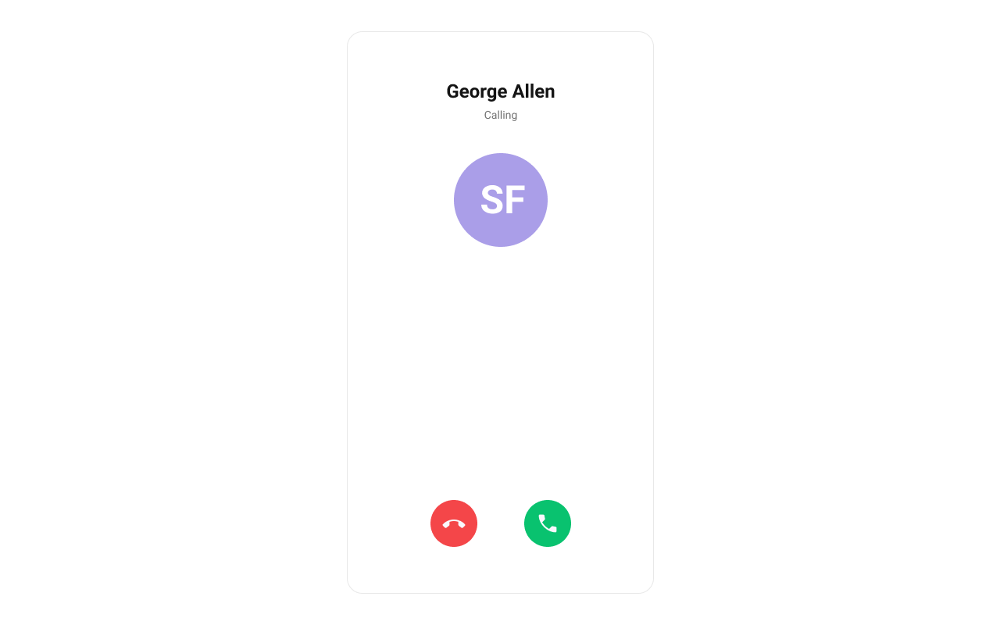
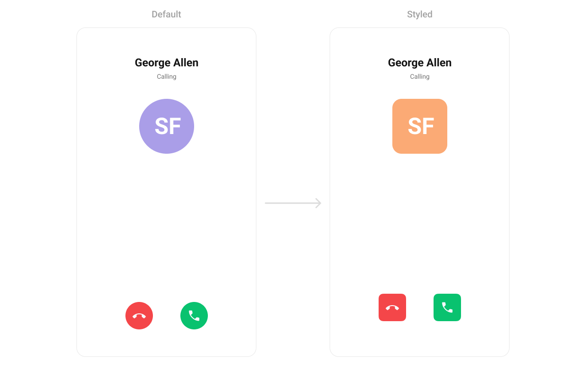

import Tabs from '@theme/Tabs';
import TabItem from '@theme/TabItem';

## Overview

The `CometChatIncomingCall` is a [Component](./01-components-overview.md#components) that serves as a visual representation when the user receives an incoming call, such as a voice call or video call, providing options to answer or decline the call.



---

## Usage

### Integration

`CometChatIncomingCall` being a custom component, offers versatility in its integration. It can be seamlessly launched via button clicks or any user-triggered action, enhancing the overall user experience and facilitating smoother interactions within the application.

Since `CometChatIncomingCall` can be launched by adding the following code snippet into the XML layout file.

<Tabs>

<TabItem value="XML" label="XML">
```XML
<com.cometchat.chatuikit.calls.incomingcall.CometChatIncomingCall
    android:id="@+id/incoming_call"
    android:layout_width="match_parent"
    android:layout_height="match_parent" />
```
</TabItem>

</Tabs>

If you're defining the `CometChatIncomingCall` within the XML code or in your activity or fragment then you'll need to extract them and set them on the User object using the appropriate method.

<Tabs>

<TabItem value="Java" label="Java">
```Java
CometChatIncomingCall cometchatIncomingCall = binding.incomingCall; // 'binding' is a view binding instance. Initialize it with `binding = YourXmlFileNameBinding.inflate(getLayoutInflater());` to use views like `binding.incomingCall` after enabling view binding.

User user = new User();
user.setUid(""); //Required
user.setName(""); //Required
user.setAvatar(""); //Required

cometchatIncomingCall.setUser(user); //Required - set the user object

````
</TabItem>

<TabItem value="Kotlin" label="Kotlin">
```Kotlin
val cometchatIncomingCall: CometChatIncomingCall = binding.incomingCall  // 'binding' is a view binding instance. Initialize it with `binding = YourXmlFileNameBinding.inflate(layoutInflater)` to use views like `binding.incomingCall` after enabling view binding.

val user = User()
user.uid = "" //Required
user.name = "" //Required
user.avatar = "" //Required

cometchatIncomingCall.setUser(user) //Required - set the user object
````

</TabItem>

</Tabs>

##### Activity and Fragment

You can integrate `CometChatIncomingCall` into your Activity and Fragment by adding the following code snippets into the respective classes.

<Tabs>

<TabItem value="Java (Activity)" label="Java (Activity)">

```Java title="YourActivity.java"
CometChatIncomingCall cometchatIncomingCall;

@Override
protected void onCreate(Bundle savedInstanceState) {
    super.onCreate(savedInstanceState);

    cometchatIncomingCall = new CometChatIncomingCall(this);

    User user = new User();
    user.setUid(""); //Required
    user.setName(""); //Required
    user.setAvatar(""); //Required

    cometchatIncomingCall.setUser(user); //Required - set the user object

    setContentView(cometchatIncomingCall);
}
```

</TabItem>

<TabItem value="Kotlin (Activity)" label="Kotlin (Activity)">

```Java title="YourActivity.kt"
override fun onCreate(savedInstanceState: Bundle?) {
    super.onCreate(savedInstanceState)

    cometchatIncomingCall = CometChatIncomingCall(this)

    val user = User()
    user.uid = "" //Required
    user.name = "" //Required
    user.avatar = "" //Required

    cometchatIncomingCall.setUser(user) //Required - set the user object

    setContentView(cometchatIncomingCall)
}
```

</TabItem>

<TabItem value="Java (Fragment)" label="Java (Fragment)">

```Java title="YourFragment.java"
CometChatIncomingCall cometchatIncomingCall;

@Override
public View onCreateView(@NonNull LayoutInflater inflater, ViewGroup container, Bundle savedInstanceState) {
    cometchatIncomingCall = new CometChatIncomingCall(requireContext());

    User user = new User();
    user.setUid(""); //Required
    user.setName(""); //Required
    user.setAvatar(""); //Required

    cometchatIncomingCall.setUser(user); //Required - set the user object

    return cometchatIncomingCall;
}
```

</TabItem>

<TabItem value="Kotlin (Fragment)" label="Kotlin (Fragment)">

```Kotlin title="YourFragment.kt"
private lateinit var cometchatIncomingCall: CometChatIncomingCall

override fun onCreateView(
    inflater: LayoutInflater,
    container: ViewGroup?,
    savedInstanceState: Bundle?
): View {
    cometchatIncomingCall = CometChatIncomingCall(requireContext())

    val user = User()
    user.uid = "" //Required
    user.name = "" //Required
    user.avatar = "" //Required

    cometchatIncomingCall.setUser(user) //Required - set the user object

    return cometchatIncomingCall
}
```

</TabItem>

</Tabs>

---

### Actions

[Actions](./01-components-overview.md#actions) dictate how a component functions. They are divided into two types: Predefined and User-defined. You can override either type, allowing you to tailor the behavior of the component to fit your specific needs.

##### setOnAcceptClick

The `setOnAcceptClick` action is typically triggered when the user clicks on the accept button, initiating a predefined action. However, by implementing the following code snippet, you can easily customize or override this default behavior to suit your specific requirements.

<Tabs>

<TabItem value="Java" label="Java">
```Java
cometchatIncomingCall.setOnAcceptClick(new OnClick() {
    @Override
    public void onClick() {
        //TODO
    }
});
```
</TabItem>

<TabItem value="Kotlin" label="Kotlin">
```Kotlin
cometchatIncomingCall.setOnAcceptCallClick(OnClick {
    //TODO
})
```
</TabItem>

</Tabs>

---

##### setOnRejectClick

The `setOnRejectClick` action is typically triggered when the user clicks on the reject button, initiating a predefined action. However, by implementing the following code snippet, you can easily customize or override this default behavior to suit your specific requirements.

<Tabs>

<TabItem value="Java" label="Java">
```Java
cometchatIncomingCall.setOnRejectClick(new OnClick() {
    @Override
    public void onClick() {
        //TODO
    }
});
```
</TabItem>

<TabItem value="Kotlin" label="Kotlin">
```Kotlin
cometchatIncomingCall.setOnDeclineCallClick(OnClick {
    //TODO
})
```
</TabItem>

</Tabs>

##### setOnError

You can customize this behavior by using the provided code snippet to override the `setOnError` and improve error handling.

<Tabs>

<TabItem value="Java" label="Java">
```Java
cometchatIncomingCall.setOnError(new OnError() {
    @Override
    public void onError(Context context, CometChatException e) {
        //TODO
    }
});
```
</TabItem>

<TabItem value="Kotlin" label="Kotlin">
```Kotlin
cometchatIncomingCall.setOnError(OnError { context, e ->
    //TODO
})
```
</TabItem>

</Tabs>

---

### Filters

**Filters** allow you to customize the data displayed in a list within a Component. You can filter the list based on your specific criteria, allowing for a more customized. Filters can be applied using RequestBuilders of Chat SDK.

The IncomingCall component does not have any exposed filters.

---

### Events

[Events](./01-components-overview.md#events) are emitted by a `Component`. By using event you can extend existing functionality. Being global events, they can be applied in Multiple Locations and are capable of being Added or Removed.

The `CometChatIncomingCall` component does not have any exposed events.

---

## Customization

To fit your app's design requirements, you can customize the appearance of the conversation component. We provide exposed methods that allow you to modify the experience and behavior according to your specific needs.

### Style

Using Style you can customize the look and feel of the component in your app, These parameters typically control elements such as the color, size, shape, and fonts used within the component.

##### 1. IncomingCall Style

You can customize the appearance of the `IncomingCall` Component by applying the `IncomingCallStyle` to it using the following code snippet.



```xml title="themes.xml"
<style name="CustomAvatarStyle" parent="CometChatAvatarStyle">
    <item name="cometchatAvatarStrokeRadius">8dp</item>
    <item name="cometchatAvatarBackgroundColor">#FBAA75</item>
</style>

<style name="CustomIncomingCall" parent="CometChatIncomingCallStyle">
    <item name="cometchatIncomingCallAvatarStyle">@style/CustomAvatarStyle</item>
    <item name="cometchatIncomingCallAcceptCallButtonCornerRadius">8dp</item>
    <item name="cometchatIncomingCallRejectCallButtonCornerRadius">8dp</item>
</style>
```
<Tabs>

<TabItem value="Java" label="Java">
```Java
cometchatIncomingCall.setStyle(R.style.CustomIncomingCall);
````
</TabItem>

<TabItem value="Kotlin" label="Kotlin">
```Kotlin
cometchatIncomingCall.setStyle(R.style.CustomIncomingCall)
````
</TabItem>

</Tabs>
To know more such attributes, visit the [attributes file](https://github.com/cometchat/cometchat-uikit-android/blob/v5/chatuikit/src/main/res/values/attr_cometchat_incoming_call.xml).

### Functionality

In this example, we're enhancing the interface by customizing the accept and decline button icons. By setting custom icons for both the accept and decline buttons, users can enjoy a more visually appealing and personalized experience.

Below is a list of customizations along with corresponding code snippets

| Property                   | Description                                                                                      | Code                                      |
| -------------------------- | ------------------------------------------------------------------------------------------------ | ----------------------------------------- |
| **setCall**                   | Sets the Call object for which the incoming call screen is displayed. Required for call actions. | `.setCall(call)`                          |
| **setCustomSoundForCalls** | Defines the path for custom sound for calls on the incoming call screen.                         | `.setCustomSoundForCalls(@RawRes int)`    |
| **disableSoundForCalls** | Defines whether to disable sound for the call on the incoming call screen.                       | `.disableSoundForCalls(true)`           |

---

### Advanced

For advanced-level customization, you can set custom views to the component. This lets you tailor each aspect of the component to fit your exact needs and application aesthetics. You can create and define your views, layouts, and UI elements and then incorporate those into the component.


#### setItemView
Allows setting a custom view for rendering each conversation item in the fetched list.

Use Cases:
- Customize the call card UI for incoming calls.
- Display additional user details (e.g., caller ID, location).
- Integrate custom animations for call alerts.

<Tabs>

<TabItem value="java" label="Java">
```java title="YourActivity.java"
cometchatIncomingCall.setItemView(view);
```
</TabItem>

<TabItem value="kotlin" label="Kotlin">

```kotlin title="YourActivity.kt"
cometchatIncomingCall.setItemView(view)
```

</TabItem>
</Tabs>


#### setLeadingView
Customizes the leading section of the component, usually the caller’s avatar or profile picture.

Use Cases:
- Display a profile picture with call status effects.
- Show a custom ringing animation around the avatar.
- Replace the avatar with a caller ID card.

<Tabs>

<TabItem value="java" label="Java">
```java title="YourActivity.java"
cometchatIncomingCall.setLeadingView(view);
```
</TabItem>

<TabItem value="kotlin" label="Kotlin">

```kotlin title="YourActivity.kt"
cometchatIncomingCall.setLeadingView(view)
```

</TabItem>
</Tabs>


#### setTitleView
Allows setting a custom title view, typically used for the caller’s name or call type.

Use Cases:
- Display the caller’s full name with a verified badge.
- Indicate the call type (Voice Call, Video Call).
- Show real-time status ("Ringing...", "Call from Work Contact", etc.).

<Tabs>

<TabItem value="java" label="Java">
```java title="YourActivity.java"
cometchatIncomingCall.setTitleView(view);
```
</TabItem>

<TabItem value="kotlin" label="Kotlin">

```kotlin title="YourActivity.kt"
cometchatIncomingCall.setTitleView(view)
```

</TabItem>
</Tabs>

#### setSubtitleView
Enables customizing the subtitle view, typically used for additional call details.

Use Cases:
- Display call duration if available.
- Show network strength indicators.
- Include a custom message like "Connecting...".

<Tabs>

<TabItem value="java" label="Java">
```java title="YourActivity.java"
cometchatIncomingCall.setSubtitleView(view);
```
</TabItem>

<TabItem value="kotlin" label="Kotlin">

```kotlin title="YourActivity.kt"
cometchatIncomingCall.setSubtitleView(view)
```

</TabItem>
</Tabs>


#### setTrailingView
Customizes the trailing section for actions or additional call-related UI elements.

Use Cases:
- Add custom accept/reject buttons.
- Show a mute button before answering.
- Display a text response option (e.g., "Can’t talk now")

<Tabs>

<TabItem value="java" label="Java">
```java title="YourActivity.java"
cometchatIncomingCall.setTrailingView(view);
```
</TabItem>

<TabItem value="kotlin" label="Kotlin">

```kotlin title="YourActivity.kt"
cometchatIncomingCall.setTrailingView(view)
```

</TabItem>
</Tabs>


---

import { Tooltip } from 'react-tooltip'
import 'react-tooltip/dist/react-tooltip.css'

<Tooltip
  id="my-tooltip-html-prop"
  html="Not available Configuration Object"
/>

---
