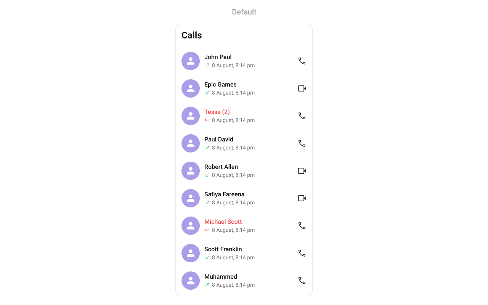
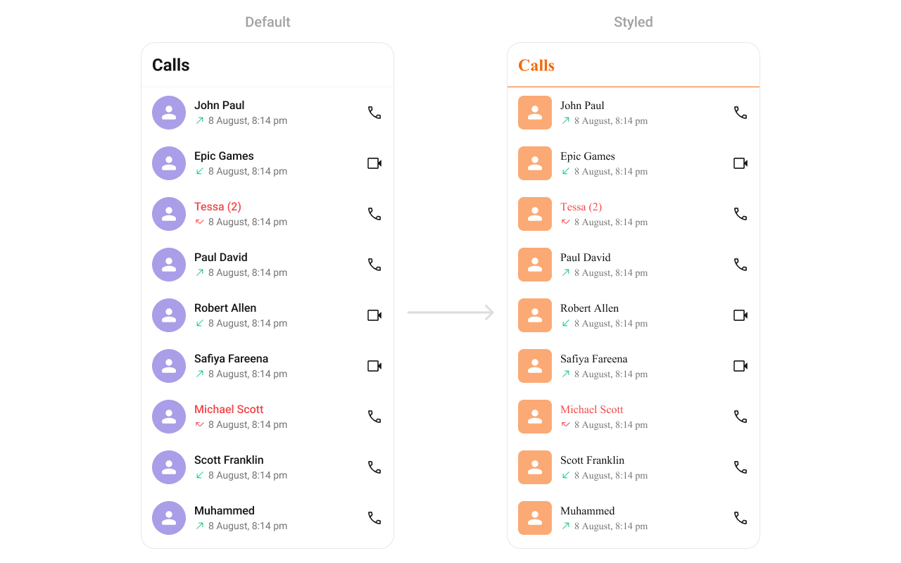
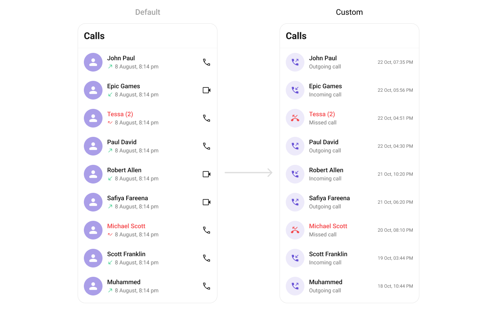
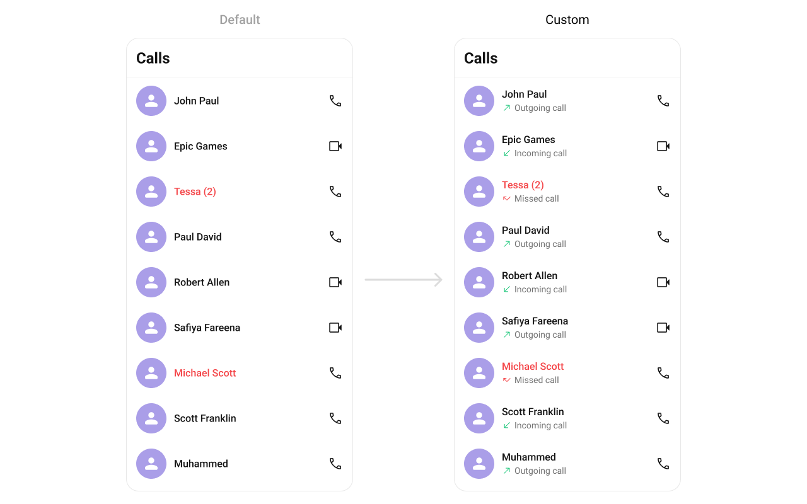
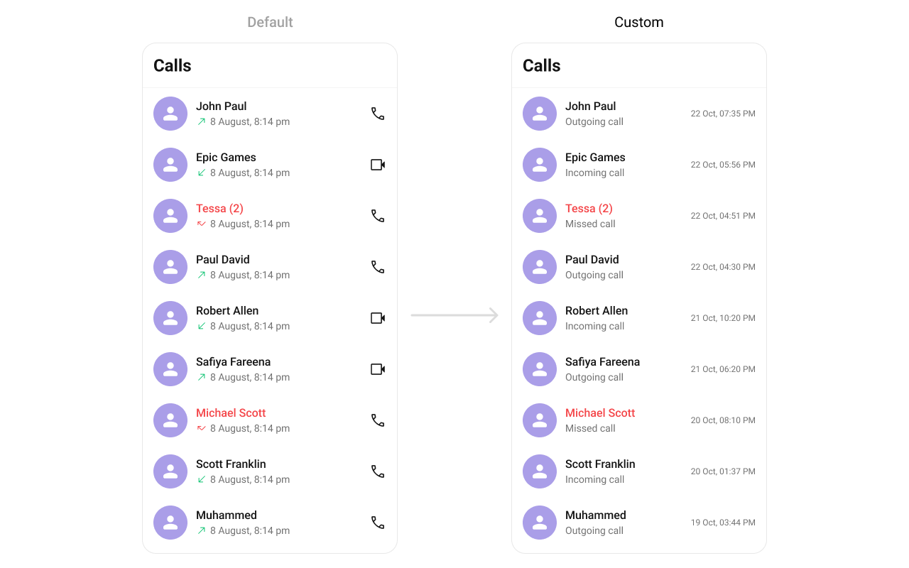

import Tabs from '@theme/Tabs';
import TabItem from '@theme/TabItem';

## Overview

`CometChatCallLogs` is a [Component](./01-components-overview.md#components) that shows the list of Call Logs available. By default, names are shown for all listed users, along with their avatars if available.



## Usage

### Integration

`CometChatCallLogs` being a wrapper component, offers versatility in its integration. It can be seamlessly launched via button clicks or any user-triggered action, enhancing the overall user experience and facilitating smoother interactions within the application.

Since `CometChatCallLogs` can be launched by adding the following code snippet to the XML layout file.

<Tabs>

<TabItem value="XML" label="XML">
```XML
<com.cometchat.chatuikit.calls.calllogs.CometChatCallLogs
    android:id="@+id/call_log"
    android:layout_width="match_parent"
    android:layout_height="match_parent" />
```
</TabItem>

</Tabs>

If you're defining the `CometChatCallLogs` within the XML code or in your activity or fragment then you'll need to extract them and set them on the User object using the appropriate method.

<Tabs>

<TabItem value="Java" label="Java">
```Java
CometChatCallLogs cometchatCallLogs = binding.callLog; // 'binding' is a view binding instance. Initialize it with `binding = YourXmlFileNameBinding.inflate(getLayoutInflater());` to use views like `binding.callLog` after enabling view binding.
```
</TabItem>

<TabItem value="Kotlin" label="Kotlin">
```Kotlin
val cometchatCallLogs: CometChatCallLogs = binding.callLog // 'binding' is a view binding instance. Initialize it with `binding = YourXmlFileNameBinding.inflate(layoutInflater)` to use views like `binding.callLog` after enabling view binding.
```
</TabItem>

</Tabs>

##### Activity and Fragment

You can integrate `CometChatCallLogs` into your Activity and Fragment by adding the following code snippets into the respective classes.

<Tabs>

<TabItem value="Java (Activity)" label="Java (Activity)">

```Java title="YourActivity.java"
CometChatCallLogs cometchatCallLogs;

@Override
protected void onCreate(Bundle savedInstanceState) {
    super.onCreate(savedInstanceState);

    cometchatCallLogs = new CometChatCallLogs(this);

    setContentView(cometchatCallLogs);
}
```

</TabItem>

<TabItem value="Kotlin (Activity)" label="Kotlin (Activity)">

```Java title="YourActivity.kt"
private lateinit var cometchatCallLogs: CometChatCallLogs

override fun onCreate(savedInstanceState: Bundle?) {
    super.onCreate(savedInstanceState)

    cometchatCallLogs = CometChatCallLogs(this);

    setContentView(cometchatCallLogs)
}
```

</TabItem>

<TabItem value="Java (Fragment)" label="Java (Fragment)">

```Java title="YourFragment.java"
CometChatCallLogs cometchatCallLogs;

@Override
public View onCreateView(@NonNull LayoutInflater inflater, ViewGroup container, Bundle savedInstanceState) {

    cometchatCallLogs = new CometChatCallLogs(requireContext());

    return cometchatCallLogs;
}
```

</TabItem>

<TabItem value="Kotlin (Fragment)" label="Kotlin (Fragment)">

```Kotlin title="YourFragment.kt"
private lateinit var cometchatCallLogs: CometChatCallLogs

override fun onCreateView(
    inflater: LayoutInflater?, container: ViewGroup?,
    savedInstanceState: Bundle?
): View {

    cometchatCallLogs = new CometChatCallLogs(requireContext());

    return cometchatCallLogs
}
```

</TabItem>

</Tabs>

### Actions

[Actions](./01-components-overview.md#actions) dictate how a component functions. They are divided into two types: Predefined and User-defined. You can override either type, allowing you to tailor the behavior of the component to fit your specific needs.


##### setOnItemClick

Function invoked when a call log item is clicked, typically used to open a detailed chat screen.

<Tabs>

<TabItem value="java" label="Java">
```java title="YourActivity.java"
cometchatCallLogs.setOnItemClick((view1, position, callLog) -> {
            
    });
```
</TabItem>

<TabItem value="kotlin" label="Kotlin">

```kotlin title="YourActivity.kt"
cometchatCallLogs.onItemClick = OnItemClick { view, position, callLog ->
            
    }
```

</TabItem>
</Tabs>

---

##### setOnItemLongClick
Function executed when a callLog item is long-pressed, allowing additional actions like delete or select.

<Tabs>

<TabItem value="java" label="Java">
```java title="YourActivity.java"
cometchatCallLogs.setOnItemLongClick((view1, position, callLog) -> {

    });
```
</TabItem>

<TabItem value="kotlin" label="Kotlin">

```kotlin title="YourActivity.kt"
cometchatCallLogs.onItemLongClick = OnItemLongClick({ view, position, callLog ->
            
    })
```

</TabItem>
</Tabs>

---

##### setOnBackPressListener

`OnBackPressListener` is triggered when you press the back button in the app bar. It has a predefined behavior; when clicked, it navigates to the previous activity. However, you can override this action using the following code snippet.

<Tabs>

<TabItem value="java" label="Java">
```java title="YourActivity.java"
cometchatCallLogs.setOnBackPressListener(() -> {
            
    });
```
</TabItem>

<TabItem value="kotlin" label="Kotlin">

```kotlin title="YourActivity.kt"
cometchatCallLogs.onBackPressListener = OnBackPress {

    }
```
</TabItem>
</Tabs>

---

##### OnError

This action doesn't change the behavior of the component but rather listens for any errors that occur in the callLogs component.

<Tabs>

<TabItem value="java" label="Java">
```java title="YourActivity.java"
cometchatCallLogs.setOnError(cometchatException -> {

    });
```
</TabItem>

<TabItem value="kotlin" label="Kotlin">

```kotlin title="YourActivity.kt"
cometchatCallLogs.setOnError {

    }
```

</TabItem>

</Tabs>

---

##### setOnLoad
Invoked when the list is successfully fetched and loaded, helping track component readiness.

<Tabs>

<TabItem value="java" label="Java">

```java title="YourActivity.java"
cometchatCallLogs.setOnLoad(list -> {

});
```
</TabItem>

<TabItem value="kotlin" label="Kotlin">

```kotlin title="YourActivity.kt"
cometchatCallLogs.setOnLoad(object : OnLoad<CallLog?> {
    override fun onLoad(list: MutableList<CallLog?>?) {

    }
})
```

</TabItem>

</Tabs>
---

##### setOnEmpty
Called when the list is empty, enabling custom handling such as showing a placeholder message.


<Tabs>

<TabItem value="java" label="Java">

```java title="YourActivity.java"
cometchatCallLogs.setOnEmpty(() -> {
            
    });
```
</TabItem>

<TabItem value="kotlin" label="Kotlin">

```kotlin title="YourActivity.kt"
cometchatCallLogs.setOnEmpty{
            
    }
```

</TabItem>

</Tabs>
---

### Filters

**Filters** allow you to customize the data displayed in a list within a Component. You can filter the list based on your specific criteria, allowing for a more customized. Filters can be applied using RequestBuilders of Chat SDK.

##### 1. CallLogRequestBuilder

The [CallLogRequestBuilder](/sdk/android/call-logs) enables you to filter and customize the call list based on available parameters in CallLogRequestBuilder. This feature allows you to create more specific and targeted queries during the call. The following are the parameters available in [CallLogRequestBuilder](/sdk/android/call-logs)

**Example**

In the example below, we are applying a filter based on the limit and have a call recording.

<Tabs>

<TabItem value="Java" label="Java">
```Java
CallLogRequest.CallLogRequestBuilder callLogRequestBuilder = new CallLogRequest.CallLogRequestBuilder()
        .setLimit(20)
        .setHasRecording(true);

cometchatCallLogs.setCallLogRequestBuilder(callLogRequestBuilder);

````
</TabItem>

<TabItem value="Kotlin" label="Kotlin">
```Kotlin
val callLogRequestBuilder = CallLogRequestBuilder()
    .setLimit(20)
    .setHasRecording(true)

cometchatCallLogs.setCallLogRequestBuilder(callLogRequestBuilder)
````

</TabItem>

</Tabs>

| Property           | Description                                         | Code                                      |
| ------------------ | --------------------------------------------------- | ----------------------------------------- |
| **Limit**          | Sets the limit for the call logs request            | `.setLimit(int limit)`                    |
| **Call Type**      | Sets the call type for the call logs request        | `.setCallType(String callType)`           |
| **Call Status**    | Sets the call status for the call logs request      | `.setCallStatus(String callStatus)`       |
| **Has Recording**  | Sets the recording status for the call logs request | `.setHasRecording(boolean hasRecording)`  |
| **Call Direction** | Sets the call direction for the call logs request   | `.setCallDirection(String callDirection)` |
| **UID**            | Sets the user ID for the call logs request          | `.setUid(String uid)`                     |
| **GUID**           | Sets the group ID for the call logs request         | `.setGuid(String guid)`                   |
| **Call Category**  | Sets the call category for the call logs request    | `.setCallCategory(String callCategory)`   |
| **Auth Token**     | Sets the auth token for the call logs request       | `.setAuthToken(String authToken)`         |

---

### Events

[Events](./01-components-overview.md#events) are emitted by a `Component`. By using event you can extend existing functionality. Being global events, they can be applied in Multiple Locations and are capable of being Added or Removed.

The `CometChatCallLogs` component does not have any exposed events.

---

## Customization

To fit your app's design requirements, you can customize the appearance of the CallLog component. We provide exposed methods that allow you to modify the experience and behavior according to your specific needs.

### Style

Using Style you can customize the look and feel of the component in your app, These parameters typically control elements such as the color, size, shape, and fonts used within the component.



```xml title="themes.xml"
     <style name="CustomAvatarStyle" parent="CometChatAvatarStyle">
        <item name="cometchatAvatarStrokeRadius">8dp</item>
        <item name="cometchatAvatarBackgroundColor">#FBAA75</item>
    </style>

    <style name="CustomCallLogStyle" parent="CometChatCallLogsStyle">
        <item name="cometchatCallLogsSeparatorColor">#F76808</item>
        <item name="cometchatCallLogsTitleTextColor">#F76808</item>
        <item name="cometchatCallLogsAvatarStyle">@style/CustomAvatarStyle</item>
    </style>
```


<Tabs>

<TabItem value="Java" label="Java">
```Java
cometchatCallLogs.setStyle(R.style.CustomCallLogStyle);

````
</TabItem>

<TabItem value="Kotlin" label="Kotlin">
```Kotlin
cometchatCallLogs.setStyle(R.style.CustomCallLogStyle)
````

</TabItem>

</Tabs>

---
To know more such attributes, visit the [attributes file](https://github.com/cometchat/cometchat-uikit-android/blob/v5/chatuikit/src/main/res/values/attr_cometchat_call_logs.xml).

### Functionality

These are a set of small functional customizations that allow you to fine-tune the overall experience of the component. With these, you can change text, set custom icons, and toggle the visibility of UI elements.


| Methods               | Description                                                                                                                                                                            | Code                                                          |
| ---------------------- | -------------------------------------------------------------------------------------------------------------------------------------------------------------------------------------- | ------------------------------------------------------------- |
| setBackIconVisibility       | Used to toggle visibility for back button in the app bar                                                                                                                               | `.setBackIconVisibility(View.VISIBLE);`                                      |
| setToolbarVisibility       | Used to toggle visibility for back button in the app bar                                                                                                                               | `.setToolbarVisibility(View.GONE);`                                      |
| setLoadingStateVisibility            | Used to hide loading state while fetching Users                                                                                                                                           | `.setLoadingStateVisibility(View.GONE);`                                          |
| setErrorStateVisibility            | Used to hide error state on fetching conversations                                                                                                                                           | `.setErrorStateVisibility(View.GONE);`                                          |
| setEmptyStateVisibility            | Used to hide empty state on fetching conversations                                                                                                                                           | `.setEmptyStateVisibility(View.GONE);`                                          |
| setSeparatorVisibility          | Used to control visibility of Separators in the list view                                                                                                                              | `.setSeparatorVisibility(View.GONE);`                                      |

---

### Advanced

For advanced-level customization, you can set custom views to the component. This lets you tailor each aspect of the component to fit your exact needs and application aesthetics. You can create and define your views, layouts, and UI elements and then incorporate those into the component.


#### setOptions
Defines the available actions users can perform on a call log entry, such as deleting, marking as spam, or calling back.

Use Cases:
- Provide quick call-back options.
- Allow users to block a number.
- Enable deleting multiple call logs.

<Tabs>

<TabItem value="java" label="Java">

```Java
cometchatConversations.setOptions((context, conversation) -> Collections.emptyList());
````

</TabItem>

<TabItem value="kotlin" label="Kotlin">
```kotlin
cometchatConversations.options = Function2<Context?, Conversation?, List<CometChatPopupMenu.MenuItem?>?> { context, conversation -> emptyList<CometChatPopupMenu.MenuItem?>() }
```
</TabItem>

</Tabs>


---

#### addOptions
Adds custom actions to the existing call log options.

Use Cases:
- Add favorite/star call log option.
- Integrate a "Send Message" option.
- Provide an archive feature.

<Tabs>

<TabItem value="java" label="Java">

```Java
cometchatConversations.addOptions((context, conversation) -> Collections.emptyList());
````

</TabItem>

<TabItem value="kotlin" label="Kotlin">
```kotlin
cometchatConversations.addOptions { context, conversation -> emptyList<CometChatPopupMenu.MenuItem?>() }
```
</TabItem>

</Tabs>

---

#### setLoadingView
Allows setting a custom loading view when fetching call logs.

Use Cases:
- Display a spinner animation while loading.
- Show a "Fetching Call History..." message.
- Use a shimmer effect for better UI experience.

<Tabs>

<TabItem value="java" label="Java">
```Java
cometchatConversations.setLoadingView(R.layout.your_loading_view);
````
</TabItem>

<TabItem value="kotlin" label="Kotlin">
```kotlin
cometchatConversations.loadingView = R.layout.your_loading_view
```
</TabItem>

</Tabs>

---

#### setEmptyView
Defines a custom view when no call logs are available.

Use Cases:
- Show a friendly message like "No calls yet!".
- Offer quick actions like "Make a Call".
- Display an illustration/image.

<Tabs>

<TabItem value="java" label="Java">
```Java
cometchatConversations.setEmptyView(R.layout.your_empty_view);
````

</TabItem>

<TabItem value="kotlin" label="Kotlin">
```kotlin
cometchatConversations.emptyView = R.layout.your_empty_view
```
</TabItem>

</Tabs>

---

#### setErrorView
Allows setting a custom error state view when fetching call logs fails.

Use Cases:
- Display a retry button.
- Show a network issue message.
- Provide a troubleshooting guide.

<Tabs>

<TabItem value="java" label="Java">

```Java
cometchatConversations.setErrorView(R.layout.your_empty_view);
````

</TabItem>

<TabItem value="kotlin" label="Kotlin">
```kotlin
cometchatConversations.errorView = R.layout.your_error_view
```
</TabItem>

</Tabs>

---

#### setItemView
Allows setting a custom layout for each call log item.

Use Cases:
- Customize the entire call log card.
- Display additional contact details.
- Use a two-column design for better readability.

<Tabs>

<TabItem value="Java" label="Java">
```Java
        cometChatCallLog.setListItemView(new Function2<Context, CallLog, View>() {
            @Override
            public View apply(Context var1, CallLog var2) {
                return null;
            }
        });

````
</TabItem>

<TabItem value="Kotlin" label="Kotlin">
```Kotlin
        cometChatCallLog.setListItemView(object : Function2<Context?, CallLog?, View?> {
            override fun invoke(p1: Context?, p2: CallLog?): View? {
               return null
            }
        })
````
</TabItem>

</Tabs>



```xml title="call_log_list_item.xml"
<?xml version="1.0" encoding="utf-8"?>
<LinearLayout xmlns:android="http://schemas.android.com/apk/res/android"
    android:layout_width="match_parent"
    android:layout_height="wrap_content"
    android:orientation="horizontal">

    <com.cometchat.chatuikit.shared.views.cometchatavatar.CometChatAvatar
        android:id="@+id/avatar"
        android:layout_width="@dimen/cometchat_48dp"
        android:layout_height="@dimen/cometchat_48dp" />

    <LinearLayout
        android:layout_width="wrap_content"
        android:layout_height="wrap_content"
        android:layout_marginStart="@dimen/cometchat_margin_3"
        android:layout_marginEnd="@dimen/cometchat_margin_3"
        android:gravity="center_vertical"
        android:orientation="vertical">

        <TextView
            android:id="@+id/tv_title"
            android:layout_width="wrap_content"
            android:layout_height="wrap_content"
            android:ellipsize="end"
            android:maxLines="1" />

        <TextView
            android:id="@+id/tv_subtitle"
            android:layout_width="wrap_content"
            android:layout_height="wrap_content"
            android:textAppearance="?attr/cometchatTextAppearanceBodyRegular"
            android:textColor="?attr/cometchatTextColorSecondary" />

    </LinearLayout>

    <Space
        android:layout_width="0dp"
        android:layout_height="wrap_content"
        android:layout_weight="1" />

    <TextView
        android:id="@+id/tv_date_call_log"
        android:layout_width="wrap_content"
        android:layout_height="wrap_content"
        android:text="afafwaa" />
</LinearLayout>
```
<Tabs>

<TabItem value="Java" label="Java">
```Java
        cometChatCallLog.setListItemView(new Function2<Context, CallLog, View>() {
            @Override
            public View apply(Context var1, CallLog callLog) {
                View view = LayoutInflater.from(var1).inflate(R.layout.call_log_list_item, null);
                CometChatAvatar avatar = view.findViewById(R.id.avatar);
                TextView name = view.findViewById(R.id.tv_title);
                TextView subTitle = view.findViewById(R.id.tv_subtitle);
                TextView date = view.findViewById(R.id.tv_date_call_log);

                LinearLayout.LayoutParams layoutParams = new LinearLayout.LayoutParams(
                    ViewGroup.LayoutParams.MATCH_PARENT, ViewGroup.LayoutParams.WRAP_CONTENT
                );

                view.setLayoutParams(layoutParams);
                CallUser callUser = (CallUser) callLog.getInitiator();
                CallUser callUser1 = (CallUser) callLog.getReceiver();
                boolean isInitiator = callUser.getUid().equals(CometChat.getLoggedInUser().getUid());
                date.setText(new SimpleDateFormat("dd MMM, hh:mm a").format(callLog.getInitiatedAt() * 1000));
                if (callLog.getStatus().equals(CometChatCallsConstants.CALL_STATUS_UNANSWERED) || callLog
                    .getStatus()
                    .equals(CometChatCallsConstants.CALL_STATUS_MISSED)) {
                    avatar.setAvatar(ResourcesCompat.getDrawable(getResources(), R.drawable.ic_missed_call, null));
                    subTitle.setText("Missed Call");
                } else {
                    if (isInitiator) {
                        avatar.setAvatar(ResourcesCompat.getDrawable(getResources(), R.drawable.ic_outgoing_call, null));
                        subTitle.setText("Outgoing Call");
                        name.setText(callUser1.getName());
                    } else {
                        avatar.setAvatar(ResourcesCompat.getDrawable(getResources(), R.drawable.ic_incoming_call, null));
                        subTitle.setText("Incoming Call");
                        name.setText(callUser.getName());
                    }
                }
                return view;
            }
        });
```
</TabItem>

<TabItem value="Kotlin" label="Kotlin">
```Kotlin
        cometChatCallLog.setListItemView(object : Function2<Context?, CallLog?, View?> {
            override fun apply(var1: Context, callLog: CallLog): View {
                val view = LayoutInflater.from(var1).inflate(R.layout.call_log_list_item, null)
                val avatar = view.findViewById<CometChatAvatar>(R.id.avatar)
                val name = view.findViewById<TextView>(R.id.tv_title)
                val subTitle = view.findViewById<TextView>(R.id.tv_subtitle)
                val date = view.findViewById<TextView>(R.id.tv_date_call_log)

                val layoutParams = LinearLayout.LayoutParams(
                    ViewGroup.LayoutParams.MATCH_PARENT, ViewGroup.LayoutParams.WRAP_CONTENT
                )

                view.layoutParams = layoutParams
                val callUser = callLog.initiator as CallUser
                val callUser1 = callLog.receiver as CallUser
                val isInitiator = callUser.uid == CometChat.getLoggedInUser().uid
                date.text = SimpleDateFormat("dd MMM, hh:mm a").format(callLog.initiatedAt * 1000)
                if (callLog.status == CometChatCallsConstants.CALL_STATUS_UNANSWERED || (callLog
                        .status
                        == CometChatCallsConstants.CALL_STATUS_MISSED)
                ) {
                    avatar.setAvatar(ResourcesCompat.getDrawable(resources, R.drawable.ic_missed_call, null)!!)
                    subTitle.text = "Missed Call"
                } else {
                    if (isInitiator) {
                        avatar.setAvatar(ResourcesCompat.getDrawable(resources, R.drawable.ic_outgoing_call, null)!!)
                        subTitle.text = "Outgoing Call"
                        name.text = callUser1.name
                    } else {
                        avatar.setAvatar(ResourcesCompat.getDrawable(resources, R.drawable.ic_incoming_call, null)!!)
                        subTitle.text = "Incoming Call"
                        name.text = callUser.name
                    }
                }
                return view
            }
        })
```
</TabItem>

</Tabs>

#### setTitleView
Allows setting a custom title view, typically used for the caller’s name or number.

Use Cases:
- Display caller’s full name.
- Show a business label for saved contacts.
- Use bold text for unknown numbers.

#### setLeadingView

Customizes the leading view, usually the caller’s avatar or profile picture.

Use Cases:
- Display a profile picture.
- Show a call type icon (missed, received, dialed).
- Indicate call status (e.g., missed calls in red).


#### setSubtitleView

Enables customizing the subtitle view, usually used for additional call details.

Use Cases:
- Display call type (Missed, Received, Outgoing).
- Show network strength indicators.
- Include call duration in a more readable format.

<Tabs>

<TabItem value="Java" label="Java">

```Java
        cometChatCallLog.setSubtitleView(new Function2<Context, CallLog, View>() {
            @Override
            public View apply(Context var1, CallLog var2) {
                return null;
            }
        });
```

</TabItem>

<TabItem value="Kotlin" label="Kotlin">

```Kotlin
        cometChatCallLog.setSubtitleView(object : Function2<Context?, CallLog?, View?> {
            override fun apply(var1: Context?, var2: CallLog?): View? {
                return null
            }
        })
```

</TabItem>

</Tabs>

**Example**



You can create and return a view from `setSubtitleView` which will be loaded in call log item.

<Tabs>

<TabItem value="Java" label="Java">

```Java title="YourActivity.java"
        cometChatCallLog.setSubtitleView(new Function2<Context, CallLog, View>() {
            @Override
            public View apply(Context var1, CallLog callLog) {
                TextView textView = new TextView(var1);
                CallUser callUser = (CallUser) callLog.getInitiator();
                boolean isInitiator = callUser.getUid().equals(CometChat.getLoggedInUser().getUid());
                if (callLog.getStatus().equals(CometChatCallsConstants.CALL_STATUS_UNANSWERED) || callLog
                    .getStatus()
                    .equals(CometChatCallsConstants.CALL_STATUS_MISSED)) {
                    textView.setText("Missed Call");
                } else {
                    if (isInitiator) {
                        textView.setText("Outgoing Call");
                    } else {
                        textView.setText("Incoming Call");
                    }
                }
                return textView;
            }
        });
```

</TabItem>

<TabItem value="Kotlin" label="Kotlin">

```Kotlin title="YourActivity.kt"
        cometChatCallLog.setSubtitleView(object : Function2<Context?, CallLog?, View?> {
            override fun apply(var1: Context?, callLog: CallLog?): View? {
                val textView = TextView(var1)
                val callUser = callLog?.initiator as CallUser
                val isInitiator = callUser.uid == CometChat.getLoggedInUser().uid
                if (callLog.status == CometChatCallsConstants.CALL_STATUS_UNANSWERED || (callLog
                        .status
                        == CometChatCallsConstants.CALL_STATUS_MISSED)
                ) {
                    textView.text = "Missed Call"
                } else {
                    if (isInitiator) {
                        textView.text = "Outgoing Call"
                    } else {
                        textView.text = "Incoming Call"
                    }
                }
                return textView
            }
        })
```

</TabItem>

</Tabs>

---

#### setTrailingView

Customizes the trailing section, typically for call duration or actions.

Use Cases:
- Display call duration.
- Add a "Call Again" button.
- Show call timestamps.

<Tabs>

<TabItem value="Java" label="Java">
```Java
        cometChatCallLog.setTrailingView(new Function2<Context, CallLog, View>() {
            @Override
            public View apply(Context var1, CallLog var2) {
                return null;
            }
        });

````
</TabItem>

<TabItem value="Kotlin" label="Kotlin">
```Kotlin
        cometChatCallLog.setTrailingView(object : Function2<Context?, CallLog?, View?> {
            override fun invoke(p1: Context?, p2: CallLog?): View? {
               return null
            }
        })
````
</TabItem>

</Tabs>

**Example**



You can create and return a view from setTail which will be loaded in call log item.

<Tabs>

<TabItem value="Java" label="Java">

```Java title="YourActivity.java"
        cometChatcallLog.setTail(new Function2<Context, CallLog, View>() {
            @Override
            public View apply(Context var1, CallLog callLog) {
                TextView textView = new TextView(var1);
                textView.setText(new SimpleDateFormat("dd MMM, hh:mm a").format(callLog.getInitiatedAt() * 1000));
                return textView;
            }
        });
```

</TabItem>

<TabItem value="Kotlin" label="Kotlin">

```Kotlin title="YourActivity.kt"
        cometChatCallLog.setTail(object : Function2<Context?, CallLog?, View?> {
            override fun invoke(p1: Context?, p2: CallLog?): View? {
               val textView = TextView(var1)
                textView.text = SimpleDateFormat("dd MMM, hh:mm a").format(callLog!!.initiatedAt * 1000)
                return textView
            }
        })
```

</TabItem>

</Tabs>

