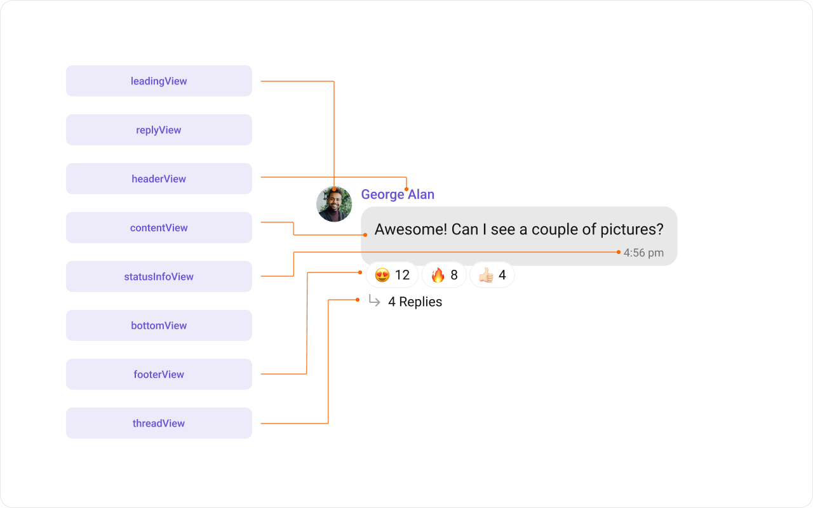
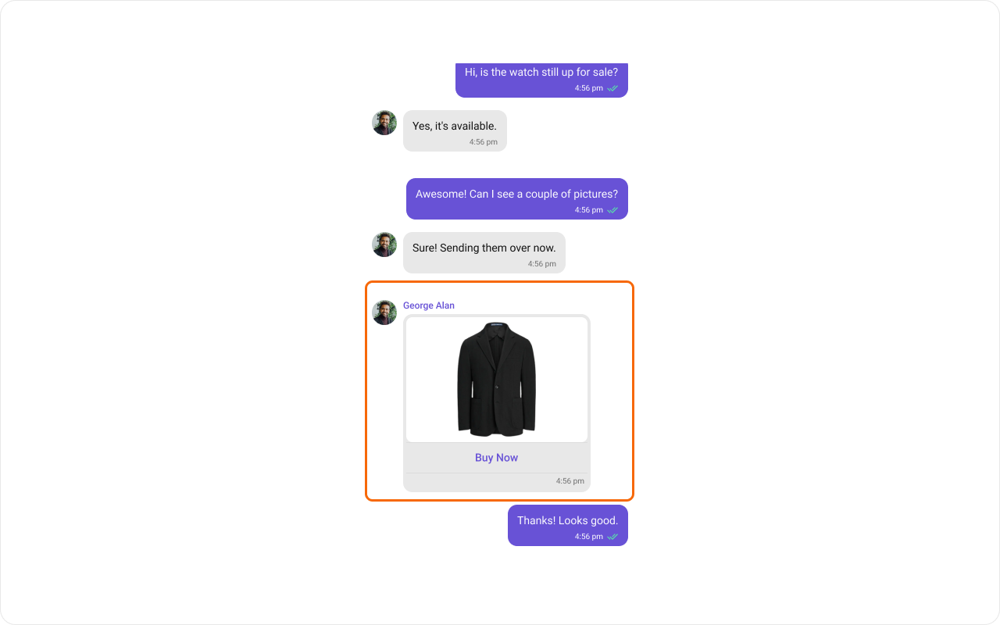
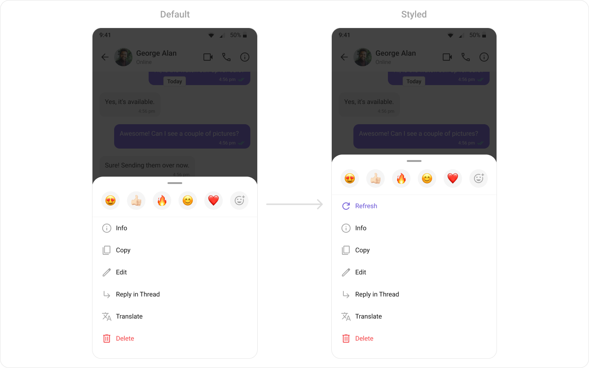
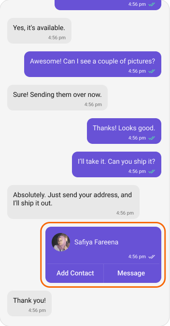

import Tabs from '@theme/Tabs';
import TabItem from '@theme/TabItem';

## Overview

A MessageTemplate provides you with the capability to define and customize both the structure and the behavior of the [MessageBubble](../04-Theming/04-message-bubble-styling.md#message-bubbles). It acts as a schema or design blueprint for the creation of a variety of [MessageBubble](../04-Theming/04-message-bubble-styling.md#message-bubbles) components, allowing you to manage the appearance and interactions of [MessageBubble](../04-Theming/04-message-bubble-styling.md#message-bubbles) within your application effectively and consistently.

### Structure



The MessageBubble structure can typically be broken down into the following views:

1. **Leading view**: This is where the sender's avatar is displayed. It's typically on the left of the MessageBubble for messages from others and on the right for messages from the current user.

2. **Header view**: This displays the sender's name and is especially useful in group chats where multiple users are sending messages.

3. **Content view**: This is the core of the MessageBubble where the message content (text, images, videos, etc.) is displayed.

4. **Bottom view**: This view can be used to extend the MessageBubble with additional elements, such as link previews or a 'load more' button for long messages. It's typically placed beneath the Content view.

5. **Footer view**: This is where the timestamp of the message and its delivery or read status are displayed. It's located at the bottom of the MessageBubble.

### Properties

MessageTemplate provides you with methods that allow you to alter various properties of the MessageBubble. These properties include aspects such as the `type` and `category` of a message, the appearance and behavior of the header, content, and footer sections of the message bubble,

1. **Type**

   Using `setType()` you can set the type of CometChatMessage, This will map your MessageTemplate to the corresponding CometChatMessage. You can set the MessageTemplate Type using the following code snippet.

   ```java
   messageTemplate.setType(UIKitConstants.MessageType.CUSTOM);
   ```

2. **Category**

   Using `.setCategory()` you can set the category of a MessageTemplate. This will create a MessageTemplate with the specified category and link it with a CometChatMessage of the same category.

   Please refer to our guide on [Message Categories](/sdk/android/message-structure-and-hierarchy) for a deeper understanding of message categories.

   ```java
   messageTemplate.setCategory(UIKitConstants.MessageCategory.CUSTOM);
   ```

3. **Header View**

   The .`setHeaderView()` method allows you to assign a custom header view to the MessageBubble. By default, it is configured to display the sender's name.

```java
messageTemplate.setHeaderView(new MessagesViewHolderListener() {
                @Override
                public View createView(Context context, CometChatMessageBubble messageBubble, UIKitConstants.MessageBubbleAlignment alignment) {
                    return null;
                }

                @Override
                public void bindView(Context context,
                                     View createdView,
                                     BaseMessage message,
                                     UIKitConstants.MessageBubbleAlignment alignment,
                                     RecyclerView.ViewHolder holder,
                                     List<BaseMessage> messageList,
                                     int position) {

                }
            });
   ```

4. **Content View**

   The `.setContentView()` method allows you to assign a custom content view to the MessageBubble. By default, it displays the [Text Bubble](../04-Theming/04-message-bubble-styling.md#text-bubble), [Image Bubble](../04-Theming/04-message-bubble-styling.md#image-bubble), [File Bubble](../04-Theming/04-message-bubble-styling.md#file-bubble), [Audio Bubble](../04-Theming/04-message-bubble-styling.md#audio-bubble), or [Video Bubble](../04-Theming/04-message-bubble-styling.md#video-bubble), depending on the message type.

```java
messageTemplate.setContentView(new MessagesViewHolderListener() {
                @Override
                public View createView(Context context, CometChatMessageBubble messageBubble, UIKitConstants.MessageBubbleAlignment alignment) {
                    return null;
                }

                @Override
                public void bindView(Context context,
                                     View createdView,
                                     BaseMessage message,
                                     UIKitConstants.MessageBubbleAlignment alignment,
                                     RecyclerView.ViewHolder holder,
                                     List<BaseMessage> messageList,
                                     int position) {

                }
            });
```

5. **Footer View**

   The `.setFooterView()` method allows you to assign a custom Footer view to the MessageBubble. By default, it displays the receipt and timestamp.

```java
messageTemplate.setFooterView(new MessagesViewHolderListener() {
                @Override
                public View createView(Context context, CometChatMessageBubble messageBubble, UIKitConstants.MessageBubbleAlignment alignment) {
                    return null;
                }

                @Override
                public void bindView(Context context,
                                     View createdView,
                                     BaseMessage message,
                                     UIKitConstants.MessageBubbleAlignment alignment,
                                     RecyclerView.ViewHolder holder,
                                     List<BaseMessage> messageList,
                                     int position) {

                }
            });
```

6. **Bottom View**

   The `.setBottomView()` method allows you to assign a custom Bottom view to the MessageBubble.By defuault is has buttons such as link previews or a 'load more' button for long messages.

```java
messageTemplate.setBottomView(new MessagesViewHolderListener() {
                @Override
                public View createView(Context context, CometChatMessageBubble messageBubble, UIKitConstants.MessageBubbleAlignment alignment) {
                    return null;
                }

                @Override
                public void bindView(Context context,
                                     View createdView,
                                     BaseMessage message,
                                     UIKitConstants.MessageBubbleAlignment alignment,
                                     RecyclerView.ViewHolder holder,
                                     List<BaseMessage> messageList,
                                     int position) {

                }
            });
```

7. **Bubble View**

   The `.setBubbleView()` method allows you to assign a custom Bubble view to the MessageBubble. By default, headerView, contentView, and footerView together form a message bubble.

```java
messageTemplate.setBubbleView(new MessagesViewHolderListener() {
                @Override
                public View createView(Context context, CometChatMessageBubble messageBubble, UIKitConstants.MessageBubbleAlignment alignment) {
                    return null;
                }

                @Override
                public void bindView(Context context,
                                     View createdView,
                                     BaseMessage message,
                                     UIKitConstants.MessageBubbleAlignment alignment,
                                     RecyclerView.ViewHolder holder,
                                     List<BaseMessage> messageList,
                                     int position) {

                }
            });
```

8. **Options**

The `.setOptions()` lets you set the list of actions that a user can perform on a message. This includes actions like reacting to, editing, or deleting a message.

```java
messageTemplate.setOptions((context, baseMessage, group) -> Collections.emptyList());
```

## Customization

Let's dive into how you can use the [properties](#properties) of MessageTemplate to customize an existing template or add a new one to the [MessageList](../05-Components/07-message-list.md) component.

The First step is to fetch the list of existing templates when you want to modify or add to them. This can be done using the getAllMessageTemplates() method from the DataSource of the CometChatUIKit class.

```Java
List<CometChatMessageTemplate> messageTemplates = CometChatUIKit.getDataSource().getAllMessageTemplates(messagelist.getAddtionalParameters());
```

### Existing Templates

You will need to first get the MessageTemplate object for the type of message you want to customize. You will be customizing the TextMessage Bubble here. The code snippet to get the Text MessageTemplate is as follows.

<Tabs>

<TabItem value="java" label="Java">

```java
List<CometChatMessageTemplate> messageTemplates = CometChatUIKit.getDataSource().getAllMessageTemplates(messagelist.getAddtionalParameters());

for(CometChatMessageTemplate template : messageTemplates){
    if(template.getType().equals(UIKitConstants.MessageType.TEXT)){
        // Code to customize text message template
    }
}
```

</TabItem>

<TabItem value="kotlin" label="Kotlin">

```kotlin
val messageTemplates: List<CometChatMessageTemplate> = CometChatUIKit.dataSource.messageTemplates(messagelist.getAddtionalParameters())

for (template in messageTemplates) {
    if (template.type == UIKitConstants.MessageType.TEXT) {
        // Code to customize text message template
    }
}
```

</TabItem>

</Tabs>

You will be using [MessageList](../05-Components/07-message-list.md) Component for example here so to apply Template to MessageList you will need to use `setTemplates` method.

You can apply MessageTemplates to MessagesList Component using the following code snippet.

<Tabs>

<TabItem value="java" label="Java">

```java
List<CometChatMessageTemplate> messageTemplates = CometChatUIKit.getDataSource(getMessageTemplates());

for(CometChatMessageTemplate template : messageTemplates){
    Log.e(TAG, "messageTemplate: Type = "+template.getType());
    if(template.getType().equals(UIKitConstants.MessageType.TEXT)){
        // Code to customize text message template
    }
}

messageList.setTemplates(messageTemplates);
```

</TabItem>

<TabItem value="kotlin" label="Kotlin">

```kotlin

val messageTemplates = CometChatUI.getAllMessageTemplates()

for (template in messageTemplates) {
    Log.e(TAG, "messageTemplate: Type = ${template.type}")
    if (template.type == UIKitConstants.MessageType.TEXT) {
        // Code to customize text message template
    }
}

messageList.setTemplates(messageTemplates)
```

</TabItem>

</Tabs>

#### Header view

The `.setHeaderView()` method of MessageTemplate allows you to add custom views to the header of your message bubbles. In the example below, we will add a custom layout `custom_txt_header_layout.xml` to the header view of every text message in the MessageList.


```xml title="message_template_header_view.xml"
<?xml version="1.0" encoding="utf-8"?>
<LinearLayout xmlns:android="http://schemas.android.com/apk/res/android"
    android:layout_width="match_parent"
    android:layout_height="wrap_content">

    <TextView
        android:id="@+id/name_with_status"
        android:layout_width="match_parent"
        android:layout_height="wrap_content"
        android:text="George Alan • 🗓️ In meeting"
        android:textAppearance="?attr/cometchatTextAppearanceCaption2Regular"
        android:textColor="?attr/cometchatPrimaryColor" />

</LinearLayout>
```

<Tabs>

<TabItem value="java" label="Java">

```java
template.setHeaderView(new MessagesViewHolderListener() {
                    @Override
                    public View createView(Context context, CometChatMessageBubble messageBubble, UIKitConstants.MessageBubbleAlignment alignment) {
                        return LayoutInflater.from(context).inflate(R.layout.message_template_header_view, null);
                    }

                    @Override
                    public void bindView(Context context,
                                         View createdView,
                                         BaseMessage message,
                                         UIKitConstants.MessageBubbleAlignment alignment,
                                         RecyclerView.ViewHolder holder,
                                         List<BaseMessage> messageList,
                                         int position) {
                        TextView textView = createdView.findViewById(R.id.name_with_status);
                        textView.setText(message.getSender().getName() + " • " + "\uD83D\uDDD3\uFE0F In meeting");

                    }
});
```

</TabItem>

<TabItem value="kotlin" label="Kotlin">

```kotlin
template.setHeaderView(object : MessagesViewHolderListener {
    override fun createView(
        context: Context,
        cometChatMessageBubble: CometChatMessageBubble,
        messageBubbleAlignment: UIKitConstants.MessageBubbleAlignment
    ): View {
        return layoutInflater.inflate(R.layout.message_template_header_view, null)
    }

    override fun bindView(
        context: Context,
        view: View,
        baseMessage: BaseMessage,
        messageBubbleAlignment: UIKitConstants.MessageBubbleAlignment,
        viewHolder: RecyclerView.ViewHolder,
        list: List<BaseMessage>,
        i: Int
    ) {
        val textView = view.findViewById<TextView>(R.id.name_with_status)
        textView.setText(message.getSender().getName() + " • " + "\uD83D\uDDD3\uFE0F In meeting")
    }
})
```

</TabItem>

</Tabs>

In this code, The createView() method inflates the 'image_bubble_content_view.xml' as the header view for every message. The bindView() method allows you to bind your custom view, which will be called every time a ViewHolder for that message type is bound.

#### Content view

The `.setContentView()` method of MessageTemplate allows you to add a custom view to the content of your message bubbles. In the example below, we will add a custom layout `custom_message_content_layout.xml` to the content view of every text message in the MessageList.



```xml title="image_bubble_content_view.xml"
<?xml version="1.0" encoding="utf-8"?>
<LinearLayout xmlns:android="http://schemas.android.com/apk/res/android"
    android:layout_width="match_parent"
    android:layout_height="wrap_content"
    android:orientation="vertical">

    <LinearLayout
        android:id="@+id/image_bubble_container"
        android:layout_width="wrap_content"
        android:layout_height="wrap_content"
        android:orientation="vertical">

        <com.cometchat.chatuikit.shared.views.cometchatimagebubble.CometChatImageBubble
            android:id="@+id/imageBubble"
            android:layout_width="@dimen/cometchat_240dp"
            android:layout_height="@dimen/cometchat_232dp" />

        <TextView
            android:layout_width="match_parent"
            android:layout_height="wrap_content"
            android:layout_margin="@dimen/cometchat_margin_2"
            android:text="Buy Now"
            android:textAlignment="center"
            android:textAppearance="?attr/cometchatTextAppearanceButtonMedium"
            android:textColor="?attr/cometchatStrokeColorHighlight" />
    </LinearLayout>

    <com.cometchat.chatuikit.shared.views.deletebubble.CometChatDeleteBubble
        android:id="@+id/cometchat_delete_text_bubble"
        android:layout_width="wrap_content"
        android:layout_height="wrap_content"
        android:visibility="gone" />
</LinearLayout>
```

<Tabs>

<TabItem value="java" label="Java">

```java
   List<CometChatMessageTemplate> templates = ChatConfigurator.getDataSource().getMessageTemplates(messageList.getAdditionParameter());

        for (CometChatMessageTemplate template : templates) {
            if (template.getType().equals(UIKitConstants.MessageType.IMAGE)) {

                template.setContentView(new MessagesViewHolderListener() {
                    @Override
                    public View createView(Context context,
                                           CometChatMessageBubble cometChatMessageBubble,
                                           UIKitConstants.MessageBubbleAlignment messageBubbleAlignment) {
                        return LayoutInflater.from(context).inflate(R.layout.image_bubble_content_view, null);
                    }

                    @Override
                    public void bindView(Context context,
                                         View view,
                                         BaseMessage baseMessage,
                                         UIKitConstants.MessageBubbleAlignment messageBubbleAlignment,
                                         RecyclerView.ViewHolder viewHolder,
                                         List<BaseMessage> list,
                                         int i) {
                        if (view != null) {
                            int deleteStyle;
                            int bubbleStyle;

                            if (messageBubbleAlignment == UIKitConstants.MessageBubbleAlignment.RIGHT) {
                                deleteStyle = com.cometchat.chatuikit.R.style.CometChatIncomingMessageDeleteStyle;
                                bubbleStyle = com.cometchat.chatuikit.R.style.CometChatIncomingImageMessageBubbleStyle;
                            } else {
                                deleteStyle = com.cometchat.chatuikit.R.style.CometChatOutgoingDeleteBubbleStyle;
                                bubbleStyle = com.cometchat.chatuikit.R.style.CometChatOutgoingImageBubbleStyle;
                            }

                            LinearLayout linearLayout = view.findViewById(R.id.image_bubble_container);
                            CometChatImageBubble cometchatImageBubble = view.findViewById(R.id.imageBubble);
                            CometChatDeleteBubble deletedBubble = view.findViewById(com.cometchat.chatuikit.R.id.cometchat_delete_text_bubble);
                            MediaMessage mediaMessage = (MediaMessage) baseMessage;
                            if (mediaMessage.getDeletedAt() == 0) {
                                cometchatImageBubble.setStyle(bubbleStyle);
                                deletedBubble.setVisibility(View.GONE);
                                cometchatImageBubble.setVisibility(View.VISIBLE);
                                Attachment attachment = mediaMessage.getAttachment();
                                File file = Utils.getFileFromLocalPath(mediaMessage);
                                cometchatImageBubble.setImageUrl(file,
                                                                 attachment != null ? attachment.getFileUrl() : "",
                                                                 attachment != null ? attachment
                                                                     .getFileExtension()
                                                                     .equalsIgnoreCase("gif") : Utils.isGifFile(file));
                            } else {
                                linearLayout.setVisibility(View.GONE);
                                deletedBubble.setVisibility(View.VISIBLE);
                                deletedBubble.setStyle(deleteStyle);
                            }

                        }
                    }
                });
                break;
            }

    }
    messageList.setTemplates(templates);

```

</TabItem>

<TabItem value="kotlin" label="Kotlin">

```kotlin
val templates = ChatConfigurator.getDataSource().getMessageTemplates(messageList.additionParameter)

        for (template in templates) {
            if (template.type == UIKitConstants.MessageType.IMAGE) {
                template.setContentView(object : MessagesViewHolderListener() {
                    override fun createView(
                        context: Context,
                        cometChatMessageBubble: CometChatMessageBubble,
                        messageBubbleAlignment: UIKitConstants.MessageBubbleAlignment
                    ): View {
                        return LayoutInflater.from(context).inflate(R.layout.image_bubble_content_view, null)
                    }

                    override fun bindView(
                        context: Context,
                        view: View,
                        baseMessage: BaseMessage,
                        messageBubbleAlignment: UIKitConstants.MessageBubbleAlignment,
                        viewHolder: RecyclerView.ViewHolder,
                        list: List<BaseMessage>,
                        i: Int
                    ) {
                        if (view != null) {
                            val deleteStyle: Int
                            val bubbleStyle: Int

                            if (messageBubbleAlignment == UIKitConstants.MessageBubbleAlignment.RIGHT) {
                                deleteStyle = com.cometchat.chatuikit.R.style.CometChatIncomingMessageDeleteStyle
                                bubbleStyle = com.cometchat.chatuikit.R.style.CometChatIncomingImageMessageBubbleStyle
                            } else {
                                deleteStyle = com.cometchat.chatuikit.R.style.CometChatOutgoingDeleteBubbleStyle
                                bubbleStyle = com.cometchat.chatuikit.R.style.CometChatOutgoingImageBubbleStyle
                            }

                            val linearLayout = view.findViewById<LinearLayout>(R.id.image_bubble_container)
                            val cometchatImageBubble = view.findViewById<CometChatImageBubble>(R.id.imageBubble)
                            val deletedBubble = view.findViewById<CometChatDeleteBubble>(com.cometchat.chatuikit.R.id.cometchat_delete_text_bubble)
                            val mediaMessage = baseMessage as MediaMessage
                            if (mediaMessage.deletedAt == 0L) {
                                cometchatImageBubble.style = bubbleStyle
                                deletedBubble.visibility = View.GONE
                                cometchatImageBubble.visibility = View.VISIBLE
                                val attachment = mediaMessage.attachment
                                val file = Utils.getFileFromLocalPath(mediaMessage)
                                cometchatImageBubble.setImageUrl(
                                    file,
                                    if (attachment != null) attachment.fileUrl else "",
                                    attachment?.fileExtension?.equals("gif", ignoreCase = true) ?: Utils.isGifFile(file)
                                )
                            } else {
                                linearLayout.visibility = View.GONE
                                deletedBubble.visibility = View.VISIBLE
                                deletedBubble.style = deleteStyle
                            }
                        }
                    }
                })
                break
            }
        }
messageList.setTemplates(templates)

```

</TabItem>

</Tabs>

In this code, The createView() method inflates the 'image_bubble_content_view.xml' as the content view for every message. The bindView() method allows you to bind your custom view, which will be called every time a ViewHolder for that message type is bound.

#### Status info view
The `.setStatusInfoView()` method of MessageTemplate allows you to add a custom status info to your message bubbles. In the example below, we will add a custom layout `status_info_layout.xml` to the footerview and empty layout to the status info view view of every text message in the MessageList.


```xml title="status_info_layout.xml"
<?xml version="1.0" encoding="utf-8"?>
<LinearLayout xmlns:android="http://schemas.android.com/apk/res/android"
    android:layout_width="wrap_content"
    android:layout_height="wrap_content"
    android:layout_gravity="end"
    android:layout_marginStart="@dimen/cometchat_100dp"
    android:gravity="center_vertical"
    android:orientation="horizontal">

    <TextView
        android:id="@+id/time"
        android:layout_width="wrap_content"
        android:layout_height="wrap_content"
        android:layout_marginTop="@dimen/cometchat_8dp"
        android:layout_marginBottom="@dimen/cometchat_4dp"
        android:text="12:00 pm"
        android:textAppearance="?attr/cometchatTextAppearanceCaption2Regular"
        android:textColor="?attr/cometchatTextColorSecondary" />

    <com.cometchat.chatuikit.shared.views.cometchatmessagereceipt.CometChatMessageReceipt
        android:id="@+id/receipt"
        android:layout_width="@dimen/cometchat_17dp"
        android:layout_height="@dimen/cometchat_17dp"
        android:layout_marginStart="8dp"
        android:layout_marginTop="@dimen/cometchat_8dp"
        android:layout_marginBottom="@dimen/cometchat_4dp" />
</LinearLayout>
```

<Tabs>

<TabItem value="java" label="Java">

```java
   List<CometChatMessageTemplate> templates = ChatConfigurator.getDataSource().getMessageTemplates(messageList.getAdditionParameter());

        for (CometChatMessageTemplate template : templates) {
            if (template.getType().equals(UIKitConstants.MessageType.TEXT)) {

                template.setStatusInfoView(new MessagesViewHolderListener() {
                    @Override
                    public View createView(Context context,
                                           CometChatMessageBubble cometChatMessageBubble,
                                           UIKitConstants.MessageBubbleAlignment messageBubbleAlignment) {
                        View view = new View(context);
                        LinearLayout.LayoutParams layoutParams = new LinearLayout.LayoutParams(
                            context.getResources().getDimensionPixelSize(com.cometchat.chatuikit.R.dimen.cometchat_1dp),
                            context.getResources().getDimensionPixelSize(com.cometchat.chatuikit.R.dimen.cometchat_12dp));
                        view.setLayoutParams(layoutParams);
                        return view;
                    }

                    @Override
                    public void bindView(Context context,
                                         View view,
                                         BaseMessage baseMessage,
                                         UIKitConstants.MessageBubbleAlignment messageBubbleAlignment,
                                         RecyclerView.ViewHolder viewHolder,
                                         List<BaseMessage> list,
                                         int i) {

                    }
                });

                template.setFooterView(new MessagesViewHolderListener() {
                    @Override
                    public View createView(Context context,
                                           CometChatMessageBubble cometChatMessageBubble,
                                           UIKitConstants.MessageBubbleAlignment messageBubbleAlignment) {
                        return LayoutInflater.from(context).inflate(R.layout.status_info_layout, null);

                    }

                    @Override
                    public void bindView(Context context,
                                         View createdView,
                                         BaseMessage baseMessage,
                                         UIKitConstants.MessageBubbleAlignment messageBubbleAlignment,
                                         RecyclerView.ViewHolder viewHolder,
                                         List<BaseMessage> list,
                                         int i) {
                        TextView tvTime = createdView.findViewById(R.id.time);
                        CometChatMessageReceipt receipt = createdView.findViewById(R.id.receipt);
                        if (messageBubbleAlignment.equals(UIKitConstants.MessageBubbleAlignment.RIGHT)) {
                            receipt.setVisibility(View.VISIBLE);
                            receipt.setMessageReceipt(MessageReceiptUtils.MessageReceipt(baseMessage));
                        } else {
                            receipt.setVisibility(View.GONE);
                        }
                        tvTime.setText(new SimpleDateFormat("hh:mm a").format(baseMessage.getSentAt() * 1000));
                    }
                });
                break;
            }

        }
        messageList.setTemplates(templates);
```

</TabItem>

<TabItem value="kotlin" label="Kotlin">

```kotlin
    val templates = ChatConfigurator.getDataSource().getMessageTemplates(messageList.additionParameter)

        for (template in templates) {
            if (template.type == UIKitConstants.MessageType.TEXT) {
                template.setStatusInfoView(object : MessagesViewHolderListener() {
                    override fun createView(
                        context: Context,
                        cometChatMessageBubble: CometChatMessageBubble,
                        messageBubbleAlignment: UIKitConstants.MessageBubbleAlignment
                    ): View {
                        val view = View(context)
                        val layoutParams = LinearLayout.LayoutParams(
                            context.resources.getDimensionPixelSize(com.cometchat.chatuikit.R.dimen.cometchat_1dp),
                            context.resources.getDimensionPixelSize(com.cometchat.chatuikit.R.dimen.cometchat_12dp)
                        )
                        view.layoutParams = layoutParams
                        return view
                    }

                    override fun bindView(
                        context: Context,
                        view: View,
                        baseMessage: BaseMessage,
                        messageBubbleAlignment: UIKitConstants.MessageBubbleAlignment,
                        viewHolder: RecyclerView.ViewHolder,
                        list: List<BaseMessage>,
                        i: Int
                    ) {
                    }
                })

                template.setFooterView(object : MessagesViewHolderListener() {
                    override fun createView(
                        context: Context,
                        cometChatMessageBubble: CometChatMessageBubble,
                        messageBubbleAlignment: UIKitConstants.MessageBubbleAlignment
                    ): View {
                        return LayoutInflater.from(context).inflate(R.layout.status_info_layout, null)
                    }

                    override fun bindView(
                        context: Context,
                        createdView: View,
                        baseMessage: BaseMessage,
                        messageBubbleAlignment: UIKitConstants.MessageBubbleAlignment,
                        viewHolder: RecyclerView.ViewHolder,
                        list: List<BaseMessage>,
                        i: Int
                    ) {
                        val tvTime = createdView.findViewById<TextView>(R.id.time)
                        val receipt = createdView.findViewById<CometChatMessageReceipt>(R.id.receipt)
                        if (messageBubbleAlignment == UIKitConstants.MessageBubbleAlignment.RIGHT) {
                            receipt.visibility = View.VISIBLE
                            receipt.setMessageReceipt(MessageReceiptUtils.MessageReceipt(baseMessage))
                        } else {
                            receipt.visibility = View.GONE
                        }
                        tvTime.text = SimpleDateFormat("hh:mm a").format(baseMessage.sentAt * 1000)
                    }
                })
                break
            }
        }
    messageList.setTemplates(templates)
```

</TabItem>

</Tabs>

In this code, The createView() method inflates the `status_info_layout.xml` as the footer info view for every message. The bindView() method allows you to bind your custom view, which will be called every time a ViewHolder for that message type is bound.

#### Bottom View

The `.setBottomView()` method of MessageTemplate allows you to add a custom button view to your message bubbles. In the example below, we will add a custom layout `custom_message_bottom_layout.xml` to the bottom view of every text message in the MessageList.


```xml title="message_template_bottom_view.xml"
<?xml version="1.0" encoding="utf-8"?>
<LinearLayout xmlns:android="http://schemas.android.com/apk/res/android"
    xmlns:app="http://schemas.android.com/apk/res-auto"
    android:layout_width="match_parent"
    android:layout_height="wrap_content"
    android:background="#FFFFFF"
    android:gravity="center_vertical">

    <LinearLayout
        android:layout_width="match_parent"
        android:layout_height="wrap_content"
        android:background="#33F44649"
        android:orientation="horizontal"
        android:padding="2dp">

        <ImageView
            android:id="@+id/backIcon"
            android:layout_width="@dimen/cometchat_12dp"
            android:layout_height="@dimen/cometchat_12dp"
            android:layout_marginStart="8dp"
            android:src="@drawable/cometchat_ic_message_error"
            app:tint="?attr/cometchatErrorColor" />

        <TextView
            android:id="@+id/title"
            android:layout_width="match_parent"
            android:layout_height="wrap_content"
            android:layout_marginStart="8dp"
            android:layout_marginEnd="8dp"
            android:text="According to guidelines you cannot share contact"
            android:textAppearance="?attr/cometchatTextAppearanceCaption2Regular"
            android:textColor="#F44649"
            android:translationZ="1dp" />
    </LinearLayout>

</LinearLayout>
```

<Tabs>

<TabItem value="java" label="Java">

```java
template.setBottomView(new MessagesViewHolderListener() {
                    @Override
                    public View createView(Context context, CometChatMessageBubble messageBubble, UIKitConstants.MessageBubbleAlignment alignment) {
                        return LayoutInflater.from(context).inflate(R.layout.message_template_bottom_view, null);
                    }

                    @Override
                    public void bindView(Context context,
                                         View createdView,
                                         BaseMessage message,
                                         UIKitConstants.MessageBubbleAlignment alignment,
                                         RecyclerView.ViewHolder holder,
                                         List<BaseMessage> messageList,
                                         int position) {
                        createdView.setVisibility(View.GONE);
                        if (baseMessage.getMetadata() != null && MessageReceiptUtils.MessageReceipt(baseMessage).equals(Receipt.ERROR)) {
                            createdView.setVisibility(View.VISIBLE);
                        }
                    }
});
```

</TabItem>

<TabItem value="kotlin" label="Kotlin">

```kotlin
template.setBottomView(object : MessagesViewHolderListener {
    override fun createView(
        context: Context,
        cometChatMessageBubble: CometChatMessageBubble,
        messageBubbleAlignment: UIKitConstants.MessageBubbleAlignment
    ): View {
        return LayoutInflater.from(context).inflate(R.layout.message_template_bottom_view, null)
    }

    override fun bindView(
        context: Context,
        view: View,
        baseMessage: BaseMessage,
        messageBubbleAlignment: UIKitConstants.MessageBubbleAlignment,
        viewHolder: RecyclerView.ViewHolder,
        list: List<BaseMessage>,
        i: Int
    ) {
        createdView.setVisibility(View.GONE);
        if (baseMessage.getMetadata() != null && MessageReceiptUtils.MessageReceipt(baseMessage).equals(Receipt.ERROR)) {
            createdView.setVisibility(View.VISIBLE);
        }
    }
})
```

</TabItem>

</Tabs>

In this code, The createView() method inflates the 'custom_message_bottom_layout.xml' as the bottom view for every message. The bindView() method allows you to bind your custom view, which will be called every time a ViewHolder for that message type is bound.

#### Footer View

The `.setFooterView()` method of MessageTemplate allows you to add a footer view to your message bubbles. In the example below, we will add a custom layout custom_menu_layout.xml to the bottom view of every text message in the MessageList.


```xml title = "message_template_footer_view.xml"
<?xml version="1.0" encoding="utf-8"?>
<LinearLayout xmlns:android="http://schemas.android.com/apk/res/android"
    android:layout_width="match_parent"
    android:layout_height="wrap_content">

    <LinearLayout
        android:id="@+id/cometchat_reaction_layout_parent_container"
        android:layout_width="match_parent"
        android:layout_height="wrap_content"
        android:layout_marginTop="8dp"
        android:orientation="vertical">

        <TextView
            android:layout_width="match_parent"
            android:layout_height="1dp"
            android:background="?attr/cometchatStrokeColorLight" />

        <com.cometchat.chatuikit.extensions.reaction.CometChatMessageReaction
            android:id="@+id/cometchat_reaction_view"
            android:layout_width="match_parent"
            android:layout_height="wrap_content" />
    </LinearLayout>

</LinearLayout>
```

<Tabs>

<TabItem value="java" label="Java">

```java
template.setFooterView(new MessagesViewHolderListener() {
                    @Override
                    public View createView(Context context, CometChatMessageBubble messageBubble, UIKitConstants.MessageBubbleAlignment alignment) {
                        return LayoutInflater.from(context).inflate(R.layout.message_template_footer_view, null);
                    }

                    @Override
                    public void bindView(Context context,
                                         View createdView,
                                         BaseMessage message,
                                         UIKitConstants.MessageBubbleAlignment alignment,
                                         RecyclerView.ViewHolder holder,
                                         List<BaseMessage> messageList,
                                         int position) {
                        CometChatMessageReaction messageReaction = createdView.findViewById(R.id.cometchat_reaction_view);
                        LinearLayout reactionLayout = createdView.findViewById(R.id.cometchat_reaction_layout_parent_container);
                        if (alignment.equals(UIKitConstants.MessageBubbleAlignment.RIGHT))
                            reactionLayout.setBackgroundColor(CometChatTheme.getPrimaryColor(context));
                        else
                            reactionLayout.setBackgroundColor(CometChatTheme.getNeutralColor300(context));

                        messageReaction.setStyle(com.cometchat.chatuikit.R.style.CometChatReactionStyle);
                        messageReaction.bindReactionsToMessage(message, 4);
                    }
                });
```

</TabItem>

<TabItem value="kotlin" label="Kotlin">

```kotlin
template.setFooterView(object : MessagesViewHolderListener() {
            override fun createView(context: Context, messageBubble: CometChatMessageBubble, alignment: MessageBubbleAlignment): View {
                return LayoutInflater.from(context).inflate(R.layout.message_template_footer_view, null)
            }

            override fun bindView(
                context: Context,
                createdView: View,
                message: BaseMessage,
                alignment: MessageBubbleAlignment,
                holder: RecyclerView.ViewHolder,
                messageList: List<BaseMessage>,
                position: Int
            ) {
                val messageReaction = createdView.findViewById<CometChatMessageReaction>(R.id.cometchat_reaction_view)
                val reactionLayout = createdView.findViewById<LinearLayout>(R.id.cometchat_reaction_layout_parent_container)
                if (alignment == MessageBubbleAlignment.RIGHT) reactionLayout.setBackgroundColor(CometChatTheme.getPrimaryColor(context))
                else reactionLayout.setBackgroundColor(CometChatTheme.getNeutralColor300(context))

                messageReaction.setStyle(R.style.CometChatReactionStyle)
                messageReaction.bindReactionsToMessage(message, 4)
            }
        })
```

</TabItem>

</Tabs>


In this code, The createView() method inflates the 'custom_menu_layout.xml' as the footer view for every message. The bindView() method allows you to bind your custom view, which will be called every time a ViewHolder for that message type is bound.

#### Bubble View

The` .setBubbleView()` method of MessageTemplate allows you to add a bubble view to your message bubbles. In the example below, we will add a custom layout custom_message_content_layout.xml to the bubble view of every text message in the MessageList.


```xml title="drawable/left_bubble_bg"
<vector xmlns:android="http://schemas.android.com/apk/res/android"
    android:width="@dimen/cometchat_100dp"
    android:height="@dimen/cometchat_45dp"
    android:viewportWidth="181"
    android:viewportHeight="65">
  <path
      android:pathData="M180.56,2.88C180.56,1.29 179.27,0 177.68,0H2.88C1.29,0 0,1.29 0,2.88V58.56H177.68C179.27,58.56 180.56,57.27 180.56,55.68V2.88Z"
      android:fillColor="?attr/cometchatNeutralColor300"/>
  <path
      android:pathData="M12.06,56.84C12.8,56.26 12.8,55.14 12.06,54.57L2.89,47.43C1.94,46.69 0.56,47.37 0.56,48.57L0.56,62.84C0.56,64.04 1.94,64.71 2.89,63.97L12.06,56.84Z"
      android:fillColor="?attr/cometchatNeutralColor300"/>
</vector>
```
```xml title="drawable/right_bubble_bg"
<vector xmlns:android="http://schemas.android.com/apk/res/android"
    android:width="@dimen/cometchat_100dp"
    android:height="@dimen/cometchat_45dp"
    android:viewportWidth="181"
    android:viewportHeight="65">
  <path
      android:pathData="M0,2.88C0,1.29 1.29,0 2.88,0H177.68C179.27,0 180.56,1.29 180.56,2.88V58.56H2.88C1.29,58.56 0,57.27 0,55.68V2.88Z"
      android:fillColor="?attr/cometchatPrimaryColor"/>
  <path
      android:pathData="M168.5,56.84C167.76,56.26 167.76,55.14 168.5,54.57L177.68,47.43C178.62,46.69 180,47.37 180,48.57V62.84C180,64.04 178.62,64.71 177.68,63.97L168.5,56.84Z"
      android:fillColor="?attr/cometchatPrimaryColor"/>
</vector>
```

```xml title ="layout/outgoing_text_bubble_view"
<?xml version="1.0" encoding="utf-8"?>
<LinearLayout xmlns:android="http://schemas.android.com/apk/res/android"
    android:id="@+id/container_layout"
    android:layout_width="match_parent"
    android:layout_height="wrap_content"
    android:orientation="vertical">

    <LinearLayout
        android:layout_width="wrap_content"
        android:layout_height="wrap_content"
        android:layout_gravity="end"
        android:layout_marginStart="@dimen/cometchat_100dp"
        android:background="@drawable/right_bubble_bg"
        android:orientation="vertical">

        <TextView
            android:id="@+id/text_message"
            android:layout_width="match_parent"
            android:layout_height="wrap_content"
            android:layout_margin="@dimen/cometchat_8dp"
            android:text="aefeafa"
            android:textColor="@color/white" />
    </LinearLayout>

    <LinearLayout
        android:layout_width="wrap_content"
        android:layout_height="wrap_content"
        android:layout_gravity="end"
        android:layout_marginStart="@dimen/cometchat_100dp"
        android:gravity="center_vertical"
        android:orientation="horizontal">

        <TextView
            android:id="@+id/time"
            android:layout_width="wrap_content"
            android:layout_height="wrap_content"
            android:text="12:00 pm"
            android:textAppearance="?attr/cometchatTextAppearanceCaption2Regular"
            android:textColor="?attr/cometchatTextColorSecondary" />

        <com.cometchat.chatuikit.shared.views.cometchatmessagereceipt.CometChatMessageReceipt
            android:id="@+id/receipt"
            android:layout_width="@dimen/cometchat_17dp"
            android:layout_height="@dimen/cometchat_17dp"
            android:layout_marginStart="8dp" />


    </LinearLayout>
</LinearLayout>
```

```xml title ="layout/incoming_text_bubble_view"
<?xml version="1.0" encoding="utf-8"?>
<LinearLayout xmlns:android="http://schemas.android.com/apk/res/android"
    android:id="@+id/container_layout"
    android:layout_width="match_parent"
    android:layout_height="wrap_content"
    android:orientation="vertical">

    <LinearLayout
        android:layout_width="wrap_content"
        android:layout_height="wrap_content"
        android:layout_marginEnd="@dimen/cometchat_100dp"
        android:background="@drawable/left_bubble_bg"
        android:orientation="vertical">

        <TextView
            android:id="@+id/text_message"
            android:layout_width="match_parent"
            android:layout_height="wrap_content"
            android:layout_margin="@dimen/cometchat_8dp"
            android:textAlignment="textStart"
            android:textColor="@color/black" />
    </LinearLayout>

    <LinearLayout
        android:layout_width="wrap_content"
        android:layout_height="wrap_content"
        android:layout_marginEnd="@dimen/cometchat_100dp"
        android:gravity="center_vertical"
        android:orientation="horizontal">

        <TextView
            android:id="@+id/time"
            android:layout_width="wrap_content"
            android:layout_height="wrap_content"
            android:text="12:00 pm"
            android:textAppearance="?attr/cometchatTextAppearanceCaption2Regular"
            android:textColor="?attr/cometchatTextColorSecondary" />

    </LinearLayout>
</LinearLayout>
```
<Tabs>

<TabItem value="java" label="Java">

```java
template.setBubbleView(new MessagesViewHolderListener() {
                        @Override
                        public View createView(Context context,
                                               CometChatMessageBubble messageBubble,
                                               UIKitConstants.MessageBubbleAlignment alignment) {
                            if (alignment.equals(UIKitConstants.MessageBubbleAlignment.LEFT))
                                return LayoutInflater.from(context).inflate(R.layout.incoming_text_bubble_view, null);
                            else
                                return LayoutInflater.from(context).inflate(R.layout.outgoing_text_bubble_view, null);
                        }

                        @Override
                        public void bindView(Context context,
                                             View createdView,
                                             BaseMessage message,
                                             UIKitConstants.MessageBubbleAlignment alignment,
                                             RecyclerView.ViewHolder holder,
                                             List<BaseMessage> messageList,
                                             int position) {

                            TextView textView = createdView.findViewById(R.id.text_message);
                            TextView tvTime = createdView.findViewById(R.id.time);
                            if (alignment.equals(UIKitConstants.MessageBubbleAlignment.RIGHT)) {
                                CometChatMessageReceipt receipt = createdView.findViewById(R.id.receipt);
                                receipt.setMessageReceipt(MessageReceiptUtils.MessageReceipt(message));
                            }

                            TextMessage textMessage = (TextMessage) message;

                            tvTime.setText(new SimpleDateFormat("hh:mm a").format(textMessage.getSentAt() * 1000));
                            textView.setText(textMessage.getText());
                        }
                    });
```
</TabItem>

<TabItem value="kotlin" label="Kotlin">

```kt
template.setBubbleView(object : MessagesViewHolderListener() {
            override fun createView(
                context: Context,
                messageBubble: CometChatMessageBubble,
                alignment: MessageBubbleAlignment
            ): View {
                return if (alignment == MessageBubbleAlignment.LEFT) LayoutInflater.from(context).inflate(R.layout.incoming_text_bubble_view, null)
                else LayoutInflater.from(context).inflate(R.layout.outgoing_text_bubble_view, null)
            }

            override fun bindView(
                context: Context,
                createdView: View,
                message: BaseMessage,
                alignment: MessageBubbleAlignment,
                holder: RecyclerView.ViewHolder,
                messageList: List<BaseMessage>,
                position: Int
            ) {
                val textView = createdView.findViewById<TextView>(R.id.text_message)
                val tvTime = createdView.findViewById<TextView>(R.id.time)
                if (alignment == MessageBubbleAlignment.RIGHT) {
                    val receipt = createdView.findViewById<CometChatMessageReceipt>(R.id.receipt)
                    receipt.setMessageReceipt(MessageReceiptUtils.MessageReceipt(message))
                }

                val textMessage = message as TextMessage

                tvTime.text = SimpleDateFormat("hh:mm a").format(textMessage.sentAt * 1000)
                textView.text = textMessage.text
            }
        })
```
</TabItem>

</Tabs>


#### Options List

The `.setOptions()` method in the MessageTemplate allows you to customize the options that appear in the action sheet when a message is long-pressed. By default, CometChat UI Kit provides a set of options like "Reply", "Forward", "Edit", and "Delete".

However, if you wish to override or modify these options, you can use the `.setOptions()` method and pass a list of `CometChatMessageOption`. This list of options will replace the default set.



<Tabs>

<TabItem value="java" label="Java">
```java
List<CometChatMessageTemplate> messageTemplates = ChatConfigurator
            .getDataSource()
            .getMessageTemplates(messageList.getAdditionParameter());

        for (CometChatMessageTemplate messageTemplate : messageTemplates) {
            
            messageTemplate.setOptions((context, baseMessage, group) -> {
                CometChatMessageOption refreshOption =
                    new CometChatMessageOption("REFRESH",
                                               "Refresh",
                                               R.drawable.ic_refresh,
                                               () -> Toast.makeText(context, "Refresh clicked", Toast.LENGTH_SHORT).show());

                List<CometChatMessageOption> options = new ArrayList<>();
                options.add(refreshOption);
                options.addAll(CometChatUIKit.getDataSource().getMessageOptions(context, baseMessage, group));
                return options;
            });
        }

messageList.setTemplates(messageTemplates);
```
</TabItem>
<TabItem value="kotlin" label="Kotlin">

```kotlin
 val messageTemplates = ChatConfigurator
            .getDataSource()
            .getMessageTemplates(messageList.additionParameter)

        for (messageTemplate in messageTemplates) {
            messageTemplate.setOptions { context: Context?, baseMessage: BaseMessage?, group: Group? ->
                val refreshOption =
                    CometChatMessageOption(
                        "REFRESH",
                        "Refresh",
                        android.R.drawable.ic_refresh
                    ) { Toast.makeText(context, "Refresh clicked", Toast.LENGTH_SHORT).show() }
                val options: MutableList<CometChatMessageOption> =
                    ArrayList()
                options.add(refreshOption)
                options.addAll(CometChatUIKit.getDataSource().getMessageOptions(context, baseMessage, group))
                options
            }
        }

messageList.setTemplates(messageTemplates)

```

</TabItem>
</Tabs>

### New Templates

You can create an entirely new template for custom messages is one of the powerful features of CometChat's MessageTemplate.



First, let's see how to send a custom message:

<Tabs>

<TabItem value="java" label="Java">
```java
        JSONObject jsonObject = new JSONObject();
        try {
            jsonObject.put("contact_name", "John Doe");
            jsonObject.put("contact_avatar", "https://img.freepik.com/free-vector/blue-circle-with-white-user_78370-4707.jpg?semt=ais_hybrid");
            jsonObject.put("contact_number", "+91 1234567890");
        } catch (Exception e) {
            e.printStackTrace();
        }
        CustomMessage customMessage = new CustomMessage(user != null ? user.getUid() : group.getGuid(),
                                                        user != null ? CometChatConstants.RECEIVER_TYPE_USER : CometChatConstants.RECEIVER_TYPE_GROUP,
                                                        "card",
                                                        jsonObject);

        CometChatUIKit.sendCustomMessage(customMessage, new CometChat.CallbackListener<CustomMessage>() {
            @Override
            public void onSuccess(CustomMessage customMessage) {

            }

            @Override
            public void onError(CometChatException e) {

            }
        });
```
</TabItem>
<TabItem value="kotlin" label="Kotlin">

```kotlin
        val jsonObject = JSONObject()
        try {
            jsonObject.put("contact_name", "John Doe")
            jsonObject.put("contact_avatar", "https://img.freepik.com/free-vector/blue-circle-with-white-user_78370-4707.jpg?semt=ais_hybrid")
            jsonObject.put("contact_number", "+91 1234567890")
        } catch (e: Exception) {
            e.printStackTrace()
        }
        val customMessage = CustomMessage(
            if (user != null) user!!.uid else group.getGuid(),
            if (user != null) CometChatConstants.RECEIVER_TYPE_USER else CometChatConstants.RECEIVER_TYPE_GROUP,
            "card",
            jsonObject
        )

        CometChatUIKit.sendCustomMessage(customMessage, object : CallbackListener<CustomMessage?>() {
            override fun onSuccess(customMessage: CustomMessage?) {
            }

            override fun onError(e: CometChatException?) {
            }
        })

```

</TabItem>
</Tabs>

Now, we'll create a new MessageTemplate to render this custom message in the MessageList:

```xml title="contact_card.xml"
<?xml version="1.0" encoding="utf-8"?>
<com.google.android.material.card.MaterialCardView xmlns:android="http://schemas.android.com/apk/res/android"
    xmlns:app="http://schemas.android.com/apk/res-auto"
    android:layout_width="wrap_content"
    android:layout_height="wrap_content"
    android:orientation="vertical"
    app:cardCornerRadius="@dimen/cometchat_12dp"
    app:cardUseCompatPadding="true">

    <LinearLayout
        android:layout_width="@dimen/cometchat_240dp"
        android:layout_height="@dimen/cometchat_116dp"
        android:background="#6852D6"
        android:orientation="vertical">

        <LinearLayout
            android:layout_width="wrap_content"
            android:layout_height="wrap_content"
            android:layout_marginStart="@dimen/cometchat_margin_3"
            android:layout_marginTop="@dimen/cometchat_margin_3"
            android:gravity="center_vertical"
            android:orientation="horizontal">

            <com.cometchat.chatuikit.shared.views.cometchatavatar.CometChatAvatar
                android:id="@+id/avatar"
                android:layout_width="@dimen/cometchat_40dp"
                android:layout_height="@dimen/cometchat_40dp"
                app:cardCornerRadius="@dimen/cometchat_radius_max" />

            <TextView
                android:id="@+id/contactName"
                android:layout_width="match_parent"
                android:layout_height="wrap_content"
                android:layout_marginStart="@dimen/cometchat_8dp"
                android:text="Safia Fareena"
                android:textAppearance="?attr/cometchatTextAppearanceBodyRegular"
                android:textColor="?attr/cometchatColorWhite" />
        </LinearLayout>

        <LinearLayout
            android:layout_width="wrap_content"
            android:layout_height="wrap_content"
            android:layout_gravity="end"
            android:layout_marginEnd="@dimen/cometchat_margin_3"
            android:gravity="center_vertical"
            android:orientation="horizontal">

            <TextView
                android:id="@+id/time"
                android:layout_width="wrap_content"
                android:layout_height="wrap_content"
                android:text="12:00 pm"
                android:textAppearance="?attr/cometchatTextAppearanceCaption2Regular"
                android:textColor="?attr/cometchatColorWhite" />

            <com.cometchat.chatuikit.shared.views.cometchatmessagereceipt.CometChatMessageReceipt
                android:id="@+id/receipt"
                android:layout_width="@dimen/cometchat_17dp"
                android:layout_height="@dimen/cometchat_17dp"
                android:layout_marginStart="8dp" />

        </LinearLayout>

        <TextView
            android:id="@+id/separator"
            android:layout_width="match_parent"
            android:layout_height="@dimen/cometchat_1dp"
            android:layout_marginStart="@dimen/cometchat_margin_1"
            android:layout_marginTop="@dimen/cometchat_8dp"
            android:layout_marginEnd="@dimen/cometchat_margin_1"
            android:background="#7965DB" />

        <LinearLayout
            android:layout_width="match_parent"
            android:layout_height="wrap_content"
            android:gravity="center_vertical"
            android:orientation="horizontal">

            <TextView
                android:id="@+id/addContact"
                android:layout_width="0dp"
                android:layout_height="wrap_content"
                android:layout_weight="1"
                android:paddingStart="@dimen/cometchat_padding_5"
                android:paddingTop="@dimen/cometchat_padding_2"
                android:paddingEnd="@dimen/cometchat_padding_5"
                android:paddingBottom="@dimen/cometchat_padding_2"
                android:text="Add Contact"
                android:textAlignment="center"
                android:textAppearance="?attr/cometchatTextAppearanceButtonMedium"
                android:textColor="?attr/cometchatColorWhite" />

            <TextView
                android:layout_width="1dp"
                android:layout_height="match_parent"
                android:background="#7965DB" />

            <TextView
                android:id="@+id/message"
                android:layout_width="0dp"
                android:layout_height="wrap_content"
                android:layout_weight="1"
                android:paddingStart="@dimen/cometchat_padding_5"
                android:paddingTop="@dimen/cometchat_padding_2"
                android:paddingEnd="@dimen/cometchat_padding_5"
                android:paddingBottom="@dimen/cometchat_padding_2"
                android:text="Message"
                android:textAlignment="center"
                android:textAppearance="?attr/cometchatTextAppearanceButtonMedium"
                android:textColor="?attr/cometchatColorWhite" />
        </LinearLayout>
    </LinearLayout>
</com.google.android.material.card.MaterialCardView>
```

<Tabs>

<TabItem value="java" label="Java">
```java
        List<CometChatMessageTemplate> messageTemplates = ChatConfigurator
            .getDataSource()
            .getMessageTemplates(messageList.getAdditionParameter());


        CometChatMessageTemplate contactTemplate = new CometChatMessageTemplate();
        contactTemplate.setType("card");
        contactTemplate.setCategory(UIKitConstants.MessageCategory.CUSTOM);
        contactTemplate.setBubbleView(new MessagesViewHolderListener() {
            @Override
            public View createView(Context context,
                                   CometChatMessageBubble cometChatMessageBubble,
                                   UIKitConstants.MessageBubbleAlignment messageBubbleAlignment) {
                return LayoutInflater.from(context).inflate(R.layout.contact_card, null);
            }

            @Override
            public void bindView(Context context,
                                 View view,
                                 BaseMessage baseMessage,
                                 UIKitConstants.MessageBubbleAlignment alignment,
                                 RecyclerView.ViewHolder viewHolder,
                                 List<BaseMessage> list,
                                 int i) {

                LinearLayout.LayoutParams layoutParams = new LinearLayout.LayoutParams(LinearLayout.LayoutParams.WRAP_CONTENT,
                                                                                       LinearLayout.LayoutParams.WRAP_CONTENT);
                view.setLayoutParams(layoutParams);
                CometChatAvatar avatar = view.findViewById(R.id.avatar);
                TextView name = view.findViewById(R.id.contactName);
                TextView time = view.findViewById(R.id.time);
                CometChatMessageReceipt receipt = view.findViewById(R.id.receipt);

                CustomMessage customMessage = (CustomMessage) baseMessage;
                JSONObject jsonObject = customMessage.getCustomData();
                try {
                    name.setText(jsonObject.getString("contact_name"));
                    avatar.setAvatar(jsonObject.getString("contact_avatar"));
                } catch (Exception e) {
                    e.printStackTrace();
                }

                if (alignment.equals(UIKitConstants.MessageBubbleAlignment.RIGHT)) {
                    receipt.setVisibility(View.VISIBLE);
                    receipt.setMessageReceipt(MessageReceiptUtils.MessageReceipt(baseMessage));
                } else {
                    receipt.setVisibility(View.GONE);
                }

                time.setText(new SimpleDateFormat("hh:mm a").format(baseMessage.getSentAt() * 1000));
            }
        });

        messageTemplates.add(contactTemplate);
        messageList.setTemplates(messageTemplates);

```
</TabItem>

<TabItem value="kotlin" label="Kotlin">

```kotlin
        val contactTemplate = CometChatMessageTemplate()
        contactTemplate.setType("card")
        contactTemplate.setCategory(UIKitConstants.MessageCategory.CUSTOM)
        contactTemplate.setBubbleView(object : MessagesViewHolderListener() {
            override fun createView(
                context: Context,
                cometChatMessageBubble: CometChatMessageBubble,
                messageBubbleAlignment: UIKitConstants.MessageBubbleAlignment
            ): View {
                return LayoutInflater.from(context).inflate(R.layout.contact_card, null)
            }

            override fun bindView(
                context: Context,
                view: View,
                baseMessage: BaseMessage,
                alignment: UIKitConstants.MessageBubbleAlignment,
                viewHolder: RecyclerView.ViewHolder,
                list: List<BaseMessage>,
                i: Int
            ) {
                val layoutParams = LinearLayout.LayoutParams(
                    LinearLayout.LayoutParams.WRAP_CONTENT,
                    LinearLayout.LayoutParams.WRAP_CONTENT
                )
                view.layoutParams = layoutParams
                val avatar = view.findViewById<CometChatAvatar>(R.id.avatar)
                val name = view.findViewById<TextView>(R.id.contactName)
                val time = view.findViewById<TextView>(R.id.time)
                val receipt = view.findViewById<CometChatMessageReceipt>(R.id.receipt)

                val customMessage = baseMessage as CustomMessage
                val jsonObject = customMessage.customData
                try {
                    name.text = jsonObject.getString("contact_name")
                    avatar.avatar = jsonObject.getString("contact_avatar")
                } catch (e: Exception) {
                    e.printStackTrace()
                }

                if (alignment == UIKitConstants.MessageBubbleAlignment.RIGHT) {
                    receipt.visibility = View.VISIBLE
                    receipt.setMessageReceipt(MessageReceiptUtils.MessageReceipt(baseMessage))
                } else {
                    receipt.visibility = View.GONE
                }

                time.text = SimpleDateFormat("hh:mm a").format(baseMessage.getSentAt() * 1000)
            }
        })

        messageTemplates.add(contactTemplate)
        messageList.setTemplates(messageTemplates)

```
</TabItem>
</Tabs>

In this code, replace "customType" with the same type as your custom message, and define your custom view in the setContentView() method.

This way, your custom message will be rendered in the MessageList using the custom view defined in your new MessageTemplate.
