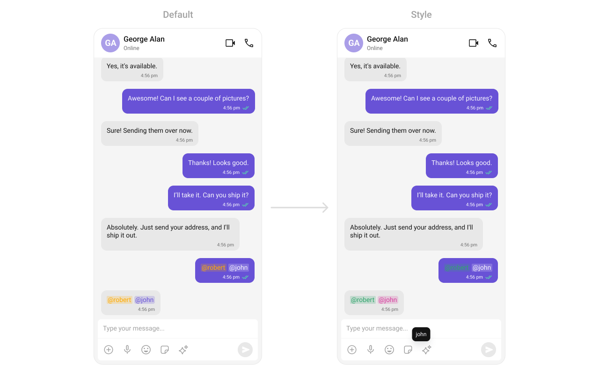
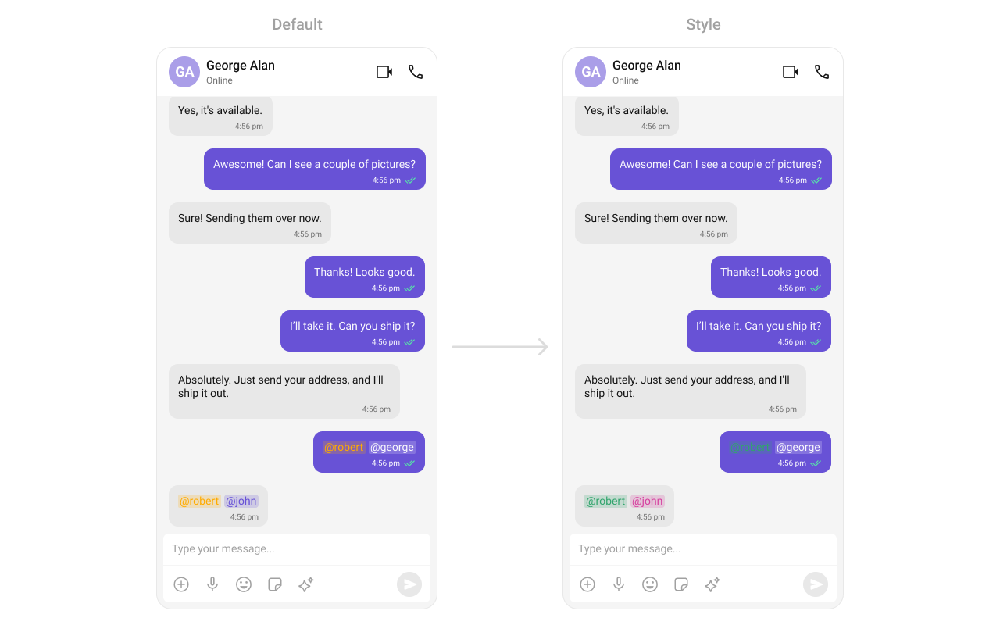

import Tabs from '@theme/Tabs';
import TabItem from '@theme/TabItem';

## Overview

The `CometChatMentionsFormatter` class is a part of the CometChat UI Kit, a ready-to-use chat UI component library for integrating CometChat into your Android applications. This class provides functionality to format mentions within text messages displayed in the chat interface. Mentions allow users to reference other users within a conversation, providing a convenient way to direct messages or involve specific participants.

## Features

- **Mention Formatting**: Automatically formats mentions within text messages based on provided styles and settings.
- **Customizable Styles**: Allows customization of text styles for mentions, including colors, fonts, and background colors.
- **User and Group Member Mentions**: Supports mentions for both individual users and group members, providing flexibility in communication scenarios.
- **Mention List Generation**: Generates a list of suggested mentions based on user input, facilitating easy selection of recipients during message composition.
- **Mention Click Handling**: Provides a listener interface for handling click events on mentions, enabling custom actions to be performed when a mention is tapped by the user.

## Usage

To integrate the `CometChatMentionsFormatter` class into your application:

1. **Initialization**: Create an instance of the `CometChatMentionsFormatter` class and configure it with desired settings, such as mention text styles and limit settings.
2. **Set Mention Listeners**: Set listeners for handling mention click events (`setOnMentionClick`).

3. **Format Messages**: Use the `prepareLeftMessageBubbleSpan`, `prepareRightMessageBubbleSpan`, `prepareComposerSpan`, and `prepareConversationSpan` methods to format text messages with mentions appropriately for display in the chat interface.

4. **Customization**: Customize the appearance and behavior of mentions by adjusting the text styles, colors, and other formatting properties as needed.

Below is an example demonstrating how to use the `CometChatMentionsFormatter` class in components such as [CometChatConversations](../05-Components/02-conversations.md#settextformatters), [CometChatMessageList](../05-Components/07-message-list.md#settextformatters), [CometChatMessageComposer](../05-Components/08-message-composer.md#settextformatters).

<Tabs>
<TabItem value="java" label="Java">

```java
// Initialize CometChatMentionsFormatter
CometChatMentionsFormatter mentionFormatter = new CometChatMentionsFormatter(requireContext());


List<CometChatTextFormatter> textFormatters = new ArrayList<>();
textFormatters.add(mentionFormatter);
// This can be passed as an array of formatter in CometChatConversations, MessageList or Message Composer by using setTextFormatters method.
```

</TabItem>

<TabItem value="kotlin" label="Kotlin">

```kotlin
 // Initialize CometChatMentionsFormatter
 val mentionFormatter = CometChatMentionsFormatter(this)

val textFormatters: MutableList<CometChatTextFormatter> = ArrayList()
textFormatters.add(mentionFormatter)
// This can be passed as an array of formatter in CometChatConversations, MessageList or Message Composer by using setTextFormatters method.
```

</TabItem>
</Tabs>

## Actions

Actions dictate how a component functions. They are divided into two types: Predefined and User-defined. You can override either type, allowing you to tailor the behavior of the component to fit your specific needs.

##### setOnMentionClick

Setting a listener for mention-click events in Message Bubbles enhances interactivity within the chat. This listener is activated when a mention is clicked, returning the corresponding user object. This feature transforms mentions into interactive links, enabling more in-depth and contextual engagement with the user associated with the clicked mention.

**Example**


<Tabs>
<TabItem value="java" label="Java">

    ```Java

// Initialize CometChatMentionsFormatter
CometChatMentionsFormatter mentionFormatter = new CometChatMentionsFormatter(context);

    // set callback for the mention click

      mentionFormatter.setOnMentionClick((context, user) -> {
            Toast.makeText(context, user.getName(), Toast.LENGTH_SHORT).show();
      });

// This can be passed as an array of formatter in CometChatMessageComposer by using setTextFormatters method.
List<CometChatTextFormatter> textFormatters = new ArrayList<>();
textFormatters.add(mentionFormatter);
messageComposer.setTextFormatters(textFormatters);

````

</TabItem>

<TabItem value="kotlin" label="Kotlin">

    ```kotlin

// Initialize CometChatMentionsFormatter
val mentionFormatter = CometChatMentionsFormatter(context)

    // set callback for the mention click

    mentionFormatter.setOnMentionClick { context, user ->
    Toast.makeText(context, user.name, Toast.LENGTH_SHORT).show()
    }

// This can be passed as an array of formatter in CometChatMessageComposer by using setTextFormatters method.
val textFormatters: MutableList<CometChatTextFormatter> = ArrayList()
textFormatters.add(mentionFormatter)
messageComposer.setTextFormatters(textFormatters)

    ```

</TabItem>

</Tabs>

## Customization

| Methods                            | Description                                                       | Code                                                                                                                 |
| ---------------------------------- | ----------------------------------------------------------------- | -------------------------------------------------------------------------------------------------------------------- |
| **setMentionLimit**              | Sets the limit for the number of mentions allowed.                | `setMentionLimit(int limit)`                                                                                         |
| **setGroupMembersRequestBuilder** | Sets the builder for fetching group members.                      | `.setGroupMembersRequestBuilder(group -> new GroupMembersRequest.GroupMembersRequestBuilder(group.getGuid()));`      |
| **setUsersRequestBuilder**        | Sets the builder for fetching users.                              | `.setUsersRequestBuilder(new UsersRequest.UsersRequestBuilder().friendsOnly(true));`                                 |
| **setMentionsType**          | Supports two types of mentions: `USERS` and `USERS_AND_GROUP_MEMBERS`. If set to `USERS`, only users can be mentioned in both one-on-one and group conversations. If set to `USERS_AND_GROUP_MEMBERS`, members of a specific group can be mentioned in group chats, while all users can be mentioned in one-on-one chats. | `.setMentionsType(UIKitConstants.MentionsType.USERS_AND_GROUP_MEMBERS)`                                                 |
| **setMentionsVisibility**          |This method allows you to set the scope of mentions visibility within the app, choosing from `USERS_CONVERSATION_ONLY`, `GROUP_CONVERSATION_ONLY`, or `BOTH`. It lets you specify whether mentions are visible only in one-on-one conversations, only in group conversations, or in both.| `.setMentionsVisibility(UIKitConstants.MentionsVisibility.BOTH);`                                                 |
| **setOnMentionClick**             | Sets a listener for mention click in Message Bubbles events.      | `mentionFormatter.setOnMentionClick((context, user) -> {` <br></br> `// Add your implementation here` <br></br>`});` |

## Advance

For advanced-level customization, you can set the style of the Mentions formatters. This lets you tailor each aspect of the component to fit your exact needs and application aesthetics. You can create and define your formatters style.

### Composer Mention Text Style

Assigns the list of text formatters. If the provided list is not null, it sets the list. Otherwise, it assigns the default text formatters retrieved from the data source. To configure the existing Mentions look and feel for [CometChatMessageComposer](../05-Components//08-message-composer.md) refer to the below code snippet

**Example**


```xml title="themes.xml"

<style name="CustomMessageComposerMentionsStyle" parent="CometChatMessageComposerMentionsStyle">
    <item name="cometchatMentionTextAppearance">?attr/cometchatTextAppearanceBodyRegular</item>
    <item name="cometchatMentionTextColor">#000000</item>
    <item name="cometchatMentionBackgroundColor">#000000</item>
    <item name="cometchatSelfMentionTextColor">#30A46C</item>
    <item name="cometchatSelfMentionTextAppearance">?attr/cometchatTextAppearanceBodyRegular</item>
    <item name="cometchatSelfMentionBackgroundColor">#30A46C</item>
</style>

```

<Tabs>
<TabItem value="java" label="Java">

```Java
// Initialize CometChatMentionsFormatter
CometChatMentionsFormatter mentionFormatter = new CometChatMentionsFormatter(context);

// set style to customize composer mention text
mentionFormatter.setMessageComposerMentionTextStyle(context, R.style.CustomMessageComposerMentionsStyle);

// This can be passed as an array of formatter in CometChatMessageComposer by using setTextFormatters method.
List<CometChatTextFormatter> textFormatters = new ArrayList<>();
textFormatters.add(mentionFormatter);
messageComposer.setTextFormatters(textFormatters);
````

</TabItem>

<TabItem value="kotlin" label="Kotlin">

```kotlin
// Initialize CometChatMentionsFormatter
val mentionFormatter = CometChatMentionsFormatter(context)
// set style to customize composer mention text
mentionFormatter.setMessageComposerMentionTextStyle(context, R.style.CustomMessageComposerMentionsStyle)

// This can be passed as an array of formatter in CometChatMessageComposer by using setTextFormatters method.
val textFormatters: MutableList<CometChatTextFormatter> = ArrayList()
textFormatters.add(mentionFormatter)
messageComposer.setTextFormatters(textFormatters)

```

</TabItem>

</Tabs>

### Message Bubble Mention Text Style

Assigns the list of text formatters. If the provided list is not null, it sets the list. Otherwise, it assigns the default text formatters retrieved from the data source. To configure the existing Mentions look and feel for [CometChatMessageList](../05-Components/07-message-list.md)

**Example**


```xml title="themes.xml"
<style name="CustomIncomingMessageBubbleMentionStyle" parent="CometChatIncomingBubbleMentionsStyle">
    <item name="cometchatMentionTextAppearance">?attr/cometchatTextAppearanceBodyRegular</item>
    <item name="cometchatMentionTextColor">#D6409F</item>
    <item name="cometchatMentionBackgroundColor">#D6409F</item>
    <item name="cometchatSelfMentionTextColor">#30A46C</item>
    <item name="cometchatSelfMentionTextAppearance">?attr/cometchatTextAppearanceBodyRegular</item>
    <item name="cometchatSelfMentionBackgroundColor">#30A46C</item>
</style>

<style name="CustomOutgoingMessageBubbleMentionStyle" parent="CometChatOutgoingBubbleMentionsStyle">
    <item name="cometchatMentionTextAppearance">?attr/cometchatTextAppearanceBodyRegular</item>
    <item name="cometchatMentionTextColor">#FFFFFF</item>
    <item name="cometchatMentionBackgroundColor">#F9F8FD</item>
    <item name="cometchatSelfMentionTextColor">#30A46C</item>
    <item name="cometchatSelfMentionTextAppearance">?attr/cometchatTextAppearanceBodyRegular</item>
    <item name="cometchatSelfMentionBackgroundColor">#30A46C</item>
</style>

```

<Tabs>

<TabItem value="java" label="Java">

```Java
// Initialize CometChatMentionsFormatter
CometChatMentionsFormatter mentionFormatter = new CometChatMentionsFormatter(context);

//set style to customize bubble mention text
mentionFormatter.setOutgoingBubbleMentionTextStyle(context, R.style.CustomOutgoingMessageBubbleMentionStyle);

mentionFormatter.setIncomingBubbleMentionTextStyle(context, R.style.CustomIncomingMessageBubbleMentionStyle);

// This can be passed as an array of formatter in CometChatMessageList by using setTextFormatters method.
List<CometChatTextFormatter> textFormatters = new ArrayList<>();
textFormatters.add(mentionFormatter);
messageList.setTextFormatters(textFormatters);

````

</TabItem>

<TabItem value="kotlin" label="Kotlin">

```kotlin

// Initialize CometChatMentionsFormatter
val mentionFormatter = CometChatMentionsFormatter(context)

//set style to customize bubble mention text
mentionFormatter.setOutgoingBubbleMentionTextStyle(context, R.style.CustomOutgoingMessageBubbleMentionStyle)

mentionFormatter.setIncomingBubbleMentionTextStyle(context, R.style.CustomIncomingMessageBubbleMentionStyle)

// This can be passed as an array of formatter in CometChatMessageList by using setTextFormatters method.
val textFormatters: MutableList<CometChatTextFormatter> = ArrayList()
textFormatters.add(mentionFormatter)
messageList.setTextFormatters(textFormatters)

 ```

</TabItem>

</Tabs>

### Conversations Mention Text Style

Assigns the list of text formatters. If the provided list is not null, it sets the list. Otherwise, it assigns the default text formatters retrieved from the data source. To configure the existing Mentions look and feel for [CometChatConversations](../05-Components/02-conversations.md)

**Example**


```xml title="themes.xml"
<style name="CustomConversationsMentionsStyle" parent="CometChatConversationsMentionsStyle">
    <item name="cometchatMentionTextAppearance">?attr/cometchatTextAppearanceBodyRegular</item>
    <item name="cometchatMentionTextColor">#D6409F</item>
    <item name="cometchatMentionBackgroundColor">#D6409F</item>
    <item name="cometchatSelfMentionTextColor">#30A46C</item>
    <item name="cometchatSelfMentionTextAppearance">?attr/cometchatTextAppearanceBodyRegular</item>
    <item name="cometchatSelfMentionBackgroundColor">#30A46C</item>
</style>
```

<Tabs>

<TabItem value="java" label="Java">

```Java

// Initialize CometChatMentionsFormatter
CometChatMentionsFormatter mentionFormatter = new CometChatMentionsFormatter(context);

//set style to customize conversation mention text
mentionFormatter.setConversationsMentionTextStyle(context, R.style.CustomConversationsMentionsStyle);

// This can be passed as an array of formatter in CometChatConversations by using setTextFormatters method.
List<CometChatTextFormatter> textFormatters = new ArrayList<>();
textFormatters.add(mentionFormatter);
cometChatConversations.setTextFormatters(textFormatters);
````

</TabItem>

<TabItem value="kotlin" label="Kotlin">

    ```kotlin

// Initialize CometChatMentionsFormatter
val mentionFormatter = CometChatMentionsFormatter(context)
//set style to customize conversation mention text
mentionFormatter.setConversationsMentionTextStyle(context, R.style.CustomConversationsMentionsStyle)

// This can be passed as an array of formatter in CometChatConversations by using setTextFormatters method.
val textFormatters: MutableList<CometChatTextFormatter> = ArrayList()
textFormatters.add(mentionFormatter)
cometChatConversations.setTextFormatters(textFormatters)

```

</TabItem>

</Tabs>
