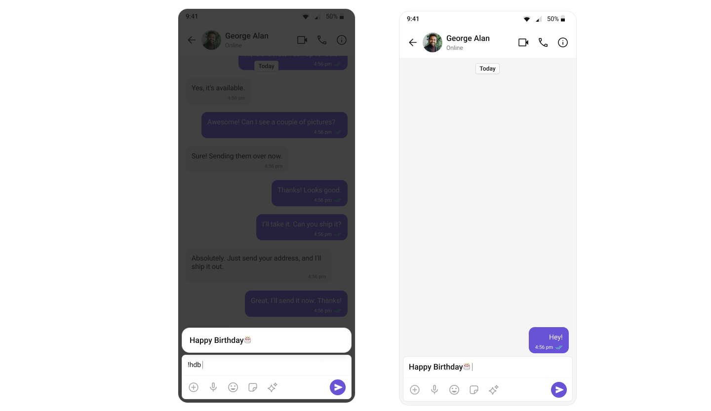

import Tabs from '@theme/Tabs';
import TabItem from '@theme/TabItem';

## Introduction

The ShortCutFormatter class extends the CometChatTextFormatter class to provide a mechanism for handling shortcuts within messages. This guide will walk you through the process of using ShortCutFormatter to implement shortcut extensions in your CometChat application.

## Setup

1. **Create the ShortCutFormatter Class**: Define the `ShortCutFormatter` class by extending the `CometChatTextFormatter` class.

<Tabs>
<TabItem value="java" label="Java">
  ```java
    public class ShortCutFormatter extends CometChatTextFormatter {
        // Class implementation
    private HashMap<String, String> messageShortcuts;
    private List<SuggestionItem> shortcuts;
    }
    ```
</TabItem>

<TabItem value="kotlin" label="Kotlin">

```kotlin
class ShortCutFormatterKotlin : CometChatTextFormatter('!') {
    // Class implementation
    private val messageShortcuts: HashMap<String, String> = HashMap()
    private val shortcuts: MutableList<SuggestionItem> = ArrayList()
}
```

</TabItem>
</Tabs>

2. **Constructor**: Initialize the `messageShortcuts` map and `shortcuts` list in the constructor.

<Tabs>
<TabItem value="java" label="Java">

```java
 public ShortCutFormatter() {
     super('!');
     messageShortcuts = new HashMap<>();
     prepareShortCuts();
     shortcuts = new ArrayList<>();
 }
```

</TabItem>

<TabItem value="kotlin" label="Kotlin">

```kotlin
  init {
        prepareShortCuts()
    }
```

</TabItem>
</Tabs>

3. **Prepare Shortcuts**: Implement the `prepareShortCuts()` method to fetch shortcuts from the server using CometChat extension.

<Tabs>
<TabItem value="java" label="Java">
      ```java
    private void prepareShortCuts() {
        // Implementation to fetch shortcuts from server
        CometChat.callExtension("message-shortcuts", "GET", "/v1/fetch", null, new CometChat.CallbackListener<JSONObject>() {
            @Override
            public void onSuccess(JSONObject responseObject) {

                Iterator<String> keysItr;
                try {
                    JSONObject shortcutObject = responseObject.getJSONObject("data").getJSONObject("shortcuts");
                    keysItr = shortcutObject.keys();

                    while (keysItr.hasNext()) {
                        String key = keysItr.next();
                        String value = shortcutObject.getString(key);
                        messageShortcuts.put(key, value);
                    }
                } catch (JSONException e) {
                    e.printStackTrace();
                }
            }

            @Override
            public void onError(CometChatException e) {
            }
        });
    }
    ```

</TabItem>

<TabItem value="kotlin" label="Kotlin">

```kotlin
private fun prepareShortCuts() {
        CometChat.callExtension(
            "message-shortcuts",
            "GET",
            "/v1/fetch",
            null,
            object : CometChat.CallbackListener<JSONObject>() {
                override fun onSuccess(responseObject: JSONObject) {
                    try {
                        val shortcutObject =
                            responseObject.getJSONObject("data").getJSONObject("shortcuts")
                        val keysItr: Iterator<String> = shortcutObject.keys()

                        while (keysItr.hasNext()) {
                            val key = keysItr.next()
                            val value = shortcutObject.getString(key)
                            messageShortcuts[key] = value
                        }
                    } catch (e: JSONException) {
                        e.printStackTrace()
                    }
                }

                override fun onError(e: CometChatException) {}
            })
    }
```

</TabItem>
</Tabs>

4. **Override Search Method**: Override the `search()` method to search for shortcuts based on the entered query.

<Tabs>
<TabItem value="java" label="Java">
  
    ```java
    @Override
    public void search(@NonNull Context context, String queryString) {
        // Implementation to search for shortcuts
          String query = getTrackingCharacter() + queryString;
        shortcuts.clear();
        if (messageShortcuts.containsKey(query)) {
            SuggestionItem suggestionItem = new SuggestionItem("", query + "  =>  " + messageShortcuts.get(query), null, null, messageShortcuts.get(query), null, null);
            suggestionItem.setHideLeadingIcon(true);
            shortcuts.add(suggestionItem);
        }
        setSuggestionItemList(shortcuts);
    }
    ```
</TabItem>

<TabItem value="kotlin" label="Kotlin">

```kotlin
  override fun search(context: Context, queryString: String?) {
        val query = trackingCharacter.toString() + queryString
        shortcuts.clear()
        if (messageShortcuts.containsKey(query)) {
            val suggestionItem = SuggestionItem(
                "",
                "$query  =>  ${messageShortcuts[query]}",
                null,
                null,
                messageShortcuts[query],
                null,
                null
            )
            suggestionItem.isHideLeadingIcon = true
            shortcuts.add(suggestionItem)
        }
        suggestionItemList.value = shortcuts
    }
```

</TabItem>
</Tabs>

5. **Handle Scroll to Bottom**: Override the `onScrollToBottom()` method if needed.

<Tabs>
<TabItem value="java" label="Java">
   ```java
    @Override
    public void onScrollToBottom() {
        // Implementation if needed
    }
    ```
</TabItem>

<TabItem value="kotlin" label="Kotlin">

```kotlin
override fun onScrollToBottom() {
        TODO("Not yet implemented")
    }
```

</TabItem>
</Tabs>

## Usage

1. **Initialization**: Initialize an instance of `ShortCutFormatter` in your application.

<Tabs>
<TabItem value="java" label="Java">
     ```java
    ShortCutFormatter shortCutFormatter = new ShortCutFormatter();
    ```
</TabItem>

<TabItem value="kotlin" label="Kotlin">

```kotlin
 val shortCutFormatter = ShortCutFormatter()
```

</TabItem>
</Tabs>

2. **Integration**: Integrating the `ShortCutFormatter` into your CometChat application involves incorporating it within your project to handle message shortcuts. Use [MessageComposer](../05-Components/08-message-composer.md) component, you can seamlessly integrate the ShortCutFormatter to manage shortcut functionalities within your application.

<Tabs>
<TabItem value="xml" label="XML">
   ```xml
<com.cometchat.chatuikit.messagecomposer.CometChatMessageComposer
    android:id="@+id/composer"
    android:layout_width="match_parent"
    android:layout_height="match_parent" />
```
   </TabItem>
   </Tabs>

<Tabs>
<TabItem value="java" label="Java">
     ```java
    CometChatMessageComposer cometChatMessageComposer = findViewById(R.id.composer);

    List<CometChatTextFormatter> cometChatTextFormatters = CometChatUIKit.getDataSource().getTextFormatters(this);
    cometChatTextFormatters.add(new ShortCutFormatter());
    cometChatMessageComposer.setTextFormatters(cometChatTextFormatters);
    ```

</TabItem>

<TabItem value="kotlin" label="Kotlin">

```kotlin
val cometChatMessageComposer: CometChatMessageComposer =
            findViewById<CometChatMessageComposer>(R.id.composer)

val cometChatTextFormatters = CometChatUIKit.getDataSource().getTextFormatters(this)
cometChatTextFormatters.add(ShortCutFormatter())
cometChatMessageComposer.setTextFormatters(cometChatTextFormatters)
```

</TabItem>
</Tabs>

## Example


