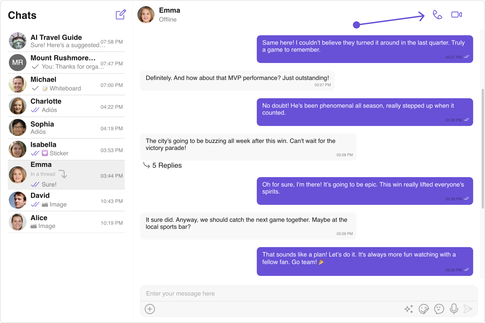
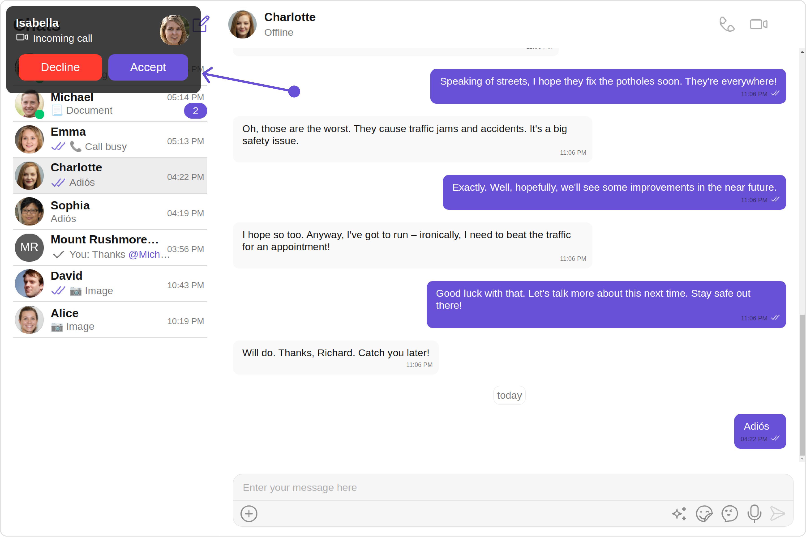
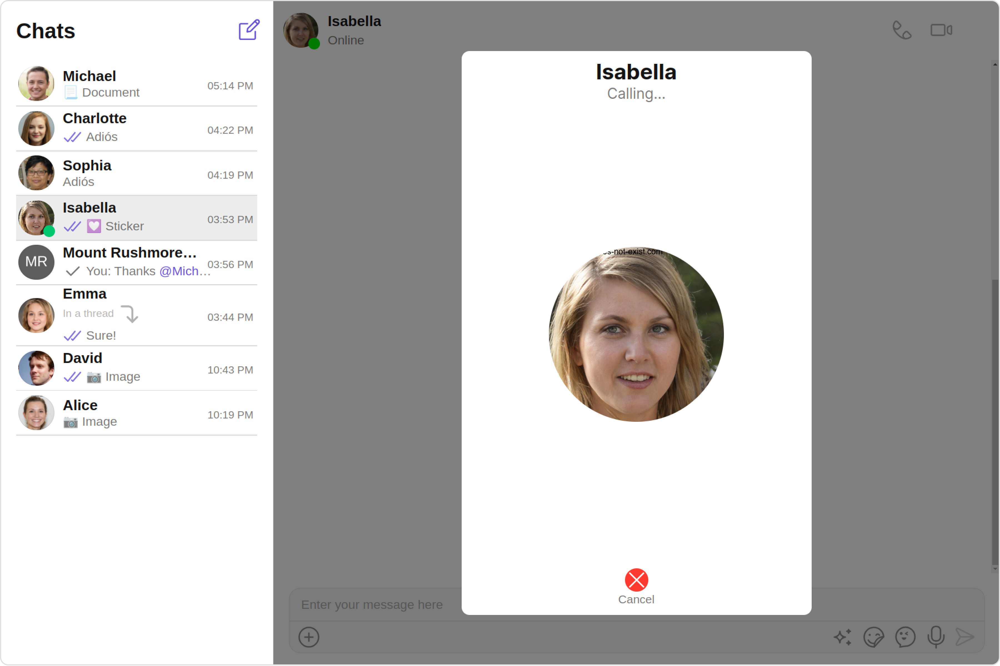
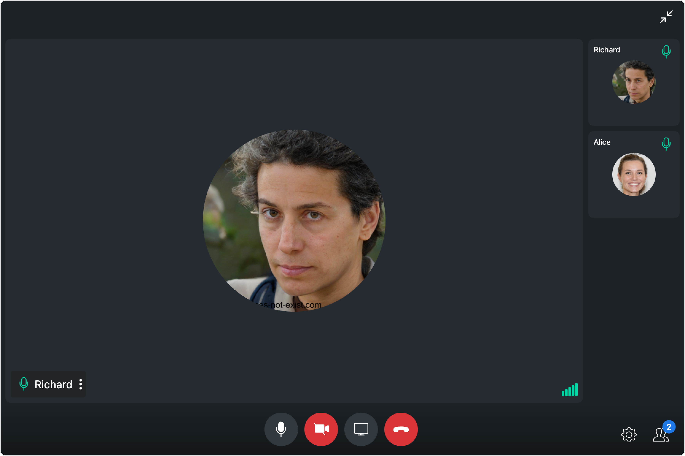
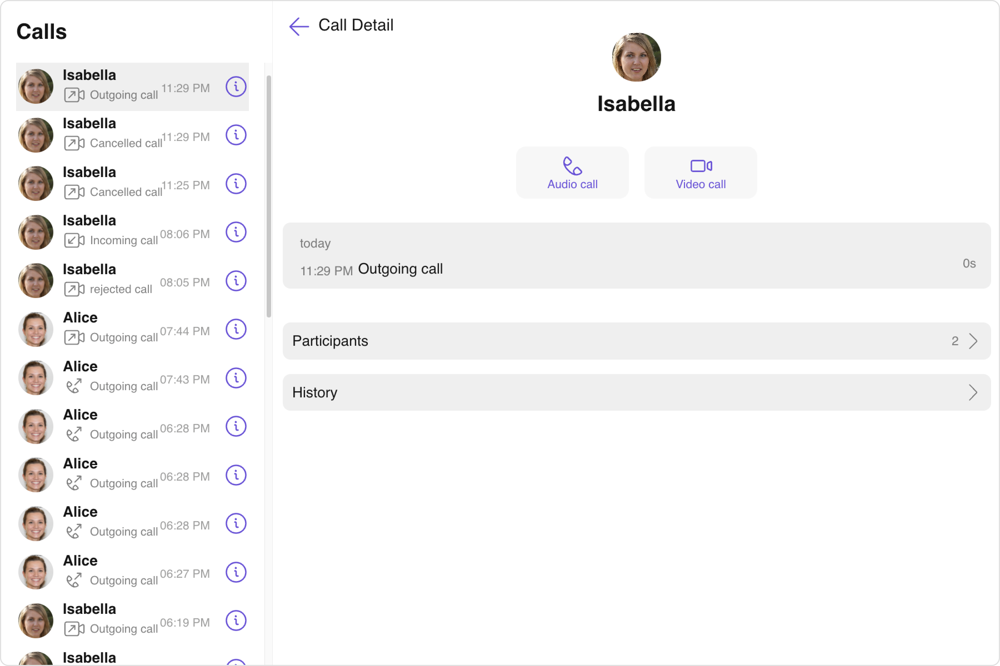

import Tabs from '@theme/Tabs';
import TabItem from '@theme/TabItem';

## Overview

CometChat's Calls feature is an advanced functionality that allows you to seamlessly integrate one-on-one as well as group audio and video calling capabilities into your application. This document provides a technical overview of these features, as implemented in the Angular UI Kit.

## Integration

First, make sure that you've correctly integrated the UI Kit library into your project. If you haven't done this yet or are facing difficulties, refer to our [Getting Started](/ui-kit/angular/getting-started) guide. This guide will walk you through a step-by-step process of integrating our UI Kit into your Angular project.

Once you've successfully integrated the UI Kit, the next step is to add the CometChat Calls SDK to your project. This is necessary to enable the calling features in the UI Kit. Here's how you do it:

Add the SDK files to your project's dependencies or libraries:

```
npm install @cometchat/calls-sdk-javascript
```

After adding this dependency, the Angular UI Kit will automatically detect it and activate the calling features. Now, your application supports both audio and video calling. You will see [CallButtons](/ui-kit/angular/call-buttons) component rendered in [MessageHeader](/ui-kit/angular/message-header) Component.



## Features

### Incoming Call

The [Incoming Call](/ui-kit/angular/incoming-call) component of the CometChat UI Kit provides the functionality that lets users receive real-time audio and video calls in the app.

When a call is made to a user, the Incoming Call component triggers and displays a call screen. This call screen typically displays the caller information and provides the user with options to either accept or reject the incoming call.



### Outgoing Call

The [Outgoing Call](/ui-kit/angular/outgoing-call) component of the CometChat UI Kit is designed to manage the outgoing call process within your application. When a user initiates an audio or video call to another user or group, this component displays an outgoing call screen, showcasing information about the recipient and the call status.

Importantly, the Outgoing Call component is smartly designed to transition automatically into the ongoing call screen once the receiver accepts the call. This ensures a smooth flow from initiating the call to engaging in a conversation, without any additional steps required from the user.



### Ongoing Call

The [OngoingCall](/ui-kit/angular/ongoing-call) component is the user interface that displays during an ongoing call. For an audio call, this screen displays the participant's name, call duration, and buttons to mute the audio, enable or disable video, switch the camera, and end the call.

For a video call, the Call Screen might additionally display the video footage from both the user's camera and the recipient's camera.



### Call Logs

[Call Logs](/ui-kit/angular/call-logs) component provides you with the records call events such as who called who, the time of the call, and the duration of the call. This information can be fetched from the CometChat server and displayed in a structured format for users to view their past call activities.


