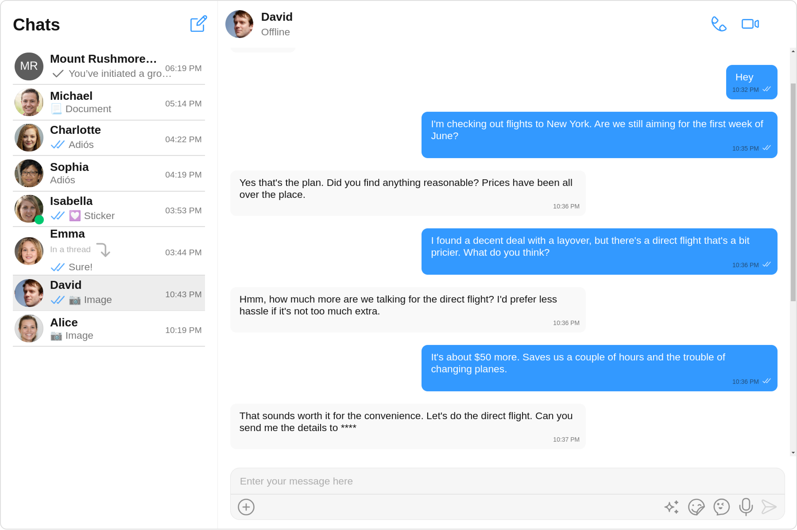
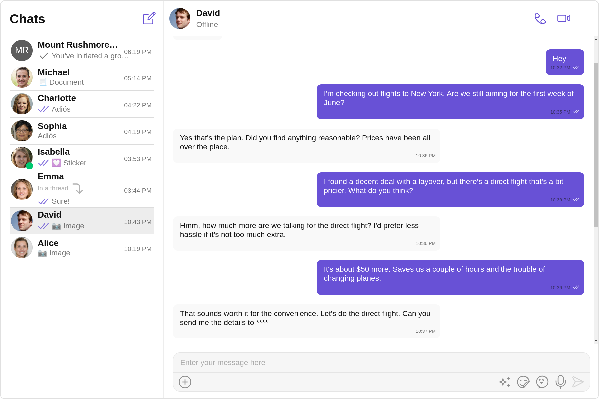
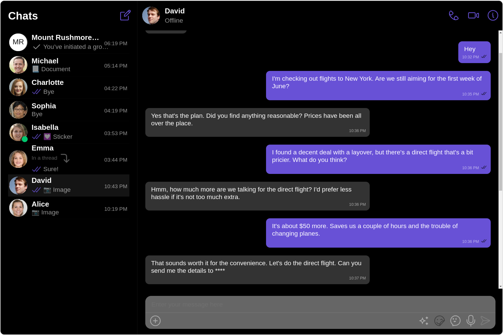
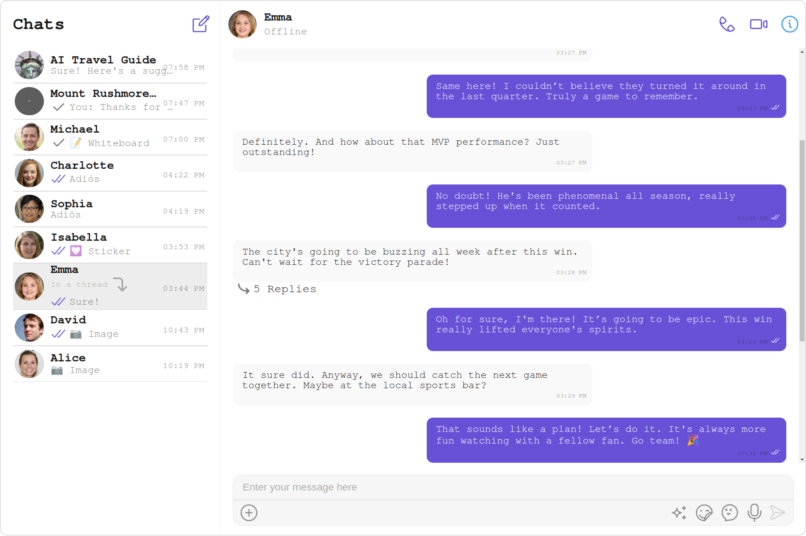

import Tabs from '@theme/Tabs';
import TabItem from '@theme/TabItem';

## Overview

The Theme is a style applied to every component of CometChat. When a style is applied as a theme, every view in the activity or every component in the UiKit will apply each property of the theme that it supports.

`CometChatTheme` class comprises two key components: `Palette` and `Typography`.

**Palette**: The palette represents a collection of colors used throughout your application. It typically includes colors for various elements such as backgrounds, text, primary and secondary buttons, error messages, and accent colors. You can define a palette object containing these colors and use it to maintain consistency in your application's visual appearance.

**Typography**: Typography refers to the visual appearance of text in your application. It includes properties such as font size, font family, font weight, line height, and letter spacing. You can define a typography object containing these properties and use it to ensure consistent text styling across your application.

## Usage

### **Palette**

The CometChat UI kit provides an easy way to customize the visual appearance of your chat application via the `CometChatPalette` class. This class contains several methods that allow you to modify the default color scheme of your app, imparting a unique look and feel that aligns with your branding or design guidelines.

Here's an overview of the different methods available in the Palette class:

| Method                                   | Description                                        |
| ---------------------------------------- | -------------------------------------------------- |
| **setMode(mode: string)**                | Set the mode for the palette (e.g., light or dark) |
| **setBackground(colorset: PaletteItem)** | Set the background color                           |
| **setPrimary(colorset: PaletteItem)**    | Set the primary color                              |
| **setPrimary150(colorset: PaletteItem)** | Set the primary 150 color                          |
| **setPrimary500(colorset: PaletteItem)** | Set the primary 500 color                          |
| **setSecondary(colorset: PaletteItem)**  | Set the secondary color                            |
| **setError(colorset: PaletteItem)**      | Set the error color                                |
| **setAccent(colorset: PaletteItem)**     | Set the accent color                               |
| **setAccent50(colorset?: PaletteItem)**  | Set the accent 50 color                            |
| **setAccent100(colorset: PaletteItem)**  | Set the accent 100 color                           |
| **setAccent200(colorset: PaletteItem)**  | Set the accent 200 color                           |
| **setAccent300(colorset: PaletteItem)**  | Set the accent 300 color                           |
| **setAccent400(colorset: PaletteItem)**  | Set the accent 400 color                           |
| **setAccent500(colorset: PaletteItem)**  | Set the accent 500 color                           |
| **setAccent600(colorset: PaletteItem)**  | Set the accent 600 color                           |
| **setAccent700(colorset: PaletteItem)**  | Set the accent 700 color                           |
| **setAccent800(colorset: PaletteItem)**  | Set the accent 800 color                           |
| **setAccent900(colorset: PaletteItem)**  | Set the accent 900 color                           |
| **setTertiary(colorset: PaletteItem)**   | Set the tertiary color                             |

**Example**

To match the theme of your app you will need to set primary , secondary and accent color using Pallate.

**Default**


**Custom Theme**


<Tabs>

<TabItem value="typescript" label="app.component.ts">

```javascript

import { Component, OnInit } from '@angular/core';
import {  CometChatThemeService, CometChatUIKit } from '@cometchat/chat-uikit-angular';
@Component({
  selector: 'app-root',
  templateUrl: './app.component.html',
  styleUrls: ['./app.component.css']
})
export class AppComponent implements OnInit{
  ngOnInit(): void {

  }

  title = 'angular-app';
  constructor(private themeService:CometChatThemeService) {
    themeService.theme.palette.setMode("light")
    themeService.theme.palette.setPrimary({ light: "#6851D6", dark: "#6851D6" })
  }

  onLogin(UID?: any) {
    CometChatUIKit.login({ uid: UID }).then(
      (user) => {
        setTimeout(() => {
          window.location.reload();
        }, 1000);
      },
      (error) => {
        console.log("Login failed with exception:", { error });
      }
    );
  }
}

```

</TabItem>

</Tabs>

Switching between Light and Dark modes in CometChat is quite simple by manipulating the mode property of the Palette class.

**Light Mode**


**Dark Mode**


<Tabs>

<TabItem value="typescript" label="App.component.ts">

```javascript
themeService.theme.palette.setMode("dark");
```

</TabItem>

</Tabs>

### **Typography**

The typography class in CometChat UI kit allows you to customize the text appearance throughout your chat application. It provides methods to define font families, font sizes, font weights etc.

Here are some of the methods provided by the Typography class:

| Method                                                | Description                           |
| ----------------------------------------------------- | ------------------------------------- |
| **setFontFamily(fontFamily: string)**                 | Set the font family for text elements |
| **setFontWeightRegular(fontWeightRegular: string)**   | Set the font weight for regular text  |
| **setFontWeightMedium(fontWeightMedium: string)**     | Set the font weight for medium text   |
| **setFontWeightSemibold(fontWeightSemibold: string)** | Set the font weight for semibold text |
| **setFontWeightBold(fontWeightBold: string)**         | Set the font weight for bold text     |
| **setHeading(headingFont: CometChatFont)**            | Set the font for heading elements     |
| **setName(nameFont: CometChatFont)**                  | Set the font for name elements        |
| **setTitle1(titleFont: CometChatFont)**               | Set the font for title1 elements      |
| **setTitle2(titleFont: CometChatFont)**               | Set the font for title2 elements      |
| **setSubtitle1(subtitleFont: CometChatFont)**         | Set the font for subtitle1 elements   |
| **setSubtitle2(subtitleFont: CometChatFont)**         | Set the font for subtitle2 elements   |
| **setText1(textFont: CometChatFont)**                 | Set the font for text1 elements       |
| **setText2(textFont: CometChatFont)**                 | Set the font for text2 elements       |
| **setText3(textFont: CometChatFont)**                 | Set the font for text3 elements       |
| **setCaption1(captionFont: CometChatFont)**           | Set the font for caption1 elements    |
| **setCaption2(captionFont: CometChatFont)**           | Set the font for caption2 elements    |
| **setCaption3(captionFont: CometChatFont)**           | Set the font for caption3 elements    |

To change Name TextStyle of the UiKit Theme Please refer to the code below :

<Tabs>

<TabItem value="javascript" label="App.tsx">

```javascript
themeService.theme.typography.setFontFamily("FreeMono, monospace");
```

</TabItem>

</Tabs>



:::info

similarly to change other Text Style of Theme you can refer to the above mentioned method.

:::
