import Tabs from '@theme/Tabs';
import TabItem from '@theme/TabItem';

## Overview

The Conversations is a [Component](/ui-kit/angular/components-overview#components), That shows all conversations related to the currently logged-in user,

This component lists the most recent or latest conversations or contacts with whom you have exchanged messages. It provides a convenient way to quickly access and resume conversations with the people you have been in contact with recently.


## Usage

### Integration

<Tabs>
<TabItem value="js" label="app.module.ts">

```javascript
import { CUSTOM_ELEMENTS_SCHEMA, NgModule } from "@angular/core";
import { BrowserModule } from "@angular/platform-browser";
import { CometChatConversations } from "@cometchat/chat-uikit-angular";
import { AppComponent } from "./app.component";

@NgModule({
  imports: [BrowserModule, CometChatConversations],
  declarations: [AppComponent],
  providers: [],
  bootstrap: [AppComponent],
  schemas: [CUSTOM_ELEMENTS_SCHEMA],
})
export class AppModule {}
```

</TabItem>
<TabItem value="app.component.ts" label="app.component.ts">

```javascript
import { Component, OnInit } from '@angular/core';
import {  CometChatThemeService, CometChatUIKit } from '@cometchat/chat-uikit-angular';
import "@cometchat/uikit-elements";

@Component({
  selector: 'app-root',
  templateUrl: './app.component.html',
  styleUrls: ['./app.component.css']
})
export class AppComponent implements OnInit{
  ngOnInit(): void {

  }

  title = 'angular-app';
  constructor(private themeService:CometChatThemeService) {
    themeService.theme.palette.setMode("light")
    themeService.theme.palette.setPrimary({ light: "#6851D6", dark: "#6851D6" })
  }

  onLogin(UID?: any) {
    CometChatUIKit.login({ uid: UID }).then(
      (user) => {
        setTimeout(() => {
          window.location.reload();
        }, 1000);
      },
      (error) => {
        console.log("Login failed with exception:", { error });
      }
    );
  }
}
```

</TabItem>
<TabItem value="ts" label="app.component.html">

```html
<div class="fullwidth">
  <cometchat-conversations></cometchat-conversations>
</div>
```

</TabItem>
</Tabs>

### Actions

[Actions](/ui-kit/angular/components-overview#actions) dictate how a component functions. They are divided into two types: Predefined and User-defined. You can override either type, allowing you to tailor the behavior of the component to fit your specific needs.

##### 1. OnItemClick

`OnItemClick` is triggered when you click on a ListItem of the Conversations component.
The `OnItemClick` action doesn't have a predefined behavior. You can override this action using the following code snippet.

<Tabs>
<TabItem value="app.component.ts" label="app.component.ts">

```javascript
import { Component, OnInit } from '@angular/core';
import {  CometChatThemeService, CometChatUIKit } from '@cometchat/chat-uikit-angular';
import "@cometchat/uikit-elements";

@Component({
  selector: 'app-root',
  templateUrl: './app.component.html',
  styleUrls: ['./app.component.css']
})
export class AppComponent implements OnInit{

  title = 'angular-app';
  constructor(private themeService:CometChatThemeService) {
    themeService.theme.palette.setMode("light")
    themeService.theme.palette.setPrimary({ light: "#6851D6", dark: "#6851D6" })
  }

  public handleOnItemClick = (conversations: CometChat.Conversation) : void =>{
    console.log("your custom on item click action", conversations);
  };


  onLogin(UID?: any) {
    CometChatUIKit.login({ uid: UID }).then(
      (user) => {
        setTimeout(() => {
          window.location.reload();
        }, 1000);
      },
      (error) => {
        console.log("Login failed with exception:", { error });
      }
    );
  }
}
```

</TabItem>
<TabItem value="ts" label="app.component.html">

```html
<div class="fullwidth">
  <cometchat-conversations
    [onItemClick]="handleOnItemClick"
  ></cometchat-conversations>
</div>
```

</TabItem>
</Tabs>

---

##### 2. OnSelect

The `OnSelect` event is triggered upon the completion of a selection in `SelectionMode`. It does not have a default behavior. However, you can override its behavior using the following code snippet.

<Tabs>
<TabItem value="app.component.ts" label="app.component.ts">

```javascript
import { Component, OnInit } from '@angular/core';
import {  CometChatThemeService, CometChatUIKit } from '@cometchat/chat-uikit-angular';
import { SelectionMode } from '@cometchat/uikit-resources';
import "@cometchat/uikit-elements";

@Component({
  selector: 'app-root',
  templateUrl: './app.component.html',
  styleUrls: ['./app.component.css']
})
export class AppComponent implements OnInit{

  title = 'angular-doc-app';
  constructor(private themeService:CometChatThemeService) {
    themeService.theme.palette.setMode("light")
    themeService.theme.palette.setPrimary({ light: "#6851D6", dark: "#6851D6" })
  }

  public selectionMode : SelectionMode = SelectionMode.multiple;
  public handleOnSelect = (conversations: CometChat.Conversation, selected: boolean): void=>{
    console.log("Custom on select action", conversations, selected);
  }

  onLogin(UID?: any) {
    CometChatUIKit.login({ uid: UID }).then(
      (user) => {
        setTimeout(() => {
          window.location.reload();
        }, 1000);
      },
      (error) => {
        console.log("Login failed with exception:", { error });
      }
    );
  }
}
```

</TabItem>
<TabItem value="ts" label="app.component.html">

```html
<div class="fullwidth">
  <cometchat-conversations
    [selectionMode]="selectionMode"
    [onSelect]="handleOnSelect"
  ></cometchat-conversations>
</div>
```

</TabItem>
</Tabs>

---

##### 3. OnError

This action doesn't change the behavior of the component but rather listens for any errors that occur in the Conversations component.

<Tabs>
<TabItem value="app.component.ts" label="app.component.ts">

```javascript
import { Component, OnInit } from '@angular/core';
import {  CometChatThemeService, CometChatUIKit } from '@cometchat/chat-uikit-angular';
import "@cometchat/uikit-elements";

@Component({
  selector: 'app-root',
  templateUrl: './app.component.html',
  styleUrls: ['./app.component.css']
})
export class AppComponent implements OnInit{

  title = 'angular-app';
  constructor(private themeService:CometChatThemeService) {
    themeService.theme.palette.setMode("light")
    themeService.theme.palette.setPrimary({ light: "#6851D6", dark: "#6851D6" })
  }

  public handleOnError = (error: CometChat.CometChatException): void => {
      console.log("your custom on error action", error);
    }
  onLogin(UID?: any) {
    CometChatUIKit.login({ uid: UID }).then(
      (user) => {
        setTimeout(() => {
          window.location.reload();
        }, 1000);
      },
      (error) => {
        console.log("Login failed with exception:", { error });
      }
    );
  }
}
```

</TabItem>
<TabItem value="ts" label="app.component.html">

```html
<div class="fullwidth">
  <cometchat-conversations [onError]="handleOnError"></cometchat-conversations>
</div>
```

</TabItem>
</Tabs>

---

### Filters

You can set `ConversationsRequestBuilder` in the Conversations Component to filter the conversation list. You can modify the builder as per your specific requirements with multiple options available to know more refer to [ConversationRequestBuilder](/sdk/javascript/retrieve-conversations).

You can set filters using the following parameters.

1. **Conversation Type:** Filters on type of Conversation, `User` or `Groups`
1. **Limit:** Number of conversations fetched in a single request.
1. **WithTags:** Filter on fetching conversations containing tags
1. **Tags:** Filters on specific `Tag`
1. **UserTags:** Filters on specific User `Tag`
1. **GroupTags:** Filters on specific Group `Tag`

<Tabs>
<TabItem value="app.component.ts" label="app.component.ts">

```javascript
import { Component, Input, OnInit } from '@angular/core';
import { CometChat } from '@cometchat/chat-sdk-javascript';
import {  CometChatThemeService, CometChatUIKit } from '@cometchat/chat-uikit-angular';
import "@cometchat/uikit-elements";

@Component({
  selector: 'app-root',
  templateUrl: './app.component.html',
  styleUrls: ['./app.component.css']
})
export class AppComponent implements OnInit{
  ngOnInit(): void {

  }
  title = 'angular-app';
  constructor(private themeService:CometChatThemeService) {
    themeService.theme.palette.setMode("light")
    themeService.theme.palette.setPrimary({ light: "#6851D6", dark: "#6851D6" })
  }
 conversationsRequestBuilder: CometChat.ConversationsRequestBuilder = new CometChat.ConversationsRequestBuilder().setLimit(5)

  onLogin(UID?: any) {
    CometChatUIKit.login({ uid: UID }).then(
      (user) => {
        setTimeout(() => {
          window.location.reload();
        }, 1000);
      },
      (error) => {
        console.log("Login failed with exception:", { error });
      }
    );
  }
}
```

</TabItem>
<TabItem value="ts" label="app.component.html">

```html
<div class="fullwidth">
  <cometchat-conversations
    [conversationsRequestBuilder]="conversationsRequestBuilder"
  ></cometchat-conversations>
</div>
```

</TabItem>
</Tabs>

---

### Events

[Events](/ui-kit/angular/components-overview#events) are emitted by a `Component`. By using event you can extend existing functionality. Being global events, they can be applied in Multiple Locations and are capable of being Added or Removed.

<Tabs>

<TabItem value="js" label="Add Listener">

```javascript

public ccConversationDeleted!: Subscription;

ngOnInit(): void {
this.ccConversationDeleted =
CometChatConversationEvents.ccConversationDeleted.subscribe((conversation: CometChat.Conversation) => {
//your code
})}

```

</TabItem>

</Tabs>

---

<Tabs>

<TabItem value="js" label="Remove Listener">

```javascript

ngOnDestroy(): void {
this.ccConversationDeleted?.unsubscribe();
}

```

</TabItem>

</Tabs>

---

## Customization

To fit your app's design requirements, you can customize the appearance of the conversation component. We provide exposed methods that allow you to modify the experience and behavior according to your specific needs.

### Style

Using Style you can customize the look and feel of the component in your app, These parameters typically control elements such as the color, size, shape, and fonts used within the component.

##### 1. Conversation Style

You can set the `ConversationsStyle` to the `Conversations` Component to customize the styling.

---

<Tabs>
<TabItem value="app.component.ts" label="app.component.ts">

```javascript
import { Component, OnInit } from '@angular/core';
import {  CometChatThemeService, CometChatUIKit } from '@cometchat/chat-uikit-angular';
import {ConversationsStyle} from '@cometchat/uikit-shared';
import "@cometchat/uikit-elements";

@Component({
  selector: 'app-root',
  templateUrl: './app.component.html',
  styleUrls: ['./app.component.css']
})
export class AppComponent implements OnInit{
  ngOnInit(): void {

  }

  title = 'angular-app';
  constructor(private themeService:CometChatThemeService) {
    themeService.theme.palette.setMode("light")
    themeService.theme.palette.setPrimary({ light: "#6851D6", dark: "#6851D6" })
  }

  conversationsStyle:ConversationsStyle = new ConversationsStyle({
    width:'100%',
    height:'100%',
    border:'1px solid #ee7752',
    background:'linear-gradient(#ee7752, #e73c7e, #23a6d5, #23d5ab)'
})

  onLogin(UID?: any) {
    CometChatUIKit.login({ uid: UID }).then(
      (user) => {
        setTimeout(() => {
          window.location.reload();
        }, 1000);
      },
      (error) => {
        console.log("Login failed with exception:", { error });
      }
    );
  }
}
```

</TabItem>
<TabItem value="ts" label="app.component.html">

```html
<div class="fullwidth">
  <cometchat-conversations
    [conversationsStyle]="conversationsStyle"
  ></cometchat-conversations>
</div>
```

</TabItem>
</Tabs>

List of properties exposed by ConversationStyle

| Name                        | Description                                                                                                                                                                          |
| --------------------------- | ------------------------------------------------------------------------------------------------------------------------------------------------------------------------------------ |
| width                       | Sets the width of the component                                                                                                                                                      |
| height                      | Sets the height of the component                                                                                                                                                     |
| border                      | Sets the border of the component                                                                                                                                                     |
| borderRadius                | Sets the border radius of the component                                                                                                                                              |
| background                  | Sets all background style properties at once, such as color, image, origin and size, or repeat method. [Reference link](https://developer.mozilla.org/en-US/docs/Web/CSS/background) |
| boxShadow                   | Adds shadow effects around the component.                                                                                                                                            |
| titleTextFont               | Sets all the different properties of font for the heading text. [Reference link](https://developer.mozilla.org/en-US/docs/Web/CSS/font)                                              |
| titleTextColor              | Sets the foreground color of heading text.                                                                                                                                           |
| loadingIconTint             | Sets the tint or color applied to the loading indicator icon of the component                                                                                                        |
| emptyStateTextFont          | Sets all the different properties of font for the placeholder text. [Reference link](https://developer.mozilla.org/en-US/docs/Web/CSS/font)                                          |
| emptyStateTextColor         | Sets the foreground color of placeholder text displayed in the component.                                                                                                            |
| errorStateTextFont          | Sets all the different properties of font for the error message. [Reference link](https://developer.mozilla.org/en-US/docs/Web/CSS/font)                                             |
| errorStateTextColor         | Sets the foreground color of error message displayed in the component.                                                                                                               |
| lastMessageTextFont         | Sets all the different properties of font for the last message. [Reference link](https://developer.mozilla.org/en-US/docs/Web/CSS/font)                                              |
| lastMessageTextColor        | Sets the foreground color of the last message.                                                                                                                                       |
| typingIndictorTextFont      | Sets all the different properties of font for the typing indicator text. [Reference link](https://developer.mozilla.org/en-US/docs/Web/CSS/font)                                     |
| typingIndictorTextColor     | Sets the foreground color of typing indicator text                                                                                                                                   |
| threadIndicatorTextFont     | Sets all the different properties of font for the thread indicator text. [Reference link](https://developer.mozilla.org/en-US/docs/Web/CSS/font)                                     |
| threadIndicatorTextColor    | Sets the foreground color of thread indicator text.                                                                                                                                  |
| onlineStatusColor           | Sets the color of the status indicator representing the user's online status                                                                                                         |
| privateGroupIconBackground  | Sets the background of the status indicator representing private groups.                                                                                                             |
| passwordGroupIconBackground | Sets the background of the status indicator representing password protected groups.                                                                                                  |

##### 2. Avatar Style

To apply customized styles to the `Avatar` component in the `Conversations` Component, you can use the following code snippet. For more information, visit [Avatar Styles](/ui-kit/angular/avatar).

---

<Tabs>
<TabItem value="app.component.ts" label="app.component.ts">

```javascript
import { Component, OnInit } from '@angular/core';
import {  AvatarStyle, CometChatThemeService, CometChatUIKit } from '@cometchat/chat-uikit-angular';
import "@cometchat/uikit-elements";

@Component({
  selector: 'app-root',
  templateUrl: './app.component.html',
  styleUrls: ['./app.component.css']
})
export class AppComponent implements OnInit{
  ngOnInit(): void {

  }

  title = 'angular-app';
  constructor(private themeService:CometChatThemeService) {
    themeService.theme.palette.setMode("light")
    themeService.theme.palette.setPrimary({ light: "#6851D6", dark: "#6851D6" })
  }

  avatarStyle: AvatarStyle = new AvatarStyle({
    backgroundColor:'#ee7752',
    border:'2px solid red',
    nameTextColor:'yellow',
    backgroundSize:'15px'
  });

  onLogin(UID?: any) {
    CometChatUIKit.login({ uid: UID }).then(
      (user) => {
        setTimeout(() => {
          window.location.reload();
        }, 1000);
      },
      (error) => {
        console.log("Login failed with exception:", { error });
      }
    );
  }
}
```

</TabItem>
<TabItem value="ts" label="app.component.html">

```html
<div class="fullwidth">
  <cometchat-conversations
    [avatarStyle]="avatarStyle"
  ></cometchat-conversations>
</div>
```

</TabItem>
</Tabs>

##### 3. StatusIndicator Style

To apply customized styles to the Status Indicator component in the `Conversations` Component, you can use the following code snippet. For more information, visit [Status Indicator Styles](./status-indicator).

---

<Tabs>
<TabItem value="app.component.ts" label="app.component.ts">

```javascript
import { Component, OnInit } from '@angular/core';
import { CometChatThemeService, CometChatUIKit } from '@cometchat/chat-uikit-angular';
import "@cometchat/uikit-elements";

@Component({
  selector: 'app-root',
  templateUrl: './app.component.html',
  styleUrls: ['./app.component.css']
})
export class AppComponent implements OnInit{
  ngOnInit(): void {

  }

  title = 'angular-app';
  constructor(private themeService:CometChatThemeService) {
    themeService.theme.palette.setMode("light")
    themeService.theme.palette.setPrimary({ light: "#6851D6", dark: "#6851D6" })
  }

  statusIndicatorStyle: any = ({
    height:'20px',
    width:'20px',
    backgroundColor: 'red'
  });

  onLogin(UID?: any) {
    CometChatUIKit.login({ uid: UID }).then(
      (user) => {
        setTimeout(() => {
          window.location.reload();
        }, 1000);
      },
      (error) => {
        console.log("Login failed with exception:", { error });
      }
    );
  }
}
```

</TabItem>
<TabItem value="ts" label="app.component.html">

```html
<div class="fullwidth">
  <cometchat-conversations
    [statusIndicatorStyle]="statusIndicatorStyle"
  ></cometchat-conversations>
</div>
```

</TabItem>
</Tabs>

##### 4. Date Style

To apply customized styles to the `Date` component in the `Conversations` Component, you can use the following code snippet. For more information, visit [Date Styles](./date).

---

<Tabs>
<TabItem value="app.component.ts" label="app.component.ts">

```javascript
import { Component, OnInit } from '@angular/core';
import { CometChatThemeService, CometChatUIKit, DateStyle } from '@cometchat/chat-uikit-angular';
import "@cometchat/uikit-elements";

@Component({
  selector: 'app-root',
  templateUrl: './app.component.html',
  styleUrls: ['./app.component.css']
})
export class AppComponent implements OnInit{
  ngOnInit(): void {

  }

  title = 'angular-app';
  constructor(private themeService:CometChatThemeService) {
    themeService.theme.palette.setMode("light")
    themeService.theme.palette.setPrimary({ light: "#6851D6", dark: "#6851D6" })
  }

  dateStyle: DateStyle = new DateStyle({
    width:'100%',
    height:'100%',
    border:'1px solid pink',
    textColor:'green',
    background:'#ee7752'
  });

  onLogin(UID?: any) {
    CometChatUIKit.login({ uid: UID }).then(
      (user) => {
        setTimeout(() => {
          window.location.reload();
        }, 1000);
      },
      (error) => {
        console.log("Login failed with exception:", { error });
      }
    );
  }
}
```

</TabItem>
<TabItem value="ts" label="app.component.html">

```html
<div class="fullwidth">
  <cometchat-conversations [dateStyle]="dateStyle"></cometchat-conversations>
</div>
```

</TabItem>
</Tabs>

##### 5. Badge Style

To apply customized styles to the `Badge` component in the `Conversations` Component, you can use the following code snippet. For more information, visit [Badge Styles](./badge).

---

<Tabs>
<TabItem value="app.component.ts" label="app.component.ts">

```javascript
import { Component, OnInit } from '@angular/core';
import { CometChatThemeService, CometChatUIKit, BadgeStyle } from '@cometchat/chat-uikit-angular';
import "@cometchat/uikit-elements";

@Component({
  selector: 'app-root',
  templateUrl: './app.component.html',
  styleUrls: ['./app.component.css']
})
export class AppComponent implements OnInit{
  ngOnInit(): void {

  }

  title = 'angular-app';
  constructor(private themeService:CometChatThemeService) {
    themeService.theme.palette.setMode("light")
    themeService.theme.palette.setPrimary({ light: "#6851D6", dark: "#6851D6" })
  }

  badgeStyle: BadgeStyle = new BadgeStyle({
    background:'#ee7752',
    textColor:'yellow',
    border:'2px solid #9e54ff',
    borderRadius:'20px'
  });

  onLogin(UID?: any) {
    CometChatUIKit.login({ uid: UID }).then(
      (user) => {
        setTimeout(() => {
          window.location.reload();
        }, 1000);
      },
      (error) => {
        console.log("Login failed with exception:", { error });
      }
    );
  }
}
```

</TabItem>
<TabItem value="ts" label="app.component.html">

```html
<div class="fullwidth">
  <cometchat-conversations [badgeStyle]="badgeStyle"></cometchat-conversations>
</div>
```

</TabItem>
</Tabs>

##### 7. Backdrop Style

To apply customized styles to the `Backdrop` component in the `Conversations` Component, you can use the following code snippet, you can use the following code snippet. For more information, visit [Backdrop Styles](./backdrop).

---

<Tabs>
<TabItem value="app.component.ts" label="app.component.ts">

```javascript
import { Component, OnInit } from '@angular/core';
import { CometChatThemeService, CometChatUIKit, BackdropStyle } from '@cometchat/chat-uikit-angular';
import "@cometchat/uikit-elements";

@Component({
  selector: 'app-root',
  templateUrl: './app.component.html',
  styleUrls: ['./app.component.css']
})
export class AppComponent implements OnInit{
  ngOnInit(): void {

  }

  title = 'angular-app';
  constructor(private themeService:CometChatThemeService) {
    themeService.theme.palette.setMode("light")
    themeService.theme.palette.setPrimary({ light: "#6851D6", dark: "#6851D6" })
  }

  backdropStyle: BackdropStyle = new BackdropStyle({
    background:'#cba3ff',
    border:'1px solid #6f00ff',
    borderRadius:'12px',
  });

  onLogin(UID?: any) {
    CometChatUIKit.login({ uid: UID }).then(
      (user) => {
        setTimeout(() => {
          window.location.reload();
        }, 1000);
      },
      (error) => {
        console.log("Login failed with exception:", { error });
      }
    );
  }
}
```

</TabItem>
<TabItem value="ts" label="app.component.html">

```html
<div class="fullwidth">
  <cometchat-conversations
    [backdropStyle]="backdropStyle"
  ></cometchat-conversations>
</div>
```

</TabItem>
</Tabs>

##### 8. Delete Conversation Dialog Style

To apply customized styles to the `delete dialog` component in the `Conversations` Component, you can use the following code snippet. For more information, visit [Delete dialog Styles](./confirm-dialog).

---

<Tabs>
<TabItem value="app.component.ts" label="app.component.ts">

```javascript
import { Component, OnInit } from '@angular/core';
import { CometChatThemeService, CometChatUIKit, ConfirmDialogStyle } from '@cometchat/chat-uikit-angular';
import "@cometchat/uikit-elements";

@Component({
  selector: 'app-root',
  templateUrl: './app.component.html',
  styleUrls: ['./app.component.css']
})
export class AppComponent implements OnInit{
  ngOnInit(): void {

  }

  title = 'angular-app';
  constructor(private themeService:CometChatThemeService) {
    themeService.theme.palette.setMode("light")
    themeService.theme.palette.setPrimary({ light: "#6851D6", dark: "#6851D6" })
  }

  deleteConversationDialogStyle: ConfirmDialogStyle = new ConfirmDialogStyle({
    width: "100%",
    height: "100%",
    background:"blue",
    borderRadius:"20px",
  });

  onLogin(UID?: any) {
    CometChatUIKit.login({ uid: UID }).then(
      (user) => {
        setTimeout(() => {
          window.location.reload();
        }, 1000);
      },
      (error) => {
        console.log("Login failed with exception:", { error });
      }
    );
  }
}
```

</TabItem>
<TabItem value="ts" label="app.component.html">

```html
<div class="fullwidth">
  <cometchat-conversations
    [deleteConversationDialogStyle]="deleteConversationDialogStyle"
  ></cometchat-conversations>
</div>
```

</TabItem>
</Tabs>

##### 9. LisItem Style

To apply customized styles to the `List Item` component in the `Conversations` Component, you can use the following code snippet. For more information, visit [List Item](./list-item).

---

<Tabs>
<TabItem value="app.component.ts" label="app.component.ts">

```javascript
import { Component, OnInit } from '@angular/core';
import { CometChatThemeService, CometChatUIKit, ListItemStyle } from '@cometchat/chat-uikit-angular';
import "@cometchat/uikit-elements";

@Component({
  selector: 'app-root',
  templateUrl: './app.component.html',
  styleUrls: ['./app.component.css']
})
export class AppComponent implements OnInit{
  ngOnInit(): void {

  }

  title = 'angular-app';
  constructor(private themeService:CometChatThemeService) {
    themeService.theme.palette.setMode("light")
    themeService.theme.palette.setPrimary({ light: "#6851D6", dark: "#6851D6" })
  }

  listItemStyle : ListItemStyle = new ListItemStyle({
    width: "100%",
    height: "100%",
    border: "2px solid red",
  });

  onLogin(UID?: any) {
    CometChatUIKit.login({ uid: UID }).then(
      (user) => {
        setTimeout(() => {
          window.location.reload();
        }, 1000);
      },
      (error) => {
        console.log("Login failed with exception:", { error });
      }
    );
  }
}
```

</TabItem>
<TabItem value="ts" label="app.component.html">

```html
<div class="fullwidth">
  <cometchat-conversations
    [listItemStyle]="listItemStyle"
  ></cometchat-conversations>
</div>
```

</TabItem>
</Tabs>

---

### Functionality

These are a set of small functional customizations that allow you to fine-tune the overall experience of the component. With these, you can change text, set custom icons, and toggle the visibility of UI elements.

<Tabs>
<TabItem value="app.component.ts" label="app.component.ts">

```javascript
import { Component, OnInit } from '@angular/core';
import { CometChatThemeService, CometChatUIKit } from '@cometchat/chat-uikit-angular';
import "@cometchat/uikit-elements";

@Component({
  selector: 'app-root',
  templateUrl: './app.component.html',
  styleUrls: ['./app.component.css']
})
export class AppComponent implements OnInit{
  ngOnInit(): void {

  }

  title = 'Your Custom Title';
  readIcon = 'Your Custom ReadIcon';

  constructor(private themeService:CometChatThemeService) {
    themeService.theme.palette.setMode("light")
    themeService.theme.palette.setPrimary({ light: "#6851D6", dark: "#6851D6" })
  }

  onLogin(UID?: any) {
    CometChatUIKit.login({ uid: UID }).then(
      (user) => {
        setTimeout(() => {
          window.location.reload();
        }, 1000);
      },
      (error) => {
        console.log("Login failed with exception:", { error });
      }
    );
  }
}
```

</TabItem>
<TabItem value="ts" label="app.component.html">

```html
<div class="fullwidth">
  <cometchat-conversations
    [title]="title"
    [readIcon]="readIcon"
  ></cometchat-conversations>
</div>
```

</TabItem>
</Tabs>

Below is a list of customizations along with corresponding code snippets

| Property                                                                                                              | Description                                                                                                                                                                                                                                     | Code                                                      |
| --------------------------------------------------------------------------------------------------------------------- | ----------------------------------------------------------------------------------------------------------------------------------------------------------------------------------------------------------------------------------------------- | --------------------------------------------------------- |
| Title                                                                                                                 | Used to set custom title in the app bar.                                                                                                                                                                                                        | `title="Your Custom Title"`                               |
| EmptyState Text                                                                                                       | Used to set a custom text response when fetching the conversations has returned an empty list                                                                                                                                                   | `emptyStateText="Your Custom Empty State text"`           |
| Selection Mode                                                                                                        | Used to set a custom text response when fetching the conversations has returned an empty list                                                                                                                                                   | `selectionMode : SelectionMode = SelectionMode.multiple;` |
| PasswordGroup Icon                                                                                                    | Used to set icon shown in place of status indicator for password protected group                                                                                                                                                                | ` passwordGroupIcon="https://icon.svg"`                   |
| privateGroupIcon                                                                                                      | Used to set icon shown in place of status indicator for private group                                                                                                                                                                           | ` privateGroupIcon="https://icon.svg"`                    |
| SentIcon                                                                                                              | Used to customize the receipt icon shown in the subtitle of the conversation item if hideReceipt is false and if the status of the last message in the conversation is sent                                                                     | `sentIcon="your custom sent icon" `                       |
| Delivered Icon                                                                                                        | Used to customize the receipt icon shown in the subtitle of the conversation item if hideReceipt is false and if the status of the last message in the conversation is delivered                                                                | `deliveredIcon="your custom delivered icon"`              |
| Read Icon                                                                                                             | Used to customize the receipt icon shown in the subtitle of the conversation item if hideReceipt is false and if the status of the last message in the conversation is read                                                                     | ` readIcon="your custom read icon"`                       |
| errorIcon                                                                                                             | Asset URL for the error state indicating that an error has occurred when the message was in transit.                                                                                                                                            | ` errorIcon="your custom error icon"`                     |
| Hide Error                                                                                                            | Used to hide error on fetching conversations                                                                                                                                                                                                    | `hideError=true`                                          |
| Hide Separator                                                                                                        | Used to control visibility of Separators in the list view                                                                                                                                                                                       | `hideSeparator=true`                                      |
| Disable UsersPresence                                                                                                 | Used to control visibility of status indicator shown if user is online                                                                                                                                                                          | `disableUsersPresence=true`                               |
| Hide Receipt                                                                                                          | Used to control the visibility of read receipts without affecting the functionality of marking messages as read and delivered                                                                                                                   | `hideReceipt=false`                                       |
| Disable Typing                                                                                                        | Used to toggle visibility of typing indicator                                                                                                                                                                                                   | `disableTyping=true`                                      |
| Disable Mentions                                                                                                      | Sets whether mentions in text should be disabled. Processes the text formatters If there are text formatters available and the disableMentions flag is set to true, it removes any formatters that are instances of CometChatMentionsFormatter. | `disableMentions=true`                                    |
| disableSoundForMessages                                                                                               | When set to true, the component will not produce sound for all incoming messages.indicator                                                                                                                                                      | `disableSoundForMessages=true`                            |
| customSoundForMessages                                                                                                | mp3 file asset of your choice.                                                                                                                                                                                                                  | `customSoundForMessages="your custom sound for messages"` |
| **activeConversation** <a data-tooltip-id="my-tooltip-html-prop"> <span class="material-icons red">report</span> </a> | Used to set the active conversation                                                                                                                                                                                                             | `activeConversation={activeConversation}`                 |

### Advanced

For advanced-level customization, you can set custom views to the component. This lets you tailor each aspect of the component to fit your exact needs and application aesthetics. You can create and define your views, layouts, and UI elements and then incorporate those into the component.

---

#### ListItemView

With this function, you can assign a custom ListItem to the Conversations Component.

---

<Tabs>
<TabItem value="list-item-view.component.ts" label="list-item-view.component.ts">

```javascript
import { Component, Input, OnInit } from '@angular/core';
import { CometChat } from '@cometchat/chat-sdk-javascript';

@Component({
  selector: 'list-item-view',
  templateUrl: './list-item-view.component.html',
  styleUrls: ['./list-item-view.component.css']
})
export class ListItemViewComponent implements OnInit {
  @Input() conversation!: CometChat.Conversation;

  conversationWith!: CometChat.User | CometChat.Group;

  ngOnInit(): void {
    this.conversationWith = this.conversation.getConversationWith();
  }

  public isUser(): boolean {
    return this.conversationWith instanceof CometChat.User;
  }

  public isGroup(): boolean {
    return this.conversationWith instanceof CometChat.Group;
  }

  public getUser(): CometChat.User {
    return this.conversationWith as CometChat.User;
  }

  public getGroup(): CometChat.Group {
    return this.conversationWith as CometChat.Group;
  }
}
```

</TabItem>
<TabItem value="list-item-view.component.html" label="list-item-view.component.html">

```html
<div
  *ngIf="isUser()"
  style="display: flex; align-items: left; padding: 10px; border: 2px solid #e9baff; border-radius: 20px; background: #ffffff;"
>
  <cometchat-avatar
    [image]="getUser().getAvatar()"
    [name]="getUser().getName()"
  ></cometchat-avatar>
  <div style="display: flex; padding-left: 10px;">
    <div
      style="font-weight: bold; color: #937aff; font-size: 14px; margin-top: 5px;"
    >
      {{ getUser().getName() }}
      <div style="color: #cfc4ff; font-size: 10px; text-align: left;">
        {{ getUser().getStatus() }}
      </div>
    </div>
  </div>
</div>

<div
  *ngIf="isGroup()"
  style="display: flex; align-items: left; padding: 10px; border: 2px solid #e9baff; border-radius: 20px; background: #ffffff;"
>
  <cometchat-avatar
    [image]="getGroup().getIcon()"
    [name]="getGroup().getName()"
  ></cometchat-avatar>
  <div style="display: flex; padding-left: 10px;">
    <div
      style="font-weight: bold; color: #937aff; font-size: 14px; margin-top: 5px;"
    >
      {{ getGroup().getName() }}
      <div style="color: #cfc4ff; font-size: 10px; text-align: left;">
        {{ getGroup().getMembersCount() }} members
      </div>
    </div>
  </div>
</div>

<div *ngIf="!isUser() && !isGroup()">Unknown conversation type</div>
```

</TabItem>
<TabItem value="app.component.html" label="app.component.html">

```html
<div class="fullwidth">
  <cometchat-conversations
    [listItemView]="customListItemView"
  ></cometchat-conversations>

  <ng-template #customListItemView let-conversation>
    <list-item-view [conversation]="conversation"></list-item-view>
  </ng-template>
</div>
```

</TabItem>
<TabItem value="app.module.ts" label="app.module.ts">

```javascript
import { CUSTOM_ELEMENTS_SCHEMA, NgModule } from "@angular/core";
import { BrowserModule } from "@angular/platform-browser";
import {
  CometChatConversationsWithMessages,
  CometChatConversations,
} from "@cometchat/chat-uikit-angular";
import { AppComponent } from "./app.component";
import { ListItemViewComponent } from "./list-item-view/list-item-view.component";

@NgModule({
  imports: [
    BrowserModule,
    CometChatConversationsWithMessages,
    CometChatConversations,
  ],
  declarations: [AppComponent, ListItemViewComponent],
  providers: [],
  bootstrap: [AppComponent],
  schemas: [CUSTOM_ELEMENTS_SCHEMA],
})
export class AppModule {}
```

</TabItem>
</Tabs>

**Example**

**Default**

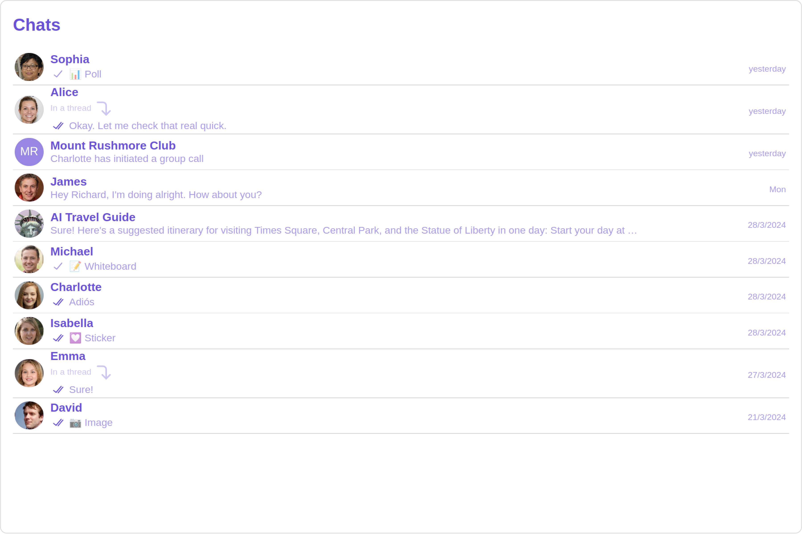

**Custom**

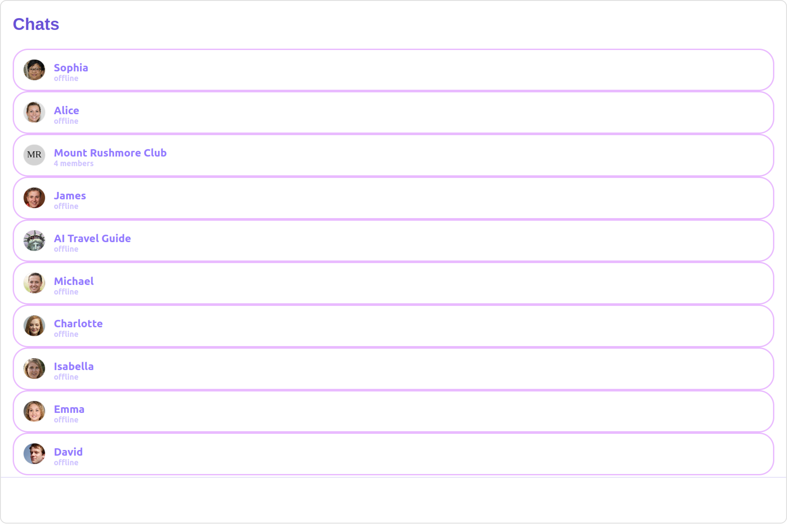

---

#### TextFormatters

Assigns the list of text formatters. If the provided list is not null, it sets the list. Otherwise, it assigns the default text formatters retrieved from the data source. To configure the existing Mentions look and feel check out [CometChatMentionsFormatter](/ui-kit/angular/mentions-formatter-guide)

<Tabs>
<TabItem value="HashTagTextFormatter.ts" label="HashTagTextFormatter.ts">

```javascript
import { CometChatTextFormatter } from "@cometchat/uikit-shared";

class HashTagTextFormatter extends CometChatTextFormatter {
  constructor() {
    super();
    // Set the tracking character to #
    this.setTrackingCharacter("#");

    // Define regex patterns to find specific text patterns
    this.setRegexPatterns([
      /\B#(\w+)\b/g, // Matches hashtags starting with #
    ]);

    // Define regex patterns to replace formatter text with original text
    this.setRegexToReplaceFormatting([
      /#(\w+)/g, // Replace hashtags without formatting
    ]);

    // Set callback functions for key up and key down events
    this.setKeyUpCallBack(this.onKeyUp.bind(this));
    this.setKeyDownCallBack(this.onKeyDown.bind(this));

    // Set the re-render callback function
    this.setReRender(() => {
      // Trigger re-rendering of the message composer component
      // This could involve updating the UI with the formatted text
      console.log("Re-rendering message composer to update text content.");
    });

    // Initialize composer tracking
    this.initializeComposerTracking();
  }

  initializeComposerTracking() {
    // Get the reference to the input field (composer)
    const composerInput = document.getElementById("yourComposerInputId");

    // Set the reference to the input field
    this.setInputElementReference(composerInput);
  }

  getCaretPosition(): number {
    if (!this.inputElementReference) return 0;

    const selection = window.getSelection();
    if (!selection || selection.rangeCount === 0) return 0;

    const range = selection.getRangeAt(0);
    const clonedRange = range.cloneRange();
    clonedRange.selectNodeContents(this.inputElementReference);
    clonedRange.setEnd(range.endContainer, range.endOffset);

    return clonedRange.toString().length;
  }

  setCaretPosition(position: number) {
    if (!this.inputElementReference) return;

    const range = document.createRange();
    const selection = window.getSelection();
    if (!selection) return;

    range.setStart(
      this.inputElementReference.childNodes[0] || this.inputElementReference,
      position
    );
    range.collapse(true);

    selection.removeAllRanges();
    selection.addRange(range);
  }

  override onKeyUp(event: KeyboardEvent) {
    if (event.key === this.trackCharacter) {
      this.startTracking = true;
    }
    // Custom logic to format hashtags as users type in the composer
    if (this.startTracking && (event.key === " " || event.key === "Enter")) {
      const caretPosition = this.getCaretPosition();
      this.formatText();
      this.setCaretPosition(caretPosition);
    }
    // Check if the last character typed was not a space or enter
    // and if the caret position is at the end, then we need to set start tracking to false
    if (
      this.startTracking &&
      event.key !== " " &&
      event.key !== "Enter" &&
      this.getCaretPosition() === this.inputElementReference?.innerText?.length
    ) {
      this.startTracking = false;
    }
  }

  formatText() {
    const inputValue =
      this.inputElementReference?.innerText ||
      this.inputElementReference?.textContent ||
      "";
    const formattedText = this.getFormattedText(inputValue);
    // Update the composer with formatted text
    if (this.inputElementReference) {
      this.inputElementReference.innerHTML = formattedText || "";
      // Trigger re-render of the composer
      this.reRender();
    }
  }

  override onKeyDown(event: KeyboardEvent) {
    // Custom onKeyDown logic can be added here
  }

  override getFormattedText(inputText: string) {
    if (!inputText) {
      // Edit at cursor position and return void
      return;
    }
    // Perform custom logic to format text (e.g., formatting hashtags)
    return this.customLogicToFormatText(inputText);
  }

  customLogicToFormatText(inputText: string) {
    // Replace hashtags with HTML span elements to change color to green
    return inputText.replace(
      /\B#(\w+)\b/g,
      '<span style="color: #5dff05;">#$1</span>'
    );
  }

  override getOriginalText(inputText: string) {
    // Sample implementation
    if (!inputText) {
      return "";
    }
    // Remove formatting and return original text
    for (let i = 0; i < this.regexToReplaceFormatting.length; i++) {
      let regexPattern = this.regexToReplaceFormatting[i];

      if (inputText) {
        inputText = inputText.replace(regexPattern, "#$1");
      }
    }

    return inputText;
  }
}

export default HashTagTextFormatter;
```

</TabItem>
<TabItem value="app.component.ts" label="app.component.ts">

```javascript
import { Component, OnInit } from '@angular/core';
import { CometChatThemeService, CometChatUIKit } from '@cometchat/chat-uikit-angular';
import HashTagTextFormatter from '../HashTagTextFormatter';
import "@cometchat/uikit-elements";

@Component({
  selector: 'app-root',
  templateUrl: './app.component.html',
  styleUrls: ['./app.component.css']
})
export class AppComponent implements OnInit{
  ngOnInit(): void {

  }

  public textFormatters= [new HashTagTextFormatter];

  constructor(private themeService:CometChatThemeService) {
    themeService.theme.palette.setMode("light")
    themeService.theme.palette.setPrimary({ light: "#6851D6", dark: "#6851D6" })
  }

  onLogin(UID?: any) {
    CometChatUIKit.login({ uid: UID }).then(
      (user) => {
        setTimeout(() => {
          window.location.reload();
        }, 1000);
      },
      (error) => {
        console.log("Login failed with exception:", { error });
      }
    );
  }
}
```

</TabItem>
<TabItem value="ts" label="app.component.html">

```html
<div class="fullwidth">
  <cometchat-conversations
    [textFormatters]="textFormatters"
  ></cometchat-conversations>
</div>
```

</TabItem>
</Tabs>

#### Menus

You can set the Custom Menu view to add more options to the Conversations component.

**Example**

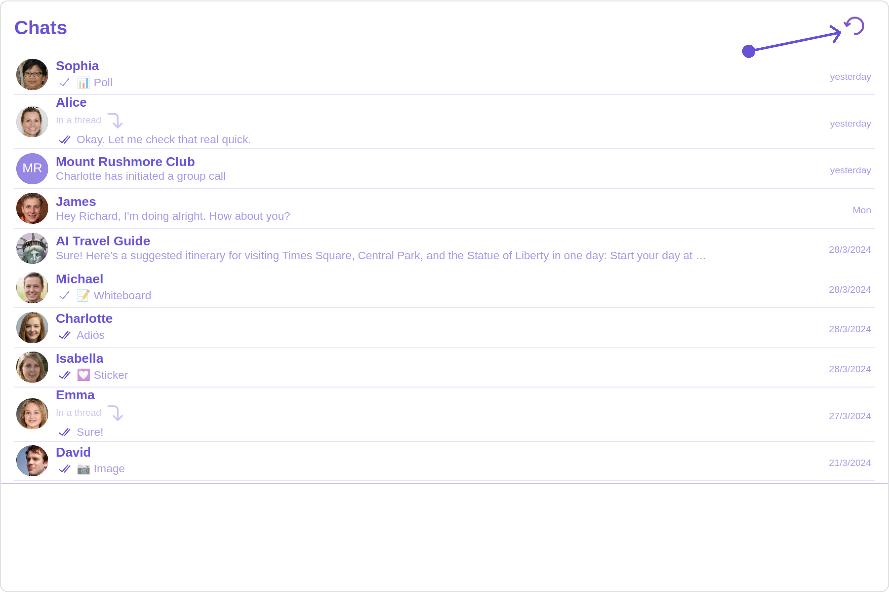

<Tabs>
<TabItem value="app.component.ts" label="app.component.ts">

```javascript
import { Component, OnInit } from '@angular/core';
import { CometChatThemeService, CometChatUIKit } from '@cometchat/chat-uikit-angular';
import "@cometchat/uikit-elements";

@Component({
  selector: 'app-root',
  templateUrl: './app.component.html',
  styleUrls: ['./app.component.css']
})
export class AppComponent implements OnInit{

@ViewChild('menuTemplate') menuTemplate!: TemplateRef<any>;

  handleReload() {
    window.location.reload();
  }

  getButtonStyle() {
    return JSON.stringify({
      height: "20px",
      width: "20px",
      border: "none",
      borderRadius: "0",
      background: "transparent",
      buttonIconTint: "#7E57C2"
    });
  }

  constructor(private themeService:CometChatThemeService) {
    themeService.theme.palette.setMode("light")
    themeService.theme.palette.setPrimary({ light: "#6851D6", dark: "#6851D6" })
  }

  onLogin(UID?: any) {
    CometChatUIKit.login({ uid: UID }).then(
      (user) => {
        setTimeout(() => {
          window.location.reload();
        }, 1000);
      },
      (error) => {
        console.log("Login failed with exception:", { error });
      }
    );
  }
}
```

</TabItem>
<TabItem value="ts" label="app.component.html">

```html
<div class="fullwidth">
  <cometchat-conversations [menu]="menuTemplate"></cometchat-conversations>
</div>
<ng-template #menuTemplate>
  <div style="margin-right: 20px;">
    <cometchat-button
      [iconURL]="'your icon URL'"
      [buttonStyle]="getButtonStyle()"
      (click)="handleReload()"
    >
    </cometchat-button>
  </div>
</ng-template>
```

</TabItem>
</Tabs>

---

#### DatePattern

    You can modify the date pattern to your requirement using **DatePattern**. datePattern formats date and time values according to a predefined standard, enhancing consistency and clarity in their presentation.

DatePatterns describes a specific format or arrangement used to represent dates in a human-readable form.


| Name | Description |
| --- | --- |
| time | Date format displayed in the format hh:mm a |
| DayDate | Date format displayed in the following format. <ol><li>If timestamp < 24hrs display “Today”</li><li>If timestamp < 48hrs display “Yesterday”</li><li>If timestamp &lt; 7days display “EEE” i.e , SUNDAY </li><li>else display “d MMM, yyyy”</li></ol> |
| DayDateTime | Date format displayed in the following format. <ol><li>If timestamp < 24hrs display “hh:mm a”</li><li>If timestamp < 48hrs display “Yesterday”</li><li>If timestamp < 7days display “EEE” i.e SUNDAY</li><li>else display “dd MM yyyy”</li></ol> 

**Example**

**Default**

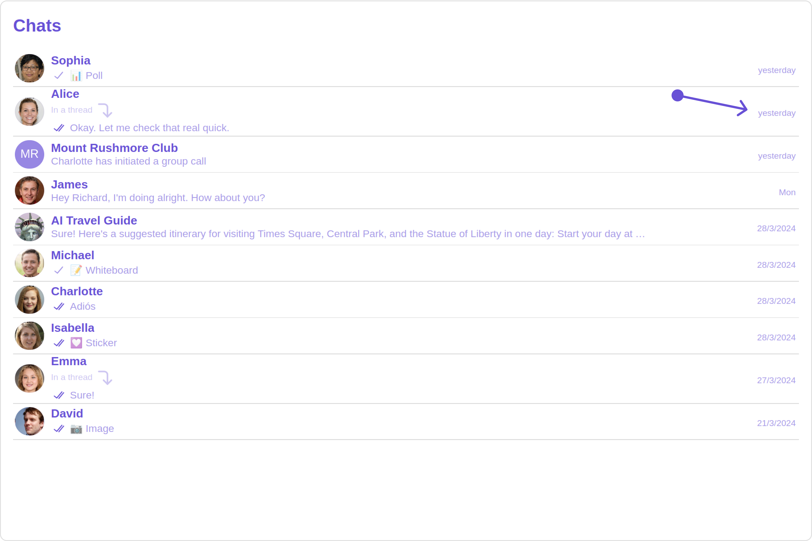

**Custom**

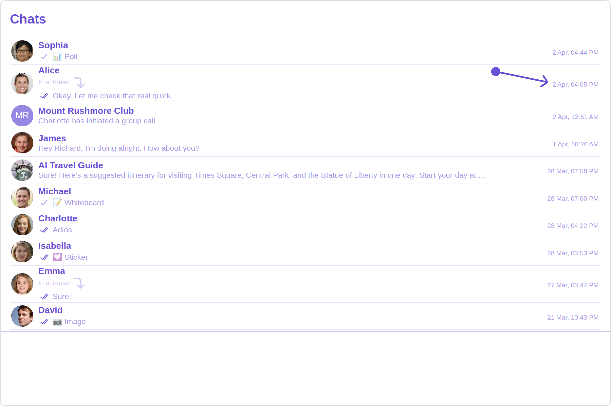

<Tabs>
<TabItem value="app.component.ts" label="app.component.ts">

```javascript
import { Component, OnInit } from '@angular/core';
import { CometChatThemeService, CometChatUIKit } from '@cometchat/chat-uikit-angular';
import { DatePatterns } from '@cometchat/uikit-resources';
import "@cometchat/uikit-elements";

@Component({
  selector: 'app-root',
  templateUrl: './app.component.html',
  styleUrls: ['./app.component.css']
})
export class AppComponent implements OnInit{

  datePattern: DatePatterns = DatePatterns.DateTime;

  constructor(private themeService:CometChatThemeService) {
    themeService.theme.palette.setMode("light")
    themeService.theme.palette.setPrimary({ light: "#6851D6", dark: "#6851D6" })
  }

  onLogin(UID?: any) {
    CometChatUIKit.login({ uid: UID }).then(
      (user) => {
        setTimeout(() => {
          window.location.reload();
        }, 1000);
      },
      (error) => {
        console.log("Login failed with exception:", { error });
      }
    );
  }
}
```

</TabItem>
<TabItem value="ts" label="app.component.html">

```html
<div class="fullwidth">
  <cometchat-conversations
    [datePattern]="datePattern"
  ></cometchat-conversations>
</div>
```

</TabItem>
</Tabs>

#### Options

User-defined actions which appears for each conversation on mouseover.

##### Structure of CometChatOption

| Name            | Description                                                                                                                            |
| --------------- | -------------------------------------------------------------------------------------------------------------------------------------- |
| id              | Unique identifier for each option                                                                                                      |
| title           | Heading text for each option                                                                                                           |
| titleFont       | Sets all the different properties of font for the option text. [Reference link](https://developer.mozilla.org/en-US/docs/Web/CSS/font) |
| titleColor      | Sets the foreground color of option text                                                                                               |
| iconURL         | Sets the asset URL of the icon for each option                                                                                         |
| iconTint        | Sets the tint or color applied to each option                                                                                          |
| backgroundColor | Sets the background color of each option                                                                                               |
| onClick         | Method to be invoked when user clicks on each option                                                                                   |

**Example**

**Default**

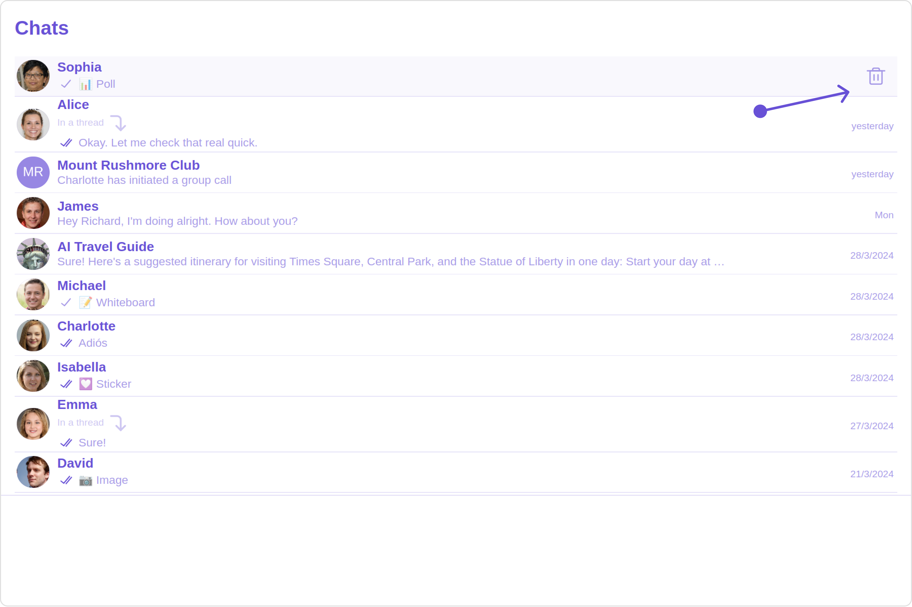

**Custom**

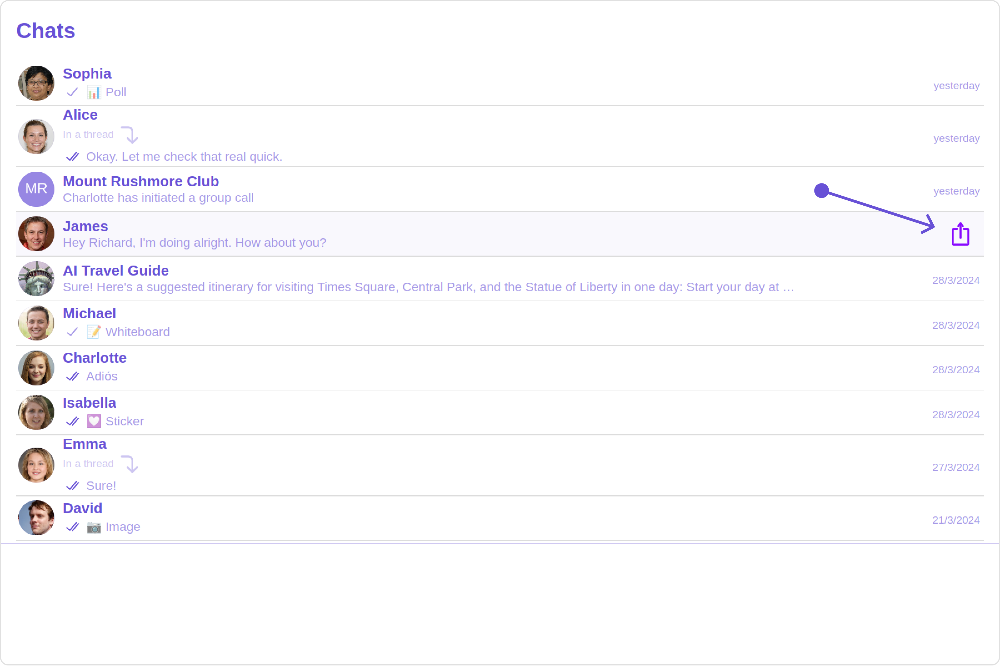

<Tabs>
<TabItem value="app.component.ts" label="app.component.ts">

```javascript
import { Component, OnInit } from '@angular/core';
import { CometChatThemeService, CometChatUIKit } from '@cometchat/chat-uikit-angular';
import { CometChatOption } from '@cometchat/uikit-resources';
import "@cometchat/uikit-elements";

@Component({
  selector: 'app-root',
  templateUrl: './app.component.html',
  styleUrls: ['./app.component.css']
})
export class AppComponent implements OnInit{

  getOptions=(user: any)=>{
    const customOptions = [
      new CometChatOption({
        id: "1",
        title: "Title",
        iconURL: "ICON URL",
        backgroundColor: "red",
        onClick: () => {
          console.log("Custom option clicked for user:", user);
        },
      }),
    ];
    return customOptions;
  };

  constructor(private themeService:CometChatThemeService) {
    themeService.theme.palette.setMode("light")
    themeService.theme.palette.setPrimary({ light: "#6851D6", dark: "#6851D6" })
  }

  onLogin(UID?: any) {
    CometChatUIKit.login({ uid: UID }).then(
      (user) => {
        setTimeout(() => {
          window.location.reload();
        }, 1000);
      },
      (error) => {
        console.log("Login failed with exception:", { error });
      }
    );
  }
}
```

</TabItem>
<TabItem value="ts" label="app.component.html">

```html
<div class="fullwidth">
  <cometchat-conversations [options]="getOptions"></cometchat-conversations>
</div>
```

</TabItem>
</Tabs>

---

#### LoadingStateView

You can set a custom loader view using `loadingStateView` to match the loading view of your app.

**Example**

**Default**

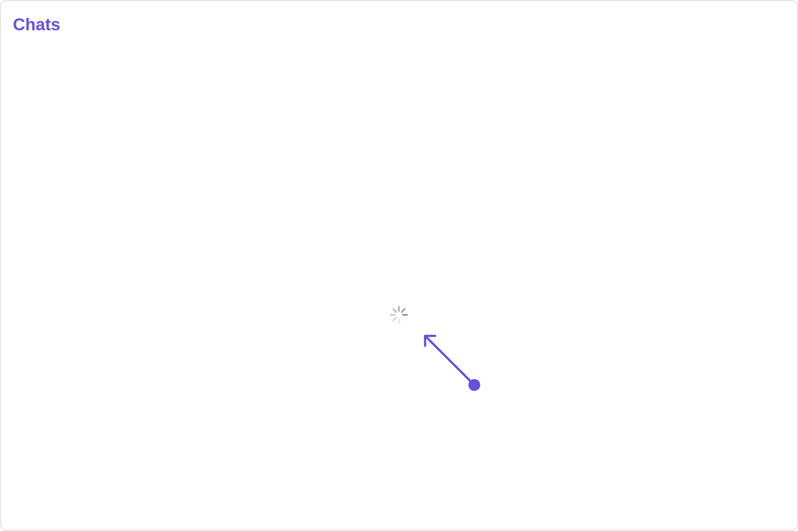

**Custom**

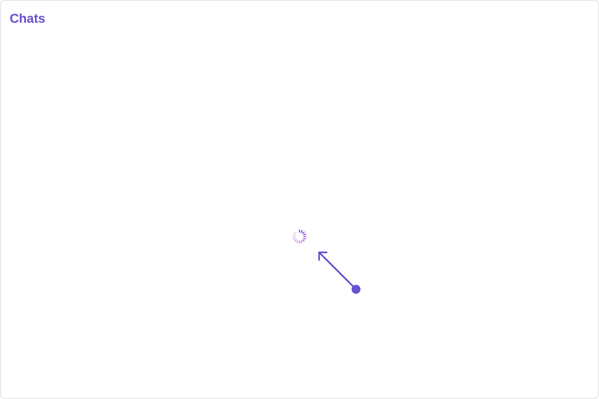

You can customize the loading state view by modifying the `getLoadingStateView` function as follows:

<Tabs>
<TabItem value="app.component.ts" label="app.component.ts">

```javascript
import { Component, OnInit } from '@angular/core';
import { CometChatThemeService, CometChatUIKit, LoaderStyle } from '@cometchat/chat-uikit-angular';
import "@cometchat/uikit-elements";

@Component({
  selector: 'app-root',
  templateUrl: './app.component.html',
  styleUrls: ['./app.component.css']
})
export class AppComponent implements OnInit{

  getLoaderStyle: LoaderStyle = new LoaderStyle({
    iconTint: "red",
    background: "transparent",
    height: "20px",
    width: "20px",
    border: "none",
    borderRadius: "0",
  });

  constructor(private themeService:CometChatThemeService) {
    themeService.theme.palette.setMode("light")
    themeService.theme.palette.setPrimary({ light: "#6851D6", dark: "#6851D6" })
  }

  onLogin(UID?: any) {
    CometChatUIKit.login({ uid: UID }).then(
      (user) => {
        setTimeout(() => {
          window.location.reload();
        }, 1000);
      },
      (error) => {
        console.log("Login failed with exception:", { error });
      }
    );
  }
}
```

</TabItem>
<TabItem value="ts" label="app.component.html">

```html
<div class="fullwidth">
  <cometchat-conversations
    [loadingStateView]="loadingStateView"
  ></cometchat-conversations>
</div>

<ng-template #loadingStateView>
  <cometchat-loader
    [iconURL]="icon"
    [loaderStyle]="getLoaderStyle()"
  ></cometchat-loader>
</ng-template>
```

</TabItem>
</Tabs>

---

#### ErrorStateView

    You can set a custom `ErrorStateView` to match the error view of your app.

**Example**

**Default**

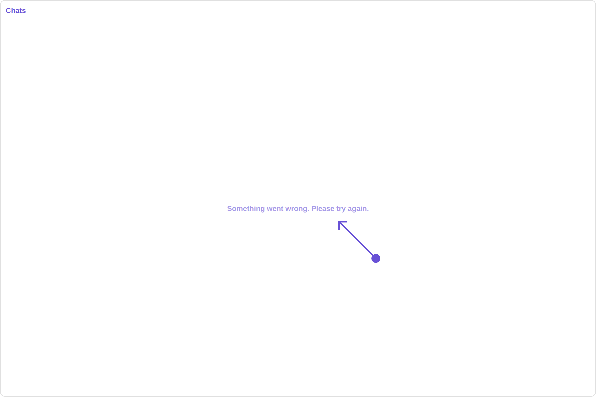

**Custom**

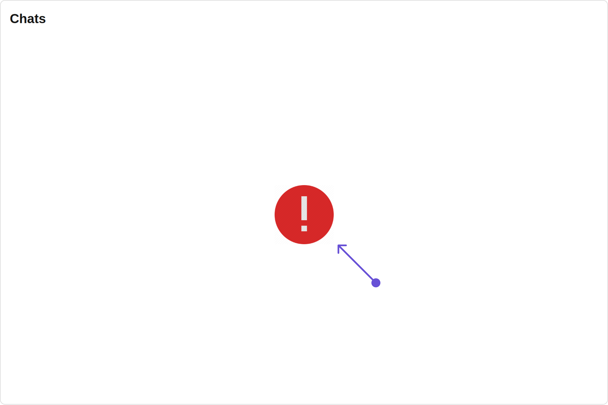

    You can customize the empty state view by modifying the `getErrorStateView` function as follows:

<Tabs>
<TabItem value="app.component.ts" label="app.component.ts">

```javascript
import { Component, OnInit } from '@angular/core';
import { CometChatThemeService, CometChatUIKit, LoaderStyle } from '@cometchat/chat-uikit-angular';
import "@cometchat/uikit-elements";

@Component({
  selector: 'app-root',
  templateUrl: './app.component.html',
  styleUrls: ['./app.component.css']
})
export class AppComponent implements OnInit{

  constructor(private themeService:CometChatThemeService) {
    themeService.theme.palette.setMode("light")
    themeService.theme.palette.setPrimary({ light: "#6851D6", dark: "#6851D6" })
  }

  onLogin(UID?: any) {
    CometChatUIKit.login({ uid: UID }).then(
      (user) => {
        setTimeout(() => {
          window.location.reload();
        }, 1000);
      },
      (error) => {
        console.log("Login failed with exception:", { error });
      }
    );
  }
}
```

</TabItem>
<TabItem value="ts" label="app.component.html">

```html
<div class="fullwidth">
  <cometchat-conversations
    [errorStateView]="errorStateView"
  ></cometchat-conversations>
</div>

<ng-template #errorStateView>
  <div style="height: 100vh; width: 100vw">
    
  </div>
</ng-template>
```

</TabItem>
</Tabs>
