import Tabs from '@theme/Tabs';
import TabItem from '@theme/TabItem';

## Overview

The Users is a [Component](/ui-kit/angular/components-overview#components), showcasing an accessible list of all available users. It provides an integral search functionality, allowing you to locate any specific user swiftly and easily. For each user listed, the widget displays the user's name by default, in conjunction with their avatar when available. Furthermore, it includes a status indicator, visually informing you whether a user is currently online or offline.

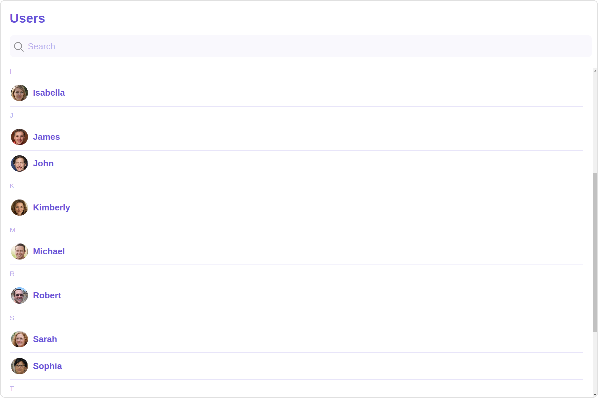

The Users component is composed of the following BaseComponents:

| Components                       | Description                                                                                                             |
| -------------------------------- | ----------------------------------------------------------------------------------------------------------------------- |
| [CometChatList](./list)          | a reusable container component having title, search box, customisable background and a List View                        |
| [CometChatListItem](./list-item) | a component that renders data obtained from a User object on a Tile having a title, subtitle, leading and trailing view |

---

## Usage

### Integration

The following code snippet illustrates how you can directly incorporate the Users component into your Application.

<Tabs>
<TabItem value="js" label="app.module.ts">

```javascript
import { CUSTOM_ELEMENTS_SCHEMA, NgModule } from "@angular/core";
import { BrowserModule } from "@angular/platform-browser";
import { CometChatUsers } from "@cometchat/chat-uikit-angular";
import { AppComponent } from "./app.component";

@NgModule({
  imports: [BrowserModule, CometChatUsers],
  declarations: [AppComponent],
  providers: [],
  bootstrap: [AppComponent],
  schemas: [CUSTOM_ELEMENTS_SCHEMA],
})
export class AppModule {}
```

</TabItem>
<TabItem value="app.component.ts" label="app.component.ts">

```javascript
import { Component, OnInit } from '@angular/core';
import {  CometChatThemeService, CometChatUIKit } from '@cometchat/chat-uikit-angular';
import "@cometchat/uikit-elements";

@Component({
  selector: 'app-root',
  templateUrl: './app.component.html',
  styleUrls: ['./app.component.css']
})
export class AppComponent {

  title = 'angular-app';
  constructor(private themeService:CometChatThemeService) {
    themeService.theme.palette.setMode("light")
    themeService.theme.palette.setPrimary({ light: "#6851D6", dark: "#6851D6" })
  }

  onLogin(UID?: any) {
    CometChatUIKit.login({ uid: UID }).then(
      (user) => {
        setTimeout(() => {
          window.location.reload();
        }, 1000);
      },
      (error) => {
        console.log("Login failed with exception:", { error });
      }
    );
  }
}
```

</TabItem>
<TabItem value="ts" label="app.component.html">

```html
<div class="fullwidth">
  <cometchat-users></cometchat-users>
</div>
```

</TabItem>
</Tabs>

---

### Actions

[Actions](/ui-kit/angular/components-overview#actions) dictate how a component functions. They are divided into two types: Predefined and User-defined. You can override either type, allowing you to tailor the behavior of the component to fit your specific needs.

##### 1. onSelect

The `onSelect` action is activated when you select the done icon while in selection mode. This returns a list of all the users that you have selected.

This action does not come with any predefined behavior. However, you have the flexibility to override this event and tailor it to suit your needs using the following code snippet.

<Tabs>
<TabItem value="app.component.ts" label="app.component.ts">

```javascript
import { Component, OnInit } from '@angular/core';
import {  CometChatThemeService, CometChatUIKit } from '@cometchat/chat-uikit-angular';
import { SelectionMode } from '@cometchat/uikit-resources';
import "@cometchat/uikit-elements";

@Component({
  selector: 'app-root',
  templateUrl: './app.component.html',
  styleUrls: ['./app.component.css']
})
export class AppComponent {

  title = 'angular-doc-app';
  constructor(private themeService:CometChatThemeService) {
    themeService.theme.palette.setMode("light")
    themeService.theme.palette.setPrimary({ light: "#6851D6", dark: "#6851D6" })
  }

  public selectionMode : SelectionMode = SelectionMode.multiple;
  public handleOnSelect = (user: CometChat.User, selected: boolean): void=>{
    console.log("Custom on select action", user, selected);
  }

  onLogin(UID?: any) {
    CometChatUIKit.login({ uid: UID }).then(
      (user) => {
        setTimeout(() => {
          window.location.reload();
        }, 1000);
      },
      (error) => {
        console.log("Login failed with exception:", { error });
      }
    );
  }
}
```

</TabItem>
<TabItem value="ts" label="app.component.html">

```html
<div class="fullwidth">
  <cometchat-users
    [selectionMode]="selectionMode"
    [onSelect]="handleOnSelect"
  ></cometchat-users>
</div>
```

</TabItem>
</Tabs>

---

##### 2. onItemClick

The `OnItemClick` event is activated when you click on the UserList item. This action does not come with any predefined behavior. However, you have the flexibility to override this event and tailor it to suit your needs using the following code snippet.

<Tabs>
<TabItem value="app.component.ts" label="app.component.ts">

```javascript
import { Component, OnInit } from '@angular/core';
import {  CometChatThemeService, CometChatUIKit } from '@cometchat/chat-uikit-angular';
import "@cometchat/uikit-elements";

@Component({
  selector: 'app-root',
  templateUrl: './app.component.html',
  styleUrls: ['./app.component.css']
})
export class AppComponent {

  title = 'angular-app';
  constructor(private themeService:CometChatThemeService) {
    themeService.theme.palette.setMode("light")
    themeService.theme.palette.setPrimary({ light: "#6851D6", dark: "#6851D6" })
  }

  public handleOnItemClick = (user: CometChat.User) : void =>{
    console.log("your custom on item click action", user);
  };


  onLogin(UID?: any) {
    CometChatUIKit.login({ uid: UID }).then(
      (user) => {
        setTimeout(() => {
          window.location.reload();
        }, 1000);
      },
      (error) => {
        console.log("Login failed with exception:", { error });
      }
    );
  }
}
```

</TabItem>
<TabItem value="ts" label="app.component.html">

```html
<div class="fullwidth">
  <cometchat-users [onItemClick]="handleOnItemClick"></cometchat-users>
</div>
```

</TabItem>
</Tabs>

---

##### 3. onEmpty

This action allows you to specify a callback function to be executed when a certain condition, typically the absence of data or content, is met within the component or element.

<Tabs>
<TabItem value="app.component.ts" label="app.component.ts">

```javascript
import { Component, OnInit } from '@angular/core';
import {  CometChatThemeService, CometChatUIKit } from '@cometchat/chat-uikit-angular';
import "@cometchat/uikit-elements";

@Component({
  selector: 'app-root',
  templateUrl: './app.component.html',
  styleUrls: ['./app.component.css']
})
export class AppComponent {

  title = 'angular-app';
  constructor(private themeService:CometChatThemeService) {
    themeService.theme.palette.setMode("light")
    themeService.theme.palette.setPrimary({ light: "#6851D6", dark: "#6851D6" })
  }

  public handleOnEmpty = () =>{
    console.log("your custom on empty action");
  }


  onLogin(UID?: any) {
    CometChatUIKit.login({ uid: UID }).then(
      (user) => {
        setTimeout(() => {
          window.location.reload();
        }, 1000);
      },
      (error) => {
        console.log("Login failed with exception:", { error });
      }
    );
  }
}
```

</TabItem>
<TabItem value="ts" label="app.component.html">

```html
<div class="fullwidth">
  <cometchat-users [onEmpty]="handleOnEmpty"></cometchat-users>
</div>
```

</TabItem>
</Tabs>

---

##### 4. onError

This action doesn't change the behavior of the component but rather listens for any errors that occur in the User component.

<Tabs>
<TabItem value="app.component.ts" label="app.component.ts">

```javascript
import { Component, OnInit } from '@angular/core';
import {  CometChatThemeService, CometChatUIKit } from '@cometchat/chat-uikit-angular';
import "@cometchat/uikit-elements";

@Component({
  selector: 'app-root',
  templateUrl: './app.component.html',
  styleUrls: ['./app.component.css']
})
export class AppComponent {

  title = 'angular-app';
  constructor(private themeService:CometChatThemeService) {
    themeService.theme.palette.setMode("light")
    themeService.theme.palette.setPrimary({ light: "#6851D6", dark: "#6851D6" })
  }

  public handleOnError = (error: CometChat.CometChatException) => {
    console.log("your custom on error action", error);
  };

  onLogin(UID?: any) {
    CometChatUIKit.login({ uid: UID }).then(
      (user) => {
        setTimeout(() => {
          window.location.reload();
        }, 1000);
      },
      (error) => {
        console.log("Login failed with exception:", { error });
      }
    );
  }
}
```

</TabItem>
<TabItem value="ts" label="app.component.html">

```html
<div class="fullwidth">
  <cometchat-users [onError]="handleOnError"></cometchat-users>
</div>
```

</TabItem>
</Tabs>

---

### Filters

**Filters** allow you to customize the data displayed in a list within a Component. You can filter the list based on your specific criteria, allowing for a more customized. Filters can be applied using RequestBuilders of Chat SDK.

##### 1. UserRequestBuilder

The [UserRequestBuilder](/sdk/javascript/retrieve-users) enables you to filter and customize the user list based on available parameters in UserRequestBuilder. This feature allows you to create more specific and targeted queries when fetching users. The following are the parameters available in [UserRequestBuilder](/sdk/javascript/retrieve-users)

| Methods              | Type               | Description                                                                            |
| -------------------- | ------------------ | -------------------------------------------------------------------------------------- |
| **setLimit**         | number             | sets the number users that can be fetched in a single request, suitable for pagination |
| **setSearchKeyword** | String             | used for fetching users matching the passed string                                     |
| **hideBlockedUsers** | boolean            | used for fetching all those users who are not blocked by the logged in user            |
| **friendsOnly**      | boolean            | used for fetching only those users in which logged in user is a member                 |
| **setRoles**         | List&lt;String&gt; | used for fetching users containing the passed tags                                     |
| **setTags**          | List&lt;String&gt; | used for fetching users containing the passed tags                                     |
| **withTags**         | boolean            | used for fetching users containing tags                                                |
| **setStatus**        | String             | used for fetching users by their status online or offline                              |
| **setUIDs**          | List&lt;String&gt; | used for fetching users containing the passed users                                    |

**Example**

In the example below, we are applying a filter to the UserList based on Friends.

<Tabs>
<TabItem value="app.component.ts" label="app.component.ts">

```javascript
import { CometChat } from '@cometchat/chat-sdk-javascript';
import { Component, OnInit } from '@angular/core';
import {  CometChatThemeService, CometChatUIKit } from '@cometchat/chat-uikit-angular';
import "@cometchat/uikit-elements";

@Component({
  selector: 'app-root',
  templateUrl: './app.component.html',
  styleUrls: ['./app.component.css']
})
export class AppComponent {

  title = 'angular-app';
  constructor(private themeService:CometChatThemeService) {
    themeService.theme.palette.setMode("light")
    themeService.theme.palette.setPrimary({ light: "#6851D6", dark: "#6851D6" })
  }

  usersRequestBuilder = new CometChat.UsersRequestBuilder().friendsOnly(true).setLimit(5)

  onLogin(UID?: any) {
    CometChatUIKit.login({ uid: UID }).then(
      (user) => {
        setTimeout(() => {
          window.location.reload();
        }, 1000);
      },
      (error) => {
        console.log("Login failed with exception:", { error });
      }
    );
  }
}
```

</TabItem>
<TabItem value="ts" label="app.component.html">

```html
<div class="fullwidth">
  <cometchat-users
    [usersRequestBuilder]="usersRequestBuilder"
  ></cometchat-users>
</div>
```

</TabItem>
</Tabs>

##### 2. SearchRequestBuilder

The SearchRequestBuilder uses [UserRequestBuilder](/sdk/javascript/retrieve-users) enables you to filter and customize the search list based on available parameters in UserRequestBuilder.
This feature allows you to keep uniformity between the displayed UserList and searched UserList.

**Example**

<Tabs>
<TabItem value="app.component.ts" label="app.component.ts">

```javascript
import { CometChat } from '@cometchat/chat-sdk-javascript';
import { Component, OnInit } from '@angular/core';
import {  CometChatThemeService, CometChatUIKit } from '@cometchat/chat-uikit-angular';
import "@cometchat/uikit-elements";

@Component({
  selector: 'app-root',
  templateUrl: './app.component.html',
  styleUrls: ['./app.component.css']
})
export class AppComponent {

  title = 'angular-app';
  constructor(private themeService:CometChatThemeService) {
    themeService.theme.palette.setMode("light")
    themeService.theme.palette.setPrimary({ light: "#6851D6", dark: "#6851D6" })
  }

  searchRequestBuilder = new CometChat.UsersRequestBuilder().setSearchKeyword("**")

  onLogin(UID?: any) {
    CometChatUIKit.login({ uid: UID }).then(
      (user) => {
        setTimeout(() => {
          window.location.reload();
        }, 1000);
      },
      (error) => {
        console.log("Login failed with exception:", { error });
      }
    );
  }
}
```

</TabItem>
<TabItem value="ts" label="app.component.html">

```html
<div class="fullwidth">
  <cometchat-users
    [searchRequestBuilder]="searchRequestBuilder"
  ></cometchat-users>
</div>
```

</TabItem>
</Tabs>

---

### Events

[Events](/ui-kit/angular/components-overview#events) are emitted by a `Component`. By using event you can extend existing functionality. Being global events, they can be applied in Multiple Locations and are capable of being Added or Removed.

To handle events supported by Users you have to add corresponding listeners by using `CometChatUserEvents`

The `Users` component does not produce any events directly.

---

## Customization

To fit your app's design requirements, you can customize the appearance of the Users component. We provide exposed methods that allow you to modify the experience and behavior according to your specific needs.

### Style

Using **Style** you can **customize** the look and feel of the component in your app, These parameters typically control elements such as the **color**, **size**, **shape**, and **fonts** used within the component.

##### 1. Users Style

You can set the `UsersStyle` to the Users Component to customize the styling.

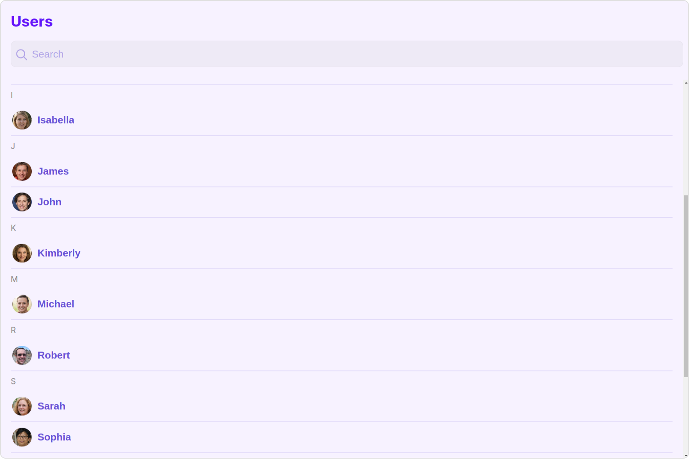

<Tabs>
<TabItem value="app.component.ts" label="app.component.ts">

```javascript
import { CometChat } from '@cometchat/chat-sdk-javascript';
import { Component, OnInit } from '@angular/core';
import {  CometChatThemeService, CometChatUIKit } from '@cometchat/chat-uikit-angular';
import { UsersStyle } from '@cometchat/uikit-shared';
import "@cometchat/uikit-elements";

@Component({
  selector: 'app-root',
  templateUrl: './app.component.html',
  styleUrls: ['./app.component.css']
})
export class AppComponent {

  title = 'angular-app';
  constructor(private themeService:CometChatThemeService) {
    themeService.theme.palette.setMode("light")
    themeService.theme.palette.setPrimary({ light: "#6851D6", dark: "#6851D6" })
  }

  usersStyle = new UsersStyle({
    background: "#f7f2ff",
    titleTextColor: "#6414fa",
    searchTextColor: "#940be3",
    separatorColor: "#ffffff",
  });
  onLogin(UID?: any) {
    CometChatUIKit.login({ uid: UID }).then(
      (user) => {
        setTimeout(() => {
          window.location.reload();
        }, 1000);
      },
      (error) => {
        console.log("Login failed with exception:", { error });
      }
    );
  }
}
```

</TabItem>
<TabItem value="ts" label="app.component.html">

```html
<div class="fullwidth">
  <cometchat-users [usersStyle]="usersStyle"></cometchat-users>
</div>
```

</TabItem>
</Tabs>

List of properties exposed by UsersStyle

| Property                       | Description                                                                                                      | Code                                   |
| ------------------------------ | ---------------------------------------------------------------------------------------------------------------- | -------------------------------------- |
| **border**                     | Used to set border                                                                                               | `border?: string,`                     |
| **borderRadius**               | Used to set border radius                                                                                        | `borderRadius?: string;`               |
| **background**                 | Used to set background colour                                                                                    | `background?: string;`                 |
| **height**                     | Used to set height                                                                                               | `height?: string;`                     |
| **width**                      | Used to set width                                                                                                | `width?: string;`                      |
| **titleTextFont**              | Used to customise the font of the title in the app bar                                                           | `titleTextFont?: string;`              |
| **titleTextColor**             | Used to customise the color of the title in the app bar                                                          | `titleTextColor?: string;`             |
| **emptyStateTextFont**         | Used to set the font style of the response text shown when fetchig the list of users has returned an empty list  | `emptyStateTextFont?: string;`         |
| **emptyStateTextColor**        | Used to set the color of the response text shown when fetchig the list of users has returned an empty list       | `emptyStateTextColor?: string;`        |
| **errorStateTextFont**         | Used to set the font style of the response text shown in case some error occurs while fetching the list of users | `errorStateTextFont?: string;`         |
| **errorStateTextColor**        | Used to set the font style of the response text shown in case some error occurs while fetching the list of users | `errorStateTextColor?: string;`        |
| **loadingIconTint**            | Used to set the color of the icon shown while the list of users is being fetched                                 | `loadingIconTint?: string;`            |
| **onlineStatusColor**          | Used to set the color of the status indicator shown if a user is online                                          | `onlineStatusColor?: string;`          |
| **separatorColor**             | Used to set the color of the divider separating the group member items                                           | `separatorColor?: string;`             |
| **boxShadow**                  | Sets shadow effects around the element                                                                           | `boxShadow?: string;`                  |
| **searchIconTint**             | Used to set the color of the search icon in the search box                                                       | `searchIconTint?: string;`             |
| **searchBorder**               | Used to set the border of the search box                                                                         | `searchBorder?: string;`               |
| **searchBorderRadius**         | Used to set the border radius of the search box                                                                  | `searchBorderRadius?: string;`         |
| **searchBackground**           | Used to set the background color of the search box                                                               | `searchBackground?: string;`           |
| **searchPlaceholderTextFont**  | Used to set the font of the placeholder text in the search box                                                   | `searchPlaceholderTextFont?: string;`  |
| **searchPlaceholderTextColor** | Used to set the color of the placeholder text in the search box                                                  | `searchPlaceholderTextColor?: string;` |
| **searchTextFont**             | Used to set the font of the text in the search box                                                               | `searchTextFont?: string;`             |
| **searchTextColor**            | Used to set the color of the text in the search box                                                              | `searchTextColor?: string;`            |
| **sectionHeaderTextFont**      | Used to customise the font of the section header text.                                                           | `sectionHeaderTextFont?: string;`      |
| **sectionHeaderTextColor**     | Used to customise the color of the section header text.                                                          | `sectionHeaderTextColor?: string;`     |

##### 2. Avatar Style

To apply customized styles to the `Avatar` component in the Users Component, you can use the following code snippet. For further insights on `Avatar` Styles [refer](/ui-kit/angular/avatar#avatar-style)

<Tabs>
<TabItem value="app.component.ts" label="app.component.ts">

```javascript
import { CometChat } from '@cometchat/chat-sdk-javascript';
import { Component, OnInit } from '@angular/core';
import {  CometChatThemeService, CometChatUIKit, AvatarStyle } from '@cometchat/chat-uikit-angular';
import "@cometchat/uikit-elements";

@Component({
  selector: 'app-root',
  templateUrl: './app.component.html',
  styleUrls: ['./app.component.css']
})
export class AppComponent {

  title = 'angular-app';
  constructor(private themeService:CometChatThemeService) {
    themeService.theme.palette.setMode("light")
    themeService.theme.palette.setPrimary({ light: "#6851D6", dark: "#6851D6" })
  }

  avatarStyle = new AvatarStyle({
    backgroundColor: "#cdc2ff",
    border: "2px solid #6745ff",
    borderRadius: "10px",
    outerViewBorderColor: "#ca45ff",
    outerViewBorderRadius: "5px",
    nameTextColor: "#4554ff"
  });
  onLogin(UID?: any) {
    CometChatUIKit.login({ uid: UID }).then(
      (user) => {
        setTimeout(() => {
          window.location.reload();
        }, 1000);
      },
      (error) => {
        console.log("Login failed with exception:", { error });
      }
    );
  }
}
```

</TabItem>
<TabItem value="ts" label="app.component.html">

```html
<div class="fullwidth">
  <cometchat-users [avatarStyle]="avatarStyle"></cometchat-users>
</div>
```

</TabItem>
</Tabs>

##### 3. StatusIndicator Style

To apply customized styles to the Status Indicator component in the Users Component, You can use the following code snippet. For further insights on Status Indicator Styles [refer](/ui-kit/angular/status-indicator)

<Tabs>
<TabItem value="app.component.ts" label="app.component.ts">

```javascript
import { CometChat } from '@cometchat/chat-sdk-javascript';
import { Component, OnInit } from '@angular/core';
import {  CometChatThemeService, CometChatUIKit } from '@cometchat/chat-uikit-angular';
import "@cometchat/uikit-elements";

@Component({
  selector: 'app-root',
  templateUrl: './app.component.html',
  styleUrls: ['./app.component.css']
})
export class AppComponent {

  title = 'angular-app';
  constructor(private themeService:CometChatThemeService) {
    themeService.theme.palette.setMode("light")
    themeService.theme.palette.setPrimary({ light: "#6851D6", dark: "#6851D6" })
  }

  statusIndicatorStyle: any = ({
    height: '20px',
    width: '20px',
    backgroundColor: 'red'
  });
  onLogin(UID?: any) {
    CometChatUIKit.login({ uid: UID }).then(
      (user) => {
        setTimeout(() => {
          window.location.reload();
        }, 1000);
      },
      (error) => {
        console.log("Login failed with exception:", { error });
      }
    );
  }
}
```

</TabItem>
<TabItem value="ts" label="app.component.html">

```html
<div class="fullwidth">
  <cometchat-users
    [statusIndicatorStyle]="statusIndicatorStyle"
  ></cometchat-users>
</div>
```

</TabItem>
</Tabs>

##### 4. LisItem Style

To apply customized styles to the `List Item` component in the `Users` Component, you can use the following code snippet. For further insights on `List Item` Styles [refer](/ui-kit/angular/list-item)

<Tabs>
<TabItem value="app.component.ts" label="app.component.ts">

```javascript
import { CometChat } from '@cometchat/chat-sdk-javascript';
import { Component, OnInit } from '@angular/core';
import {  CometChatThemeService, CometChatUIKit, ListItemStyle } from '@cometchat/chat-uikit-angular';
import "@cometchat/uikit-elements";

@Component({
  selector: 'app-root',
  templateUrl: './app.component.html',
  styleUrls: ['./app.component.css']
})
export class AppComponent {

  title = 'angular-app';
  constructor(private themeService:CometChatThemeService) {
    themeService.theme.palette.setMode("light")
    themeService.theme.palette.setPrimary({ light: "#6851D6", dark: "#6851D6" })
  }

  listItemStyle: ListItemStyle = new ListItemStyle({
    background: "transparent",
    padding: "5px",
    border: "1px solid #e9b8f5",
    titleColor: "#8830f2",
    borderRadius: "20px",
    width: "100% !important"
  });
  onLogin(UID?: any) {
    CometChatUIKit.login({ uid: UID }).then(
      (user) => {
        setTimeout(() => {
          window.location.reload();
        }, 1000);
      },
      (error) => {
        console.log("Login failed with exception:", { error });
      }
    );
  }
}
```

</TabItem>
<TabItem value="ts" label="app.component.html">

```html
<div class="fullwidth">
  <cometchat-users [listItemStyle]="listItemStyle"></cometchat-users>
</div>
```

</TabItem>
</Tabs>

---

### Functionality

These are a set of small functional customizations that allow you to fine-tune the overall experience of the component. With these, you can change text, set custom icons, and toggle the visibility of UI elements.

<Tabs>
<TabItem value="app.component.ts" label="app.component.ts">

```javascript
import { CometChat } from '@cometchat/chat-sdk-javascript';
import { Component, OnInit } from '@angular/core';
import { CometChatThemeService, CometChatUIKit } from '@cometchat/chat-uikit-angular';
import { TitleAlignment } from '@cometchat/uikit-resources';
import "@cometchat/uikit-elements";

@Component({
  selector: 'app-root',
  templateUrl: './app.component.html',
  styleUrls: ['./app.component.css']
})
export class AppComponent {

  title = 'your custom title';
  titleAlignment = TitleAlignment.center;
  constructor(private themeService:CometChatThemeService) {
    themeService.theme.palette.setMode("light")
    themeService.theme.palette.setPrimary({ light: "#6851D6", dark: "#6851D6" })
  }

  onLogin(UID?: any) {
    CometChatUIKit.login({ uid: UID }).then(
      (user) => {
        setTimeout(() => {
          window.location.reload();
        }, 1000);
      },
      (error) => {
        console.log("Login failed with exception:", { error });
      }
    );
  }
}
```

</TabItem>
<TabItem value="ts" label="app.component.html">

```html
<div class="fullwidth">
  <cometchat-users
    [title]="title"
    [showSectionHeader]="true"
    [titleAlignment]="titleAlignment"
  ></cometchat-users>
</div>
```

</TabItem>
</Tabs>

Default:
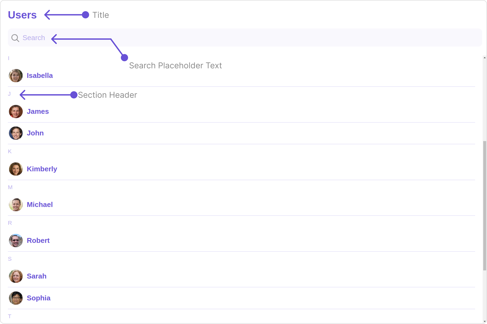

Custom:
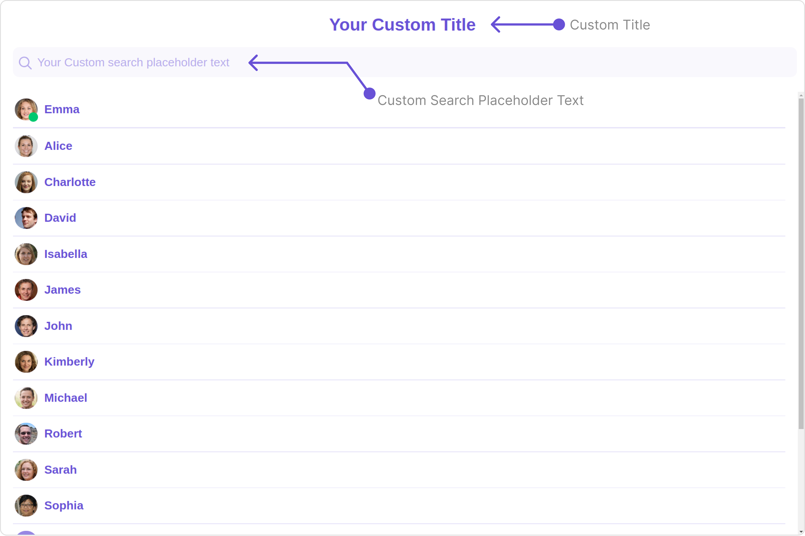

Below is a list of customizations along with corresponding code snippets
| Property | Description | Code |
| -------------------------------------------------------------------------------------------------------- | ---------------------------------------------------------------------------------------------------------------------------------- | ----------------------------------------------------------- |
| **title** <a data-tooltip-id="my-tooltip-html-prop"> <span class="material-icons red">report</span> </a> | Used to set title in the app bar | `[title]="title"` |
| **searchPlaceholderText** <a data-tooltip-id="my-tooltip-html-prop"> <span class="material-icons red">report</span> </a>| Used to set search placeholder text | `[searchPlaceholderText ="searchPlaceholderText"` |
| **searchIconURL** | Used to set search Icon in the search field | `[searchIconURL]="searchIconURL"` |
| **loadingIconURL** | Used to set loading Icon | `[loadingIconURL]="loadingIconURL"` |
| **closeButtonIconURL** <a data-tooltip-id="my-tooltip-html-prop"> <span class="material-icons red">report</span> </a> | Used to set the close button Icon | `[closeButtonIconURL]="closeButtonIconURL"` |
| **hideSearch** | Used to toggle visibility for search box | `[hideSearch]="true"` |
| **hideError** | Used to hide error on fetching users | `[hideError]="true"` |
| **hideSeparator** | Used to hide the divider separating the user items | `[hideSeparator]="true"` |
| **disableUsersPresence** | Used to control visibility of user indicator shown if user is online | `[disableUsersPresence]="true"` |
| **disableLoadingState** <a data-tooltip-id="my-tooltip-html-prop"> <span class="material-icons red">report</span> </a> | Used to control visibility of loading state | `[disableLoadingState]="true"` |
| **emptyStateText** <a data-tooltip-id="my-tooltip-html-prop"> <span class="material-icons red">report</span> </a> | Used to set a custom text response when fetching the users has returned an empty list | `[emptyStateText]="emptyStateText"` |
| **errorStateText** <a data-tooltip-id="my-tooltip-html-prop"> <span class="material-icons red">report</span> </a>| Used to set a custom text response when some error occurs on fetching the list of users | `[errorStateText]="errorStateText"` |
| **activeUser** <a data-tooltip-id="my-tooltip-html-prop"> <span class="material-icons red">report</span> </a> | Used to set the active user | `[activeUser]="userObject"` |
| **userPresencePlacement** <a data-tooltip-id="my-tooltip-html-prop"> <span class="material-icons red">report</span> </a> | The `userPresencePlacement` property determines the placement of user presence indicators, allowing options for either "right" or "bottom" positioning. | `[userPresencePlacement]="userPresencePlacement"` |
| **searchKeyword** <a data-tooltip-id="my-tooltip-html-prop"> <span class="material-icons red">report</span> </a> | The `searchKeyword` property facilitates searching/filtering based on the provided keyword, enhancing the functionality of the component. | `[searchKeyword]="searchKeyword"` |

---

### Advance

For advanced-level customization, you can set custom views to the component. This lets you tailor each aspect of the component to fit your exact needs and application aesthetics. You can create and define your views, layouts, and UI elements and then incorporate those into the component.

---

#### ListItemView

With this property, you can assign a custom ListItem to the Users Component.

**Example**

Default:
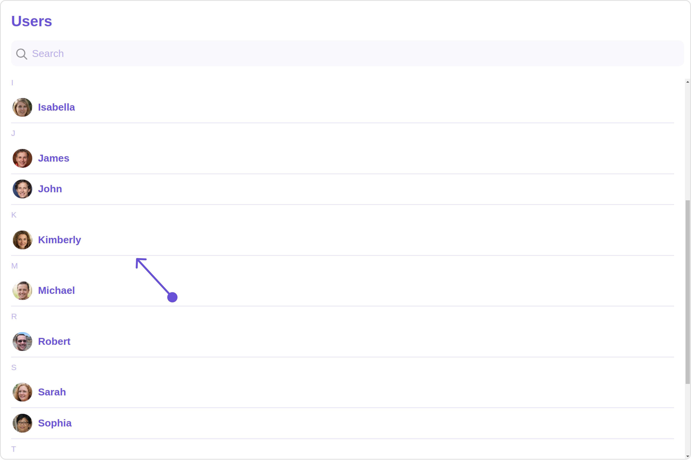

Custom:
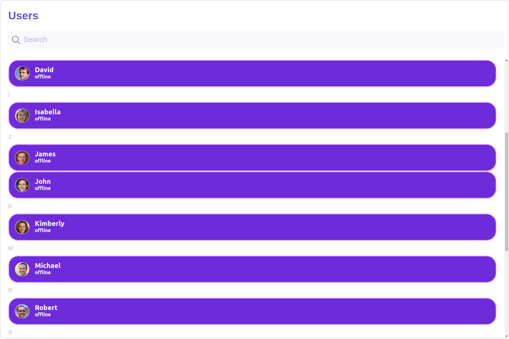

<Tabs>
<TabItem value="app.component.ts" label="app.component.ts">

```javascript
import { CometChat } from '@cometchat/chat-sdk-javascript';
import { Component, OnInit } from '@angular/core';
import { CometChatThemeService, CometChatUIKit } from '@cometchat/chat-uikit-angular';
import "@cometchat/uikit-elements";

@Component({
  selector: 'app-root',
  templateUrl: './app.component.html',
  styleUrls: ['./app.component.css']
})
export class AppComponent {

  constructor(private themeService:CometChatThemeService) {
    themeService.theme.palette.setMode("light")
    themeService.theme.palette.setPrimary({ light: "#6851D6", dark: "#6851D6" })
  }
  onLogin(UID?: any) {
    CometChatUIKit.login({ uid: UID }).then(
      (user) => {
        setTimeout(() => {
          window.location.reload();
        }, 1000);
      },
      (error) => {
        console.log("Login failed with exception:", { error });
      }
    );
  }
}
```

</TabItem>
<TabItem value="ts" label="app.component.html">

```html
<div class="fullwidth">
  <cometchat-users [listItemView]="listItemViewTemplateUser"></cometchat-users>
</div>

<ng-template #listItemViewTemplateUser let-user>
  <div
    [ngStyle]="{
      display: 'flex',
      alignItems: 'left',
      padding: '10px',
      border: '2px solid #e9baff',
      borderRadius: '20px',
      background: '#ffffff'
    }"
  >
    <cometchat-avatar
      [image]="user.getAvatar()"
      [name]="user.getName()"
    ></cometchat-avatar>
    <div [ngStyle]="{ display: 'flex', paddingLeft: '10px' }">
      <div
        [ngStyle]="{
          fontWeight: 'bold',
          color: '#937aff',
          fontSize: '14px',
          marginTop: '5px'
        }"
      >
        {{ user.getName() }}
        <div
          [ngStyle]="{
            color: '#cfc4ff',
            fontSize: '10px',
            textAlign: 'left'
          }"
        >
          {{ user.getStatus() }}
        </div>
      </div>
    </div>
  </div>
</ng-template>
```

</TabItem>
</Tabs>

---

#### SubtitleView

You can customize the subtitle view for each user item to meet your requirements

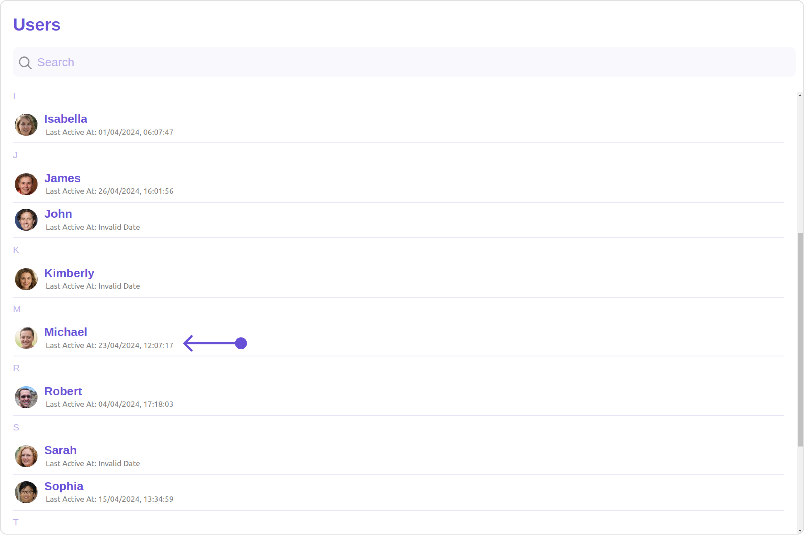

<Tabs>
<TabItem value="app.component.ts" label="app.component.ts">

```javascript
import { CometChat } from '@cometchat/chat-sdk-javascript';
import { Component, OnInit } from '@angular/core';
import { CometChatThemeService, CometChatUIKit } from '@cometchat/chat-uikit-angular';
import "@cometchat/uikit-elements";

@Component({
  selector: 'app-root',
  templateUrl: './app.component.html',
  styleUrls: ['./app.component.css']
})
export class AppComponent {

  constructor(private themeService:CometChatThemeService) {
    themeService.theme.palette.setMode("light")
    themeService.theme.palette.setPrimary({ light: "#6851D6", dark: "#6851D6" })
  }
  onLogin(UID?: any) {
    CometChatUIKit.login({ uid: UID }).then(
      (user) => {
        setTimeout(() => {
          window.location.reload();
        }, 1000);
      },
      (error) => {
        console.log("Login failed with exception:", { error });
      }
    );
  }
}
```

</TabItem>
<TabItem value="ts" label="app.component.html">

```html
<div class="fullwidth">
  <cometchat-users [subtitleView]="subtitleTemplateUser"></cometchat-users>
</div>
<ng-template #subtitleTemplateUser let-user>
  <div
    [ngStyle]="{
    display: 'flex',
    alignItems: 'left',
    padding: '10px',
    fontSize: '10px'
  }"
  >
    <div [ngStyle]="{ color: 'gray' }">Your Custom Subtitle View</div>
  </div>
</ng-template>
```

</TabItem>
</Tabs>

---

#### LoadingStateView

You can set a custom loader view using `loadingStateView` to match the loading view of your app.

Default:
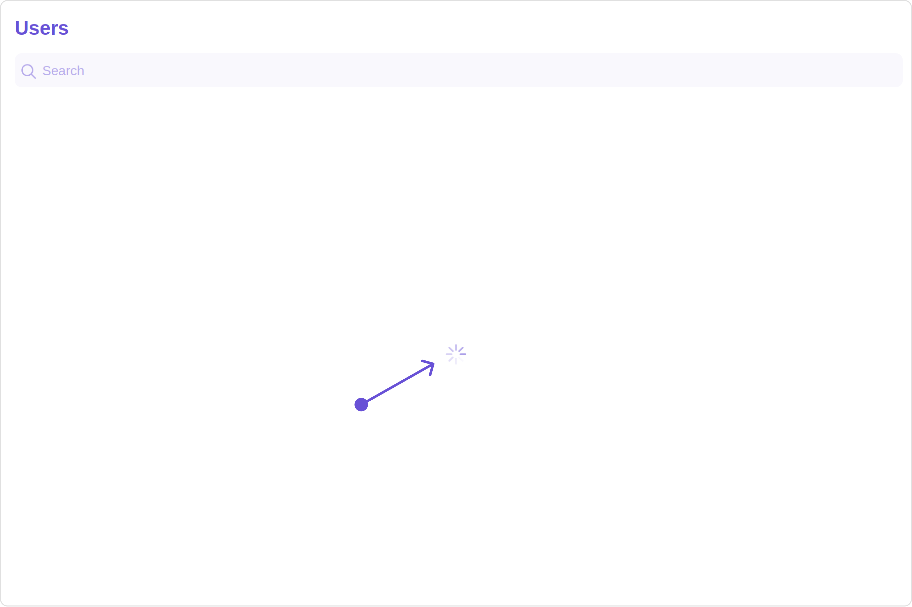

Custom:
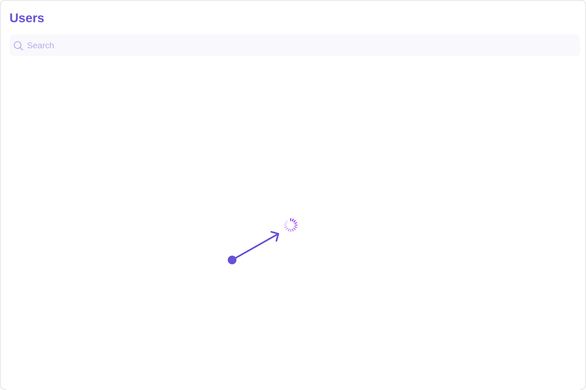

<Tabs>
<TabItem value="app.component.ts" label="app.component.ts">

```javascript
import { CometChat } from '@cometchat/chat-sdk-javascript';
import { Component, OnInit } from '@angular/core';
import { CometChatThemeService, CometChatUIKit } from '@cometchat/chat-uikit-angular';
import "@cometchat/uikit-elements";

@Component({
  selector: 'app-root',
  templateUrl: './app.component.html',
  styleUrls: ['./app.component.css']
})
export class AppComponent {

  constructor(private themeService:CometChatThemeService) {
    themeService.theme.palette.setMode("light")
    themeService.theme.palette.setPrimary({ light: "#6851D6", dark: "#6851D6" })
  }
  onLogin(UID?: any) {
    CometChatUIKit.login({ uid: UID }).then(
      (user) => {
        setTimeout(() => {
          window.location.reload();
        }, 1000);
      },
      (error) => {
        console.log("Login failed with exception:", { error });
      }
    );
  }
}
```

</TabItem>
<TabItem value="ts" label="app.component.html">

```html
<div class="fullwidth">
  <cometchat-users [loadingStateView]="loadingStateView"></cometchat-users>
</div>
<ng-template #loadingStateView>
  <cometchat-loader
    iconURL="icon"
    loaderStyle="getLoaderStyle()"
  ></cometchat-loader>
</ng-template>
```

</TabItem>
</Tabs>

---

#### EmptyStateView

You can set a custom `EmptyStateView` using `emptyStateView` to match the empty view of your app.

Default:
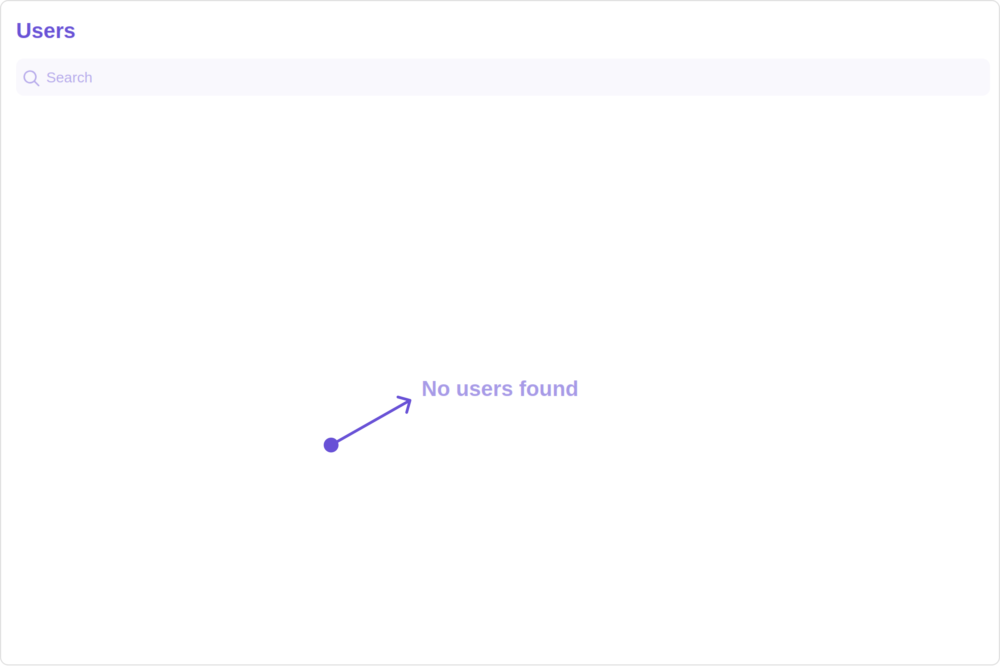

Custom:
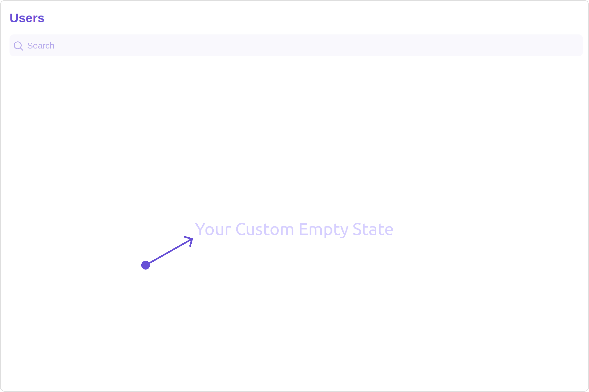

<Tabs>
<TabItem value="app.component.ts" label="app.component.ts">

```javascript
import { CometChat } from '@cometchat/chat-sdk-javascript';
import { Component, OnInit } from '@angular/core';
import { CometChatThemeService, CometChatUIKit } from '@cometchat/chat-uikit-angular';
import "@cometchat/uikit-elements";

@Component({
  selector: 'app-root',
  templateUrl: './app.component.html',
  styleUrls: ['./app.component.css']
})
export class AppComponent {

  constructor(private themeService:CometChatThemeService) {
    themeService.theme.palette.setMode("light")
    themeService.theme.palette.setPrimary({ light: "#6851D6", dark: "#6851D6" })
  }
  onLogin(UID?: any) {
    CometChatUIKit.login({ uid: UID }).then(
      (user) => {
        setTimeout(() => {
          window.location.reload();
        }, 1000);
      },
      (error) => {
        console.log("Login failed with exception:", { error });
      }
    );
  }
}
```

</TabItem>
<TabItem value="ts" label="app.component.html">

```html
<div class="fullwidth">
  <cometchat-users [emptyStateView]="emptyStateView"></cometchat-users>
</div>
<ng-template #emptyStateView>
  <div>Your Custom Empty State</div>
</ng-template>
```

</TabItem>
</Tabs>

---

#### ErrorStateView

You can set a custom `ErrorStateView` using `errorStateView` to match the empty view of your app.

Default:
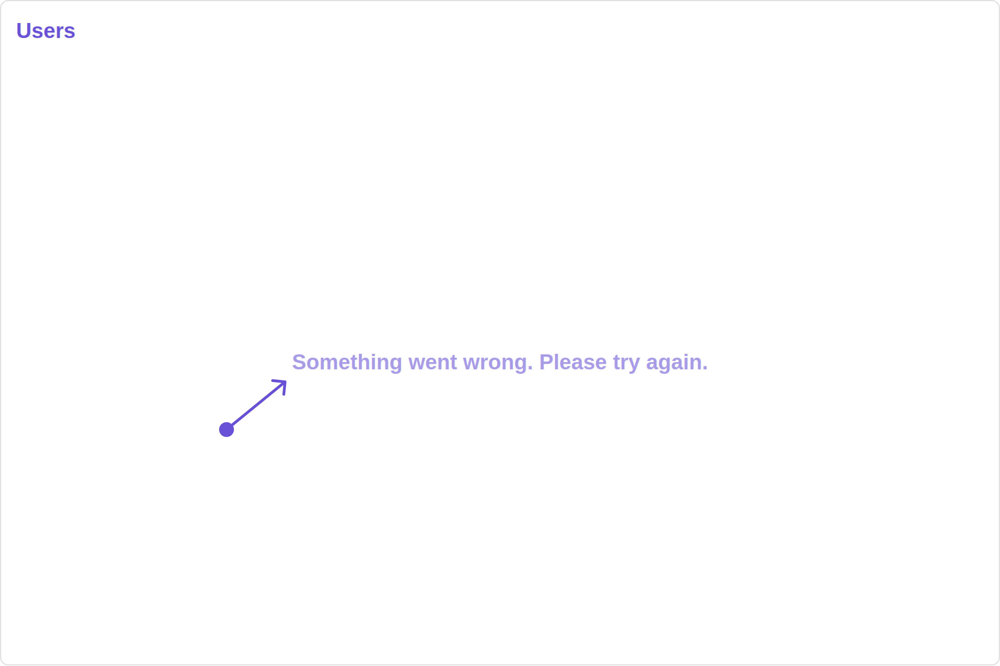

Custom:
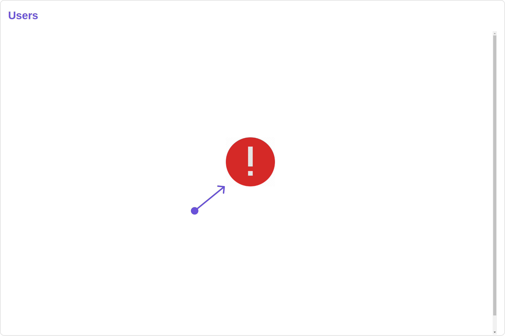

<Tabs>
<TabItem value="app.component.ts" label="app.component.ts">

```javascript
import { CometChat } from '@cometchat/chat-sdk-javascript';
import { Component, OnInit } from '@angular/core';
import { CometChatThemeService, CometChatUIKit } from '@cometchat/chat-uikit-angular';
import "@cometchat/uikit-elements";

@Component({
  selector: 'app-root',
  templateUrl: './app.component.html',
  styleUrls: ['./app.component.css']
})
export class AppComponent {

  constructor(private themeService:CometChatThemeService) {
    themeService.theme.palette.setMode("light")
    themeService.theme.palette.setPrimary({ light: "#6851D6", dark: "#6851D6" })
  }
  onLogin(UID?: any) {
    CometChatUIKit.login({ uid: UID }).then(
      (user) => {
        setTimeout(() => {
          window.location.reload();
        }, 1000);
      },
      (error) => {
        console.log("Login failed with exception:", { error });
      }
    );
  }
}
```

</TabItem>
<TabItem value="ts" label="app.component.html">

```html
<div class="fullwidth">
  <cometchat-users [errorStateView]="errorStateView"></cometchat-users>
</div>
<ng-template #errorStateView>
  <div style="height: 100vh; width: 100vw">
    
  </div>
</ng-template>
```

</TabItem>
</Tabs>

---

#### Menus

You can set the Custom Menu view to add more options to the Users component.

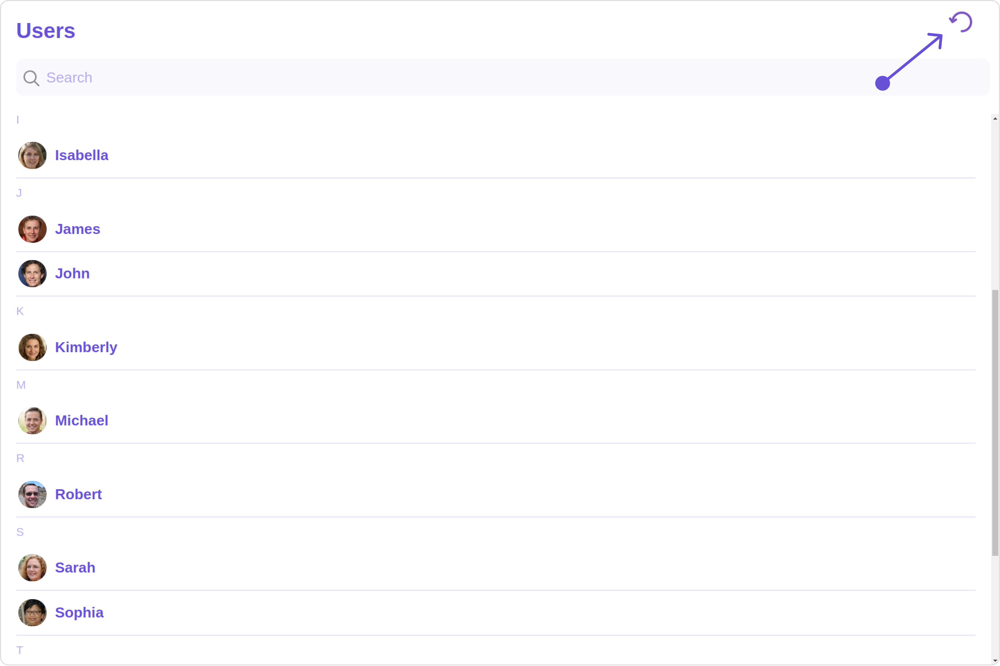

<Tabs>
<TabItem value="app.component.ts" label="app.component.ts">

```javascript
import { CometChat } from '@cometchat/chat-sdk-javascript';
import { Component, OnInit } from '@angular/core';
import { CometChatThemeService, CometChatUIKit } from '@cometchat/chat-uikit-angular';
import "@cometchat/uikit-elements";

@Component({
  selector: 'app-root',
  templateUrl: './app.component.html',
  styleUrls: ['./app.component.css']
})
export class AppComponent {

  constructor(private themeService:CometChatThemeService) {
    themeService.theme.palette.setMode("light")
    themeService.theme.palette.setPrimary({ light: "#6851D6", dark: "#6851D6" })
  }
  handleReload(): void {
    window.location.reload();
  }

  getButtonStyle() {
    return {
      height: '20px',
      width: '20px',
      border: 'none',
      borderRadius: '0',
      background: 'transparent'
    };
  }
  getButtonIconStyle() {
    return {
      color: '#7E57C2'
    };
  }
  onLogin(UID?: any) {
    CometChatUIKit.login({ uid: UID }).then(
      (user) => {
        setTimeout(() => {
          window.location.reload();
        }, 1000);
      },
      (error) => {
        console.log("Login failed with exception:", { error });
      }
    );
  }
}
```

</TabItem>
<TabItem value="ts" label="app.component.html">

```html
<div class="fullwidth">
  <cometchat-users [menu]="menuTemplate"></cometchat-users>
</div>
<ng-template #menuTemplate>
  <div style="margin-right: 20px;">
    <button [ngStyle]="getButtonStyle()" (click)="handleReload()">
      
    </button>
  </div>
</ng-template>
```

</TabItem>
</Tabs>

---

#### Options

You can set the Custom options to the Users component.

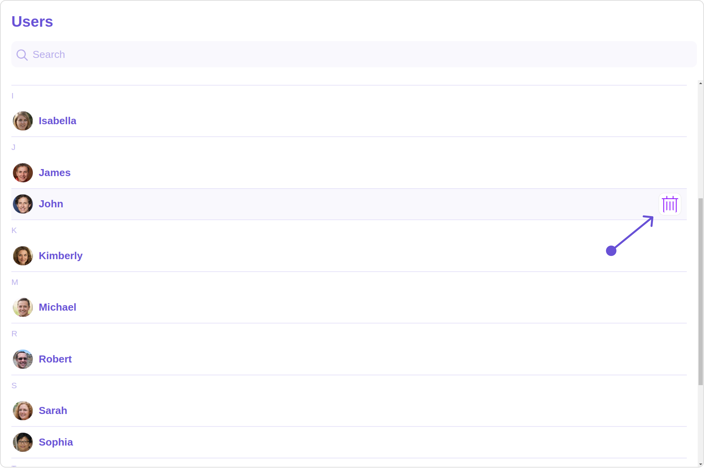

<Tabs>
<TabItem value="app.component.ts" label="app.component.ts">

```javascript
import { CometChat } from '@cometchat/chat-sdk-javascript';
import { Component, OnInit } from '@angular/core';
import { CometChatThemeService, CometChatUIKit } from '@cometchat/chat-uikit-angular';
import { CometChatOption } from '@cometchat/uikit-resources';
import "@cometchat/uikit-elements";

@Component({
  selector: 'app-root',
  templateUrl: './app.component.html',
  styleUrls: ['./app.component.css']
})
export class AppComponent {

  constructor(private themeService:CometChatThemeService) {
    themeService.theme.palette.setMode("light")
    themeService.theme.palette.setPrimary({ light: "#6851D6", dark: "#6851D6" })
  }
  getOptions = (member: CometChat.User) => {
    const customOptions = [
      new CometChatOption({
        id: "1",
        title: "Title",
        iconURL: "icon",
        backgroundColor: "red",
        onClick: () => {
          console.log("Custom option clicked for user:", memeber);
        },
      }),
    ];
    return customOptions;
  };
  onLogin(UID?: any) {
    CometChatUIKit.login({ uid: UID }).then(
      (user) => {
        setTimeout(() => {
          window.location.reload();
        }, 1000);
      },
      (error) => {
        console.log("Login failed with exception:", { error });
      }
    );
  }
}
```

</TabItem>
<TabItem value="ts" label="app.component.html">

```html
<div class="fullwidth">
  <cometchat-users [options]="getOptions"></cometchat-users>
</div>
```

</TabItem>
</Tabs>

import { Tooltip } from 'react-tooltip'
import 'react-tooltip/dist/react-tooltip.css'

<Tooltip
  id="my-tooltip-html-prop"
  html="Not available in UsersConfiguration"
/>
